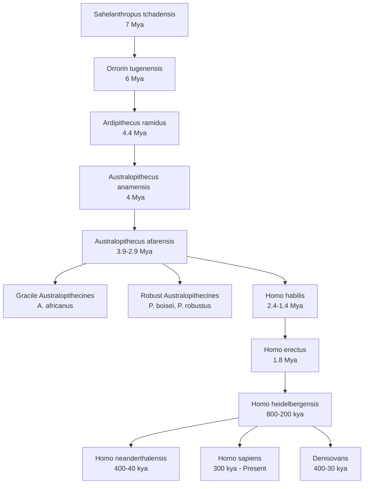

# Fossils and Primate Evolution

## Syllabus Mapping
* Paper I, Unit 1.6: Phylogenetic status, characteristics and geographical distribution of Fossils

---

## Phylogenetic Tree of Human Evolution

> [!NOTE]
> Below is a simplified timeline and phylogenetic relationship of major hominin groups for your Mains answer writing.

---

## 1. Pre-Australopithecines (The Earliest Hominins)
Before the famous *Australopithecus*, several very early species showed a mosaic of ape-like and human-like traits, primarily the beginnings of bipedalism.

1. **Sahelanthropus tchadensis (7-6 Mya):** Found in Chad (Central Africa). It had a massive brow ridge and small brain (apelike), but smaller canines and thicker enamel (hominin-like). The foramen magnum suggests it might have been bipedal.
2. **Orrorin tugenensis (~6 Mya):** Found in Kenya. Thick enamel on molars and a femur shape that strongly suggests upright walking.
3. **Ardipithecus ramidus (4.4 Mya):** Found in Ethiopia ("Ardi"). It possessed a mosaic of traits: a grasping big toe (arboreal adaptation) but a pelvis adapted for partial bipedalism. It indicates that bipedalism evolved in a woodland environment, not an open savanna.

---

## 2. The Australopithecines (4.2 – 1.0 Mya)
First discovered by Raymond Dart in 1924 (*Taung Child*). They radiated across South and East Africa. They are divided into two distinct evolutionary grades based on masticatory (chewing) adaptations.

### Gracile vs. Robust Forms
| Trait | Gracile (e.g., *A. afarensis, A. africanus*) | Robust (e.g., *P. boisei, P. robustus*) |
| :--- | :--- | :--- |
| **Build** | Slender, 3.5 - 4 ft tall | Heavier, 4 - 4.5 ft tall |
| **Skull** | Smoother, no sagittal crest | Sagittal crest present (for huge jaw muscles) |
| **Face & Jaws** | Prognathic face, smaller jaws | Flat face, massive jaws and cheekbones |
| **Teeth** | Balanced incisors and molars | Huge molars ("Nutcracker Man"), small incisors |
| **Diet** | Omnivorous | Specialized hard-object feeding (nuts, tubers) |
| **Evolutionary Fate** | Gave rise to Genus *Homo* | Evolutionary dead end due to overspecialization |

> [!TIP]
> **Key Fossil:** *Lucy (Australopithecus afarensis)*. Discovered by Donald Johanson in Ethiopia. She proved that bipedalism preceded brain expansion. Her brain was small (~400cc) but her pelvis and femur were fully adapted for upright walking.

---

## 3. Homo habilis ("Handy Man")
Appeared around **2.0 Mya** in East and South Africa. 
* **Physical Traits:** Larger brain (510–700 cc), reduced brow ridges, more parabolic dental arcade, and a less protruding face than Australopithecus.
* **Culture (Oldowan Tradition):** The first definitive stone tool makers. Tools were made using direct percussion to create simple core tools (choppers) and sharp flakes.
* **Subsistence:** They were primarily scavengers and gatherers, using sharp flakes to cut meat from carcasses left by large predators, and hammerstones to crack bones for marrow.

---

## 4. Homo erectus (The First Globalizer)
Appeared ~1.8 Mya. *H. erectus* was the first hominin to leave Africa, colonizing Asia (Java Man, Peking Man) and Europe.

* **Anatomical Changes:** Brain size expanded significantly (700–1200 cc). Body proportions became fully modern (longer legs, shorter arms), indicating a commitment to terrestrial striding bipedalism. Thick cranial bones, a prominent supraorbital torus (brow ridge), and a sagittal keel.
* **Culture (Acheulian Tradition):** Characterized by the **bifacial handaxe** (a symmetrical, teardrop-shaped multi-purpose tool).
* **Fire & Shelter:** The first hominin to use controlled fire (evidence at Zhoukoudian, China). Fire allowed them to cook food (saving energy for brain growth), keep warm in colder climates, and extend the day. They also built rudimentary shelters (e.g., Terra Amata, France).

---

## 5. Transitional Forms: Homo heidelbergensis (Pre-modern Humans)
Often referred to as Archaic *Homo sapiens*. They existed between **850,000 to 150,000 years ago** and bridge the gap between *H. erectus* and both Neanderthals and modern *H. sapiens*.

* **Key Fossils:** *Rhodesian Man* (Kabwe, Zambia), *Bodo* (Ethiopia), and fossils from Sima de los Huesos (Spain).
* **Features:** Larger brains (~1300 cc) and a more rounded braincase than *erectus*, but retaining massive brow ridges and thick skulls. 

---

## 6. Neanderthal Man (*Homo neanderthalensis*)
Existed roughly **300,000 to 30,000 years ago**, primarily in Europe and Western Asia. They were highly adapted to the extreme cold of the Pleistocene Ice Age.

### Physical Characteristics
* **Brain:** Larger average cranial capacity than modern humans (~1520 cc), likely a metabolic adaptation to cold.
* **Skull:** Long and low vault, retreating forehead, prominent mid-facial prognathism, large broad nose (to warm cold air), and an occipital bun.
* **Post-cranial:** Stocky, heavily muscled, barrel-chested, and short-limbed (Allen's and Bergmann's Rules for cold adaptation).

### Culture
* **Tools:** **Mousterian Tradition**, utilizing the *Levallois technique* to create highly standardized flake tools (scrapers, points).
* **Religion & Society:** First evidence of intentional burials with grave goods and flowers (e.g., Shanidar Cave, Iraq). They cared for their sick and elderly (e.g., La Chapelle-aux-Saints "Old Man").
* **Extinction:** Disappeared ~39,000 years ago. Theories include being outcompeted by *Homo sapiens*, lack of adaptability to a warming climate, and partial assimilation/interbreeding.

> [!IMPORTANT]
> **Neanderthal DNA:** Genetic sequencing shows that modern humans (non-Africans) share 1–4% of their nuclear DNA with Neanderthals, proving that interbreeding (assimilation) occurred when modern humans migrated out of Africa into the Middle East/Europe.

---

## 7. Anatomically Modern Humans (*Homo sapiens*)
The earliest anatomically modern humans appeared in Africa around **195,000 years ago** (e.g., Omo I in Ethiopia) before dispersing globally. 

### Key Fossil Finds
1. **Cro-Magnon (France):** Found in 1868. Fully modern anatomy (high vertical forehead, distinct chin, small brow ridges). Associated with advanced Upper Paleolithic art and tools.
2. **Grimaldi (Italy):** Two gracile skeletons initially (and erroneously) classified as "negroid" due to prognathism and wide nasal openings. They show the diversity of early modern Europeans.
3. **Chancelade (France):** A short-statured skeleton buried in a flexed position with red ochre.

### Theories of Modern Human Origins
1. **Out of Africa (Replacement) Model:** Modern humans evolved *only* in Africa. They migrated outwards and completely replaced pre-existing archaic populations (Neanderthals, erectus) globally without interbreeding. Supported by mtDNA ("Mitochondrial Eve").
2. **Multiregional Continuity Model:** Archaic populations across Africa, Europe, and Asia evolved into modern humans simultaneously due to constant gene flow between regions.
3. **Assimilation Model (Current Consensus):** Modern humans evolved in Africa, migrated outwards, and heavily interbred with archaic populations (like Neanderthals and Denisovans) before those archaic populations faded away. 

---

## 8. Recent Hominin Discoveries (UPSC Value Addition)
Recent finds have complicated the linear human evolutionary tree, showing that multiple species of *Homo* co-existed simultaneously until very recently.

1. **Homo floresiensis ("The Hobbit"):** Discovered in 2003 on the island of Flores, Indonesia. Lived around 100,000 to 50,000 years ago. Extremely small stature (~3.5 ft) and tiny brain (~400 cc) due to *Insular Dwarfism* (an evolutionary process where large animals isolated on islands shrink to save resources).
2. **Denisovans:** Identified in 2010 not by morphology, but by DNA extracted from a finger bone in Denisova Cave, Siberia. They are a sister group to Neanderthals. 
   * **Significance:** They interbred with modern humans. Modern Melanesians and Aboriginal Australians carry ~3-5% Denisovan DNA. Modern Tibetans inherited the *EPAS1* gene from Denisovans, which allows them to survive at high altitudes.
3. **Homo naledi:** Discovered in 2013 by Lee Berger in the Rising Star Cave system in South Africa (lived ~300,000 years ago). They had a very small brain but human-like feet and hands. The sheer number of bones found in an inaccessible, dark cave chamber led to a controversial theory that *H. naledi* practiced deliberate disposal of their dead—a cognitive leap previously thought exclusive to larger-brained hominins.

---

## 9. Upper Paleolithic Culture
The arrival of modern *Homo sapiens* brought an explosion of technological and symbolic complexity.
* **Tool Technology:** **Blade technology** (using a punch technique) replaced flake tools. Bone, antler, and ivory were heavily utilized to make harpoons, needles, and the atlatl (spear-thrower).
* **Cultural Sequence (France):** 
    1. *Chatelperronian* (Backed knives)
    2. *Aurignacian* (Steep scrapers, split-based bone points)
    3. *Gravettian* (Venus figurines)
    4. *Solutrean* (Beautifully pressure-flaked laurel leaf points)
    5. *Magdalenian* (Zenith of cave art and bone tools)
* **Art & Symbolism:** Elaborate cave paintings (Chauvet, Lascaux), portable art (Venus figurines for fertility), and the extensive use of red ochre in ritual burials.
