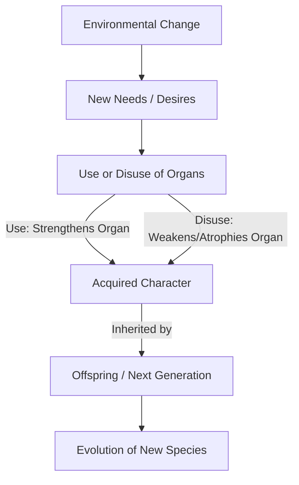
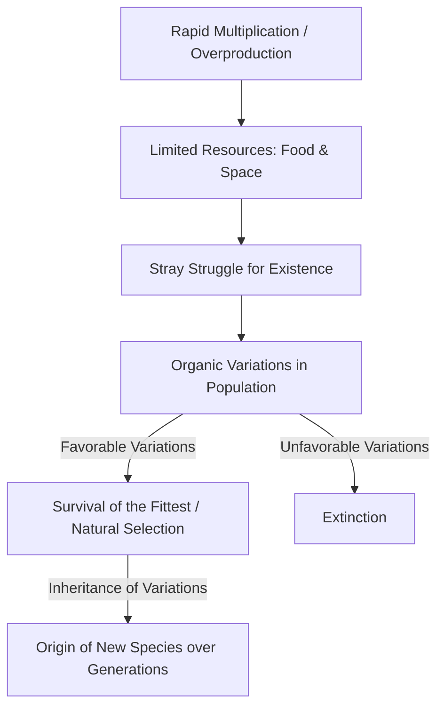
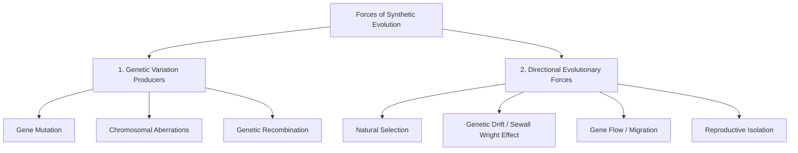
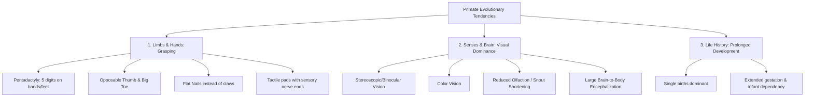
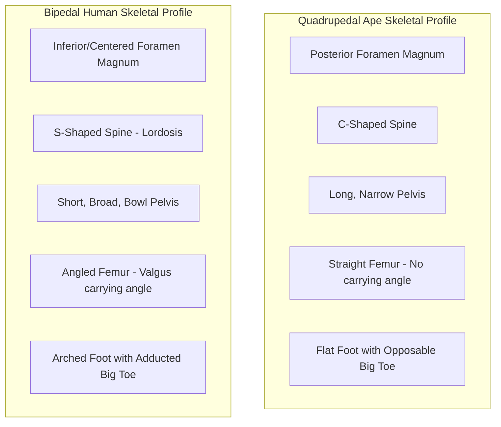
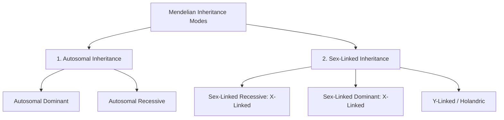
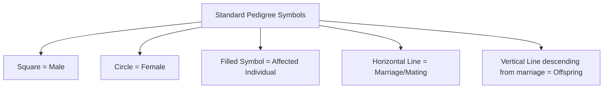
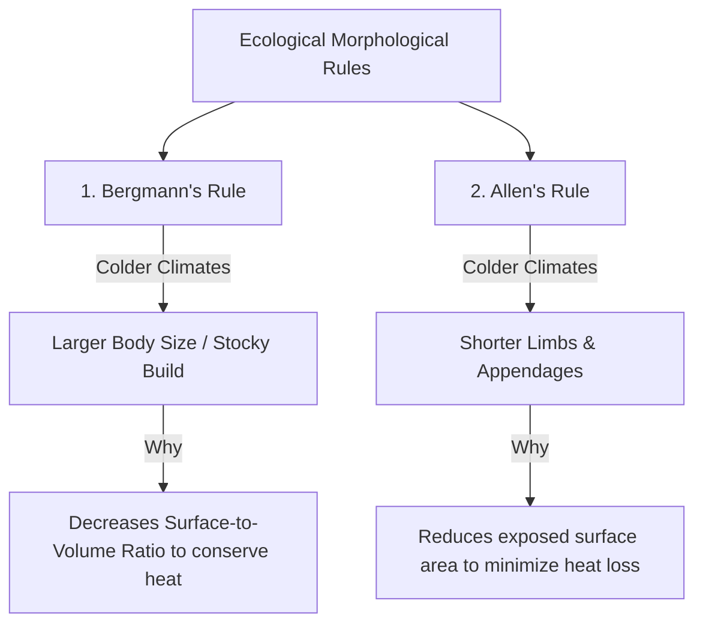
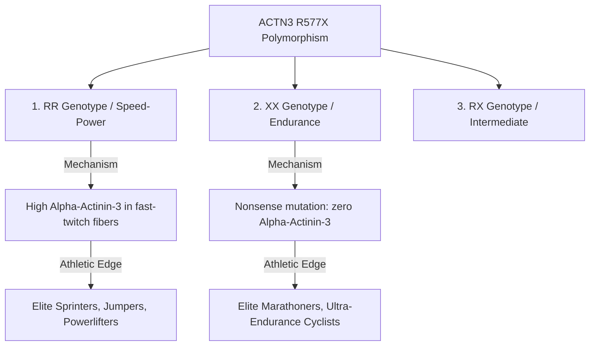

# PAPER I — UNIT 1.4 & 1.5: PHYSICAL ANTHROPOLOGY & EVOLUTION

---

## TOPIC 1: THEORIES OF ORGANIC EVOLUTION (UNIT 1.4)

> [!NOTE]
> **Syllabus Mapping:**
> * Paper I, Unit 1.4: Human Evolution and emergence of Humanity: Theories of Organic Evolution (Lamarckism, Darwinism, Synthetic Theory).
> * Connects with: Unit 9.7 (Microevolution & Macroevolution) and Unit 9.1 (Mendelian Genetics).

---

### I. LAMARCKISM (INHERITANCE OF ACQUIRED CHARACTERS)

Formulated by French naturalist **Jean-Baptiste Lamarck** in his book *Philosophie Zoologique (1809)*.

#### 1. Core Postulates

* **Influence of Environment:** Changing environments present new challenges to organisms, forcing them to alter their behavior and adapt.
* **New Needs and Desires (Besoin):** Environmental changes create new needs, prompting organisms to make conscious efforts to adjust.
* **Use and Disuse of Organs:** 
  * Frequent use of an organ strengthens, enlarges, and develops it (e.g., the long neck of the giraffe stretching to feed on high leaves).
  * Disuse of an organ causes it to weaken, degenerate, and eventually disappear (e.g., the loss of limbs in snakes, flightless wings in ostriches, or blind eyes in cave-dwelling animals).
* **Inheritance of Acquired Characters:** The physical changes acquired by an individual during its lifetime are transmitted directly to its offspring. Over generations, this accumulation of acquired changes leads to the evolution of a new species.

#### 2. Critical Evaluation
* **August Weismann's Germplasm Theory (1892):** Weismann cut off the tails of mice and allowed them to breed to prove that acquired somatic changes cannot be inherited. In his actual historical experiment (published 1889), he conducted this over **5 generations using 68 white mice and 901 offspring** — all born with normal tails. He proved that only changes occurring in the **Germplasm** (sex cells/gametes) are inherited; changes in the **Somatoplasm** (body cells) are not transmitted to offspring.

  > [!NOTE]
  > **🌐 Internet Fact-Check:** Many Indian textbooks (including coaching material) state Weismann used **22 generations**. This is a pedagogical simplification. The actual historical record (Wikipedia, ASU Biology, NIH) shows Weismann's primary experiment was conducted over **5 generations** (68 mice, 901 offspring). However, since **the "22 generations" version is universally cited in UPSC coaching material and appears in standard Indian anthropology textbooks**, it is safe to write in your exam. The conclusion — that acquired characters are NOT inherited — remains the same regardless of the number of generations cited.
* **Modern Genetics Refutation:** The discovery of DNA and central dogma proved that information flows from *DNA $\rightarrow$ RNA $\rightarrow$ Protein*, and somatic modifications cannot rewrite the genetic sequence of gametes.

---

### II. DARWINISM (THEORY OF NATURAL SELECTION)

Formulated by **Charles Darwin** in his landmark book *On the Origin of Species by Means of Natural Selection (1859)*.

#### 1. Core Postulates

* **Rapid Multiplication (Overproduction):** All organisms possess a high reproductive potential, producing far more offspring than can possibly survive (e.g., millions of eggs laid by fish).
* **Struggle for Existence:** Since environmental resources (food, space, mates) are finite, a fierce struggle for survival ensues. This struggle is:
  * *Intraspecific:* Between individuals of the same species (most intense).
  * *Interspecific:* Between individuals of different species.
  * *Environmental:* Against harsh climatic conditions, droughts, or floods.
* **Universal Presence of Variations:** No two individuals in a species are identical. Variations exist naturally within every population.
* **Survival of the Fittest (Natural Selection):** Individuals possessing **favorable variations** are better adapted to their environment. They survive the struggle, reproduce successfully, and pass these favorable traits to their offspring. Individuals with unfavorable variations perish.
* **Origin of Species:** Over vast geological epochs, the continuous accumulation of favorable variations, steered by natural selection, transforms an ancestral population into a completely new species.

#### 2. Critical Evaluation & Limitations
* **The "Arrival" of the Fittest:** Darwinism explains the *survival* of the fittest, but could not explain the *arrival* (the origin) of the variations themselves.
* **Lack of Genetic Knowledge:** Because genetics was completely unknown in 1859, Darwin could not distinguish between **heritable genetic variations** and **non-heritable environmental somatic variations**.
* **Pangenesis Theory Error:** In his attempt to explain inheritance, Darwin proposed the incorrect "Pangenesis" hypothesis (gemmules from body parts accumulating in sex cells), which was later disproven.
* **Oversimplified Focus on Speciation:** Overemphasized gradualism, failing to account for rapid bursts of speciation (punctuated equilibrium) or non-adaptive traits.

> [!NOTE]
> **Academic Context: The Evolutionary Missing Link — Darwin's Pangenesis vs. Mendel's Genetics (For Context Building)**
> To understand the history of evolutionary thought, one must grasp why Darwin failed to solve the inheritance mechanism and how Gregor Mendel's work rescued his theory:
> * **Darwin's Pangenesis (Blending Inheritance):** Darwin proposed that every cell of the body sheds minute hereditary particles called **"gemmules"** (or plastules), which travel through the bloodstream and accumulate in the reproductive organs (gametes). When parents mate, their gemmules supposedly *blend* in the offspring. 
> * **The Flaw of Blending:** If inheritance blended like paint (e.g., black and white yielding grey), any new, favorable, adaptive variation would be diluted and washed out within a few generations of backcrossing with the wild-type population. Under blending, natural selection would have nothing to act upon, as variations would constantly disappear.
> * **Mendel's Particulate Solution (1866):** Gregor Mendel solved this by showing that inheritance is **particulate**, not blending. Hereditary characteristics are controlled by discrete "factors" (now called **genes**) that retain their individual integrity across generations without blending (Law of Segregation). Even recessiveness remains hidden (latent) in heterozygotes ($Aa$) and re-emerges intact in a homozygote ($aa$).
> * **The Synthesis:** It was only when Mendelian genetics was reconciled with Darwinian natural selection in the 1930s (by Ronald Fisher, J.B.S. Haldane, and Sewall Wright using mathematical models of population genetics) that the **Modern Synthetic Theory** was born, proving that natural selection acts on particulate gene frequencies in a gene pool.

---

### III. SYNTHETIC THEORY OF EVOLUTION (NEO-DARWINISM)

Developed in the 1930s and 1940s by geneticists and evolutionary biologists (**Theodosius Dobzhansky, Ernst Mayr, Julian Huxley, George Gaylord Simpson**). 
* **Definition:** It synthesizes **Darwinian Natural Selection** with **Mendelian Genetics, Population Genetics, and Paleontology**. It redefines evolution as **any change in the allele frequency within a population's gene pool over generations**.

#### 1. The Core Forces of the Synthetic Theory

#### A. Genetic Variation Producers (The Raw Materials)
* **Gene Mutation:** Random, spontaneous changes in the nucleotide sequence of DNA that create completely new alleles (the ultimate source of all genetic variation).
* **Chromosomal Aberrations:** Structural changes (duplications, deletions, inversions, translocations) or numerical changes (aneuploidy, polyploidy) in chromosomes.
* **Genetic Recombination:** The shuffling of existing maternal and paternal alleles during sexual reproduction (via crossing over during meiosis, independent assortment, and random fertilization).

#### B. Directional & Dynamic Forces (The Steering Mechanisms)

> [!TIP]
> **Mnemonic for the 7 Forces of Synthetic Theory:** **MR. C. N. D. F. R.** (Mr. C. Never Drives Fast, Right?)
> * **M**utation, **R**ecombination, **C**hromosomal Aberrations, **N**atural Selection, Genetic **D**rift, Gene **F**low, **R**eproductive Isolation.
> 
> **Beginner's Analogy:** Think of a restaurant. The *Variation Producers* (Mutation, Recombination) are the adventurous chefs inventing random new dishes (alleles). The *Directional Forces* (Natural Selection) are the harsh food critics deciding which dishes stay on the menu (survival) and which get thrown out (extinction).

* **Natural Selection:** Re-defined as **differential reproduction**. Favorable genotypes produce a higher percentage of viable offspring in the next generation, gradually shifting the allele frequencies of the population. It is classified into three types:
  1. *Stabilizing Selection:* Favors intermediate phenotypes, acting against extreme variations (e.g., human birth weights).
  2. *Directional Selection:* Shifts the population toward one extreme phenotype (e.g., increase in human brain size).
  3. *Disruptive/Diversifying Selection:* Favors both extreme phenotypes over the intermediate one, splitting the population.
* **Genetic Drift (Sewall Wright Effect):** Spontaneous, random fluctuations in allele frequencies in **small, isolated populations** purely due to chance, unrelated to natural selection. It manifests in two ways:
  * *Founder Effect:* A small group splits from a large population to colonize a new area, carrying only a fraction of the original genetic diversity.
    > * **UPSC Value Addition (Indian Context):** Endogamous caste groups and isolated tribal populations in India are textbook examples of Founder Effects. For example, the high frequency of prolonged paralysis following certain anesthesia in the **Vysya** community of Andhra Pradesh is due to a historical founder effect and strict endogamy, severely restricting their gene pool.
  * *Bottleneck Effect:* A catastrophic event (famine, epidemic) drastically reduces population size, leaving a tiny genetic pool that changes the genetic structure of the survivors.
* **Gene Flow (Migration):** The exchange of alleles between separate populations due to the migration of breeding individuals, reducing genetic differences between populations.
* **Reproductive Isolation:** The establishment of biological barriers (pre-zygotic like behavioral/temporal isolation, or post-zygotic like hybrid sterility) that prevent two populations from interbreeding, allowing them to diverge into separate species.

---

### IV. GENETIC MECHANISMS OF MICROEVOLUTION AND MACROEVOLUTION

| Evolutionary Level | Microevolution | Macroevolution |
| :--- | :--- | :--- |
| **Definition** | Small-scale genetic changes occurring **within a single species** or population over a short time. | Large-scale evolutionary transformations occurring **above the species level** over vast geological epochs. |
| **Genetic Shift** | Minor changes in **allele frequencies** within the existing gene pool of a population. | Major structural and morphological changes leading to the origin of **new genera, families, or orders**. |
| **Primary Forces** | Mutation, Gene Flow, Natural Selection, and Genetic Drift. | Accumulation of microevolutionary changes, mass extinctions, adaptive radiations, and major chromosomal transformations. |
| **Examples** | Development of industrial melanism in peppered moths; development of sickle-cell allele frequency in malaria-endemic zones; lactose tolerance in pastoralist humans. | The evolution of bipedal hominids from quadrupedal apes; the transition of reptiles to birds; the adaptive radiation of mammals after the dinosaur extinction. |

---

### V. UPSC PREVIOUS YEAR QUESTIONS (PYQs) & ANSWER BLUEPRINTS

---

#### PYQ 1: Elucidate how Darwin and post-Darwin theories of evolution resulted in the development of the Synthetic theory of evolution. [2020, 15 Marks]

* **Introduction (Approx. 40 words):** The quest to explain the mechanics of organic evolution progressed from Lamarck's acquired traits to Darwin's natural selection. However, Darwin’s inability to explain the source of variations led to post-Darwinian genetic discoveries, culminating in the integrated **Synthetic Theory of Evolution** (Neo-Darwinism) in the mid-20th century.
* **Body Skeleton:**
  * *Darwin's Breakthrough & Gap:* Detail Darwin's Natural Selection (1859)—overproduction, struggle, and survival of the fittest. Highlight his major limitation: he had no mechanism to explain *how* variations are generated or inherited (he fell back on the flawed Pangenesis model).
  * *Post-Darwinian Genetic Developments:*
    * **Mendel's Laws (1900 Rediscovery):** Provided the particulate mechanism of inheritance (factors/genes do not blend).
    * **Hugo de Vries' Mutation Theory (1901):** Identified sudden, heritable changes (mutations) as the true source of new variations.
    * **Population Genetics (Fisher, Haldane, Wright):** Mathematical proof that evolution is a change in allele frequency within a breeding population.
  * *The Synthesis (Neo-Darwinism):* Explain how Dobzhansky (*Genetics and the Origin of Species, 1937*), Ernst Mayr, and George Simpson synthesized these fields.
  * *Synthesized Mechanism:* Detail the four-fold interaction of **Raw Material Forces** (mutation, recombination) and **Steering Forces** (Natural Selection, Genetic Drift, Reproductive Isolation) that define the modern theory.
* **Conclusion (Approx. 40 words):** By bridging the gap between macro-level Darwinian selection and micro-level Mendelian genetics, the Synthetic Theory successfully unified biology, providing a mathematically robust and universally accepted scientific framework for understanding human and organic evolution.

---
---

## TOPIC 2: PRIMATOLOGY & HUMAN EVOLUTION (UNIT 1.5)

> [!NOTE]
> **Syllabus Mapping:**
> * Paper I, Unit 1.5: Characteristics of Primates; Primate Taxonomy; Primate Behaviour; Tertiary and Quaternary fossil primates; Comparative Anatomy of Man and Apes; Skeletal changes due to erect posture and its implications.

---

### I. CORE CHARACTERISTICS OF THE PRIMATE ORDER

Primates are generalized, unspecialized mammals that possess a suite of evolutionary tendencies rather than a single defining physical feature (**Sherwood Washburn's Evolutionary Trend** concept):

1. **Grasping Extremities (Prehensility):**
   * *Pentadactyly:* Retention of five digits on hands and feet.
   * *Opposability:* Opposable thumb (pollex) and, in non-human primates, a divergent, opposable big toe (hallux) for secure grasping of branches.
   * *Nails:* Flat nails replacing sharp claws (except marmosets/tamarins), exposing sensitive finger ends.
   * *Tactile Pads:* Dermatoglyphics (fingerprints) and dense sensory nerve endings on digits for enhanced sense of touch.
2. **Visual Dominance over Olfaction:**
   * *Stereoscopic Vision:* Forward-facing, convergent eyes providing overlapping fields of view, allowing precise **depth perception (3D vision)**, essential for arboreal leaping.
   * *Color Vision:* Evolution of trichromatic vision, helping diurnal primates locate ripe fruits and young leaves.
   * *Reduced Smell:* Snout shortening and orthognathism (flat face) alongside a reduction in the olfactory center of the brain.
3. **Encephalization (Large Brains):** High brain-to-body-mass ratio, particularly with a massive expansion of the neocortex, responsible for complex visual processing, social learning, and memory.
4. **Life History Strategy:** Longer gestation periods, reduced litter size (typically single births), prolonged infant dependency, and a long overall lifespan, allowing extensive social learning and behavioral transmission.

---

### II. NON-HUMAN PRIMATE SOCIAL ORGANIZATIONS

Primates are highly social animals, and their group structures are shaped by ecological adaptation (food distribution, predator pressure):

> [!TIP]
> **Mnemonic for Primate Social Structures:** **S**ome **M**onkeys **P**lay **P**oker **M**onday **F**ridays
> * **S**olitary, **M**onogamous, **P**olyandrous, **P**olygynous, **M**ulti-Male/Multi-Female, **F**ission-Fusion.

| Social Structure | Description | Core Species Examples |
| :--- | :--- | :--- |
| **1. Solitary** | Adults spend most time alone, coming together only for mating. Territories are marked chemically. | Orangutans, Lorises, Galagos. |
| **2. Monogamous (One-Male, One-Female)** | A stable, territorial pair-bond with their dependent offspring. Minimal sexual dimorphism. | Gibbons, Siamangs, Indris. |
| **3. Polyandrous (One-Female, Multi-Male)** | A single breeding female associates with two or more males. Cooperate in carrying twins. | Tamarins, Marmosets (New World). |
| **4. Polygynous (One-Male, Multi-Female)** | A single dominant male ("silverback" or leader) controls a harem of females. High sexual dimorphism. | Gorillas, Gelada Baboons, Howler Monkeys. |
| **5. Multi-Male, Multi-Female** | A large, complex group with multiple adults of both sexes. Structured by strict dominance hierarchies. | Chimpanzees, Savanna Baboons, Macaques. |
| **6. Fission-Fusion** | Temporary subgroups split (fission) to forage during the day and recombine (fusion) at night. | Chimpanzees, Spider Monkeys. |

---

### III. SKELETAL DIFFERENCES: HUMANS (HOMO SAPIENS) VS. APES (CHIMPANZEES)

The transition from a quadrupedal/knuckle-walking arboreal ape to a bipedal, terrestrial human resulted in sweeping anatomical modifications across the entire skeleton:

> [!TIP]
> **Mnemonic for Skeletal Changes of Bipedalism:** **F S P F F** (Flat Spines Produce Funny Feet)
> * **F**oramen magnum, **S**pine, **P**elvis, **F**emur, **F**oot.

| Anatomical Region | Anthropoid Ape (Chimpanzee) | Modern Human (Homo sapiens) |
| :--- | :--- | :--- |
| **1. Skull** | Foramen magnum positioned **posteriorly** (back of the skull); massive nuchal crest for heavy neck muscle attachment; heavy supraorbital tori (brow ridges); highly prognathous (protruding snout). | Foramen magnum positioned **inferiorly** (centered at base of skull) to balance head vertically; absent nuchal crest; absent supraorbital tori; orthognathous (flat face) with a prominent chin. |
| **2. Vertebral Column** | Simple, single **C-shaped curve**. Centers weight forward, requiring muscular effort to stand. | Complex, double **S-shaped curve** (lordosis in cervical and lumbar, kyphosis in thoracic and sacral). Functions as a shock absorber and aligns the center of gravity directly over the feet. |
| **3. Pelvic Girdle** | **Long, narrow, and flat** iliac blades. Gluteal muscles position behind the hip, acting purely as leg extensors (propulsion). | **Short, broad, and bowl-shaped** pelvis. Shortened ilium supports internal organs vertically. Flared iliac blades position gluteal muscles laterally, acting as stabilizers to prevent tilting when walking. |
| **4. Femur (Thigh)** | Femur is **straight** and perpendicular to the knee joint. No carrying angle. Animals must waddle side-to-side (sway) to walk bipedally. | Femur is **angled inward** from hip to knee, creating a **valgus angle (carrying angle)**. Places the knees directly under the center of gravity, allowing efficient, linear bipedal walking. |
| **5. Foot** | **Grasping foot** with a highly divergent, opposable big toe (hallux); no arches (flat-footed); small, flat heel bone (calcaneus). | **Weight-bearing platform** with a non-opposable, adducted big toe (aligned with other digits); **double arches** (longitudinal and transverse) for spring-like shock absorption; massive, robust calcaneus (heel strike). |
| **6. Upper Limbs / Hands** | Arms are **longer than legs** (Intermembral Index > 100); curved, long phalanges for branch suspension; short thumb. | Legs are **longer than arms** (Intermembral Index < 70); straight, short phalanges; long, highly mobile thumb, allowing high-precision grip. |

---

### IV. SKELETAL CHANGES DUE TO ERECT POSTURE & BIPEDALISM: IMPLICATIONS

While bipedalism was the critical hominin adaptation that freed the hands for tool-making and culture, it introduced significant biomechanical costs (the **"Losses" of Erect Posture**):

#### 1. The Hominization Advantages (The Gains)
* **Thermoregulation:** Standing erect reduces the surface area of the body exposed to direct tropical solar radiation and raises the body into cooler, convective air currents.
* **Vigilance / Predator Detection:** Elevates the eyes, allowing hominins to see over tall savanna grasses to spot predators or food resources.
* **Energetic Efficiency:** Bipedal walking over long distances is biologically far more energy-efficient than ape quadrupedalism, essential for wide-ranging savanna foraging.
* **Freeing the Hands:** The most critical evolutionary gain. Frees upper limbs from locomotion, allowing hominins to carry food, transport infants, use weapons, and eventually manufacture tools.

#### Value-Addition: The Co-Evolution of Bipedalism, the Vocal Tract, and the FOXP2 Gene
To score maximum marks, always show how physical skeletal changes co-evolved with molecular genetics to enable speech and language:
* **The Anatomical Remodeling:** Bipedalism centered the skull base, leading to orthognathism (reduction of the protruding snout). This structural shift bent the vocal tract at a $90^\circ$ angle, pushing the **larynx downward** into the neck. A lowered larynx created a two-chambered vocal tract (pharyngeal and oral cavities) acting as a resonant chamber that allows modern humans to produce precise, vowel-rich speech sounds (phonation) impossible in apes.
* **The Molecular Catalyst (FOXP2 Gene):** Speech requires highly coordinated, fast-firing fine motor control of the tongue, lips, and vocal cords. This is governed by the **FOXP2 gene** (a transcription factor located on chromosome 7). While FOXP2 is highly conserved across vertebrates, the human lineage underwent two crucial amino-acid mutations (at exons 12 and 13) after diverging from chimpanzees.
* **Neurodevelopmental Impact:** These mutations expanded the synaptic plasticity of the human **basal ganglia** and cerebellum, facilitating the rapid motor-muscle learning required to convert cognitive thoughts into rapid, articulate speech (articulatory coordination). This represents the ultimate biocultural feedback loop: erect posture remodeled the throat physically, while FOXP2 mutation hardwired the brain’s speech center.

#### 2. Biomechanical & Pathological Consequences (The Losses)
* **Obstetrical Dilemma:** The short, broad bowl-shaped pelvis required for bipedalism drastically **constricted the diameter of the birth canal**. Simultaneously, hominin brain size (encephalization) was expanding rapidly. This created a severe anatomical conflict, resolved by:
  * *Altricality:* Human infants are born highly premature, underdeveloped, and helpless compared to apes, requiring years of intensive parental care.
* **Circulatory Challenges (Varicose Veins & Hemorrhoids):** Gravity resists the return of venous blood from the lower extremities to the heart, leading to venous pooling and vascular issues.
* **Spinal Pathology (Back Pain):** The S-shaped column carries massive vertical compressive forces. The lumbar region bears the entire upper body weight, making humans uniquely prone to herniated discs, lower back pain (lumbago), scoliosis, and lordosis.
* **Foot Instability:** The entire weight of the human body is balanced over a tiny surface area (two feet). Injuries to the arches (flat feet) or ankles severely impair locomotion.

---

### V. UPSC PREVIOUS YEAR QUESTIONS (PYQs) & ANSWER BLUEPRINTS

---

#### PYQ 1: Bring out the comparative anatomical features of man and apes. Discuss their evolutionary significance. [2017, 15 Marks]

* **Introduction (Approx. 40 words):** Humans (*Homo sapiens*) and non-human anthropoid apes (Chimpanzees, Gorillas) share a close evolutionary ancestry, belonging to the superfamily Hominoidea. However, their divergent adaptation to terrestrial bipedalism (humans) versus semi-arboreal quadrupedalism (apes) resulted in massive, systemic skeletal differences.
* **Body Skeleton:**
  * *Skeletal Comparison (Direct Structural Contrasts):*
    * **Skull & Foramen Magnum:** Posterially placed in apes (requires heavy neck muscles); inferiorly/centered in man (balances skull vertically).
    * **Spine:** C-shaped in apes; S-shaped in man (shock absorber).
    * **Pelvis:** Long, narrow, flat in apes; short, broad, bowl-shaped in man (supports viscera, gluteal stabilization).
    * **Limbs & Femur:** Long arms, straight femur in apes; long legs, valgus-angled femur in man (carrying angle).
    * **Foot:** Grasping foot with opposable big toe in apes; arched foot with adducted big toe in man.
    * *Use a detailed comparative table (refer to Section III).*
  * *Evolutionary Significance:*
    * **Bipedalism & Hominization:** These modifications enabled the transition to erect posture, which served as the prime catalyst for hominin divergence.
    * **Tool-Use and Culture:** Freeing the hands enabled technological development, shifting human evolution from purely biological to **bio-cultural**.
* **Conclusion (Approx. 40 words):** In summary, the comparative anatomy of man and apes highlights that the human skeleton is a highly remodeled version of the ancestral ape template, modified to balance the biomechanical demands of erect bipedalism with the cognitive demands of an expanding brain.

---

#### PYQ 2: Explain the skeletal changes due to erect posture and their implications. [2016, 15 Marks]

* **Introduction (Approx. 40 words):** The transition to an erect posture and obligate bipedalism was the defining evolutionary hallmark of the hominin lineage. This shift demanded a comprehensive biomechanical remodeling of the human skeleton, carrying profound anatomical and pathological implications.
* **Body Skeleton:**
  * *Skeletal Changes (Identify the five key zones):*
    * Centering of the Foramen Magnum at the skull base.
    * Curvature of the spine (S-shape curve).
    * Remodeling of the pelvis (broad, short, bowl shape).
    * Femur angulation (valgus/carrying angle).
    * Foot structure (double arches, heel robusticity, parallel big toe).
  * *The Implications (The Gains/Advantages):*
    * **Locomotive Efficiency:** Energy-efficient long-distance foraging.
    * **Bio-cultural Catalyst:** Hands freed to carry food, tools, and infants.
    * **Thermoregulation:** Reduced solar heat absorption.
  * *The Pathological Implications (The Losses/Disadvantages):*
    * **Obstetrical Dilemma:** Pelvic constriction vs. encephalization, leading to highly dependent, altricial infants.
    * **Circulatory Pressure:** Gravity-induced varicose veins and hemorrhoids.
    * **Spinal Strain:** Compressive lumbar loading causing back pain and slipped discs.
* **Conclusion (Approx. 40 words):** While the skeletal changes due to erect posture introduced unique anatomical vulnerabilities and clinical pathologies, the evolutionary trade-off was highly successful, freeing the hands to build the complex socio-cultural world that defines humanity today.

---
---

## TOPIC 3: HUMAN GENETICS & RESEARCH METHODS (UNITS 9.1, 9.2, 9.5)

> [!NOTE]
> **Syllabus Mapping:**
> * Paper I, Unit 9.1: Human Genetics — Mendelian genetics in man (autosomal dominant, autosomal recessive, sex-linked traits).
> * Paper I, Unit 9.2: Chromosomes and chromosomal aberrations in man.
> * Paper I, Unit 9.5: Methods for study of genetic principles in man-family study (pedigree analysis, twin study, foster child, co-twin method, cytogenetic method).

---

### I. MENDELIAN GENETICS IN HUMAN TRAITS

Mendelian inheritance in humans describes traits or genetic disorders that are controlled by a single gene (monogenic) and follow Mendel's laws of segregation and independent assortment.

#### 1. Autosomal Dominant (AD) Inheritance
* **Mechanism:** The trait is expressed in both heterozygotes ($Aa$) and homozygotes ($AA$). It does not skip generations. Affected individuals must have at least one affected parent. Males and females are affected with equal frequency.
* **Key Human Examples:**
  * **Brachydactyly:** Shortness of fingers and toes.
  * **Huntington's Chorea:** A progressive neurodegenerative disorder manifesting in mid-adulthood.
  * **Achondroplasia:** A common form of dwarfism.

#### 2. Autosomal Recessive (AR) Inheritance
* **Mechanism:** The trait is expressed only in homozygotes ($aa$). Heterozygotes ($Aa$) are healthy carriers. The trait frequently skips generations and often appears in offspring of consanguineous marriages. Affected children can have unaffected carrier parents.
* **Key Human Examples:**
  * **Albinism:** Congenital absence of melanin pigment in skin, hair, and eyes.
  * **Sickle-Cell Anemia:** Abnormal hemoglobin ($HbS$) causing red blood cells to sickle, blocking blood vessels.
  * **Cystic Fibrosis:** Thick mucus build-up in lungs and digestive tract.

#### 3. Sex-Linked Recessive (X-Linked Recessive) Inheritance
* **Mechanism:** The gene is located on the X chromosome. Expressed in all males who inherit the allele ($X^a Y$ - hemizygous) because they have only one X chromosome. Expressed in females only in the homozygous recessive state ($X^a X^a$). Shows a **criss-cross inheritance** pattern: transmitted from affected father to carrier daughter to affected grandson.
* **Key Human Examples:**
  * **Hemophilia (Bleeder's Disease):** Absence of blood clotting Factor VIII or IX.
  * **Red-Green Color Blindness:** Inability to distinguish red and green hues.
  * **G6PD Deficiency:** Causes red blood cell breakdown in response to certain foods or drugs.

#### 4. Sex-Linked Dominant (X-Linked Dominant) Inheritance
* **Mechanism:** Gene is on the X chromosome and expressed in both males ($X^A Y$) and females ($X^A X^a$). Affected fathers pass the trait to all of their daughters, but none of their sons. Affected heterozygous mothers pass the trait to 50% of their children.
* **Key Human Examples:**
  * **Vitamin D-Resistant Rickets:** Bone softening that does not respond to standard Vitamin D therapy.

---

### II. METHODS FOR STUDYING HUMAN GENETICS (UNIT 9.5)

Unlike plant or animal breeders, geneticists cannot perform controlled experimental crosses in humans. Therefore, anthropologists utilize indirect, highly objective research methodologies:

---

### 1. TWIN STUDY METHOD (NATURE VS. NURTURE ANALYSIS)
*Formulated by Francis Galton in 1875.*

#### A. The Logic
By comparing **Monozygotic (MZ) Twins** (identical; share 100% of their genes) with **Dizygotic (DZ) Twins** (fraternal; share approximately 50% of their genes, like normal siblings) who are reared in the same environment, geneticists can calculate **Concordance Rates** (the probability that both twins express a trait if one has it).

* **The Formula:**
  * If Concordance Rate ($MZ$) $\approx$ Concordance Rate ($DZ$) $\rightarrow$ The trait is predominantly **environmentally determined** (Nurture).
  * If Concordance Rate ($MZ$) $\gg$ Concordance Rate ($DZ$) $\rightarrow$ The trait is predominantly **genetically determined** (Nature).
  * **Heritability Index ($H$):** 
    $$H = \frac{Concordance(MZ) - Concordance(DZ)}{100 - Concordance(DZ)}$$
    Where $H = 1$ indicates total genetic determination; $H = 0$ indicates total environmental determination.

#### B. Limitations of the Twin Study Method
* **The Equal Environments Assumption (EEA) Fallacy:** It assumes MZ and DZ twins experience identical environmental similarity. However, MZ twins are often dressed alike, treated more similarly by parents, and share closer social environments than DZ twins, which artificially inflates calculated genetic concordance.
* **Somatic Mutations:** MZ twins are not 100% genetically identical; post-zygotic somatic mutations can lead to genetic divergence.
* **Epigenetic Differences:** MZ twins may differ in gene expression (epigenetic methylation) due to different positions in the uterus or early environmental exposures.

---

### 2. PEDIGREE ANALYSIS (FAMILY STUDY METHOD)
* **Definition:** A graphical representation of a family history (family tree) over several generations using standardized symbols, tracing the inheritance pattern of a specific phenotypic trait or disease.

#### A. Utility in Anthropology
* **Determination of Dominance:** Helps establish if an uncharacterized genetic disorder is dominant or recessive.
* **Locus Assignment:** Pinpoints if a gene is autosomal or sex-linked (X-linked).
* **Genetic Counseling:** Allows clinical geneticists to calculate the mathematical probability of future offspring inheriting a deleterious genetic disorder.
* **Consanguinity Effects:** Demonstrates the increased risk of recessive genetic diseases in families practicing close-kin marriages.

---

### 3. THE ADOPTION STUDY METHOD (FOSTER CHILD STUDY)
* **The Logic:** Compares children adopted at birth with both their **biological parents** (with whom they share 50% of their genes but no environment) and their **adoptive parents** (with whom they share 100% environment but no genes).
* **Outcome:**
  * If the child resembles biological parents in a trait (e.g., IQ, schizophrenia, height) $\rightarrow$ Indicates strong **genetic influence**.
  * If the child resembles adoptive parents $\rightarrow$ Indicates strong **environmental influence**.

---
---

## TOPIC 4: HUMAN GROWTH, DEVELOPMENT & ECOLOGICAL ADAPTATION (UNITS 9.6, 10, 11)

> [!NOTE]
> **Syllabus Mapping:**
> * Paper I, Unit 10: Concept of Human Growth and Development: stages of growth (prenatal, natal, infant, childhood, adolescence, senility, senescence).
> * Paper I, Unit 10: Methodology for growth studies (longitudinal, cross-sectional, mixed longitudinal) and factors affecting growth.
> * Paper I, Unit 9.6: Ecological Anthropology: Ecological rules and human physiological and cultural adaptations to environmental stresses (hot desert, cold, high altitude climate).

---

### I. STAGES & METHODS OF STUDYING HUMAN GROWTH

* **Growth:** A quantitative increase in the size of the body or its parts (e.g., increase in height, weight, cell number).
* **Development:** A qualitative increase in functional capacity, structural complexity, and differentiation of tissues/organs (e.g., motor coordination, cognitive skills, puberty).

#### 1. Methodologies for Studying Human Growth

Anthropologists utilize three distinct temporal research designs to study human growth patterns:

| Methodology | Research Design | Advantages | Limitations |
| :--- | :--- | :--- | :--- |
| **1. Cross-Sectional Method** | Studying different cohorts of children of different ages at a **single point in time** (e.g., measuring 5-year-olds, 6-year-olds, and 7-year-olds in 2026). | * Extremely fast to execute. * Highly cost-effective. * Allows for massive sample sizes, yielding robust population growth standards. | * Cannot measure individual **growth velocity** (speed of growth). * Mask individual variations, catch-up growth, or the exact onset of the adolescent growth spurt. |
| **2. Longitudinal Method** | Repeatedly studying and measuring the **same cohort of children** over many years (e.g., measuring child A every year from birth to age 18). | * The only method to calculate accurate **growth velocity**. * Reveals precise individual milestones, catch-up growth, and growth spurts. | * Extremely time-consuming (requires 18 years). * Highly expensive. * High **sample attrition** (loss of subjects due to migration, death, or withdrawal). |
| **3. Mixed Longitudinal Method** | Combines both designs. Studies overlapping age cohorts over a shorter time span (e.g., studying Group A from age 5–10, and Group B from age 10–15 simultaneously for 5 years). | * Achieves longitudinal depth in a fraction of the time (e.g., 5 years instead of 15). * Balances cost and time while preserving the ability to calculate growth velocity. | * Requires complex statistical smoothing to merge the overlapping data boundaries. |

---

### II. ECOLOGICAL ANTHROPOLOGY & HUMAN ADAPTATIONS (UNIT 9.6)

Human populations have settled in some of the most extreme habitats on earth. They survive through a combination of **Biological Adaptations** (genetic/physiological) and **Cultural Adaptations** (technology, clothing, behavior).

#### 1. Ecological Rules of Body Morphology

* **Bergmann's Rule:** Within a widely distributed taxonomic group, populations inhabiting colder environments exhibit **larger body sizes** (stockier builds) than those in warmer zones. A larger, rounder body decreases the **surface-area-to-volume ratio**, dramatically conserving metabolic body heat.
* **Allen's Rule:** Endothermic animals and human populations from colder climates possess **shorter limbs, ears, and appendages** than those from warmer regions. Shorter limbs reduce the exposed surface area, minimizing heat dissipation.

---

### 2. HUMAN BIOLOGICAL AND CULTURAL STRESS ADAPTATIONS

---

### A. HIGH-ALTITUDE CLIMATE ADAPTATION (HYPOXIA STRESS)
*Defined as living above 2,500 meters, where the partial pressure of oxygen is low ($pO_2$), causing oxygen saturation levels in blood to drop.*

#### 1. Biological Adaptations (High-Altitude)
* **Andean Highlanders (Quechua/Aymara of South America - Developmental Plasticity):**
  * *The Mechanism (Phenotypic Acclimatization):* Andean adaptation is primarily **developmental (ontogenetic plasticity)**. Individuals who grow up at high altitudes develop larger chest cavities, barrel-shaped chests, and increased lung volume, but those born and raised at sea level do not.
  * *The Genetic Pathway:* Driven by the **EGLN1 gene** pathway, which acts as an oxygen-sensing mechanism.
  * *Physiological Signature (High Hemoglobin):* Characterized by **polycythemia** (extremely high red blood cell count and elevated Hemoglobin concentration, often $>20 \text{ g/dL}$). This increases the oxygen-carrying capacity of blood.
  * *Pathological Cost:* Thick, viscous blood forces the heart to work harder, leading to **pulmonary hypertension, right ventricular hypertrophy**, and high risk of **Chronic Mountain Sickness (Monge's Disease)** and maternal preeclampsia.
* **Himalayan Sherpas / Tibetans (Tibet - Genetic & Evolutionary Adaptation):**
  * *The Mechanism (Adaptive Introgression):* Tibetan adaptation is purely **genetic and evolutionary**. Their bodies have adapted to maintain normal, healthy hemoglobin levels, avoiding the pathological costs of viscous blood.
  * *The Denisovan Legacy (EPAS1 Gene):* Molecular sequencing proved that Tibetans possess a unique haplotype of the **EPAS1 (Endothelial PAS Domain Protein 1) gene**, which encodes the **Hypoxia-Inducible Factor 2-alpha (HIF-2α)** transcription factor. This specific 5-single-nucleotide-polymorphism (SNP) haplotype was acquired via **adaptive introgression** through interbreeding with **archaic Denisovans** who inhabited the Tibetan Plateau $\sim 50,000$ years ago.
  * *Physiological Signature (Nitric Oxide Vasodilation):* The Tibetan *EPAS1* variant prevents the body from overproducing red blood cells in response to hypoxia. Instead of thick blood, Tibetans survive by:
    1. **Increased Nitric Oxide Production:** Tibetans have double the levels of nitric oxide (a potent vasodilator) in their blood vessels compared to sea-level populations, dramatically increasing blood flow and oxygen delivery to tissues.
    2. **High Capillary Density:** Rapid micro-circulation that delivers oxygen directly to cells.
    3. **Efficient Mitochondrial Metabolism:** Enhanced cellular-level ATP generation with less oxygen requirement.
  * *Evolutionary Significance:* This represents one of the fastest documented cases of natural selection in human history, where the *EPAS1* allele frequency rose from $<1\%$ to over $80\%$ in Tibetans over the last 3,000 to 4,000 years.

#### Value-Addition: The High-Altitude Divergence Matrix
To secure top marks, represent this comparison in a high-density clinical matrix:

| Adaptive Dimension | Andean Highlanders (Quechua) | Himalayan Tibetans (Sherpas) |
| :--- | :--- | :--- |
| **Primary Mechanism** | Developmental Acclimatization (Phenotypic Plasticity) | Evolutionary Adaptation (Genetic Selection) |
| **Hemoglobin Concentration** | **High** (Viscous blood, polycythemia) | **Normal / Low** (Fluid, healthy blood flow) |
| **Key Genetic Pathways** | *EGLN1* and *SENP1* (hypoxia response regulation) | *EPAS1* (Denisovan haplotype, HIF-2α regulation) |
| **Cardiovascular Response** | High pulmonary artery pressure (causes heart hypertrophy) | Elevated **Nitric Oxide** (vasodilation, high blood velocity) |
| **Clinical Vulnerability** | **Monge's Disease** (Chronic Mountain Sickness) | Protected from Monge's Disease |

#### 2. Cultural Adaptations (High-Altitude)
* Use of beasts of burden (Yaks, Llamas) for transport to conserve human metabolic energy.
* Slow, rhythmic working patterns to prevent lactic acid build-up.
* Heavy carbohydrate-rich diets that require less oxygen to metabolize than fats.

---

### B. COLD CLIMATE ADAPTATION (ARCTIC STRESS)
*Faced by Arctic populations (Inuit/Eskimos, Siberian Nenets) experiencing extreme sub-zero temperatures.*

#### 1. Biological Adaptations (Cold)
* **Morphology:** Short, stocky bodies with short extremities, conforming perfectly to **Bergmann's and Allen's Rules**.
* **Physiological Mechanisms:**
  * *High Basal Metabolic Rate (BMR):* Elevated thyroid-mediated BMR to produce more internal heat.
  * *Hunting Response (Lewis Waves):* Alternating cycles of vasoconstriction (to protect core organs) and vasodilation (to send warm blood to fingers/toes, preventing frostbite).
  * *Brown Adipose Tissue (BAT):* Elevated non-shivering thermogenesis using brown fat to generate direct metabolic heat.

#### 2. Cultural Adaptations (Cold)
* **Clothing:** Double-layered fur clothing (Caribou/Seal skin) tailored loosely to trap a layer of warm dead air around the body.
* **Shelter:** Domed igloos or sod houses utilizing the insulating properties of packed snow, heated internally by oil lamps.
* **Diet:** Extremely high-fat, high-protein diet (Inuit consumption of seal blubber, *muktuk*) to fuel their high metabolic rate.

---

### C. HOT DRY CLIMATE ADAPTATION (DESERT STRESS)
*Faced by desert populations (Sahara Tuareg, Australian Aborigines, Kalahari San).*

#### 1. Biological Adaptations (Heat)
* **Morphology:** Long, slender bodies with elongated limbs (e.g., Nilotes/Dinka of Africa), increasing the **surface-area-to-volume ratio** to maximize heat dissipation (Allen's Rule).
* **Physiological Mechanisms:**
  * *Efficient Sweating:* Higher sweat output and lower salt concentration in sweat to prevent dehydration.
  * *Vasodilation:* Expansion of peripheral blood vessels to radiate body heat into the air.

#### 2. Cultural Adaptations (Heat)
* **Clothing:** Loose, white, flowing robes (e.g., Tuareg) that shield the skin from direct solar radiation while facilitating air convection currents to cool the body.
* **Activity Patterns:** Resting during midday heat (siesta) and shifting intensive labor/travel to early morning or night.
* **Shelter:** Thick-walled adobe or mud brick houses that act as a thermal buffer, absorbing daytime heat and radiating it inward during the cold desert night.

---

### III. UPSC PREVIOUS YEAR QUESTIONS (PYQs) & ANSWER BLUEPRINTS

---

#### PYQ 1: Critically examine the longitudinal and cross-sectional methods of studying human growth. [15 Marks]

* **Introduction (Approx. 40 words):** Growth study methodologies in physical anthropology are temporal research designs used to measure the rate, milestones, and velocity of human physical development. The two primary paradigms are the Cross-Sectional and Longitudinal methods, each with specific biomechanical utilities and limits.
* **Body Skeleton:**
  * *Cross-Sectional Method (Define & Assess):*
    * **Design:** Measuring children of different age groups once at a single point in time.
    * **Pros:** Rapid, cost-effective, avoids attrition, allows massive sample sizes to build national reference standards.
    * **Cons:** Cannot measure individual **growth velocity**; smooths out individual variations, growth spurts, or catch-up growth.
  * *Longitudinal Method (Define & Assess):*
    * **Design:** Repeatedly measuring the same cohort of children over an extended period (birth to maturity).
    * **Pros:** The only method to calculate accurate **growth velocity** (height/year), catch-up growth, and individual biological milestones.
    * **Cons:** Highly expensive, consumes decades, high risk of **sample attrition** (subject drop-out), and observer bias due to equipment shifts.
  * *Mixed Longitudinal Alternative:* Explain how the Mixed Longitudinal method serves as a hybrid, saving time while preserving the capacity to calculate growth velocity.
  * *Synthesize with a Comparison Table:* Include a 3-point contrast table summarizing parameters: Time, Cost, and Velocity calculation (refer to Section I).
* **Conclusion (Approx. 40 words):** In conclusion, while cross-sectional studies are highly efficient for mapping broad public health and nutritional standards across populations, longitudinal studies remain scientifically indispensable for clinical research tracking individual developmental velocities and pediatric growth dynamics.

---

#### PYQ 2: Discuss human physiological and cultural adaptation to high-altitude stress. [20 Marks]

* **Introduction (Approx. 40 words):** High-altitude environments (above 2,500m) present severe hypoxia stress due to low partial pressure of oxygen. To survive, human populations like Andean highlanders and Himalayan Sherpas have evolved a complex, synergistic mix of physiological adaptations and cultural technologies.
* **Body Skeleton:**
  * *Identify High-Altitude Stressors:* Hypoxia, extreme cold, high ultraviolet radiation, and low relative humidity.
  * *Biological / Physiological Adaptations (The divergent pathways):*
    * **Andean Highlanders (Phenotypic Plasticity):** Exhibit barrel-shaped chests (increased lung capacity), right ventricular hypertrophy of the heart, and elevated hemoglobin levels (polycythemia) to maximize oxygen transport.
    * **Himalayan Sherpas (Genetic/Evolutionary):** Possess specific mutations in the **EPAS1 gene** (inherited from Denisovans). They do not increase hemoglobin (avoiding blood viscosity). Instead, they exhibit elevated nitric oxide (vasodilation) and highly efficient cellular/mitochondrial oxygen utilization.
  * *Cultural Adaptations:*
    * **Subsistence:** Domestication of cold-adapted beasts of burden (Yaks in Tibet, Llamas in Peru) for transportation.
    * **Diet:** Carbohydrate-heavy diets, which require less oxygen to metabolize than fats, and consuming native warm beverages (butter tea).
    * **Work Habits:** Deliberate, rhythmic working patterns to minimize oxygen debt and lactic acid accumulation.
* **Conclusion (Approx. 40 words):** In summary, high-altitude adaptation represents a classic biocultural success story. While the Andean and Tibetan populations evolved divergent biological mechanisms to survive hypoxia, both groups rely heavily on specialized cultural technologies to build sustainable societies in extreme environments.

---
---

## TOPIC 5: APPLIED PHYSICAL ANTHROPOLOGY & SPORTS GENETICS (UNIT 12)

> [!NOTE]
> **Syllabus Mapping:**
> * Paper I, Unit 12: Applied Physical Anthropology — Anthropometry, Ergonomics, Forensic Anthropology, and Sports Anthropology (Nutritional status, physiological performance, genetic markers of athletic capability).

---

### I. SPORTS ANTHROPOLOGY & PHYSICAL PERFORMANCE

Sports Anthropology uses biological anthropology techniques to optimize athletic performance, select talent based on morphological advantages, and understand the genetic basis of human physical capabilities.

#### 1. Somatotyping & Body Composition (W.H. Sheldon & Carter-Heath)
Anthropologists classify human body builds (somatotypes) along three developmental dimensions using skinfold calipers, tape measures, and anthropometers:
* **Endomorphy:** Focuses on fatness and digestive organ dominance. Endomorphs are round, soft, and excel in sports requiring absolute mass and low-centered stability (e.g., heavyweight wrestling, shot put).
* **Mesomorphy:** Focuses on musculoskeletal development. Mesomorphs are robust, muscular, and possess thick bones, excelling in power-based, high-velocity sports (e.g., sprinting, gymnastics, weightlifting).
* **Ectomorphy:** Focuses on linearity and relative thinness. Ectomorphs are tall, lean, and have a high surface-area-to-mass ratio, excelling in endurance sports and high-reaching activities (e.g., marathon running, high jump, basketball).

---

### II. VALUE-ADDITION: THE MOLECULAR GENETICS OF PERFORMANCE (THE ACTN3 GENE)

To secure maximum marks in Applied Anthropology, always explain the genetic basis of muscle performance using the **ACTN3 gene**:

* **What is ACTN3?** The **ACTN3 (Alpha-Actinin-3) gene** (located on chromosome 11) encodes a structural protein exclusively found in **fast-twitch (Type II) muscle fibers**. These fibers are responsible for rapid, explosive, anaerobic contractions required for sprinting, jumping, and lifting.
* **The R577X Polymorphism:** A common single-nucleotide polymorphism (SNP) at position 577 in the ACTN3 gene significantly alters human physical capability, manifesting in three distinct genotypes:

1. **The RR Genotype (The Speed-Power Athlete):**
   * *Mechanism:* Carries two functional copies of the $R$ allele. Leads to high production of alpha-actinin-3 in fast-twitch fibers, stabilizing the muscle sarcomere during high-force contractions.
   * *Athletic Profile:* Maximizes explosive, anaerobic power. Research shows that nearly all elite 100m Olympic sprinters (e.g., Jamaican/African sprinters) carry at least one functional $R$ allele, with an extremely high percentage being $RR$ homozygotes.
2. **The XX Genotype (The Endurance Athlete):**
   * *Mechanism:* A homozygous nonsense mutation (a stop codon replaces the arginine amino acid). Individuals with the $XX$ genotype produce **zero** alpha-actinin-3. 
   * *Physiological Trade-off:* The absence of alpha-actinin-3 does not cause disease; instead, the body compensates by utilizing alpha-actinin-2. This shift alters muscle fiber metabolism, making it highly dependent on **oxidative (aerobic) pathways**, which dramatically increases endurance, aerobic capacity, and resistance to fatigue.
   * *Athletic Profile:* Common in elite marathon runners, long-distance triathletes, and cyclists.
3. **The RX Genotype (The All-Rounder):**
   * *Mechanism:* Heterozygous state, producing intermediate levels of the protein, conferring balanced power-endurance capabilities.

---

### III. ERGONOMICS & APPLIED ANTHROPOMETRY

Ergonomics is the application of anthropometric measurements to design equipment, workspaces, and consumer products that fit the biological dimensions of the human body.

#### 1. Designing for Extreme Percentiles (The Biological Safe-Zones)
Rather than designing for the "average human" (which fits no one perfectly), applied anthropologists utilize the **5th, 50th, and 95th percentiles** of anthropometric data:
* **Designing for the 5th Percentile (Reach/Access):** Used for controls, pedals, and reach limits. If a 5th percentile female can easily reach a cockpit brake lever, $95\%$ of the entire population can also reach it.
* **Designing for the 95th Percentile (Clearance):** Used for doorways, helmets, escape hatches, and legroom. If a 95th percentile male can fit through a submarine escape hatch, $95\%$ of the population can safely clear it.
* **Adjustability (The 5th to 95th Range):** Used for office chairs, car seats, and military helmets to allow the user to customize fit within the middle $90\%$ of the human biological spectrum.

#### 2. Classic Case Examples
* **Military Cockpit Design:** Anthropologists measure seated height, functional arm reach, and thigh clearance of pilots. This prevents spinal injuries during ejection seat activation and ensures immediate access to emergency controls.
* **Defense Equipment & Armor:** Anthropological surveys of soldiers ensure body armor vests, helmets, and backpacks distribute weight evenly across the pelvic girdle and shoulder joints, reducing fatigue and skeletal stress.

