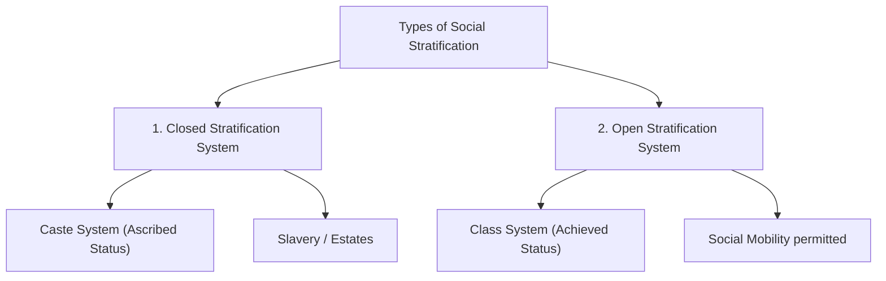
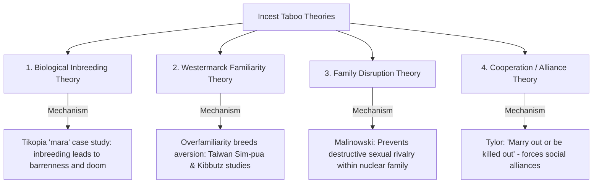
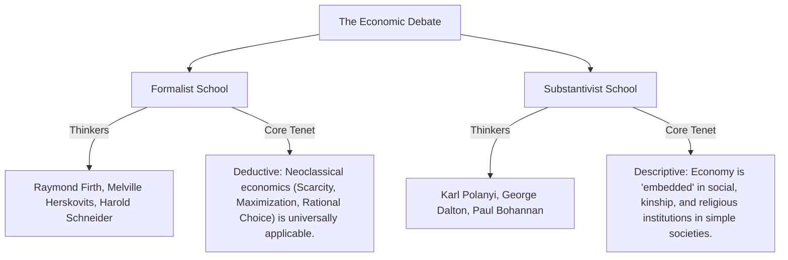
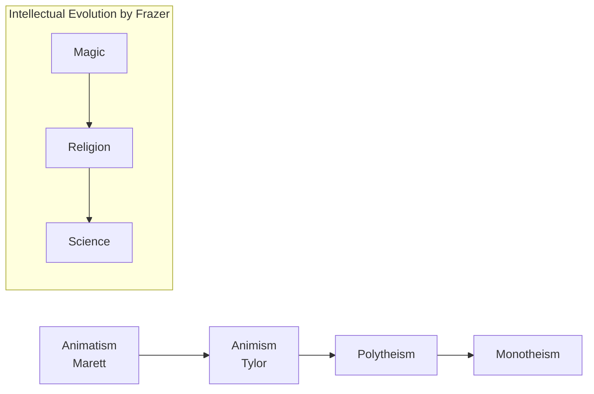
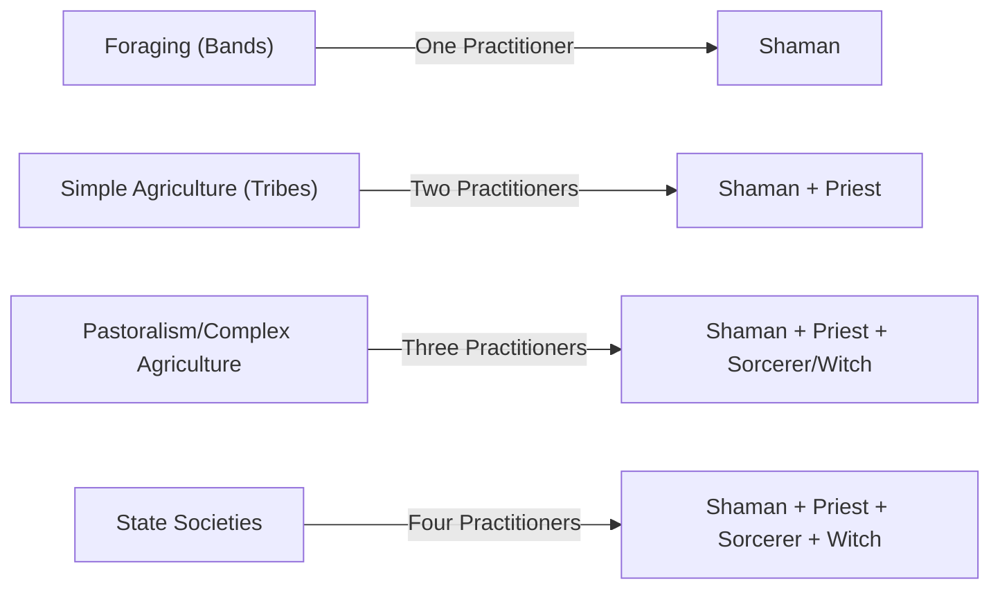

# PAPER I — UNITS 2, 3, 4 & 5: SOCIO-CULTURAL ANTHROPOLOGY

---

## TOPIC 1: THE NATURE OF CULTURE & SOCIETY (UNITS 2.1 & 2.2)

> [!NOTE]
> **Syllabus Mapping:**
> * **Paper I, Unit 2.1:** The Nature of Culture (Concept, Characteristics, explicit/implicit, culture construct vs. reality, Culture vs. Civilization, super-organic, acculturation, contra-acculturation).
> * **Paper I, Unit 2.2:** The Nature of Society (Concept of Society, Society vs. Culture, Social structure, social organization, social institution, social stratification).

---

### I. CONCEPT AND CHARACTERISTICS OF CULTURE

Culture is the central concept of anthropology. **E.B. Tylor** (1871) defined it in his classic work *Primitive Culture* as: *"that complex whole which includes knowledge, belief, art, morals, law, custom, and any other capabilities and habits acquired by man as a member of society."*

#### 1. Fundamental Characteristics of Culture
* **Acquired/Learned:** Culture is not genetically inherited. It is acquired socially through the process of **enculturation** (the intergenerational transmission of culture).
* **Shared:** It is a social phenomenon, not an individual trait. Behaviors must be shared by a group to be considered cultural.
* **Super-organic:** Operating on a level above biology (A.L. Kroeber). While it requires human biology to exist, it develops by its own laws of historical accumulation.
* **Adaptive and Maladaptive:** Culture is the primary mechanism of human adaptation (e.g., warm clothes in winter). However, it can also be maladaptive (e.g., pollution, weapons of mass destruction).
* **Explicit vs. Implicit Culture (Kluckhohn):**
  * *Explicit:* The overt, directly observable patterns of behavior, material artifacts, and structures (e.g., language, clothes, houses).
  * *Implicit:* The covert, underlying values, themes, and basic assumptions that guide behavior but are rarely expressed directly (e.g., concepts of purity, distance, and time).

#### 2. Culture: Construct or Reality?
* **Culture as a Reality (Reified View):** Early classical evolutionists like E.B. Tylor treated culture as an objective, concrete, observable entity that could be studied using natural science methods.
* **Culture as a Construct (Abstract View):** Proposed by **Ralph Linton** and **Raymond Firth**. They argued that culture is an *abstraction* synthesized by the anthropologist based on actual observed human behavior. Behavior is the reality; culture is the conceptual model (construct) created to explain patterns in that behavior.

#### 3. Culture vs. Civilization
While classical evolutionists used these terms interchangeably, modern anthropology (specifically **A.L. Kroeber** and **Robert Redfield**) distinguishes them:
* **Culture:** The internal, subjective, and non-material aspect of human life—beliefs, values, morality, customs, and language. It represents **"what we are."**
* **Civilization:** The external, objective, and material aspect—technology, architecture, cities, and machinery. It represents **"what we use."** Civilization is a highly specialized, complex, and urbanized manifestation of culture.

#### 4. Acculturation and Contra-Acculturation
* **Acculturation:** The process of cultural change that occurs when two distinct cultural groups come into continuous, direct contact, leading to the borrowing and assimilation of traits by one or both groups.
  * *Tribal Example:* The adoption of settled agriculture and modern education by the **Gonds** or **Bhils** due to interaction with plains populations.
* **Contra-Acculturation:** A defensive, reactive movement by a dominated group resisting the pressure of acculturation, attempting to revive or preserve their traditional culture.
  * *Tribal Example:* The **Birsa Munda movement** (Ulgulan) or the **Tana Bhagat movement** in tribal Chotanagpur, which rejected external Hindu/British influences to revive traditional Munda/Oraon values.

---

### II. SOCIETY AND SOCIAL STRATIFICATION (UNIT 2.2)

* **Society:** A structured, self-perpetuating group of individuals who occupy a specific territory, share a common culture, and interact through a network of social relations.

#### 1. The Evolution of the Concept of "Society"
To secure high-marks, understand how the theoretical definition of "society" has evolved:
* **Durkheim's Sui Generis Reality:** Durkheim established that society is an independent entity greater than the sum of its individual parts. It is held together by **Social Facts** (external, coercive rules of behavior) and solidarity (Mechanical in simple societies, Organic in complex, specialized ones).
* **Structural-Functionalism (A.R. Radcliffe-Brown):** Radcliffe-Brown moved anthropology from abstract "culture" to concrete "society." In *Structure and Function in Primitive Society (1952)*, he defined **Social Structure** as the concrete, observable network of actually existing social relations between individuals.
* **Role Abstraction (S.F. Nadel):** S.F. Nadel (*The Theory of Social Structure, 1957*) went further, arguing that social structure cannot be observed directly. Instead, it is an *abstraction* derived from the analysis of **role-networks** (the interlocking matrix of complementary roles).

#### 2. Social Stratification
The hierarchical arrangement of individuals or groups in a society based on unequal access to wealth, power, and prestige.



* **Closed Systems (Caste):** Status is **ascribed** at birth and cannot be changed. Strict rules of endogamy, ritual purity, and traditional occupational specialization prevent social mobility. (e.g., Hindu Jati system).
  * *UPSC Value Addition:* In modern India, the classic closed caste system is undergoing "classization." **André Béteille** notes that caste, class, and power are detaching from one another (e.g., a Brahmin priest might be economically poorer than a Dalit entrepreneur), blurring the lines between closed caste and open class.
* **Open Systems (Class):** Status is predominantly **achieved** through education, wealth, or merit. Social mobility (both vertical and horizontal) is permitted and common.

---

## TOPIC 2: MARRIAGE, FAMILY & KINSHIP (UNITS 2.3, 2.4 & 2.5)

> [!NOTE]
> **Syllabus Mapping:**
> * **Paper I, Unit 2.3:** Marriage (universality challenges, regulations, preferential, ways of mate selection, marriage payments, divorce).
> * **Paper I, Unit 2.4:** Family (Universality, household vs. family, domestic group, impact of urbanization/feminism/globalization).
> * **Paper I, Unit 2.5:** Kinship (Descent vs. Alliance, descent groups, terminology, behaviors, descent groups).

---

### I. MARRIAGE: UNIVERSALITY CHALLENGES & REGULATIONS

#### 1. The Challenge to the Universality of Marriage
Formulating a universal definition of marriage is difficult. **Edmund Leach** concluded that no single definition fits all societies, as marriage transfers diverse bundles of rights.
* **The Nayar Case Study (Kathleen Gough):** Among the matrilineal Nayar of Kerala, women practiced *Tali-kettu-kalyanam* (ritual marriage) and *Sambandham* (visiting husband relationship). The biological father had no economic or legal obligations to the child; instead, the mother's brother (*Karanavan*) held household authority. This challenged the classic Western definition of marriage.
* **Other Exceptions:**
  * **Ghost Marriage (Nuer):** A man marries a woman in the name of his deceased brother to preserve the dead brother's lineage and property rights.
  * **Female Husbands (Nandi of Kenya):** An older childless woman marries a younger woman. The older woman acts as the "husband" (social father) to secure heirs for her lineage.

#### 2. Theories of the Incest Taboo
The incest taboo is a universal cultural rule prohibiting sexual relations between close family members.



* **A. Biological Inbreeding Theory:** Mating between close relatives increases genetic defects and infant mortality.
  * *Case Study:* **Raymond Firth** reported that the **Tikopia of the South Pacific** believe unions of close kin bear their own doom, called *mara* (barrenness, illness, and death).
* **B. Westermarck Effect (Childhood Familiarity):** Proposed by Edward Westermarck. Children raised together develop a natural, sentimental non-erotic bond. "Overfamiliarity breeds sexual disinterest."
  * *Support Study 1 (Taiwan Sim-pua):* **Arthur Wolf** studied Taiwanese marriages where the future bride was adopted as an infant into the groom's family. These marriages showed 3x higher infidelity, higher divorce, and lower fertility.
  * *Support Study 2 (Israeli Kibbutz):* **Joseph Shepher** showed that children raised together in Kibbutz peer groups virtually never married or had sexual relations with each other.
* **C. Family Disruption Theory:** Formulated by **Bronislaw Malinowski**. Sexual competition among family members would create deep rivalries and tension, destroying the family unit. The taboo is imposed to keep the family intact.
* **D. Cooperation/Alliance Theory:** Formulated by **E.B. Tylor** (*"marry out or be killed out"*), Leslie White, and **Claude Lévi-Strauss** (*The Elementary Structures of Kinship*). The taboo is the transition from nature to culture. Banning marriage within forces groups to exchange women with other groups, creating a network of social alliances.

#### 3. Ways of Acquiring a Mate in Tribal Societies
Tribal communities employ diverse, institutionalized methods to select spouses:

| Method | Mechanism | Classic Tribal Example |
| :--- | :--- | :--- |
| **1. Marriage by Capture** | Physical or symbolic capture of the bride. | **Kharia** of Odisha (Physical); **Ho** of Jharkhand (called *Oportipi*). |
| **2. Marriage by Service** | Groom works for the bride's father to pay off the marriage costs. | **Gonds** of Madhya Pradesh (called *Lamanai*). |
| **3. Marriage by Purchase** | Groom's family pays a substantial bride price to compensate the bride's family. | **Santhals** (called *Bapla*). |
| **4. Marriage by Trial** | Groom must prove his physical bravery or skill in public. | **Bhils** of Rajasthan (*Gol Gadhedo* festival). |
| **5. Marriage by Elopement** | Mutual consent of the couple running away against parental wishes. | **Garos** of Northeast India; **Hos** (called *Rajikhusi*). |
| **6. Marriage by Intrusion** | The woman forces her way into the boy's house and refuses to leave. | **Birhor** or **Ho** (called *Anadar* or *bolo-bapla*). |
| **7. Marriage by Probation** | Groom is allowed to live with the bride in her house for a trial period. | **Kuki** of Manipur. |

#### 4. Marriage Payments (Economic Aspects of Marriage)
In about 75% of known human societies, explicit economic transactions occur at marriage:
* **Bridewealth / Bride Price:** A gift of money or goods from the groom/his kin to the bride's kin, granting the groom rights to the bride's labor and her children. It is common where women contribute heavily to subsistence.
  * *Example:* Among the **Nuer of South Sudan**, the bride price consists of a standardized transfer of **40 head of cattle**.
* **Bride Service:** The groom works for the bride's family.
  * *Example:* Among the **Ju/'hoansi (!Kung San)** of the Kalahari desert.
* **Female Exchange:** A sister or female relative of the groom is exchanged for the bride.
  * *Example:* The **Tiv of Nigeria**.
* **Gift Exchange:** Respective parents send gifts of food and objects of equal value to each other.
  * *Example:* The **Andamanese (Andaman Islanders)**.
* **Dowry:** A substantial transfer of goods/money from the bride's family to the bride, groom, or the couple (Jack Goody's pre-mortem inheritance). Common in highly stratified, monogamous societies where women's direct economic contribution is low.

#### 5. Divorce and Dissolution of Marriage
* **In Simple Societies:** Because marriage is a contract (not a sacrament), divorce is widely permitted and easily obtained for reasons of adultery, barrenness, or incompatibility (e.g., Gonds).
* **The Bride Price Constraint:** In societies with expensive bride prices (e.g., Nuer), divorce is highly difficult. If a divorce occurs, the bride price must be returned. The wife's kin, having already consumed or distributed the cattle, will put severe pressure on the wife to stay with her husband to avoid returning the herd.

---

### II. FAMILY & HOUSEHOLD: DEVELOPMENTAL CYCLE & CHANGES

* **Family:** A kinship-based social group united by blood, marriage, or adoption, sharing a common residence and emotional bonds. **G.P. Murdock** studied 250 societies and declared the **nuclear family to be a universal social group** performing four functions: Sexual, Reproductive, Economic, and Educational.
* **Household (Domestic Group):** A co-residential, economic unit consisting of individuals who live under the same roof and share a hearth/meals, but who may or may not be related.
* **The Developmental Cycle of the Domestic Group (Meyer Fortes):** Family structures are not static; they go through a regular cyclic progression:
  1. *Expansion:* From marriage to the birth of children.
  2. *Fission/Dispersion:* Children grow up, marry, and leave to establish new households.
  3. *Replacement:* The original parents die and are replaced by the next generation's expanding families.

#### 1. Evolutionary Stages of the Family (Lewis Henry Morgan)
In *Ancient Society (1877)*, Morgan argued that the institution of family evolved through five distinct stages, transitioning from early group sexual relations to modern monogamy:
1. **Consanguine Family:** Early sexual group marriage where blood relatives (including biological brothers and sisters) were married collectively.
2. **Punaluan Family:** Group marriage where a group of brothers married a group of sisters collectively (excluding direct siblings). Derived from the Hawaiian term *Punalua*.
3. **Syndasmian (Pairing) Family:** A temporary pairing marriage of one man and one woman, easily dissolved by either partner at will.
4. **Patriarchal Family:** A male-dominated structure where one husband cohabited with several wives under supreme, autocratic male authority.
5. **Monogamian Family:** Modern monogamy based on strict sexual fidelity of spouses, which emerged to ensure clear paternity for the inheritance of private property.

> [!TIP]
> **Mnemonic to remember Morgan's stages:** **CPSPM**
> * *English:* **C**ute **P**enguins **S**wim **P**ast **M**adagascar.
> * *Hindi:* **C**hintu **P**intu **S**aath **P**adhe **M**adras.
> *(Consanguine $\rightarrow$ Punaluan $\rightarrow$ Syndasmian $\rightarrow$ Patriarchal $\rightarrow$ Monogamian)*

#### 2. Impact of Urbanization, Globalization, and Feminism
* **Urbanization & Industrialization:** Joint and extended families fragment into nuclear households. Lineage-based authority weakens; emotional and economic dependency shifts from the wider clan to the spouse.
* **Feminism:** Challenges the traditional male-breadwinner/female-homemaker division of labor. Promotes symmetrical families, dual-career households, single-parent structures, and legally validates alternate structures (e.g., live-in relationships).
* **Globalization:** Leads to transnational families, where members are scattered across countries, maintaining contact through digital media, restructuring traditional parenting and care roles.

#### 3. Value Addition: Contemporary Family Dynamics (UPSC Mains)
* **"Structural Pluralism" (Modified Extended Family):** Anthropologists note that rather than "disintegrating", the Indian joint family is adapting into a "modified extended family" where nuclear households maintain strong kinship and financial ties via digital networks. Dr. Puja Sharma's urban ethnography in Bangalore/Delhi proves physical separation does not equal social disintegration.
* **"Cultural Code-Switching" & Hybridity:** Modern couples exhibit hybridity—adopting Western secular lifestyles (career/individualism) while maintaining strict traditional rituals for marriage ceremonies, demonstrating a negotiation between modernity and tradition.
* **Feminization of Agriculture & Kinship Shifts:** With rising male out-migration to urban centers, rural women are increasingly acting as de-facto household heads, altering traditional patriarchal decision-making structures.

---

### III. KINSHIP: DESCENT VS. ALLIANCE & TERMINOLOGIES

#### 1. Descent Theory vs. Alliance Theory
* **Descent Theory (British School - Radcliffe-Brown, Meyer Fortes):** Prioritizes **blood ties (unilineal descent)**. The core of kinship is the *descent group* (lineage/clan) which functions as a corporate entity holding property, maintaining social order, and regulating inheritance.
* **Alliance Theory (French School - Claude Lévi-Strauss):** Prioritizes **marriage ties (alliance)**. Kinship is not about corporate descent, but the continuous exchange of women between groups driven by the incest taboo, establishing social solidarity.

#### 2. Rules and Types of Descent
* **Unilineal:** Tracing descent exclusively through one line (Patrilineal or Matrilineal).
* **Double/Bilineal Descent:** Descent is traced through the father's patrilineal group and the mother's matrilineal group simultaneously, but for completely different purposes.
  * *Classic Example:* The **Yako of Nigeria**. Patrilineal line governs the inheritance of immovable property (land, house); Matrilineal line governs the inheritance of movable property (currency, livestock) and religious rituals. (Also found among the **Herero of Namibia**).
* **Ambilineal:** Individuals are free to choose their genealogical link through either their father or mother.
* **Bilateral (Kindred):** Tracing relationships spreading out equally on both sides. Ego-centered; apart from siblings, no two people share the exact same kindred group.

```
Difference: Double Descent (Ancestor-focused; identical for all family members) 
            vs. Bilateral Kindred (Ego-centric; differs for every individual)
```

#### 3. Forms of Descent Groups
* **Lineage:** An extended unilineal kinship group descended from a known, historical founder (usually 5–6 generations back).
* **Clan:** A unilineal descent group whose members believe in a common, mythical/totemic ancestor. Clans split from lineages.
  * *Clanic Fission (Tribal Example):* As a clan grows, it splits. If the original clan was **Tiger**, new sub-clans form under names like **Tiger's Tail**, **Tiger's Teeth**, or **Tiger's Claws** (e.g., among the **Hos**).
* **Phratry:** A unilineal descent group composed of a group of supposedly related clans that retain their separate identities.
* **Moiety:** A society divided into two halves along matrilineal or patrilineal lines of descent.
  * *Classic Example:* The **Tlingit of Alaska**. Tlingit society is divided into the **Raven** and **Eagle** moieties. They are matrilineal, exogamous, and display their heraldic crests on totem poles, canoes, and house posts.
* **Kindred:** An ego-centered network of bilateral kin.

#### 4. Kinship Terminology (A.L. Kroeber)
Kroeber (*Classificatory Systems of Relationship, 1909*) proved that terminologies reflect cognitive and social patterns, classified by 8 principles:
1. *Generation:* Distinguishing father (Gen +1) from son (Gen -1).
2. *Lineal vs. Collateral:* Distinguishing father (lineal) from uncle (collateral).
3. *Age within generation:* Distinguishing older brother from younger brother.
4. *Gender of relative:* Distinguishing brother from sister.
5. *Gender of speaker:* Terms differ if a male or female is speaking.
6. *Gender of connecting relative:* Maternal uncle (mother's side) vs. paternal uncle (father's side).
7. *Decidence:* Distinguishing living relatives from deceased ones.
8. *Affinity:* Distinguishing blood relatives from in-laws.

#### 5. Kinship Behaviors
* **Avoidance:** Socially enforced distance and restrictions between certain kin (e.g., father-in-law and daughter-in-law).
* **Joking Relations:** Permitted familiarity, teasing, and sexual joking between specific kin (e.g., elder sister's husband and younger sister).
* **Avunculate:** In matrilineal societies, the maternal uncle (*mother's brother*) holds authority, handles initiation, arranges marriages, and passes inheritance to his nephews.
  * *South Indian Value Addition:* The maternal uncle plays a central ceremonial role (e.g., ear-piercing) in South Indian Hindu families, frequently linked to preferential cross-cousin marriage.
* **Amitate:** Found in patrilineal societies; the father's sister holds authority and prime importance, acting as a "social mother."
* **Couvade:** The husband imitates the pregnancy taboos and birth pains of his wife for the child's welfare.
  * *Value Addition:* Among the **Barasana (Amazonian Indians)**, the father abstains from heavy exertion during the postpartum period. They believe the child gains its life force directly from the father through a *spiritual umbilicus*. If the father sweats, he must rub the sweat on the child to transfer this energy back.
* **Technonymy:** Addressing a relative not by their name, but by their relationship to a child (e.g., calling one's husband "Father of [Child's Name]").

---

## TOPIC 3: ECONOMIC ORGANIZATION (UNIT 3)

> [!NOTE]
> **Syllabus Mapping:**
> * **Paper I, Unit 3:** Economic Organization — Meaning, scope, and relevance of economic anthropology; Formalist vs. Substantivist debate; Principles governing production, distribution, and exchange (reciprocity, redistribution, market) in simple societies; Subsistence profiles (hunting/gathering, fishing, swiddening, pastoralism, horticulture, agriculture).

---

### I. THE FORMALIST VS. SUBSTANTIVIST DEBATE

The central methodological debate in economic anthropology, centered on whether Western neoclassical economic models are universally applicable.



#### 1. The Formalist School
* **Core Tenet:** Classic microeconomic principles (scarcity of resources, rational choice, utility maximization, and optimization) are **universally applicable** to all human societies, including simple, non-market tribes.
* **The Logic:** Humans everywhere face the same structural dilemma: allocating scarce means to satisfy unlimited wants. Raymond Firth (who studied under LSE economist training) argued that a tribal chief trading yams is making the same rational calculations as a Wall Street investor.
* **Key Scholars:** Raymond Firth, Melville Herskovits (*The Economic Life of Primitive Peoples*), Harold Schneider.

#### 2. The Substantivist School
* **Core Tenet:** Classic Western economic theories are historically specific to modern market economies and **cannot be applied** to simple, non-industrialized tribal societies.
* **The Logic:** In simple societies, the economy is **"embedded"** inside social, kinship, and religious institutions. Production, labor, and exchange are guided by social duties, ritual obligations, and kinship ties, not by individual profit maximization.
* **Key Scholars:** Karl Polanyi (*The Great Transformation, 1944*), George Dalton, Paul Bohannan.

---

### II. MODES OF EXCHANGE IN SIMPLE SOCIETIES

Karl Polanyi classified three distinct, co-existing principles of exchange in human history:

#### 1. Reciprocity (Symmetric Exchange)
Exchange of goods and services between individuals or groups who share a social relationship, without using money. Marshall Sahlins (*Stone Age Economics, 1972*) divided this into three categories based on social distance:
* **Generalized Reciprocity:** Altruistic exchange characterized by **no expectation of immediate or direct return**. High trust, close social distance.
  * *Example:* Sharing game meat within a hunter-gatherer band like the Kalahari San.
* **Balanced Reciprocity:** Immediate or time-bound exchange of **goods of equal value**. Medium trust, medium social distance.
  * *Types:* Barter, Ceremonial Exchange (e.g., the Kula Ring of Trobriand Islanders), and Silent Trade.
  * *Silent Trade (Dumb Barter - Ethnographic Case Study):* Practiced between the **Semang and Sakai** tribes of the Malay forest or the **Mbuti Pygmies** and **Bantu farmers**. Due to deep historical animosity and zero trust, they do not meet face-to-face. One group leaves forest products at a designated clearing and retreats. The other group inspects, leaves agricultural goods, and withdraws. This bargain is repeated silently.
* **Negative Reciprocity:** Impersonal exchange where each party attempts to **maximize personal gain at the expense of the other**. Zero trust, maximum social distance.
  * *Example:* Cattle raiding among the **Nuer** or horse raiding among Native American tribes.

#### 2. Redistribution
Goods and services are gathered from members of the society to a **centralized authority** (chief, big man, temple), which subsequently redistributes them back to the community:
* **Potlatch-based Redistribution:** Marcel Mauss (*The Gift*) described the **Potlatch Ceremony** among the **Kwakiutl Indians** of the Northwest Coast. Chiefs gather vast quantities of blankets, copper plates, and food, and host a massive feast where they give away or destroy this wealth. This "total prestation" system allows chiefs to claim high social prestige and redistribute resources during ecological imbalances.
* **Administrative based:** Taxation in modern state societies.

#### 3. Market Exchange
Exchange driven by the forces of **supply and demand** utilizing a standardized medium of exchange (money). High anonymity, completely disembedded from social relations.

---

### III. SUBSISTENCE PROFILES OF SIMPLE SOCIETIES

Simple societies are classified based on their primary techno-economic adaptation:

1. **Hunting and Gathering:** Mobile, egalitarian bands; division of labor by age/gender. Minimal storage.
   * *Examples:* **Birhor** and **Chenchu** of India; Kalahari San.
2. **Fishing:** Semi-sedentary groups; specialized technology (nets, canoes).
   * *Examples:* **Majhi** (Indian fishermen); **Tlingit** of the Pacific Northwest.
3. **Swiddening (Shifting Cultivation):** Slash-and-burn cultivation of forest plots; rotating land rather than crops. Communal land tenure.
   * *Examples:* **Maria Gonds** (called *Penda*), **Khonds** (called *Podu*), and **Hill Korwas** of India.
4. **Pastoralism:** Mobile herding of animals in arid/semi-arid regions. Deep symbolic relationship with herds.
   * *Examples:* **Toda** of Nilgiri (buffalo-centered dairy rituals); **Nuer** of South Sudan (cattle-centered).
5. **Horticulture:** Simple plant cultivation using hand tools (digging sticks); lack of plows or irrigation.
   * *Examples:* **Yanomami** of Venezuela; **Orokaiva** of Papua New Guinea.
   * *Value Addition:* The **Kogi Indians** of Colombia face land scarcity but refuse to cultivate hill terraces because they believe the souls of their ancestors live there. This highlights how economy is embedded in religion.
6. **Agriculture:** Intensive cultivation using plows, draft animals, and irrigation. Leads to surplus, stratification, and private property.
   * *Examples:* **Santhals**, **Oraons**, and **Bhils** of India.

#### IV. Value Addition: Relevance of Traditional Economic Systems (UPSC Mains)
* **Critique of Market Fundamentalism:** Substantivist insights (economy as socially "embedded") remain highly relevant in critiquing purely profit-driven policies that fail in tribal areas.
* **Modern Informal Economy:** Concepts like Marcel Mauss's *gift exchange* and *reciprocity* help explain the functioning of modern informal networks, social safety nets, and even Corporate Social Responsibility (CSR).
* **Traditional Ecological Knowledge (TEK):** The subsistence strategies of indigenous groups are now central to global discussions on climate change mitigation and sustainable organic farming.

---

## TOPIC 4: POLITICAL ORGANIZATION & SOCIAL CONTROL (UNIT 4)

> [!NOTE]
> **Syllabus Mapping:**
> * **Paper I, Unit 4:** Political Organization and Social Control — Band, tribe, chiefdom, kingdom and state; concepts of power, authority and legitimacy; social control, law and justice in simple societies.

---

### I. ELMAN SERVICE'S EVOLUTIONARY TYPOLOGY OF POLITICAL SYSTEMS

American anthropologist **Elman Service (1962)** classified global political organizations into four developmental stages, transitioning from egalitarian kinship groups to highly stratified states:

| Political Type | Size & Mobility | Leadership & Power | Economy & Exchange | Core Examples |
| :--- | :--- | :--- | :--- | :--- |
| **1. Band** | Small (20–50); nomadic hunter-gatherers; kin-based. | **Egalitarian**; no formal leaders; informal "headman" has authority based on wisdom/skill but no coercive power. | Generalized Reciprocity (communal meat sharing). | Kalahari San, Inuit, Andaman Islanders. |
| **2. Tribe** | Medium (100–1000); sedentary horticulturalists/pastoralists; clan-segmented. | Egalitarian; no formal offices. Led by a **"Big Man"** who acquires influence through generosity, or a Council of Elders. | Balanced Reciprocity; gift exchanges. | Yanomami (Venezuela), Nagas (India). |
| **3. Chiefdom** | Large (thousands); sedentary; ranked lineages. | **Ranked Hierarchy**; permanent, hereditary political office of the **Chief**. Chief has authority and redistributive control, but lacks a standing army. | Centralized Redistribution (tribute gathering and feasting). | Trobriand Islanders, Polynesian Chiefdoms. |
| **4. State** | Massive (millions); sedentary; highly stratified. | **Centralized Government**; permanent bureaucracy; written laws; monopoly on the **legitimate use of physical/coercive force** (police/army). | Market Exchange; formal taxation system. | Modern Nations, Ancient Egypt, Roman Empire. |

---

### II. POWER, AUTHORITY, AND LEGITIMACY

Sociologist **Max Weber** distinguished three types of authority based on the source of their legitimacy:
* **Traditional Authority:** Legitimacy rests on established belief in the sanctity of immemorial traditions (e.g., hereditary Chiefs, Kings, Tribal Council of Elders).
* **Charismatic Authority:** Legitimacy flows from devotion to the exceptional, supernatural heroism or exemplary character of an individual leader (e.g., **Birsa Munda** leading the Munda rebellion).
* **Rational-Legal Authority:** Legitimacy is based on a belief in the legality of enacted rules and the right of those elevated to authority under such rules to issue commands (e.g., modern bureaucracy, police, courts).

---

### III. LAW & SOCIAL CONTROL IN SIMPLE SOCIETIES

Simple societies lack written constitutions, professional courts, police forces, and prisons. Yet, they maintain order and resolve conflicts through highly effective **informal social control mechanisms**:

#### 1. Informal / Supernatural Control
* **Public Opinion & Gossip:** Severe social pressure and ridicule enforce conformity.
* **Ostracism:** Temporary or permanent banishment from the band—a death sentence for a hunter-gatherer.
* **Supernatural Sanctions & Taboos:** Belief that violating a tribal custom will trigger ancestral curses, crop failures, or lightning strikes (e.g., fear of witchcraft).

#### 2. Conflict Resolution Mechanisms
* **Customary Law:** Unwritten, widely accepted norms enforced by the Council of Elders or village headman.
* **Oaths and Ordeals:** Invoking supernatural judgment to determine guilt.
  * *Oath:* Swearing innocence on a sacred object (e.g., swearing on a tiger skin or an ancestral grave).
  * *Ordeal:* Subjecting the accused to a dangerous physical test (e.g., the **poison ordeal** in Africa; holding a red-hot iron rod). If the accused survives unharmed, they are declared innocent.
* **Song Duels (Inuit):** In the Arctic, disputes (e.g., over adultery) are resolved by hosting a public song duel where opponents sing humorous, insulting songs about each other. The audience's laughter determines the winner, successfully venting aggression without violence.

#### IV. Value Addition: Relevance of Traditional Political Systems (UPSC Mains)
* **Decentralized Consensus:** Traditional mechanisms like Tribal Councils emphasize **consensus-based decision-making** (rather than adversarial majoritarian voting). This model deeply influenced the Indian government's PESA Act (1996) and Forest Rights Act (2006).
* **Cost-Effective Justice:** Customary conflict resolution mechanisms continue to provide rapid, culturally acceptable, and cost-effective justice for grassroots populations alienated by formal modern legal systems.

---

## TOPIC 5: ANTHROPOLOGY OF RELIGION (UNIT 5)

> [!NOTE]
> **Syllabus Mapping:**
> * **Paper I, Unit 5:** Religion — Anthropological approaches to the study of religion (evolutionary, psychological and functional); monotheism and polytheism; sacred and profane; myths and rituals; forms of religion in tribal and peasant societies (animism, animatism, fetishism, naturism and totemism); religion, magic and science distinguished; magico-religious functionaries (priest, shaman, medicine man, sorcerer and witch).

---

### I. THEORETICAL APPROACHES TO RELIGION

Anthropologists study religion using three primary analytical frameworks:
* **1. Evolutionary Approach (Tylor, Marett, Frazer):** Religion evolved as a cognitive attempt to explain the unknown.



  * *E.B. Tylor:* Proposed the progression from **Animism** (soul concept) $\rightarrow$ **Polytheism** (multiple gods) $\rightarrow$ **Monotheism** (one supreme God).
  * *R.R. Marett:* Argued for a pre-animistic stage called **Animatism** (belief in an impersonal force).
  * *J.G. Frazer:* Proposed the intellectual evolution from **Magic** $\rightarrow$ **Religion** $\rightarrow$ **Science**.
* **2. Psychological Approach (Malinowski, Freud):** Religion serves to reduce anxiety and satisfy human emotional needs.
  * *Malinowski:* Religion and magic provide confidence and reduce acute anxiety in risky situations where empirical control is absent.
  * *Freud:* Religion is an "obsessional neurosis," serving as a protective mechanism against childhood fear of the father.
* **3. Functional Approach (Durkheim, Radcliffe-Brown):** Religion functions to maintain social order and solidarity.
  * *Durkheim:* In *The Elementary Forms of Religious Life*, he divided the universe into the **Sacred** (extraordinary, demanding reverence) and the **Profane** (ordinary, mundane). Religion is the collective worship of society itself, reinforcing the collective conscience.
  * *Radcliffe-Brown:* Rituals maintain structural continuity by reinforcing social values.

---

### II. FORMS OF RELIGION IN TRIBAL SOCIETIES

* **Animism (E.B. Tylor):** The belief in spiritual beings or souls (*anima*) inhabiting humans, animals, plants, and inanimate natural features. 
* **Animatism (R.R. Marett):** The belief in a **generalized, impersonal, supernatural force** that pervades the universe, which can inhabit objects and bestow luck, power, or danger (e.g., the concept of ***Mana*** in Polynesia).
* **Totemism:** The belief in a sacred, mystical connection between a social group (clan) and a specific natural species (animal or plant—the totem), which serves as the group's emblem and dictates incest/exogamy rules.
* **Fetishism:** The belief that specific, man-made physical objects (fetishes/charms) possess inherent, active supernatural powers that can protect the owner or bring good fortune.
* **Naturism (Max Müller):** The direct worship of personified natural forces and celestial bodies (the Sun, the Moon, Thunder, Wind) as active deities.

---

### III. MAGIC, RELIGION, AND SCIENCE DISTINGUISHED

The boundary between these three systems is a classic anthropological theme, formulated primarily by **Frazer** and **Malinowski**:

| Feature | Magic | Religion | Science |
| :--- | :--- | :--- | :--- |
| **Core Principle** | **Coercive Control:** Seeking to compel supernatural forces directly using cause-and-effect formulas (manipulation). | **Appeasement:** Seeking to propitiate and pray to conscious supernatural deities (supplication). | **Natural Laws:** Explaining the physical universe through rational, empirical observation and experiment. |
| **Human Attitude** | Dominant: "My spell *must* work if performed correctly." | Submissive: "Thy will be done" (praying for divine favor). | Objective: Understanding physical cause and effect systematically. |
| **Psychological Function**| Reduces acute personal anxiety under conditions of high risk/uncertainty (Malinowski). | Provides collective meaning, moral order, and social integration. | Provides practical control and objective, verifiable explanations of the physical world. |
| **Key Practitioner** | Sorcerer, Witch, Medicine Man. | Priest, Shaman. | Scientist, Technician. |
| **Frazer's View** | Called magic the **"bastard sister of science"** or **"pseudo-science"** because it assumes cause-effect relations but relies on false premises. | Seeks spiritual rapport; subordinate to animistic beings. | Latest stage of human thought, open to empirical verification. |
| **Similarities** | **Magic & Science:** Both assume a strict cause-and-effect chain and operate using systematic principles to achieve desired goals. | **Magic & Religion:** Both are concerned with non-empirical, supernatural aspects and involve strict taboos. | **Religion & Science:** Both seek to explain the universe, but religion is a closed system of belief (sacred facts), while science is an open system (profane facts, open to empirical testing). |

---

### IV. MAGICO-RELIGIOUS FUNCTIONARIES (THE SPECIALISTS)

* **Priest:** A formal, full-time religious specialist who holds a recognized, institutional office. They undergo formal training, represent a structured hierarchy, and conduct collective, scheduled rituals for the community.
* **Shaman:** A part-time specialist who possesses **direct, personal contact with the spirit world**. Shamans undergo a personal crisis or spiritual calling, and enter altered states of consciousness (trance) to heal the sick, divine the future, or communicate with spirits.
  * *Classic Example:* The **Buryat Shamans of Siberia**.
* **Medicine Man:** A part-time tribal specialist who uses a mix of practical herbal medicine and magical spells to cure physical illnesses.
  * *Ojibwe Native American Example:* The **Midewiwin** tradition. Practitioners are referred to as **Midew** ("medicine man" in Ojibwe), who heal using herbal remedies and communicate with spirits.
* **Sorcerer:** A specialist who uses **physical objects, spells, and learned formulas** deliberately to cause harm or manipulate events for clients. This is an **acquired skill** that can be learned by anyone.
* **Witch:** An individual who possesses an **inherent, unconscious, internal psychic power** to cause harm, illness, or misfortune to others. Unlike sorcerers, witches do not require physical spells or tools—their destructive power flows directly from their body/mind.
  * *Cultural Examples of Witches:*
    * **Ganda of Uganda:** Witches are believed to dance naked at night.
    * **Dinka of Sudan:** Witches are believed to have physical tails.
    * **Amba of Africa:** Witches are believed to hang upside down from trees and drink salt instead of water.

#### Practitioners and Social Complexity
Anthropologists have identified a pattern linking the type and number of practitioners with social complexity:



---

## TOPIC 6: UPSC PREVIOUS YEAR QUESTIONS (PYQS) & ANSWER BLUEPRINTS

---

### PYQ 1: Discuss the Formalist and Substantivist debate in economic anthropology. [20 Marks]

* **Introduction (Approx. 40 words):** The Formalist-Substantivist debate is the central epistemological debate in economic anthropology. It emerged in the mid-20th century to determine if Western neoclassical microeconomic models can be universally applied to study simple, non-market tribal economies.
* **Body Skeleton:**
  * *The Formalist Position:* Outline the core tenets—universal scarcity, individual optimization, and rational maximization. Cite scholars: Raymond Firth, Harold Schneider. Argument: Primitive humans make rational choices to allocate resources; only the "currency" differs (yams/shells instead of dollars).
  * *The Substantivist Position:* Detail the counter-argument. Cite Karl Polanyi, George Dalton. Argument: Tribal economies are "embedded" in social institutions. Exchange is governed by kinship duties and ritual rules (e.g., Kula Ring), not by profit-seeking. Western concepts like "scarcity" and "market price" are inapplicable.
  * *Polanyi's Three Modes:* Explain his structural classification of exchange (Reciprocity, Redistribution, and Market).
  * *Critique & Synthesis:* Note that while substantivists successfully highlighted the social context of tribal economics, formalists provided a sharp analytical tool to understand individual strategies.
* **Conclusion (Approx. 40 words):** Today, economic anthropology has moved past this rigid dichotomy, adopting a **Biocultural / Ecological** synthesis that recognizes that while basic rational decision-making is universal, it is always structurally constrained and culturally embedded within local social institutions.

---

### PYQ 2: Write a note in 150 words on the differences between Religion and Magic. [10 Marks]

* **Introduction (Approx. 35 words):** Religion and magic represent the two primary cultural techniques designed by human groups to interact with and influence the supernatural world, as formulated by James Frazer and Bronislaw Malinowski.
* **Body (Approx. 85 words):**
  * *Attitude toward Supernatural:* Religion is submissive (appeasement/supplication to deities; "Thy will be done"), whereas magic is dominant and coercive (manipulation using formulas and spells; "My spell *must* work").
  * *Social Context:* Religion is public, collective, and congregational, led by respected **priests**. Magic is generally individual, secret, and private, practiced by feared **magicians/sorcerers**.
  * *Ethical Quality:* Religion is generally benevolent and seeks the common moral good. Magic is instrumental and can be used for both benevolent (white magic) and malevolent (black magic/sorcery) purposes.
  * *Psychological Function:* Religion provides ultimate meaning and social integration, whereas magic reduces acute personal anxiety during high-risk activities (Malinowski).
* **Conclusion (Approx. 30 words):** While structurally distinct, both magic and religion reflect the universal human drive to bridge the gap between empirical limitations and the mysterious non-empirical universe.

---

### PYQ 3: Differentiate between Dravidian (South Indian) and Indo-Aryan (North Indian) Kinship Systems. [15 Marks]

* **Introduction (Approx. 40 words):** The Indian subcontinent exhibits a structural split between the Indo-Aryan (North Indian) and Dravidian (South Indian) kinship systems, reflecting the classic debate between **Descent Theory** (corporate bloodline purity) and **Alliance Theory** (repetitive marital exchanges), as documented by **Iravati Karve**.
* **Body Skeleton:**
  * *Indo-Aryan Kinship (Asymmetric Descent Model):*
    * **Structural Principle:** Strict separation of Consanguines (blood) and Affines (in-laws).
    * **Marriage Rules:** Strict village exogamy and *Gotra/Sapinda* exogamy. **Hypergamy** (marrying up); kins are split into superior "women-takers" and inferior "women-givers." No alliance can be repeated.
    * **Terminology:** Highly **descriptive** to maintain absolute boundaries (e.g., father's brother is *Chacha*, maternal uncle is *Mama*).
  * *Dravidian Kinship (Symmetric Alliance Model):*
    * **Structural Principle:** Integration of Consanguinity and Affinity.
    * **Marriage Rules:** Village endogamy is permitted. Preferential **cross-cousin marriages** (marrying mother's brother's daughter - MBD, or father's sister's daughter - FSD) and uncle-niece marriages are highly preferred to preserve wealth within the group.
    * **Terminology:** Highly **classificatory**; blood and marriage terms merge (e.g., maternal uncle *Mama* also means father-in-law).
* **Summary Comparison Matrix:**

| Dimension | Indo-Aryan (North Indian) | Dravidian (South Indian) |
| :--- | :--- | :--- |
| **Core Alliance Mode** | Asymmetrical, non-repetitive, hypergamous | Symmetrical, repetitive, reciprocal |
| **Separation** | Absolute separation of blood vs. marriage | Overlapping and structurally integrated |
| **Marriage Boundaries** | Strict village and clan exogamy | Village endogamy permitted; cross-cousin preferentials |
| **Terminology** | Descriptive (exact relations) | Classificatory (structural categories) |

* **Conclusion (Approx. 40 words):** These two systems reflect diverse structural solutions to social organization: the North focuses on expanding lineage alliances outward, while the South focuses on reinforcing organic solidarity and resource preservation inward.
