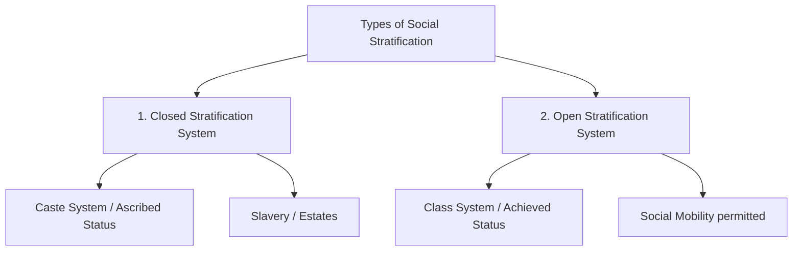
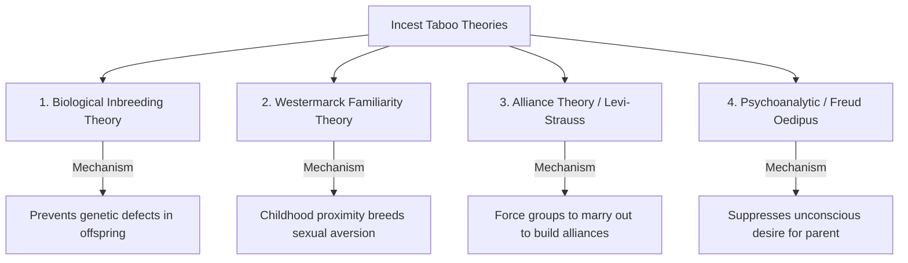
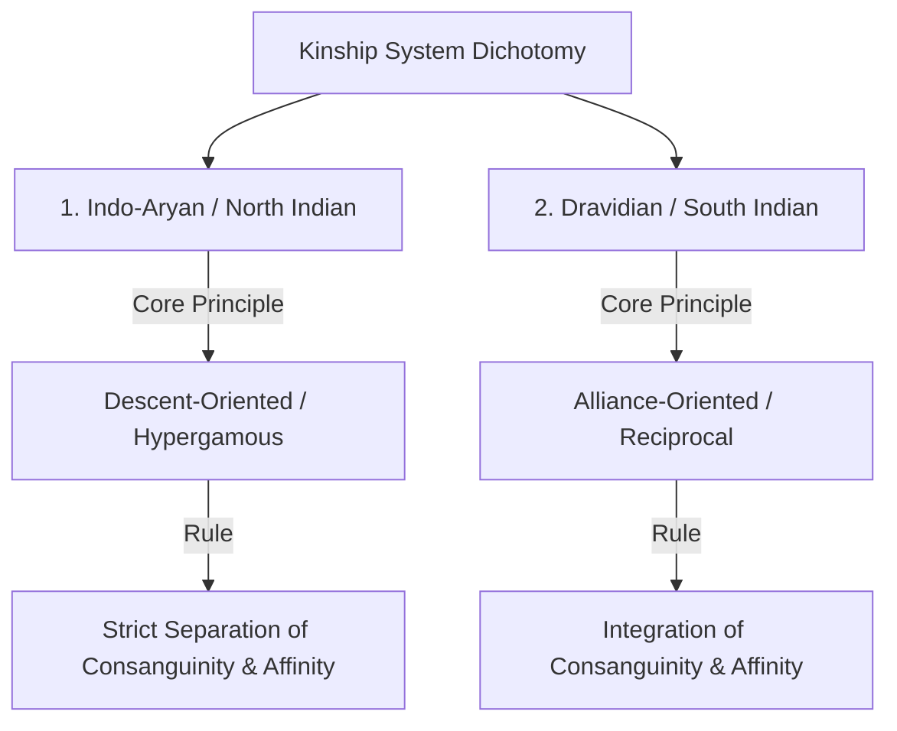
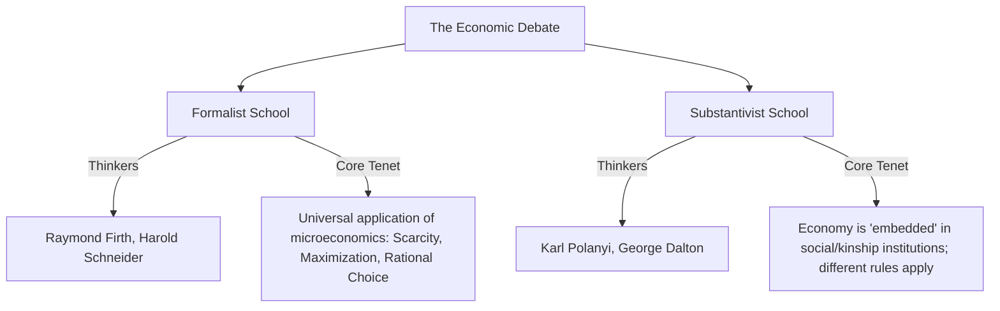

# PAPER I — UNITS 2, 3, 4 & 5: SOCIO-CULTURAL ANTHROPOLOGY

---

## TOPIC 1: THE NATURE OF CULTURE & SOCIETY (UNITS 2.1 & 2.2)

> [!NOTE]
> **Syllabus Mapping:**
> * Paper I, Unit 2.1: The Nature of Culture (Concept, Characteristics, explicit/implicit, culture construct vs. reality, Culture vs. Civilization, super-organic).
> * Paper I, Unit 2.2: The Nature of Society (Concept of Society, Society vs. Culture, Social structure, social organization, social institution, social stratification).

---

### I. KEY CONCEPTUAL DEBATES IN CULTURE

#### 1. Culture vs. Civilization
While classical evolutionists used these terms interchangeably, modern anthropology (specifically **A.L. Kroeber** and **Robert Redfield**) distinguishes them:
* **Culture:** The internal, subjective, and non-material aspect of human life—beliefs, values, morality, customs, and language. It represents **"what we are."**
* **Civilization:** The external, objective, and material aspect—technology, architecture, cities, and machinery. It represents **"what we use."** Civilization is a highly specialized, complex, and urbanized manifestation of culture.

> [!NOTE]
> **Beginner's Analogy:** Think of a smartphone. The physical phone, the microchips, and the glass screen represent *Civilization* (what we use). The software, the apps, the language you type in, and the memes you share represent *Culture* (what we are).

#### 2. Culture: Construct or Reality?
* **Culture as a Reality:** Reified by early anthropologists like E.B. Tylor, who viewed culture as an objective, concrete, observable phenomenon that can be studied like a natural science.
* **Culture as a Construct:** Formulated by **Raymond Firth** and **Ralph Linton**. They argued that culture is an *abstraction* created by the anthropologist from actual observed human behavior. Behavior is the reality; "culture" is the conceptual model (construct) synthesized by the researcher to explain patterns in that behavior.

#### 3. A.L. Kroeber's Super-Organic View of Culture
* **The Concept:** Kroeber argued that culture is **super-organic**—it exists on a level above and beyond the organic biology of humans. 
* **The Logic:** While culture requires human bodies to exist, it operates by its own laws of development and change, independent of biological evolution. An individual is born into an already existing culture, is shaped by it, and dies, but the culture continues to exist and accumulate. Culture is autonomous, learned, and historically transmitted.

#### 4. Acculturation and Contra-Acculturation
* **Acculturation:** The process of cultural change that occurs when two distinct cultural groups come into continuous, direct contact, leading to the borrowing and assimilation of traits by one or both groups (e.g., tribes adopting agricultural tools from plains populations).
* **Contra-Acculturation:** A defensive, reactive movement by a dominated group resisting the pressure of acculturation, attempting to revive or preserve their traditional culture through native or messianic movements (e.g., the Birsa Munda movement in tribal India).

---

### II. SOCIETY AND SOCIAL STRATIFICATION (UNIT 2.2)

* **Society:** A structured, self-perpetuating group of individuals who occupy a specific territory, share a common culture, and interact through a network of social relations.

> [!NOTE]
> **Academic Context: The Evolution of the Concept of "Society" in Anthropological Thought (For Context Building)**
> To secure high-marks, understand how the theoretical definition of "society" has evolved from simple groupings to complex relational systems:
> * **Classical Evolutionism (19th Century):** Anthropologists like **Lewis Henry Morgan** and **E.B. Tylor** did not study "society" as a system of relations. Instead, they treated it as a stage of cultural progress. Society was seen as a passive container that evolved through fixed stages (Savagery $\rightarrow$ Barbarism $\rightarrow$ Civilization), measured by technological complexity.
> * **The Sociological Paradigm Shift (Émile Durkheim):** Durkheim established that society is a ***sui generis* reality**—an independent entity greater than the sum of its individual parts. He argued that society is held together by **Social Facts** (ways of acting, thinking, and feeling external to the individual, endowed with coercive power) and solidarity (Mechanical in simple societies, Organic in complex, specialized ones).
> * **Structural-Functionalism (A.R. Radcliffe-Brown):** Radcliffe-Brown moved anthropology from abstract "culture" to concrete "society." In *Structure and Function in Primitive Society (1952)*, he defined **Social Structure** as the concrete, observable network of actually existing social relations between individuals. He argued that while individuals (the "matter" of society) die and are replaced, the structural form persists through functional self-maintenance, much like a biological organism.
> * **Role Abstraction (S.F. Nadel):** S.F. Nadel (*The Theory of Social Structure, 1957*) went further, arguing that social structure cannot be observed directly. Instead, it is an *abstraction* derived from the analysis of **role-networks**. Social relationships are characterized by complementary roles (e.g., father-son, chief-subject), and the structure is the total matrix of these interlocking roles.

* **Social Stratification:** The hierarchical arrangement of individuals or groups in a society based on unequal access to wealth, power, and prestige. It represents the structural basis of social inequality.

* **Closed Systems (Caste):** Status is **ascribed** at birth and cannot be changed. Strict rules of endogamy, ritual purity, and traditional occupational specialization prevent social mobility. (e.g., Hindu Jati system).
  > * **UPSC Value Addition:** In modern India, the classic closed caste system is undergoing "classization." Andre Beteille notes that caste is no longer strictly tied to traditional occupation or power (e.g., a Brahmin priest might be economically poorer than a Dalit entrepreneur), blurring the lines between closed caste and open class.
* **Open Systems (Class):** Status is predominantly **achieved** through education, wealth, or merit. Social mobility (both vertical and horizontal) is permitted and common.

---

### III. UPSC PREVIOUS YEAR QUESTIONS (PYQs) & ANSWER BLUEPRINTS

---

#### PYQ 1: Human rights and cultural relativism. [2020, 2010, 10 Marks]

* **Introduction (Approx. 40 words):** The debate between universal Human Rights and Cultural Relativism is a core ethical dilemma in modern anthropology. While Universal Human Rights assert that certain moral protections apply to all humans, Cultural Relativism (Franz Boas) argues that a society's practices can only be judged by its own internal values.
* **Body Skeleton:**
  * *The Anthropological Dilemma:* Detail how the **American Anthropological Association (AAA)** in 1947 (led by Melville Herskovits) initially opposed the Universal Declaration of Human Rights (UDHR), arguing it was a ethnocentric, Western-biased document that ignored non-Western values.
  * *The Relativist Defense:* Relativism prevents imperialist cultural imposition, protecting indigenous customs (e.g., community-centered choices over Western individualistic rights).
  * *The Human Rights Critique:* Extreme relativism can be used by oppressive regimes to justify human rights violations (e.g., female genital mutilation, honor killings, or untouchability) as "sacred cultural traditions."
  * *The Modern Resolution (Methodological vs. Ethical Relativism):* Explain that modern anthropologists practice **Methodological Relativism** (understanding a custom in context first, without bias) but reject **Ethical Relativism** (which would tolerate physical violence or systemic oppression).
* **Conclusion (Approx. 40 words):** Ultimately, human rights and cultural relativism must be reconciled. Human rights should be stripped of Western ethnocentric biases and formulated through a global, cross-cultural consensus that respects diverse cultural forms while protecting human dignity.

---
---

## TOPIC 2: MARRIAGE, FAMILY & KINSHIP (UNITS 2.3, 2.4 & 2.5)

> [!NOTE]
> **Syllabus Mapping:**
> * Paper I, Unit 2.3: Marriage (universality challenges, regulations, preferential, ways of mate selection).
> * Paper I, Unit 2.4: Family (Universality, household vs. family, domestic group, impact of urbanization/feminism).
> * Paper I, Unit 2.5: Kinship (Descent vs. Alliance, descent groups, terminology, avoidance & joking).

---

### I. MARRIAGE: UNIVERSALITY CHALLENGES & REGULATIONS

* **Universality Challenge:** Formulating a universal definition of marriage is difficult. **Edmund Leach (1955)** concluded that no single definition fits all societies, as marriage transfers diverse bundles of rights (sexual access, legitimacy of children, property rights, labor rights).
* **Nayar Case Study (Kathleen Gough):** Among the matrilineal **Nayar of Kerala**, women practiced two ceremonies: *Tali-kettu-kalyanam* (ritual marriage) and *Sambandham* (visiting husband relationship). The biological father had no economic or legal obligations to the child; instead, the mother's brother (*Karanavan*) held household authority. This challenged the classic Western definition of marriage as a co-habiting nuclear unit.

#### 1. Theories of the Incest Taboo

* **Alliance Theory (Lévi-Strauss):** Taboo is a social mechanism. In *The Elementary Structures of Kinship (1949)*, Lévi-Strauss argued that the incest taboo is the transition from Nature to Culture. It forces groups to **"marry out or die out."** By banning marriage within the family, it forces men to exchange their sisters/daughters with other groups, creating a network of social alliances and preventing war.

#### 2. Ways of Acquiring a Mate in Tribal Societies

> [!TIP]
> **Mnemonic for Ways of Acquiring a Mate:** **C S P T E** (Can Some People Try Eloping?)
> * **C**apture, **S**ervice, **P**urchase, **T**rial, **E**lopement.

Tribal communities employ diverse institutionalized methods to select spouses:
1. **Marriage by Capture:** Physical or symbolic capture of the bride (e.g., *Ho* and *Gond* tribes).
2. **Marriage by Service:** Groom works for the bride’s father for a set period (e.g., *Gond* and *Birhor* - cheap alternative to bride price).
3. **Marriage by Purchase (Bride Price):** Groom's family pays compensation to the bride's family for the loss of her labor and reproductive capacity (e.g., *Santhal*, *Oraon*).
4. **Marriage by Trial:** Groom must prove his physical bravery or skill before marrying (e.g., *Bhils* - Gol Gadhedo festival).
5. **Marriage by Elopement / Mutual Consent:** Runaway marriage when parents object (e.g., *Garos*).

---

### II. FAMILY & HOUSEHOLD: UNIVERSALITY & CHANGES

* **Universality of Family:** **G.P. Murdock** studied 250 societies and declared the **nuclear family is a universal social group** performing four indispensable functions: Sexual, Reproductive, Economic, and Educational.
* **Exceptions:** matrilocal Nayar households (*Taravad*); Israeli *Kibbutz* (collective child-rearing).
* **Household vs. Family:**
  * **Family:** A kinship-based social group united by blood, marriage, or adoption, sharing common residence and emotional bonds.
  * **Household (Domestic Group):** A co-residential, economic unit consisting of individuals who live under the same roof and share a hearth/meals, but who may or may not be related by kinship.

#### Impact of Urbanization & Feminist Movements on Family
* **Impact of Urbanization:** Joint and extended families fragment into nuclear households. Traditional lineage-based authority weakens; emotional and economic dependency shifts from the wider clan to the spouse.
* **Impact of Feminism:** Challenges the traditional male-breadwinner/female-homemaker division of labor. Promotes symmetrical families, dual-career households, single-parent structures, and legally validates alternate structures (e.g., live-in relationships).

---

### III. KINSHIP: DESCENT VS. ALLIANCE & TERMINOLOGIES

Kinship is the system of social relationships based on blood (consanguinity) and marriage (affinity).

#### 1. Descent Theory vs. Alliance Theory

> [!NOTE]
> **Beginner's Analogy:** Imagine two companies. **Descent Theory** focuses on the internal structure of one company—how the CEO passes control down the bloodline to the heirs (internal corporate property). **Alliance Theory** focuses on the trade agreements between two different companies—how they exchange contracts (marriages) to prevent corporate war and build a market network.

* **Descent Theory (British School - Radcliffe-Brown, Fortes):** Prioritizes **blood ties (unilineal descent)**. The core of kinship is the *descent group* (lineage/clan) which functions as a corporate entity holding property, maintaining social order, and regulating inheritance.
* **Alliance Theory (French School - Lévi-Strauss):** Prioritizes **marriage ties (alliance)**. Kinship is not about corporate descent, but the continuous exchange of women between groups driven by the incest taboo, establishing social solidarity.

#### 2. Kinship Terminology (A.L. Kroeber)
Kroeber (*Classificatory Systems of Relationship, 1909*) proved that terminologies reflect cognitive and social patterns, classified by 8 principles:
1. *Generation:* Distinguishing father (Gen +1) from son (Gen -1).
2. *Lineal vs. Collateral:* Distinguishing father (lineal) from uncle (collateral).
3. *Age within generation:* Distinguishing older brother from younger brother.
4. *Gender of relative:* Distinguishing brother from sister.
5. *Gender of speaker:* Terms differ if a male or female is speaking.
6. *Gender of connecting relative:* Bifurcating mother's side (maternal uncle) from father's side (paternal uncle).
7. *Decidence:* Distinguishing living relatives from deceased ones.
8. *Affinity:* Distinguishing blood relatives from in-laws.

---

### 3. DRAVIDIAN VS. INDO-ARYAN KINSHIP SYSTEMS (THE INDIAN SYNTHESIS)
*To score maximum marks, synthesize Paper I Kinship concepts with Paper II Kinship Zones (drawing from **Iravati Karve's** landmark work "Kinship Organisation in India"):*

The Indian subcontinent exhibits a structural split between the Indo-Aryan (North Indian) and Dravidian (South Indian) kinship systems, reflecting the classic debate between **Descent Theory** (corporate bloodline purity) and **Alliance Theory** (repetitive marital exchanges):

#### A. Indo-Aryan (North Indian) Kinship: The Asymmetric Descent Model
* **The Structural Principle:** Strict **separation of Consanguines (blood)** and **Affines (in-laws)**. Marriage is a one-way, irreversible transaction (*Kanyadaan* - the gift of a virgin).
* **Marriage Regulations:** 
  * *Exogamy:* Strict **village exogamy** (treating the village as a singular cognitive kin group) and **clan exogamy** (*Gotra* and *Sapinda* rules prohibiting marriage within seven generations on the father's side and five on the mother's).
  * *Direction:* **Hypergamy** (marrying up). Kins are strictly divided into "women-givers" (status-inferior) and "women-takers" (status-superior). No marriage alliances can be repeated or reversed; marriages must extend to new lineages.
* **Kinship Terminology:** Highly **descriptive**. It uses distinct, non-overlapping terms for every relative to maintain absolute boundaries between lineages (e.g., father's brother is *Chacha*, mother's brother is *Mama*, father-in-law is *Sasur* - they can never be the same person).

#### B. Dravidian (South Indian) Kinship: The Symmetric Alliance Model
* **The Structural Principle:** Complete **integration of Consanguinity and Affinity**. Marital alliances are reciprocal, symmetric, and repeated over generations.
* **Marriage Regulations:** 
  * *Endogamy:* High territorial endogamy. Marriages occur within the wider territorial kin group (often within the same village), preserving wealth and land.
  * *Preferential Alliance:* Repetitive **cross-cousin marriages** are highly preferred:
    1. *Matrilateral Cross-Cousin:* Marrying Mother's Brother's Daughter (MBD).
    2. *Patrilateral Cross-Cousin:* Marrying Father's Sister's Daughter (FSD).
    3. *Uncle-Niece Marriage:* A man marrying his elder sister's daughter.
* **Kinship Terminology:** Highly **classificatory**. Terminologies divide the entire social universe into two simple structural categories: *Consanguines* (blood relatives) and *Affines* (potential spouses/in-laws). 
  * *The Overlap:* Because alliances are repeated, blood and marriage terms merge. For example, a South Indian child calls their Mother's Brother *Mama*, which is the exact same term they use for their *Father-in-law*. Their Father's Sister is *Attai*, which also means *Mother-in-law*.

#### Summary Comparison Matrix:

| Dimension | Indo-Aryan (North Indian) System | Dravidian (South Indian) System |
| :--- | :--- | :--- |
| **Theoretical Focus** | Descent-dominated (Radcliffe-Brown) | Alliance-dominated (Lévi-Strauss) |
| **Consanguinity vs Affinity**| Rituallly and socially separated | Structurally integrated and overlapping |
| **Marriage Boundaries** | Strict village and *Gotra* exogamy | Village endogamy permitted; clan exogamy |
| **Alliance Direction** | Asymmetrical, non-repetitive, hypergamous | Symmetrical, repetitive, reciprocal |
| **Terminology Style** | Descriptive (exact relation, e.g., *Chacha*) | Classificatory (structural categories, e.g., *Mama*) |

---

### IV. UPSC PREVIOUS YEAR QUESTIONS (PYQs) & ANSWER BLUEPRINTS

---

#### PYQ 1: Marriage Regulations and Alliance Theory. [2021, 10 Marks]

* **Introduction (Approx. 40 words):** Marriage regulations (like exogamy and incest taboos) govern the choice of a spouse in human societies. French anthropologist **Claude Lévi-Strauss**, in *The Elementary Structures of Kinship (1949)*, explained these regulations through his structural **Alliance Theory**.
* **Body Skeleton:**
  * *Core Postulate of Alliance Theory:* The **incest taboo** is not a biological rule, but a social necessity. It is the negative command ("do not marry within") that forces the positive action of **Exogamy** ("marry out").
  * *Culture of Exchange:* Lévi-Strauss treated women as the "supreme gift." Banning incest forces men to give away their sisters/daughters to other groups in exchange for brides, creating reciprocal structural alliances.
  * *Two Types of Alliances:*
    * **Restricted Exchange (Symmetric):** Group A and Group B directly exchange women (e.g., bilateral cross-cousin marriage).
    * **Generalized Exchange (Asymmetric):** Group A gives women to B, B gives to C, and C gives back to A in a continuous circle (e.g., patrilateral or matrilateral cross-cousin marriage - hypergamy).
  * *Diagram:* Include a simple circular schematic showing Group A $\rightarrow$ Group B $\rightarrow$ Group C $\rightarrow$ Group A exchange.
* **Conclusion (Approx. 40 words):** Alliance theory successfully demonstrated that marriage regulations are structural mechanisms that build organic social solidarity across separate lineages, transforming hostile neighbors into cooperative, inter-married allies.

---
---

## TOPIC 3: ECONOMIC ORGANIZATION (UNIT 3)

> [!NOTE]
> **Syllabus Mapping:**
> * Paper I, Unit 3: Economic Organization — Meaning, scope and relevance of economic anthropology; Formalist vs. Substantivist debate; Principles governing production, distribution and exchange (reciprocity, redistribution, market) in simple societies.

---

### I. THE FORMALIST VS. SUBSTANTIVIST DEBATE
*The core epistemological debate in economic anthropology.*

#### 1. The Formalist School
* **Tenet:** Classic microeconomic principles (scarcity of resources, rational choice, utility maximization, and optimization) are **universally applicable** to all human societies, including primitive, non-market tribes.
* **The Logic:** Humans everywhere face the same structural dilemma: allocating scarce means to satisfy unlimited wants. A tribal hunter allocating arrows or a chief trading yams is making the same rational calculations as a Wall Street investor.
* **Key Scholars:** **Raymond Firth, Melville Herskovits, Harold Schneider**.

#### 2. The Substantivist School
* **Tenet:** Classic Western economic theories are historically specific to modern market economies and **cannot be applied** to simple, non-industrialized tribal societies.
* **The Logic:** In simple societies, the economy is **"embedded"** inside social, kinship, and religious institutions. Production, labor, and exchange are guided by social duties, ritual obligations, and kinship ties, not by supply-and-demand or individual profit maximization.
* **Key Scholars:** **Karl Polanyi** (*The Great Transformation, 1944*), **George Dalton**.

---

### II. MODES OF EXCHANGE IN SIMPLE SOCIETIES

Karl Polanyi classified three distinct, co-existing principles of exchange in human history:

#### 1. Reciprocity (Symmetric Exchange)
Exchange of goods and services between individuals or groups who share a social relationship, without using money. Marshall Sahlins (*Stone Age Economics, 1972*) divided this into three categories based on social distance and expectation of return:

> [!TIP]
> **Mnemonic for Reciprocity Types:** **G B N** (Great Bargains Nowhere)
> * **G**eneralized (High Trust), **B**alanced (Medium Trust), **N**egative (Zero Trust).

* **Generalized Reciprocity:** Altruistic exchange characterized by **no expectation of immediate or direct return** (e.g., parental care, sharing meat within a hunter-gatherer band like the Kalahari San). High trust, close social distance.
* **Balanced Reciprocity:** Immediate or time-bound exchange of **goods of equal value** (e.g., the Trobriand Kula Ring exchange; bride price exchanges). Medium trust, medium social distance.
* **Negative Reciprocity:** Impersonal exchange where each party attempts to **maximize personal gain at the expense of the other** (e.g., silent trade, bargaining, theft). Zero trust, maximum social distance.

##### Value-Addition: Ethnography of Negative Reciprocity (The Mbuti Pygmies Silent Trade)
To illustrate Negative Reciprocity, always cite the classic ethnographic case of **Silent Trade** (Dumb Barter) between the hunter-gatherer **Mbuti Pygmies of the Ituri Forest (Congo)** and neighboring **Bantu agriculturalists**:
* **The Context:** Due to deep historical animosity, cultural differences, and fear, the Mbuti and Bantu do not meet face-to-face. They maintain completely separate social worlds with zero trust (maximum social distance).
* **The Exchange Process:** 
  1. The Mbuti hunters secretly travel to a designated clearing near the Bantu village under the cover of night.
  2. They deposit forest products (game meat, honey, ivory) at a fixed spot and retreat to hide in the surrounding forest.
  3. The Bantu villagers arrive later, inspect the forest products, place what they consider an equivalent amount of agricultural goods (bananas, cassava, iron metal tools) next to the pile, and withdraw.
  4. The Mbuti return to inspect the Bantu goods. If they are satisfied with the trade, they take the agricultural goods and leave. If not, they leave both piles untouched and hide again, signaling that the Bantu must add more goods to complete the transaction.
* **The Analysis:** This represents a classic "silent bargain." Both parties act out of rational self-interest to maximize personal utility while avoiding direct, potentially violent face-to-face contact. It proves that trade can flourish even in the complete absence of social solidarity or mutual trust.

#### 2. Redistribution
Goods and services are gathered from members of the society to a **centralized authority** (chief, big man, temple), which subsequently redistributes them back to the community:
* *Example:* **The Potlatch Ceremony** among the Kwakiutl Indians of the Northwest Coast. Chiefs gather vast quantities of blankets, copper plates, and food, and host a massive feast where they give away or destroy this wealth to claim high social prestige and redistribute resources during ecological imbalances.

#### 3. Market Exchange
Exchange driven by the forces of **supply and demand** utilizing a standardized medium of exchange (money). High anonymity, completely disembedded from social relations.

---

### III. UPSC PREVIOUS YEAR QUESTIONS (PYQs) & ANSWER BLUEPRINTS

---

#### PYQ 1: Discuss the Formalist and Substantivist debate in economic anthropology. [20 Marks]

* **Introduction (Approx. 40 words):** The Formalist-Substantivist debate is the central methodological debate in economic anthropology. It emerged in the mid-20th century to determine if Western neoclassical microeconomic models can be universally applied to study simple, non-market tribal economies.
* **Body Skeleton:**
  * *The Formalist Position:* Outline the core tenets—universal scarcity, individual optimization, and rational maximization. Cite scholars: Raymond Firth, Harold Schneider. Argument: Primitive humans make rational choices to allocate resources; only the "currency" differs (yams/shells instead of dollars).
  * *The Substantivist Position:* Detail the counter-argument. Cite Karl Polanyi, George Dalton. Argument: Tribal economies are "embedded" in social institutions. Exchange is governed by kinship duties and ritual rules (e.g., Kula Ring), not by profit-seeking. Western concepts like "scarcity" and "market price" are inapplicable.
  * *Polanyi's Three Modes:* Explain his structural classification of exchange (Reciprocity, Redistribution, and Market).
  * *Critique & Synthesis:* Note that while substantivists successfully highlighted the social context of tribal economics, formalists provided a sharp analytical tool to understand individual strategies.
* **Conclusion (Approx. 40 words):** Today, economic anthropology has moved past this rigid dichotomy, adopting a **Biocultural / Ecological** synthesis that recognizes that while basic rational decision-making is universal, it is always structurally constrained and culturally embedded within local social institutions.

---
---

## TOPIC 4: POLITICAL ORGANIZATION & SOCIAL CONTROL (UNIT 4)

> [!NOTE]
> **Syllabus Mapping:**
> * Paper I, Unit 4: Political Organization and Social Control — Band, tribe, chiefdom, kingdom and state; concepts of power, authority and legitimacy; social control, law and justice in simple societies.

---

### I. ELMAN SERVICE'S EVOLUTIONARY TYPOLOGY OF POLITICAL SYSTEMS

American anthropologist **Elman Service (1962)** classified global political organizations into four developmental stages, transitioning from egalitarian kinship groups to highly stratified states:

| Political Type | Size & Mobility | Leadership & Power | Economy & Exchange | Core Examples |
| :--- | :--- | :--- | :--- | :--- |
| **1. Band** | Small (20–50 people); nomadic hunter-gatherers; kin-based. | **Egalitarian**; no formal leaders; informal "headman" has authority based on wisdom/skill but no coercive power. | Generalized Reciprocity (communal meat sharing). | Kalahari San, Inuit, Andaman Islanders. |
| **2. Tribe** | Medium (100–1000); sedentary horticulturalists/pastoralists; clan-segmented. | Egalitarian; no formal offices. Led by a **"Big Man"** who acquires influence through generosity, or a Council of Elders. | Balanced Reciprocity; gift exchanges. | Yanomami (Venezuela), Nagas (India). |
| **3. Chiefdom** | Large (thousands); sedentary; ranked lineages. | **Ranked Hierarchy**; permanent, hereditary political office of the **Chief**. Chief has authority and redistributive control, but lacks a standing army. | Centralized Redistribution (tribute gathering and feasting). | Trobriand Islanders, Polynesian Chiefdoms. |
| **4. State** | Massive (millions); sedentary; highly stratified. | **Centralized Government**; permanent bureaucracy; written laws; monopoly on the **legitimate use of physical/coercive force** (police/army). | Market Exchange; formal taxation system. | Modern Nations, Ancient Egypt, Roman Empire. |

---

### II. LAW & SOCIAL CONTROL IN SIMPLE SOCIETIES

Simple societies lack written constitutions, professional courts, police forces, and prisons. Yet, they maintain order and resolve conflicts through highly effective **informal social control mechanisms**:

#### 1. Informal / Supernatural Control
* **Public Opinion & Gossip:** Severe social pressure and ridicule enforce conformity.
* **Ostracism:** Temporary or permanent banishment from the band—a death sentence for a hunter-gatherer.
* **Supernatural Sanctions & Taboos:** Belief that violating a tribal custom will trigger ancestral curses, crop failures, or lightning strikes (e.g., fear of witchcraft).

#### 2. Conflict Resolution Mechanisms
* **Customary Law:** Unwritten, widely accepted norms enforced by the Council of Elders or village headman.
* **Oaths and Ordeals:** Invoking supernatural judgment to determine guilt.
  * *Oath:* Swearing innocence on a sacred object (e.g., tiger skin, ancestral grave).
  * *Ordeal:* Subjecting the accused to a dangerous physical test (e.g., the **poison ordeal** in Africa; holding a red-hot iron rod). If the accused survives unharmed, they are declared innocent.
* **Song Duels (Inuit):** In the Arctic, disputes (e.g., over adultery) are resolved by hosting a public song duel where opponents sing humorous, insulting songs about each other. The audience's laughter determines the winner, successfully venting aggression without violence.

---
---

## TOPIC 5: ANTHROPOLOGY OF RELIGION (UNIT 5)

> [!NOTE]
> **Syllabus Mapping:**
> * Paper I, Unit 5: Religion — Anthropological approaches to the study of religion (evolutionary, psychological and functional); monotheism and polytheism; sacred and profane; myths and rituals; forms of religion in tribal and peasant societies (animism, animatism, fetishism, naturism and totemism); religion, magic and science distinguished; magico-religious functionaries (priest, shaman, medicine man, sorcerer and witch).

---

### I. FORMS OF RELIGION IN TRIBAL SOCIETIES

Early anthropologists documented diverse foundational forms of spiritual belief in simpler societies:
* **Animism:** Formulated by **E.B. Tylor**. The belief in spiritual beings or souls (*anima*) inhabiting humans, animals, plants, and inanimate natural features. 
* **Animatism:** Formulated by **R.R. Marett** as a pre-animistic stage. The belief in a **generalized, impersonal, supernatural force** that pervades the universe, which can inhabit objects and bestow luck, power, or danger (e.g., the concept of ***Mana*** in Polynesia).
* **Totemism:** The belief in a sacred, mystical connection between a social group (clan/lineage) and a specific natural species (animal or plant—the totem), which serves as the group's emblem and dictates incest/exogamy rules.
* **Fetishism:** The belief that specific, man-made physical objects (fetishes/charms) possess inherent, active supernatural powers that can protect the owner or bring good fortune.
* **Naturism (Animism of Nature):** The direct worship of personified natural forces and celestial bodies (the Sun, the Moon, Thunder, Wind) as active deities.

---

### II. COMPARISON: MAGIC VS. RELIGION VS. SCIENCE

The boundary between these three cognitive and behavioral systems is a classic anthropological theme, formulated primarily by **Frazer** and **Malinowski**:

| Feature | Magic | Religion | Science |
| :--- | :--- | :--- | :--- |
| **Core Principle** | **Coercive Control:** Seeking to compel supernatural forces directly using cause-and-effect formulas (manipulation). | **Appeasement:** Seeking to propitiate and pray to conscious supernatural deities (supplication). | **Natural Laws:** Explaining the physical universe through rational, empirical observation and experiment. |
| **Human Attitude** | Dominant: "My spell *must* work if performed correctly." | Submissive: "Thy will be done" (praying for divine favor). | Objective: Understanding physical cause and effect systematically. |
| **Psychological Function**| Reduces acute personal anxiety under conditions of high risk/uncertainty (Malinowski). | Provides collective meaning, moral order, and social integration. | Provides practical control and objective, verifiable explanations of the physical world. |
| **Key Practitioner** | Sorcerer, Witch, Medicine Man. | Priest, Shaman. | Scientist, Technician. |

---

### III. MAGICO-RELIGIOUS FUNCTIONARIES (THE SPECIALISTS)

* **Priest:** A formal, full-time religious specialist who holds a recognized, institutional office. They undergo formal training, represent a structured hierarchy, and conduct collective, scheduled rituals for the community.
* **Shaman:** A part-time specialist who possesses **direct, personal contact with the spirit world**. Shamans undergo a personal crisis or spiritual calling, and enter altered states of consciousness (trance) to heal the sick, divine the future, or communicate with spirits.
* **Medicine Man:** A part-time tribal specialist who uses a mix of practical herbal medicine and magical spells to cure physical illnesses.
* **Sorcerer:** A specialist who uses **physical objects, spells, and learned formulas** deliberately to cause harm or manipulate events for clients. (Acquired skill).
* **Witch:** An individual who possesses an **inherent, unconscious, internal psychic power** to cause harm, illness, or misfortune to others. Unlike sorcerers, witches do not require physical spells or tools—their destructive power flows directly from their body/mind.
