# PAPER I — UNIT 6: ANTHROPOLOGICAL THEORIES

---

## TOPIC 1: 19TH CENTURY CLASSICAL EVOLUTIONISM

> [!NOTE]
> **Syllabus Mapping:** 
> * Paper I, Unit 6: Anthropological Theories — Classical Evolutionism.
> * Connects with: Unit 1.4 (Organic Evolution), Unit 2.1 (Concept of Culture), Unit 2.2 (Concept of Society), Unit 2.3 (Marriage), Unit 2.4 (Family), Unit 2.5 (Kinship), and Unit 5 (Religion).

---

### I. CORE CONCEPT & HISTORICAL FOUNDATION

Classical Evolutionism was the **first formal theoretical school** in anthropology, emerging in the late 19th century. Heavily influenced by Charles Darwin's *Origin of Species (1859)* and Herbert Spencer's social philosophy, these early scholars attempted to apply the laws of biological evolution to human societies and cultures.

> [!NOTE]
> **Beginner's Analogy:** Think of Classical Evolutionism like a staircase. Evolutionists believed that every single human society must climb the exact same staircase, step by step, from the bottom (savagery) to the top (Victorian civilization). Some societies are just climbing slower than others.

#### 1. Herbert Spencer's Social Darwinism
Spencer formulated the law of social evolution, stating that society progresses from a state of **incoherent homogeneity** (simple, undifferentiated) to a state of **coherent heterogeneity** (complex, highly differentiated with specialized institutions).

#### 2. The Core Postulates of Classical Evolutionism

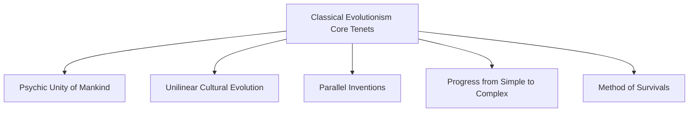

* **Psychic Unity of Mankind:** Formulated by German anthropologist **Adolf Bastian**, this principle posits that human minds share a common, universal cognitive structure across all races. Therefore, given similar environmental challenges, different human groups will independently devise similar solutions.
* **Unilinear Cultural Evolution (UCE):** A deterministic view that all human societies progress through the **exact same stages of development** (traditionally: *Savagery → Barbarism → Civilization*). Societies develop at different speeds, explaining why some are "advanced" (European) while others are "primitive" (indigenous).
* **Parallel Inventions:** Similarities in cultural traits across geographically isolated societies are attributed to independent, parallel inventions (driven by Psychic Unity) rather than cultural borrowing (diffusion).
* **Method of Survivals:** Formulated by **E.B. Tylor**, "survivals" are customs, beliefs, or practices that originated in an earlier stage of culture and have persisted into a later stage by force of habit, despite losing their original utility (e.g., standard buttons on modern jacket sleeves, or saying "Bless you" when someone sneezes). Survivals serve as "fossilized proof" of a society's past evolutionary stages.
  > * **UPSC Value Addition (Indian Context):** In the Indian context, the persistence of certain tribal totemic beliefs integrated into mainstream Hindu village festivals, or the continued use of earthen pots in high-tech modern Indian kitchens for specific rituals, can be analyzed as cultural survivals.

---

### II. KEY THINKERS & LITERATURE

The school is anchored by three primary "armchair" scholars: E.B. Tylor, L.H. Morgan, and J.G. Frazer.

---

### 1. EDWARD BURNETT TYLOR (1832–1917)
*Known as the "Father of Modern Anthropology."*

#### A. Core Literature
* **Researches into the Early History of Mankind and the Development of Civilization (1865)**
* **Primitive Culture (1871)** — His magnum opus.

#### B. The Scientific Definition of Culture
In the opening line of *Primitive Culture (1871)*, Tylor provided the first scientific, inclusive definition of culture, shifting it from an elitist concept of refinement to an ethnographic one:
> *"Culture or Civilization, taken in its wide ethnographic sense, is that complex whole which includes knowledge, belief, art, morals, law, custom, and any other capabilities and habits acquired by man as a member of society."*

* **Key Elements of Tylor's Definition:**
  * **Holism:** "Complex whole" indicates that culture is integrated.
  * **Socially Transmitted:** "Acquired by man as a member of society," meaning culture is learned and not biologically inherited.

#### C. Evolution of Religion
Tylor argued that religion originated from intellectual curiosity rather than fear. Early humans, observing dreams, shadows, and death, postulated the existence of a double self or "soul." He termed this belief **Animism** (the minimum definition of religion).


1. **Animism:** Belief in spiritual beings inhabiting both living humans and inanimate objects (trees, rivers).
2. **Ancestral Worship:** Worshipping the departed souls of ancestors.
3. **Polytheism:** Worshipping multiple specialized deities (e.g., God of Rain, God of War).
4. **Monotheism:** Worshipping a single supreme deity (the pinnacle of religious evolution, epitomized by Victorian Christianity).

> [!TIP]
> **Mnemonic to remember Tylor's stages:** **AAPM** (Aap PM hain)
> * **A**nimism $\rightarrow$ **A**ncestral Worship $\rightarrow$ **P**olytheism $\rightarrow$ **M**onotheism.

---

### 2. LEWIS HENRY MORGAN (1818–1881)
*The premier American evolutionist, who engaged in direct study of the Iroquois tribe (Seneca).*

#### A. Core Literature
* **Systems of Consanguinity and Affinity of the Human Family (1871)** — Established the subfield of Kinship Studies.
* **Ancient Society (1877)** — Outlined his grand unilinear evolutionary scheme.

#### B. Evolutionary Scheme of Technology and Social Stages
Morgan divided human history into three major periods, subdividing Savagery and Barbarism into Lower, Middle, and Upper statuses, each marked by a technological breakthrough:

| Stage | Status | Technological / Subsistence Diagnostic |
| :--- | :--- | :--- |
| **I. SAVAGERY** | **Lower** | Gathering of wild fruits and nuts. No fire. |
| | **Middle** | Discovery of fire and fishing subsistence. |
| | **Upper** | Invention of the Bow and Arrow. |
| **II. BARBARISM** | **Lower** | Invention of Pottery. |
| | **Middle** | Domestication of animals (West) and irrigation/maize cultivation (East). |
| | **Upper** | Smelting of Iron Ore. |
| **III. CIVILIZATION** | **-** | Invention of the Phonetic Alphabet and Writing. |

#### C. Evolution of Marriage and Family
Morgan asserted that the institutions of marriage and family progressed through fifteen developmental stages. The five major stages are:

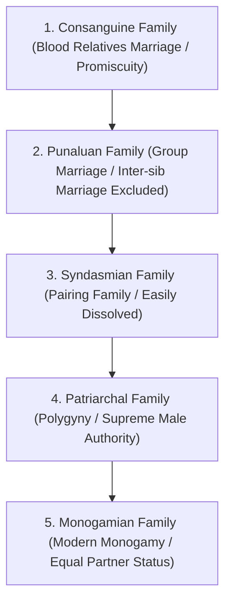

* **Consanguine Family:** Early sexual promiscuity where marriage between blood relatives (including siblings) was not forbidden.
* **Punaluan Family:** Group marriage where a group of brothers married a group of sisters collectively. Excluded marriages within the immediate sibling unit.
* **Syndasmian Family:** A temporary pairing marriage where one man and one woman cohabited, but the marriage could be easily dissolved by either partner.
* **Patriarchal Family:** A male-dominated family structure where one husband cohabited with several wives under supreme male authority.
* **Monogamian Family:** The highly evolved modern structure based on strict monogamy with co-equal status for both spouses, securing property inheritance.

> [!TIP]
> **Mnemonic to remember Morgan's stages:** **CPSPM**
> * *English:* **C**ute **P**enguins **S**wim **P**ast **M**adagascar.
> * *Hindi:* **C**hintu **P**intu **S**aath **P**adhe **M**adras.
> *(Consanguine $\rightarrow$ Punaluan $\rightarrow$ Syndasmian $\rightarrow$ Patriarchal $\rightarrow$ Monogamian)*

#### D. Evolution of Kinship Systems
In *Systems of Consanguinity and Affinity (1871)*, Morgan divided all global kinship systems into two large, evolutionary categories:

1. **Classificatory Kinship Systems:** The same term is used to designate multiple relatives across different genealogical lines (e.g., calling father's brother, mother's brother, and father all by the term "Father"). 
   * *Evolutionary Status:* Uncivilized / Primitive. Reflects ancient communal living and group marriages where individual biological parentage was uncertain.
2. **Descriptive Kinship Systems:** Separate terms are used for separate, specific genealogical relationships (e.g., "Father", "Uncle", "Aunt").
   * *Evolutionary Status:* Civilized. Evolved alongside the **rise of private property** and the need for clear lineal transmission of wealth to legitimate descendants.

> [!TIP]
> **Key Insight for Answer Writing:** Morgan was one of the first to link **Social Structure (Kinship/Family)** directly to the **Economic System (Private Property Rights)**, precursing historical materialism.

#### E. Socio-Political Evolution
Morgan argued that political organization evolved across two distinct paradigms:
1. **Societas (Kinship-based):** Primitive political power rested on personal relations, exogamous groups (*gentes*), and tribes. Social control was maintained through moral authority and exogamy to prevent inbreeding.
2. **Civitas (Property & Territory-based):** Civilized government rests on territory and property. Exogamous kinship ties are replaced by municipal districts, written laws, and state structures.

---

### 3. JAMES GEORGE FRAZER (1854–1941)
*An archetypal armchair anthropologist who compiled massive cross-cultural data.*

#### A. Core Literature
* **The Golden Bough (1890)** — Originally 2 volumes, later expanded to 12 volumes of comparative mythology and ritual.

#### B. The Intellectual Stages of Mankind
Frazer posited that human cognitive development and explanation of the universe evolved through three sequential stages:


* **Stage 1: Magic (The Age of Magic):** Early humans sought to control nature directly using laws of cause and effect. However, their logic was based on "false analogies." Frazer classified this as **Sympathetic Magic**, which operates on two principles:
  1. *Law of Similarity (Homoeopathic Magic):* "Like produces like." An effect can be produced by imitating it.
     * *Example:* Pouring water on the ground to trigger a rainstorm; burning or stabbing an effigy of an enemy to cause them physical harm.
  2. *Law of Contact / Contagion (Contagious Magic):* "Once in contact, always in contact." Things that were once in physical contact continue to act on each other even after being separated.
     * *Example:* Obtaining hair, nail clippings, or old clothing of a target and burning them to inflict illness on the owner.
* **Stage 2: Religion (The Age of Religion):** As human cognition matured, people realized magic was ineffective—their imitative rituals failed to control the weather or cure diseases. They concluded that nature was controlled by invisible, powerful spirits or deities. Consequently, they abandoned magical control and turned to **Propitiation and Prayer** to appease these higher powers.
* **Stage 3: Science (The Age of Science):** When religious prayers failed to provide consistent, predictable material results, the human mind progressed to science. Science returned to the concept of cause and effect (originally seen in magic) but replaced magical thinking with **rational observation, experimentation, and objective natural laws**.

> [!TIP]
> **Mnemonic for Frazer's Intellectual Stages:** **MRS**
> * **M**agic $\rightarrow$ **R**eligion $\rightarrow$ **S**cience.

---

### III. SYNTHESIS: COMPARATIVE MATRIX OF SCHEMA

| Dimension | E.B. Tylor | L.H. Morgan | J.G. Frazer |
| :--- | :--- | :--- | :--- |
| **Focus Area** | Evolution of Religion & Definition of Culture | Evolution of Technology, Family, Kinship, & Polity | Intellectual Development (Magic, Religion, Science) |
| **Key Book** | *Primitive Culture (1871)* | *Ancient Society (1877)* | *The Golden Bough (1890)* |
| **Starting Stage** | Animism | Lower Savagery | Age of Magic |
| **Middle Stage(s)** | Polytheism | Barbarism (Lower, Middle, Upper) | Age of Religion |
| **Climax Stage** | Monotheism (Victorian Era) | Civilization (Writing & Property) | Age of Science |
| **Core Method** | Comparative Method, Survivals | Technological diagnostics, Kinship terminologies | Cross-cultural mythological compilations |

---

### IV. CRITICAL EVALUATION OF CLASSICAL EVOLUTIONISM

While pioneering, 19th-century evolutionism was heavily critiqued by subsequent schools (e.g., Historical Particularism, Diffusionism, Functionalism).

#### 1. Methodological Fallacy: "Armchair Anthropology"
* **Critique:** The evolutionists rarely conducted firsthand fieldwork. They gathered data from secondary sources—often highly biased, incomplete accounts written by colonial administrators, military personnel, and Christian missionaries.
* **Key Critic:** **Franz Boas** and **James Ferguson** (Harvard) labeled the theory "empirically flawed," emphasizing that these models focused on abstract theories over deep empirical observation.
* *Exceptions:* Morgan lived briefly among the Iroquois, but his global comparisons still relied on questionnaires mailed to colonial consul offices.

#### 2. Ethnocentrism and Racism
* **Critique:** Evolutionists used derogatory, subjective terms like "Savage" and "Barbaric." They assumed Western/Victorian society (Protestant Monotheism, monogamy, science, and private property) was the absolute pinnacle of human evolution.
* **Key Critic:** **Claude Lévi-Strauss** argued that this "pseudo-evolutionism" was merely a tool to intellectually justify European colonialism by labeling non-Western societies as "living fossils" stuck in the past.

#### 3. The Fallacy of the Unilinear Assumption
* **Critique:** The idea that all societies must pass through a singular, rigid sequence of stages is incorrect.
* **Key Critic:** American Diffusionists pointed out that societies can skip stages entirely through cultural borrowing (**diffusion**). For example, a Stone Age tribe can directly adopt iron tools or modern technology from a neighboring society without inventing metallurgy themselves.

#### 4. The Comparative Method (Speculative History)
* **Critique:** They used the "Comparative Method"—pulling custom details out of context from completely different societies (e.g., comparing a modern Australian Aboriginal ritual to prehistoric European cave art) to fill in the "gaps" of their evolutionary sequences. This was labeled "speculative history" because it ignored the unique historical context of individual societies.

---

### V. CONTRIBUTIONS & LEGACY

Despite its major limitations, Classical Evolutionism laid the cornerstone of modern anthropology:

1. **Establishment of the Discipline:** It transitioned the study of human cultures from theological speculation to an organized, comparative, and scientific academic discipline.
2. **First Scientific Definition of Culture:** Tylor’s holistic and socially learned definition of culture remains the baseline definition in anthropology textbooks today.
3. **Foundation of Kinship Studies:** Morgan's pioneering work in classifying terminologies (classificatory vs. descriptive) created the entire academic field of kinship analysis.
4. **Bastian's Psychic Unity:** The concept of psychic unity was highly progressive for its time, as it biologically asserted that all human races possess equal cognitive potential—directly opposing the racial determinism and scientific racism common in the 19th century.

---

### VI. UPSC PREVIOUS YEAR QUESTIONS (PYQs) & ANSWER BLUEPRINTS

---

#### PYQ 1: Critically evaluate Lewis Morgan's classification of family. [2021, 15 Marks]

* **Introduction (Approx. 40 words):** Define L.H. Morgan as a pioneer 19th-century classical evolutionist. In his landmark book *Ancient Society (1877)*, he postulated that the family is a dynamic institution that evolved through five main stages, progressing from early promiscuity to modern monogamy.
* **Body Skeleton (5-6 Bullet Points):**
  * *Outline the Five Stages:* Detail the exact sequence: Consanguine (promiscuity) $\rightarrow$ Punaluan (group marriage) $\rightarrow$ Syndasmian (pairing) $\rightarrow$ Patriarchal (polygyny) $\rightarrow$ Monogamian (monogamy).
  * *Economic Linkage:* Explain how Morgan linked family structures to property rights. The "Monogamian" family emerged not out of moral progress, but to ensure certain paternity and clear transmission of private property to lineal descendants.
  * *Critique of the "Promiscuity" Stage:* Note that modern anthropological research (e.g., Edvard Westermarck, Malinowski) has proven that sexual promiscuity was never a universal starting stage. Almost all known primitive hunter-gatherer societies (like the Andaman Islanders or Bushmen) practice nuclear family monogamy/pairing.
  * *Unilinear and Ethnocentric Fallacy:* Criticize the rigid unilinear sequence. Morgan assumed that Victorian monogamy was the final "perfect" stage, ignoring successful alternate kinship and family structures globally (e.g., matrilineal joint families).
  * *Methodological Weakness:* Critique his reliance on secondary, "armchair" reports and speculative history rather than deep ethnographic fieldwork.
* **Conclusion (Approx. 40 words):** While Morgan's scheme was empirically flawed and ethnocentric, his brilliant insight connecting family evolution to private property and economic material changes laid the foundation for Engels' *The Origin of the Family, Private Property and the State*, securing his legacy in structural anthropology.

---

#### PYQ 2: How did Morgan explain the evolution of marriage, family and Socio-Political organization, and how did other evolutionists disagree with his explanation? [2015, 20 Marks]

* **Introduction (Approx. 40 words):** In *Ancient Society (1877)*, L.H. Morgan presented a comprehensive unilinear evolutionary framework of human society. He argued that technology, marriage, family, kinship, and socio-political systems evolved in tandem from simple, kinship-based structures to complex, state-based civilizations.
* **Body Skeleton:**
  * *Morgan's Explanation:*
    * **Marriage & Family:** Evolved through 5 stages (Consanguine to Monogamian) driven by property rights.
    * **Kinship:** Shifted from *Classificatory* (communal property, group marriage) to *Descriptive* (private property, inheritance).
    * **Polity:** Shifted from *Social structure / Societas* (exogamous kinship groups, gentes) to *Civitas* (territory, property, written law).
  * *Disagreement by Other Evolutionists:*
    * **E.B. Tylor's Disagreement:** Tylor focused on the evolution of *religion and belief* (Animism $\rightarrow$ Monotheism) rather than property and technology. He relied heavily on the comparative statistical method (couvade, exogamy) and did not agree with Morgan’s hyper-rigid fifteen stages of family.
    * **J.G. Frazer's Disagreement:** Frazer argued that human evolution was driven by *intellectual development* and cognitive systems (Magic $\rightarrow$ Religion $\rightarrow$ Science) rather than material technology or kinship rules.
    * **J.F. McLennan's Disagreement:** McLennan argued that early societies began with *exogamy* (due to female infanticide leading to bride capture), leading to polyandry first, whereas Morgan prioritized matrilineal exogamous gentes.
* **Conclusion (Approx. 40 words):** While 19th-century evolutionists disagreed on the specific primary driver of culture change (technological vs. cognitive vs. religious), they all shared the unilinear assumption of human progress, creating a rich intellectual debate that established anthropology as a comparative science.

---
---

## TOPIC 2: DIFFUSIONISM & HISTORICAL RECONSTRUCTION

> [!NOTE]
> **Syllabus Mapping:** 
> * Paper I, Unit 6: Anthropological Theories — Diffusionism.
> * Connects with: Unit 2.1 (Culture change mechanisms: Innovation, Diffusion, Acculturation).

---

### I. CORE CONCEPT: DIFFUSION VS. EVOLUTION

Diffusionism emerged in the early 20th century as a direct counter-theory to Classical Evolutionism. While evolutionists argued that human culture changed primarily through **independent inventions** (driven by the Psychic Unity of Mankind), diffusionists argued that **humans are basically uninventive**. Consequently, major cultural breakthroughs (like agriculture, metallurgy, or writing) occurred in only a few specific geographic hubs and then spread globally through **diffusion** or **migration**.

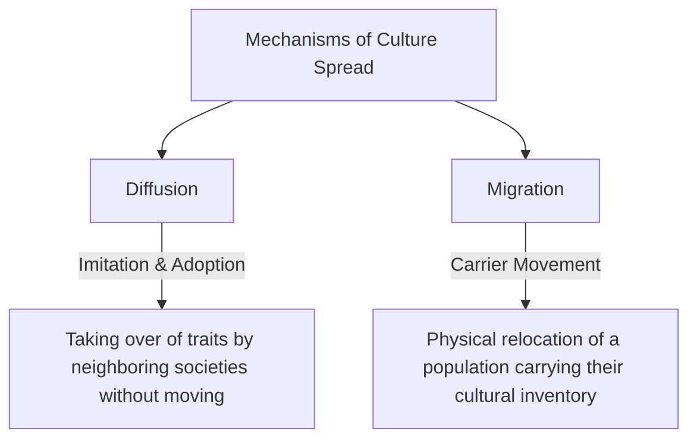

---

### II. THE THREE SCHOOLS OF DIFFUSIONISM

Diffusionism split into three distinct regional schools, varying in scientific rigor:

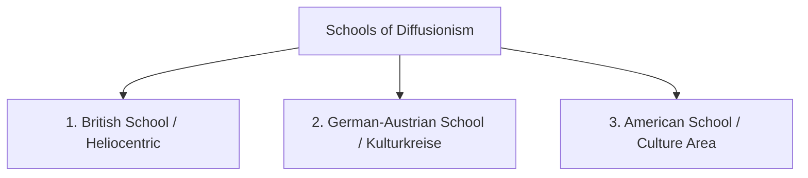

---

### 1. THE BRITISH SCHOOL (PAN-EGYPTIAN / HELIOCENTRIC DIFFUSIONISM)
*The most extreme and speculative school of diffusionism.*

#### A. Key Thinkers & Literature
* **G. Elliot Smith (1871–1937):** Wrote *The Migrations of Early Culture (1915)*.
* **William J. Perry (1887–1949):** Wrote *The Children of the Sun (1923)*.
* **W.H.R. Rivers (1864–1922):** Initially an evolutionist, he converted to diffusionism after studying Melanesian society. Wrote *The History of Melanesian Society (1914)*.

#### B. Core Postulate: Pan-Egyptology
* **The Claim:** Prior to 4000 BC, primitive humanity lived in a "cultureless" state of nature. In ancient Egypt, a unique combination of ecological factors (regular Nile floods) led to the independent invention of agriculture, domestication of animals, metallurgy, writing, sun-worship, and complex social stratification.
* **The Spread:** From Egypt, these traits diffused via maritime trade and migration to the rest of the world (Mediterranean, India, Southeast Asia, and Mesoamerica). 
  > * **UPSC Value Addition:** In Indian anthropology, scholars like S.C. Roy and D.N. Majumdar studied diffusion between tribes and castes. Concepts like M.N. Srinivas's **Sanskritization** can be seen as a specialized form of internal, upward cultural diffusion where lower castes borrow traits from upper castes.
* **The Name:** Called **Heliocentric** (sun-centered) because sun-worship was considered the diagnostic cultural marker of Egyptian influence, and the rulers were labeled "Children of the Sun."
* **Critique:** Highly unscientific and speculative. It ignored the carbon-dating and archaeological evidence of older independent agricultural centers in Mesopotamia, India (Mehrgarh), and China.

---

### 2. THE GERMAN-AUSTRIAN SCHOOL (CULTURE HISTORICAL SCHOOL / KULTURKREISE)
*A more sophisticated, geographically oriented school that attempted historical reconstruction.*

#### A. Key Thinkers & Literature
* **Friedrich Ratzel (1844–1904):** The father of anthropo-geography. Wrote *Anthropogeographie (1882)*.
* **Fritz Graebner (1877–1934):** Wrote *Method of Ethnology (1911)*.
* **Wilhelm Schmidt (1868–1954):** A Catholic priest who wrote *The Origin of the Idea of God (1912)*.

#### B. The Concept of Kulturkreise (Culture Circles)
* Graebner and Schmidt argued that human culture did not originate in a single place (unlike the British school). Instead, a small number of **primary culture complexes** or **culture circles (Kulturkreise)** emerged in different geographical regions at different times.
* As these culture circles expanded, they overlapped, collided, and diffused outward. The task of the anthropologist is to historically reconstruct how these circles migrated and blended to form modern complex cultures.

#### C. Ratzel's Criteria for Historical Connection (Borrowing)
To distinguish between an independent invention and a historical borrowing, Ratzel and Graebner formulated two highly objective criteria:

1. **Criterion of Quality / Form:** If two similar cultural traits share intricate qualities, designs, or forms that are **entirely unrelated to their functional utility** (e.g., identical decorative carvings on canoe paddles or specific feather arrangements on spears in widely separated regions), the similarity cannot be accidental. It must be due to borrowing or migration.
2. **Criterion of Quantity:** The greater the number of distinct, unrelated cultural traits found in common between two widely separated societies, the higher the mathematical probability that the two cultures share a historical connection.

---

### 3. THE AMERICAN SCHOOL (CULTURE AREA SCHOOL)
*The most empirical, scientifically sound school, deeply rooted in North American fieldwork.*

#### A. Key Thinkers & Literature
* **Clark Wissler (1870–1947):** Wrote *The American Indian (1917)*.
* **Alfred Kroeber (1876–1960):** Wrote *Cultural and Natural Areas of Native North America (1939)*.

#### B. The Concept of Culture Area
* A **Culture Area** is a continuous geographical region in which highly distinct societies share a significant number of similar cultural traits (e.g., subsistence methods, shelter styles, social organization).
* These similarities arise because geographically contiguous groups adapt to similar ecological environments and borrow cultural traits from one another.
* *Example:* The Plains Indians of North America (sharing traits like buffalo hunting, tepees, and the Sun Dance).

#### C. Wissler's Age-Area Hypothesis (Age-Area Law)
Wissler formulated a spatial-temporal model to determine the relative age of cultural traits:
* **The Principle:** The age of a cultural trait is directly proportional to its geographical distribution. 
* **The Logic:** A trait originates at a specific **Culture Center** and slowly diffuses outward in concentric circles (like ripples in a pond when a pebble is dropped). Therefore, a trait that is found distributed across the widest geographical area is the **oldest**, while a trait confined to a small, localized zone is the **youngest**.

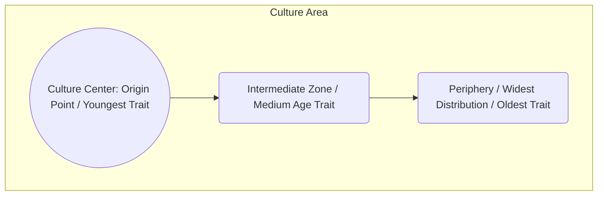

---
---

## TOPIC 3: HISTORICAL PARTICULARISM (FRANZ BOAS)

> [!NOTE]
> **Syllabus Mapping:** 
> * Paper I, Unit 6: Anthropological Theories — Historical Particularism.
> * Connects with: Unit 2.1 (Concept of Culture), Unit 7 (Research Methods in Anthropology).

---

### I. CORE CONCEPT & HISTORICAL FOUNDATION

**Historical Particularism** was developed by **Franz Boas (1858–1942)**—widely regarded as the **Father of American Anthropology**. Boas was trained as a physicist and geographer in Germany. During a geographic expedition to Baffin Island to study the Inuit, he realized that their cultural habits and worldview were shaped by their unique historical development and psychological perceptions rather than direct physical geography.

Boas formulated Historical Particularism as a **drastic, scientific rejection of the speculative methods of 19th-century unilinear evolutionism**.

> [!NOTE]
> **Beginner's Analogy:** If Evolutionists saw culture as a single staircase everyone climbs, Boas saw culture as a dense forest. Every society walks its own unique, winding path through the forest, shaped by its own specific history, environment, and neighbors. You cannot compare their paths because they all lead to different destinations.

---

### II. THE TRANSITION FROM DEDUCTIVE TO INDUCTIVE METHOD

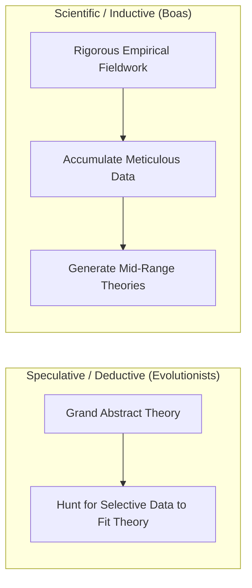

* **The Evolutionist (Deductive) Fallacy:** Early evolutionists sat in their armchairs, formulated grand speculative laws (like unilinear evolution), and then selectively searched through biased traveler reports to find facts that fit their preconceived models.
* **The Boasian (Inductive) Revolution:** Boas argued that anthropology must become a rigorous, empirical science. Anthropologists must **gather detailed, first-hand data first** through exhaustive fieldwork (ethnology, physical traits, linguistics, and archaeology) and only then attempt to derive local historical patterns or theories. He famously called for a moratorium on formulating "grand universal laws of human progress" until sufficient empirical data had been gathered globally.

---

### III. THE CORE TENETS OF BOAS' HISTORICAL PARTICULARISM

#### 1. Particularism (Historical Unique Paths)
Boas argued that **there are no universal laws of cultural development**. Every culture has its own, unique, **idiographic history** shaped by:
* The local environment.
* The unique psychological response of its members.
* The specific contacts and borrowings (diffusion) from neighboring cultures.
Therefore, two similar-looking cultural traits (e.g., totem poles in Canada vs. ancestor posts in Africa) might have completely different histories, functions, and psychological meanings.

#### 2. Rejection of Geographic & Biological Determinism
Boas proved that culture, not biology or geography, determines human behavior. Through his landmark study of immigrant head shapes (*Changes in Bodily Form of Descendants of Immigrants, 1912*), he demonstrated that cranial shapes (previously thought to be a static racial marker) changed within one generation due to environmental and nutritional factors, completely debunking the prevailing scientific racism of the era.

#### 3. Cultural Relativism
Because each culture is the unique product of its own history, **there is no objective scale of "savage" to "civilized."** 
* A culture's morality, aesthetics, and behavioral standards can only be understood in the context of its own historical development.
* We must actively avoid **ethnocentrism**—judging another culture by the standards of our own (usually Western) culture.

#### 4. The Mandatory Four-Field Approach
Boas established the foundational "Four-Field Approach" in American anthropology, insisting that a holistic understanding of a human group requires simultaneous study of:
1. **Cultural Anthropology** (Ethnography and participant observation).
2. **Linguistics** (Recording the native language, as language reflects the cognitive category of a culture).
3. **Physical Anthropology** (Measuring bodily changes and genetics).
4. **Archaeology** (Reconstructing the past material culture).

---

### IV. THE BOAS-MASON MUSEUM DEBATE (ETHNOGRAPHIC SHOWCASE)
*A landmark intellectual clash that redefined how material culture is presented.*

* **O.T. Mason's Position (Evolutionist):** Organized the Smithsonian Institution museum displays **by artifact classes** (e.g., a display containing arrows from 50 different global tribes, sorted by evolutionary complexity). Mason wanted to show the universal progress of human technology.
* **Franz Boas' Counter-Argument:** Strongly objected to Mason’s display. Boas argued that displaying artifacts out of their local cultural context was misleading. Similar-looking arrows could serve completely different ceremonial, economic, or hunting functions. 
* **The Resolution:** Boas successfully forced museums to arrange displays by **Geographical/Cultural groups**. Visitors could now see the holistic context of a single tribe (shelter, clothing, weapons, art, and ritual tools together) and understand how proximity led to borrowing (diffusion) between neighboring tribes.

---

### V. EVOLUTIONISM VS. DIFFUSIONISM VS. HISTORICAL PARTICULARISM

| Theoretical Dimension | Classical Evolutionism | Diffusionism Schools | Historical Particularism |
| :--- | :--- | :--- | :--- |
| **Primary Driver of Change** | Independent Invention (Internal) | Cultural Borrowing / Migration (External) | Particular History, Local Psychology, & Contact |
| **Human Nature View** | Creative, inventive (Psychic Unity) | Uninventive, imitative | Highly adaptive, culturally relative |
| **Universal Laws** | Yes, rigid unilinear stages (UCE) | No, local centers of origin | No, strongly rejects universal laws |
| **Methodological Approach** | Deductive, speculative, comparative | Inductive, trait mapping, comparative | Inductive, intensive fieldwork, particularistic |
| **Data Collection** | "Armchair" (missionary reports) | Mapping distributions (armchairs/surveys) | Exhaustive, first-hand four-field fieldwork |
| **Key Scholars** | Tylor, Morgan, Frazer | Smith, Perry, Ratzel, Wissler, Kroeber | Franz Boas |

---

### VI. UPSC PREVIOUS YEAR QUESTIONS (PYQs) & ANSWER BLUEPRINTS

---

#### PYQ 1: Discuss Historical Particularism as a critical development to Classical Evolutionism. [2024, 20 Marks]

* **Introduction (Approx. 40 words):** Historical Particularism, pioneered by Franz Boas in the early 20th century, arose as a revolutionary paradigm shift in anthropology. It was a direct, scientific critique of the speculative, ethnocentric, and unilinear assumptions of 19th-century Classical Evolutionism.
* **Body Skeleton:**
  * *Critical Development 1: Rejection of speculative unilinear stages.* While evolutionists (Tylor, Morgan) forced all human societies into a uniform sequence (Savagery $\rightarrow$ Barbarism $\rightarrow$ Civilization), Boas argued that every culture has a unique, idiographic historical path.
  * *Critical Development 2: Deductive vs. Inductive Methodology.* Evolutionists sat in their armchairs and used deductive reasoning, twisting facts to fit pre-conceived laws. Boas introduced the **inductive scientific method**, requiring exhaustive first-hand fieldwork before formulating theories.
  * *Critical Development 3: Combating Scientific Racism and Ethnocentrism.* Evolutionists ranked non-Western societies as "primitive savages." Boas established **Cultural Relativism**, proving that differences between human groups are cultural, not biological, thereby debunking scientific racism.
  * *Critical Development 4: Rejection of the Comparative Method.* Boas critiqued the comparative method of pulling cultural traits out of context. He proved that similar cultural products could arise from completely different historical trajectories (particularism).
* **Conclusion (Approx. 40 words):** By dismantling the speculative structures of unilinear evolutionism, Historical Particularism established anthropology as a rigorous, empirically grounded, and culturally relativistic four-field science, shaping the future of twentieth-century ethnology.

---

#### PYQ 2: How do Diffusionism & Evolutionism differ as explanations of Culture change? [2015, 15 Marks]

* **Introduction (Approx. 40 words):** Culture change represents the transformation of cultural traits, institutions, and beliefs over time. Classical Evolutionism and Diffusionism represent the two earliest, opposing paradigms in anthropology explaining the primary mechanics of this change.
* **Body Skeleton:**
  * *Difference in Primary Mechanism:* Evolutionism explains change through **internal innovation** and independent inventions driven by the psychic unity of mankind. Diffusionism attributes change to **external contact**, borrowing, and migration.
  * *View of Human Inventiveness:* Evolutionists view humans as highly inventive, naturally progressing from simple to complex. Diffusionists argue that humans are fundamentally uninventive; major traits are invented once (or in few circles) and then spread.
  * *View of Cultural Similarities:* Evolutionists explain similarities across regions as **Parallel Inventions** (parallel evolution). Diffusionists explain them as historical proof of **contact, borrowing, or migration** (historical connections).
  * *Use of Geography and Environment:* Evolutionism largely ignores geographic boundaries in its unilinear stages. Diffusionism (especially the German and American schools) relies heavily on geographic mapping, trait distribution, and ecological adaptation (e.g., Culture Areas).
  * *Methodological Difference:* Evolutionists used the deductive comparative method to fill historical gaps. Diffusionists used criteria (e.g., Ratzel's Form and Quantity criteria) to scientifically trace historical trajectories.
* **Conclusion (Approx. 40 words):** While Evolutionism provided a grand, systemic view of human progress, and Diffusionism highlighted the critical role of intercultural contact, modern anthropology synthesizes both—recognizing that cultural change is a dynamic mix of internal innovation and external borrowing.

---

#### PYQ 3: Define culture area. How did it help American diffusionists to understand diffusion of culture? [15 Marks]

* **Introduction (Approx. 40 words):** Formulated by Clark Wissler and refined by Alfred Kroeber, a **Culture Area** is a continuous geographical region where distinct, contiguous societies share a significant cluster of similar cultural traits due to geographic proximity and ecological adaptation.
* **Body Skeleton:**
  * *Core Concept of Culture Area:* Societies living in similar environmental zones (e.g., Plains, Northwest Coast) face similar challenges. Through local adaptation and intensive intercultural contact, they borrow traits from each other, leading to high cultural homogeneity within the region.
  * *Diagnostic Zones (Center vs. Climax):* Clark Wissler defined the **Culture Center** as the geographic core of the culture area where the trait complex is most dense and fully developed. Alfred Kroeber introduced the term **Culture Climax** to represent the area of greatest complexity and integration of these traits.
  * *Application: The Age-Area Hypothesis:* Wissler formulated the Age-Area law, asserting that the relative age of a cultural trait is proportional to its geographical distribution. A trait originating at the "Culture Center" diffuses outward in concentric ripples. Hence, traits found at the periphery (widest distribution) are the oldest, while those localized at the center are the youngest.
  * *Explanatory Utility:* This model helped American diffusionists move away from extreme, unscientific theories (like the British Pan-Egyptian school) by grounding diffusion in empirical, geoclimatic, and map-based tribal fieldwork in North America.
* **Conclusion (Approx. 40 words):** The Culture Area concept successfully demonstrated that culture change is systematically linked to geographic constraints and borrowing, introducing empirical and ecological dimensions that enriched 20th-century American cultural anthropology.

---
---

## TOPIC 4: FUNCTIONALISM & STRUCTURAL-FUNCTIONALISM

> [!NOTE]
> **Syllabus Mapping:** 
> * Paper I, Unit 6: Anthropological Theories — Functionalism (Malinowski) and Structural-Functionalism (Radcliffe-Brown).
> * Connects with: Unit 2.2 (Social Structure, Social Institution, Social Organization), Unit 5 (Religion and Magic).

---

### I. THE ORGANIC ANALOGY & THE COUNTER-REVOLUTION

Functionalism arose in Great Britain in the 1920s as a direct rejection of both the unilinear evolutionists ("speculative history") and the extreme diffusionists ("conjectural history"). Functionalists argued that instead of guessing how a custom evolved in the past, anthropologists must study **how that custom functions in the present, active social system**.

To explain society, functionalists utilized the **Organic Analogy** (originally formulated by Herbert Spencer and Émile Durkheim):

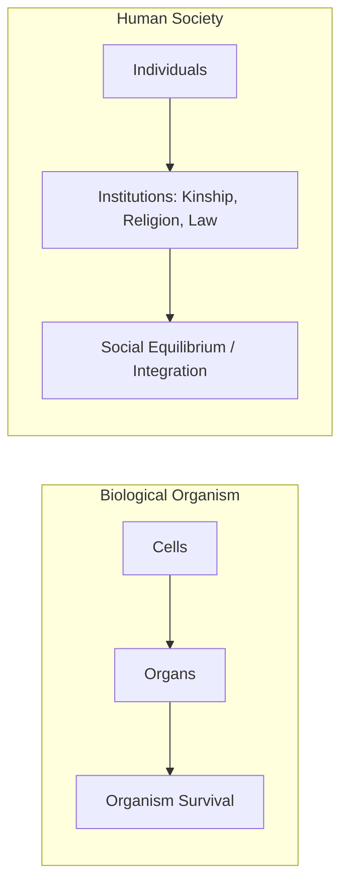

* **The Analogy:** 
  * Individuals are the "cells."
  * Social institutions (marriage, kinship, religion, economy, law) are the "organs" that perform specific tasks.
  * The survival and health of the society (the "organism") depends on the smooth, integrated interaction of these institutional organs.

---

### II. BRONISLAW MALINOWSKI'S INDIVIDUAL FUNCTIONALISM (PSYCHOLOGICAL)
*Pioneered the practice of intensive participant observation fieldwork.*

#### A. Core Literature
* **Argonauts of the Western Pacific (1922)** — The baseline text for modern ethnographic fieldwork.
* **A Scientific Theory of Culture (1944)** — Outlined his formal functional theory.

#### B. The Psychological Hierarchy of Needs
Malinowski posited that culture is an instrumental apparatus created by humans to satisfy their fundamental **biological, psychological, and social needs**. He organized these into three hierarchical tiers:

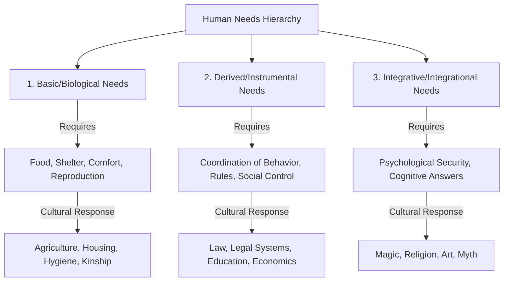

#### C. Ethnographic Case Studies from the Trobriand Islands

1. **The Kula Ring (Ceremonial Exchange Network):**
   * *The Practice:* A vast, inter-island maritime trading ring where red shell necklaces (*soulava*) circulate clockwise and white shell armbands (*mwali*) circulate counter-clockwise.
   * *The Function:* On the surface, exchanging useless shell ornaments seems irrational. However, Malinowski proved it serves vital **derived and integrative functions**: it establishes lifelong socio-political alliances, maintains inter-island peace, coordinates sailing expeditions, and facilitates actual, utilitarian trade (*gimwali*) under the guise of ritual exchange.
2. **Magic, Science, and Anxiety Reduction:**
   * *The Practice:* Trobriand Islanders relied purely on rational technology and empirical knowledge (science) when fishing in the calm, predictable inner **lagoon**. However, when venturing into the dangerous, unpredictable open-sea **barrier reef** (shark-infested, stormy), they performed elaborate magical rituals before setting sail.
   * *The Function:* Magic is not a primitive error (contra Frazer). It serves a critical **psychological integrative function**: it provides a sense of control, reduces acute anxiety, and restores cognitive confidence in the face of danger and chance.

---

### III. A.R. RADCLIFFE-BROWN'S STRUCTURAL-FUNCTIONALISM
*Transitioned functionalism from individual psychology to French sociological structuralism (Durkheimian).*

#### A. Core Literature
* **The Andaman Islanders (1922)**
* **Structure and Function in Primitive Society (1952)**

#### B. Defining "Social Structure" and "Function"
Radcliffe-Brown rejected Malinowski's individualistic psychological needs. He argued that anthropology is the "natural science of society" and its primary unit of study is the **Social Structure**:
* **Social Structure:** The network of actually existing social relations between persons and groups. It is not an abstract concept; it is the concrete reality of statuses, roles, and institutionalized relationships in a village or tribe.
* **Social Function:** The process by which a social institution makes a contribution to the **maintenance, continuity, and survival of the social structure**. Function is about social integration, solidarity, and maintaining equilibrium.

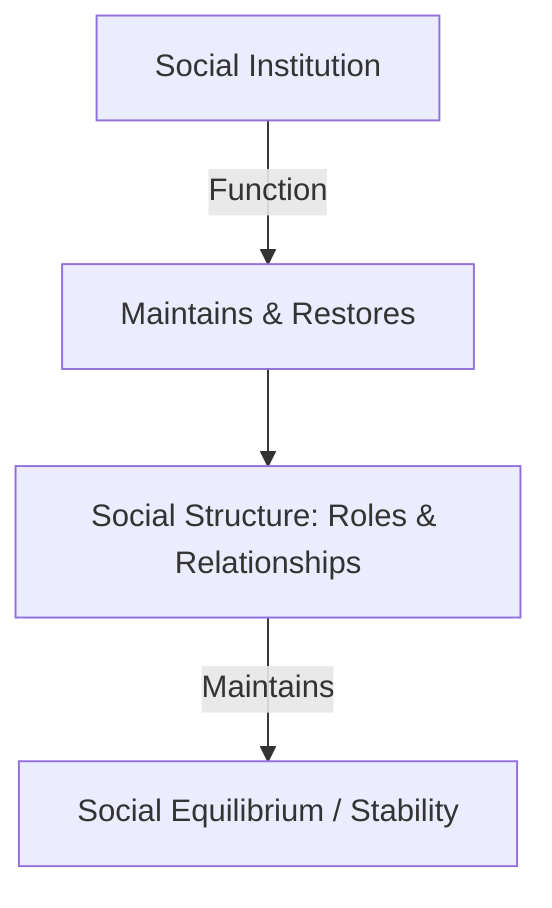

#### C. Major Structural-Functional Mechanisms

1. **Joking and Avoidance Relationships (Kinship Systems):**
   * Radcliffe-Brown analyzed structural friction in kinship (e.g., in-law relationships). 
   * *Avoidance Relationships:* Strict taboos against talking to or looking at mother-in-law. **Function:** Prevents potential domestic conflict and structural friction.
   * *Joking Relationships:* Informal, playful relationships with mother’s brother (maternal uncle) or siblings-in-law. **Function:** Relieves structural tension, acting as a "safety valve" in highly rigid kinship systems where paternal authority is dominant.
2. **Structural Function of Totemism:**
   * Rejects the evolutionary views of Durkheim or Frazer. Radcliffe-Brown argued that **Totemism** represents a mechanism of social integration. By associating specific lineages or clans with natural species (totems), society creates a ritual system that solidifies group identity, enforces exogamy rules, and preserves social solidarity.

---

### IV. COMPARING MALINOWSKI VS. RADCLIFFE-BROWN

| Theoretical Dimension | Malinowski (Functionalism) | Radcliffe-Brown (Structural-Functionalism) |
| :--- | :--- | :--- |
| **Primary Unit of Analysis** | The Individual & Culture | The Social Structure & Institutions |
| **Core Concept** | Psychological/Biological Needs | Social Equilibrium, Integration, & Continuity |
| **Why does an institution exist?** | To satisfy the basic/derived/integrative needs of individuals. | To maintain the continuity of the social structure. |
| **Analogy Focus** | Physiological needs of the organism. | Structural anatomy and systemic integration. |
| **Fieldwork Approach** | Empiricist, highly personal participant observation. | Analytical, sociological, comparative kinship mapping. |
| **View of Magic/Ritual** | Psychological anxiety-reducer for the individual. | Social solidarity-builder for the group. |

---

### V. OTHER FUNCTIONAL CONTRIBUTORS: RALPH LINTON

#### The Status-Role Paradigm
In his classic text *The Study of Man (1936)*, American anthropologist Ralph Linton systematized how social structure operates at the individual level:
* **Status:** A socially defined position that an individual occupies within a social setting (e.g., father, chief, doctor). 
  * *Ascribed Status:* Assigned at birth based on biological or social inheritance (e.g., gender, age, race, caste).
  * *Achieved Status:* Acquired through individual effort, choice, or competition (e.g., prime minister, professor).
* **Role:** The dynamic aspect of status. It is the bundle of behavioral expectations, norms, values, and duties associated with a particular status. One *occupies* a status, but *performs* a role.

---

### VI. CRITICAL EVALUATION OF FUNCTIONALIST THEORIES

1. **The Fallacy of Teleology:**
   * *Critique:* Functionalism is highly teleological—it explains the *cause* of an institution by its *effect* or function (e.g., "The heart exists to pump blood" or "The Kula ring exists to maintain alliances"). This confuses the utility of an institution with its historical origin.
2. **Inability to Explain Social Change (Static Bias):**
   * *Critique:* Because functionalism focuses entirely on maintaining "social equilibrium" and structural integration, it treats society as a static system. It fails to explain how and why societies change, undergo revolutions, or dissolve due to internal contradictions.
3. **The Conservative / Colonial Bias:**
   * *Critique:* By asserting that every existing custom or institution serves a positive function in maintaining the whole, functionalism implicitly validates colonial systems or oppressive traditional hierarchies (e.g., justifying the caste system or child marriage as "integrative mechanisms").
4. **The Fallacy of Indispensability:**
   * *Critique:* Functionalists assumed that certain institutional forms are indispensable to the survival of society (e.g., asserting that the nuclear family is indispensable for socialization). **Robert K. Merton** debunked this, introducing **Functional Alternatives**—different institutions can satisfy the same social need.

---

### VII. UPSC PREVIOUS YEAR QUESTIONS (PYQs) & ANSWER BLUEPRINTS

---

#### PYQ 1: In what ways is Functionalism different from Structural Functionalism? [2013, 20 Marks]

* **Introduction (Approx. 40 words):** Functionalism (pioneered by Bronislaw Malinowski) and Structural-Functionalism (pioneered by A.R. Radcliffe-Brown) emerged in 20th-century British social anthropology. While both utilized the organic analogy to reject evolutionary speculation, they differed fundamentally on the primary unit and goal of functional analysis.
* **Body Skeleton:**
  * *Difference 1: Unit of Analysis (Individual vs. Society):* Malinowski's functionalism is **psycho-biological**—focusing on how culture satisfies the individual's needs. Radcliffe-Brown's model is **sociological**—focusing on how institutions maintain the objective "Social Structure."
  * *Difference 2: Explanation of Needs:* Malinowski postulated a hierarchy of human needs (Basic $\rightarrow$ Derived $\rightarrow$ Integrative). Radcliffe-Brown replaced "needs" with **Necessary Conditions of Existence** required to maintain structural continuity.
  * *Difference 3: Concept of Function:* For Malinowski, function is the satisfaction of a biological or psychological drive. For Radcliffe-Brown, function is the contribution an institution makes to maintaining social integration and structural equilibrium.
  * *Difference 4: Interpretation of Rituals (e.g., Magic & Religion):* Malinowski argued magic functions to relieve individual anxiety during risky endeavors (Trobriand open-sea fishing). Radcliffe-Brown argued rituals function to express and reinforce collective social sentiments (solidarity).
  * *Use a Comparative Table:* Include a concise, 4-point comparison table summarizing these differences (refer to Section IV).
* **Conclusion (Approx. 40 words):** Ultimately, Malinowski's functionalism provided a highly empirical, humanistic understanding of cultural behavior, while Radcliffe-Brown's structural-functionalism established a rigorous, sociological approach that laid the groundwork for structuralism and role theory.

---

#### PYQ 2: "To Radcliffe-Brown 'function' was the contribution an institution makes to the maintenance of social structure." Elucidate in the light of Radcliffe-Brown's contributions to structural-functionalism theory. [20 Marks]

* **Introduction (Approx. 40 words):** In his seminal work *Structure and Function in Primitive Society (1952)*, A.R. Radcliffe-Brown defined social function not in terms of individual needs, but as the process by which social activities maintain the structural continuity and integration of the entire social system.
* **Body Skeleton:**
  * *Define Social Structure:* Explain that to Radcliffe-Brown, social structure is the network of actually existing social relations between persons (statuses and roles).
  * *Elucidate "Function as Maintenance":* Use Émile Durkheim's sociological foundation. Function is the link between the social structure and the process of social life (e.g., just as the function of the lungs is to breathe and keep the body alive, the function of a court is to resolve disputes and keep the social structure stable).
  * *Elucidate through Kinship (Joking & Avoidance):* Show how custom maintains structure. Avoidance rules (e.g., mother-in-law taboo) prevent domestic structural friction. Joking relationships (e.g., with maternal uncle) act as structural safety valves to relieve tensions in rigid, patrilineal systems.
  * *Elucidate through Totemism:* Explain totemism as a structural-functional mechanism. By dividing clans into natural totemic species, society marks boundaries and enforces exogamy rules, ensuring structural order and solidarity.
  * *Critique of the Static Model:* Mention that this view is criticized for being static, teleological, and unable to account for conflict or structural change.
* **Conclusion (Approx. 40 words):** Through his rigorous definition of function, Radcliffe-Brown successfully steered anthropology away from speculative history, building a highly systematic natural science of society that prioritized social cohesion, structural continuity, and systemic equilibrium.

---
---

## TOPIC 4A: STRUCTURALISM (CLAUDE LÉVI-STRAUSS & EDMUND LEACH)

> [!NOTE]
> **Syllabus Mapping:** 
> * Paper I, Unit 6(d): Anthropological Theories — Structuralism (Lévi-Strauss and E. Leach).
> * Connects with: Unit 2.1 (Nature of Culture), Unit 2.5 (Kinship - Descent vs Alliance), and Unit 5 (Mythology and Rituals).

---

### I. CORE POSTULATES OF STRUCTURALISM

Structuralism emerged as a major intellectual movement in the mid-20th century, championed by French anthropologist **Claude Lévi-Strauss**. It completely revolutionized how anthropologists analyze cultural customs, kinship systems, and myths.

> [!NOTE]
> **Beginner's Analogy:** Think of human culture like a language. When you speak, you use grammar rules that you don't actively think about, yet they structure your sentences. Structuralists believe that all human cultures are governed by an unconscious, universal "mental grammar" wired into the human brain.

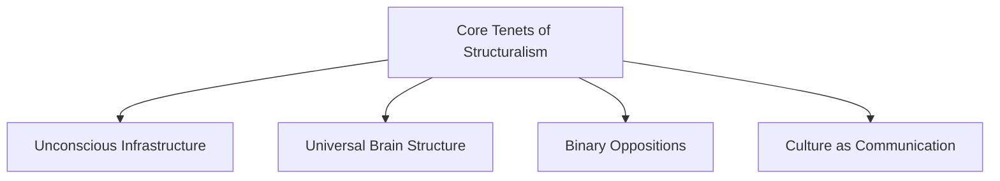

* **Unconscious Infrastructure:** Structuralism looks past surface-level cultural behaviors (phenomena) to uncover the unconscious structural relations (infrastructure) that generate them.
* **Universal Structure of Mind:** Posits that all human brains share a common, hardwired biological structure. Consequently, humans logically process and organize their reality in identical structural patterns globally.
* **Binary Oppositions:** The human mind operates by dividing a continuous reality into contrasting pairs (binary opposites) to make sense of it (e.g., *Raw vs. Cooked, Culture vs. Nature, Self vs. Other, High vs. Low*).
* **Culture as Communication:** Culture is analyzed as a system of signs and symbols (heavily borrowing from Ferdinand de Saussure’s structural linguistics) that communicates underlying mental models.

---

### II. CLAUDE LÉVI-STRAUSS (1908–2009)
*The Father of Anthropological Structuralism.*

#### A. Core Literature
* **The Elementary Structures of Kinship (1949)** — His breakthrough work on kinship.
* **Structural Anthropology (1958)** — Outlined his general methodology.
* **The Raw and the Cooked (1964)** — The first volume of his structural study of myths (*Mythologiques*).

#### B. The Structural Analysis of Kinship (Alliance Theory)
Lévi-Strauss completely rejected Radcliffe-Brown's functionalist view of kinship. Instead, he proposed **Alliance Theory**:

1. **The Incest Taboo as a Transition:** The universal prohibition of incest is not biological or psychological; it is the ultimate social rule. It represents the boundary where man transitions from a state of **Nature** (governed by biological impulse) to a state of **Culture** (governed by social rules).
2. **Exogamy and Exchange:** The negative rule of the incest taboo ("you cannot marry your sister") implies a positive rule: "you must give your sister away to others in exchange for theirs."
3. **Women as Objects of Exchange:** Lévi-Strauss argued that the circulation of women between patrilineages is the most fundamental form of symbolic exchange, establishing enduring alliances and building the structure of society.
4. **The Kinship Atom:** The absolute baseline structural unit of kinship. It consists of four elements: *Brother, Sister, Father, and Son* (reflecting the presence of the maternal uncle as the primary alliance broker).

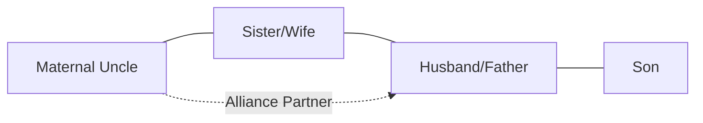

#### C. The Structural Study of Myth
Lévi-Strauss argued that myths from widely different cultures are structurally identical because they are projections of the universal human mind attempting to resolve logical contradictions.
* **Mythemes:** The smallest structural units of a myth (analogous to phonemes in linguistics).
* **Resolution of Contradictions:** A myth always presents two polar extremes (binary opposites, e.g., Life vs. Death) and introduces a third, intermediate term (a **mediator**, e.g., a trickster, coyote, or culture hero) that bridges them to make the contradiction psychologically bearable.

---

### III. EDMUND LEACH (1910–1989)
*The leading British neo-structuralist, who introduced a dynamic, processual approach to structuralism.*

#### A. Core Literature
* **Political Systems of Highland Burma (1954)** — His seminal ethnographic study.

#### B. The Shan and Kachin Dynamic Structuralism
While Lévi-Strauss viewed structures as static and equilibrium-based, Leach proved that structures are dynamic, oscillating, and highly processual. In his study of highland Burma, he mapped two contrasting political structures:

* **Kachin Gumlao:** An egalitarian, democratic, and acephalous (leaderless) political organization. There are no class differences between aristocrats and commoners.
* **Kachin Gumsa:** An aristocratic, ranked, and highly hierarchical organization. It is headed by a prince (*duwa*) who holds hereditary authority, mimicking the lowland Shan states.
* **低地 Shan States:** Extremely stable, highly stratified, feudal Buddhist states ruled by hereditary princes (*saohpa*).

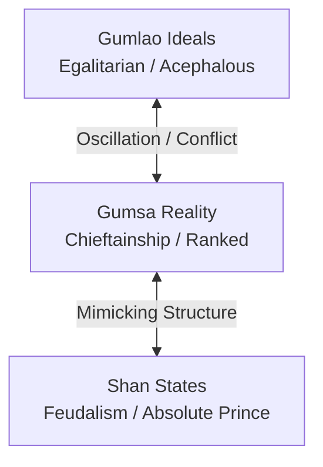

* **The Oscillating Model:** Leach proved that Kachin society is in a constant state of structural tension and oscillation. An egalitarian *gumlao* village, due to the ambition of individuals seeking power, eventually becomes a ranked *gumsa* system. Over time, the *gumsa* system becomes over-centralized and oppressive, triggering a revolution that collapses it back into a *gumlao* structure. 
* **UPSC Value Addition:** Leach showed that social structures are not static realities (as Radcliffe-Brown claimed) but are **competing ideal models** in the minds of actors, who strategically manipulate them for political advantage.

#### C. Leach's Traffic Light Analogy
Leach illustrated Lévi-Strauss' concept of the human mind using a highly intuitive example:

| Signal Color | Universal Spectrum Position | Socially Imposed Meaning |
| :--- | :--- | :--- |
| **Red** | Extreme end of visible spectrum | **Stop** (Action constraint) |
| **Green** | Opposite extreme of visible spectrum | **Go** (Action allowance) |
| **Yellow** | Logical center (midway in spectrum) | **Caution / Prepare to Stop** (Mediating term) |

Leach argued that the mind takes the continuous color spectrum (nature) and imposes a binary opposition (Red vs. Green) to construct a structured signaling system (culture), using Yellow as the structural mediator.

---

### IV. CLASSIC CASE STUDY: THE MYTH OF ASDIWAL (LÉVI-STRAUSS)
The analysis of the **Tsimshian myth of Asdiwal** is a landmark study in structuralist anthropology. Lévi-Strauss treated the myth not as a historical or moral tale, but as a **logical tool** used by the Tsimshian people to resolve fundamental social and existential contradictions.

*   **Structuralism as a Method:** Influenced by Saussurean linguistics, he analyzed the myth as a system of signs. He broke the myth down into **"mythemes"** and analyzed them across four structural levels:
    1.  **Geographical Level:** The hero's movements (mountains vs. sea) map onto tensions between different modes of subsistence (hunting vs. fishing).
    2.  **Economic Level:** Marriages and exchanges in the story reflect real-world social rules regarding trade and resource distribution.
    3.  **Sociological Level:** The narrative addresses internal tensions in Tsimshian society, such as the conflict between patrilineal descent and matrilineal residence rules.
    4.  **Cosmological Level:** The hero's journey between human and supernatural realms acts as a bridge, mediating the ultimate contradiction between nature and culture.
*   **Resolution via Mediation:** Lévi-Strauss argued that the myth does not "solve" these conflicts in reality but provides a **symbolic mediation**. By transforming these contradictions within the narrative, the myth allows the society to "think through" its tensions, maintaining social order.

---

### IV. CRITICAL EVALUATION OF STRUCTURALISM

#### ❌ Limitations & Criticisms
1. **Ahistorical & Static (Lévi-Strauss):** Structuralism completely ignores historical processes, environmental adaptation, and economic changes. It treats culture as a frozen, synchronic grammar.
2. **Lack of Empirical Verification:** Lévi-Strauss' claim of a universal, hardwired brain structure remains an unproven biological assumption, criticized by post-structuralists and cognitive scientists.
3. **Ignores Human Individuality:** It reduces active human beings to passive "executioners" of unconscious structures, ignoring individual agency and free will.
4. **Feminist Critique:** Feminists (e.g., Sherry Ortner) strongly attack Lévi-Strauss' Alliance Theory for treating women strictly as passive "objects of exchange" in transactions between men, denying female agency.
5. **Caroll's Critique of Leach:** David Caroll pointed out that the structural search for mediators is highly subjective. In Leach's Biblical analysis, crawling animals are portrayed as mediators between domestic and wild beasts, which is a forced, unscientific analogy.

####  Academic Strengths
* Introduced unprecedented analytical and linguistic rigor into anthropology.
* Shifted kinship from descriptive genealogy to structural alliance studies.
* Successfully demonstrated that indigenous minds are as logically complex and structured as modern scientific minds, permanently dismantling ethnocentric colonial classifications.

---

### V. UPSC PREVIOUS YEAR QUESTIONS (PYQs) & ANSWER BLUEPRINTS

#### PYQ 1: How does Lévi-Strauss look at the Tsimshian myth of Asdiwal? Critically discuss Lévi-Strauss' theory of structuralism in the light of his study of mythologies. [15 Marks, 2024]
* **Introduction:** Define Lévi-Strauss' structuralism as the search for universal, unconscious cognitive structures (binary oppositions) underlying all human cultures. Introduce the Myth of Asdiwal as his definitive methodological demonstration.
* **Body:**
  * *Methodology (Mythemes):* Explain how he broke the myth into fundamental units (mythemes).
  * *The Four Levels of Analysis:* Detail the geographical, economic, sociological, and cosmological levels.
  * *Binary Oppositions & Mediation:* Explain how the myth juxtaposes opposites (hunting/fishing, patrilineal/matrilineal) and uses the hero Asdiwal to symbolically mediate these unsolvable contradictions.
  * *Critical Discussion:* Contrast his brilliant analytical rigor with criticisms of reductionism (ignoring specific Tsimshian historical context) and over-formalism (reducing emotional storytelling to a rigid algebraic grammar).
* **Conclusion:** Conclude that his analysis of Asdiwal revolutionized cognitive anthropology, proving that "primitive" myths are not irrational fairy tales, but highly sophisticated intellectual systems used to resolve complex societal tensions.

---
---

## TOPIC 4B: CULTURE AND PERSONALITY SCHOOL

> [!NOTE]
> **Syllabus Mapping:** 
> * Paper I, Unit 6(e): Anthropological Theories — Culture and Personality (Mead, Benedict, Kardiner and Linton).
> * Connects with: Unit 2.1 (Nature of Culture), Unit 10 (Concepts of growth and development - Childrearing).

---

### I. CORE THEOLOGICAL PREMISE

Emerging in the United States during the 1930s as a direct offshoot of Boasian anthropology, the **Culture and Personality School** sought to integrate Freudian psychoanalysis, psychology, and ethnographic fieldwork.

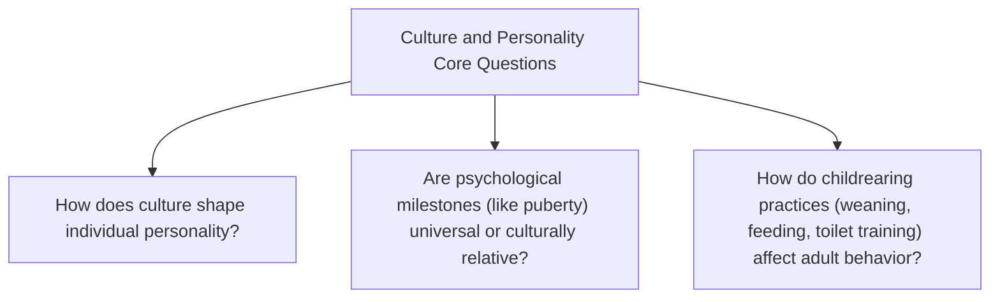

The school rejects psychological determinism. Instead, it asserts that **personality is culturally relative** and that childrearing practices are the primary mechanism through which a society moulds the psychological character of its members.

---

### II. RUTH BENEDICT (1887–1948)
*The pioneer of the Configurationist Approach.*

#### A. Core Literature
* **Patterns of Culture (1934)** — Outlined her configurationist theory.
* **The Chrysanthemum and the Sword (1946)** — A national character study of WWII Japan.

#### B. The Culture Configuration Approach
Benedict argued that a culture is not a random collection of traits, but a functional whole integrated under a single dominating theme, which she termed the **Configuration of Culture**.

* **Analogous to an Individual:** Just as an individual has a consistent personality configuration, a culture develops a consistent pattern of thought and action over time.
* **Apollonian vs. Dionysian Geniuses:** Benedict identified two primary contrasting psychological tendencies ("geniuses") that structure societies:

| Feature | Apollonian Configuration | Dionysian Configuration |
| :--- | :--- | :--- |
| **Greek God Origin** | Apollo (God of Light, Moderation, and Harmony) | Dionysus (God of Wine, Frenzy, and Excess) |
| **Core Attributes** | Peace, restraint, cooperativeness, and group harmony. | Aggressiveness, strife, excess, and intense individuality. |
| **Classic Case Study** | **The Zuni (Southwest America):** Gentle, non-competitive, cooperative foragers who shun individual superiority. | **The Kwakiutl (Northwest Coast):** Ambitious agriculturists, characterized by aggressive rivalry, painful initiations, and competitive potlatch. |

> [!TIP]
> **Value Addition: Psychological Types & Nietzschean Dichotomy (UPSC Mains)**
> Benedict applied Nietzsche's Greek philosophical distinction to categorize the cultures of the American South-West. She argued that the Pueblo Indians (Zuni) selected an Apollonian configuration, outlawing "divine frenzy" and extreme individual prestige to maintain a "path of moderation." Conversely, neighboring Plains Indians embraced Dionysian behaviors (visions, self-torture, intoxicants). While groundbreaking for cultural relativism, critics argue her labels are "impressionistic," reducing complex societies into static stereotypes and ignoring historical realities like colonialism.

---

### III. MARGARET MEAD (1901–1978)
*The champion of Cultural Determinism.*

#### A. Core Literature
* **Coming of Age in Samoa (1928)** — Fieldwork on adolescent girls.
* **Sex and Temperament in Three Primitive Societies (1935)** — Fieldwork on gender roles.

#### B. The Samoan Adolescent Study (1928)
Mead conducted 9 months of intensive fieldwork in Samoa to test whether the emotional "storm and stress" associated with female puberty in Western societies was a universal biological event or a cultural construct:

* **The Findings:** Samoan girls experienced an incredibly smooth, easy, and stress-free transition from puberty to adulthood. 
* **Samoan Cultural Mood:** Highly serene, cooperative, and emotionally relaxed. Children were exposed early to the natural realities of sex, birth, and death. Premarital sex was normalized, and adolescents were not forced to choose between conflicting moral codes.
* **Conclusion:** Pubertal stress is **culturally determined**, not biological. 

#### C. Sex and Temperament Study (1935)
Mead studied three geographically proximate tribes in New Guinea to understand if gender temperaments (masculine vs. feminine) are hardwired or culturally constructed:

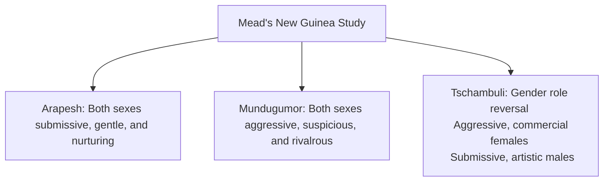

1. **The Arapesh:** Both men and women were gentle, submissive, and cooperative, exhibiting what the West would classify as a "feminine" temperament.
2. **The Mundugumor:** Both men and women were fiercely aggressive, competitive, suspicious, and highly rivalrous, exhibiting a "masculine" temperament.
3. **The Tschambuli:** A matrilineal society showing complete **gender role reversal**. Women were practical, aggressive, emotionally dominant, and handled the subsistence fishing. Men were vain, highly emotional, artistic, submissive, and spent their days gossiping and decorating themselves.
* **Conclusion:** Gender temperaments are highly plastic and entirely constructed by cultural training.

---

### IV. THE INTERDEPENDENCE OF CULTURE & PERSONALITY (BASIC VS. MODAL PERSONALITY)

As the school matured, theorists shifted from treating culture as an absolute mould to exploring the complex, complementary relationship between culture and the individual.

#### 1. Ralph Linton (1893–1953) & Abram Kardiner (1891–1981) — Basic Personality Structure
Linton (ethnographer) and Kardiner (psychoanalyst) formulated the **Basic Personality Structure Theory** in *The Psychological Frontiers of Society (1945)*. They proposed that normal members of a society share a common core of personality traits because they undergo identical childrearing practices.

* **Primary Institutions:** The absolute foundation of personality. These are older, highly stable cultural institutions like childrearing, weaning, feeding, toilet training, and subsistence patterns.
* **Secondary Institutions:** Formed as a projection of the Basic Personality Structure, including religion, rituals, mythology, and folklore.

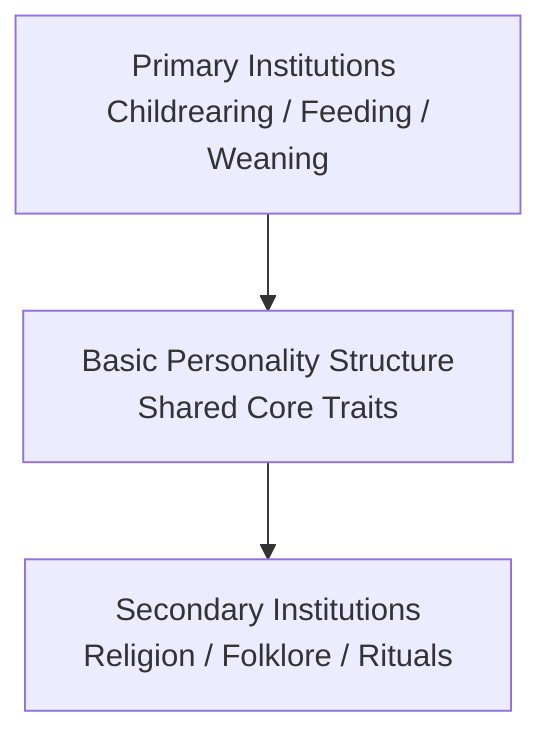

> [!IMPORTANT]
> **Kardiner's Marquesan Case Study (Polynesian Island):**
> * **Primary Constraint:** Severe droughts and starvation led Marquesans to practice **female infanticide**.
> * **Derivative Problem:** Created a highly skewed sex ratio (5 males to 2 females), resulting in **fraternal polyandry**.
> * **Childrearing Impact:** Mothers, overburdened with satisfying multiple husbands and maintaining social status, completely neglected their infants (oral frustration and abandonment).
> * **Basic Personality Structure:** Marquesan men developed a deep, shared subconscious hatred, suspicion, and fear of women.
> * **Secondary Projection:** Marquesan folklore and religion projected this fear, portraying women as wicked, heartless cannibals, witches, and seductresses.

#### 2. Cora Du Bois (1903–1991) — Modal Personality
Du Bois recognized that Kardiner’s "Basic Personality" structure was too rigid, as it assumed everyone in a society shares the exact same core personality. She introduced a statistical concept: **Modal Personality**, which represents the most frequently occurring personality type in a society, while fully accounting for individual psychological variations.

> [!IMPORTANT]
> **Du Bois' Alorese Case Study (East Indies, Indonesia):**
> * **Methodology:** She spent 18 months in Alor (1939), collecting life histories, dreams, and administering projective tests: **Rorschach (ink-blot) tests** and the **Thematic Apperception Test (TAT)**.
> * **Modal Personality Emerged:** Alorese of both sexes were highly suspicious, antagonistic, prone to violent emotional outbursts, slovenly in workmanship, and lacked focus.
> * **Primary Cause (Division of Labor):** Alorese women were the primary agriculturalists. Within two weeks of giving birth, mothers returned to the fields, leaving infants with fathers or young siblings. The infant experienced massive oral frustration, parental neglect, and inconsistent attention.
> * **Psychological Result:** This early childhood trauma statistically generated a highly suspicious and anxious modal personality.

---

### V. CRITICAL EVALUATION & CONTROVERSIES

#### 1. The Crisis of Representation (Fieldwork Controversies)
* **Bronisław Malinowski:** The posthumous publication of his private *Diary* (1967) shattered the myth of the "objective, neutral" ethnographer. It revealed his personal biases and frustrations, forcing modern anthropology to embrace **reflexivity**—acknowledging the researcher's subjectivity in ethnographic encounters.
* **Margaret Mead (The Mead-Freeman Debate):** In 1983, Derek Freeman published a scathing critique of Mead's Samoan study, claiming she was "hoaxed" and ignored the reality of Samoan violence and strict sexual norms. This controversy highlights the risks of short-duration fieldwork and how a researcher's theoretical agenda (Nature vs. Nurture) can skew data interpretation.

#### 2. National Character Studies (Methodological Pitfalls)
* During WWII, anthropologists (Mead, Benedict, Gorer) attempted to define the "modal personality" of entire nations (e.g., Japan, USA, Russia) using **"Culture at a Distance"** (analyzing literature, films, and POW interviews instead of fieldwork).
* **Critique:** These studies are widely discredited today for **essentialism**, stereotyping, and political bias (often serving Allied propaganda). They committed the "ecological fallacy" by attributing group-level observations to every individual.

#### 3. General Limitations
* **Extreme Psychological Reductionism:** Reduces the vast complexity of social systems, economies, and political systems to simple childrearing practices or psychological configurations.
* **Morris Opler's Critique:** Criticized Benedict's configurationist approach as too narrow, arguing that cultures are integrated around multiple themes rather than just two binary geniuses.
* **No Explanation of Origin:** Benedict did not explain *why* a particular culture chose an Apollonian configuration over a Dionysian one.

####  Academic Strengths
* Strongly dismantled Western assumptions of universal human psychology, proving that concepts of puberty, adolescence, and gender are culturally relative.
* Built the first empirical, interdisciplinary bridge between anthropology, psychoanalysis, and cognitive science.
* Introduced objective projective testing (Rorschach, TAT) into ethnographic fieldwork methods.

---

### VI. UPSC PREVIOUS YEAR QUESTIONS (PYQs) & ANSWER BLUEPRINTS

#### PYQ 1: Discuss the political and methodological aspects of national character studies. Elucidate their contemporary relevance. [15 Marks, 2023]
* **Introduction:** Define National Character Studies (NCS) as an offshoot of the Culture & Personality school emerging during WWII to analyze enemy nations "at a distance" (e.g., Benedict's *The Chrysanthemum and the Sword*).
* **Body:**
  * *Methodological Aspects:* Lack of participant observation. Relied on secondary sources (films, literature, POW interviews).
  * *Political Aspects:* Highly influenced by Allied war efforts and propaganda. Prone to essentializing and stereotyping whole nations (e.g., framing Japanese as uniformly obsessive).
  * *Contemporary Relevance:* While scientifically discredited due to the "ecological fallacy," NCS remain relevant as a cautionary tale. Modern anthropology uses these critiques to understand how political rhetoric constructs "national identity" and stereotypes in global geopolitics.
* **Conclusion:** Conclude that contemporary anthropology replaces rigid character studies with nuanced, multi-sited ethnography that respects intersectionality and individual agency over monolithic national traits.

#### PYQ 2: Critically discuss the controversies related to fieldwork of Bronislaw Malinowski and Margaret Mead. [20 Marks, 2023]
* **Introduction:** Both pioneers established foundational fieldwork methods (Participant Observation, Cultural Determinism), yet their posthumous controversies triggered major paradigm shifts in anthropological methodology.
* **Body:**
  * *Malinowski's Diary (1967):* Discuss the exposure of his private racial biases and frustrations. It shattered the "objective observer" myth and introduced **Reflexivity**—the need for researchers to acknowledge their positionality.
  * *Mead-Freeman Debate (1983):* Detail Derek Freeman's critique that Mead was "hoaxed" in Samoa. Highlight the methodological flaws of her short stay and how her theoretical agenda (proving cultural determinism) skewed her findings.
* **Conclusion:** Conclude that these controversies did not destroy the discipline but matured it. They shifted anthropology from a naïve "objective science" to a more rigorous, ethically aware, and reflexive practice that acknowledges the subjectivity of the ethnographer.

---

## TOPIC 5: NEO-EVOLUTIONISM

> [!NOTE]
> **Syllabus Mapping:** 
> * Paper I, Unit 6: Anthropological Theories — Neo-evolutionism (Childe, White, Steward).
> * Connects with: Unit 1.4 (Organic Evolution), Unit 2.1 (Culture change).

---

### I. CORE CONCEPT: THE MID-20TH CENTURY REVIVAL

Neo-Evolutionism emerged in the 1940s and 1950s as a scientific effort to revive evolutionary theory, correcting the empirical flaws of 19th-century Classical Evolutionism while acknowledging the critiques of Franz Boas and the Diffusionists. 

Unlike classical unilinear evolutionists, neo-evolutionists:
* **Avoided Ethnocentrism:** Abandoned subjective terms like "savage" and "barbaric."
* **Avoided Speculation:** Anchored their models in empirical physics, thermodynamics, archaeological records, and ecological science.
* **Acknowledged Multiple Paths:** Recognized that while culture as a whole progresses, individual societies follow diverse adaptation routes.

---

### II. LESLIE WHITE'S UNIVERSAL/ENERGY EVOLUTION
*Approached culture as a thermodynamic system.*

#### A. Core Literature
* **The Science of Culture (1949)**
* **The Evolution of Culture (1959)**

#### B. White's Thermodynamic Law of Cultural Evolution
White asserted that the primary driving force of cultural evolution is **technology and the capture of energy**. He formulated his famous thermodynamic equation:

$$C = E \times T$$

Where:
* **$C$** = The level of cultural evolution/complexity.
* **$E$** = The amount of energy harnessed per capita per year.
* **$T$** = The efficiency of the technological tools used to harness and exploit the energy.

#### C. The Five Stages of Energy Harnessing
White argued that culture progressed through five distinct technological eras of energy capture:
1. **Human Muscle Power:** Early stage utilizing only raw human labor.
2. **Domestication of Animals:** Capturing animal energy for transport and traction.
3. **Agricultural / Plant Energy:** Capturing solar energy through intensive crop cultivation.
4. **Fossil Fuels:** Harnessing coal, oil, and gas (Industrial Revolution).
5. **Nuclear Energy:** Harnessing atomic power (Modern Era).

#### D. The Three Subsystems of Culture
White modeled culture as a three-layered pyramid, asserting that the bottom layer dictates the rest (**Technological Determinism**):

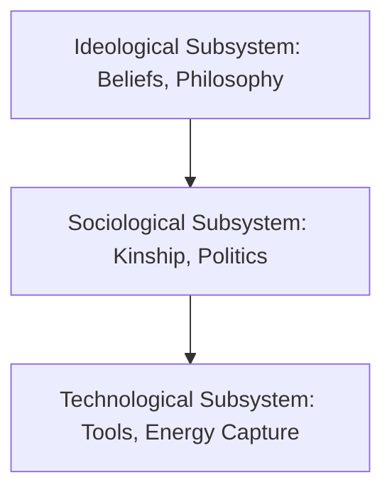

1. **Technological Subsystem (Base):** Tools, weapons, shelter, energy capture mechanisms. *The primary determinant of the entire culture.*
2. **Sociological Subsystem (Middle):** Social structure, kinship systems, economic relations, and political organization. It functions to execute and organize the technology.
3. **Ideological Subsystem (Pinnacle):** Beliefs, myths, values, and philosophies. It is the mental reflection of the underlying technological Base.

---

### III. JULIAN STEWARD'S MULTILINEAR EVOLUTION & CULTURAL ECOLOGY
*Grounded evolution in geoclimatic adaptation and local environment.*

#### A. Core Literature
* **Theory of Culture Change: The Methodology of Multilinear Evolution (1955)**

#### B. Cultural Ecology (Method of Adaptation)
Steward rejected both White's "Universal" evolution (which was too general) and Morgan's "Unilinear" evolution. He developed **Cultural Ecology**—the study of how human cultures adapt to their specific geoclimatic environments through technology and labor. 

His methodology involves three analytical steps:
1. Analyze the relationship between the **local environmental resources** and the **subsistence technology** (tools, hunting strategies).
2. Analyze the **behavioral patterns** required to exploit that technology in that environment (e.g., does hunting require collective effort or isolated individuals?).
3. Analyze how these behavioral patterns affect **other aspects of culture** (such as kinship systems, property rights, or political leadership).

#### C. The Concept of "Cultural Core"
Steward divided culture into two primary segments:
* **The Cultural Core (Base):** The constellation of features which are most closely related to subsistence activities and economic arrangements (technology, environment, and labor organization). The Cultural Core determines the shape of the society.
* **Secondary Features:** Elements like art, religion, mythology, and ritual patterns. These are less constrained by environment and are highly shaped by local history and diffusion.

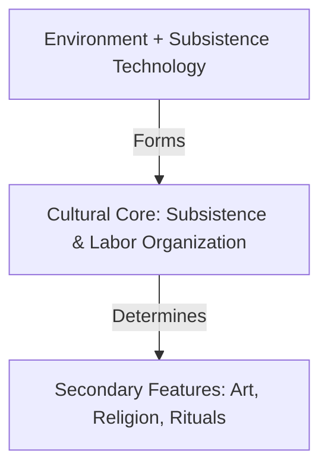

#### D. Multilinear Evolution in Ancient Civilizations
Steward empirically studied the developmental trajectories of **five ancient irrigation-based civilizations**: Mesopotamia, Egypt, China, Mesoamerica, and Peru. 
* **The Finding:** He discovered striking parallels in their evolution—transitioning from small agricultural villages to militaristic empires.
* **The Explanation:** These regularities occurred not because of a "universal unilinear law of progress," but because all five societies emerged in **similar arid/semi-arid environments** that required large-scale irrigation. Cooperative water management created a class of managers (hydraulic bureaucracy), leading to Karl Wittfogel's **Hydraulic State** model.

---

### IV. V. GORDON CHILDE'S UNIVERSAL ARCHAEOLOGICAL EVOLUTION
*Merged Marxist historical materialism with archaeological sequence.*

#### A. Core Literature
* **Man Makes Himself (1936)**
* **What Happened in History (1942)**

#### B. The Grand Archaeological Revolutions
Childe traced universal evolution through massive archaeological and socio-economic shifts:
1. **Paleolithic (Food-Gathering):** Primitive communism, highly mobile, low energy capture.
2. **Neolithic Revolution (Food-Producing):** Domestication of plants and animals, sedentary village life, food surplus creation.
3. **Urban Revolution (Bronze Age):** Emergence of cities, written language, specialized craftsmen, social stratification, state administration, and monumental architecture.

---

### V. SYNTESIS: COMPARISON OF NEO-EVOLUTIONIST SCHEMAS

| Dimension | Leslie White | Julian Steward | V. Gordon Childe |
| :--- | :--- | :--- | :--- |
| **Evolution Paradigm** | **Universal Evolution** (Culture as a whole) | **Multilinear Evolution** (Specific cultures in environments) | **Universal Social Evolution** (Archaeological stages) |
| **Primary Driver** | Thermodynamics ($C=E \times T$) and Technological base | Cultural Ecology (Environment-Technology adaptation) | Archaeological transitions & economic food surplus |
| **Methodology** | Culturological, global thermodynamic abstraction | Empirical, ecological, localized multilinear mapping | Historical Materialism, archaeological excavations |
| **View of Environment**| Secondary (harnessed by technology) | Primary (sets constraints on the Cultural Core) | Primary (ecological resource shifts trigger revolutions) |

---
---

## TOPIC 6: CULTURAL MATERIALISM (MARVIN HARRIS)

> [!NOTE]
> **Syllabus Mapping:** 
> * Paper I, Unit 6: Anthropological Theories — Cultural Materialism.
> * Connects with: Unit 2.1 (Concept of Culture), Unit 5 (Religion).

---

### I. CORE CONCEPT: INFRASTRUCTURAL DETERMINISM

Pioneered by **Marvin Harris (1927–2001)** in his classic text *The Rise of Anthropological Theory (1968)*, **Cultural Materialism** is a scientific research paradigm asserting that the primary task of anthropology is to explain cultural beliefs and practices as **rational, adaptive responses to material constraints** (ecological, technological, and demographic).

Harris formulated the **Principle of Infrastructural Determinism**: 
> *The material Infrastructure of a society (technology, economy, demographics) ultimately determines its structural social relations (kinship, politics), which in turn determine its ideological Superstructure (religion, art, values).*

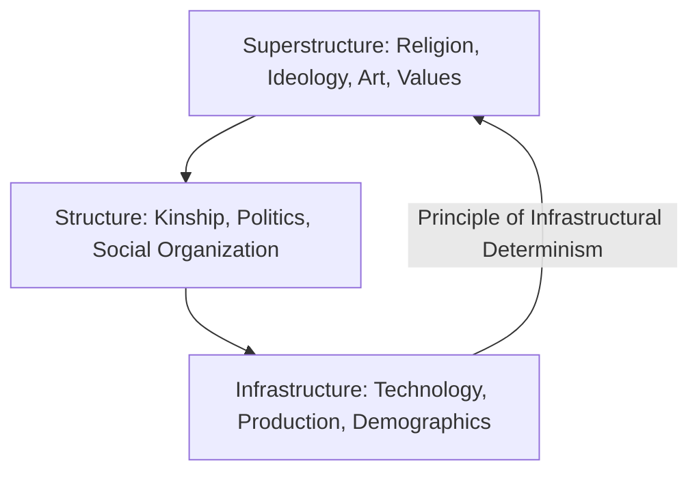

---

### II. THE TRI-PARTITE STRUCTURE OF CULTURE (HARRIS)

1. **Infrastructure (Base):** Modes of production (technology, resource extraction, agriculture) and modes of reproduction (demographics, fertility rates, birth control technologies).
2. **Structure (Middle):** Domestic economy (family organization, division of labor, socialization) and political economy (government, class structure, military, policing).
3. **Superstructure (Pinnacle):** Cognitive, symbolic, and ideological systems (religion, rituals, aesthetic values, sports, myths).

---

### III. THE EMIC VS. ETIC PARADIGM

Harris insisted on a clear separation between how the natives view themselves and how scientists study them:

* **Emic Perspective (Insider's View):** The subjective descriptions, thoughts, and explanations provided by the members of the society themselves (e.g., a Hindu explaining that cows are sacred due to spiritual purity).
* **Etic Perspective (Observer's View):** The objective, scientific analysis of a culture using cross-cultural categories (e.g., a cultural materialist explaining that cows are sacred because they are economically indispensable for traction power, milk, and dung fertilizer in agrarian India).

Harris prioritized **Etic-Behavioral** explanations over Emic-Mental ones to eliminate ethnocentric and subjective biases in research.

---

### IV. MARVIN HARRIS' ARCHETYPAL CASE STUDIES

#### 1. The Sacred Cow in India (*India's Sacred Cow, 1966*)
* *The Emic explanation:* Hindus do not eat beef because the cow represents the mother goddess and is spiritually sacred.
* *The Etic Materialist explanation:* Harris proved that cow slaughter taboos are a highly rational, adaptive response to the ecological and agricultural constraints of traditional Indian farming:
  * **Traction Power:** Oxen/bulls are mandatory for plowing fields. Eating the cow during a drought would destroy the farmer’s future ability to plant crops.
  * **Fuel & Fertilizer:** Cow dung is the primary source of cooking fuel (dung cakes) and organic fertilizer for poor farmers.
  * **Cost-Free Maintenance:** Cows feed on agricultural waste (chaff, roadside weeds) that humans cannot digest, converting waste into milk and labor.
  * *Conclusion:* The religious taboo (Superstructure) emerged to protect an indispensable agricultural asset (Infrastructure) during times of famine.

#### 2. The Collapse of the Soviet Union
* *The Ideological explanation:* The USSR collapsed due to political corruption, democratic demands, or moral decay.
* *The Etic Materialist explanation:* Harris argued that the collapse was a clear case of "selection against a political economy (Structure) that increasingly degraded and impeded the performance of its industrial and energy Infrastructure" (outdated power plants, inefficient state-owned factories, lack of resource efficiency).

---
---

## TOPIC 7: SYMBOLIC & INTERPRETIVE ANTHROPOLOGY

> [!NOTE]
> **Syllabus Mapping:** 
> * Paper I, Unit 6: Anthropological Theories — Symbolic and Interpretive Anthropology (Geertz, Turner).
> * Connects with: Unit 2.1 (Concept of Culture), Unit 5 (Religion).

---

### I. CORE CONCEPT: CULTURE AS A TEXT

Symbolic and Interpretive Anthropology arose in the late 1960s and 1970s as a major **literary, humanistic counter-revolution** against the materialist and positivist paradigms (like Cultural Materialism or Neo-Evolutionism). 

Instead of searching for universal scientific laws of energy capture or material adaptation, symbolic anthropologists argued that **culture is a system of shared symbols and meanings**. The task of the anthropologist is not to *explain* human behavior scientifically, but to **interpret** it, treating culture as a "literary text" to be read and deciphered.

---

### II. CLIFFORD GEERTZ'S INTERPRETIVE ANTHROPOLOGY
*Pioneered the literary-humanistic approach.*

#### A. Core Literature
* **The Interpretation of Cultures (1973)**
* **Local Knowledge (1983)**

#### B. Geertz's Definition of Culture
Geertz drew heavily on Max Weber, defining culture as a web of significance:
> *"Believing, with Max Weber, that man is an animal suspended in webs of significance he himself has spun, I take culture to be those webs, and the analysis of it to be therefore not an experimental science in search of law but an interpretive one in search of meaning."*

#### C. The Method of "Thick Description"
* **Thin Description (Behavioral):** Describing the bare physical action (e.g., "The boy's right eyelid rapidly contracted and dilated").
* **Thick Description (Interpretive):** Deciphering the social meaning, intent, and cultural codes behind the action (e.g., distinguishing a physical twitch from a conspiratorial wink, a rehearsal wink, or a parodic wink). 
* *Goal:* The anthropologist’s task is to provide a "thick description" of social interactions, deciphering the complex layers of meaning that the actors themselves assign to their behavior.

#### D. The Balinese Cockfight as a Cultural Text (*Deep Play: Notes on the Balinese Cockfight, 1972*)
Geertz lived in Bali and analyzed their highly popular, illegal cockfights.
* *Rejection of Materialism:* A cockfight makes no sense from a materialist perspective—men lose vast amounts of money, and the cocks are slaughtered.
* *The Interpretive Meaning:* Geertz analyzed the cockfight as a **cultural text** through which Balinese society expresses and negotiates status, honor, prestige, and masculinity.
* *Deep Play (Bentham's Concept):* A game where the stakes are so high that it is irrational to play. In Bali, the financial stakes are high, but the **status stakes** (prestige, lineage rivalries) are even higher. The cock represents the owner’s metaphorical self. The fight is an aesthetic rendering of Balinese social structure.

> [!TIP]
> **Value Addition: Interpretive Turn & Deep Play (UPSC Mains)**
> Geertz’s thick description triggered the "Interpretive Turn" in anthropology, fundamentally rejecting the structural-functionalist quest for universal laws. By treating the cockfight as "Deep Play," Geertz showed that rituals are not just functional glue for society, but "texts" that people read to understand their own culture. However, Marxist critics argue this approach "essentializes" culture, ignoring power asymmetries and historical political economy.

---

### III. VICTOR TURNER'S RITUAL AND SYMBOLIC ACTION
*Approached symbols as dynamic "forces in action" during rituals.*

#### A. Core Literature
* **The Forest of Symbols: Aspects of Ndembu Ritual (1967)**
* **The Ritual Process: Structure and Anti-Structure (1969)**

#### B. The Liminality & Communitas Framework
Turner analyzed rites of passage (e.g., tribal initiation rituals among the Ndembu of Zambia) and formulated his famous three-phase model:

```mermaid
graph LR
    A[1. Separation Phase] -->|Leaves old status| B[2. Liminal Phase: Anti-Structure / Communitas]
    B -->|Transition State| C[3. Reintegration Phase]
    C -->|Returns with new status| D[New Social Structure]
```

1. **Separation:** The initiates are physically and socially separated from their normal status in the village.
2. **Liminality (The In-Between State):** The initiates exist in a state of **Anti-Structure**—they have no status, no property, no names, and are stripped of social hierarchies. In this threshold state, they experience **Communitas**—an intense, unstructured feeling of absolute social equality, sacred togetherness, and deep human bonding.
3. **Reintegration:** The initiates are welcomed back into the village, fully integrated with their **new social status** (e.g., transitioning from boys to adult warriors).

#### C. The Three Properties of Ritual Symbols
Turner identified three dynamic characteristics of symbols in ritual settings:
* **Condensation:** A single symbol represents many different ideas, relationships, and entities simultaneously (e.g., the Ndembu "Mudyi" milk tree represents mother's milk, matriliny, instruction, and female solidarity).
* **Unification of Disparate Signifieds:** Uniting completely different, seemingly contradictory meanings under one physical representation.
* **Polarization of Meaning:** Every symbol has two poles:
  * *Sensory/Orectic Pole:* Arouses physical desires, biological emotions, and feelings (e.g., blood, milk, fire).
  * *Ideological Pole:* Represents social norms, moral values, rules, and structural duties of the society.

> [!TIP]
> **Value Addition: Turner vs. Geertz (UPSC Mains)**
> While both are pillars of Symbolic/Interpretive anthropology, they differ fundamentally:
> * **Turner (British School / Durkheimian):** Viewed symbols functionally as **"operators in the social process."** He was interested in what symbols *do* (resolve conflict, maintain cohesion, transition status).
> * **Geertz (American School / Weberian):** Viewed symbols semiotically as **"vehicles of meaning."** He was interested in what symbols *say* (how they illuminate the cultural "web of significance").

---

### IV. CRITICAL EVALUATION OF SYMBOLIC/INTERPRETIVE ANTHROPOLOGY

1. **Lack of Scientific Objectivity:**
   * *Critique:* By treating anthropology as a literary interpretation rather than a science, Geertz’s method is highly subjective. Another anthropologist studying Balinese cockfights could read a completely different "text." There is no objective way to test or replicate Geertzian winks.
2. **Ignoring Material and Economic Realities:**
   * *Critique:* Cultural Materialists argue that by focusing entirely on symbols, Geertz and Turner ignore the brutal material realities of poverty, disease, hunger, and economic exploitation in post-colonial societies.
3. **The Armchair Literary Shift:**
   * *Critique:* It shifts anthropology away from active socio-economic reform towards academic literary criticism, reducing active human struggles to mere "metaphors" or "texts."

---

### V. UPSC PREVIOUS YEAR QUESTIONS (PYQs) & ANSWER BLUEPRINTS

---

#### PYQ 1: How do the concepts of 'universal evolution' and 'multilinear evolution' differ in their explanation of culture change? [15 Marks]

* **Introduction (Approx. 40 words):** Formulated during the mid-20th century Neo-Evolutionary revival, Universal Evolution (Leslie White, V. Gordon Childe) and Multilinear Evolution (Julian Steward) represent the two primary, competing methodologies explaining the paths of socio-technological culture change.
* **Body Skeleton:**
  * *Difference in Level of Abstraction:* Universal evolution focuses on **Culture as a whole** (global humanity), ignoring local variations. Multilinear evolution focuses on **specific, individual cultures** in their local geographic environments.
  * *Difference in Primary Mechanics:* Universal evolution explains change through thermodynamic energy capture ($C=E \times T$ - White) or grand technological revolutions (Neolithic/Urban revolutions - Childe). Multilinear evolution explains change through **Cultural Ecology**—how a society adapts its technology to local environmental constraints.
  * *Difference in Evolutionary Paths:* Universal evolution is unbranched and sequential—all humanity progresses along a singular macro-technological trajectory. Multilinear evolution is multi-branched and divergent—cultures follow **multiple distinct adaptation pathways** depending on their ecology.
  * *Difference in Concept of Culture:* White treats culture as an extra-somatic thermodynamic system driven by technology. Steward divides culture into the **Cultural Core** (environment-technology adaptation) and **Secondary Features** (shaped by history/diffusion).
  * *Use a Comparative Table:* Draw a 4-point comparison table summarizing these differences (refer to Section V).
* **Conclusion (Approx. 40 words):** While Universal Evolution successfully identified the macro-technological thermodynamic progress of global humanity, Multilinear Evolution provided an empirical, ecology-grounded scientific methodology that explained local cultural diversities, deeply enriching ecological anthropology.

---

#### PYQ 2: Explain the research paradigm of Cultural Materialism as formulated by Marvin Harris. [20 Marks]

* **Introduction (Approx. 40 words):** Formulated by Marvin Harris in *The Rise of Anthropological Theory (1968)*, Cultural Materialism is a scientific research paradigm. It asserts that human socio-cultural beliefs and practices are rational, adaptive responses to the material, ecological, and technological constraints of their environment.
* **Body Skeleton:**
  * *The Principle of Infrastructural Determinism:* Explain how the material **Infrastructure** (technology, agriculture, demographics) deterministically shapes the social **Structure** (domestic/political economy), which in turn determines the ideological **Superstructure** (religion, values, art).
  * *The Emic vs. Etic Paradigm:* Detail the distinction. Harris prioritized **Etic-behavioral** observations (scientific, outsider’s view of material actions) over **Emic-mental** perspectives (insider's native rationalizations) to avoid subjective bias.
  * *Illustrate through "Sacred Cow in India":* Elucidate Harris' famous case study. While the *emic* view sees the cow as spiritually sacred, the *etic* materialist analysis proves the cow taboo is an adaptive agricultural asset protecting traction power (oxen), cooking fuel, and organic fertilizer.
  * *Scientific Merits:* Emphasize its high predictability, empirical focus, and rejection of teleology or mysticism in cultural analysis.
  * *Key Criticisms:* Highlight critiques by symbolic anthropologists (Geertz) for ignoring native meaning, and Marxist critiques for oversimplifying class struggles.
* **Conclusion (Approx. 40 words):** Cultural Materialism remains one of the most powerful, ecologically grounded paradigms in anthropology, successfully providing rational, materialist explanations for seemingly bizarre or irrational human cultural customs across the globe.

---

#### PYQ 3: Explain the concepts of Liminality and Communitas as formulated by Victor Turner. [10 Marks]

* **Introduction (Approx. 40 words):** In his landmark book *The Ritual Process: Structure and Anti-Structure (1969)*, British symbolic anthropologist Victor Turner expanded Arnold van Gennep’s study of rites of passage, formulating the concepts of **Liminality** and **Communitas** to analyze the transitional phase of human rituals.
* **Body Skeleton:**
  * *Outline the Ritual Phase Context:* Explain the three phases of rites of passage: Separation $\rightarrow$ Liminality $\rightarrow$ Reintegration.
  * *Define Liminality:* Define it as the "threshold" or "in-between" transitional state. Initiates are "neither here nor there; they are betwixt and between all fixed social points." They possess no status, no property, no rank, and no social identity.
  * *Define Communitas:* In this liminal state of **Anti-Structure**, because all normal social hierarchies and ranks are suspended, the initiates experience **Communitas**—an intense, unstructured feeling of absolute social equality, deep mutual bonding, and sacred togetherness.
  * *Structural Utility:* Communitas acts as a vital psychological and social "reset button" that balances the rigid, daily social hierarchies (Structure) of the village, ensuring ultimate group solidarity and emotional integration.
* **Conclusion (Approx. 40 words):** Turner's concepts of Liminality and Communitas successfully demonstrated that rituals are not merely static structural maintenance mechanisms, but dynamic, emotionally charged, and transformative social processes that sustain human community life.

---

#### PYQ 4: What made Geertz's Interpretative Anthropology distinct from Turner's Symbolic Anthropology? What does each of them mean by the terms Symbol & Symbolic? [20 Marks, 2015]

* **Introduction:** Both Geertz and Turner led the late-20th-century humanistic counter-revolution against materialist and structural-functional paradigms. However, Geertz represented the American Interpretive school (influenced by Weber), while Turner represented the British Symbolic school (influenced by Durkheim).
* **Body:**
  * *Meaning of Symbol (Geertz):* Symbols are "vehicles of meaning" or "texts." They are semiotic tools that people use to interpret their worldview (e.g., the Balinese cockfight as a text about status).
  * *Meaning of Symbol (Turner):* Symbols are "operators in the social process." They are active tools that do social work, like resolving crises or transitioning individuals through liminal phases (e.g., the Ndembu milk tree).
  * *Methodological Distinction:* Geertz used **Thick Description** to decode the "webs of significance." Turner used **Social Drama** and ritual analysis to observe symbols in motion (Separation $\rightarrow$ Liminality $\rightarrow$ Reintegration).
  * *Goal Distinction:* Geertz sought to interpret meaning; Turner sought to understand social cohesion and transformation.
* **Conclusion:** Conclude that while Turner focused on the *functional mechanics* of symbols within rituals, Geertz focused on their *interpretive depth*. Together, they successfully shifted anthropology toward understanding the lived, emotional, and meaningful realities of human subjects.
---

## TOPIC 8: COGNITIVE ANTHROPOLOGY (ETHNOSCIENCE / NEW ETHNOGRAPHY)

> [!NOTE]
> **Syllabus Mapping:** 
> * Paper I, Unit 6: Anthropological Theories — Cognitive Anthropology.
> * Connects with: Unit 2.1 (Concept of Culture), Unit 7 (Research Methods).

---

### I. CORE CONCEPT: THE MENTAL MAP OF CULTURE

Cognitive Anthropology (also known as **Ethnoscience**, the **New Ethnography**, or **Folk Taxonomies**) emerged in the mid-1950s in the United States as a scientific critique of traditional ethnography. 

* **The Critique:** Traditional ethnographies lacked standardized methodologies—one anthropologist described kinship, another described technology, making scientific comparisons impossible.
* **The Definition of Culture:** Cognitive anthropologists argued that culture is not a physical inventory of artifacts or behaviors. Rather, **culture is a cognitive system of mental models, rules, classifications, and categories** embedded in the human mind.
* **Stephen Tyler's Definition:** In his foundational book *Cognitive Anthropology (1969)*, Tyler asserted:
  > *"Culture consists of that which a person must know, believe, and feel in order to operate in a manner acceptable to its members."*

```mermaid
graph TD
    A[Physical Reality: Plants, Colors, Relatives] -->|Filtered through| B[Cognitive Schema / Mental Taxonomy]
    B -->|Produces| C[Social Actions & Culturally Appropriate Behavior]
```

---

### II. THE EMIC METHODOLOGY

Cognitive anthropology heavily prioritizes the **Emic perspective** over the Etic perspective:
* **Goal:** To discover how the natives themselves partition, categorize, and organize their physical and social universe, using methods borrowed from **structural linguistics**.
* **Key Methodology:**
  1. **Componential Analysis:** Breaking down a domain of words (like kinship terms or plant names) into their distinct semantic features (e.g., analyzing "uncle" by features: *male, one generation above ego, collateral relative*).
  2. **Folk Taxonomies:** Mapping the hierarchical classification trees that natives use to organize their knowledge of the natural world.

---

### III. PIONEERING ETHNOSCIENTIFIC RESEARCH (HAROLD CONKLIN)

**Harold Conklin (1926–2016)** conducted legendary ethnoscientific fieldwork among the **Hanunoo** tribe of the Philippines, producing two landmark studies that revolutionized the field:

#### 1. Hanunoo Ethnobotany Study (1954)
* **The Study:** Conklin meticulously recorded the Hanunoo’s botanical knowledge.
* **The Finding:** He discovered that the Hanunoo distinguished **1,625 distinct plant types** in their local forest—a classification that was far more detailed and precise than the Western botanical classification at the time. Furthermore, 93% of these plants had direct cultural significance (medical, agricultural, or ritual).
* **Significance:** Debunked the Eurocentric myth that primitive tribes possess a crude, simplistic understanding of nature. It proved that indigenous minds possess highly sophisticated cognitive taxonomic structures.

#### 2. Hanunoo Color Categories Study (1955)
* **The Study:** Conklin analyzed how the Hanunoo perceive and classify colors.
* **The Finding:** He discovered that Hanunoo color classification does not operate on Western physics parameters of hue/wavelength. Instead, they divide colors into **four primary categories** based on light, moisture, and texture:
  1. **Labi:** Lightness, brightness, and high reflection.
  2. **Lalu:** Darkness, depth, and shadow.
  3. **Latuy:** Wetness, freshness, succulence (associated with green, living plants).
  4. **Lara:** Dryness, redness, aridity (associated with dry, dead vegetation or cooked food).
* **Significance:** Proved that sensory perception is cognitively and culturally structured. A Hanunoo seeing a green leaf sees "wetness/freshness" (*latuy*), while seeing a dry leaf sees "dryness/redness" (*lara*).

---
---

## TOPIC 9: POST-MODERNISM IN ANTHROPOLOGY

> [!NOTE]
> **Syllabus Mapping:** 
> * Paper I, Unit 6: Anthropological Theories — Post-modernism.
> * Connects with: Unit 7 (Research Methods, Fieldwork).

---

### I. CORE CONCEPT: DECONSTRUCTING OBJECTIVITY

Post-Modernism entered anthropology in the 1980s as a radical critique of the discipline's claim to be an objective, positivist "science" of human behavior. 

Post-modernists argue that:
* **Objectivity is an Illusion:** An anthropologist cannot stand outside of history, power, and their own culture to observe another society objectively.
* **Ethnography is a Text (Partial Truth):** An ethnography is not a mirror of reality. It is a highly constructed literary text shaped by the author's writing style, personal biases, and political position.
* **Power & Knowledge (Foucault's influence):** Traditional anthropology was a tool of Western colonial dominance—Western white male academics went to colonized lands, observed "the other," and wrote authoritative texts that represented them as passive, exotic, and primitive.

---

### II. KEY THINKERS & LITERATURE

* **James Clifford & George Marcus:** Edited the foundational text **Writing Culture: The Poetics and Politics of Ethnography (1986)**, which analyzed ethnographies as literary and political constructions.
* **George Marcus & Michael Fischer:** Wrote *Anthropology as Cultural Critique: An Experimental Moment in the Human Sciences (1986)*.
* **Paul Rabinow:** Wrote *Reflections on Fieldwork in Morocco (1977)*, establishing the reflexive method.

---

### III. THE POST-MODERN ETHNOGRAPHIC REFORM

To correct the structural biases of traditional ethnography, post-modernists introduced experimental styles of writing:

```mermaid
graph TD
    A[Traditional Monophonic Ethnography] -->|Critiqued for| B[Observer's absolute authorial voice - native as passive object]
    C[Post-Modern Reform Styles] --> D[1. Reflexive Ethnography]
    C --> E[2. Dialogue / Polyphonic Ethnography]
    D -->|Reflects on| D1[Anthropologist's own biases, emotions, & physical presence]
    E -->|Presents| E1[Native's direct voice & collaborative dialogue without editing]
```

1. **Reflexive Ethnography:** The anthropologist explicitly includes themselves in the text, reflecting on their own social background, emotions, physical presence, and the power dynamic between themselves and their informants (e.g., *Reflections on Fieldwork in Morocco*).
2. **Dialogue / Polyphonic (Multi-voiced) Ethnography:** Replaces the singular, authoritative voice of the anthropologist with a direct dialogue. The book is presented as a collaborative conversation, allowing the native's direct voice to be heard without being "translated" or interpreted by the academic author.

### III. JACQUES DERRIDA & DECONSTRUCTION
In the context of UPSC Anthropology, **Jacques Derrida** and his concept of **deconstruction** are central theoretical pillars of Postmodernism.

*   **The Concept of Deconstruction:** Deconstruction is a philosophical approach that challenges the stability of meaning in language and ethnographic texts. It is not a method of destroying a text; rather, it is a careful reading that exposes internal contradictions, hidden assumptions, and instabilities.
*   **Challenging Logocentrism:** Derrida criticized "logocentrism"—the Western tendency to privilege speech over writing and to seek a "fixed center" or absolute truth.
*   **Dismantling Binary Oppositions:** Traditional Western thought relies on binary oppositions (*nature/culture, civilized/primitive, male/female*). Derrida argued these hierarchies are artificial. He demonstrated that the "privileged" term (e.g., civilized) is entirely dependent on the "subordinate" term (e.g., primitive) for its meaning.
*   **Différance:** A term coined by Derrida describing how meaning is always "deferred" and never fully present. A word’s meaning is derived only through its difference from other words, making cultural meaning fluid and context-dependent.
*   **Anthropological Application:** Postmodern anthropologists use deconstruction to question the "authoritative" voice of the ethnographer. By "reading against the grain," they dismantle universal meta-narratives (like evolutionism) and expose how traditional ethnographic texts historically reinforced colonial power dynamics.

#### Value Addition: Decolonial Anthropology & Epistemic Justice (UPSC Mains)
While Postmodernism critiques the *text*, **Decolonial Anthropology** critiques the underlying colonial power structures. 
* **Epistemic Violence:** Highlights how classical anthropology often erased indigenous ways of knowing, forcefully substituting them with dominant Western scientific frameworks.
* **Multi-sited Ethnography:** Rather than studying a single isolated "tribe" (which often exoticizes them), modern anthropologists like George Marcus advocate following people, objects, and ideas across global networks, reflecting the true interconnected reality of marginalized groups.

---

### IV. CRITICAL EVALUATION of POST-MODERN ANTHROPOLOGY

1. **Paralysis of Action (Extreme Relativism):**
   * *Critique:* By asserting that all truth is subjective and all ethnographies are mere "fiction," post-modernism paralyzes the discipline. If there is no objective truth, anthropology cannot be used to fight for human rights, design development policies, or combat diseases.
2. **Self-Indulgence ("Navel-Gazing"):**
   * *Critique:* Critics argue that reflexive ethnography often degenerates into narcissistic diaries where the anthropologist writes more about *themselves*, their feelings, and their struggles than about the actual society they went to study.
3. **Linguistic Excess:**
   * *Critique:* Focuses excessively on text, literary styles, and words, ignoring the material realities of poverty, hunger, and physical violence.

---

### V. UPSC PREVIOUS YEAR QUESTIONS (PYQs) & ANSWER BLUEPRINTS

---

#### PYQ 1: What is Cognitive Anthropology (Ethnoscience)? Discuss its core methods and contributions. [15 Marks]

* **Introduction (Approx. 40 words):** Cognitive Anthropology, also known as Ethnoscience or the New Ethnography, emerged in the mid-1950s. It rejects materialist definitions, defining culture as a mental system of cognitive classifications, folk taxonomies, and rules embedded in the human mind.
* **Body Skeleton:**
  * *The Concept of Culture:* Explain that culture is a mental map. Refer to Stephen Tyler’s definition: culture is what one must know to operate acceptably in a society.
  * *Methodology (Emic Focus):* Explain the focus on structural linguistics. Detail **Componential Analysis** (deconstructing domains into semantic features) and **Folk Taxonomies** (hierarchical trees of native classifications).
  * *Pioneering Case Study (Harold Conklin):*
    * **Hanunoo Ethnobotany (1954):** Meticulously recorded 1,625 plant classifications, proving the high cognitive sophistication of the tribe.
    * **Hanunoo Color Categories (1955):** Showed color was categorized based on moisture/texture (Labi, Lalu, Latuy, Lara) rather than Western physics wavelengths.
  * *Major Contributions:* Established cognitive relativism, scientifically elevated indigenous knowledge systems, and standardized ethnographic data collection.
  * *Key Criticisms:* Criticized for being overly narrow, ignoring physical behaviors, and focusing excessively on word classification.
* **Conclusion (Approx. 40 words):** By treating culture as a system of cognitive classifications, Cognitive Anthropology successfully demonstrated the profound intellectual depth of indigenous minds, establishing a bridge between linguistics, cognitive science, and ethnology.

---

#### PYQ 2: Write a short note on Post-modernism in anthropology. [10 Marks]

* **Introduction (Approx. 40 words):** Post-modernism emerged in anthropology in the 1980s through the landmark text *Writing Culture (1986)* edited by James Clifford and George Marcus. It critically deconstructs the claims of positivist objectivity, viewing ethnography as a literary, political, and partial representation of culture.
* **Body Skeleton:**
  * *Interrogation of Power & Knowledge:* Influenced by Michel Foucault. Post-modernists argue traditional anthropology was monophonic, serving as a colonial tool where the Western academic held absolute authorial control over the native "other."
  * *Deconstruction of Objectivity:* Rejects the idea of a "value-free science." Anthropologists are historically and culturally situated; hence, their descriptions are constructed narratives rather than absolute truths.
  * *Experimental Methodologies:* Detail the shift to **Reflexive Ethnography** (reflecting on author biases and presence - e.g., Rabinow) and **Polyphonic/Dialogue Ethnography** (presenting multi-voiced direct dialogues of the natives).
  * *Key Critiques:* Labeled as self-indulgent ("navel-gazing") and criticized by materialists for reducing actual human material struggles to mere literary text and metaphors.
* **Conclusion (Approx. 40 words):** Despite critiques of extreme relativism, Post-modernism brought critical reflexivity to the discipline, forcing modern anthropologists to write with greater ethical sensitivity, transparency, and collaborative dialogue with their research participants.

---

#### PYQ 3: Critically explain the notion of 'deconstruction' in the light of the postmodern works of Jacques Derrida. [20 Marks, 2024]
* **Introduction:** Define deconstruction as Jacques Derrida's pivotal analytical approach that challenges the stability of meaning in texts, serving as the philosophical bedrock for Postmodern anthropology.
* **Body:**
  * *The Mechanism of Deconstruction:* Explain that it is not destruction, but a critical reading exposing internal contradictions and hidden power assumptions within ethnographic texts.
  * *Dismantling Binary Oppositions:* Explain Derrida's critique of Western binaries (civilized/primitive, objective/subjective). Show how the "privileged" term relies entirely on the subordination of the "other."
  * *Concept of Différance:* Meaning is fluid, context-dependent, and never fully "present."
  * *Anthropological Impact:* Detail how it triggered the "Crisis of Representation" (Clifford and Marcus), shifting ethnography away from absolute authorial truth toward polyphony, reflexivity, and the acknowledgment of subjective positioning.
  * *Critical View:* Acknowledge that while it provides powerful tools against colonial narratives, extreme deconstruction can lead to a paralysis of action, nihilism, and the undermining of anthropology as an empirical science.
* **Conclusion:** Conclude that Derrida’s deconstruction forced anthropology out of its positivist complacency, demanding that ethnographers scrutinize not just the cultures they observe, but the very language and power structures they use to describe them.


