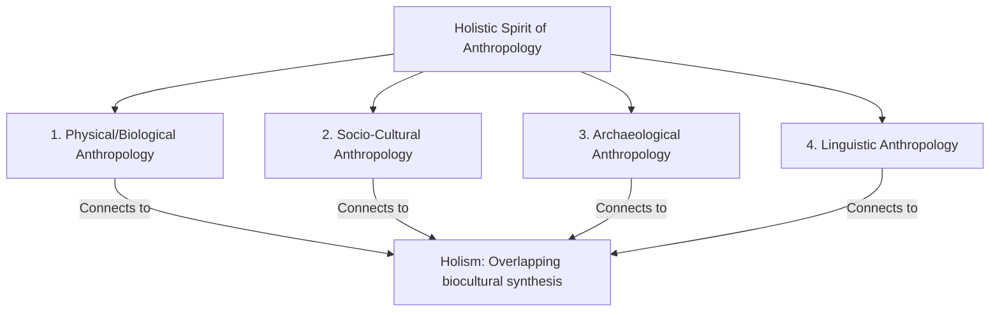
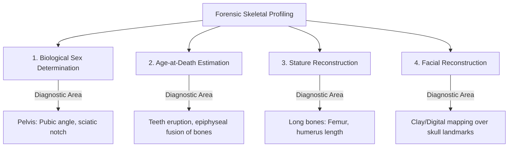

# PAPER I — UNITS 1.1-1.3, 8 & 12: RESEARCH METHODS & APPLIED ANTHROPOLOGY

---

## TOPIC 1: SCOPE, RELEVANCE & BRANCHES (UNITS 1.1–1.3)

> [!NOTE]
> **Syllabus Mapping:**
> * Paper I, Unit 1.1: Meaning, Scope, and development of Anthropology.
> * Paper I, Unit 1.2: Relationships with other disciplines.
> * Paper I, Unit 1.3: Main branches of Anthropology, their scope and relevance.

---

### I. THE HOLISTIC SPIRIT OF ANTHROPOLOGY

Anthropology is defined as the **holistic, comparative, and bio-cultural study of humanity** across all space and time. It is unique among the social and natural sciences because of its **Holism**—integrating biological, linguistic, cultural, and historical aspects to avoid a fragmented understanding of the human condition.

#### 1. The Four Core Branches

> [!TIP]
> **Mnemonic for the 4 Branches:** **P S A L** (People Study Ancient Languages)
> * **P**hysical, **S**ocio-Cultural, **A**rchaeological, **L**inguistic.

* **Physical/Biological Anthropology:** The study of human biological diversity, evolution, genetics, growth, and adaptation to environmental stressors.
* **Socio-Cultural Anthropology:** The study of human society and culture, examining social institutions, customs, family, kinship, politics, and economics.
* **Archaeological Anthropology:** Reconstructing past human cultures and behaviors by analyzing material remains (artifacts, ecofacts, and structures).
* **Linguistic Anthropology:** Studying the structure, origin, and social context of language, and how language shapes cultural worldviews (e.g., Sapir-Whorf hypothesis).

---

### II. RELATIONSHIP: SOCIOLOGY VS. ANTHROPOLOGY

While both disciplines study human society, they differ fundamentally in historical origin and methodology:

| Comparative Dimension | Social Anthropology | Sociology |
| :--- | :--- | :--- |
| **1. Historical Subject** | Historically studied non-literate, small-scale, pre-industrial, "primitive" tribal societies. | Historically studied complex, modern, urbanized, and industrialized Western societies. |
| **2. Primary Method** | Intensive **Participant Observation** (fieldwork) for 1–2 years; qualitative depth. | Surveys, statistical analysis, questionnaires, and demographic indicators; quantitative breadth. |
| **3. Perspective** | Holistic and culturally relativistic (emic focus). | Specialistic and problem-oriented (focused on urban decay, crime, or stratification). |
| **4. Scale of Study** | Intensive **micro-level** studies of small communities. | Large **macro-level** surveys of massive social groups or classes. |

---

### III. UPSC PREVIOUS YEAR QUESTIONS (PYQs) & ANSWER BLUEPRINTS

---

#### PYQ 1: Elaborate the scope of anthropology and elucidate its uniqueness in the field of other social sciences. [2021, 20 Marks]

* **Introduction (Approx. 40 words):** Formulated by Clyde Kluckhohn as the *"mirror for man,"* Anthropology is the holistic, comparative, and bio-cultural study of human existence. Its scope spans across deep geological time (evolution) and global geographical space, establishing a unique identity among social sciences.
* **Body Skeleton:**
  * *The Vast Scope:* Detail the four-field architecture (Physical, Socio-Cultural, Archaeological, Linguistic) that allows anthropology to address both human biology and culture simultaneously.
  * *Uniqueness 1: Holism:* Unlike economics or political science, which isolate specific domains, anthropology integrates all facets of human life, recognizing that biological changes (bipedalism) directly catalyze cultural developments (tool-use).
  * *Uniqueness 2: Fieldwork Methodology:* Relies on long-term **Participant Observation** (living with the community), pioneered by Malinowski. This emphasizes deep, qualitative qualitative data over distant macro-surveys.
  * *Uniqueness 3: Cultural Relativism:* Rejects ethnocentrism. Every custom is evaluated within its own historical context, ensuring an unbiased, objective understanding of human diversity.
  * *Uniqueness 4: The Emic Focus:* Seeks to capture the native's own cognitive perspective rather than imposing external Western academic models.
* **Conclusion (Approx. 40 words):** In summary, while other social sciences analyze specific fragments of modern industrialized societies, anthropology’s unique holism and cultural relativism provide a global, comparative database of humanity, making it indispensable in our multicultural, globalized world.

---
---

## TOPIC 2: RESEARCH METHODS IN ANTHROPOLOGY (UNIT 8)

> [!NOTE]
> **Syllabus Mapping:**
> * Paper I, Unit 8: Research methods in Anthropology: Distinction between technique, method and methodology; Evolution of fieldwork tradition; Tools of data collection (observation, interview, schedules, questionnaires, case study, genealogical method, life history, PRA/PLA); Qualitative and Quantitative analysis; QDA software.

---

### I. DISTINCTIONS IN RESEARCH METHODOLOGY

> [!NOTE]
> **Beginner's Analogy:** Think of building a house. 
> * **Technique:** The hammer, the nails, the saw (the physical tools used to build).
> * **Method:** The architectural blueprint (the specific plan to build this particular house).
> * **Methodology:** The entire field of Civil Engineering and physics (the overarching principles governing why the house stands up).

* **Technique:** The specific, physical tools, instruments, and behaviors used by the researcher to gather data (e.g., a questionnaire sheet, an audio recorder, a calipers instrument).
* **Method:** The systematic, logical process or mode of inquiry followed to conduct research (e.g., Case Study method, Historical Particularist method, Genealogical method).
* **Methodology:** The overarching theoretical, philosophical, and epistemological framework that guides the entire research design and determines the rules of evidence (e.g., Positivism, Interpretivism, Marxist Historical Materialism).

---

### II. EVOLUTION OF THE FIELDWORK TRADITION

> [!TIP]
> **Mnemonic for Fieldwork Evolution:** **A V P R** (Anthropologists Visit Places Regularly)
> * **A**rmchair, **V**eranda, **P**articipant Observation, **R**eflexive.

* **1. Armchair Anthropology (Late 19th Century):** E.B. Tylor and J.G. Frazer never conducted fieldwork. They sat in their European studies, reading biased, secondary reports sent by colonial officers, merchants, and missionaries, leading to speculative unilinear theories.
* **2. Veranda Anthropology (Transition Phase):** Scholars like **W.H.R. Rivers** during the Torres Straits Expedition (1898) traveled to colonies but remained on their hotel verandas, calling natives to be interviewed in an artificial setting.
* **3. Participant Observation Revolution (1920s):** Pioneered by **Bronislaw Malinowski** in *Argonauts of the Western Pacific (1922)*. Malinowski argued that an anthropologist must "pitch his tent" in the native village, speak the local language, participate in their daily tasks, and record the *"native's point of view, his relation to life, to realise his vision of his world."*
* **4. Reflexive & Post-Modern Fieldwork (1980s–Present):** Rejects value-free objectivity. Emphasizes collaborative dialogue, reflexivity (acknowledging researcher bias and emotional presence), and experimental polyphonic writing styles (*Writing Culture, 1986*).

---

### III. SPECIALIZED TOOLS OF DATA COLLECTION

---

### 1. THE GENEALOGICAL METHOD
*Formulated by W.H.R. Rivers in 1900 during the Torres Straits Expedition.*

#### A. The Practice
* A demographic and social tool used to record a family tree, tracking kinship relations, descents, marriages, and demographic details across at least 3 to 4 generations using standardized symbols.

#### B. Anthropological Utility
* **Maps Kinship Structure:** The primary tool for analyzing lineage, clan boundaries, descent rules, and post-marital residence patterns.
* **Exposing Social Networks:** In simple societies, kinship dictates economic obligations, political alliances, and ritual roles. Mapping genealogy maps the entire social structure.
* **Tracking Genetic Disorders:** Indispensable for physical anthropologists studying the inheritance of Mendelian genetic traits or recessive genetic diseases.

---

### 2. PARTICIPATORY RURAL APPRAISAL (PRA) & PARTICIPATORY LEARNING AND ACTION (PLA)
*Developed primarily by Robert Chambers in the 1980s for development anthropology.*

#### A. The Practice
* A family of participatory approaches that enable local, often illiterate communities to share, analyze, and map their own local knowledge, resources, and ecological challenges using visual mediums (e.g., drawing maps in the dirt, ranking priorities with stones).

#### B. Anthropological Utility
* **Empowers the Community:** Shits the researcher from an "outside expert" to a "facilitator." The local community actively drives the assessment.
* **Rapid & Practical:** Visual mapping (social maps, seasonal resource calendars) does not require literacy, allowing immediate, collaborative developmental planning (e.g., deciding where to build a well or school).

---

### 3. QUALITATIVE DATA ANALYSIS (QDA) & SOFTWARE
* **QDA Methods:** Involves transcribing interviews, categorizing texts, and performing **Thematic Analysis** (identifying recurring themes, cultural symbols, or behavioral patterns).
* **QDA Software (Computer-Assisted Qualitative Data Analysis Systems - CAQDAS):**
  * *Examples:* **NVivo, ATLAS.ti, MAXQDA**.
  * *Utility:* Helps modern anthropologists organize, search, query, and visually map relationships across hundreds of interview transcriptions, field notes, audio recordings, and videos, increasing coding efficiency.

---

### IV. UPSC PREVIOUS YEAR QUESTIONS (PYQs) & ANSWER BLUEPRINTS

---

#### PYQ 1: Evaluate participant observation in producing anthropological knowledge. [2019, 15 Marks]

* **Introduction (Approx. 40 words):** Participant Observation, established by Bronislaw Malinowski in *Argonauts of the Western Pacific (1922)*, is the hallmark methodology of social anthropology. It involves the researcher living within the study community for a prolonged period, participating in their daily life while systematically recording behavior.
* **Body Skeleton:**
  * *Core Characteristics:* Long duration (1–2 years), learning the native tongue, building close rapport (trust), and dual role (*participant* inside the culture vs. *scientific observer* outside).
  * *Merits in Producing Knowledge:*
    * **High Validity:** Captures actual behavior rather than just what people *claim* they do (combats social desirability bias).
    * **Contextual Depth (Thick Description):** Deciphers complex symbols, winks, and unspoken cultural codes in their organic setting.
    * **Emic Perspective:** Captures the subjective worldview of the natives themselves.
  * *Major Limitations:*
    * **Hawthorne Effect:** The presence of the anthropologist may temporarily alter native behavior.
    * **Subjective / Replication Crisis:** Hard to replicate or test objectively. Another researcher may build different rapports and observe different patterns.
    * **"Going Native":** Risk of the researcher becoming so emotionally over-identified with the tribe that they lose scientific objectivity.
* **Conclusion (Approx. 40 words):** Despite limits of subjectivity and scale, participant observation remains the most powerful qualitative tool in social sciences, successfully producing deep, empathetic, and highly valid cultural knowledge that quantitative surveys cannot reach.

---
---

### V. PARTICIPATORY METHODS: PRA & PLA

Participatory Rural Appraisal (PRA) and Participatory Learning and Action (PLA) represent a paradigm shift in research, moving away from "extractive" top-down data collection toward empowering local communities.

* **Participatory Rural Appraisal (PRA):** Developed in the 1980s by Robert Chambers. It enables local people to share, enhance, and analyze their own knowledge of life and conditions to plan and act. It reverses power relations by making the researcher a "facilitator" who "hands over the stick" to the community.
* **Participatory Learning and Action (PLA):** An evolution of PRA. The term broadened the scope beyond just "rural" areas and emphasized continuous learning and community-led action.
* **Techniques:** Utilizes inclusive visual methods like **transect walks, social mapping, seasonal calendars, and matrix ranking**, allowing illiterate populations to participate fully.

---

### VI. EXPERIMENTAL ETHNOGRAPHY

Emerging from the 1980s "Writing Culture" critique, experimental ethnography challenges traditional ethnographic authority. 

* **The Shift:** Traditional ethnography was written by an "objective" outsider. Experimental ethnography questions this representation, acknowledging the subjective nature of fieldwork and the power dynamics involved.
* **Reflexivity:** The anthropologist explicitly acknowledges their own biases and presence in the text.
* **Collaborative Authorship:** Informants become co-authors rather than mere "subjects" of study (multi-vocal ethnography).
* **Alternative Modalities:** Uses film, performance, dialogue, and personal narratives to capture complex social realities.

---

### VII. QUALITATIVE DATA ANALYSIS (CAQDAS)

Modern anthropological data analysis heavily utilizes Computer-Assisted Qualitative Data Analysis Software (CAQDAS). 

* **Purpose:** Software like **NVivo** and **ATLAS.ti** does not analyze data automatically; rather, it provides a rigorous "workbench" for the researcher to organize, code, and visualize massive amounts of unstructured data (interview transcripts, field notes, audio).
* **NVivo:** Highly structured, database-like. Excellent for large datasets, hierarchical coding, and complex queries (matrix coding).
* **ATLAS.ti:** Highly visual, fluid, and mimics paper-based marginal annotation. Excellent for creating network diagrams to show relationships between themes.
* **Benefit:** Increases transparency, reproducibility, and the ability to find hidden thematic patterns without losing the researcher's interpretive control.

## TOPIC 3: APPLIED & FORENSIC ANTHROPOLOGY (UNIT 12)

> [!NOTE]
> **Syllabus Mapping:**
> * Paper I, Unit 12: Applications of Anthropology: Anthropology of sports; Nutritional anthropology; Anthropology in designing of defense and other equipments; Forensic Anthropology; Methods of personal identification and reconstruction; Applied human genetics; DNA technology in diseases and medicine.

---

### I. FORENSIC ANTHROPOLOGY & PERSONAL IDENTIFICATION

Forensic Anthropology is the application of physical anthropology and osteological (skeletal) techniques to legal contexts, primarily to identify highly decomposed or skeletonized human remains in criminal investigations or mass disasters (war, plane crashes, tsunamis).

#### 1. Biological Sex Determination (Osteological)

> [!TIP]
> **Mnemonic for Female Pelvis Traits:** **S B U** (She Brings Unity)
> * **S**hort, **B**road, **U**-shaped pubic arch ($>90^\circ$).

* **The Pelvis (Most Diagnostic - 95% accuracy):**
  * *Female Pelvis:* Short, broad, and bowl-shaped. Pubic arch is wide (U-shaped, $>90^\circ$). Greater sciatic notch is wide and shallow. Functions for childbirth.
  * *Male Pelvis:* Long, narrow, and heavy. Pubic arch is narrow (V-shaped, $<70^\circ$). Sciatic notch is narrow and deep.
* **The Skull (Second Most Diagnostic - 80% accuracy):**
  * *Female Skull:* Smooth, gracile cranial features; absent supraorbital tori (brow ridges); sharp orbital margins; small mastoid process.
  * *Male Skull:* Robust features; prominent brow ridges; rounded orbital margins; massive, rugged mastoid process (for heavy muscle attachment).

#### 2. Age-at-Death Estimation
* **Sub-adults:** Determined by the sequence of **Dental Eruption** (deciduous vs. permanent teeth) and the **Epiphyseal Fusion** of long bones (growth plates fusing).
* **Adults:** Determined by the wear of the **Pubic Symphysis** (the joint connecting pubic bones) and the closure of **Cranial Sutures** (fibrous joints in the skull fusing).

#### 3. Stature Reconstruction
* Calculated using the maximum length of long bones (Femur, Tibia, Humerus) and applying **regression equations** (Formulated by Karl Pearson or Trotter and Gleser) calibrated for specific sex and population groups.

#### 4. Facial Reconstruction
* The technique of reconstructing the soft tissue thickness of a human face over an unidentified skull. Forensic artists and software place markers at specific osteological landmarks on the skull (using standard tissue-depth databases compiled for different races) and build clay or digital muscles/skin to create a likeness, assisting in media-based identification.

#### 5. DNA Technology & Disputed Paternity (UPSC Focus)
While osteology provides a biological profile, DNA profiling (Genetic Fingerprinting) provides positive, individual identification.
* **Mechanism:** Uses non-coding DNA regions with high variability, such as Variable Number Tandem Repeats (VNTRs) or Short Tandem Repeats (STRs), amplified via Polymerase Chain Reaction (PCR).
* **Resolving Disputed Paternity:** A child inherits exactly 50% of their genetic markers from the mother and 50% from the biological father. By running a DNA gel electrophoresis or STR profile, experts subtract the bands/alleles the child shares with the mother. The remaining paternal obligate alleles **must** exactly match the putative father for him to be the biological parent. This technique is legally admissible and offers >99.99% accuracy in inclusion and 100% accuracy in exclusion.
* **Forensic DNA:** Used in mass disaster victim identification, rape cases (separating victim/perpetrator DNA), and identifying ancient skeletal remains (using mitochondrial DNA).

---

### II. APPLIED ERGONOMICS: EQUIPMENT DESIGN

Ergonomics applies **Anthropometry** (the systematic measurement of the physical dimensions of the human body) to design military defense gear, industrial cockpits, helmets, protective clothing, and workplaces:
* **Static Anthropometry:** Measuring body dimensions in stationary positions (e.g., sitting height, shoulder width). Used to design chairs, seat heights, and desk clearance spaces.
* **Dynamic Anthropometry:** Measuring body dimensions in active, moving states (e.g., rotational reach of arm, neck range of motion). Used to arrange instrument layouts in fighter jet cockpits, spacesuits, armored tanks, and assembly lines to minimize fatigue, prevent repetitive strain injuries, and maximize safety.

---

### III. UPSC PREVIOUS YEAR QUESTIONS (PYQs) & ANSWER BLUEPRINTS

---

#### PYQ 1: Discuss the applications of forensic anthropology with suitable examples. [2024, 15 Marks]

* **Introduction (Approx. 40 words):** Forensic Anthropology is the applied branch of physical anthropology that utilizes skeletal biology, osteology, and archaeological recovery techniques in legal and criminal investigations to identify highly decomposed, burned, or skeletonized human remains.
* **Body Skeleton:**
  * *Application 1: Establishing the Biological Profile:* Explain sex determination (pelvis sciatic notch, skull mastoid process), age estimation (epiphyseal fusion, dental eruption), and stature calculation using Pearson's long-bone regression formulas.
  * *Application 2: Mass Disaster Victim Identification (DVI):* Used to recover and segregate commingled remains after plane crashes, tsunamis, or wars. (e.g., identifying victims of the 2004 Indian Ocean Tsunami).
  * *Application 3: Facial Reconstruction:* Building three-dimensional likenesses over unidentified skulls to assist police in cold case public identifications.
  * *Application 4: Solving Disputed Paternity:* Utilizing modern molecular techniques (HLA typing, DNA fingerprinting/Short Tandem Repeat analysis) to resolve custody or estate cases.
  * *Application 5: Trauma & Taphonomic Analysis:* Differentiating pre-mortem trauma (evidence of violence) from post-mortem skeletal damage (scavenger gnawing, erosion).
* **Conclusion (Approx. 40 words):** In conclusion, Forensic Anthropology bridges biological science and the justice system, translating the silent testimony of human bones into objective, legally admissible evidence that solves cold cases, identifies disaster victims, and secures justice.
