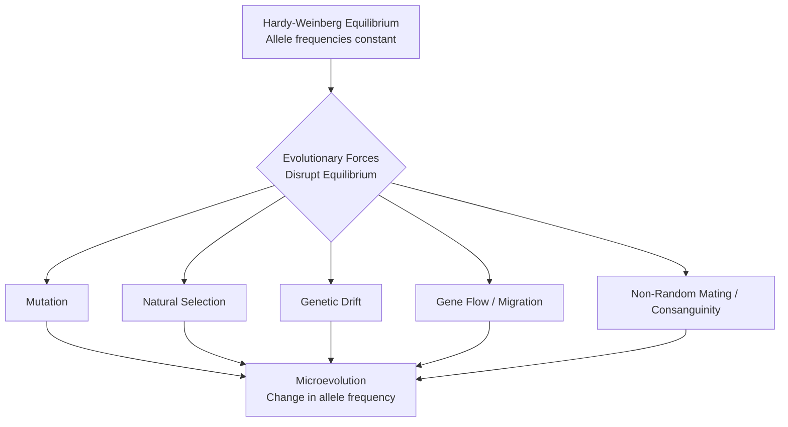

# PAPER I — UNITS 1.8 & 9: MISCELLANEOUS PHYSICAL & ARCHAEOLOGICAL TOPICS

---

## TOPIC 1: ARCHAEOLOGICAL DATING METHODS (UNIT 1.8)

> [!NOTE]
> **Syllabus Mapping:** 
> * Paper I, Unit 1.8: Principles of Prehistoric Archaeology. Chronology: Relative and Absolute Dating methods.

Dating methods in prehistoric archaeology are divided into two primary categories: Relative (sequence-based) and Absolute/Chronometric (calendar-based).

### I. RELATIVE DATING METHODS
Relative dating establishes the chronological sequence of artifacts (older vs. younger) without providing a specific calendar age in years.

1. **Stratigraphy (Law of Superposition):** Formulated by Nicholas Steno. In an undisturbed archaeological sequence, the lower layers (strata) are older than the upper layers.
   * *Limitation:* Stratigraphic disturbance by burrowing animals or floods can mix up layers.
2. **Typo-technology (Seriation):** Comparing artifacts (like handaxes or pottery) based on style and technological refinement. Simplistic forms are generally older than complex, refined forms.
3. **Fluorine Dating (Chemical):** Bones buried in groundwater absorb fluorine over time. Bones in the same strata with identical fluorine levels are contemporaneous. (Famed for exposing the **Piltdown Man hoax** by showing the human skull and ape jaw had different fluorine levels).

> [!TIP]
> **Mnemonic for Relative Methods:** **S T F** (Sequence The Fossils)
> * **S**tratigraphy, **T**ypology, **F**luorine.

### II. ABSOLUTE (CHRONOMETRIC) DATING METHODS
Absolute dating methods assign a specific calendar age or year range (Before Present - BP) to an artifact, usually relying on radiometric decay.

1. **Radiocarbon (C-14) Dating:**
   * *Mechanism:* Measures the decay of radioactive Carbon-14 into Nitrogen-14 after an organism dies. 
   * *Half-life:* 5,730 years.
   * *Application:* Effective only for **organic materials** (bone, charcoal, wood). Reliable up to $\sim 50,000$ years ago. Revolutionized the dating of the Neolithic era.
2. **Potassium-Argon (K-Ar) Dating:**
   * *Mechanism:* Measures the radioactive decay of Potassium-40 into Argon-40 in volcanic rock.
   * *Half-life:* 1.25 billion years.
   * *Application:* Used for dating extremely old **volcanic ash layers** (not the fossils themselves) spanning millions of years. Crucial for dating early hominid fossils in the East African Rift Valley (e.g., *Australopithecus*).
3. **Thermoluminescence (TL) Dating:**
   * *Mechanism:* Measures accumulated environmental radiation trapped in the crystal lattices (quartz/feldspar) of materials that were once heated. When reheated in a lab, they emit light proportional to their age.
   * *Application:* Best for dating **inorganic burnt materials** like pottery, burnt flint, and hearths up to 300,000 years old.

> [!TIP]
> **Value Addition: Thermoluminescence vs C-14 (UPSC Mains)**
> TL is a strictly chronometric (absolute) method. Its primary significance is filling the "Ceramic/Lithic Chronology" gap where Radiocarbon dating fails (because ceramics are inorganic). The "zeroing event" is the firing of the pottery in a kiln, which releases all previous radiation. The main limitation is the difficulty in accurately measuring the background "annual dose" of radiation from the burial soil, introducing margins of error.

---

### III. UPSC PREVIOUS YEAR QUESTIONS (PYQs) & ANSWER BLUEPRINTS

#### PYQ 1: Chronometric dating. [10 Marks, 2024]
* **Introduction:** Define chronometric (absolute) dating as techniques assigning an exact calendar age or specific time range (BP) to artifacts, relying heavily on radiometric decay.
* **Body:**
  * *Mechanism:* Explain the principle of radioactive decay (Half-life). 
  * *Major Methods:* Briefly describe Radiocarbon C-14 (for organic remains up to 50kya), Potassium-Argon (for volcanic ash layers millions of years old), and Thermoluminescence (for inorganic ceramics).
  * *Significance:* Contrast with relative dating. Mention how it revolutionized prehistoric archaeology by providing a verifiable, absolute timeline for human evolution and migration, allowing for cross-regional comparisons.
* **Conclusion:** Conclude that while highly accurate, these methods are expensive, often destructive, and must be combined with relative stratigraphic dating ("chronometric hygiene") to ensure contextual accuracy.

#### PYQ 2: Thermoluminescence (TL) dating. [10 Marks, 2021]
* **Introduction:** Define TL as a chronometric dating method that measures accumulated environmental radiation to determine the time elapsed since crystalline materials (quartz/feldspar) were last heated.
* **Body:**
  * *The Mechanism & Zeroing Event:* Explain that heating (e.g., firing pottery) acts as a "zeroing event," releasing all trapped electrons. Over time, electrons get trapped again at a known rate. Heating the sample in a lab measures the emitted light to calculate age.
  * *Application:* Crucial for dating inorganic artifacts (pottery, burnt flint) from 100 to 500,000 years ago.
  * *UPSC Value Addition:* Discuss its role in geoarchaeology (dating sediments exposed to sunlight) and authenticating ancient artifacts against modern forgeries.
* **Conclusion:** Conclude that TL dating fundamentally clarified Neolithic and Paleolithic chronologies where organic C-14 dating could not be applied, serving as an indispensable tool for ceramic archaeology.

---

## TOPIC 2: MENDELIAN GENETICS & PEDIGREE ANALYSIS (UNIT 9.1)

### I. MENDELIAN INHERITANCE IN MAN
While Gregor Mendel discovered the laws of inheritance using pea plants (1865), these principles apply directly to humans (single-gene or Mendelian traits).

1. **Law of Segregation:** During the formation of gametes (sperm/egg), the two alleles for a trait separate so that each gamete carries only one allele.
2. **Law of Independent Assortment:** Alleles for different traits sort independently of one another during gamete formation (provided they are on different chromosomes).

**Examiner-Friendly Diagram: The Monohybrid Cross (Law of Segregation)**
```mermaid
graph TD
    P1[Parent Generation] -->|Homozygous Dominant| TT[TT - Tall]
    P1 -->|Homozygous Recessive| tt[tt - Dwarf]
    TT -->|Gametes| G1((T))
    tt -->|Gametes| G2((t))
    G1 --> F1[F1 Generation: Tt - All Tall]
    G2 --> F1
    F1 -->|Self-Cross: Tt x Tt| G3((T)),G4((t)) & G5((T)),G6((t))
    G3 --> F2[F2 Generation]
    G4 --> F2
    G5 --> F2
    G6 --> F2
    F2 -->|Genotypic Ratio| R1[1 TT : 2 Tt : 1 tt]
    F2 -->|Phenotypic Ratio| R2[3 Tall : 1 Dwarf]
```

*Examples of Mendelian Traits in Humans:*
* **Autosomal Dominant:** Brachydactyly (short fingers), Huntington's Disease.
* **Autosomal Recessive:** Albinism, Cystic Fibrosis.

### II. PEDIGREE ANALYSIS
* **The Concept:** A pedigree is a standardized chart of genetic history over several generations of a family. Because humans cannot be subjected to controlled breeding experiments, anthropologists use pedigrees to track the inheritance patterns of genetic diseases.

**Key Diagnostic Patterns in Pedigrees:**
* **Autosomal Dominant:** Appears in every generation (no skipping). Affected children must have at least one affected parent. Both males and females are affected equally.
* **Autosomal Recessive:** Often skips generations. Affected children can be born to completely normal (heterozygous carrier) parents. Often linked to consanguineous (cousin) marriages.
* **X-Linked Recessive:** Affects males significantly more than females. An affected male inherits the mutated X chromosome from his carrier mother. Never shows male-to-male (father-to-son) transmission. (e.g., Color blindness, Hemophilia).

---

## TOPIC 3: LETHAL GENES & CHROMOSOMAL ABNORMALITIES (UNIT 9.1 & 9.4)

### I. LETHAL GENES
* **Definition:** A mutant allele that causes the premature death of the organism, either during embryonic development or before reaching reproductive age.
* **Mechanism:** Most lethal genes are recessive. They only cause death in the homozygous state. Heterozygous carriers survive and pass the gene to the next generation.
* **Evolutionary Impact:** Lethal genes constitute a major part of the **Genetic Load** of a population. 
* **Examples in Humans:** Tay-Sachs disease (causes neurological deterioration and death by age 4).

### II. CHROMOSOMAL ABNORMALITIES & KARYOTYPING (UNIT 9.4)
Normally, humans have 46 chromosomes (23 pairs: 22 autosomes + 1 pair of sex chromosomes). Chromosomal aberrations occur as deviations in number (Numerical/Aneuploidy, e.g., due to non-disjunction) or structure (e.g., translocations, deletions).

#### 1. Karyotyping: The Diagnostic Foundation
*   **Definition:** Karyotyping is the systematic arrangement of homologous chromosomes by size, shape, and banding pattern during the metaphase of cell division.
*   **Process:** Sample collection $\rightarrow$ Cell culture $\rightarrow$ Mitotic arrest (using colchicine) $\rightarrow$ Staining (e.g., Giemsa) $\rightarrow$ Microscopic analysis.
*   **Anthropological & Clinical Significance:** It is essential for prenatal diagnosis (detecting Down Syndrome), investigating recurrent miscarriages, and forensic human identification. Advanced techniques like FISH (Fluorescence In Situ Hybridization) now supplement traditional karyotyping to detect microdeletions.

> [!NOTE]
> **Beginner's Analogy:** Imagine building a Lego set. A gene mutation is like having one defective, badly shaped Lego block. A chromosomal abnormality is like getting a box that accidentally has 47 bags of blocks instead of the standard 46, throwing off the entire instruction manual.

#### 2. Autosomal Abnormalities
* **Down's Syndrome (Trisomy 21):**
  * *Cause:* Presence of an extra copy of Chromosome 21 (Total = 47 chromosomes). Primary risk factor is advanced maternal age.
  * *Phenotype:* Intellectual disability, flat facial profile, epicanthic eye folds, congenital heart defects, and a broad palm (simian crease).

#### 3. Sex Chromosome Abnormalities
* **Turner Syndrome (45, X0):**
  * *Cause:* Monosomy X; a female born with only one X chromosome.
  * *Phenotype:* Phenotypically female, but characterized by short stature, webbed neck, underdeveloped ovaries (ovarian dysgenesis), and absolute sterility.
* **Klinefelter Syndrome (47, XXY):**
  * *Cause:* Sex Aneuploidy; a male born with an extra X chromosome.
  * *Phenotype:* Phenotypically male, but with feminized secondary sexual characteristics (gynecomastia), reduced muscle mass, hypogonadism, and sterility.

> [!TIP]
> **UPSC Value Addition (Evolutionary Perspective):** While numerical aberrations like Trisomy 21 are highly deleterious, *structural* chromosomal aberrations (like Robertsonian translocations or inversions) have historically played a vital role in human macro-evolution. They can create new gene combinations and lead to reproductive isolation, ultimately driving speciation between early hominin populations.

---

### III. UPSC PREVIOUS YEAR QUESTIONS (PYQs) & ANSWER BLUEPRINTS

#### PYQ 1: What is meant by karyotype? How does its analysis help in diagnosis of the chromosomal aberrations in man? [20 Marks, 2024]
* **Introduction:** Define karyotype and explain that it represents the visual chromosomal constitution of a species (46, XX or XY for humans).
* **Body:**
  * *The Technique:* Outline the steps from cell culture to arresting division at metaphase using colchicine, and staining.
  * *Diagnosis of Numerical Aberrations:* Explain how simply counting chromosomes diagnoses conditions like Down's Syndrome (Trisomy 21) or Klinefelter's (XXY). Use a simple diagram of an extra chromosome 21.
  * *Diagnosis of Structural Aberrations:* Explain how banding patterns (G-banding) help identify translocations, deletions (e.g., Cri-du-chat syndrome), or inversions.
  * *Clinical & Public Health Role:* Discuss its use in genetic counseling, amniocentesis for older mothers, and forensic anthropology.
* **Conclusion:** Conclude that karyotyping revolutionized medical anthropology, shifting the diagnosis of congenital disorders from phenotypic guesswork to precise cytogenetic science.

---

## TOPIC 4: EPIDEMIOLOGICAL ANTHROPOLOGY (UNIT 9.8)

> [!NOTE]
> **Syllabus Mapping:** 
> * Paper I, Unit 9.8: Epidemiological Anthropology: Health and disease. Infectious and non-infectious diseases. Nutritional deficiency related diseases.

Epidemiological anthropology explores how cultural, ecological, and socio-economic factors interact to influence the prevalence and spread of diseases in human populations.

### I. THE CONCEPT OF EPIDEMIOLOGICAL TRANSITION
Coined by Abdel Omran (1971), it describes the historical shift in disease patterns as human societies evolve from prehistoric to modern industrial states. Anthropologists have expanded this into distinct transitional phases:

#### 1. The First Transition (The Neolithic Revolution)
Coinciding with the rise of **sedentism and food production (agriculture)** $\\sim 10,000$ years ago.
*   **Nutritional Stress:** Shift from diverse hunter-gatherer diets to high-carbohydrate monoculture (wheat/rice) caused severe micronutrient deficiencies and stunted growth. Skeletal evidence shows increased dental caries and malnutrition lines (Harris lines).
*   **Zoonotic Infectious Diseases:** Dense, permanent settlements and close proximity to domesticated animals created reservoirs for zoonotic pathogens (tuberculosis, smallpox, measles).
*   **Sanitation Issues:** Sedentism led to waste accumulation, fostering waterborne diseases (cholera, dysentery).

#### 2. The Second Transition (Omran's Classic Model)
*   **Age of Pestilence and Famine (Pre-Industrial):** High mortality from infectious diseases (plague, malaria) and starvation. Life expectancy is low.
*   **Age of Receding Pandemics (Industrializing):** Improved sanitation, antibiotics, and vaccines lead to a sharp decline in infectious disease mortality.
*   **Age of Degenerative and Man-Made Diseases (Post-Industrial):** Mortality shifts to non-infectious, chronic "lifestyle diseases" (cardiovascular diseases, cancer, type 2 diabetes) due to aging populations and sedentary habits.

#### 3. The Third Transition (The Modern Era)
Characterized by the **re-emergence of infectious diseases** and the rise of antibiotic resistance, driven by globalization, rapid urbanization, climate change, and hyper-connectivity.

> [!TIP]
> **UPSC Value Addition (The Double Burden):** Note that Omran's model assumes a linear progression typical of Western developed nations. Developing countries like India face a **"Double Burden of Disease"**—they are simultaneously battling high rates of infectious diseases (TB, Malaria) linked to poverty, alongside a skyrocketing incidence of degenerative lifestyle diseases (Diabetes, Hypertension) linked to rapid urban sedentism.

### II. INFECTIOUS VS. NON-INFECTIOUS DISEASES
* **Infectious Diseases:** Caused by pathogenic microorganisms (bacteria, viruses). E.g., The introduction of smallpox and measles by European colonizers decimated indigenous tribal populations in the Americas and Andaman Islands who lacked genetic immunity.
* **Non-Infectious (Lifestyle) Diseases:** Arise from genetics, environment, and modern sedentary behaviors. E.g., The global rise in obesity and hypertension due to the shift from active foraging/farming to sedentary urban desk jobs and processed diets.

### III. NUTRITIONAL ANTHROPOLOGY & MALNUTRITION
* **Protein-Energy Malnutrition (PEM):** Kwashiorkor (protein deficiency causing edema/swollen belly) and Marasmus (overall severe calorie deficiency causing extreme emaciation).
* **Micronutrient Deficiencies:** Iron-deficiency anemia (highly prevalent among Indian tribal women), Vitamin A deficiency (causing night blindness), and Iodine deficiency (goiter in Himalayan belts).

### IV. UPSC PREVIOUS YEAR QUESTIONS (PYQs) & ANSWER BLUEPRINTS

#### PYQ 1: Critically examine the demographic and epidemiological consequences with rise in food production and sedentism. [15 Marks, 2020]
* **Introduction:** Define sedentism and the Neolithic agricultural revolution as the "First Epidemiological Transition," fundamentally altering human-environment interactions.
* **Body:**
  * *Demographic Consequences:* Increased fertility (reduced birth spacing compared to mobile foragers) leading to rapid population growth and higher population density.
  * *Epidemiological Consequences (The Cost of Agriculture):*
    * **Zoonoses:** Close contact with livestock introduced novel pathogens (measles from cattle, flu from pigs).
    * **Sanitation:** Waste accumulation in permanent villages led to endemic waterborne and parasitic infections.
    * **Nutritional Stress:** Reliance on single-crop staples caused protein and micronutrient deficiencies, evidenced by enamel hypoplasia and porotic hyperostosis in skeletal remains.
  * *Biomechanical Impact:* Increased osteoarthritis from repetitive agricultural labor.
* **Conclusion:** Conclude that while food production enabled civilization and massive demographic expansion, it paradoxically resulted in a temporary decline in individual human health and biological robustness compared to Paleolithic hunter-gatherers.

---

## TOPIC 5: HARDY-WEINBERG EQUILIBRIUM & EVOLUTIONARY FORCES (UNIT 9.3)

### I. THE HARDY-WEINBERG LAW (THE NULL HYPOTHESIS)
The Hardy-Weinberg Equilibrium (HWE) serves as a mathematical baseline for studying population genetics. It states that allele and genotype frequencies in a population remain constant from generation to generation *only* if no evolutionary forces are acting upon it.

*   **The "Ideal" Population Assumptions:**
    1.  Random mating (Panmixis)
    2.  No mutation
    3.  No migration (Gene flow)
    4.  Infinite population size (No genetic drift)
    5.  No natural selection



*   **Anthropological Significance:** When a real human population deviates from HWE, it provides statistical proof that microevolution is actively occurring, prompting anthropologists to identify which force (selection, drift, etc.) is responsible.

### II. MARRIAGE RULES AS CULTURAL EVOLUTIONARY FORCES
While mutation and genetic drift are biological forces, human cultural practices—specifically marriage rules—act as powerful evolutionary filters that disrupt HWE by violating the "random mating" assumption.

*   **Endogamy & Consanguinity (Inbreeding):** Marrying within a closed group or with close relatives (e.g., uncle-niece marriages prevalent in South India) increases the probability of offspring inheriting alleles identical by descent.
*   **Impact on the Gene Pool:**
    *   *Short-term (Inbreeding Depression):* Drastically increases **homozygosity**, leading to the phenotypic expression of harmful, hidden recessive alleles (e.g., higher rates of congenital disorders in Amish communities).
    *   *Long-term (Purging):* Over many centuries, highly consanguineous populations may experience natural selection purging these deleterious recessive alleles from the gene pool, potentially reducing the genetic load.

---

## TOPIC 6: GENETIC POLYMORPHISM (UNIT 9.3)

### I. BALANCED VS. TRANSIENT POLYMORPHISM
Genetic polymorphism is the occurrence of two or more genetically determined phenotypes in a population in frequencies too high to be maintained by recurrent mutation alone.

*   **Transient Polymorphism:** A temporary evolutionary state where one allele is gradually replacing another due to directional selection or genetic drift. The gene frequencies are actively shifting toward fixation or elimination.
*   **Balanced Polymorphism:** The stable maintenance of two or more alleles in a population over many generations. It is maintained by **Balancing Selection** (Heterozygote Advantage), where the heterozygous genotype ($Aa$) has a higher evolutionary fitness than either homozygote ($AA$ or $aa$).

### II. VALUE ADDITION: SICKLE CELL TRAIT IN INDIA
The Sickle Cell Trait ($HbAS$) is the classic textbook example of balanced polymorphism. 
*   **The Biocultural Mechanism:** In malaria-endemic regions (like the tribal belts of Central India), the heterozygote ($HbAS$) resists *Plasmodium falciparum* malaria better than normal individuals ($HbAA$), while avoiding the lethal effects of full sickle cell anemia ($HbSS$). Natural selection thus maintains the sickle allele in the population.
*   **The Arab-Indian Haplotype:** In Indian tribal populations, the sickle gene is uniquely linked to the Arab-Indian haplotype, which promotes higher levels of Fetal Hemoglobin ($HbF$). This mitigates the severity of the disease compared to African populations.
*   **Public Health Link:** Understanding this polymorphism is the foundation for the Government of India's **National Sickle Cell Anaemia Elimination Mission (2047)**, highlighting the applied value of physical anthropology.
Malnutrition includes both undernutrition and overnutrition.

* **Protein-Calorie Malnutrition (PCM):** Severe undernutrition common in developing nations.
  * *Kwashiorkor:* Caused primarily by **protein deficiency** despite adequate calorie intake. Characterized by severe edema (swollen belly), muscle wasting, and depigmentation of hair.
  * *Marasmus:* Caused by a severe deficiency of **both calories and protein**. Characterized by extreme emaciation ("skin and bones" appearance) and severe growth retardation.

> [!TIP]
> **Mnemonic for PCM:**
> * **K**washiorkor = **K**arbohydrates present, but no Protein (Swollen belly).
> * **M**arasmus = **M**issing everything (Emaciated).

### IV. MICRONUTRIENT DEFICIENCIES (UPSC Value Addition)

| Deficiency | Disease Name | Population Most Affected |
| :--- | :--- | :--- |
| **Vitamin A** | Night blindness, Xerophthalmia | Children under 5, tribal areas |
| **Iodine** | Goitre, Cretinism (in newborns) | Himalayan foothills, inland areas far from sea |
| **Iron** | Anaemia | Women of reproductive age, tribal women |
| **Vitamin D** | Rickets (children), Osteomalacia (adults) | Indoor workers, dark-skinned people in low-sunlight areas |
| **Vitamin C** | Scurvy | Populations with no access to fresh fruits/vegetables |

### V. ANTHROPOLOGICAL PERSPECTIVE ON EPIDEMICS (UPSC Value Addition)

* **Cultural Epidemiology:** Medical anthropologists (Arthur Kleinman) study how people's *explanatory models* (their folk understanding of why they get sick) affect health-seeking behavior. If a community attributes fever to spirit possession, they will seek the *Ojha* (shaman), not a doctor.
* **COVID-19 and Anthropology:** The pandemic demonstrated core anthropological lessons:
  * **Global interconnectedness** spread a local zoonotic spillover event into a global pandemic.
  * **Vaccine hesitancy** is a cultural, not just scientific, problem — linked to mistrust of state institutions, misinformation networks, and varying explanatory models of disease.
  * **Tribal vulnerability:** Remote tribal communities lacked both infection data and healthcare, making them invisible in the public health response.
* **Thrifty Genotype Hypothesis (James Neel, 1962):** Proposes that genes that promote efficient fat storage were advantageous in ancestral environments of feast-and-famine cycles. In modern environments of constant food abundance, these same genes predispose populations to obesity and Type 2 Diabetes. This explains the disproportionate prevalence of Diabetes in South Asian populations.

