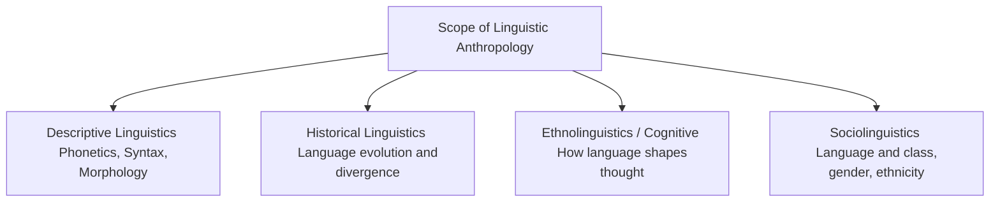
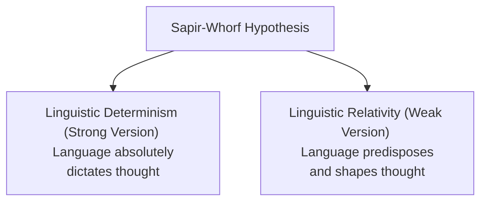
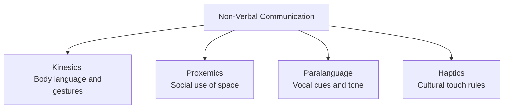

# PAPER I — UNIT 7: LINGUISTIC ANTHROPOLOGY

---

## TOPIC 1: NATURE, SCOPE & ORIGIN OF LANGUAGE

> [!NOTE]
> **Syllabus Mapping:** 
> * Paper I, Unit 7: Linguistic Anthropology — Nature and scope of linguistic anthropology; origin and development of language.
> * Connects with: Unit 1.3 (Branches of Anthropology), Unit 2.1 (Nature of Culture), and Paper II, Unit 2 (Linguistic elements of India).

---

### I. NATURE AND SCOPE OF LINGUISTIC ANTHROPOLOGY

Linguistic Anthropology is one of the four core branches of anthropology. It does not simply study language structure (which is the domain of formal linguistics); rather, it examines **language in its social and cultural context**.

* **Core Distinction:** 
  * *Formal Linguistics:* Studies language as a closed, abstract system of formal rules (independent of speakers).
  * *Linguistic Anthropology:* Studies language as a dynamic social action and a key vehicle for transmitting culture and establishing power relations.
* ** Dell Hymes' Communicative Competence:** Rejects Noam Chomsky's narrow "linguistic competence" (which only focuses on grammatical correctness). Dell Hymes argued that a speaker must acquire "communicative competence"—knowing *when to speak, when not to, what to talk about, with whom, when, where, and in what manner*.

---

### II. ORIGIN AND DEVELOPMENT OF LANGUAGE

The origin of language is one of the most debated topics in biological and socio-cultural anthropology, involving anatomical evolution and cultural needs.

#### 1. Biological/Anatomical Pre-requisites
* **Erect Posture & Laryngeal Descent:** The evolution of bipedalism led to changes in the skull base (flexure), which caused the larynx (voice box) to descend lower in the throat. This created a large pharyngeal chamber, allowing humans to produce a wide range of distinct vowel and consonant sounds.
* **FOXP2 Gene ("The Language Gene"):** A crucial mutation occurring in the human lineage (shared by Neanderthals) that coordinates the complex facial, laryngeal, and tongue movements required for articulate speech.
* **Cerebral Lateralization:** The enlargement of the left hemisphere of the brain, specifically containing **Broca's Area** (speech production) and **Wernicke's Area** (speech comprehension).

#### 2. Theories of Language Origin
* **The Gestural Origins Theory (Gordon Hewes):** Posits that human language originated from gestures and sign language rather than vocalizations, as apes show far greater control over voluntary hand gestures than vocal cords.
* **The Social Grooming Hypothesis (Robin Dunbar):** Suggests that as hominid group sizes grew too large for physical grooming (to maintain social bonds), vocalizations emerged as a form of "vocal grooming" to maintain massive social networks efficiently.

---
---

## TOPIC 2: STRUCTURE OF LANGUAGE

> [!NOTE]
> **Syllabus Mapping:** 
> * Paper I, Unit 7: Linguistic Anthropology — Structure of language (phonetics, phonology, morphology, syntax, semantics).

---

### I. LEVEL-BY-LEVEL ANALYSIS OF LANGUAGE STRUCTURE

To understand how language carries cultural meaning, linguistic anthropologists analyze language through five structured levels:

#### 1. Phonetics (Universal Raw Sounds)
* **Definition:** The study of the physical production and acoustic properties of speech sounds.
* **Key Concept:** Phonetics operates in an *etic* domain (objective, universal). It documents all sounds human vocal tracts can make, using the International Phonetic Alphabet (IPA).

#### 2. Phonology (Culturally Filtered Sounds)
* **Definition:** The study of the system of speech sounds in a specific language.
* **Phoneme:** The smallest, contrastive unit of sound that distinguishes meaning in a language (e.g., /p/ and /b/ in "pin" vs. "bin"). Phonology operates in an *emic* domain (subjective, culture-specific).

#### 3. Morphology (Grammatical Units)
* **Definition:** The study of the internal structure and formation of words.
* **Morpheme:** The smallest meaningful unit of a language.
  * *Free Morpheme:* Can stand alone as a word (e.g., "cat").
  * *Bound Morpheme:* Must be attached to a free morpheme (e.g., the plural marker "-s" in "cats").

#### 4. Syntax (Sentence Structure)
* **Definition:** The rules governing how words are combined to form grammatically correct phrases and sentences.
* **Chomsky's Generative Grammar:** Proposes that all humans possess an innate Universal Grammar that generates infinite sentences from finite syntactic rules.

#### 5. Semantics (Meaning System)
* **Definition:** The study of how meaning is constructed and conveyed through words and sentences.
* **Componential Analysis:** Deconstructing semantic domains (e.g., kinship terms like "uncle") into distinct semantic features (e.g., +male, +collateral, +older generation) to understand native cognitive classifications.

---
---

## TOPIC 3: SOCIO-LINGUISTICS (LANGUAGE & SOCIAL IDENTITY)

> [!NOTE]
> **Syllabus Mapping:** 
> * Paper I, Unit 7: Linguistic Anthropology — Socio-linguistics (language and culture, language and gender, language and class, language and ethnicity).

---

### I. LANGUAGE AND CULTURE: THE SAPIR-WHORF HYPOTHESIS

One of the most famous hypotheses in anthropology, formulated by Edward Sapir and his student Benjamin Lee Whorf, explores the direct relationship between language and cultural worldview.

* **Linguistic Determinism (Strong Version):** Language *determines* the cognitive categories of its speakers. If a language lacks a word for a concept, its speakers cannot comprehend that concept. (Mostly rejected by modern cognitive scientists).
* **Linguistic Relativity (Weak Version):** Language *influences* thought. The structure of a language directs its speakers' attention to specific aspects of reality, making certain worldviews more natural or accessible.
* **Classic Examples:**
  * *Hopi Concept of Time:* Whorf argued that the Hopi language has no grammatical tenses for past, present, and future, leading them to perceive time as a continuous process rather than a segmentable line.
  * *Inuit Snow Vocabulary:* The presence of dozens of distinct words for different types of snow (falling, slushy, hard-packed) reflects a cultural adaptation to an arctic ecology.

#### Value Addition: Contemporary Applications (UPSC Mains)
* **Digital Communication & Emojis:** Emojis act as a new linguistic layer. Cultural differences in interpreting the exact same emoji demonstrate how digital "languages" shape our emotional expression and intent in online spaces.
* **Algorithmic Filter Bubbles:** Search engine algorithms create digital forms of linguistic relativity—the limited vocabulary of trending topics curates and restricts the range of ideas users are exposed to, shaping cognitive environments.
* **Language Endangerment & TEK:** When a language dies, its unique "cognitive architecture" dies with it. For example, the *Guugu Yimithirr* language in Australia uses absolute cardinal directions (north/south) instead of relative ones (left/right), fostering constant spatial awareness. The loss of such endangered languages means a permanent loss of Traditional Ecological Knowledge (TEK) encoded within specific indigenous vocabularies.

---

### II. LANGUAGE AND GENDER

Gendered sociolinguistics (pioneered by **Robin Lakoff** and **Deborah Tannen**) investigates how language reflects and enforces patriarchal power dynamics and gender identities.

* **Lakoff's "Women's Language" (1975):** Documented that women are culturally conditioned to use specific linguistic markers that convey submissiveness and uncertainty:
  * *Tag Questions:* E.g., "It's a nice day, *isn't it?*"
  * *Hedges:* E.g., "*Sort of,* I think, perhaps."
  * *Rising Intonation:* Raising pitch at the end of declarative sentences, making them sound like questions.
* **Tannen's Report vs. Rapport Talk:**
  * *Men (Report Talk):* Use language to establish status, assert independence, and exhibit skill.
  * *Women (Rapport Talk):* Use language to establish intimacy, build social connections, and maintain equality.

---

### III. LANGUAGE AND CLASS

Sociolinguistic researcher **Basil Bernstein** formulated two distinct linguistic codes that reflect and reinforce class boundaries:

* **Restricted Code (Working Class):** Highly contextualized, dependent on shared background, utilizes short, condensed sentences, and relies heavily on non-verbal cues.
* **Elaborated Code (Middle/Upper Class):** Universalistic, context-independent, uses complex, grammatically complete, and highly descriptive sentences to articulate abstract ideas.
* **William Labov's NYC Department Store Study (1972):** Proved that the pronunciation of the post-vocalic /r/ (e.g., "four") correlates directly with social class. Upper-class speakers consistently pronounced the /r/ (prestige dialect), while working-class speakers dropped it.

---

### IV. LANGUAGE AND ETHNICITY

Language is the primary marker of ethnic boundaries and a powerful political tool.

* **African American Vernacular English (AAVE):** William Labov demonstrated that AAVE is not "bad English" or slang; it is a highly structured, rule-governed dialect of English with its own precise grammatical rules (e.g., the habitual "be" in "he be working").
* **UPSC Value Addition (Indian Context):** 
  * *Language as a Mobilization Tool:* The reorganization of Indian states in 1956 was entirely driven by ethno-linguistic identities (e.g., Telugu speakers demanding Andhra State under Potti Sriramulu).
  * *Tribal Language Marginalization:* The dominance of regional state languages (e.g., Odia, Hindi) has marginalized tribal mother tongues (e.g., Santali, Gondi), causing high dropout rates in schools. The introduction of **Multilingual Education (MLE)** in states like Odisha attempts to resolve this.

---
---

## TOPIC 4: NON-VERBAL COMMUNICATION

> [!NOTE]
> **Syllabus Mapping:** 
> * Paper I, Unit 7: Linguistic Anthropology — Non-verbal communication.

---

### I. TYPES OF NON-VERBAL COMMUNICATION

Over 65% of human communication is estimated to be non-verbal, carrying deep cultural and social meanings.

#### 1. Kinesics (Body Language)
* **Definition:** The study of communication through body movements, facial expressions, postures, and gestures.
* **Cultural Relativity of Gestures (Emblems):** While basic facial expressions (anger, fear, happiness) are biologically universal (Ekman's studies), gestures are entirely culture-specific (e.g., the "thumbs up" is a sign of approval in the West but an offensive gesture in parts of the Middle East).

#### 2. Proxemics (Use of Space)
* **Definition:** Pioneered by **Edward T. Hall**, it is the study of how humans use and partition space during social interactions.
* **Four Distance Zones:**
  1. *Intimate Distance:* (0 to 18 inches) - Lovers, close family.
  2. *Personal Distance:* (1.5 to 4 feet) - Friends, informal conversations.
  3. *Social Distance:* (4 to 12 feet) - Business, strangers.
  4. *Public Distance:* (Beyond 12 feet) - Lecturers, public figures.
* **Cultural Variation:** Latin American and Middle Eastern cultures have much smaller personal space boundaries compared to northern European and East Asian cultures.

#### 3. Paralanguage (Vocalized Cues)
* **Definition:** The vocal but non-verbal dimensions of speech (e.g., pitch, tempo, volume, giggling, sighing, and silences).
* **Significance:** A sigh can communicate fatigue, grief, or frustration depending entirely on the cultural context.

---

### II. UPSC PREVIOUS YEAR QUESTIONS (PYQs) & ANSWER BLUEPRINTS

---

#### PYQ 1: "Explain how variations in language usage relate to social inequality." [2020, 20 Marks]
* **Introduction:** Define sociolinguistics. Explain that language is never neutral; variations in dialect, vocabulary, and accent act as markers of social stratification, prestige, and power.
* **Body:**
  * **Class & Language:** Cite William Labov's New York department store study, demonstrating how the pronunciation of the post-vocalic 'r' correlated directly with socioeconomic status and prestige.
  * **Gender Inequality (Robin Lakoff):** Discuss how women's language (e.g., tag questions, hedges, hyper-politeness) historically reflected their subordinate societal position.
  * **Race/Ethnicity (AAVE):** Explain how the stigmatization of African American Vernacular English (AAVE) reinforces racial discrimination, despite AAVE being a perfectly logical and rule-governed dialect.
  * **Indian Context (Value Addition):** English proficiency vs. vernacular languages in India creates a massive employment and status divide. Discuss the marginalization of tribal languages (e.g., Ho, Santhali) in state schools.
* **Conclusion:** Conclude that language variation does not just *reflect* social inequality; it actively *reproduces* it by institutionalizing dominant dialects as "standard" and stigmatizing minority variations as "incorrect."

#### PYQ 2: "Explain the difference between 'Emic' & 'Etic' and how does the difference derive from the study of language?" [2015, 15 Marks]
* **Introduction:** Coined by linguist Kenneth Pike (1954), the terms derive directly from linguistic terms: *phonemic* (internal structural rules of a language) and *phonetic* (universal acoustic properties of sound).
* **Body:**
  * **Derivation from Linguistics:** 
    * *Phonemics* deals with how a native speaker categorizes sound. 
    * *Phonetics* deals with the objective, external measurement of sound frequencies by a linguist.
  * **Application in Anthropology (Marvin Harris):**
    * *Emic Perspective:* The insider's point of view. It describes culture using categories and concepts meaningful to the members of that culture. (e.g., Hindus refuse to eat cows because the cow is considered a sacred mother).
    * *Etic Perspective:* The outsider's (scientific) point of view. It describes culture using objective, universal, scientific categories (e.g., Marvin Harris's cultural materialism argues Hindus don't eat cows because cows are economically more valuable alive for traction and dung).
* **Conclusion:** Both perspectives are crucial. Emic data provides the psychological reality of a culture, while etic data allows anthropologists to make cross-cultural scientific comparisons.
