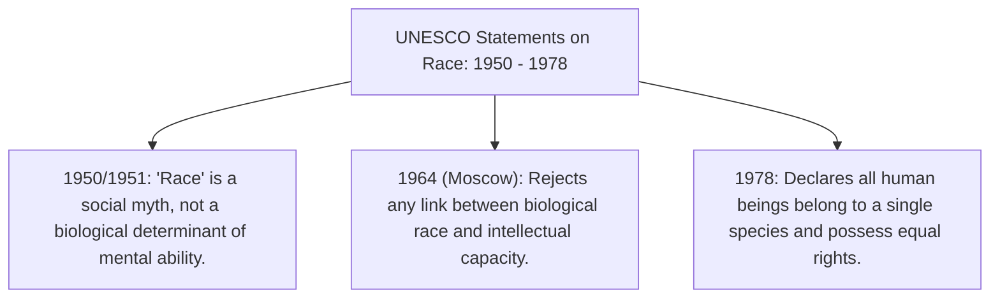
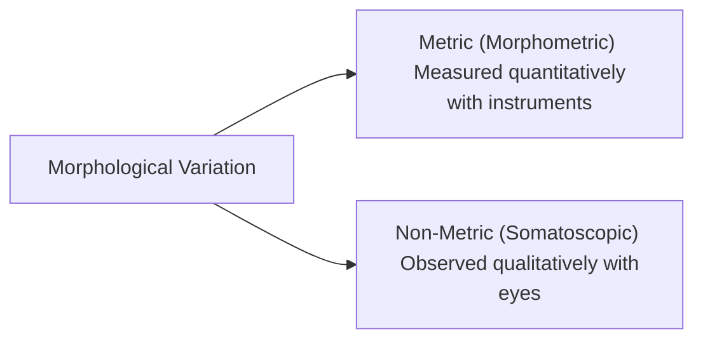
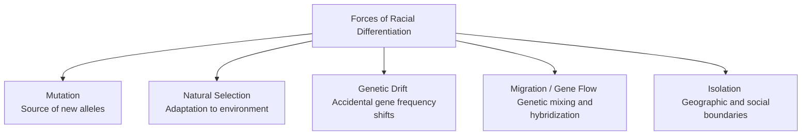
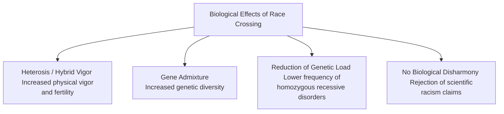

# PAPER I — UNIT 9.5: RACE AND RACISM

---

## TOPIC 1: THE CONCEPT OF RACE & RACISM

> [!NOTE]
> **Syllabus Mapping:** 
> * Paper I, Unit 9.5: Race and racism; biological basis of racial classification, racial differentiation.
> * Connects with: Paper I, Unit 9.1 (Human Genetics), Unit 9.3 (Genetic Polymorphism), and Paper II, Unit 2 (Demographic Profile).

---

### I. DEFINITIONS & ANTHROPOLOGICAL PARADIGM SHIFT

Historically, "race" was viewed as a fixed, biological categorization of human beings based on physical features. Modern biological anthropology has completely dismantled this view, treating race as a **social construct** rather than a valid biological category.

* **Biological definition of Race (Subspecies):** A geographically circumscribed population of a species that differs genetically from other populations of the same species.
* **Why Race is Biologically Invalid in Humans:**
  * **Continuous Variation (Clines):** Human physical traits (like skin color) vary gradually across geographic space (clines) rather than having sharp boundaries.
  * **High Intra-group Variation:** Geneticist **Richard Lewontin (1972)** proved that **85% of all human genetic variation occurs *within* any given local population**, while only 7–10% occurs between traditional "racial" groups.
  * **Non-concordance of Traits:** Physical traits do not covary. Skin color, hair form, and blood groups vary independently. One trait might categorize populations one way, while another trait cuts across them entirely.
* **The Social Reality of Race:** While biologically a myth, race is a powerful social reality (social construct) that has historically been used to allocate power, privilege, and resources.

---

### II. RACISM: SCIENTIFIC RACISM & SOCIAL IMPLICATIONS

* **Definition of Racism:** The highly unscientific belief that physical characteristics (like skin color or skull shape) are linked to cognitive capacities, morality, or behavioral traits, asserting that certain groups are inherently (genetically) superior or inferior to others.
* **Scientific Racism:** In the 19th and early 20th centuries, scholars (like Arthur de Gobineau, Cesare Lombroso, and early craniometrists) misused biological measurements to justify slavery, colonialism, and the Holocaust by claiming certain races were biologically degenerate or primitive.

> [!TIP]
> **UNESCO Statements on Race (Value Addition):**
> * **1950/1951 Statement:** Declared that "race is a social myth" rather than a biological phenomenon, and that there is no evidence of differences in innate intelligence between human groups.
> * **1964 Moscow Declaration:** Reconfirmed that genetic differences do not determine cultural or intellectual superiority.
> * **1978 Declaration on Race and Racial Prejudice:** Asserted that all human beings belong to a single species and share a common origin, condemning racism as biologically baseless and socially unjust.

---
---

## TOPIC 2: BIOLOGICAL BASIS OF MORPHOLOGICAL VARIATION

> [!NOTE]
> **Syllabus Mapping:** 
> * Paper I, Unit 9.5: Biological basis of morphological variation of non-metric and metric characters. Racial criteria, racial traits in relation to heredity and environment.

---

### I. METRIC (MORPHOMETRIC) VS. NON-METRIC (SOMATOSCOPIC) CHARACTERS

Anthropologists classify and measure human morphological variation using two sets of characters:

#### 1. Metric (Morphometric) Characters
These are quantitative measurements taken on the human body using specialized instruments (sliding calipers, spreading calipers, anthropometer rods):

* **Cephalic Index (CI):** Formulated by Swedish anatomist **Anders Retzius in 1842**. It measures head shape:
  $$\text{Cephalic Index} = \frac{\text{Head Breadth}}{\text{Head Length}} \times 100$$
  * *Dolichocephalic (Long head):* $\text{CI} \le 75.9$ (Common in African and Nordic populations).
  * *Mesocephalic (Medium head):* $76.0 \le \text{CI} \le 80.9$.
  * *Brachycephalic (Broad/Round head):* $\text{CI} \ge 81.0$ (Common in East Asian and Alpine populations).
* **Nasal Index (NI):** Measures nose shape:
  $$\text{Nasal Index} = \frac{\text{Nasal Breadth}}{\text{Nasal Height}} \times 100$$
  * *Leptorrhine (Narrow nose):* $\text{NI} \le 69.9$ (Cold/dry climates, e.g., Europeans).
  * *Mesorrhine (Medium nose):* $70.0 \le \text{NI} \le 84.9$.
  * *Platyrrhine (Broad nose):* $\text{NI} \ge 85.0$ (Hot/humid climates, e.g., African Negroids, Indian Proto-Australoids).
* **Stature:** Total standing height. Highly plastic and heavily influenced by childhood nutrition.

#### 2. Non-Metric (Somatoscopic) Characters
These are qualitative, observable traits recorded using standardized color charts or structural classifications:

* **Skin Color:** Primarily determined by the concentration of **melanin** in the epidermis, synthesized by melanocytes. Modern anthropologists measure it objectively using **reflectance spectrophotometry** (measuring the percentage of light reflected off the skin).
* **Hair Form & Color:**
  * *Leiotrichous (Straight hair):* Common in Mongoloids.
  * *Cymotrichous (Wavy/Curly hair):* Common in Caucasoids.
  * *Ulotrichous (Woolly/Frizzy hair):* Common in Negroids.
* **Eye Shape & Epicanthic Fold:** The epicanthic fold is a fold of skin over the inner corner of the eye, highly characteristic of Mongoloid populations, serving as an adaptive shield against harsh winds, snow-glare, and dust.
* **Lip Thickness:** Classified from thin (common in Caucasoids) to thick and everted (common in African Negroids).

---

### II. RACIAL TRAITS IN RELATION TO HEREDITY & ENVIRONMENT

A long-standing debate in physical anthropology is the degree to which morphological traits are determined by genetics (heredity) vs. environmental adaptation.

* **Genotype vs. Phenotype:** Morphological traits are phenotypes, generated by the interaction of an individual's genotype with their environmental conditions.
* **Franz Boas' Landmark 1912 Immigrant Study:**
  * *The Study:* Boas measured the head shapes (Cephalic Index) of over 17,000 European immigrants in New York and their children born in the USA.
  * *The Findings:* The Cephalic Index—which was universally believed to be a fixed, unalterable genetic racial trait—**changed significantly within a single generation** due to environmental factors (changes in diet, infant sleeping position, and urbanization).
  * *Significance:* Proved that human physical form is highly **plastic** and dynamically shaped by the environment, completely undermining the use of cephalic index as a fixed marker of "pure races."

---
---

## TOPIC 3: RACIAL DIFFERENTIATION IN MAN

> [!NOTE]
> **Syllabus Mapping:** 
> * Paper I, Unit 9.5: Biological basis of racial classification, racial differentiation in man.

---

### I. EVOLUTIONARY FORCES OF RACIAL DIFFERENTIATION

The biological differentiation of human populations across geographic space is driven by five classic evolutionary forces:

1. **Mutation:** The ultimate source of all genetic variation. Random mutations introduce new alleles (e.g., light skin mutations in northern latitudes) into local gene pools.
2. **Natural Selection (Adaptive Response):** Selects alleles that enhance survival in specific environments:
   * *Melanin Selection:* High UV radiation in the tropics selects for high melanin (dark skin) to protect against folic acid breakdown and skin cancer. Low UV in northern latitudes selects for low melanin (light skin) to allow sufficient vitamin D synthesis.
   * *Climatic Rules:* **Bergmann's Rule** (larger, stouter bodies in cold climates to conserve heat) and **Allen's Rule** (shorter limbs in cold climates, longer limbs in hot climates to dissipate heat) explain differences in body proportions.
3. **Genetic Drift (Accidental Fluctuations):** Random changes in gene frequencies, particularly in small, isolated founding populations:
   * *Founder Effect:* E.g., the high frequency of blood group O among Native American populations is due to a small, isolated group crossing the Bering land bridge.
4. **Migration and Gene Flow:** Introduces new genetic variations into a population and reduces extreme genetic differences between neighboring groups.
5. **Isolation (Geographic and Cultural):** Geographical barriers (mountains, oceans) or cultural barriers (endogamy, language) prevent gene flow, allowing isolated populations to differentiate genetically over time.

---
---

## TOPIC 4: RACE CROSSING IN MAN

> [!NOTE]
> **Syllabus Mapping:** 
> * Paper I, Unit 9.5: Race crossing in man.

---

### I. DEFINITION & BIOLOGICAL EFFECTS

* **Definition of Race Crossing:** The hybridization, intermarriage, or interbreeding between individuals belonging to different geographically isolated populations or distinct racial groups.
* **Biological Outcomes:** Modern genetics proves that race crossing is highly beneficial and carries no harmful biological consequences.

* **1. Heterosis (Hybrid Vigor):** The biological phenomenon where hybrid offspring exhibit increased physical stature, robust health, mental vigor, and higher fertility rates than either of the parent populations.
* **2. Increased Genetic Diversity (Gene Flow):** By introducing new genetic combinations, race crossing increases the overall heterozygosity of the gene pool, making the population more adaptable to environmental and disease stresses.
* **3. Reduction of Genetic Load:** Dilutes harmful, recessive mutations by preventing them from pairing up in a homozygous state, thereby lowering the incidence of hereditary genetic disorders (e.g., cystic fibrosis, sickle cell anemia) in hybrid populations.
* **4. Rejection of Biological Disharmony:** 19th-century racists claimed that race crossing would lead to "biological disharmony" (e.g., offspring inheriting the large teeth of one race and small jaw of another, causing dental crowding). Geneticists have thoroughly dismantled this myth—such traits are polygenic and sort independently without any structural disharmony.

---

### II. CLASSIC ETHNOGRAPHIC CASE STUDIES OF RACE CROSSING

Physical anthropologists have documented outstanding examples of race crossing that prove the validity of heterosis:

#### 1. The Pitcairn Islanders (Shapiro's Study, 1936)
* **Historical Background:** In 1789, British mutineers of the ship *Bounty* fled to the isolated Pitcairn Island in the South Pacific along with 12 Tahitian women and 9 Tahitian men. 
* **The Study:** Anthropologist **H.L. Shapiro** conducted a detailed physiological and morphological study of their descendants.
* **The Findings:** 
  * The hybrid descendants exhibited **exceptional physical development**, standing taller than both the average British mutineers and the Tahitian parental populations.
  * They possessed **extraordinary fertility rates** (families averaging 7–8 children) and robust health, with no signs of physical or mental degeneration.
  * *Significance:* The ultimate scientific proof of **heterosis** resulting from race crossing in an isolated environment.

#### 2. The Rehoboth Bastards (Fischer's Study, 1913)
* **Historical Background:** A community in Namibia descended from the intermarriage of Dutch male settlers and indigenous Khoikhoi (Hottentot) women in the 19th century.
* **The Study:** German anthropologist **Eugen Fischer** conducted a detailed genetic and morphological study of this hybrid community.
* **The Findings:** 
  * Fischer documented that the hybrid offspring were physically robust, taller than their Khoikhoi mothers, and exhibited **extreme fertility**.
  * Although Fischer later misused his findings to support racial laws, the actual data served as clear biological proof of hybrid vigor and the absence of any developmental disharmony.

#### 3. Value Addition: Modern Genomic Perspective (UPSC Mains)
* **Terminology Shift:** Modern population geneticists prefer the terms **admixture** and **gene flow** rather than "race crossing," as the latter implies the existence of pure biological races (a discredited concept).
* **Genomic Resilience:** Admixture is a fundamental driver of human evolution. It increases **heterozygosity**, providing a buffer against deleterious recessive alleles and contributing to population resilience in changing environments.
* **Medical Anthropology:** Studying admixture is crucial for understanding disease susceptibility. It serves as a scientific counter-narrative to historical pseudo-science, proving that populations are interconnected and no group is "degraded" by mixing.

---

### III. PYQS & CLASS ASSIGNMENT

1. **"Race is a biological myth but a social reality."** Critically examine this statement in the light of UNESCO declarations on race. (20 Marks)
2. **What is "Race Crossing"?** Discuss its biological and genetic consequences in human populations using classic case studies. (15 Marks)
3. **Differentiate between Somatoscopic (Non-metric) and Somatometric (Metric) traits.** How did Franz Boas prove the plasticity of these traits? (15 Marks)
