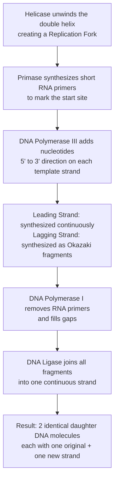
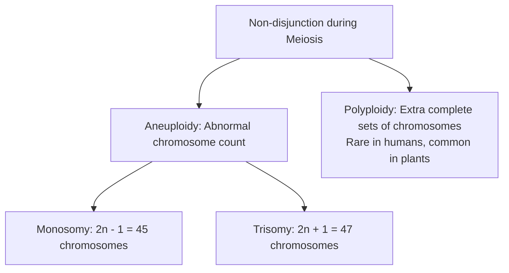
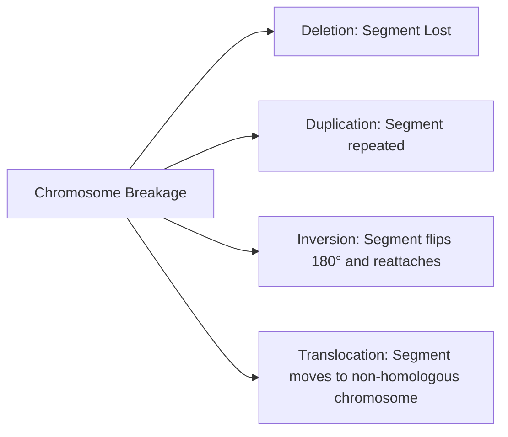

# Chromosomes, DNA, and Chromosomal Aberrations

## Syllabus Mapping
* Paper I, Unit 1.7: The Biological Basis of Life — DNA structure, replication, RNA, protein synthesis.
* Paper I, Unit 9.4: Chromosomes and Chromosomal Aberrations in Man.

---

## 1. Chromosomes: Structure and Function

A chromosome is a thread-like structure made of **DNA (deoxyribonucleic acid)** and associated proteins (primarily histones). During cell division, chromatin condenses into the visible chromosome structure.

### Key Structural Features
* **Centromere:** The constriction point where sister chromatids are joined. It is the attachment site for spindle fibers during cell division.
* **Telomeres:** Repetitive DNA sequences at the ends of chromosomes that protect them (like the plastic tip of a shoelace). They shorten with each cell division (linked to ageing — the Hayflick Limit).
* **Chromatids:** After DNA replication, each chromosome consists of two identical sister chromatids joined at the centromere.

### Human Chromosome Complement (Karyotype)
| Type | Number | Role |
| :--- | :--- | :--- |
| **Autosomes** | 22 pairs (44 chromosomes) | Carry genes governing all bodily traits except sex determination. |
| **Sex Chromosomes (Allosomes)** | 1 pair | Determine biological sex. Female = XX, Male = XY. |
| **Total** | **46 chromosomes (23 pairs)** | Normal human somatic cell count. |

> [!NOTE]
> **🌐 Internet Fact-Check (Source: NIH, Wikipedia, *Hereditas* journal):** The discovery was actually made on **December 22, 1955** by Joe Hin Tjio at the University of Lund, Sweden. The landmark paper was *published* on **January 26, 1956**, in the journal *Hereditas*. So: *Discovery = 1955, Publication = 1956*. The notes in many coaching materials just say "1956" (the publication year), which is technically accurate for the paper.

---

## 2. The Biological Basis of Life: DNA

### A. DNA Structure (Watson-Crick Model, 1953)
DNA is a double helix — two anti-parallel strands of nucleotides wound around each other like a twisted ladder.
* **The Backbone (Sugar-Phosphate):** Each strand consists of alternating deoxyribose sugar and phosphate groups.
* **The Rungs (Nitrogenous Bases — Chargaff's Rules):** The two strands are held together by hydrogen bonds between complementary base pairs:
  * **Adenine (A) ↔ Thymine (T)** (2 hydrogen bonds)
  * **Guanine (G) ↔ Cytosine (C)** (3 hydrogen bonds)

### B. DNA Replication (Semi-Conservative Model)
DNA replication is the process by which a cell makes an identical copy of its DNA before cell division. It occurs during the **S-phase** of the cell cycle.

> [!TIP]
> **Mnemonic for DNA Replication Enzymes:** **H P P L L** (Helicase, Primase, Polymerase III, Polymerase I, Ligase) — "**H**eartily **P**lease **P**rofessors, **L**earn **L**aboratory."

### C. The Central Dogma of Molecular Biology (Francis Crick, 1958)
Information flows in one direction: **DNA → RNA → Protein**. This one-way flow is the foundational principle of molecular biology.

1. **Transcription (in nucleus):** A segment of DNA (a gene) is used as a template to synthesize a complementary messenger RNA (mRNA) strand by RNA Polymerase. The RNA uses **Uracil (U)** instead of Thymine.
2. **Translation (in cytoplasm/ribosome):** The mRNA sequence is read in triplets (codons) at the ribosome. Each codon specifies one amino acid. Transfer RNA (tRNA) molecules bring the correct amino acid to the growing polypeptide chain until a stop codon is reached, releasing the complete protein.

---

## 3. Gene Mutations vs. Chromosomal Aberrations

| Feature | Gene Mutation | Chromosomal Aberration |
| :--- | :--- | :--- |
| **Level** | Nucleotide level (single base pair) | Chromosome level (large-scale structural or numerical) |
| **Scale** | Micro (invisible under microscope) | Macro (visible under microscope via karyotyping) |
| **Cause** | Errors in DNA replication, mutagens (radiation, chemicals) | Errors in meiosis (non-disjunction), chromosome breakage |
| **Example** | Sickle Cell Anaemia (single nucleotide change in HBB gene) | Down Syndrome (extra chromosome 21) |

---

## 4. Chromosomal Aberrations: Numerical Aberrations

Numerical aberrations arise from **non-disjunction** — the failure of chromosomes to separate correctly during meiosis I or meiosis II.

### Major Chromosomal Syndromes: A Comparison Table

| Syndrome | Karyotype | Type | Key Features |
| :--- | :--- | :--- | :--- |
| **Down Syndrome** | 47, +21 (Trisomy 21) | Autosomal Trisomy | Intellectual disability, flat facial profile, epicanthic folds, congenital heart defects. Risk sharply increases with advanced maternal age (>35 years). |
| **Patau Syndrome** | 47, +13 (Trisomy 13) | Autosomal Trisomy | Severe intellectual disability, polydactyly, cleft palate, congenital heart defects. Usually fatal within first year. |
| **Edward Syndrome** | 47, +18 (Trisomy 18) | Autosomal Trisomy | Severe intellectual disability, overlapping fingers, heart defects. 90% die within first year. |
| **Turner Syndrome** | 45, XO | Sex Chromosome Monosomy | Phenotypically female. Short stature, webbed neck, widely spaced nipples, underdeveloped ovaries, **absolute sterility**. |
| **Klinefelter Syndrome** | 47, XXY | Sex Chromosome Trisomy | Phenotypically male. Tall, small testes, gynecomastia (breast development), reduced masculinity, **infertility**. |
| **Super Female (Triple X)** | 47, XXX | Sex Chromosome Trisomy | Phenotypically normal female. Usually fertile. May have slightly lower IQ. Often undetected. |
| **XYY Syndrome (Jacob's)** | 47, XYY | Sex Chromosome Trisomy | Phenotypically normal male. Tall stature, mild behavioral problems. |

> [!TIP]
> **Mnemonic for Autosomal Trisomies:** **D P E** (21, 13, 18) → **"Down Patau Edward"** — D is lowest (21), P is next (13), E is highest (18). Or simply: **D-P-E = Down-Patau-Edwards**.

---

## 5. Chromosomal Aberrations: Structural Aberrations

Structural changes occur when chromosome breaks do not rejoin correctly, generating rearrangements.

| Type | Mechanism | Effect / Example |
| :--- | :--- | :--- |
| **Deletion** | Loss of a chromosomal segment. | *Cri-du-chat Syndrome* (deletion of short arm of Chr 5): Cat-like cry in infants, intellectual disability. |
| **Duplication** | Extra copy of a chromosomal segment present. | Gene dosage imbalance; can cause developmental abnormalities. |
| **Inversion** | A segment breaks out, rotates 180°, and is reinserted. | Gene expression may be disrupted if the break occurs within a gene. |
| **Translocation** | A segment from one chromosome is transferred to a non-homologous chromosome. | *Robertsonian Translocation:* Chr 21 fuses to Chr 14, causing **Familial Down Syndrome** (occurring even in younger mothers; hereditary risk). |

---

## 6. Gene Mutations: Point Mutations

While chromosomal aberrations are large-scale, point mutations (gene mutations) affect individual nucleotides.

| Type | Mechanism | Example |
| :--- | :--- | :--- |
| **Substitution** | One base is replaced by another. | *Sickle Cell Anaemia:* A→T substitution in codon 6 of the HBB gene changes Glutamic Acid to Valine, distorting the red blood cell into a sickle shape. |
| **Insertion** | An extra base is added. | Causes a **frameshift mutation** — the entire reading frame of codons shifts, producing a completely different and usually non-functional protein. |
| **Deletion** | A base is removed. | Also causes a **frameshift mutation**. |

> [!IMPORTANT]
> **Sickle Cell Anaemia & Malaria (UPSC Gold Standard):** The sickle cell allele is found at high frequency in malaria-endemic regions (Sub-Saharan Africa, parts of India). Heterozygotes (carriers) have *increased resistance* to malaria — a classic example of **Heterozygote Advantage / Balancing Selection**. This is why the harmful allele is maintained in the population by natural selection.

---

## 7. Mutagenic Agents (Mutagens)

Mutations are caused by physical, chemical, or biological agents:
1. **Physical Mutagens:**
   * **Ionizing Radiation (X-rays, Gamma rays):** Cause chromosome breakage and base oxidation. First demonstrated by H.J. Muller (1927) in fruit flies (Nobel Prize, 1946).
   * **UV Radiation:** Causes thymine-thymine dimers, blocking DNA replication. Normally repaired by Nucleotide Excision Repair (NER). Failure leads to Xeroderma Pigmentosum.
2. **Chemical Mutagens:**
   * **Base Analogues** (5-Bromouracil): Mimic DNA bases and are incorporated into the strand, causing substitutions.
   * **Alkylating Agents** (Mustard Gas): Add alkyl groups to bases, causing mispairing.
   * **Intercalating Agents** (Acridine Dyes): Insert between base pairs, causing insertions/deletions.
3. **Biological Mutagens:**
   * **Viruses:** Can integrate their DNA into the host genome, disrupting gene function (e.g., HPV causing cervical cancer).
