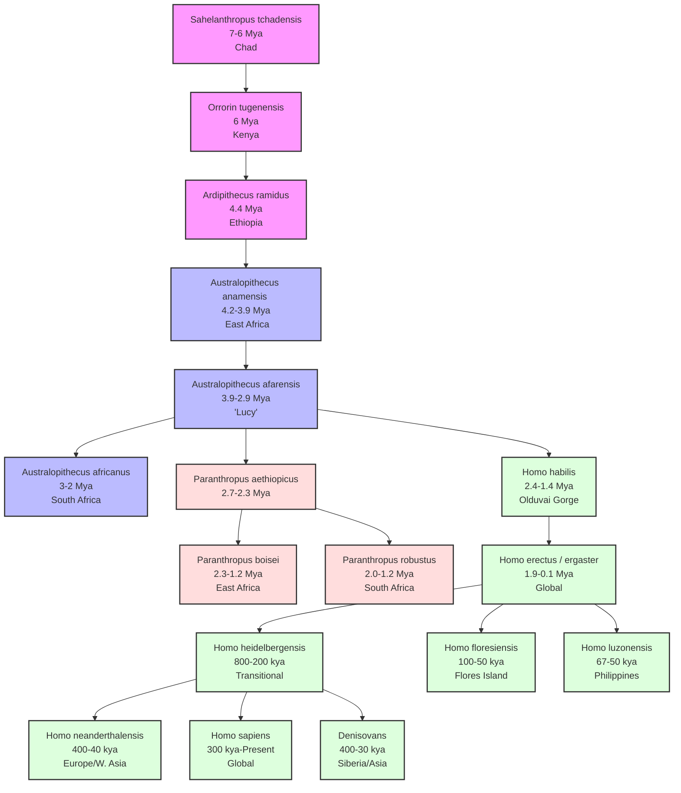

# VALUE ADD: Fossils and Primate Evolution
**Date:** May 30, 2026 | **Target:** Fossils and Primate Evolution
**Syllabus Mapping:** Unit 1.6

# Unit 1.6: Fossils and Primate Evolution (Comprehensive Revision Sheet)

---

## 1. Master Phylogenetic Framework & Timeline

The hominin evolutionary trajectory is characterized by **mosaic evolution**—the phenomenon where different physiological systems (e.g., bipedalism, dentition, encephalization) evolved at different rates.



### Chronological Summary of Hominin Evolution

| Epoch | Age (Mya) | Representative Taxa | Key Evolutionary Milestone |
| :--- | :--- | :--- | :--- |
| **Late Miocene** | 7.0 – 5.3 | *Sahelanthropus*, *Orrorin* | Facultative bipedalism, canine reduction |
| **Pliocene** | 5.3 – 2.5 | *Ardipithecus*, *Australopithecus* | Obligate bipedalism, adaptive radiation |
| **Pleistocene** | 2.5 – 0.01 | *Homo habilis*, *H. erectus*, *H. neanderthalensis* | Encephalization, lithic technology, fire, global migration |
| **Holocene** | 0.01 – Present | *Homo sapiens sapiens* | Sedentism, agriculture, global dominance |

---

## 2. Pre-Australopithecines (The Dawn of Hominization)

The transition from the last common ancestor (LCA) of chimpanzees and humans to the earliest hominins occurred in the late Miocene. These species exhibit a **mosaic morphology**, combining ancestral hominoid (ape-like) traits with derived hominin (human-like) traits.

```
       [ Ape-like Ancestor ]
                │
         Mosaic Transition
         ───────┬───────
                │
     ┌──────────┴──────────┐
     ▼                     ▼
Ancestral Traits      Derived Traits
- Small brain         - Anterior foramen magnum
- U-shaped jaw        - Thick enamel
- Large canines       - Femur neck adaptation
```

### 1. Sahelanthropus tchadensis
* **Discovery:** Michel Brunet (2001) at Toros-Menalla, **Chad** (Central Africa).
* **Fossil Specimen:** "Toumaï" (TM 266-01-60-1).
* **Dating:** Biostratigraphy and cosmogenic nuclide dating ($^{10}\text{Be}/^{9}\text{Be}$) yield **7–6 Mya**.
* **Anatomical Characteristics:**
  * *Ancestral:* Small cranial capacity (**320–380 cc**), massive supraorbital torus (brow ridge), prominent sagittal crest, and U-shaped dental arcade.
  * *Derived:* Anteriorly positioned **foramen magnum** (suggesting upright posture/bipedalism), small canines without a honing complex, and thick dental enamel.
* **Phylogenetic Status:** Debated. Either the earliest known hominin post-chimpanzee split, or an extinct ape lineage close to the LCA.

### 2. Orrorin tugenensis
* **Discovery:** Brigitte Senut and Martin Pickford (2000) in the Tugen Hills, **Kenya**.
* **Fossil Specimen:** "Millennium Man" (BAR 1000'00).
* **Dating:** Argon-Argon ($^{40}\text{Ar}/^{39}\text{Ar}$) dating yields **~6 Mya**.
* **Anatomical Characteristics:**
  * *Postcranial:* The **femur** exhibits a long neck, asymmetric distribution of cortical bone (thicker inferiorly), and an obturator externus groove. These features indicate biomechanical adaptation to **habitual bipedalism**.
  * *Cranial/Dental:* Small, thick-enameled molars; primitive, ape-like pointed canines and humerus with climbing adaptations.
* **Phylogenetic Status:** Positioned as a direct ancestor to *Australopithecus* and *Homo*, bypassing *Ardipithecus* according to its discoverers.

### 3. Ardipithecus ramidus
* **Discovery:** Tim White, Gen Suwa, and Berhane Asfaw (1994) at Aramis, Middle Awash, **Ethiopia**.
* **Fossil Specimen:** "Ardi" (ARA-VP-6/500), a 4.4 Mya partial female skeleton.
* **Dating:** $^{40}\text{Ar}/^{39}\text{Ar}$ dating of volcanic tuffs yields **4.4 Mya**.
* **Anatomical Characteristics:**
  * *Locomotor System:* **Mosaic biped/arboreal climber**. Fully **divergent hallux** (grasping big toe) for climbing, but a rigid midfoot (presence of *os peroneum*) and a short, broad ilium (pelvic blade) that allowed bipedal walking. No evidence of knuckle-walking.
  * *Dentition:* Non-honing canine-third premolar ($C/P_3$) complex. Small, diamond-shaped canines with minimal sexual dimorphism, indicating reduced intra-sexual aggression.
* **Phylogenetic Status:** Confirms that bipedalism evolved in a **woodland environment** (reconstructing the Aramis fauna), refuting the classic "Savanna Hypothesis."

---

## 3. The Australopithecine Radiation (4.2 – 1.0 Mya)

First recognized by **Raymond Dart** in 1924 with the discovery of the *Taung Child* (*Australopithecus africanus*), the Australopithecines represent a highly successful adaptive radiation across East, South, and Central Africa. They are divided into **Gracile** and **Robust** forms.

```
                  [ Australopithecus afarensis ]
                                │
                ┌───────────────┴───────────────┐
                ▼                               ▼
        [ Gracile Lineage ]             [ Robust Lineage ]
        - A. africanus                  - P. aethiopicus
        - Diet: Omnivorous/Generalist   - P. boisei / P. robustus
        - Ancestral to Genus Homo       - Diet: Hard-object specialist
                                        - Evolutionary dead-end
```

### Gracile vs. Robust Australopithecines: Detailed Morphological Comparison

| Morphological Trait | Gracile (*A. afarensis, A. africanus*) | Robust (*Paranthropus boisei, P. robustus*) |
| :--- | :--- | :--- |
| **Temporal Range** | 4.2 – 2.0 Mya | 2.7 – 1.0 Mya |
| **Cranial Capacity** | 400 – 500 cc (Mean: ~440 cc) | 410 – 530 cc (Mean: ~510 cc) |
| **Sagittal Crest** | Absent (or very weak in males) | Pronounced (anchoring massive temporalis muscles) |
| **Zygomatic Arches** | Moderate, positioned behind the face | Flaring, anteriorly positioned (creates a dish-shaped face) |
| **Post-orbital Constriction** | Moderate | Extreme (due to massive chewing muscles) |
| **Dentition** | Moderate molars, larger incisors/canines | **Megadontia**: Huge molars/premolars, tiny incisors |
| **Enamel Thickness** | Thick | Hyper-thick |
| **Dietary Adaptation** | Generalist, frugivorous/omnivorous | Specialist (hard nuts, seeds, fibrous tubers) |
| **Postcranial Skeleton** | Lightly built, bipedal with climbing traits | Robust, heavily muscled, bipedal |

---

### Key Fossil Profiles

#### 1. *Australopithecus afarensis* ("Lucy", AL 288-1)
* **Discovery:** Donald Johanson (1974) at Hadar, **Ethiopia**.
* **Dating:** 3.2 Mya.
* **Anatomical Significance:**
  * **Laetoli Footprints (Tanzania, 3.6 Mya):** Discovered by Mary Leakey. Preserved in volcanic ash, they show a modern bipedal gait with a non-divergent hallux, a well-developed longitudinal arch, and a heel-strike to toe-off stride.
  * **Anatomy:** Cranial capacity of ~400 cc. Sub-nasal prognathism. Postcranial anatomy (pelvis, valgus knee angle) confirms obligate bipedalism, though long, curved phalanges suggest retained arboreal capabilities.

```
  Ape Foot             Laetoli Footprint          Modern Human Foot
   (Grasping)             (Bipedal)                  (Bipedal)
     \  |  /               \  |  /                    \  |  /
    ( ) ( ) ( )           ( ) ( ) ( )                ( ) ( ) ( )
   (           )         (           )              (           )
  (             )       (             )            (             )
  (   /     \   )       (      |      )            (      |      )
 (   /       \   )     (       |       )          (       |       )
(   /         \   )   (        |        )        (        |        )
  *             *         *         *                *         *
  (Divergent Hallux)   (Adducted Hallux)          (Adducted Hallux)
```

#### 2. *Australopithecus africanus* ("Taung Child", "Mrs. Ples")
* **Discovery:** Raymond Dart (1924) at Taung; Robert Broom (1947) at Sterkfontein, **South Africa**.
* **Dating:** 3.0 – 2.0 Mya.
* **Anatomical Significance:**
  * **Taung Child:** A juvenile skull showing a fossilized endocast. Dart identified the anterior position of the foramen magnum and reduced canines, establishing the African origin of hominins (supporting Darwin's hypothesis over the Piltdown hoax).
  * **Anatomy:** Slightly more rounded cranium than *A. afarensis*, less prognathic, cranial capacity ~450 cc.

#### 3. *Paranthropus boisei* ("Nutcracker Man", OH 5)
* **Discovery:** Mary Leakey (1959) at Olduvai Gorge, **Tanzania**.
* **Dating:** 1.75 Mya.
* **Anatomical Significance:**
  * Extreme adaptation for heavy mastication (**hyper-megadontia**).
  * Characterized by a massive sagittal crest, broad flaring zygomatics, and premolars that are molarized.
  * **C. Richard Leakey** and **Louis Leakey** argued this was an evolutionary dead-end due to overspecialization in a drying, savanna environment.

---

## 4. Genus Homo: Transition & Expansion

```
[ Australopithecus ] ──(Encephalization & Tool Use)──> [ Homo habilis ] ──(Global Migration & Fire)──> [ Homo erectus ]
```

### 1. Homo habilis ("Handy Man")
* **Discovery:** Louis and Mary Leakey (1960) at Olduvai Gorge, **Tanzania** (Specimen: OH 7).
* **Dating:** 2.4 – 1.4 Mya.
* **Anatomical Characteristics:**
  * Cranial capacity: **510–700 cc** (significant jump in encephalization).
  * Reduced supraorbital torus, moderate prognathism, and a parabolic dental arcade.
  * Hand bones show a modern precision grip, though phalanges retain slight curvature.
* **Taxonomic Debate:** Some scholars (e.g., Bernard Wood) argue *H. habilis* is too primitive and should be classified as *Australopithecus habilis*. Others split the taxon into *Homo habilis* (smaller, gracile) and *Homo rudolfensis* (larger brain ~775 cc, flat face, e.g., KNM-ER 1470).
* **Culture (Oldowan Tradition):**
  * First definitive toolmakers.
  * **Technology:** Mode 1 technology. Simple pebble tools, core choppers, and sharp flakes produced via direct percussion.
  * **Subsistence:** Primarily **scavenging** (extensively documented by Pat Shipman through cut-mark analysis on bones, showing carnivore tooth marks overlaid by stone tool cut marks).

---

### 2. Homo erectus (The First Globalizer)
* **Dating:** 1.9 Mya – 110,000 years ago.
* **Geographical Distribution:** 
  * **Africa:** *Homo ergaster* (often called African *H. erectus*, e.g., KNM-WT 15000 "Turkana Boy" from Nariokotome, Kenya).
  * **Asia:** *Homo erectus sensu stricto* (Java Man discovered by Eugene Dubois at Trinil; Peking Man discovered by Davidson Black at Zhoukoudian, China).
  * **Europe:** Dmanisi fossils (Georgia) dated to 1.8 Mya, showing transitional traits.

```
                                [ Homo erectus ]
                                       │
                ┌──────────────────────┼──────────────────────┐
                ▼                      ▼                      ▼
         [ African Variant ]    [ Asian Variant ]      [ European Variant ]
          - H. ergaster          - H. erectus s.s.      - Dmanisi Fossils
          - Gracile, tall        - Robust, thick skull  - Small brain (600cc)
          - KNM-WT 15000         - Peking / Java Man    - Early migration
```

#### Anatomical Characteristics
* **Cranial Capacity:** **750–1250 cc** (mean ~900 cc).
* **Cranial Features:** Long, low cranial vault (platycephaly), thick cranial bones, prominent **supraorbital torus** (continuous brow ridge), **sagittal keel**, and an angular **occipital torus**.
* **Postcranial Anatomy:** Fully modern body proportions. Tall, slender build adapted for tropical thermoregulation (Bergmann's and Allen's rules). Obligate terrestrial striding bipedalism.
* **Turkana Boy (KNM-WT 15000):** An almost complete skeleton of an 8-to-11-year-old male, showing a modern stature (~5'3" at death, projected to 6'0" as an adult) and narrow pelvis.

#### Cultural Milestones
* **Acheulian Tool Tradition (Mode 2):**
  * Characterized by bifacial, symmetrical tools: **handaxes**, **cleavers**, and **picks**.
  * Manufactured using the soft-hammer technique (wood/bone) for flatter, sharper edges.
  * **The Movius Line:** A geographic boundary dividing the Acheulian handaxe tradition (Africa, Europe, Western Asia) from the Chopper-Chopping tool tradition (East and Southeast Asia). This boundary is debated; some suggest East Asian hominins used bamboo tools instead of stone handaxes.

```
       [ Acheulian Handaxe ]                  [ Chopper-Chopping Tool ]
             (Mode 2)                                 (Mode 1)
              /\                                       _______
             /  \                                     /       \
            /    \                                   /  /\_/\  \
           /      \                                 |  |     |  |
          |  (O)   |                                |  |_____|  |
          |        |                                 \_________/
         /__________\                               (Unifacial Flaking)
     (Bifacial Symmetry)
```

* **Control of Fire:** Evidence at **Zhoukoudian (China)** and **Gesher Benot Ya'aqov (Israel)**. Fire provided warmth, protection from predators, social focus, and cooking (which gelatinized starch and denatured protein, driving rapid encephalization).
* **Shelter:** Evidence of post-holes and hearths at **Terra Amata** (France), indicating seasonal, structured campsites.

---

## 5. Archaic Homo & Neanderthals

### 1. Homo heidelbergensis (Transitional Forms)
* **Temporal Range:** 800,000 – 200,000 years ago.
* **Geographical Distribution:** Africa (Bodo, Kabwe), Europe (Mauer, Petralona, Sima de los Huesos), and Asia (Dali, Maba).
* **Anatomical Characteristics:**
  * Cranial capacity: **1100–1400 cc** (overlapping modern humans).
  * Retained thick cranial walls and large brow ridges, but developed a more rounded occipital region and reduced prognathism.
* **Phylogenetic Status:** The last common ancestor of *Homo sapiens* (via African *H. heidelbergensis* / *H. rhodesiensis*) and *Homo neanderthalensis* (via European *H. heidelbergensis*).
* **Sima de los Huesos ("Pit of Bones", Atapuerca, Spain):** Over 5,500 hominin bones representing at least 28 individuals. They show early Neanderthal-like facial traits, suggesting a deep evolutionary split in Europe.

---

### 2. Neanderthal Man (*Homo neanderthalensis*)
* **Temporal Range:** 400,000 – 40,000 years ago.
* **Geographical Distribution:** Europe, Middle East, and Western Asia (Siberia). No Neanderthal fossils have been found in Africa.

```
                              [ Homo heidelbergensis ]
                                         │
                    ┌────────────────────┴────────────────────┐
                    ▼                                         ▼
         [ European Lineage ]                      [ African Lineage ]
                 │                                         │
      [ Homo neanderthalensis ]                    [ Homo sapiens ]
      - Cold-adapted (Stocky)                      - Gracile, chin present
      - Mousterian Culture                         - Upper Paleolithic Culture
```

#### Classic vs. Progressive Neanderthals

* **Classic Neanderthals (Western Europe, e.g., La Chapelle-aux-Saints, Neander Valley):** Lived during the Würm glaciation. They exhibit extreme cold-adapted morphology.
* **Progressive/Archaic Neanderthals (Middle East, e.g., Tabun, Skhul, Shanidar):** More gracile, with less pronounced specialized features, overlapping morphologically with early modern humans.

#### Anatomical Characteristics (Cold Adaptation)
* **Cranial Capacity:** **1300–1750 cc** (Mean: ~1520 cc, larger than modern *H. sapiens*).
* **Cranial Features:** Long, low, football-shaped skull; **occipital bun**; retreating forehead; large, rounded orbits; **mid-facial prognathism**; and a large, broad nasal aperture (to warm and humidify cold air).
* **Mandible:** Lacks a mental eminence (chin); presence of a **retromolar space** behind the third molar.
* **Postcranial Anatomy:** Short, stocky, barrel-chested, and heavily muscled. Distal limb segments (tibia/radius) are shortened relative to proximal segments (femur/humerus). This minimized surface area to conserve core body heat (Bergmann's and Allen's Rules).

```
   Neanderthal Skull                         Modern Human Skull
     (Long & Low)                             (High & Rounded)
       _______                                    _______
     /         \___                             /         \
    /  (O)  (O)    \                           /  (O)  (O)  \
   |    \    /      |                         |    \    /    |
   |     \__/       |                         |     \__/     |
   |   [====]       |                         |    [====]    |
   \___/    \______/                          \____/    \___/
   (Occipital Bun, No Chin)                   (No Bun, Prominent Chin)
```

#### Cultural Complexity
* **Mousterian Tool Tradition (Mode 3):**
  * Characterized by the **Levallois Technique** (prepared-core technology). The toolmaker shapes a core to control the size and shape of the final flake, producing specialized scrapers, points, and knives.
* **Social Behavior & Compassion:**
  * **La Chapelle-aux-Saints ("The Old Man"):** An elderly individual with severe arthritis and tooth loss who survived for years, proving social support and food sharing.
  * **Shanidar Cave (Iraq):** Shanidar 1 ("Nandy") survived major trauma (blindness in one eye, amputated arm) due to group care. Shanidar 4 (the "Flower Burial") contained pollen clumps around the skeleton, suggesting intentional burial with medicinal flowers (though this is debated).
* **Language:** Presence of the **hyoid bone** (Kebara Cave, Israel) identical to modern humans, and the **FOXP2 gene** (extracted from Neanderthal DNA), indicating the physiological capacity for speech.
* **Extinction Theories:**
  * *Competitive Exclusion:* Outcompeted by *Homo sapiens* with superior Upper Paleolithic technology.
  * *Climatic Instability:* Rapid oscillations of the Pleistocene climate disrupted their forest-hunting niches.
  * *Assimilation:* Absorbed into the larger migrating *Homo sapiens* gene pool.

---

## 6. Anatomically Modern Homo sapiens (AMHS)

Anatomically modern humans are characterized by a gracile skeleton, a high vertical forehead, a rounded cranium, a small face tucked under the braincase, and a prominent **mental eminence (chin)**.

```
[ Omo Kibish / Herto ] ──(Out of Africa Migration)──> [ Cro-Magnon / Grimaldi / Chancelade ]
```

### Key Fossil Finds

#### 1. Cro-Magnon (Dordogne, France)
* **Discovery:** Louis Lartet (1868).
* **Dating:** ~30,000 years ago.
* **Anatomy:** High, vertical forehead, broad face, narrow nose, large cranial capacity (~1600 cc), and a prominent chin. Associated with the Aurignacian culture.

#### 2. Grimaldi (Menton, Italy)
* **Discovery:** 1901 in the Grotte des Enfants.
* **Anatomy:** Two skeletons (an adult female and a young male) buried together. Early researchers (e.g., René Verneau) erroneously classified them as "negroid" due to alveolar prognathism and long lower limbs. Modern analysis places them firmly within the range of Upper Paleolithic European variation, showing no specific affinity to modern African populations.

#### 3. Chancelade (Dordogne, France)
* **Discovery:** 1888.
* **Anatomy:** A single short-statured male skeleton (~1.5 m) with a high, narrow cranium and a broad face. Early anthropologists (e.g., Leo Testut) claimed it was "Eskimoid" (ancestral to Inuit). It is now recognized as a cold-adapted Upper Paleolithic European variant associated with the Magdalenian culture.

---

### Theories of Modern Human Origins: Comparative Analysis

| Feature | Out of Africa (Replacement) | Multiregional Continuity | Assimilation Model (Consensus) |
| :--- | :--- | :--- | :--- |
| **Primary Proponents** | Chris Stringer, Allan Wilson | Milford Wolpoff, Alan Thorne | Fred Smith, Erik Trinkaus, Svante Pääbo |
| **Core Hypothesis** | AMHS evolved *only* in Africa (~200kya) and replaced all Eurasian archaics without interbreeding. | *H. erectus* migrated from Africa and evolved into AMHS globally, maintained by continuous gene flow. | AMHS evolved in Africa, migrated outwards, and interbred with local archaic populations (Neanderthals/Denisovans). |
| **Fossil Evidence** | Earliest AMHS fossils are African (Omo Kibish at 195kya, Jebel Irhoud at 300kya). | Transitional fossils found in multiple regions (e.g., Dali in China, Maba). | Mosaic fossils showing mixed traits (e.g., Lagar Velho child in Portugal, Oase 1 jaw in Romania). |
| **Genetic Evidence** | High genetic diversity in Africa; low mtDNA divergence ("Mitochondrial Eve" ~200kya). | Deep regional genetic lineages dating back 1-2 million years. | **Paleogenomics:** 1–4% Neanderthal DNA in non-Africans; 4–6% Denisovan DNA in Melanesians. |

```
   Out of Africa Model                    Assimilation Model
      (Replacement)                         (Admixture)
   
   Africa   Europe   Asia               Africa   Europe   Asia
     |        |        |                  |        |        |
   H.sap    Neand   Erectus             H.sap    Neand   Erectus
     \        |        |                  \      / \     /
      \_______|________|                   \____/___\___/
              |                                 |
        (Replacement)                     (Interbreeding)
```

---

## 7. Recent Paradigm-Shifting Discoveries

Recent discoveries have transformed our understanding of human evolution, showing that the Late Pleistocene was home to a diverse array of co-existing hominin species.

```
                     Late Pleistocene Hominin Diversity
                               (50,000 ya)
                                    │
         ┌──────────────┬───────────┴───────────┬──────────────┐
         ▼              ▼                       ▼              ▼
    Homo sapiens   Denisovans             H. floresiensis  H. luzonensis
    (Global)       (Siberia/Asia)         (Flores Island)  (Philippines)
```

### 1. Homo floresiensis ("The Hobbit")
* **Discovery:** Peter Brown and Thomas Sutikna (2003) at Liang Bua Cave, **Flores Island, Indonesia**.
* **Dating:** 100,000 – 50,000 years ago.
* **Anatomical Characteristics:**
  * Extremely small stature (~1.06 m / 3.5 feet) and cranial capacity (**~417 cc**, comparable to a chimpanzee).
  * Lacks a chin, has large flat feet, and displays a primitive wrist structure.
* **Evolutionary Mechanism:** **Insular Dwarfism**. On small islands with limited resources and few predators, large-bodied species often shrink over generations to reduce metabolic demands.
* **Phylogenetic Status:** Likely descended from an early migration of *Homo erectus* (or an even earlier hominin) that became isolated on Flores.

### 2. Denisovans
* **Discovery:** Johannes Krause and Svante Pääbo (2010) at Denisova Cave, Altai Mountains, **Siberia**.
* **Dating:** 280,000 – 30,000 years ago.
* **Identification:** Identified via **ancient DNA (aDNA)** sequencing from a juvenile finger bone (Denisova 3).
* **Anatomical Evidence:** Extremely scarce. A massive mandible found on the Tibetan Plateau (Xiahe mandible) confirmed their presence in high-altitude environments.
* **Genetic Legacy:**
  * **EPAS1 Gene:** Modern Tibetans carry a Denisovan-derived allele of the *EPAS1* gene, which regulates red blood cell production to prevent hypoxia at high altitudes.
  * **Melanesian Admixture:** Indigenous populations of Papua New Guinea, Australia, and the Philippines carry **3–6% Denisovan DNA**.

### 3. Homo naledi
* **Discovery:** Lee Berger (2013) in the Dinaledi Chamber of the Rising Star Cave System, **South Africa**.
* **Dating:** 335,000 – 236,000 years ago.
* **Anatomical Characteristics:**
  * A mosaic of primitive and derived traits.
  * Cranial capacity: **465–610 cc** (Australopithecine-like).
  * Hands and feet are highly modern, adapted for tool use and bipedal walking, but the shoulders and curved fingers are adapted for climbing.
* **Behavioral Debate:** The discoverers argue that *H. naledi* deliberately deposited their dead in the deep, dark cave system. This is highly controversial, as it implies complex symbolic behavior in a small-brained hominin.

### 4. Homo luzonensis
* **Discovery:** Florent Détroit and Armand Salvador Mijares (2019) at Callao Cave, **Luzon, Philippines**.
* **Dating:** 67,000 – 50,000 years ago.
* **Anatomy:** Small-bodied hominin showing a mosaic of modern-like teeth and primitive, curved phalanges resembling *Australopithecus*. Like *H. floresiensis*, it represents an isolated island lineage that underwent endemic evolutionary changes.

---

## 8. Upper Paleolithic Cultural Sequence

The arrival of modern *Homo sapiens* in Europe coincided with the **Upper Paleolithic Revolution** (Mode 4 technology), characterized by rapid technological innovation, bone/antler tools, and symbolic art.

```
[ Chatelperronian ] ──> [ Aurignacian ] ──> [ Gravettian ] ──> [ Solutrean ] ──> [ Magdalenian ]
```

### Chronological Cultural Sequence (Western Europe)

```
  1. Chatelperronian (~45-40 kya)  -->  Transition (Neanderthal association)
  2. Aurignacian (~43-35 kya)      -->  Earliest AMHS, Split-base bone points
  3. Gravettian (~33-21 kya)       -->  Venus Figurines, Gravette points
  4. Solutrean (~22-17 kya)        -->  Laurel-leaf points, Pressure flaking
  5. Magdalenian (~17-12 kya)      -->  Zenith of Cave Art, Harpoons, Atlatl
```

#### 1. Chatelperronian (45,000 – 40,000 ya)
* **Significance:** A transitional industry. It represents Neanderthals adopting Upper Paleolithic blade techniques from arriving *H. sapiens*.
* **Key Tool:** Chatelperronian backed knives.

#### 2. Aurignacian (43,000 – 35,000 ya)
* **Significance:** The first culture associated with anatomically modern *Homo sapiens* in Europe.
* **Key Tools:** **Blade technology** (long, parallel-sided flakes struck from a prepared core using a punch technique), split-base bone points.
* **Art:** Earliest cave paintings (Chauvet Cave, France) and animal figurines (Hohle Fels, Germany).

#### 3. Gravettian (33,000 – 21,000 ya)
* **Significance:** Known for its widespread artistic expression and semi-sedentary mammoth-hunter campsites.
* **Key Tools:** Gravette points (small, backed blades), tanged points.
* **Art:** **Venus Figurines** (portable, carved limestone/ivory sculptures depicting stylized female forms with exaggerated sexual characteristics, likely symbolizing fertility or social networks).

#### 4. Solutrean (22,000 – 17,000 ya)
* **Significance:** The peak of lithic craftsmanship.
* **Key Tools:** **Laurel-leaf points**. These thin, symmetrical bifaces were manufactured using **pressure flaking** (pressing a bone/antler tool against the edge to remove tiny, precise flakes).
* **Innovation:** Invention of the eyed bone needle, indicating tailored clothing for the Last Glacial Maximum.

#### 5. Magdalenian (17,000 – 12,000 ya)
* **Significance:** The final phase of the Upper Paleolithic, showing advanced bone and antler technology.
* **Key Tools:** Barbed harpoons, **Atlatl (spear-thrower)** (which increased leverage and throwing distance), and microliths.
* **Art:** The zenith of cave art (Lascaux in France, Altamira in Spain), featuring polychrome paintings of Pleistocene megafauna.

---

## 9. Thinkers, Anthropologists & Key Debates Directory

| Scholar | Key Contribution / Theory | Anthropological Significance |
| :--- | :--- | :--- |
| **Charles Darwin** | *The Descent of Man* (1871) | Predicted that humans evolved in Africa due to our anatomical similarities with African apes. |
| **Raymond Dart** | Discovered *Taung Child* (1924) | Established the genus *Australopithecus*; proposed the **Osteodontokeratic Culture** (bone-tooth-horn tools used by killer apes, later refuted by C.K. Brain's taphonomic studies). |
| **Louis & Mary Leakey** | Decades of work at Olduvai Gorge | Discovered *Zinjanthropus* (*P. boisei*), *Homo habilis*, and the Laetoli footprints, proving the deep antiquity of hominins in Africa. |
| **Donald Johanson** | Discovered "Lucy" (*A. afarensis*, 1974) | Proved that bipedalism evolved long before brain expansion (encephalization). |
| **Milford Wolpoff** | **Multiregional Evolution Model** | Argued that gene flow prevented speciation, allowing *H. erectus* to evolve into *H. sapiens* globally. |
| **Chris Stringer** | **Out of Africa (Replacement) Model** | Used fossil and genetic data to argue that modern humans replaced all Eurasian archaics without interbreeding. |
| **Svante Pääbo** | Paleogenomics & Neanderthal Genome Project | Sequenced Neanderthal and Denisovan DNA, proving ancient hybridization and earning the **2022 Nobel Prize**. |
| **C.K. Brain** | Taphonomic studies at Swartkrans | Refuted Dart's "killer ape" theory; proved that Australopithecines were the *prey* of leopards and hyenas, not the hunters. |

---

## 10. UPSC Mains Model Answers & High-Scoring Blueprints

### PYQ 1: "Europeans are closer to Neanderthals." Critically discuss this statement in light of the African origin of humankind. [2019, 15 Marks]

#### 1. Introduction
* Define the statement's context: It refers to the discovery of **1–4% Neanderthal genomic admixture** in modern non-African populations (including Europeans).
* State the thesis: This genetic closeness does not contradict the **Recent African Origin (RAO)** model. Instead, it refines it into the **Assimilation Model**, confirming that while our primary evolutionary origin is African, minor regional hybridization occurred during migrations.

#### 2. The African Origin Foundation (The Core Genome)
* Present fossil evidence: The earliest anatomically modern *Homo sapiens* (AMHS) are found in Africa (e.g., Jebel Irhoud, Morocco at ~300 kya; Omo Kibish, Ethiopia at ~195 kya).
* Present genetic evidence: **Mitochondrial DNA (mtDNA)** studies by Cann, Stoneking, and Wilson (1987) show that all modern humans share a common maternal ancestor ("Mitochondrial Eve") who lived in Africa ~200,000 years ago. Africa exhibits the highest genetic diversity, pointing to it as the ancestral home.

#### 3. The Introgression Event (Explaining the "Closeness")
* **The Migration Route:** Around 60,000–50,000 years ago, a subset of AMHS migrated out of Africa via the Bab-el-Mandeb strait or the Sinai Peninsula.
* **The Admixture:** In the Middle East and Eurasia, these migrating populations encountered indigenous Neanderthals (*Homo neanderthalensis*).
* **Paleogenomics (Svante Pääbo, 2010):** DNA sequencing of the Neanderthal genome revealed that non-Africans share 1–4% of their nuclear DNA with Neanderthals. Sub-Saharan African populations show ~0% Neanderthal DNA because their ancestors never left Africa to encounter Neanderthals.

```
                  [ Ancestral African AMHS ]
                              │
             ┌────────────────┴────────────────┐
             ▼                                 ▼
    [ Remained in Africa ]            [ Migrated to Eurasia ]
             │                                 │
             │                         Admixture with Neanderthals
             │                                 │
             ▼                                 ▼
     (0% Neanderthal DNA)             (1-4% Neanderthal DNA)
```

#### 4. Evolutionary Significance of Neanderthal DNA (Adaptive Introgression)
* Neanderthal genes provided adaptive advantages to migrating humans entering cold, low-UV environments:
  * **Keratin production genes (KRT140):** Helped adapt skin and hair to colder climates.
  * **HLA (Human Leukocyte Antigen) genes:** Boosted immune responses against novel Eurasian pathogens.

#### 5. Conclusion
* Conclude that Europeans are not "closer" to Neanderthals in a fundamental evolutionary sense. All modern humans share >95% of their evolutionary history in Africa. The 1–4% Neanderthal DNA represents a minor genetic admixture, confirming the **Assimilation Model** of human origins.

---

### PYQ 2: Compare the anatomical features of Gracile and Robust Australopithecines. Discuss their phylogenetic status. [2021, 20 Marks]

#### 1. Introduction
* Define Australopithecines: Plio-Pleistocene hominins (4.2–1.0 Mya) characterized by bipedal locomotion, small brains, and megadont dentition.
* Introduce the two forms: **Gracile** (generalist omnivores, genus *Australopithecus*) and **Robust** (specialized hard-object feeders, genus *Paranthropus*).

#### 2. Comparative Anatomical Matrix
* Draw a clear, comparative table contrasting key features:
  * Cranial capacity (Gracile: ~440 cc vs. Robust: ~510 cc).
  * Sagittal crest (Gracile: Absent vs. Robust: Present in males).
  * Zygomatic arches (Gracile: Moderate vs. Robust: Flaring, anteriorly placed).
  * Dentition (Gracile: Moderate post-canine dentition vs. Robust: Extreme megadontia, "Nutcracker" molars).
  * Facial profile (Gracile: Prognathic vs. Robust: Dish-faced).

#### 3. Biomechanical Explanation of Robust Features
* Explain the masticatory apparatus: The robust morphology is a functional adaptation for chewing tough, fibrous, hard-object diets (e.g., USO - Underground Storage Organs, nuts, seeds) in a drying, savanna environment.
* **Temporalis Muscle:** Anchored to the sagittal crest and passed through the wide zygomatic arches to power the massive mandible.

```
      Robust Skull Mechanics                 Gracile Skull Mechanics
         (Sagittal Crest)                       (No Sagittal Crest)
             _/\_                                      ____
            /    \                                   /      \
      ====||  ()  ||====                       ====||  ()  ||====
            \____/                                   \____/
         (Dish-faced)                             (Prognathic)
```

#### 4. Phylogenetic Status & Evolutionary Relationships
* Present the two main phylogenetic hypotheses:

##### Hypothesis A: Monophyletic Robust Clade
* *A. afarensis* is the common ancestor.
* Gracile (*A. africanus*) and Robust (*Paranthropus*) split into two distinct, independent branches.
* *Paranthropus* is a monophyletic group that went extinct without leaving descendants.

```
                  [ A. afarensis ]
                         │
         ┌───────────────┴───────────────┐
         ▼                               ▼
   [ A. africanus ]               [ P. aethiopicus ]
         │                               │
         ▼                               ├────────────────┐
   [ Genus Homo ]                        ▼                ▼
                                    [ P. boisei ]   [ P. robustus ]
                                         (Extinct Dead-End)
```

##### Hypothesis B: Paraphyletic Robust Clade
* Robust forms evolved independently in East Africa (*P. boisei* from *A. afarensis*) and South Africa (*P. robustus* from *A. africanus*) due to parallel evolution.

#### 5. Conclusion
* Conclude that while the Robust lineage represents an evolutionary dead-end due to overspecialization, the Gracile lineage (specifically *A. afarensis* or *A. garhi*) retained the dietary flexibility and generalized anatomy that allowed them to transition into the genus *Homo*.

---

### PYQ 3: Explain the culture and phylogenetic status of Neanderthals. [2018, 15 Marks]

#### 1. Introduction
* Define Neanderthals: A Pleistocene hominin species (*Homo neanderthalensis*) that lived in Europe and Western Asia from ~400,000 to 40,000 years ago.
* Highlight their significance: They represent our closest extinct evolutionary relatives, characterized by cold-adapted anatomy and complex cultural behaviors.

#### 2. Cultural Traditions of Neanderthals
* **Lithic Technology (Mousterian Tradition):**
  * Describe the **Levallois Technique**: A prepared-core method where the core is shaped to produce a flake of a predetermined size and shape.
  * Specialized toolkits: Side scrapers (for preparing hides), denticulate tools, and triangular points (for hafting onto wooden spears).
* **Subsistence & Hunting:**
  * Apex predators: Stable isotope analysis shows a diet rich in large terrestrial herbivores (mammoths, woolly rhinos, bison).
  * Close-range hunting: Skeletal trauma patterns match those of modern rodeo riders, indicating they hunted large game at close quarters using thrusting spears.
* **Symbolic Behavior & Compassion:**
  * **Burials:** Intentional burials (e.g., La Chapelle-aux-Saints, Kebara, Shanidar) with grave goods, suggesting a belief in an afterlife or ritualized mourning.
  * **Altruism:** Care for injured and elderly individuals (e.g., Shanidar 1, who survived severe trauma with group support).
  * **Art:** Recent discoveries of red ochre stencils in Spanish caves (e.g., Maltravieso) suggest Neanderthals created cave art before the arrival of *Homo sapiens*.

```
                       [ Levallois Technique ]
  
     Step 1: Core Prep      Step 2: Flaking Margin    Step 3: Final Strike
         _________                _________                _________
        /         \              /  _   _  \              /    |    \
       |           |   ───>     |  / \ / \  |   ───>     |    ( )    |
        \_________/              \_________/              \_________/
     (Raw Cobble)             (Facetted Edge)          (Flake Released)
```

#### 3. Phylogenetic Status
* Discuss the historical and modern views on their place in the human family tree:

##### View 1: Separate Species (*Homo neanderthalensis*)
* Supported by the **Out of Africa** model.
* Argues that Neanderthals were an evolutionary branch that went extinct without contributing to the modern human gene pool, outcompeted by migrating *Homo sapiens*.

##### View 2: Subspecies of Homo sapiens (*Homo sapiens neanderthalensis*)
* Supported by the **Multiregional** model.
* Argues they were a regional variant of modern humans that integrated into the global population through gene flow.

##### View 3: The Assimilation Model (Modern Consensus)
* Backed by paleogenomics (Svante Pääbo).
* Neanderthals are classified as a sister group to modern humans. They split from a common ancestor (*Homo heidelbergensis*) ~600,000 years ago.
* They did not simply go extinct; they were genetically assimilated. Non-African modern humans carry **1–4% Neanderthal DNA**, proving they successfully interbred.

#### 4. Conclusion
* Conclude that Neanderthals were a highly intelligent, culturally complex species adapted to ice-age Europe. Their phylogenetic status is best understood as a sister lineage that contributed to the modern human gene pool, challenging the traditional view of them as primitive evolutionary failures.