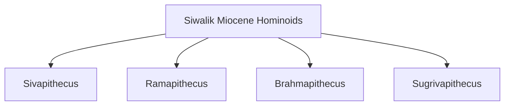
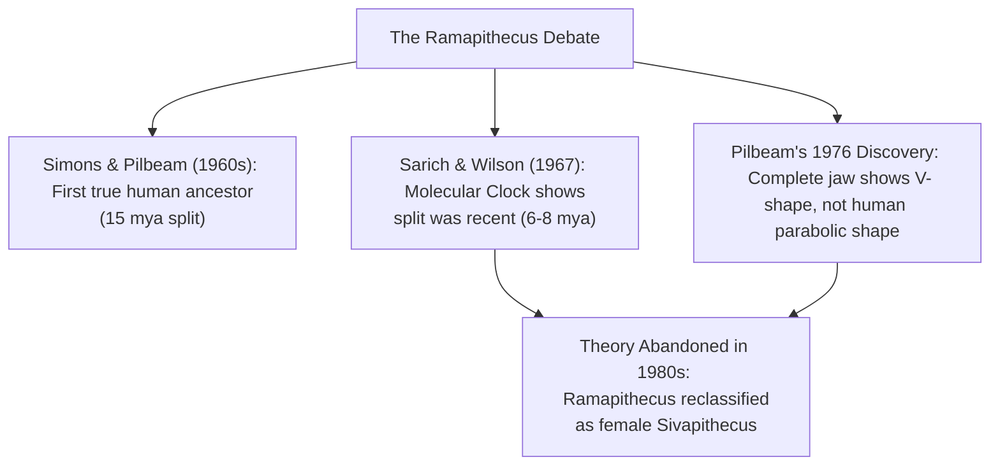

# PAPER II — UNIT 1.2 & 1.3: PALAEO-ANTHROPOLOGY & ETHNO-ARCHAEOLOGY IN INDIA

---

## TOPIC 1: PALAEO-ANTHROPOLOGICAL EVIDENCES FROM INDIA (UNIT 1.2)

> [!NOTE]
> **Syllabus Mapping:** 
> * Paper II, Unit 1.2: Palaeo-anthropological evidences from India with special reference to Siwaliks and Narmada basin (Ramapithecus, Sivapithecus and Narmada Man).
> * Connects with: Paper I, Unit 1.4 (Human Evolution), Unit 1.6 (Fossil Hominids).

---

### I. THE MIOCENE APES OF THE SIWALIKS ("THE GOD-APES")

The Siwalik Hills, bordering the Himalayas, have yielded a rich assemblage of Miocene hominoid fossils dating from **15 to 7.5 million years ago (mya)**. Early researchers assigned these fossils fanciful names from Hindu mythology, collectively known as the "God-Apes of the Siwaliks."

---

### 1. SIVAPITHECUS
* **Discovery:** First incomplete specimens discovered in northern India in the late 19th century. Extensive remains were later recovered from the Pothohar Plateau (Pakistan) by David Pilbeam and others.
* **Geographical Distribution:** Asia (India, Pakistan, Nepal, Turkey, China).
* **Anatomical Features:**
  * **Size:** Small-to-medium-sized ape (70–150 lbs), similar in body length to a modern chimpanzee.
  * **Cranial/Facial:** Concave face profile, narrowly set eyes, large zygomatic bones (cheekbones), smooth nasal floor, and enlarged central incisors. **These cranial traits share a direct homologous link with the modern Orangutan (*Pongo*).**
  * **Dentition:** Large canine teeth, heavy molars with flat wear and thick enamel, indicating a diet of relatively tough food (seeds, savannah grasses, and hard-shelled nuts).
  * **Locomotion:** Wrists and limb proportions suggest it was an arboreal quadruped that spent significant time on the ground (lacking the specialized suspension/brachiating features of modern orangutans).
* **Phylogenetic Position:** Modern consensus is that **Sivapithecus is the direct ancestor of the modern Orangutan** (*Pongo*), having diverged from the African ape-human lineage ~13 mya.

---

### 2. RAMAPITHECUS
* **Discovery:** First discovered by **G. Edward Lewis in 1932** in the Haritalyangar region of the Siwalik Hills (Himachal Pradesh, India). The fossil included an upper jaw fragment, which he named *Ramapithecus brevirostris* (Latin for "short-snouted").
* **The "Hominid" Theory (Simons & Pilbeam, 1960s):**
  * Elwyn Simons (1964) and David Pilbeam advanced the theory that *Ramapithecus punjabicus* was the **first true hominid** (ancestor of humans, after the split from apes at ~15 mya).
  * **Their Arguments:** They highlighted apparent hominid features: a short, V-shaped jaw, reduced canine size, lack of diastema (canine gap), thick molar enamel, and placement of chewing muscles indicating upright posture and heavy seed-chewing in open grasslands (Miocene cooling).

* **The Molecular Challenge (Sarich & Wilson, 1967):**
  * UC Berkeley biochemists Vincent Sarich and Allan Wilson used the **molecular clock** (comparing blood albumin proteins) to argue that the ape-human split occurred much later (~5–6 mya), meaning Ramapithecus (~14 mya) was too old to be a human ancestor.
* **The Resolution (1976–1980s):**
  * In 1976, David Pilbeam discovered a complete jaw of Ramapithecus in Pakistan. It was V-shaped and did not match the parabolic jaw of the human lineage.
  * **Modern Verdict:** The hominid theory of Ramapithecus was completely abandoned in the 1980s. Ramapithecus is now recognized as **the female form of the highly sexually dimorphic Sivapithecus genus**, ancestral to the Orangutan.

---

### II. NARMADA MAN (THE ONLY INDIAN HOMINID FOSSIL)

* **Discovery:** Discovered by geologist **Arun Sonakia on December 5, 1982**, at **Hathnora**, on the bank of the Narmada River in Madhya Pradesh, India.
* **Fossil Material:** A partially preserved, highly mineralized skull cap (calvaria) of a young adult female, found associated with Late Acheulian (Middle Pleistocene) handaxes and cleavers.
* **Anatomical Features:**
  * **Cranial Capacity:** Estimated at **1155–1421 cc**, significantly larger than typical *Homo erectus*.
  * **Vault:** Thick cranial bones, prominent brow ridges (supraorbital tori), and a sagittal ridge.
* **Taxonomic Status:**
  * *Original Classification:* Sonakia classified it as *Homo erectus narmadensis*.
  * *Modern Classification:* Kenneth Kennedy and other physical anthropologists reclassified it as **Archaic *Homo sapiens*** or ***Homo heidelbergensis*** due to its large brain size and advanced cranial features.
* **Significance:** It bridges the evolutionary gap between *Homo erectus* and modern *Homo sapiens* in South Asia, proving the continuous presence of archaic humans in the Indian subcontinent since the Middle Pleistocene (~250,000 years ago).

#### A. Value Addition: Recent Fossil & Archaeological Discoveries (UPSC Mains)
To refute the older "black hole" or "void" theory of Indian human evolution, cite these recent discoveries which suggest India was an active evolutionary "crossroads":
* **Netankheri Finds (Narmada Valley):** Recent explorations by A.R. Sankhyan yielded a partial femur (robust hominin) and humerus (short, stocky early modern *H. sapiens*), suggesting a "tree-like" evolution with multiple regional variations co-existing in South Asia.
* **Odai (Tamil Nadu):** A fossilized baby skull discovered by P. Rajendran (~166,000 years old), notable for being found in ferricrete.
* **Attirampakkam (Tamil Nadu):** Revealed sophisticated Levallois stone tools dated to 385,000 years ago, challenging the traditional "Out of Africa" dispersal timeline by suggesting earlier hominin cognitive complexity in India.
* **Jwalapuram (Andhra Pradesh):** Evidence of human occupation across the Toba volcanic ash layer (74,000 years ago), proving human resilience and continuous habitation in the Indian subcontinent during major climatic events.

---
---

## TOPIC 2: ETHNO-ARCHAEOLOGY IN INDIA (UNIT 1.3)

> [!NOTE]
> **Syllabus Mapping:** 
> * Paper II, Unit 1.3: Ethno-archaeology in India: The concept of ethno-archaeology; Survivals and Parallels among the hunting, foraging, fishing, pastoral and peasant communities including arts and crafts producing communities.
> * Connects with: Paper I, Unit 1.8 (Archaeological Anthropology) and Unit 8 (Research Methods).

---

### I. THE CONCEPT OF ETHNO-ARCHAEOLOGY

* **Definition:** Ethno-archaeology is an anthropological research method that involves undertaking **direct ethnographic fieldwork among living simple societies** to document their material culture residues and behavioral patterns, for the express purpose of helping archaeologists reconstruct and interpret past, extinct cultures.
* **Origin:** The term was coined by **Jesse Fewkes in 1900**. It was heavily popularized during the 1960s by "New Archaeology" pioneer **Lewis Binford** ( Nunamiut Eskimo study) and **John Yellen** ( Kalahari Bushmen study).

---

### II. THE THEORETICAL TOOLS: SURVIVALS AND PARALLELS

Ethno-archaeologists bridge the past and the present using two fundamental conceptual tools:

1. **Survivals (Principle of Continuity):**
   * *The Concept:* Applied when there is an **unbroken, direct temporal continuity** in the same geographical region between the archaeological past and the ethnographic present.
   * *Mechanism:* Uses **Direct Historical Analogy**. The modern community is a direct cultural descendant of the archaeological builders.
   * *Example:* Reconstructing the agricultural practices of ancient Harappans by studying the traditional, unchanged irrigation and ploughing techniques used by contemporary peasants in the Indus basin.
2. **Parallels (Principle of Similarity):**
   * *The Concept:* Applied when comparing geographically distinct societies that share **similar ecological adaptations and technological levels**, even if they share no direct historical link.
   * *Mechanism:* Uses **General Comparative Analogy**. 
   * *Example:* Using the spatial layout of contemporary Kalahari San hunter-gatherer camps in Africa to interpret the camp layouts of Mesolithic hunter-gatherers in Central India (Bimbetka).

---

### III. ETHNO-ARCHAEOLOGY IN THE INDIAN CONTEXT

India possesses unparalleled, unique potential for ethno-archaeology. As historian **D.D. Kosambi** famously observed: 
> *"Perhaps nowhere in the world can such parallels be found more readily than in India... The past has survived into the present without being completely obliterated."*

Indian prehistorians use contemporary simple societies (using **Middle-range theory** and **actualistic analogy**) to reconstruct past cultural phases:

#### 1. Reconstructing Hunter-Gatherer Lifeways (Palaeo & Mesolithic)
Prehistorians study contemporary tribal hunter-gatherers to understand site formation, tool usage, and seasonal migration:
* **The Chenchus & Yanadis (Andhra Pradesh):** Studied to reconstruct Lower and Middle Palaeolithic site patterns. Their seasonal movements between forest highlands and river plains mirror prehistoric patterns.
* **The Birhor (Jharkhand) & Van Vagris (Rajasthan):** Their temporary leaf-hut settlements (*tanda*) and small-game trapping techniques provide analogies for Mesolithic mobility.
* **Andaman Islanders / Ladakh Tribes:** Ethnographic studies of their flintknapping (stone tool making) experiments inform our understanding of Stone Age lithic tool functions.

#### 2. Reconstructing Agro-Pastoralist Lifeways (Neolithic & Chalcolithic)
* **The Todas (Nilgiri Hills):** Their specialized dairy culture, circular wooden huts, and ritual buffalo corrals provide a direct analogical model for understanding megalithic burials and Neolithic ash-mound site economies in Southern India (e.g., Budihal, Utnur).
* **The Dhangars (Maharashtra):** Seasonal sheep pastoralists whose transhumance cycles (migration routes) and sheep-penning agreements with agriculturalists explain the symbiotic trade relations between Chalcolithic farming villages.

#### 3. Reconstructing Arts & Crafts (Harappan & Prehistoric Technology)
* **The Khambat Carnelian Bead Makers (Gujarat):** Archaeologists conducted detailed fieldwork among traditional stone artisans. 
  * *High-Yield Value:* Documented exact steps of firing and drilling carnelian, providing direct historical analogies explaining Harappan bead workshops at **Lothal** and **Chanhudaro**.
* **Kumbhar Pottery Communities (Gujarat/Rajasthan):** Studies by scholars like Carol Kramer on traditional clay sourcing, firing techniques, and the social status of potters help interpret Harappan ceramic workshops and craft specialization.
* **Bhimbetka Region Communities:** Studied by the Indira Gandhi Rashtriya Manav Sangrahalaya (IGRMS) to interpret the symbolic meaning and ritual context of prehistoric rock art.

---

### IV. CRITICAL LIMITATIONS OF THE METHOD

* **The Fallacy of "Frozen Time":** Living societies are not "frozen fossils" of the past; they have evolved and adapted over thousands of years.
* **Contextual Differences:** Modern tribal societies are heavily influenced by the market economy, globalization, and modern forest laws, which did not exist in the prehistoric past.
* **Multiple Interpretations:** A single archaeological deposit can often be matched with multiple, conflicting ethnographic analogies, creating analytical ambiguity.

---

### V. UPSC PREVIOUS YEAR QUESTIONS (PYQs) & ANSWER BLUEPRINTS

---

#### PYQ 1: What are the arguments for excluding Narmada Man from Homo erectus category? [2022, 10 Marks]
* **Introduction:** Discovered in 1982 by Arun Sonakia at Hathnora (Madhya Pradesh), the "Narmada Man" calvaria was initially classified as *Homo erectus narmadensis*. However, modern physical anthropologists have re-evaluated its status.
* **Body (Arguments for Exclusion):**
  * *Cranial Capacity:* The estimated cranial capacity (1155–1421 cc) is significantly larger than the typical *Homo erectus* average (approx. 900 cc) and falls well within the range of archaic *Homo sapiens* or *Homo heidelbergensis*.
  * *Cranial Morphology:* The skull lacks hallmark *Homo erectus* traits like a pronounced, continuous sagittal keel. It possesses a broader, more rounded cranial vault and a higher maximum cranial breadth located higher on the parietals (unlike the low-placed breadth in *H. erectus*).
  * *Chronological/Contextual Evidence:* Associated with Late Acheulian tools and Middle Pleistocene fauna, suggesting it represents a more advanced, transitional evolutionary stage rather than a classic *Homo erectus*.
* **Conclusion:** Due to its mosaic of advanced traits, scholars like Kenneth Kennedy have successfully argued for its reclassification as **Archaic *Homo sapiens*** or ***Homo heidelbergensis***, indicating a more complex evolutionary trajectory in the Indian subcontinent.

#### PYQ 2: Discuss the importance of ethnoarchaeology in reconstructing the past citing Indian examples. [2020, 15 Marks]
* **Introduction:** Ethnoarchaeology is the ethnographic study of contemporary living societies to understand material culture and behavior, providing analogical models (Survivals and Parallels) to interpret the archaeological past.
* **Body:**
  * *Understanding Site Formation (Hunter-Gatherers):* Archaeologists study the seasonal camps and tool-making debris of the **Chenchus** or **Van Vagris** to decode the spatial layout and seasonal mobility patterns of Mesolithic camp sites.
  * *Reconstructing Rituals & Burials (Megalithism):* The living megalithic practices of the **Khasis (Meghalaya)** or the tribal "feasts of merit" among the **Nagas** provide the social and ritual context (ancestor worship, status competition) necessary to interpret the silent, ancient Iron Age megaliths of South India.
  * *Decoding Specialized Crafts (Harappan Tech):* By observing traditional bead-makers in **Khambat (Gujarat)** or traditional potters in Rajasthan, researchers have accurately reconstructed the complex firing, drilling, and manufacturing techniques used in Harappan industrial workshops like Lothal.
* **Conclusion:** As historian D.D. Kosambi noted, India's unique socio-historical continuity makes it a living museum. Ethnoarchaeology transforms static artifacts into dynamic behavioral models, bridging the gap between dead stones and living cultures.
