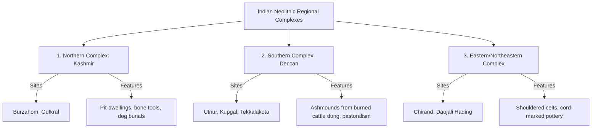
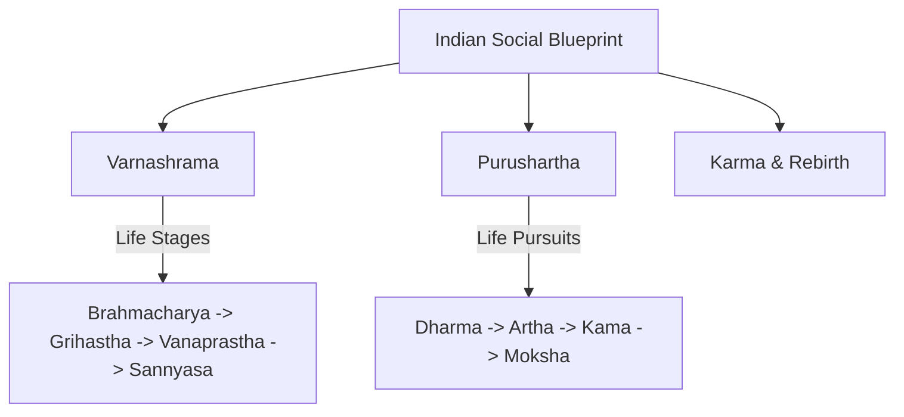

# PAPER II — UNITS 1.1–1.3 & 3.1–3.2: INDIAN PREHISTORY & SOCIAL SYSTEMS

---

## TOPIC 1: INDIAN PREHISTORY & ARCHAEOLOGICAL PHASES (UNIT 1.1)

> [!NOTE]
> **Syllabus Mapping:**
> * Paper II, Unit 1.1: Evolution of the Indian Culture and Civilization — Palaeolithic, Mesolithic, Neolithic, Chalcolithic, Megalithic, Copper Hoards, and Indus Valley Civilization (IVC).

---

### I. THE PALEOLITHIC CULTURES OF INDIA

Indian Paleolithic is divided into three phases, characterized by distinct tool-technologies and climatic conditions:

#### 1. Lower Paleolithic (Acheulian Tradition)

> [!TIP]
> **Mnemonic for Lower Paleolithic Tools:** **H C C** (Hunters Carry Choppers)
> * **H**andaxes, **C**leavers, **C**hoppers.

* **Tool-Technology:** Handaxes, Cleavers, and Choppers (Core-tool industry). Formulated primarily around the **Acheulian tradition** (large, bifacial flakes, highly symmetrical).
* **Key Regional Traditions:**
  * *Soanian Industry (North India):* Pebble-chopper tools found in the Soan River Valley (tributary of Indus, now in Pakistan).
  * *Madrasian / South Indian Industry:* Handaxes and cleavers found in Southern India, first discovered by **Robert Bruce Foote** ("Father of Indian Prehistory") on **May 30, 1863**, at Pallavaram (near Chennai). He went on to document over 500 prehistoric sites across India.
* **Major Archeological Sites:**
  * **Attirampakkam (Tamil Nadu):** One of the oldest Acheulian sites in India (dating to ~1.5 million years ago, discovered by Foote in 1863 as a follow-up to Pallavaram). **🌐 Internet Fact-Check:** Research by Dr. Shanti Pappu (Sharma Centre) also shows the site documents a transition from Acheulian to *Middle Palaeolithic Levallois technology* at **~385,000 years ago** — a highly important exam fact.
  * **Hunsgi-Baichbal Valley (Karnataka):** A dense Lower Paleolithic locality with limestone tool factories (Isampur).
  * **Didwana (Rajasthan):** Deep stratigraphic sequences showing transition through wet and dry phases in the Thar Desert.

#### 2. Middle Paleolithic (Flake Industry)
* **Tool-Technology:** Flake tools, Scrapers, Borers, and Points made on fine-grained silica materials (Chert, Jasper, Chalcedony).
* **Key Industry:** **Nevasan Industry** (named after the site of Nevasa in Maharashtra by H.D. Sankalia).
* **Major Sites:** Bhimbetka (Madhya Pradesh), Nevasa (Maharashtra), and Didwana.

#### 3. Upper Paleolithic (Blade & Bone Industry)
* **Tool-Technology:** Parallel-sided blades, burins, and bone tools (scrapers, needles).
* **Major Sites:** Kurnool Caves (Andhra Pradesh - bone tools, ash layers), Renigunta (Andhra Pradesh), and Bhimbetka.

---

### II. MESOLITHIC CULTURE: THE TRANSITION TO SEDENTISM

* **Tool-Technology:** **Microliths**—tiny, delicate geometric stone tools (lunates, triangles, trapezes, points) ranging from 1 to 8 cm, hafted onto wooden or bone handles to make composite arrows, spears, and sickles.
* **Economic Shift:** Transition from heavy hunting to hunting-gathering, fishing, and **early animal domestication**.
* **Major Archeological Sites:**
  * **Bagor (Rajasthan):** The largest Mesolithic site in India, yielding early evidence of sheep/goat domestication (dating to ~5000 BC).
  * **Adamgarh (Madhya Pradesh):** Early evidence of domesticated cattle and sheep.
  * **Sarai Nahar Rai & Mahadaha (Ganga Valley, UP):** Semi-permanent huts, burials with grave goods, and some of the earliest skeletal remains of modern humans in India.
  * **Bhimbetka (MP):** Rich prehistoric rock art illustrating hunting scenes, animal dances, and community life.

---

### III. NEOLITHIC CULTURE: THE FIRST FARMERS

> [!TIP]
> **Mnemonic for Neolithic Revolution:** **S P P A** (Settled People Practice Agriculture)
> * **S**edentism (villages), **P**olished celts, **P**ottery, **A**griculture.

* **Key Breakthroughs (V. Gordon Childe's "Neolithic Revolution"):** Sedentary village life, polished celts (ground stone axes), manufacture of handmade or wheel-thrown pottery, and obligate agriculture/pastoralism.
* **Regional Varieties in India:**

* **Burzahom Pit-Dwellers (Kashmir):**
  * *Features:* Inhabitants lived in underground circular or oval pits (*Gufkral* / Gufkral means "cave of the potter") to insulate against harsh winter winds. Bone tools were highly abundant. Unique burials where dogs were buried alongside their masters.

---

### IV. INDUS VALLEY CIVILIZATION (IVC): ENDOGENOUS ORIGIN

For decades, colonial historians (e.g., Mortimer Wheeler) argued that the Indus Valley Civilization arose due to sudden, external migration from Mesopotamia ("ideas have wings" theory). 

> [!NOTE]
> **Beginner's Analogy:** Imagine a beautiful, fully grown oak tree. Colonial historians believed someone dug up a fully grown tree in Mesopotamia and replanted it in India. Modern archaeology has proven that the tree grew from an indigenous acorn planted in Indian soil (Mehrgarh/Kot Diji), gradually growing roots and branches until it became the massive Indus civilization.

Modern archaeological science has **completely debunked** this, proving the **Endogenous (Indigenous) Origin of IVC**:

* **The Evolutionary Continuity:**
  * Pre-Harappan and Early Harappan sites like **Mehrgarh** (Baluchistan - showing early transition from Neolithic farming in 7000 BC to copper smelting), **Kot Diji, Amri, and Kalibangan** show the gradual development of:
    * Standardized brick sizes.
    * Fortified settlements.
    * Characteristic painted pottery motifs (peepal leaf, fish scales).
    * Writing systems (early symbols on pottery).
* **Rakhigarhi Evidences (UPSC high-yield):**
  * Rakhigarhi (Haryana) is the largest Harappan site. Recent ancient DNA studies conducted by **Vasant Shinde (2019)** on skeletal remains from Rakhigarhi burials proved that the Harappan population had genetic continuity with local South Asian hunter-gatherers, showing **no evidence of Steppe or Central Asian migration** during the Mature Harappan phase. This confirms that the IVC was an indigenous, endogenous growth.

##### Value-Addition: The Sanauli Excavations & The Protohistoric Chariot Debate
To score maximum marks, synthesize Indus Valley findings with the recent, revolutionary excavations at **Sanauli (Baghpat District, Uttar Pradesh)** in the Ganga-Yamuna Doab:
* **The Excavation Context:** Excavated by the Archaeological Survey of India (ASI) under **Sanjay Manjul (2018)**. It represents the largest necropolis (burial site) of the late Bronze Age (~2000–1800 BCE) in South Asia, containing 125 burials.
* **The Groundbreaking Discoveries:**
  1. **Solid-Wheeled Carts ("Chariots"):** Discovery of three bronze-age, two-wheeled, solid-wheeled carts. The wheels and chassis were heavily reinforced with copper triangles, proving advanced wheel-technology and the use of draft animals.
  2. **Elite Warrior Weaponry:** Excavation of antenna-crested copper swords, copper shields, helmets, and body armor.
  3. **Anthropomorphic Coffins:** Highly sophisticated, copper-plated wooden coffins decorated with copper busts of horned heads, indicating royal/warrior elite burials.
* **The Theoretical Paradigm Shift:**
  * *Challenging the Aryan Invasion/Migration Theory:* Colonial historians asserted that wheeled military transport, swords, and armor were brought into India from the Central Asian Steppes by invading "Aryans" around 1500 BCE. The Sanauli discoveries prove that a sophisticated, indigenous **warrior elite** with advanced metallurgy and wheeled transport already flourished in the Ganga Valley *prior to* the Steppe gene flow, rendering the invasion hypothesis obsolete.
  * *OCP/Copper Hoard Connection:* Sanauli bridges the gap between the Late Harappan phase and the **Ochre Coloured Pottery (OCP) / Copper Hoard Cultures** of the Ganga-Yamuna Doab, showing an integrated, highly advanced indigenous metallurgical network.

---

### V. UPSC PREVIOUS YEAR QUESTIONS (PYQs) & ANSWER BLUEPRINTS

---

#### PYQ 1: Critically describe evidences from Rakhigarhi and its linkages to Harappan civilization. [2024, 20 Marks]

* **Introduction (Approx. 40 words):** Rakhigarhi, located in the Hisar district of Haryana, is now recognized as the **largest site of the Indus Valley Civilization**, surpassing Mohenjodaro in size. Recent excavations led by Vasant Shinde have yielded revolutionary physical and genetic evidence that redefines the origin of the Harappans.
* **Body Skeleton:**
  * *The Archaeological Evidences from Rakhigarhi:*
    * **Scale & Planning:** Fortified mounds, planned streets, elaborate brick-lined drainage networks, and massive granaries.
    * **Craft & Trade:** Shell-working workshops, steatite seals, semi-precious beads, and copper artifacts, showing high economic specialization.
    * **Burial Ground:** Excavation of a cemetery containing skeleton remains with funerary pottery, mirrors, and beads.
  * *The DNA / Genetic Breakthrough (The Linkages):*
    * **Rakhigarhi Skeleton Genome (2019 study):** Ancient DNA extracted from a female skeleton (I6113) revealed a genetic profile rich in Ancestral South Indian (ASI) hunter-gatherers.
    * **Endogenous Proof:** The genome showed a total absence of "Steppe ancestry" or "Iranian pastoralist" gene flow during the Harappan era, proving that the IVC population was entirely indigenous, ending the "Mesopotamian migration" myth.
  * *Cultural Continuity Linkages:* The Rakhigarhi studies prove that the descendants of Harappans constitute the dominant genetic and cultural substrate of modern South Asian populations.
* **Conclusion (Approx. 40 words):** In summary, Rakhigarhi serves as the primary empirical bridge proving that the Indus Valley Civilization was an endogenous, home-grown marvel, whose legacy of town planning, agriculture, and genetics continues uninterrupted in modern India.

---
---

## TOPIC 2: CASTE, VARNA & INDIAN SOCIAL SYSTEMS (UNITS 3.1 & 3.2)

> [!NOTE]
> **Syllabus Mapping:**
> * Paper II, Unit 3.1: The structure and nature of traditional Indian social system — Varnashrama, Purushartha, Karma, Rina and Rebirth.
> * Paper II, Unit 3.2: Caste system in India — Structure and characteristics; Theories of origin (Racial, Traditional, Occupational, Religious, Structural).

---

### I. THE STRUCTURE OF TRADITIONAL INDIAN SOCIAL VALUES

The traditional Hindu social system was structured around values that integrated the individual’s life cycle with cosmic and social order:

* **Varnashrama (Four Life Stages):** Coordinates the individual's life cycle:
  > **Mnemonic:** **B G V S** (Boys Grow Very Smart)
  > * **B**rahmacharya, **G**rihastha, **V**anaprastha, **S**annyasa.
  1. *Brahmacharya:* Student life, celibacy, learning under Guru.
  2. *Grihastha:* Householder life, marriage, economic production, social duties.
  3. *Vanaprastha:* Hermit life, retirement, detachment from material home.
  4. *Sannyasa:* Renunciant life, total detachment, focus on spiritual liberation.
* **Purushartha (Four Life Pursuits):** Standardized goals of human action:
  > **Mnemonic:** **D A K M** (Do All Karmas Meaningfully)
  > * **D**harma, **A**rtha, **K**ama, **M**oksha.
  * *Dharma:* Moral duty, righteousness, ethical conduct (the guiding framework).
  * *Artha:* Material wealth, political power, economic success.
  * *Kama:* Sensory pleasure, aesthetic appreciation, sexual love.
  * *Moksha:* Spiritual liberation from the cycle of rebirth (the ultimate climax).
* **Karma & Rebirth:** The law of moral cause and effect. Every action (*Karma*) has a consequence. Positive actions accumulate merit (*Punya*), negative actions accumulate demerit (*Papa*), which determines the individual’s rebirth (*Samsara*) in their next life.

---

### II. THEORIES OF THE ORIGIN OF CASTE SYSTEM

The Indian Caste (*Jati*) system is a highly complex, closed social stratification system. Anthropologists have proposed five primary theoretical frameworks to explain its origin:

> [!TIP]
> **Mnemonic for Caste Origin Theories:** **R O R S C** (Really Old Rules Structure Castes)
> * **R**acial (Risley), **O**ccupational (Nesfield), **R**eligious (Hocart), **S**tructural (Dumont), **C**olonial (Dirks).

#### 1. The Racial Theory (Herbert Risley)
* **The Claim:** Caste arose from the conquest of the indigenous Dravidians by the lighter-skinned Aryans. To preserve their racial purity, the conquering Aryans established strict endogamous social boundaries.
* **The Method:** Risley used **Nasal Index anthropometry** (measuring nose shapes) and concluded: *"The social status of a caste varies inversely with the width of the nose."* Narrower noses (leptorrhine) marked upper castes (Aryan stock); wider noses (platyrrhine) marked lower castes (Dravidian stock).
* **Critique:** Highly criticized by modern genetics and anthropology for being racially deterministic and scientifically unsound.

#### 2. The Occupational / Functional Theory (Nesfield)
* **The Claim:** Caste arose purely from **division of labor** and occupational specialization. In early India, occupations that were highly specialized or secretive (like metallurgy or priesthood) became hereditary, forming closed castes.
* **Tenet:** *"Occupation is the sole foundation of the caste system."*

#### 3. The Religious Theory (Hocart & Senart)
* **The Claim:** Caste arose from ancient **religious rituals and temple service rules**. In tribal and early state societies, individuals performing sacred temple functions (preparing food, washing the deity) had to remain pure, establishing a division of groups based on their ritual duties to the king/god.

#### 4. The Structural Theory (Louis Dumont)
* **The Claim:** Formulated in his classic text *Homo Hierarchicus (1966)*. Dumont argued that caste is a unique structural phenomenon based on a **shared cognitive ideology**.
* **The Mechanism:** The caste system is structured by the **binary opposition of the Pure and the Impure**. 
  * The Brahmin represents absolute purity, positioned at the top of the hierarchy.
  * The Untouchable (*Dalit*) represents absolute impurity, positioned at the bottom.
  * The entire hierarchy is maintained because **Status (ritual purity) is structurally separated from Power (political/economic power)**. A king has power, but must bow rituals to a poor Brahmin who has superior ritual purity.

#### 5. The Colonial Construction Theory (Nicholas Dirks)
* **The Claim:** Formulated in *Castes of Mind: How Colonialism Made Modern India (2001)*. Dirks argued that the rigid, standard, pan-Indian caste system is a **colonial construction**, not an ancient immutable structure.
* **The Logic:** In pre-colonial India, "caste" (Jati) was a highly fluid, localized, and regional social structure. It was secondary to royal power, local political alliances, and territorial kingship.
* **Colonial Standardization:** To govern a massive population, the British colonial administration sought to make Indian society legible. Through the decennial census operations (especially the **1901 Census led by Herbert Risley**), they classified, standardized, and ranked every localized Jati into a singular, rigid, pan-Indian hierarchy based on Risley's racial nasal index. 
* **The Result:** The British reified and codified what was once a fluid social form, transforming "caste" into the primary, legal organizing principle of modern Indian civil society.

---

### III. UPSC PREVIOUS YEAR QUESTIONS (PYQs) & ANSWER BLUEPRINTS

---

#### PYQ 1: Critically evaluate the structural theory of the origin of the caste system proposed by Louis Dumont. [20 Marks]

* **Introduction (Approx. 40 words):** French structural anthropologist **Louis Dumont**, in his landmark work *Homo Hierarchicus: The Caste System and Its Implications (1966)*, presented the **Structural Theory** of caste, defining it as a unique system of hierarchy based on shared cognitive ideology rather than racial divisions.
* **Body Skeleton:**
  * *Core Tenet: Pure vs. Impure:* Dumont argued that the caste hierarchy is structured by a single, all-encompassing cognitive principle: the **binary opposition of the Pure and the Impure**.
  * *Structural Separation of Status and Power:* Explain his critical insight—in India, unlike the West, **Status** (ritual purity represented by the Brahmin) is structurally superior to and separated from **Power** (political/economic force represented by the King/Kshatriya).
  * *Hierarchy & Holistic Orientation:* Dumont contrasted the Indian *Homo Hierarchicus* (holistic, collective, hierarchical) with the Western *Homo Aequalis* (individualistic, equal). Hierarchy is the essential structural glue that integrates the whole society.
  * *The Critique (The Counter-arguments for 300+ Score):*
    * **André Béteille's Sripuram Study (Weberian Critique):** Béteille (*Caste, Class, and Power, 1965*) showed that Dumont's structural model is too static. In his study of Sripuram village (Tanjore), Béteille demonstrated that **Caste, Class, and Power have decoupled (disaggregated)**. While traditionally the Brahmin held all three, post-independence land reforms, panchayat elections, and modern jobs have decoupled them—meaning middle/lower castes hold power without high ritual status.
    * **Nicholas Dirks' Historical Critique:** Argued that Dumont made the mistake of taking colonial records and Brahmanical texts (*Shastras*) as literal reality. Dirks proved that the rigid "Homo Hierarchicus" hierarchy was actively constructed by British census operations rather than representing an ancient, unchanging Indian consensus.
    * **M.N. Srinivas & Fieldwork Critique:** Critiqued Dumont's "Book View" bias. In reality (Field View), secular factors like **Dominant Caste** (numbers, landownership) determine local power and hierarchy, showing that status and power are deeply intertwined, not separated.
    * **Gerald Berreman's Conflict Critique:** Argued that Dumont ignored the brutal coercive reality of physical violence and economic exploitation that upper castes use to maintain the "purity" hierarchy, making it a system of inequality rather than harmonious structural integration.
* **Conclusion (Approx. 40 words):** While Dumont’s structural theory is criticized for its static, scriptural bias, his conceptualization of the "pure vs. impure" binary opposition remains a brilliant analytical model for deciphering the unique ideological structure that sustains the Indian caste system.
