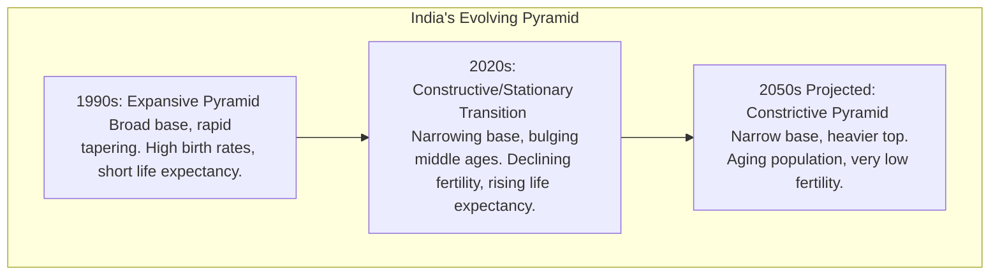

# Demographic Profile of India

## Syllabus Mapping
* Paper II, Unit 2: Demographic profile of India - Ethnic and linguistic elements in the Indian population and their distribution. Indian population – factors influencing its structure and growth.

---

## 1. Ethnic Elements in the Indian Population
India has been described as a "melting pot" of various ethnic elements. The most accepted classification was given by B.S. Guha (1935).

1. **The Negrito:** The earliest inhabitants. Today, their physical traits (short stature, dark skin, woolly hair) are found marginally among tribes like the Andamanese, Onge, and Kadar.
2. **The Proto-Australoids:** Arrived after the Negritos. They are the major constituent of the tribal population of Central and Southern India (e.g., Santhals, Bhils, Gonds, Chenchus). They have dark skin, broad noses, and wavy hair.
3. **The Mongoloids:** Found primarily in the North-Eastern and Himalayan regions. Characterized by epicanthic fold, flat face, and yellowish skin. 
    * *Palaeo-Mongoloids:* (e.g., Lepcha, Bodo, Mizo).
    * *Tibeto-Mongoloids:* (e.g., Bhutias of Sikkim).
4. **The Mediterranean:** Known for building the Indus Valley Civilization. They are a major element of the general population in South and North India. They introduced the Dravidian languages.
5. **The Western Brachycephals (Alpinoid, Dinaric, Armenoid):** Broad-headed people found along the western coast (e.g., Parsis, Nagar Brahmins of Gujarat, Coorgis).
6. **The Nordics:** The last major group to arrive. They brought the Indo-Aryan languages and Vedic culture. Found predominantly in North India (Punjab, Haryana, Rajasthan). Tall stature, fair skin, narrow nose.

## 2. Linguistic Elements in the Indian Population
Sir George Grierson (Linguistic Survey of India) identified several language families:

1. **Austro-Asiatic (Munda):** Spoken by Proto-Australoid tribes in Central and Eastern India (Santhali, Mundari, Ho).
2. **Sino-Tibetan:** Spoken by Mongoloid groups in the North-East and Himalayas (Bodo, Garo, Manipuri, Tibetan).
3. **Dravidian:** Dominant in South India (Telugu, Tamil, Kannada, Malayalam). Also spoken by some tribes (Gondi, Kurukh) and Brahui in Balochistan.
4. **Indo-European (Indo-Aryan):** The largest language family, spoken by over 70% of the population (Hindi, Bengali, Marathi, Gujarati). Derived from Sanskrit.

## 3. Factors Influencing Population Structure and Growth
India is currently the most populous country in the world, undergoing the Third Stage of the Demographic Transition (declining birth rates and low death rates).

### A. Fertility (Birth Rate)
* **Biological Factors:** Age at menarche, postpartum amenorrhea, and fecundity.
* **Socio-Cultural Factors:** Universality of marriage, early age of marriage, preference for male children (son meta-preference), and religious beliefs against contraception.
* **Economic Factors:** Children viewed as economic assets in agrarian societies; lack of female workforce participation.

### B. Mortality (Death Rate)
* Has declined rapidly since independence (from ~27/1000 to ~7/1000).
* Factors: Eradication of epidemics (smallpox, polio), better healthcare infrastructure, improved sanitation, and maternal/child health programs (ICDS, Janani Suraksha Yojana).
* **Infant Mortality Rate (IMR):** Still a concern in some regions due to malnutrition and lack of institutional deliveries.

### C. Migration
* **Internal Migration:** Rural to urban migration is accelerating due to push factors (lack of jobs, agricultural distress) and pull factors (better wages, education in cities).
* **International Migration:** Brain drain (skilled workers to West) and blue-collar workers to the Middle East (bringing massive remittances).

---

## 4. India's Population Pyramid and Demographic Dividend (UPSC Value Addition)

A population pyramid is a graphical illustration that shows the distribution of various age groups in a population.

### Contemporary Demographic Challenges
1. **The Demographic Dividend Window:** India has a massive youth bulge (median age ~28.2 years). The working-age population outnumbers dependents. However, if job creation, skill development, and health infrastructure do not keep pace, this dividend could turn into a **demographic disaster** (massive youth unemployment and social unrest).
2. **Skewed Sex Ratio:** Cultural preference for sons (son meta-preference) has led to female foeticide, creating an unnatural sex ratio. This is a severe socio-demographic crisis, particularly in Northern/Western states (e.g., Haryana).
3. **Regional Imbalances:** 
   * *Southern states* (Kerala, TN) have reached replacement level fertility and are experiencing rapid aging.
   * *Northern states* (UP, Bihar) still have high fertility rates and are driving the country's population growth. This creates political tension over delimitation of constituencies and resource allocation.
4. **Aging Population:** By 2050, over 20% of India's population will be elderly. The lack of robust social security nets and the breakdown of the joint family system makes elderly care a looming crisis.

> [!TIP]
> **Anthropological Perspective:** Demography isn't just numbers; it's deeply tied to kinship systems, patriarchy, and cultural ecology. For instance, the skewed sex ratio is directly tied to the *hypergamous* marriage system and the economic burden of dowry in patriarchal Indian societies.

---

## 5. UPSC PREVIOUS YEAR QUESTIONS (PYQs) & ANSWER BLUEPRINTS

---

#### PYQ 1: Critically compare Risley's and Sarkar's approaches to the classification of peoples of India. [2023, 15 Marks]
* **Introduction:** Sir Herbert Hope Risley (1915) and S.S. Sarkar (1961) presented two distinct models for classifying the ethnic diversity of the Indian population, moving from colonial anthropometry to early genetic/morphological approaches.
* **Body:**
  * **Risley's Approach (The Colonial/Linguistic Model):**
    * *Method:* Heavily relied on anthropometry (specifically the Nasal Index and Cephalic Index) combined with language and caste hierarchies. 
    * *Classification:* Divided India into seven types (Turko-Iranian, Indo-Aryan, Scytho-Dravidian, Aryo-Dravidian, Mongolo-Dravidian, Mongoloid, Dravidian).
    * *Core Flaw:* Risley conflated race (a biological concept) with language (a cultural trait). For instance, "Aryo-Dravidian" makes no biological sense. He also believed caste hierarchy mirrored racial purity.
  * **S.S. Sarkar's Approach (The Modern Morphological Model):**
    * *Method:* Rejected Risley's linguistic conflation. Sarkar based his classification purely on physical morphology, cranial capacity, and early blood group data.
    * *Classification:* Categorized the population into six primary groups: Australoid (Veddid), Indo-Aryan, Irano-Scythian, Mundari, Malayo-Polynesian, and Mongoloid.
    * *Key Differences:* Sarkar recognized the *Australoids* (not Dravidians) as the earliest autochthones of India. He correctly separated the Munda-speaking peoples (Mundari) from the Dravidians biologically.
* **Conclusion:** While Risley's classification is considered historically significant as the first major attempt, Sarkar’s approach is scientifically superior as it divorced biological race from linguistic and caste-based colonial prejudices.

#### PYQ 2: What are the demographic challenges of India's changing population dynamics in the next 50 years? [2024, 15 Marks]
* **Introduction:** India has entered the third stage of demographic transition, boasting the world's largest population and a massive youth bulge. However, projections for the next 50 years reveal complex challenges as the demographic dividend transitions into a demographic burden.
* **Body (Key Challenges):**
  * *1. The Aging Crisis (Geriatric Burden):* By 2050, over 20% of the population will be elderly. The collapse of the traditional joint family system, coupled with inadequate state social security, will lead to a massive crisis in elderly care and healthcare financing.
  * *2. The "Window of Opportunity" Closing:* The demographic dividend is temporary. If the state fails to provide adequate education, skilling, and massive job creation now, the "youth bulge" will convert into a "demographic disaster" characterized by high unemployment, social unrest, and crime.
  * *3. Extreme Regional Imbalances:* Southern states (Kerala, Tamil Nadu) are already below replacement-level fertility and are rapidly aging, leading to labor shortages. Northern states (UP, Bihar) continue to grow rapidly. This asymmetry will spark severe political tensions regarding the delimitation of parliamentary constituencies (political representation) and federal revenue sharing.
  * *4. The Sex-Ratio Deficit:* The cumulative effect of decades of female foeticide/infanticide has resulted in a "marriage squeeze" (millions of "missing women"), leading to cross-regional bride trafficking and increased gender-based violence.
* **Conclusion:** To mitigate these challenges, India must shift its policy focus from purely population *control* to population *management*, investing heavily in human capital (health, education) and geriatric infrastructure today to secure the demographic landscape of 2074.
