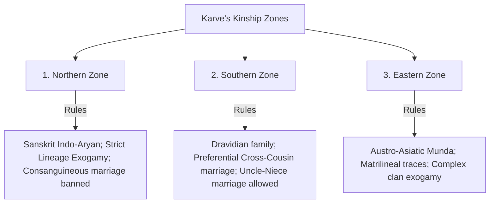
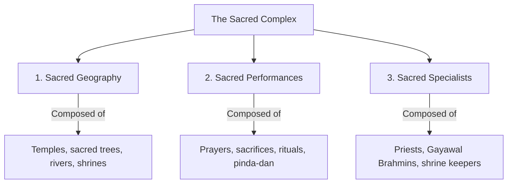
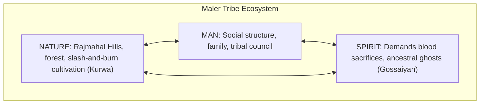

# PAPER II — UNITS 4 & 5: INDIAN THINKERS, VILLAGES & CHANGE CONCEPTS

---

## TOPIC 1: GROWTH OF INDIAN ANTHROPOLOGY & PRIMARY THINKERS (UNIT 4)

> [!NOTE]
> **Syllabus Mapping:**
> * Paper II, Unit 4: Emergence and growth of anthropology in India — Contributions of the 18th, 19th and early 20th century scholar-administrators; Contributions of Indian anthropologists (S.C. Roy, N.K. Bose, Iravati Karve, L.P. Vidyarthi, S.C. Dube, B.S. Guha).

---

### I. STAGES OF DEVELOPMENT IN INDIAN ANTHROPOLOGY

L.P. Vidyarthi divided the historical development of Indian anthropology into three distinct phases:
> [!TIP]
> **Mnemonic for Development Phases:** **F C A** (First Colonial Anthropologists)
> * **F**ormative, **C**onstructive, **A**nalytical.

1. **Formative Phase (1774–1919):** Initiated by the establishment of the **Asiatic Society of Bengal (1784)** by Sir William Jones. Dominated by British colonial scholar-administrators (**Herbert Risley, J.H. Hutton, Edward Dalton, L.S.S. O'Malley**) who compiled massive tribe/caste gazetteers to assist in colonial administration.
2. **Constructive Phase (1920–1947):** Characterized by the introduction of anthropology as an academic department (University of Calcutta in 1920 by L.K. Ananthakrishna Iyer). Indian scholars shifted from gazetteers to intensive monographs of specific tribes (e.g., S.C. Roy).
3. **Analytical / Professional Phase (1947–Present):** Shifted toward analytical village studies, collaboration with American anthropologists, developmental research, and policy planning.

---

### II. KEY INDIAN ANTHROPOLOGISTS & THEIR CONTRIBUTION

---

### 1. SARAT CHANDRA ROY (S.C. ROY) (1871–1942)
*Known as the "Father of Indian Ethnography."*

#### A. Core Literature & Studies
* **The Mundas and Their Country (1912)**
* **The Birhors (1925)**
* Founded India's first anthropological journal, ***Man in India* (1921)**.

#### B. Major Contributions
* **Exposing Tribal Customary Laws:** As a lawyer in Ranchi, Roy fought for tribal land rights. He meticulously documented tribal customary laws, inheritance systems, and land rights to defend tribes (Mundas, Oraons, Birhors) against exploitative zamindars in colonial courts.
* **Pioneering Monographic Research:** Roy was the first Indian to live among tribes for extended periods, documenting their material culture, youth dormitories (*Giti-ora*), and magico-religious beliefs.

---

### 2. NIRMAL KUMAR BOSE (N.K. BOSE) (1901–1972)
*A staunch Gandhian scholar who integrated social reform with intensive ethnography.*

#### A. Core Literature
* **Cultural Anthropology (1929)**
* **The Structure of Hindu Society (*Hindu Samajer Gathan*, 1949)**

#### B. The Hindu Method of Tribal Absorption

> [!NOTE]
> **Beginner's Analogy:** Think of the Hindu caste system as a large corporate conglomerate and a tribe as a small, struggling independent business. The corporation doesn't just buy them out ideologically; it gives them an exclusive, non-competitive contract (e.g., only they can supply baskets). In exchange for this economic security, the small business adopts the corporate dress code and culture (Hindu rituals and caste status).

* **The Concept:** Bose explained how isolated indigenous tribes were gradually integrated into the broader Hindu fold.
* **The Mechanism:** Unlike conversion (which is religious), this absorption was primarily **economic**. 
  * Isolated tribes practicing primitive slash-and-burn agriculture faced population pressures and food shortages. 
  * They migrated to the plains and entered the Hindu agrarian economy, adopting a specialized, non-competitive occupational niche (e.g., basket making, honey gathering).
  * Over time, to secure their economic position, they adopted the rituals, deities, and caste rules of the Hindu fold, gradually being absorbed at the lower rungs of the caste system.
* **Economic Security over Equality:** Bose highlighted that tribes accepted their lower caste status because the Hindu caste division of labor guaranteed them an **exclusive, non-competitive occupational monopoly** and economic safety, free from competition.

---

### 3. IRAVATI KARVE (1905–1970)
*India’s first female anthropologist; pioneered kinship and sociological research.*

#### A. Core Literature
* **Kinship Organisation in India (1953)** — A monumental comparative text.
* **Yuganta (1967)** — A sociological study of the Mahabharata characters.

#### B. Kinship Zones in India
Karve divided the Indian subcontinent into **four distinct kinship zones** based on geographic boundaries, linguistic families, and marriage rules:

* **Northern Zone:** Dominated by Indo-Aryan languages. High patriarchal structure. Strict rule of **Sapine/Lineage Exogamy** (cannot marry within 5 generations on mother's side, 7 on father's side). Consanguineous marriages are forbidden. Emphasizes *Kanyadan* (giving away the bride) and hypergamy.
* **Southern Zone:** Dominated by Dravidian languages. Marriage is preferential within the extended kin group to maintain property and solidarity. **Preferential Cross-Cousin marriage** (marrying father's sister's daughter or mother's brother's daughter) and **Uncle-Niece marriage** are highly preferred.
* **Eastern Zone:** Dominated by Austro-Asiatic and Tibeto-Burman languages. Exhibits a mix of tribal patrilineal and matrilineal elements with complex clan-exogamy rules.

---

### 4. CHRISTOPH VON FÜRER-HAIMENDORF (1909–1995)
*An Austrian anthropologist who profoundly shaped tribal policies in the Nizam's Hyderabad State and North-East India.*

#### A. Core Literature
* **The Chenchus (1943)**
* **The Raj Gonds of Adilabad (1948)**
* **The Apatanis and their Neighbours (1962)**

#### B. Major Contributions
* **Participant Observation in Isolation:** Haimendorf conducted deep ethnographic fieldwork among some of the most isolated tribes in India, including the Konyak Nagas, Apatanis (Arunachal Pradesh), and the Chenchus (Andhra Pradesh).
* **Tribal Policy & Administration:** Serving as the Advisor for Tribes and Backward Classes to the Nizam of Hyderabad, he translated his ethnographic data directly into protective policies. He played a key role in the formulation of the **Hyderabad Tribal Areas Regulation (1949)**, which protected tribal land from non-tribal alienation.
* **Education for Tribals:** He initiated the **Gond Education Scheme** in Marlavai (Adilabad), establishing schools where tribal children were taught in their mother tongue (Gondi) by trained tribal teachers—a precursor to modern mother-tongue education policies.
* **The Concept of "Tribal Justice":** He documented the intricate, autonomous judicial systems of tribes like the Apatanis, proving that stateless societies possessed highly evolved, peaceful mechanisms for conflict resolution without formal police or courts.

---

### 5. LEELA DUBE (1923–2012)
*A pioneering feminist anthropologist who integrated gender into kinship and tribal studies.*

#### A. Core Literature
* **Matriliny and Islam (1969)**
* **Women and Kinship: Comparative Perspectives on Gender in South and South-East Asia (1997)**

#### B. Major Contributions
* **Intersection of Religion and Kinship:** In *Matriliny and Islam*, Dube studied the Kalpeni Islanders of Lakshadweep. She analyzed the fascinating paradox of a society that strictly follows Islam (a highly patriarchal religion) while maintaining a strict **matrilineal kinship structure** (property passed through females, husbands as visiting partners).
* **Feminist Anthropology:** Dube challenged the male-centric bias in traditional Indian sociology. She argued that women were not passive objects in kinship systems but active agents who negotiated power.
* **The "Seed and Earth" Analogy:** Dube powerfully critiqued the structural patriarchy in Hindu society using the indigenous "Seed and Earth" metaphor. In this cultural ideology, the man provides the "seed" (the essential life force and identity) while the woman provides only the "earth/field" (the passive receptacle). She argued this metaphor is used to systematically justify patrilineal inheritance and deny women rights over children and property.

---

### III. UPSC PREVIOUS YEAR QUESTIONS (PYQs) & ANSWER BLUEPRINTS

---

#### PYQ 1: Discuss the contributions of N. K. Bose in understanding tribal communities and their place in Indian society. [2021, 20 Marks]

* **Introduction (Approx. 40 words):** Nirmal Kumar Bose was a highly influential, multi-disciplinary Indian anthropologist. In his classic text *The Structure of Hindu Society (1949)*, he presented the landmark concept of the **Hindu Method of Tribal Absorption**, explaining the socio-economic integration of tribal groups into Indian society.
* **Body Skeleton:**
  * *The Concept of Tribal Absorption:* Detail the economic integration. Tribes migrated from isolated forests to the plains due to resource stress and entered the Hindu caste system as specialized occupational groups.
  * *Non-Competitive Economic Guild:* Explain that Bose viewed the caste system as a cooperative economic guild. Upper castes did not compete with lower-caste/tribal occupational niches, guaranteeing the newly absorbed tribes an exclusive economic livelihood.
  * *Cultural Assimilation (Acculturation):* Once economically integrated, tribes slowly adopted Hindu rituals, taboos, and deities, being assigned a *Jati* status at the lower end of the social hierarchy.
  * *Other Contributions:*
    * **Gandhian Synthesis:** Bose applied Gandhi’s concept of trusteeship to tribal development.
    * **Saraswati-Bose Civilization Study:** Mapped the structural distribution of material traits (plow types, bullock carts) across India.
  * *Critique of the Absorption Model:* Note that modern subaltern scholars critique Bose's model as too harmonious. They argue "absorption" was actually a process of forced subordination and economic exploitation, reducing proud tribes to marginalized landless laborers (*Dalits*).
* **Conclusion (Approx. 40 words):** In summary, N.K. Bose’s structural analysis of tribal-caste integration successfully demonstrated that the economic division of labor was the primary glue of traditional Indian society, providing a foundational model that continues to guide tribal studies.

---
---

## TOPIC 2: VILLAGE STUDIES, DOMINANT CASTE & SANSKRITIZATION (UNIT 5)

> [!NOTE]
> **Syllabus Mapping:**
> * Paper II, Unit 5.1: Indian Village — Significance of village study in India; traditional and changing patterns of social structure; Dominant Caste; Sacred Complex; Nature-Man-Spirit Complex.
> * Paper II, Unit 5.3: Indigenous and exogenous processes of socio-cultural change — Sanskritization, Westernization, Modernization; Little and Great Traditions.

---

### I. THE GOLDEN ERA OF VILLAGE STUDIES (1950s)

Following independence, Indian and Western anthropologists launched intensive village studies to understand rural social reality:
* **M.N. Srinivas:** Studied **Rampura** village (near Mysore) and edited *India's Villages (1955)*.
* **S.C. Dube:** Wrote ***Indian Village* (1955)** based on his multidisciplinary study of **Shamirpet** (near Hyderabad)—the first comprehensive monograph on an Indian village.
* **McKim Marriott:** Studied **Kishan Garhi** (UP) and formulated the Little/Great tradition dynamics.

#### Significance of Village Studies
1. **Dismantled Colonial Myths:** Proved that Indian villages were **never isolated, static republics** (contra Charles Metcalfe's view). Villages were active, dynamic units connected to wider regional markets, marriage circles, and pilgrimage networks.
2. **Guided National Development:** Provided empirical, field-based realities of rural poverty, caste hierarchies, and landholdings to guide the Planning Commission’s Community Development Programmes (CDP).

---

### II. CORE SOCIO-CULTURAL CONCEPTS

---

### 1. SANSKRITIZATION
*Formulated by M.N. Srinivas in his study of the Coorgs (Religion and Society among the Coorgs of South India, 1952).*

#### A. The Definition
> *"Sanskritization is the process by which a low Hindu caste, or tribal, or other group, changes its customs, ritual, ideology, and way of life in the direction of a high, and frequently, 'twice-born' (dvija) caste."*

#### B. The Mechanics

* **Cultural Imitation:** Lower castes adopt the cultural habits of Brahmins, Kshatriyas, or Vaishyas. They adopt **vegetarianism, teetotalism, wear the sacred thread**, and perform Sanskritized life-cycle rituals.
* **Abandonment of "Impure" Habits:** They abandon traits considered polluting, such as consuming beef/pork, brewing liquor, performing animal sacrifices, and practicing widow remarriage or bride price.
* **Positional Change, No Structural Change:** Srinivas emphasized that Sanskritization leads to **positional mobility** for a specific caste (moving up slightly in the local Jati hierarchy), but results in **zero structural change** to the caste system itself—the overall hierarchy remains unchanged.

---

### 2. THE DOMINANT CASTE
*Formulated by M.N. Srinivas in his study of the Okkaligas of Rampura village.*

#### A. Key Criteria for Dominancy

> [!TIP]
> **Mnemonic for Dominant Caste Criteria:** **N E P R M L** (Never Expect Poor Results from Modern Leaders)
> * **N**umerical, **E**conomic, **P**olitical, **R**itual, **M**odern Education, **L**ocal Prestige.

A caste is considered a **Dominant Caste** locally if it possesses a combination of the following six structural attributes:
1. **Numerical Strength:** Constitutes a significant percentage of the local village population.
2. **Economic Power:** Holds ownership over a vast majority of the agricultural land in the village.
3. **Political Power:** Controls village panchayats and local decision-making bodies.
4. **Ritual Status:** Positions relatively high in the traditional Varna system (though not necessarily at the absolute top like Brahmins).
5. **Modern Education & Western Occupations:** Members have access to government jobs, higher education, and urban wealth.
6. **Local Prestige:** Serves as the primary patron and arbitrator of disputes in the village.
* *Classic Examples:* Okkaligas and Lingayats in Karnataka; Jats in Haryana/UP; Kammas and Reddys in Andhra Pradesh; Patidars in Gujarat.

---

### 3. THE SACRED COMPLEX
*Formulated by L.P. Vidyarthi in his landmark study of the Hindu place of pilgrimage: **The Sacred Complex of Hindu Gaya (1961)**.*

#### A. The Tri-partite Structure

> [!TIP]
> **Mnemonic for Sacred Complex:** **G P S** (Mapping the Sacred)
> * Sacred **G**eography, Sacred **P**erformances, Sacred **S**pecialists.

* **Sacred Geography:** The physical, spatial layout of the holy site—temples, shrines, sacred trees (*peepal*), holy ponds, and rivers.
* **Sacred Performances:** The actual religious rituals, prayers, offerings, fasts, and ceremonies (*pinda-dan* for ancestors) performed by pilgrims at the site.
* **Sacred Specialists:** The organized class of religious functionaries (priests, Gayawal Brahmins, temple managers, astrologers) who guide and execute the sacred performances.
* *Utility:* Proved that a pilgrimage center serves as a grand **bi-cultural channel of integration**, connecting local folk traditions ("Little Traditions") with the pan-Indian scriptural traditions ("Great Traditions").

---

### 4. THE NATURE-MAN-SPIRIT COMPLEX
*Formulated by L.P. Vidyarthi in his study of the **Maler / Sauria Paharia** tribe of Rajmahal Hills, Bihar (The Maler: A Study in Nature-Man-Spirit Complex, 1963).*

* **The Concept:** Explains the holistic, organic, and integrated relationship between a tribal community’s environment (Nature), their social/economic system (Man), and their supernatural belief system (Spirit).

1. **Nature:** The geoclimatic environment. The Maler live in high, forested hills and practice **Kurwa** (slash-and-burn shifting cultivation), which dictates their entire seasonal calendar.
2. **Man:** The social organization. Their family structure, division of labor, youth dormitories (*Kodada*), and political tribal council are organized entirely around executing their forest slash-and-burn agriculture.
3. **Spirit:** The supernatural beliefs. They believe that their forest and hills are inhabited by various spirits/deities (*Gossaiyan*). If they do not perform blood sacrifices or rituals, the spirits will trigger crop failures, disease, or tiger attacks. 
* *Utility:* Illustrates the ultimate ecological and cultural holism of tribal societies—if you disrupt their environment (Nature), their entire social structure (Man) and spiritual system (Spirit) will collapse.

---

### III. UPSC PREVIOUS YEAR QUESTIONS (PYQs) & ANSWER BLUEPRINTS

---

#### PYQ 1: Critically examine the concept of Sanskritization as a process of socio-cultural change in India. [20 Marks]

* **Introduction (Approx. 40 words):** Sanskritization is a pioneering socio-cultural concept formulated by **M.N. Srinivas** in *Religion and Society among the Coorgs (1952)*. It describes the indigenous, cultural process through which lower castes or tribal groups attempt to elevate their social status by imitating the twice-born dvija castes.
* **Body Skeleton:**
  * *Detail the Mechanics:* Explain the imitation pattern—adopting vegetarianism, sacred thread, performing Sanskritic rituals; abandoning polluting traits (meat-eating, alcohol, widow-remarriage).
  * *Positional vs. Structural Change:* Emphasize that it is a **positional shift** for a specific caste within the local Jati system, but leads to **no structural change** to the caste hierarchy itself.
  * *Sanskritization as a Source of Ambiguity:* In the middle rungs of the caste system, Sanskritization allows upwardly mobile castes (e.g., wealthy farmers) to claim Kshatriya status, causing local structural ambiguity.
  * *The Critique / Limitations:*
    * **De-Sanskritization:** Modern politics and affirmative action have reversed this. Lower castes now emphasize their lower-caste identity to claim reservation benefits.
    * **Ethnocentric / Brahminical Bias:** Critiqued for assuming Brahminical culture is universally superior and desirable.
    * **Reinforces Inequality:** Sanskritization implicitly validates the purity-impurity ideology, reinforcing caste inequality rather than challenging it.
* **Conclusion (Approx. 40 words):** While Sanskritization is restricted by Brahminical biases and modern identity politics, it remains a brilliant, field-tested analytical tool that explains the historic, cultural dynamics of upward social mobility within the traditional Indian caste system.

#### PYQ 2: Discuss the contributions of S.C. Roy in understanding the tribes of India. [2014, 20 Marks] / Role in customary laws [2021, 15 Marks]
* **Introduction:** Sarat Chandra Roy (1871–1942), often called the **"Father of Indian Ethnography,"** transitioned from a lawyer to an anthropologist to defend the land rights of Chhotanagpur tribes against colonial exploitation.
* **Body:**
  * *Monographic Tradition:* Authored the first full-length, holistic ethnographies of Indian tribes (e.g., *The Munda and their Country* (1912), *The Oraons*, *The Birhors*). He documented their kinship, religion, and folklore meticulously.
  * *Customary Law & Land Rights:* As a lawyer, Roy realized that British courts were stripping tribals of their lands because the British did not understand tribal unwritten customary laws (like the *Khuntkatti* joint ownership system). His ethnographies educated the judiciary, directly influencing the Chhotanagpur Tenancy Act (1908) to protect tribal land.
  * *Institutionalization:* Founded the journal *'Man in India'* (1921), the first anthropological journal in the country, establishing a platform for Indian anthropological discourse.
* **Conclusion:** S.C. Roy was the first to practice "Action Anthropology" in India long before the term was coined, using ethnography not just as an academic exercise, but as a legal weapon to protect tribal customary rights from colonial agrarian capitalism.

#### PYQ 3: Discuss the contributions of N.K. Bose in understanding tribal communities and their place in Indian civilization. [2021, 20 Marks]
* **Introduction:** Nirmal Kumar Bose (1901–1972) was a nationalist anthropologist, a Gandhian, and the Director of the Anthropological Survey of India. His unique contribution lies in interpreting tribal India not as isolated isolates, but as integral parts of the broader Indian civilization.
* **Body:**
  * *Hindu Method of Tribal Absorption (1941):* Bose's seminal concept. He argued that Hindu society absorbed tribes primarily through a slow, non-coercive **economic integration**, rather than forced religious conversion. Tribes entered the Hindu fold by monopolizing a specific craft/occupation (like basket-making) and attaching themselves to the caste-based Jajmani system.
  * *Cultural Pluralism & Tolerance:* Once a tribe entered the caste system at the lower rungs, Brahminical society allowed them to retain their indigenous deities, rituals, and autonomy. Bose praised this as a tolerant, pluralistic method compared to the cultural erasure seen in Western colonialism.
  * *Civilizational Approach:* Instead of studying tribes in isolation (the colonial approach), Bose studied them in spatial continuum with caste villages. His work *Peasant Life in India* mapped material traits across the country to prove an underlying civilizational unity.
* **Conclusion:** N.K. Bose shifted the paradigm of Indian anthropology from colonial "isolationism" to civilizational "integration," proving that tribes and castes are two ends of a continuous socio-economic spectrum in India.

#### PYQ 4: Write about the role of colonial administration in the development of anthropology in India. [2019, 15 Marks]
* **Introduction:** Anthropology in India did not begin as an academic pursuit in universities, but as an administrative necessity for the British Empire. The "Constructive Phase" (1774-1919) of Indian anthropology was entirely driven by colonial administrator-scholars.
* **Body:**
  * *The Need for Governance:* Following the 1857 revolt, the British realized they could not govern India without understanding its complex caste and tribal systems. "Knowledge is power" became the administrative doctrine.
  * *Institutional Foundations:* Sir William Jones founded the **Asiatic Society of Bengal (1784)** to study Indian culture. The establishment of the **Anthropological Survey of India (AnSI)** laid the institutional bedrock.
  * *Census Operations and Ethnographic Glossaries:* The decennial censuses, especially the **1901 Census by Sir H.H. Risley**, systematically categorized, ranked, and mapped castes and tribes. Administrator-scholars like Edgar Thurston (*Castes and Tribes of Southern India*) and R.V. Russell produced massive encyclopedias detailing local customs, which remain foundational texts today.
  * *Critique (Colonial Gaze):* The colonial administration’s anthropology was inherently biased. It treated Indian society as a static museum of exotic customs, artificially rigidified the caste system for administrative convenience, and viewed tribes as "noble savages" needing paternalistic isolation.
* **Conclusion:** While deeply flawed by its imperial agenda, the colonial administration inadvertently birthed Indian anthropology by creating the first systematic ethnographic databases, which later Indian nationalist anthropologists (like S.C. Roy and G.S. Ghurye) would use, critique, and build upon.
