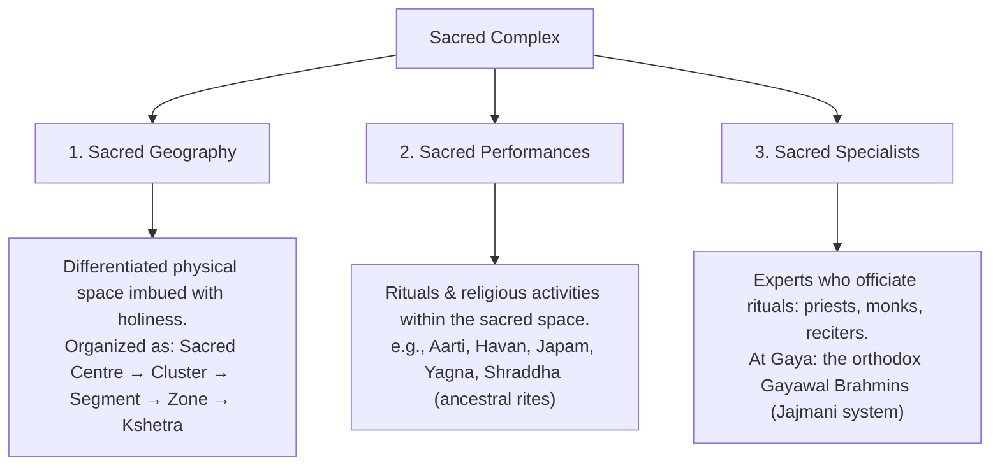
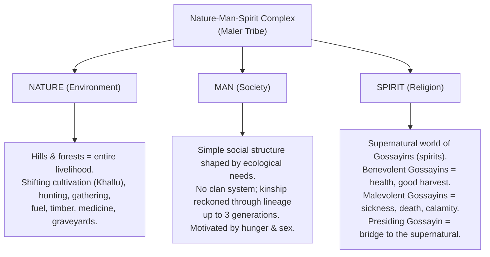

# Sacred Complex & Nature-Man-Spirit Complex

## Syllabus Mapping
* Paper II, Unit 3.3: Sacred Complex & Nature-Man-Spirit Complex

---

## 1. L.P. Vidyarthi — The Scholar

**Lalita Prasad Vidyarthi (1931–1985)** is one of the most distinguished names in contemporary Indian anthropology.

* **Academic Formation:** Trained at Lucknow University under **D.N. Majumdar**, and received his Ph.D. (1958) from the **University of Chicago** under **Sol Tax** (Action Anthropology) and **Robert Redfield** (Great & Little Traditions).
* **Institutional Contributions:** Elevated the Anthropology Department at Ranchi University to a UGC Centre of Advanced Study in Anthropology (1985).
* **Applied Work:** Chaired several Government of India committees on tribal upliftment, backward classes, and rehabilitation. His work *Applied Anthropology in India* (1968) translated academic research into policy.

> [!TIP]
> **Mnemonic for Vidyarthi's Core Contributions:** **"S.N.A.F."**
> - **S**acred Complex (1961)
> - **N**ature-Man-Spirit Complex (1963)
> - **A**pplied & Action Anthropology
> - **F**olklore Studies (*Cultural Contours of Tribal Bihar*, 1966)

---

## 2. The Sacred Complex (1961)

Based on his fieldwork in the Hindu pilgrimage city of **Gaya (Bihar)**, Vidyarthi proposed the **Sacred Complex** as a framework to understand sacred cities as microcosms of Hindu civilization. He built upon **Robert Redfield's** concept of Great and Little Traditions (1955).

### The Three Components

### The Sacred Geography of Gaya — Spatial Hierarchy
| Unit | Definition |
| :--- | :--- |
| **Sacred Centre** | The minimum unit — a single image, river, temple, or tree. |
| **Sacred Cluster** | A combination of several centres around one dominant centre. |
| **Sacred Segment** | Two or more clusters together. |
| **Sacred Zone** | Several sacred segments together. |
| **Kshetra** | The entire sacred territory. Gaya = the whole Kshetra of Magadha. |

### Vidyarthi's Three Hypotheses
1. **Continuity & Compromise:** The sacred complex of a Hindu pilgrimage site reflects continuous *continuity, compromise, and combination* between the **Great Tradition** (Sanskritic, textual Hinduism) and the **Little Traditions** (local, folk, village beliefs).
2. **Transmission:** The sacred specialists transmit elements of the Great Tradition to the rural masses by popularizing texts, organizing pilgrimages, and officiating as ritual priests.
3. **Transformation:** The sacred complex is continuously modified due to broader changes in civilization. In Gaya, the **secular zone is expanding** at the cost of the shrinking sacred zone — old dilapidated sacred objects are being replaced by rest houses, parks, and restaurants.

> [!IMPORTANT]
> **National Significance of Sacred Complex:** Pilgrimage centres like Gaya function as **civilizational melting pots**. People from different regions, castes, and linguistic backgrounds converge, transcending social divisions. This demonstrates **national unity within cultural diversity**. As Makhan Jha showed with Janakpur (Nepal), the boundary of a civilization is **not** the boundary of a nation-state.

### Further Scholars on Sacred Complex
| Scholar | Sacred Site Studied | Key Contribution |
| :--- | :--- | :--- |
| **Makhan Jha (1971)** | Janakpur (Nepal), Puri (Jagannath) | Civilizational boundaries transcend political/nation-state limits. |
| **B.N. Saraswati (1965)** | Kashi, Nimsar, Panaji (Goa) | Sacred complex is NOT exclusively Brahminic — at Kashi, Brahminic temples coexist with non-Brahminic shrines managed by *Dom* (untouchable) priests. |
| **Narayam Reddy** | Tirumala (Venkateswara Temple) | Mapped the full sacred-secular continuum; analyzed socioeconomic profiles of pilgrims. |
| **Narayan (1974)** | Deoghar (West Bengal) | Showed how the sacred complex integrates people of different castes, classes, and linguistic regions — a microcosm of Indian civilization. |

---

## 3. Nature-Man-Spirit Complex (1963)

In *"The Maler: Nature-Man-Spirit Complex in a Hill Tribe of Bihar"* (1963), Vidyarthi developed a holistic methodological framework to study the **Sauria Paharia (Maler)** tribe of the Rajmahal Hills, Sahebganj District, Jharkhand.

He deliberately moved away from dry, descriptive ethnographic monographs to depict the **"soul"** — not just the "bones" — of a tribal culture.

### The Three Components

> [!NOTE]
> The three components are **inextricably linked and inseparable.** The Maler cannot exploit *Nature* (forest) without first propitiating the *Spirits* (Gossayins) through rituals organized by *Man* (the social-ritual structure). To remove a Maler from their forest is to simultaneously destroy their society and their spiritual world.

### Applied Significance (Why This Matters for UPSC)

The Nature-Man-Spirit Complex is not just an academic framework — it is a **practical guide for tribal development administrators:**

1. **Explains Resistance to Rehabilitation:** When the government displaces tribes for dams, mines, or wildlife sanctuaries, tribes resist violently. Administrators often fail to understand *why*. The framework explains: displacement shatters the tribal equilibrium with Nature (their land), Society (their kinship networks), and Spirit (their sacred geography). A tribe without its forest loses all three simultaneously.
2. **"Development with Happiness":** Development should not abruptly disrupt this fragile equilibrium. Schemes must be introduced gradually, with community consent, allowing the tribe to adapt at its own pace.
3. **Resilience of Little Traditions:** The framework proves that Little Traditions (tribal cultures) are resilient and can *reject* the Great Tradition without being overwhelmed — a caution against forced cultural assimilation.

---

## 4. The Nature-Man-Spirit Complex as a Constant (P.K. Singh's Extension)

P.K. Singh extended Vidyarthi's framework with a theoretical formalization:

* **Low Technology (Hunter-Gatherers):** High dependence on **Nature**, weak inter-human dependence.
* **High Technology (Industrial):** Low dependence on **Nature**, but extremely high dependence on **other Men** (due to labor specialization and supply chains).

**Conclusion:** As technology increases, dependence on nature decreases, but social complexity and inter-human dependence increases proportionally. The *total sum* of these cultural components (Nature + Man + Spirit) **remains constant** across all levels of human society — whether a hunter-gatherer band or an industrial nation-state. This makes the complex a universal and enduring anthropological tool.

---

## 5. Other Studies Using the Framework

Vidyarthi's Nature-Man-Spirit framework proved so useful that scholars applied it to multiple tribal groups, validating its cross-cultural utility:

| Scholar | Tribe Studied |
| :--- | :--- |
| A.N. Sandhwar | Korwa |
| R.K. Prasad | Parahiya |
| R.K. Sinha | Pando |
| V.S. Sahay | Nicobarese |
| S.G. Morab | Soliga |

> [!IMPORTANT]
> **Key Exam Comparison: Sacred Complex vs. Nature-Man-Spirit Complex**
>
> | Dimension | Sacred Complex | Nature-Man-Spirit Complex |
> | :--- | :--- | :--- |
> | **Society Studied** | Hindu pilgrimage city (Urban/Hindu) | Tribal hill community (Maler) |
> | **Site** | Gaya, Bihar | Rajmahal Hills, Jharkhand |
> | **Theoretical Base** | Redfield's Great & Little Traditions | Cultural Ecology |
> | **Key Book** | *Sacred Complex in Hindu Gaya* (1961) | *The Maler* (1963) |
> | **Core Argument** | Sacred cities integrate diverse Hindu traditions | Tribal life is an inseparable triad of ecology, society, and spirit |
