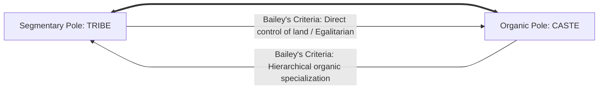
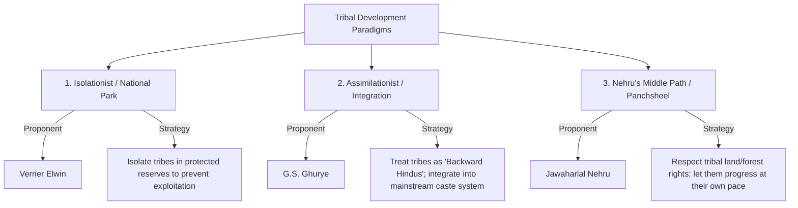

# PAPER II — UNITS 6.1 & 7.1: TRIBAL SITUATION & PROBLEMS IN INDIA

---

## TOPIC 1: TRIBAL SITUATION & CLASSIFICATIONS (UNIT 6.1)

> [!NOTE]
> **Syllabus Mapping:**
> * Paper II, Unit 6.1: Tribal situation in India — Bio-genetic variability, linguistic and socio-economic characteristics of tribal populations and their distribution.
> * Paper II, Unit 6.1: Concept of Tribe; Tribe and Scheduled Tribe; Tribe-Caste Continuum; PVTGs.

---

### I. CONCEPT OF TRIBE & THE CONSTITUTIONAL BLUEPRINT

* **Socio-Cultural Concept (Tribe):** An anthropological category representing an indigenous, self-contained social group sharing a common territory, dialect, distinct culture, endogamous marriage rules, and an egalitarian segmentary social structure (lacking caste hierarchy).
* **Constitutional Category (Scheduled Tribe - ST):** Defined under **Article 366(25)** of the Indian Constitution as *"such tribes or tribal communities... as are deemed under Article 342 to be Scheduled Tribes."*
  * **Article 342:** Empowers the President to specify the tribes in a state as Scheduled Tribes.
  * **The Five Criteria for Scheduling (Lokur Committee, 1965):**
    > **Mnemonic:** **P D G S B** (Please Don't Go So Back)
    > * **P**rimitive traits, **D**istinctive culture, **G**eographical isolation, **S**hyness of contact, **B**ackwardness.
    1. Indication of primitive traits (pre-agricultural technology).
    2. Distinctive culture.
    3. Geographical isolation.
    4. Shyness of contact with the community at large.
    5. Backwardness (socio-economic).

---

### II. LINGUISTIC & GEOGRAPHICAL CLASSIFICATION OF INDIAN TRIBES

Indian tribes are highly diverse, classified into distinct linguistic and geographical zones:

#### 1. Linguistic Classification (Four Major Language Families)
* **Austro-Asiatic (Munda Family):** Spoken primarily by Central Indian tribes (e.g., Santhal, Munda, Ho, Birhor, Korku).
* **Dravidian Family:** Spoken by Central and Southern Indian tribes (e.g., Gond, Khond, Oraon, Toda, Chenchu).
* **Tibeto-Burman Family:** Spoken by North-Eastern borderland tribes (e.g., Naga, Garo, Khasi, Mizo, Bodo).
* **Indo-Aryan Family:** Spoken by some Western and Northern Indian tribes (e.g., Bhil, Gujjar).

#### 2. Geographical Distribution (Five Core Zones)
* **Northern Zone:** Himachal Pradesh, Uttarakhand, J&K (e.g., Gujjars, Gaddis, Bhotias).
* **North-Eastern Zone:** Assam, Nagaland, Meghalaya, Mizoram (e.g., Nagas, Khasis, Garos, Mizos). High literacy, Mongoloid racial stock, matrilineal systems.
* **Central Zone (Heartland):** Jharkhand, Chhattisgarh, MP, Orissa, West Bengal (e.g., Santhals, Gonds, Mundas, Hos, Oraons). Highest concentration of tribes, Proto-Australoid racial stock.
* **Western Zone:** Rajasthan, Gujarat, Maharashtra (e.g., Bhils, Minas, Warli, Katkari).
* **Southern Zone:** Karnataka, Kerala, Tamil Nadu, Andhra Pradesh (e.g., Chenchus, Todas, Kadars, Irulas). Negrito racial traits, small population, hunter-gatherer subsistence.

---

### III. SOCIO-ECONOMIC & TYPOLOGICAL PROFILE

Anthropologists (**L.P. Vidyarthi**) classify Indian tribes based on their primary economic subsistence:

| Economic Typology | Core Economic Activity | Tribal Examples |
| :--- | :--- | :--- |
| **1. Hunter-Gatherers** | Foraging forest produce, honey collection, and small game hunting. | Chenchus (Andhra), Birhor (Jharkhand), Kadars (Kerala). |
| **2. Shifting Cultivators** | Slash-and-burn shifting cultivation (*Kurwa, Jhum, Podu*). | Maler (Bihar), Hill Marias (Bastar), Juangs (Odisha), Karbis (Assam). |
| **3. Pastoralists** | Herding cattle, sheep, or yaks; practice transhumance. | Todas of Nilgiris (buffalo pastoralism), Bakarwals & Gaddis (Himalayas). |
| **4. Artisan Tribes** | Specialized non-agricultural crafts (basketry, metal works, weaving). | Mahali (basket makers), Asur (traditional iron smelters), Kotas (potters). |
| **5. Settled Agriculturists** | Ploughed agricultural cultivation in plains; integrated with market. | Santhals, Gonds, Oraons, Minas. |

---

### IV. THE TRIBE-CASTE CONTINUUM (F.G. BAILEY)
*A structural model to understand the fluid boundaries between tribe and caste.*

Formulated by **F.G. Bailey (1960)** in his study of the **Kondhs of Bisipara (Odisha)**:
* **The Theory:** Tribe and Caste are not two separate, static categories. They represent two ideal poles of a single structural **continuum**.

> [!NOTE]
> **Beginner's Analogy:** Think of the Tribe as a cooperative startup where everyone owns equal shares, does a bit of everything, and decisions are egalitarian (Segmentary). Think of Caste as a massive multinational corporation with a strict hierarchy, specialized departments that don't mix, and unequal pay/power (Organic).

* **The Tribal Pole (Segmentary):** Society is segmentary, politically autonomous, and egalitarian. Social control and resource allocation are direct, kin-based, and do not rely on specialized hierarchical groups. Access to land is equal for all clan members.
* **The Caste Pole (Organic):** Society is organic, highly stratified, and characterized by a rigid, hereditary division of labor. Access to resources (land) is highly unequal, monopolized by dominant castes, and mediated through a hierarchical system (*Jajmani* system).
* **The Movement:** Over time, tribal groups lose their political autonomy and direct control of land, migrating to the plains and adopting specialized occupations, slowly shifting along the continuum toward the caste pole.

---

### V. PARADIGMS OF TRIBAL DEVELOPMENT: ELWIN-GHURYE DEBATE

Following independence, a major intellectual debate erupted regarding the national policy for tribal integration:

> [!TIP]
> **Mnemonic for Tribal Policies:** **I A I** (India's Approach Integrates)
> * **I**solation (Elwin), **A**ssimilation (Ghurye), **I**ntegration (Nehru).

* **The Isolationist School (Verrier Elwin):**
  * *The Argument:* Elwin observed that direct contact with plains-based moneylenders and British forest laws decimated tribal culture and pride. He proposed establishing **"National Parks"** in tribal zones (like Bastar or Northeast Hills) to restrict outsider entry, allowing tribes to live in isolation, free from exploitation.
  * *Critique:* Labeled by critics as "tribal preservationism" or keeping tribes as museum specimens.
* **The Assimilationist School (G.S. Ghurye):**
  * *The Argument:* Ghurye (*The Aborigines - So-Called - and Their Future, 1943*) argued that tribes are **"Backward Hindus"** who share religious and cultural ties with Hinduism. He proposed total **assimilation** of tribal populations into the mainstream Hindu social fold.
  * *Critique:* Criticized for advocating the erasure of unique tribal identities and forcing them into the lowest rungs of the caste system.
* **The Integrationist School (Jawaharlal Nehru's Tribal Panchsheel):**
  * *The Middle Path:* Nehru, guided by Verrier Elwin (who later revised his isolationist stance), formulated the **Tribal Panchsheel (Five Principles)** in 1957:
    1. Let people develop along the lines of their own genius; avoid imposing anything on them.
    2. Respect tribal rights in land and forests.
    3. Train and build a team of their own people to do administration and development work.
    4. Do not over-administer tribal areas or overwhelm them with too many outside schemes.
    5. Judge results not by statistics or money spent, but by the quality of human character that is evolved.

---

### VI. PARTICULARLY VULNERABLE TRIBAL GROUPS (PVTGs)
*The most marginalized section within the tribal population.*

* **Origin:** Created based on the **Dhebar Commission (1961)** recommendation, which noted that within the Scheduled Tribes, some groups are lagging far behind. Originally called Primitive Tribal Groups (PTGs), renamed **PVTGs** in 2006.
* **Total Groups:** **75 groups** identified across 18 States and 1 UT (Andaman & Nicobar). Odisha has the highest number (13 groups).
* **The Four Selection Criteria:**
  > **Mnemonic:** **P S E S** (Particularly Small Economy States)
  > * **P**re-agricultural tech, **S**tagnant population, **E**xtremely low literacy, **S**ubsistence economy.
  1. Pre-agricultural level of technology (reliance on hunting, gathering, or shifting cultivation).
  2. Stagnant or declining population (demographic vulnerability).
  3. Extremely low level of literacy (often $<10\%$).
  4. Subsistence level of economy.
* *Key Examples:* Sentinelese, Jarawas, Great Andamanese, Onges (Andaman); Chenchus (Andhra); Birhor (Jharkhand); Katkari (Maharashtra).

##### Value-Addition: Pradhan Mantri Janjati Adivasi Nyaya Maha Abhiyan (PM-JANMAN Scheme, Nov 2023)
To score maximum marks, always cite the most recent policy paradigm shift targeting PVTGs:
* **The Concept:** Launched in November 2023, PM-JANMAN is a historic, mission-mode central scheme with a total outlay of **₹24,104 crore** targeting the saturation of basic facilities in PVTG habitations.
* **The Strategy (100% Saturation Mode):** Unlike previous schematic interventions which relied on applications, PM-JANMAN utilizes active spatial mapping and household surveys to deliver **11 critical interventions** across 9 ministries to 75 PVTG groups across 22,000 villages:
  1. *PMAY-G Safe Housing:* Providing permanent pucca houses.
  2. *Jal Jeevan Mission:* Piped clean drinking water supply.
  3. *Off-Grid Solar Power:* Providing solar home lighting systems to remote, un-electrified forest hamlets.
  4. *Mobile Medical Units:* Dedicated doctors and vehicles visiting remote habitations weekly.
  5. *PMGSY Road Connectivity:* Connecting isolated hamlets with all-weather roads.
  6. *Van Dhan Vikas Kendras (VDVKs):* Setting up local processing centers for Minor Forest Produce (MFP) to optimize tribal earnings.
  7. *Telecom Towers:* Installing mobile towers to bridge the digital divide.
  8. *Multi-Purpose Centers:* Local community halls for training, vaccinations, and public services.
  9. *Anganwadi Nutrition Centers:* Fighting chronic stunting and malnutrition in infants.
  10. *School Hostels:* Dedicated residential quarters to reduce high PVTG school drop-out rates.
  11. *Vocational Skill Centers:* Promoting non-farm employment.

---
---

## TOPIC 2: TRIBAL PROBLEMS & HEALTH ISSUES (UNIT 7.1)

> [!NOTE]
> **Syllabus Mapping:**
> * Paper II, Unit 7.1: Problems of the tribal communities — Land alienation, poverty, indebtedness, low literacy, poor infrastructure, unemployment, underemployment; health and nutrition.

---

### I. MAJOR SOCIO-ECONOMIC TRIBAL PROBLEMS

#### 1. Land Alienation
* **Definition:** The illegal or coercive transfer of traditional tribal landholdings to non-tribal immigrants, money lenders (*dikus*), or private corporations.
* **The Causes:**
  * Encroachment of plains-based farmers into tribal valleys.
  * Tribal indebtedness: Tribes mortgage their lands to non-tribal money lenders at exorbitant interest rates, eventually losing ownership.
  * Massive acquisition of lands by state and private entities for mining (Central India holds 90% of India's mineral wealth) and developmental infrastructure.
* **The Result:** Massive rural impoverishment, loss of tribal food security, and displacement.

#### 2. Development-Induced Displacement & Rehabilitation
* **The Crisis:** Tribal communities constitute only **8.6% of India's population**, yet they make up **over 40% of all displaced persons** since independence due to the construction of large dams (e.g., Sardar Sarovar Project on Narmada), coal/iron ore mines, and wildlife sanctuaries.
* **The Core Issue (Xaxa Committee, 2014):**
  * **Inadequate Rehabilitation:** "Cash-only" compensations are quickly lost, as tribes have no experience with cash economies. 
  * **Culture Construct Collapse:** Relocating hill tribes to plains-based camps destroys their social structure and ritual bonds, triggering **Deculturation**.

---

### II. TRIBAL HEALTH & NUTRITION ISSUES

Tribal populations experience a unique double-burden of **genetic health conditions** and **poverty-induced nutritional deficiencies**:

#### 1. Genetic Anomalies (Biocultural & Policy Dimensions)
* **Sickle-Cell Anemia (HbS Haplotype):**
  * *The Biocultural Mechanism (Malaria Selection):* Sickle-cell anemia represents a classic example of **natural selection and balanced polymorphism** in humans. In Central Indian tribal belts where *Plasmodium falciparum* malaria is highly endemic, individuals carrying one sickle allele and one normal allele (**Heterozygous: $HbA\ HbS$**) exhibit remarkable survival advantages. Their red blood cells sickle slightly when infected, causing the spleen to destroy them along with the malaria parasite. Thus, natural selection actively maintains the $HbS$ mutation in the gene pool.
  * *The Homozygous Burden:* When two carriers mate, their children have a $25\%$ chance of inheriting the homozygous state (**$HbS\ HbS$**). This results in obligate **Sickle-Cell Disease (SCD)**: red blood cells permanently sickle, clumping and blocking micro-capillaries. This causes agonizing **vaso-occlusive crises**, bone pain, splenic infarction, acute chest syndrome, and early mortality.
* **Value-Addition: National Sickle Cell Anemia Elimination Mission 2047**
  * *The Policy Response:* Launched in July 2023, this mission aims to completely eliminate Sickle-Cell Disease in India by **2047** (the centenary of India's independence).
  * *Operational Strategy:*
    1. **Universal Screening:** Active screening of **7 crore tribal individuals** aged $0 \text{ to } 40$ years across 278 high-burden districts in 17 states.
    2. **Sickle Cell Status Cards:** Issuing color-coded digital cards: **Blue (Normal)**, **Yellow (Carrier/Trait)**, and **Red (Diseased)**.
    3. **Pre-Marital Genetic Counseling:** Training local Anganwadis and health workers to conduct community counseling. By discouraging marriage between two carriers (Yellow $\times$ Yellow), the mission aims to structurally prevent the birth of $HbS\ HbS$ diseased homozygotes.
* **Glucose-6-Phosphate Dehydrogenase (G6PD) Deficiency:**
  * *The Mechanism:* An X-linked recessive genetic disorder that impairs the G6PD enzyme, which normally protects red blood cells from oxidative damage.
  * *The Tribal Impact:* Extremely high frequencies found in Central and Western Indian tribes (e.g., Gonds, Warlis, Bhils) due to historic malaria selection pressure (G6PD deficiency also reduces malaria parasite replication).
  * *Clinical Manifestation:* Mostly asymptomatic, but exposure to oxidants (such as antimalarial drugs like primaquine, fava beans, or severe viral infections) triggers sudden **acute hemolytic crisis** (destruction of red blood cells), causing severe jaundice, kidney stress, and anemia. It requires careful clinical screening before administering standard antimalarials in tribal health camps.

#### 2. Poverty-Induced Nutritional Issues
* **High Malnutrition & Stunting:** Chronic calorie and protein-energy malnutrition (PEM) leading to high rates of wasting, stunting, and infant mortality (especially among PVTGs like the Juang or Melghat Korkus).
* **Vulnerable Sanitary Habits:** Water-borne diseases (gastroenteritis, cholera) due to lack of access to safe drinking water and open-defecation.

---

### III. DE-NOTIFIED, NOMADIC AND SEMI-NOMADIC TRIBES (DNTs)

* **Historical Context:** Under the draconian **Criminal Tribes Act, 1871** enacted by the British, entire communities were classified as "born criminals" simply because their traditional nomadic occupations (e.g., cattle grazing, acrobatics, snake charming) defied the colonial administration's desire for settled taxation.
* **De-Notification:** After independence, the Act was repealed in 1952, and these tribes were "De-notified." However, the stigma persists under the Habitual Offenders Act.
* **The Idate Commission (2015):** Highlighted the severe marginalization of DNTs. Many lack citizenship documents, possess no land, and are excluded from SC/ST/OBC quotas because they fall between the administrative cracks.
* **Key Issues:** Extreme social stigma, police harassment, lack of permanent housing, and educational exclusion due to their nomadic lifestyle.

---

### IV. ROLE OF NGOs IN TRIBAL DEVELOPMENT

Non-Governmental Organizations (NGOs) or Voluntary Agencies play a crucial gap-filling role in tribal development, acting as a bridge between the state machinery and isolated tribal communities.

#### A. Key Advantages of NGOs
1. **Flexibility and Micro-level Reach:** Unlike rigid bureaucratic government schemes, NGOs can tailor their approaches to highly specific local tribal needs.
2. **Trust Building:** Tribal populations often distrust government officials (due to historic land alienation). NGOs, by living among the tribes, build organic trust.
3. **Pioneering Examples:**
   * **Ramakrishna Mission:** Established ashram schools and hospitals in remote tribal areas like Bastar and Meghalaya.
   * **Bharatiya Adimjati Sevak Sangh:** Founded by Thakkar Bapa to promote tribal education and welfare.
   * **SEARCH (Gadchiroli):** Founded by Dr. Abhay Bang, it revolutionized tribal maternal and infant health using trained local tribal women (Arogyadoots).

#### B. Critiques and Limitations
* **Financial Instability:** Heavy reliance on foreign funding (FCRA issues) or intermittent government grants.
* **Cultural Imposition:** Some religiously affiliated NGOs have been accused of prioritizing religious conversion over secular development, leading to the erosion of indigenous tribal culture.
* **Paternalistic Attitude:** Sometimes treating tribes as "backward" people needing civilizing rather than respecting their indigenous knowledge systems.

---

### V. UPSC PREVIOUS YEAR QUESTIONS (PYQs) & ANSWER BLUEPRINTS

---

#### PYQ 1: Compare and contrast the Elwin-Ghurye debate on Indian tribes. What was the middle path? [15 Marks]

* **Introduction (Approx. 40 words):** The Elwin-Ghurye debate represents the classic mid-20th century ideological clash regarding the national policy for developing and integrating India’s diverse tribal populations. It contrasted Verrier Elwin’s isolationist view with G.S. Ghurye’s assimilationist stance.
* **Body Skeleton:**
  * *Verrier Elwin's Isolationist Paradigm:* Outline his early stance in *The Baiga (1939)*. Proposed creating **"National Parks"** to preserve tribal culture in isolation, shielding them from the corrupting and exploitative influence of plains-based *dikus* and money lenders.
  * *G.S. Ghurye's Assimilationist Paradigm:* Detail his position in *The Aborigines (1943)*. He rejected "tribe" as a separate category, labeling them **"Backward Hindus."** He proposed total cultural and economic assimilation into mainstream Hindu society to ensure progress.
  * *The Structural Contrast:* Elwin prioritized cultural preservation and mental well-being; Ghurye prioritized economic modernization and national integration.
  * *The Middle Path (Jawaharlal Nehru's Tribal Panchsheel):*
    * Explain that Nehru, along with a mature Elwin, formulated the **Tribal Panchsheel (1957)**.
    * This integrated the best of both: **Integration without Imposition**. Respect tribal land/forest rights (isolationist value) while facilitating modern education and health infrastructure through their own trained administrators (development value).
* **Conclusion (Approx. 40 words):** Ultimately, the Elwin-Ghurye debate highlights the structural tension between preserving cultural diversity and pursuing national modernization. Nehru's middle path successfully resolved this by establishing integration as the guiding principle of Indian tribal policy.

---

#### PYQ 2: Discuss the distribution of tribes in different geographical regions of India. Identify the distinct problems faced by them. [2023, 20 Marks]

* **Introduction (Approx. 40 words):** According to the 2011 Census, Scheduled Tribes constitute **8.6% of India's population** (approx. **10.45 crore = ~104.5 million**). Their distribution is geographically diverse, spread across five distinct zones, each facing specific ecological and socio-economic challenges.

  > [!NOTE]
  > **🌐 Internet Fact-Check:** Several coaching notes incorrectly state the ST population as "10.4 million." This is **WRONG**. The 2011 Census (PIB.gov.in) recorded **10,45,45,716 persons** (~10.45 crore or ~104.5 million) as STs. Always write **10.45 crore** or **104 million** — not 10.4 million.

* **Body Skeleton:**
  * *Geographical Zones & Tribal Profile (Map-based distribution):*
    * **Northern Zone:** Gujjars, Gaddis. (Issue: Nomadic transhumance boundary restrictions).
    * **North-Eastern Zone:** Nagas, Mizos, Khasis. (Issue: Geopolitical isolation, shifting cultivation Jhum land degradation, ethnic conflicts).
    * **Central Zone:** Santhals, Gonds, Bhils. (Issue: Deepest land alienation, extensive mining displacement, high poverty, and left-wing extremism).
    * **Southern Zone:** Chenchus, Todas. (Issue: Small, declining populations, severe hunter-gatherer habitat loss).
  * *Distinct Problems Faced Across Regions:*
    * *Central India:* Massive development-induced displacement from mines, dams, leading to structural deculturation. Severe genetic health issues (Sickle-cell anemia).
    * *Western India:* High indebtedness, seasonal distress migration, and land alienation.
    * *Northeast India:* Shifting cultivation environmental degradation, identity struggles, and cross-border ethnicity issues.
    * *Southern India (PVTGs):* High vulnerability, high illiteracy, and nutritional stunting.
* **Conclusion (Approx. 40 words):** In summary, while the tribal population in India is united by their constitutional Scheduled status, their geographical distribution dictates completely different ecological realities, requiring highly localized, region-specific developmental planning to solve their distinct problems.

#### PYQ 3: Discuss the impact of Forest Rights Act (2006) on the livelihood and culture of tribal people in India. [2021, 20 Marks]
* **Introduction:** The Scheduled Tribes and Other Traditional Forest Dwellers (Recognition of Forest Rights) Act, 2006 (FRA) is a watershed legislation that aimed to correct the "historical injustice" inflicted on forest dwellers by colonial forest policies.
* **Body (Impact on Livelihood & Culture):**
  * *Individual Forest Rights (IFR):* Grants legal land titles (Patta) to tribals cultivating forest land (up to 4 hectares). This secures their livelihood, freeing them from the constant threat of eviction by the forest department.
  * *Community Forest Rights (CFR):* Restores the cultural and economic right of the village community to manage and protect the forest. It grants ownership over Minor Forest Produce (MFP) like bamboo, tendu leaves, and honey, drastically improving tribal income.
  * *Cultural Empowerment:* Forest ecosystems are integral to the tribal 'Nature-Man-Spirit' complex. By empowering the Gram Sabha to protect sacred groves and wildlife, the Act preserves their cultural identity and indigenous conservation knowledge.
  * *Challenges:* Bureaucratic hurdles, high rejection rate of claims by the forest department, and the lack of awareness among PVTGs limit its full potential.
* **Conclusion:** FRA 2006 shifted the paradigm of forest governance from a colonial "policing" model to a democratic "community conservation" model, recognizing that the survival of the forest is deeply tied to the survival of the tribal culture.

#### PYQ 4: How is PESA Act empowering local self-governance and impacting women's political participation? [2024, 15 Marks]
* **Introduction:** The Provisions of the Panchayats (Extension to the Scheduled Areas) Act, 1996 (PESA) extended the 73rd Constitutional Amendment to Fifth Schedule Areas, legally recognizing the traditional tribal system of self-governance.
* **Body:**
  * *Empowering Local Self-Governance:* PESA makes the **Gram Sabha** (village assembly) the absolute authority. It holds the power to prevent land alienation, control minor water bodies, grant mining leases for minor minerals, and regulate the sale of intoxicants. It shifts power from the district bureaucracy back to the tribal community.
  * *Impact on Women's Political Participation:*
    * *The Opportunity:* PESA mandates reservation of seats (at least 50% for STs, and within that, 1/3rd for women). This has brought tribal women out of the domestic sphere into formal political leadership (e.g., as Sarpanch).
    * *The Reality (Challenges):* Anthropological studies reveal that traditional tribal councils (like the Munda Parha) were heavily patriarchal and excluded women. PESA clashes with these patriarchal customs. Often, women act as "Sarpanch Patis" (proxies for their husbands). However, over time, PESA has provided a legal platform for women to mobilize against alcoholism and domestic violence.
* **Conclusion:** PESA is the magna carta of tribal self-governance. While it provides the legal scaffold for women's empowerment, true political participation requires continuous capacity building to overcome deeply entrenched patriarchal customs.

#### PYQ 5: Critically discuss the recent welfare measures initiated by the Government for the PVTGs. Comment why PVTGs were erroneously called PTGs. [2024, 20 Marks]
* **Introduction:** The PVTGs represent the most marginalized and vulnerable section of India's tribal population, characterized by pre-agricultural technology, stagnant populations, and extreme poverty. There are 75 such groups in India.
* **Body:**
  * *Why PTGs was an erroneous term:* Originally, they were called "Primitive Tribal Groups" (PTGs). The term "primitive" is an outdated, colonial, and ethnocentric construct that implies these groups are culturally inferior, unevolved, or "savage." In anthropology, no culture is "primitive"—they simply possess different technological adaptations. In 2006, the government rightfully renamed them "Particularly Vulnerable Tribal Groups" (PVTGs) to reflect their socio-economic vulnerability rather than cast a cultural slur.
  * *Recent Welfare Measures (PM-JANMAN):*
    * Launched in 2023, the **PM-JANMAN** scheme is a ₹24,000+ crore mission focusing on the saturation of basic amenities.
    * *Key Pillars:* Provision of pucca houses, piped drinking water, mobile medical units, and construction of Van Dhan Vikas Kendras (VDVKs) for MFP processing.
    * *Critique/Challenges:* The "one-size-fits-all" approach often fails. For example, building concrete houses for nomadic PVTGs (like the Birhors) who prefer traditional leaf-huts leads to abandonment of the new structures. Interventions must be culturally sensitive and aligned with their specific Nature-Man-Spirit complex.
* **Conclusion:** The semantic shift from PTG to PVTG marks a maturing of India's tribal policy. Recent welfare measures like PM-JANMAN are unprecedented in scale, but their success depends on executing them through micro-level, anthropological planning rather than top-down bureaucratic mandates.
