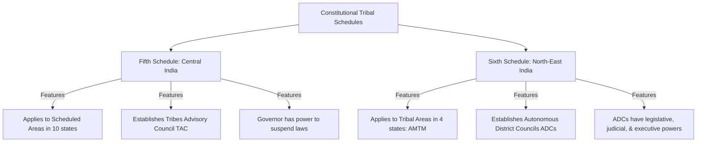
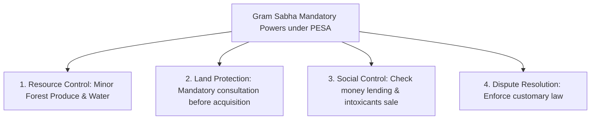
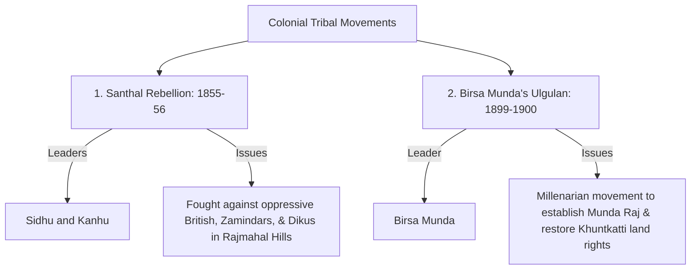

# PAPER II — UNITS 7.2, 8.1 & 9: TRIBAL POLICY, MOVEMENTS & INTEGRATION

---

## TOPIC 1: CONSTITUTIONAL SAFEGUARDS & ADMINISTRATIVE POLICIES (UNIT 7.2)

> [!NOTE]
> **Syllabus Mapping:**
> * Paper II, Unit 7.2: History of administration of tribal areas; tribal policies, plans, programmes of development and their implementation.
> * Paper II, Unit 7.2: Constitutional safeguards for Scheduled Tribes — Fifth and Sixth Schedules; PESA Act, 1996; Forest Policies and Forest Rights Act (FRA), 2006.

---

### I. TRIBAL SCHEDULES: FIFTH VS. SIXTH SCHEDULES
*The two primary constitutional frameworks providing administrative autonomy to tribal areas.*

> [!TIP]
> **Mnemonic for Sixth Schedule States:** **A M T M** (Assam, Meghalaya, Tripura, Mizoram).
> *Do not confuse M with Manipur! Think "A MTM ATM" to remember.*

| Comparative Dimension | Fifth Schedule | Sixth Schedule |
| :--- | :--- | :--- |
| **1. Geographic Scope** | Applies to Scheduled Areas in **10 states of Central and Western India** (AP, Telangana, Chhattisgarh, Gujarat, HP, MP, Jharkhand, Maharashtra, Odisha, Rajasthan). | Applies to specific Tribal Areas in **4 North-Eastern states** (Assam, Meghalaya, Tripura, Mizoram) — ***AMTM***. |
| **2. Administrative Body** | Establishes the **Tribes Advisory Council (TAC)** consisting of up to 20 members (3/4th must be ST MLAs in the state assembly). | Establishes **Autonomous District Councils (ADCs)** and Regional Councils (usually 30 members). |
| **3. Nature of Autonomy** | **Advisory.** The TAC advises the Governor. The Governor has the power to decide if state/central laws do not apply to Scheduled Areas. | **Legislative, Judicial, & Executive.** The ADCs act as "mini-states" inside the state, holding extensive powers to make laws and resolve disputes. |
| **4. Legislative Powers** | The TAC has no direct law-making powers. | ADCs can make laws on land, forests, canal water, marriage, inheritance, and social customs (subject to the Governor’s assent). |
| **5. Judicial Powers** | No special judicial structures; tribal disputes resolved via customary courts or standard judiciary. | ADCs can establish **Village Courts** and District Courts to try civil and criminal cases involving STs under tribal customary law. |

---

### II. PESA ACT, 1996 (PROVISIONS OF THE PANCHAYATS EXTENSION TO SCHEDULED AREAS)
*Known as the "Constitution within the Constitution" for tribal self-rule.*

* **The Objective:** To extend the provisions of Part IX of the Constitution (Panchayati Raj) to the Scheduled Areas (5th Schedule), while protecting and preserving tribal customary practices and self-governance.
* **The Core Shift:** It shifts power from the bureaucratic state directly to the **Gram Sabha (Village Assembly)**, composed of all adult members in a village:
* **Mandatory Powers of the Gram Sabha under PESA:**

> [!TIP]
> **Mnemonic for PESA Powers:** **C R L S** (Control Resources, Lead Society)
> * **C**onsultation (Land), **R**esource Ownership (MFP), **L**icensing (Mining), **S**ocial/Economic Control (Intoxicants, Moneylending).

1. **Mandatory Consultation:** Must be consulted before any land acquisition in Scheduled Areas for development projects, or before resetting/rehabilitating displaced persons.
2. **Resource Ownership:** Holds direct ownership over **Minor Forest Produce (MFP)** (bamboo, tendu leaves, honey).
3. **Licensing Power:** Mandatory approval required before granting prospecting licenses or mining leases for minor minerals in Scheduled Areas.
4. **Social & Economic Control:** Holds power to prevent land alienation, control local money lending, manage minor water bodies, and control the sale and consumption of intoxicants.

##### Value-Addition: The Landmark Niyamgiri Hills Case Study (Orissa Mining Corporation vs. Ministry of Environment & Forests, 2013)
To secure maximum marks in PESA/FRA questions, always cite the supreme judicial and democratic validation of tribal self-governance:
* **The Conflict:** The state-owned Orissa Mining Corporation (OMC) partnered with multinational giant **Vedanta Resources** to establish an open-cast bauxite mine in the pristine **Niyamgiri Hills** (Kalahandi and Rayagada districts, Odisha).
* **The Tribal Connection:** The Niyamgiri Hills are the ancestral home of the **Dongria Kondh** (a Particularly Vulnerable Tribal Group - PVTG). The Dongria Kondh worship the mountain peak as **Niyam Raja** (their supreme king and deity). Their entire economy, religious rituals, and cultural identity are structurally embedded in the preservation of the mountain forest ecology.
* **The Supreme Court Breakthrough (April 2013):** The Supreme Court of India passed a historic judgment, ruling that the **Gram Sabha** holds the absolute democratic right under **PESA 1996 and FRA 2006** to determine if the proposed mining project would violate their religious, cultural, and individual habitat rights.
* **The Democratic Veto:** Following the court order, the state government conducted formal referendum votes in **12 Gram Sabhas** representing the Dongria Kondh habitations. In a historic display of tribal solidarity and self-governance, **all 12 Gram Sabhas unanimously voted against** the mining project, rejecting the corporate offer.
* **The Result:** Based on the Gram Sabha resolutions, the Ministry of Environment, Forest and Climate Change (MoEFCC) formally canceled all environmental and forest clearances for the Vedanta mining project.
* **Anthropological Analysis:** The Niyamgiri case study is celebrated globally as the first successful implementation of **Free, Prior, and Informed Consent (FPIC)** (Article 32 of the UN Declaration on the Rights of Indigenous Peoples - UNDRIP) in India. It proved that under PESA, the Gram Sabha is not merely an advisory committee, but a powerful, democratic, self-governing entity capable of vetoing multinational corporate projects to protect indigenous sacred spaces.

---

### III. EVOLUTION OF INDIAN FOREST POLICIES & FRA, 2006

#### 1. The Historical Injustice (Colonial to Post-Independence Forest Acts)
* **Colonial Forest Acts (1878, 1927):** Declared state ownership over all forests, dividing them into *Reserved* and *Protected* zones for commercial timber exploitation. Traditional tribal forest rights (*Nistar* rights, firewood collection) were declared illegal, turning tribes into "encroachers" on their own ancestral lands.
* **National Forest Policy, 1952:** Continued this structural bias, declaring that "national interest" (industrial timber/mining) was superior to the local forest rights of tribal populations.

#### 2. The Paradigm Shift (Forest Rights Act - FRA, 2006)
*Formal Title: The Scheduled Tribes and Other Traditional Forest Dwellers (Recognition of Forest Rights) Act, 2006.*
* **The Objective:** To correct the historical injustice committed against forest-dwelling tribes by legally recognizing and vesting their traditional forest rights.
* **The Core Rights Recognized:**
  > **Mnemonic:** **I C H** (Indians Conserve Habitats)
  > * **I**ndividual Forest Rights, **C**ommunity Forest Rights, **H**abitat Rights.
  * **Individual Forest Rights (IFR):** Right to self-cultivation and habitation on forest land up to **4 hectares** per family, provided they resided there before December 13, 2005.
  * **Community Forest Rights (CFR):** Right of ownership, access to collect, use, and dispose of **Minor Forest Produce (MFP)**; right to protect, regenerate, and manage community forest resources for sustainable use.
  * **Habitat Rights:** Special protection over traditional habitats for PVTGs.

---

### IV. UPSC PREVIOUS YEAR QUESTIONS (PYQs) & ANSWER BLUEPRINTS

---

#### PYQ 1: Compare the administrative frameworks of the Fifth and Sixth Schedules of the Indian Constitution. [20 Marks]

* **Introduction (Approx. 40 words):** The Fifth and Sixth Schedules under **Article 244** of the Indian Constitution represent the two primary administrative frameworks designed to protect tribal populations from exploitation while securing their socio-cultural and regional autonomy.
* **Body Skeleton:**
  * *Geographic Division:* 5th Schedule applies to Scheduled Areas in 10 states of Central/Western India. 6th Schedule applies to Tribal Areas in 4 North-Eastern states (Assam, Meghalaya, Tripura, Mizoram - AMTM).
  * *Structure of Governance:* 5th Schedule establishes the **Tribes Advisory Council (TAC)** (advisory body to the Governor). 6th Schedule establishes **Autonomous District Councils (ADCs)** (semi-sovereign regional bodies).
  * *Degree of Autonomy (Advisory vs. Legislative):* Detail the contrast. TAC has no direct law-making powers. ADCs hold extensive legislative (make laws on land/marriage), executive, and judicial powers (establish Village Courts enforcing customary laws).
  * *Role of the Governor:* Under the 5th Schedule, the Governor holds absolute, proactive power to suspend laws. Under the 6th Schedule, the Governor acts predominantly on the advice of the ADC and state cabinet.
  * *Use a direct comparative table (refer to Section I).*
* **Conclusion (Approx. 40 words):** In summary, while the Fifth Schedule provides a paternalistic, protective framework for Central Indian tribes under the Governor’s guidance, the Sixth Schedule provides a highly autonomous, self-governing administrative structure tailored to protect the distinct, democratic traditions of North-Eastern tribes.

---
---

## TOPIC 2: TRIBAL MOVEMENTS & ETHNICITY (UNITS 8.1 & 9)

> [!NOTE]
> **Syllabus Mapping:**
> * Paper II, Unit 8.1: Tribal movements in India — Colonial and post-independence phases; Millenarian and messianic movements; political and resource-based movements.
> * Paper II, Unit 9: The concept of ethnicity; ethnic conflicts and political developments; regionalism and national integration.

---

### I. CLASSIFICATION OF TRIBAL MOVEMENTS IN INDIA

Indian tribal movements are classified historically into two distinct phases, guided by different structural issues:

#### 1. Colonial Phase (Pre-1947)
* **The Triggers:** Severe British administrative expansion, imposition of permanent land settlements, introduction of non-tribal landlords (*dikus*) and moneylenders, forest enclosures (1878 Act), and Christian missionary activities disrupting tribal culture.
* **Characteristics:** Highly localized, armed rebellions, often led by charismatic, messianic leaders claiming supernatural powers (**Millenarian Movements**) seeking to restore a mythical golden age.
* **Key Historical Examples:**

* **Birsa Munda's Ulgulan (The Great Tumult - 1899-1900):**
  * *The Issue:* The British abolished the traditional **Khuntkatti** (joint, ancestral land ownership) system of the Mundas, replacing it with private zamindari systems.
  * *The Millenarian Leader:* Birsa Munda declared himself a messenger of God, claiming that British bullets would turn to water. He called for the revival of traditional Munda religion (banning animal sacrifice, worshiping one god), the expulsion of *dikus*, and the establishment of an independent **Munda Raj**.
  * *The Result:* Suppressed militarily by the British, but forced the enactment of the **Chota Nagpur Tenancy Act (1908)**, which legally recognized and protected Khuntkatti land rights.

#### 2. Post-Independence Phase (Post-1947)
* **The Triggers:** Development-induced displacement, demand for separate states, language preservation, and socio-political autonomy within the Indian Union.
* **Key Historical Examples:**
  * **Northeast Separatist Movements:** Armed insurgencies by Nagas (led by Phizo) and Mizos demanding sovereign states or high autonomy, rooted in distinct ethnic identities.
  * **Autonomy / Resource Movements (Jharkhand Movement):** A prolonged, democratic political movement in Central India demanding a separate state to protect tribal resources (forests, minerals) and identity from plains domination, culminating in the creation of Jharkhand state in 2000.

---

### II. ETHNICITY, REGIONALISM & NATIONAL INTEGRATION (UNIT 9)

* **Ethnicity:** The subjective feeling of belonging to a distinct social group based on shared cultural traits (language, religion, ancestral history, customs).
* **Ethnic Conflict:** Arises in tribal zones when there is a perceived threat of resource domination by outsiders (e.g., ethnic clashes between Bodos and immigrant Muslims in Assam, or Meiteis and Kukis in Manipur).
* **The Challenge of National Integration:**
  * **Forced Assimilation (Ghurye’s stance):** Artificially erases tribal identity, causing severe alienation and contra-acculturation insurgencies.
  * **Extreme Isolation:** Can foster secessionist trends and geopolitical instability.
  * **The Integrationist Resolution (Tribal Panchsheel):** National integration does not mean *cultural homogenization*. 
    > [!NOTE]
    > **Beginner's Analogy:** Imagine making soup. Ghurye's Assimilation is like a blender—everything is crushed into a uniform liquid (loss of tribal identity). Elwin's Isolation is like keeping all ingredients in separate jars. Nehru's Integration is the **"Salad Bowl"**—all the ingredients (cultures) mix together in the same bowl (the Indian Union), but a tomato remains a tomato and a cucumber remains a cucumber (preservation of unique cultural flavor).
    India must be integrated like a **"salad bowl"** (pluralistic coexistence) rather than a **"melting pot"** (coercive uniformity), respecting tribal autonomy under the 5th and 6th Schedules while keeping them economically and politically integrated with the Indian Union.

---

### III. UPSC PREVIOUS YEAR QUESTIONS (PYQs) & ANSWER BLUEPRINTS

---

#### PYQ 1: Critically analyze Birsa Munda's Ulgulan as a millenarian movement during the colonial phase. [20 Marks]

* **Introduction (Approx. 40 words):** Birsa Munda's *Ulgulan* (The Great Tumult) of 1899–1900 is the archetypal **Millenarian and Messianic Movement** of tribal India. It arose as a defensive, armed revolt by the Munda tribe of Jharkhand against the double exploitation of British colonial rules and plains-based *dikus*.
* **Body Skeleton:**
  * *Identify the Triggers:* The erosion of the traditional **Khuntkatti** (communal landholding) system, the introduction of cash rent, forced labor (*begar*), and missionary activities that disrupted Munda religious structures.
  * *The Messianic Character of Birsa Munda:* Detail how Birsa declared himself *Dharti Aba* (Father of the Earth). He claimed divine powers to heal diseases and asserted that the arrows of the Mundas would defeat British guns.
  * *The Millenarian Vision:* He preached a return to a "Golden Age" of the past. He established a new monotheistic religious code (Birsa Dharam), banning sacrifices, emphasizing purity, and calling for the expulsion of all British, zamindars, and missionaries to establish an independent **Munda Raj**.
  * *The Structural Result:* Although militarily suppressed by the British and resulting in Birsa's death in prison, the movement successfully forced the colonial state to pass the landmark **Chota Nagpur Tenancy Act (1908)**, legally banning non-tribal land transfers and protecting customary landholdings.
* **Conclusion (Approx. 40 words):** Birsa Munda’s Ulgulan successfully demonstrated that tribal movements are not primitive, irrational outbursts, but highly organized, culturally grounded, and millenarian struggles that successfully defended tribal autonomy and ancestral land rights against colonial encapsulation.
