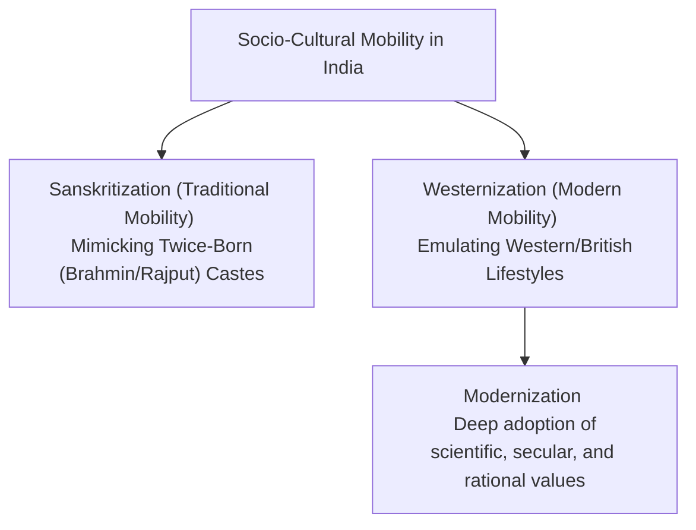
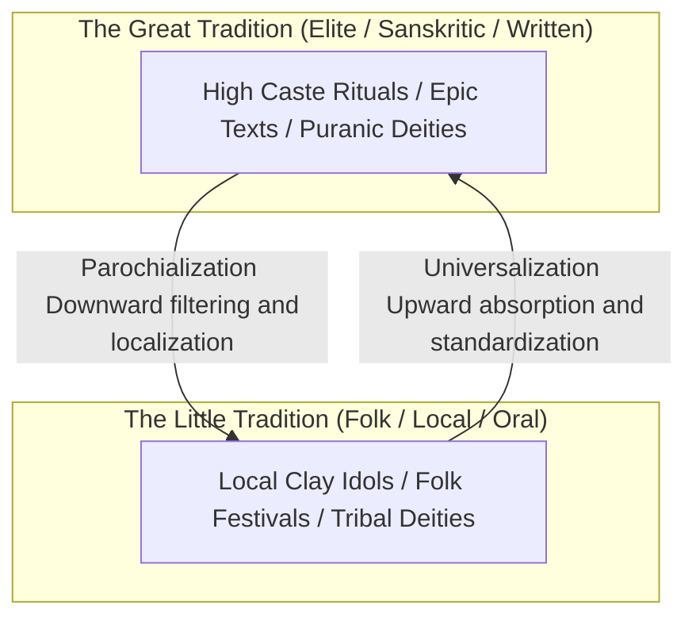
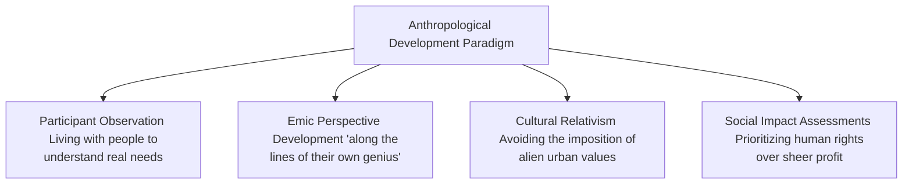

# PAPER II — UNITS 5.3, 8.2 & 9: SOCIAL CHANGE, TRIBE & NATION-STATE, AND APPLIED ANTHROPOLOGY

---

## TOPIC 1: EXOGENOUS PROCESSES OF SOCIAL CHANGE (UNIT 5.3)

> [!NOTE]
> **Syllabus Mapping:** 
> * Paper II, Unit 5.3: Exogenous processes of socio-cultural change in Indian society — Westernization, Modernization; Inter-play of Little and Great traditions; Panchayati Raj and social change; Media and Social change.
> * Connects with: Paper I, Unit 6 (Anthropological Theories), Unit 2.1 (Culture change).

---

### I. WESTERNIZATION & MODERNIZATION (M.N. SRINIVAS & YOGENDRA SINGH)

M.N. Srinivas conceptualized **Westernization** and **Sanskritization** as twin, co-occurring processes of social mobility in India. Sociologist Yogendra Singh later expanded this to the broader process of **Modernization**.

#### 1. Westernization
* **Definition:** The changes brought about in Indian society and culture as a result of over **150 years of British rule**, spanning technology, institutions, ideology, and values.
* **Levels of Westernization:**
  * *Primary level:* Affects the small, educated elite who came into direct contact with the British (primarily upper castes like Brahmins, Kayasthas).
  * *Secondary level:* Affects those who came into contact with the primary westernized elite (middle castes, urban workers).
  * *Tertiary level:* General seepage of western material items (railways, clothing, printed media) to rural masses.
* **The Twin Process Dilemma:** Lower castes, in their bid to raise their ritual status, are aggressively **Sanskritizing** (giving up beef-eating, bride price, and adopting vegetarianism and dowry). Simultaneously, upper castes are **Westernizing** (discarding traditional purificatory rituals, taking to English education, and adopting secular habits). This creates a highly dynamic and seemingly contradictory cultural landscape.

#### 2. Modernization
* **Definition:** A broader, universalistic process that involves the cognitive adoption of **scientific rationality, secularism, individualism, and democratic values**.
* **Yogendra Singh's Synthesis (*Modernization of Indian Tradition*, 1973):**
  * Singh proved that modernization is not synonymous with Westernization. 
  * **Orthogenetic vs. Heterogenetic Change:** Indian tradition has undergone orthogenetic (internal growth, e.g., Bhakti movement) and heterogenetic (external influence, e.g., Islamic and Western impact) modernization.
  * **The Continuity of Tradition:** Modernization in India does not destroy tradition; rather, tradition acts as a reservoir that adapts to and absorbs modern institutions (e.g., caste associations using modern political lobbying and websites to strengthen their traditional solidarity).

#### 3. Value Addition: Contemporary Dynamics & Critiques (UPSC Mains)
* **Contemporary Sanskritization:** Today, it is less about rigid ritual imitation and more about identity negotiation. Examples include lower castes patronizing large-scale temple building or adopting vegetarianism to claim social respectability.
* **Subaltern Critique:** Dalit scholars criticize Sanskritization for reinforcing Brahminical hegemony rather than dismantling the caste hierarchy. In modern democratic India, "Political Mobilization" (via caste Mahasabhas) and "Westernization" have largely replaced Sanskritization as primary drivers of upward mobility.
* **De-Sanskritization:** The reverse process where higher castes adopt practices of lower castes (e.g., consumption of meat/liquor) to align with modern, secular, or egalitarian trends.

---

### II. INTER-PLAY OF LITTLE AND GREAT TRADITIONS (ROBER REDFIELD, McKIM MARRIOTT & MILTON SINGER)

This framework provides a highly systematic method to analyze the continuous, two-way cultural exchange between localized folk cultures and the grand civilizational mainstream of India.

#### 1. Robert Redfield's Original Concepts
* **Little Tradition:** Localized, unwritten, orally transmitted, informal peasant/tribal traditions. Reflective of the uneducated masses.
* **Great Tradition:** National, written, formal, elite, highly reflective traditions. Transmitted through scriptures, epic texts (Ramayana, Mahabharata), and institutionalized learning.

#### 2. McKim Marriott's Kishangarhi Study (U.P., India)
Marriott conducted detailed fieldwork in the village of **Kishangarhi** and formulated the twin concepts of *Universalization* and *Parochialization* to describe the dynamic interplay of these traditions:

* **Universalization (Upward Exchange):**
  * *Definition:* The process by which elements of the *Little Tradition* (local deities, folk festivals) spread upwards, become standardized, and are absorbed into the *Great Tradition*.
  * *Example:* The local folk festival of **Saluno** in Kishangarhi (where sisters tie threads on their brothers' heads to ward off evil) was absorbed, standardized, and universalized as the pan-Indian Sanskritic festival of **Raksha Bandhan**.
  * *Example 2:* The absorption of regional folk/tribal deities (e.g., Lord Jagannath of Odisha, originally a tribal tree-god) into the Great Tradition of Vaishnavism.
* **Parochialization (Downward Exchange):**
  * *Definition:* The process by which elements of the *Great Tradition* (scriptural, elite texts) filter down, are adapted, localized, and simplified to fit the cognitive map of the *Little Tradition*.
  * *Example:* The high-caste Sanskritic solar deity and the abstract ritual of **Kartik Snan** filtered down to Kishangarhi village, where it was parochialized as the local folk festival of **Saurti**, where clay idols of the goddess are worshipped using localized folk songs.

#### 3. Milton Singer's Madras Study
Singer studied Madras (Chennai) and verified that the Great Tradition is actively transmitted to the masses through **"cultural performances"** (dances, plays, bhajans). He introduced the concept of **"compartmentalization"**—modern Indians compartmentalize their lives, practicing strict secular/industrial logic in their offices during the day, and returning to deep traditional Sanskritic rituals at home in the evening.

---

### III. IMPACT OF PANCHAYATI RAJ & MEDIA ON SOCIAL CHANGE

#### 1. Panchayati Raj (73rd Constitutional Amendment Act, 1992) & PESA (1996)
The introduction of a decentralized 3-tier local self-government system, specifically with **33% reservation for women and proportional reservation for SCs/STs**, has triggered massive structural changes:
* **Empowerment of the Margins:** Shifted political power from the traditionally dominant castes (e.g., Thakurs, Jats) to the marginalized classes (SCs, STs, and OBCs).
* ** Rise of the *Sarpanch Pati*:** While structural patriarchy initially led husbands of elected women to run the panchayats, successive terms have seen the emergence of genuine, independent grassroots female leadership.
* **Caste Conflict:** The transition of power has also led to heightened caste friction and violence in rural areas, as dominant castes resist the loss of political control.
* **Value Addition - PESA Act 1996:** The Panchayats (Extension to Scheduled Areas) Act bridges statutory Panchayats with traditional tribal councils by empowering the *Gram Sabha*. 
  * *Success Case Studies:* In districts like **Surguja (Chhattisgarh)** and **West Singhbhum (Jharkhand)**, empowered Gram Sabhas have successfully managed minor forest produce (MFP) and resisted illegal land encroachment.
  * *Challenges:* Dilution by state laws and bureaucratic interference often undermine the Gram Sabha's statutory authority.

#### 2. Media and Social Change
* **Social Penetration:** Mobile internet and television have bypassed traditional literacy barriers in rural India, exposing isolated communities to alternative lifestyles, rights, and global discourses.
* **Cultural Homogenization vs. Localization:** While media standardizes a "national culture," it has also triggered a massive revival of regional dialects, tribal music, and folk arts through digital platforms.
* **Secularization of Rituals:** Traditional religious festivals (e.g., Durga Puja, Ganesh Chaturthi) have been transformed into massive, media-mediated secular spectacles, prioritizing entertainment and social gathering over strict Sanskritic purity.

---
---

## TOPIC 2: TRIBE AND NATION-STATE (UNIT 8.2)

> [!NOTE]
> **Syllabus Mapping:** 
> * Paper II, Unit 8.2: Tribe and nation state — a comparative study of tribal communities in India and other countries.
> * Connects with: Paper II, Unit 6.1 (Tribal Situation in India).

---

### I. TRIBE AND NATION-STATE: A COMPARATIVE STUDY

The relationship between indigenous tribal communities and the modern nation-state is one of structural tension, characterized by different historical policies of assimilation, integration, or exclusion.

| Country | Key Policy Phase | Legal Framework | Contemporary Tribal Status / Challenges |
| :--- | :--- | :--- | :--- |
| **India** | **Integrationist (Middle Path)** | **5th & 6th Schedules, PESA (1996), FRA (2006)** | Protected tribal autonomy while integrating them into the democratic framework. Face land alienation, displacement, and resource exploitation. |
| **USA** | **Tribal Sovereignty / Reservation** | **Indian Reorganization Act (1934)** | Recognized Native American tribes as "domestic dependent nations" with their own laws, police, and casinos on reservations. Face high poverty, substance abuse. |
| **Canada** | **Reconciliation & Self-Govt** | **Indian Act (1876), Section 35 (1982)** | Moving from forced assimilation (residential school trauma) to active reconciliation, land claims, and self-governance for First Nations. |
| **Australia** | **Assimilation to Recognition** | **Native Title Act (1993)** | Historically brutal (the "Stolen Generations"). Modern policy focuses on "Closing the Gap" in health/education and recognizing native title lands (e.g., Uluru). |

* **Key Takeaway:** While Western nation-states (USA, Canada, Australia) historically pushed for **complete physical exclusion** (forcing tribes into isolated reservations) or **forced assimilation** (destroying native language and culture), India adopted **Nehru's Integrationist Middle Path (Tribal Panchsheel)**, which protects tribal land and autonomy while integrating them into the democratic nation-state.

---
---

## TOPIC 3: ROLE OF ANTHROPOLOGY in tribal and rural development (UNIT 9.2 & 9.3)

> [!NOTE]
> **Syllabus Mapping:** 
> * Paper II, Unit 9.2: Role of anthropology in tribal and rural development.
> * Paper II, Unit 9.3: Contributions of anthropology to the understanding of regionalism, communalism and ethnic and political movements.
> * Connects with: Paper I, Unit 12 (Applied Anthropology).

---

### I. ROLE IN TRIBAL & RURAL DEVELOPMENT (THE ANTHROPOLOGICAL UNIQUNESS)

Formal bureaucrats view development purely as economic indicators (GDP, money spent, infrastructure built). Anthropologists offer a **holistic, emic, and bio-cultural alternative**:

#### 1. Key Contributions of Anthropologists
* **L.P. Vidyarthi's Action Anthropology:** Championed that anthropologists must not remain passive observers; they must actively plan, implement, and evaluate developmental programs alongside the tribal communities.
* **Verrier Elwin's National Park Policy (Colonial/Early Independent India):** Prevented the immediate, destructive exploitation of Central Indian tribes by advocating for restricted access to tribal areas to allow them to stabilize economically.
* **Designing Multilingual Education (MLE):** Anthropologists designed school textbooks in native tribal dialects (e.g., Santhali, Gondi) using the regional script, reducing primary school dropout rates and preserving tribal languages.

#### 2. Value Addition: The Virginius Xaxa Committee (2014)
To substantiate answers on tribal problems (indebtedness, land alienation), cite the High-Level Committee chaired by Prof. Virginius Xaxa:
* **Persistent Marginalization:** Highlighted that despite decades of development, tribes remain the most disadvantaged due to the failure of public service delivery.
* **Land Alienation:** Concluded that state-sponsored "development projects" (dams, mines) are the primary drivers of involuntary displacement, often violating PESA and FRA (Forest Rights Act) mandates.
* **Rights-Based Approach:** Recommended strict enforcement against land transfer to non-tribals, livelihood diversification (agro-based training), and ensuring tribal development is participatory, not top-down.

---

### II. CONTRIBUTIONS TO UNDERSTANDING CONTEMPORARY INDIAN ISSUES

Anthropology provides deep, structural insights into the socio-political crises gripping modern India:

#### 1. Regionalism
* **Anthropological Insight:** Regionalism is not just a political threat; it is a search for cultural and economic self-determination. It is triggered when economic development is unevenly distributed, leaving culturally distinct regions (e.g., Jharkhand, Chhattisgarh) feeling internally colonized by the dominant state center.
* **The Solution:** Anthropologists successfully advocated for the creation of **Autonomous District Councils (6th Schedule)** to satisfy regional aspirations without fragmenting the nation-state.

#### 2. Communalism
* **Anthropological Insight:** Communalism is the modern manipulation of religious identities for political and economic advantage, often replacing the traditional, harmonious **Jajmani interdependence** of villages with competitive religious polarization.
* **Singer's Madras Model:** Proves that modernization does not eradicate religion, but rather compartmentalizes it, which can be manipulated by modern communal politicians.

#### 3. Ethnic & Political Movements
* **Anthropological Insight:** Ethnic unrest (e.g., the Naga movement or Gorkhaland demand) arises from the **clash of values between a centralized bureaucratic nation-state and indigenous customary laws**. Customary rights over land and forests (*Jal, Jangal, Jameen*) are viewed by tribes as sacred ancestral heritage, whereas the state views them purely as state property.
* **The Solution:** Customary laws must be legally recognized and protected (e.g., PESA, 1996 and Forest Rights Act, 2006) to channel ethnic unrest into constructive democratic participation.

---

### III. PYQS & CLASS EXERCISES

1. **Compare the indigenous tribal policy of India with that of the USA.** Highlight the constitutional safeguards. (15 Marks)
2. **"Universalization and Parochialization are two sides of the same civilizational coin."** Elucidate using McKim Marriott's किशनगढ़ी study. (20 Marks)
3. **Discuss the role of anthropologists as "social doctors" in tribal and rural development.** (15 Marks)

---

#### PYQ 4: Sanskritization is a culturally bound concept. Critically comment to assess the strength and limitation of this concept in developing a theoretical framework to study social change. [2023, 20 Marks]
* **Introduction:** Coined by M.N. Srinivas, Sanskritization refers to the process by which a lower Hindu caste changes its customs, rituals, and ideology in the direction of a higher, frequently "twice-born" (Brahmin/Rajput) caste.
* **Body (Strength and Limitation):**
  * *Strength as a Theoretical Framework:* It was revolutionary because it shifted Indian sociology from static, text-based (Indological) models to dynamic, field-based observations. It proved that the caste system was not entirely rigid; it allowed for positional mobility over generations. It brilliantly explained the cultural mimicry (vegetarianism, teetotalism, adopting sacred thread) seen across India.
  * *Limitation (Culturally Bound):* 
    * It is intrinsically bound to the Hindu caste hierarchy. It cannot explain social mobility among non-Hindus (Muslims, Christians) or tribal communities outside the caste fold.
    * **Dalit Critique:** It normalizes Brahminical culture as the "ideal" and ignores the structural violence of the caste system. It measures progress by how closely one imitates the oppressor.
    * **Obsolescence:** In modern democratic India, lower castes seek mobility not by mimicking Brahmins (Sanskritization), but through political mobilization, reservation policies, and Westernization (secular education).
* **Conclusion:** While Sanskritization is culturally bound to traditional Hinduism and is increasingly obsolete in the era of democratic identity politics, it remains a foundational anthropological concept that successfully mapped the historical cultural dynamics of rural India.

#### PYQ 5: Discuss how the elements of little and great traditions combine in the emergence of social/political/religious movements giving any one example to illustrate the issue. [2019, 20 Marks]
* **Introduction:** Robert Redfield's twin concepts of "Little Tradition" (local, oral, folk) and "Great Tradition" (national, written, elite) do not exist in isolation. They constantly interact (Universalization and Parochialization). This interplay is highly visible in the emergence of socio-religious movements in India.
* **Body (The Interplay Mechanism):**
  * *The Mechanism:* When a socio-religious movement seeks mass appeal, it cannot rely solely on abstract, elite Great Tradition texts. It must deliberately absorb elements of the Little Tradition to mobilize the rural/tribal peasantry.
  * *Example: The Bhakti Movement / Jagannath Cult in Odisha:*
    * The Great Tradition of mainstream Hinduism (Vaishnavism) sought to expand its influence in tribal-dominated eastern India.
    * It absorbed a local tribal wooden deity (Nilamadhava, worshipped by the Savara tribe) and universalized it as **Lord Jagannath** (an avatar of Vishnu).
    * The resulting movement combined the high philosophy of the Gita (Great Tradition) with the egalitarian, caste-free temple rituals and folk songs of the tribes (Little Tradition). 
    * Politically, the Gajapati kings of Odisha used this hybrid cult to legitimize their rule over both Brahminical elites and tribal subjects.
* **Conclusion:** The success of any mass movement in India depends on this synthesis. By blending the emotional resonance of the Little Tradition with the structural legitimacy of the Great Tradition, movements bridge the massive gap between the rural masses and the elite.
