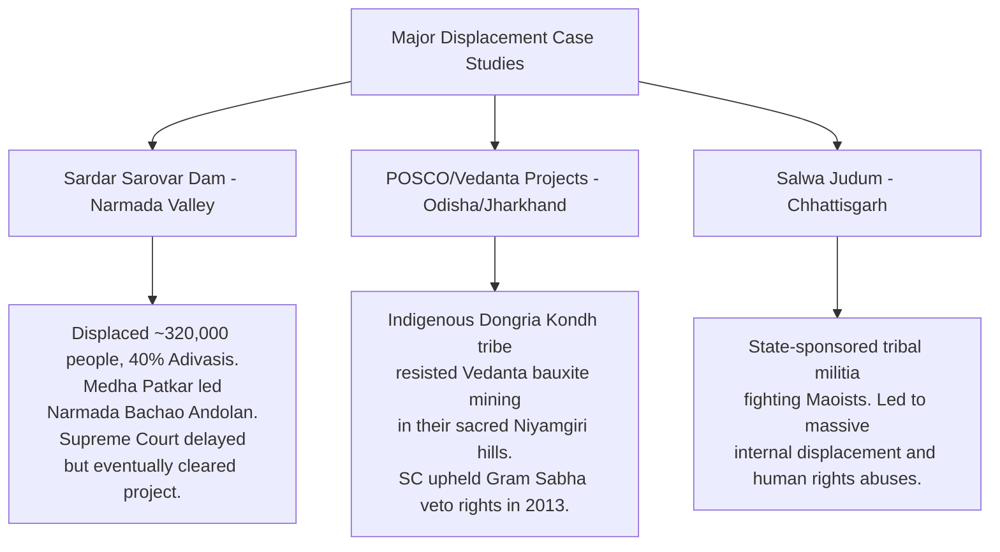

# Problems of Tribal Communities and Impact of Development Projects

## Syllabus Mapping
* Paper II, Unit 6.2: Problems of the tribal communities — land alienation, poverty, indebtedness, health, education.
* Paper II, Unit 6.3: Developmental projects and their impact on tribal communities — displacement, rehabilitation.

---

## 1. The Centrality of Land to Tribal Identity

For tribal communities, land is not merely an economic asset — it is the **foundation of their socio-cultural, spiritual, and political existence.**

* **Cultural Identity:** The forest, hills, and rivers are inhabited by ancestors and deities. Loss of land is tantamount to the loss of their spiritual world.
* **Economic Survival:** Their entire economy (food, fuel, fodder, medicine) depends on access to forest and common lands.
* **Political Structure:** Traditionally, land was *community-owned*; the Gram Sabha (village assembly) governed its use. This egalitarian system collapses when land is privatized.

> [!IMPORTANT]
> **Verrier Elwin's Key Observation:** Tribal communities represent the "original children of the soil." The fundamental problem of tribal India is not the poverty of people but the poverty of the *land* — land alienated from the people who had lived on it for centuries.

---

## 2. Land Alienation

Land alienation is the **single most devastating problem** faced by tribal communities, making them the most vulnerable group in India.

### Mechanisms of Land Alienation
1. **Legal Loopholes:** Though Article 244 (5th Schedule) mandates that State Governments frame laws to *restrict transfer of land in Scheduled Areas*, these laws are routinely circumvented by:
   * Fictitious/fraudulent sales under coercion or intoxication.
   * Non-tribal money-lenders using land as collateral and foreclosing on it.
   * Transfer to non-tribal corporations via "benami" transactions.
2. **Development Projects (Dams, Mines, Industries):** See Section 5.
3. **Money-lender and Trader Manipulation:** Tribal people, unfamiliar with the market economy, are cheated through false weighing, adulteration, and inflated interest rates.
4. **Encroachment by Outsiders (Diku):** Non-tribal settlers, with better knowledge of legal processes, formally register community lands in their own names.

### Scale of the Problem
* According to the **Dhebar Commission (1960-61)**, land alienation was widespread across all Scheduled Area states.
* The **Xaxa Committee (2014)** re-confirmed that land alienation is the root cause of all other tribal problems.
* States with highest alienation: Andhra Pradesh, Telangana, Gujarat, Maharashtra, Jharkhand, Chhattisgarh.

---

## 3. Indebtedness

Debt is a **structural trap** that perpetuates tribal poverty and land alienation.

* **Why Tribal People Incur Debt:** For agricultural needs (seeds, equipment), ritual expenses (marriages, funerals), and medical emergencies.
* **Sources of Credit:** Tribal communities have virtually no access to formal banking. They rely on local money-lenders (*Sahukars*, *Mahajans*), who charge usurious interest rates (50% to 150% per annum).
* **The Debt-Land Nexus:** Once indebted, the only collateral is land. When debt cannot be repaid, the money-lender acquires the land, creating a cycle of dispossession.
* **Bonded Labour (Hali, Kamia, Sagri Systems):** Debt often leads to **bondage**, where the tribal person (and their family) works for the creditor for free, indefinitely, to repay a debt that never reduces.

---

## 4. Poverty, Health, and Education

### The Poverty Trap
Tribal communities constitute approximately **8.6% of India's population** (2011 Census) but account for a disproportionate share of the country's poor:
* **NFHS-5 Data:** ST households have the highest rates of multi-dimensional poverty.
* **Poverty Causes:** Land alienation, displacement, low wages, poor connectivity, and lack of market access.

### Health Crisis
| Health Indicator | Tribal Community Reality |
| :--- | :--- |
| **Sickle Cell Anaemia** | Highly prevalent among Gonds, Munda, Oraon communities. A classic case of a genetic disease maintained by the *malaria-resistance advantage* for heterozygous carriers. |
| **Malnutrition** | Malnutrition rates (underweight, stunting, wasting) among ST children are the **highest in India**, often surpassing crisis levels defined by WHO. |
| **Malaria** | Tribal areas account for ~50% of all malaria deaths in India despite housing ~8% of the population. |
| **Tuberculosis (TB)** | High prevalence due to poor ventilation, overcrowding, and nutritional deficiency. |
| **Access to Healthcare** | The tribal belt (Central Indian Tribal Belt, CITB) has the worst doctor-patient ratios in the country. Traditional healers (*Gunia, Ojha, Disari*) remain the first resort. |

### Education Crisis
* **Literacy:** While national ST literacy improved (47% in 2001 to 59% in 2011), it remains far below the national average (~74%).
* **Dropout Rates:** Extremely high at secondary level. Contributing factors: distance from schools, irrelevant curriculum (not in mother tongue), need for child labor, poverty.
* **Language Barrier:** Education is imparted in the official state language (Hindi, Telugu, etc.), not in tribal languages (Santhali, Gondi, Mundari). This creates a fundamental alienation from education.
* **Constitutional Provision:** Article 350A directs states to provide primary education in the mother tongue.

> [!TIP]
> **The Ashram School Model:** The Government established residential Ashram Schools (*Eklavya Model Residential Schools* - EMRS) for tribal children to provide free quality education. However, many suffer from poor infrastructure, teacher absenteeism, and a non-tribal curriculum.

---

## 5. Developmental Projects and Displacement (Unit 6.3)

This is the **most important and frequently examined** topic in Paper II.

### The Development-Displacement Paradox
India's massive post-independence development projects (large dams, mines, industries, wildlife sanctuaries) have been overwhelmingly located in **tribal homelands** — the forested highlands of Central, Eastern, and North-Eastern India — because these areas are rich in water, minerals, and forests.

> [!NOTE]
> **Nehru's Tragic Irony:** Nehru called the Bhakra-Nangal Dam "a temple of modern India." But Dalit and Adivasi communities — who built these temples and were displaced by them — called themselves "the people of God's own country who were sacrificed at the altar of a false god."

### Scale of Displacement
| Development Project Type | Estimated ST Displacement Share |
| :--- | :--- |
| Large Dams (Sardar Sarovar, Hirakud, Pong, etc.) | ~40% of all displaced persons are STs |
| Mining and Industrial Projects (Tata, POSCO, Vedanta) | Extremely high in Jharkhand, Odisha, Chhattisgarh |
| Wildlife Sanctuaries & National Parks | Thousands of villages "relocated" |

* **Total Displaced (1947-2000):** Walter Fernandes estimates ~60 million persons have been displaced in India for development since independence. Approximately **40-50% are Adivasis**, who constitute only 8% of the population.

### Consequences of Displacement
1. **Economic Destitution:** Loss of land, forest, and livelihood without adequate compensation.
2. **Cultural Destruction:** Displacement from ancestral land destroys the community's spiritual geography, social networks, and customary institutions.
3. **Failure of Rehabilitation:** The official "Resettlement and Rehabilitation (R&R)" packages routinely fail:
   * Cash compensation is quickly exhausted.
   * New resettlement areas lack social cohesion, community, and access to nature.
   * Displaced people often end up in urban slums.
4. **Rise of Left-Wing Extremism (Naxalism):** The failure to address land alienation and developmental displacement is widely recognized as a key **root cause of Naxalism** in the Red Corridor (Chhattisgarh, Jharkhand, Odisha, Telangana).

### Key Case Studies

### Legal Protections Against Displacement
1. **Land Acquisition, Rehabilitation and Resettlement (LARR) Act, 2013:** Requires Social Impact Assessment (SIA), Gram Sabha consent in Scheduled Areas, and minimum compensation of 4x market value for rural land acquisition.
2. **Forest Rights Act (FRA), 2006:** Grants Individual Forest Rights (IFR) and Community Forest Rights (CFR) to tribal communities, partly recognizing their historical injustice.
3. **PESA Act, 1996:** Grants the Gram Sabha power to be consulted before land acquisition in Scheduled Areas.

---

## 6. The Problem of Political Leadership and Voice

Tribal communities face a fundamental **representation gap.** While they have constitutional reservations (ST seats in Parliament and State Assemblies), the political elite that emerges is often co-opted by mainstream political parties and disconnected from grassroots tribal concerns.

* **The Denotified Tribe (DNT) Problem:** Communities like the Sansis, Pardhis, and Banjaras, formerly listed under the Criminal Tribes Act (1871) by the British (repealed 1952), continue to face deep social stigma and police harassment, lacking both ST status and any effective advocacy.
* **Non-Governmental Organizations (NGOs):** Civil society organizations (e.g., AIUFWP, Ekta Parishad) play a crucial role in legal advocacy, conscientization, and community organizing, but face increasing government pressure and legal restrictions.
