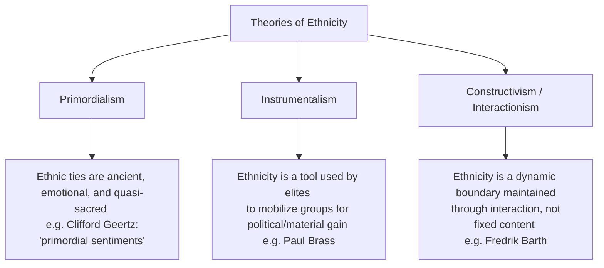

# Ethnicity, Ethnic Conflicts, Regionalism and Communalism

## Syllabus Mapping
* Paper I, Unit 9.3: Contributions of anthropology to the understanding of regionalism, communalism and ethnic and political movements.
* Paper II, Unit 7.3: Ethnicity and Ethnic Conflicts
* Paper II, Unit 8.2: Tribe and Nation State

---

## 1. The Concept of Ethnicity

**Ethnicity** is the sense of collective identity based on shared characteristics — language, religion, culture, history, ancestry, or territory — that distinguish a group from others. It is a relational concept: it becomes salient and politically charged primarily in *inter-group interaction*.

> [!NOTE]
> **Key Shift:** Ethnicity was once conflated with race (biological descent). Modern anthropology treats ethnicity as primarily a **social and political construct** — not a fixed biological reality — that is continually negotiated, activated, and contested.

### Theoretical Perspectives on Ethnicity

---

## 2. Key Theoretical Frameworks (UPSC Must-Know)

### A. Fredrik Barth — The Boundary Approach
**Key Work:** *Ethnic Groups and Boundaries* (1969).

Barth revolutionized ethnicity studies by shifting focus from the *content* of culture (what people believe/practice) to the *boundaries* that separate groups. His argument:
1. Ethnic groups define themselves by **contrasting themselves with "Others."** The boundary (not the content) is what matters.
2. **Self-ascription and ascription by others** are the dual mechanisms that maintain ethnic identity.
3. Cultural traits are not fixed; they can change. But the boundary persists as long as the group perceives itself as distinct.

> [!IMPORTANT]
> **Barth's Core Insight for UPSC:** Ethnicity is not about what you *are* internally, but about how you are *classified* relative to others. This explains why ethnic identity is **situational and fluid** — the same person might identify primarily by caste in one context (a village panchayat), by religion in another (a communal riot), and by region in another (a job in Delhi).

### B. Paul Brass — The Instrumentalist / Elite Competition Model
**Key Work:** *Ethnicity and Nationalism* (1991); *The Production of Hindu-Muslim Violence in Contemporary India* (2003).

Brass argues that ethnic identities are not ancient or primordial, but are **deliberately constructed and activated by political elites** for competitive purposes:
1. Elites (politicians, religious leaders, journalists) selectively use cultural symbols (language, religion, historical grievances) to build group solidarity.
2. They promote the view that their group is under threat to mobilize it for elections, resource allocation, or demands for autonomy.
3. **Institutionalized Riot Systems (IRS):** Brass controversially argued that communal riots in India are not spontaneous; they are maintained by networks of politicians, criminals, police, and journalists who benefit from periodic communal polarization.

### C. Clifford Geertz — Primordialism
Geertz (*Old Societies and New States*, 1963) argued that in newly independent nations, **primordial attachments** (language, religion, race, region) create "primordial discontent" — a deep feeling that the new state threatens one's essential cultural self. These attachments are not rational calculations; they are felt as sacred and inalienable.

---

## 3. Ethnicity, Regionalism, and Communalism in India: A Comparison

| Concept | Definition | Primary Basis | Key Indian Examples |
| :--- | :--- | :--- | :--- |
| **Ethnicity** | Collective identity based on shared language, ancestry, culture, or territory. | Cultural / biological ascription | Naga ethnicity, Khasi identity, Gondi identity |
| **Regionalism** | Political mobilization around a shared geographic/cultural region, demanding greater autonomy or resources. | Territory and perceived economic deprivation | Jharkhand movement, Telangana movement, demand for Gorkhaland |
| **Communalism** | Ideology that pits one religious group against another for political power. | Religion | Hindu-Muslim riots, Sikh militancy in Punjab |

---

## 4. Regionalism in India

**Regionalism** is the expression of regional identity and the political demand for greater autonomy or a separate state. It is **not inherently anti-national** — but it can turn separatist when economic grievances and cultural marginalization are ignored.

### Causes of Regionalism
1. **Uneven Development:** States feel neglected by the Center (e.g., Jharkhand, Telangana, Vidarbha).
2. **Linguistic Identity:** The reorganization of states on linguistic lines (1956) strengthened regional consciousness.
3. **Cultural Distinctiveness:** Tribes and regional groups asserting their unique culture against homogenizing forces of the nation-state.
4. **"Sons of the Soil" Politics:** Dominant regional groups mobilize against migrants competing for jobs (e.g., Shiv Sena in Maharashtra, ULFA in Assam).

### Case Studies
* **Jharkhand Movement (1950s–2000):** A classic ethno-regional movement. Adivasis (STs) of the Chotanagpur plateau felt that their land and resources were being exploited by outsiders (diku) and that their demands were ignored by Bihar. Led to the creation of Jharkhand state in 2000.
* **Telangana Movement (1969, 2009–2014):** The people of the Telangana region felt economically and politically dominated by the coastal Andhra and Rayalaseema regions. Led to the creation of Telangana state in 2014.
* **Gorkhaland Demand:** The Nepali-speaking Gorkha community of Darjeeling hills demands a separate state, citing linguistic and cultural distinctiveness from Bengal.

---

## 5. Communalism in India

**Communalism** is a political ideology that constructs religious community as the primary political identity and pits religious communities against each other for resources and power. It is a modern, historically contingent phenomenon (not an ancient or primordial phenomenon).

### Anthropological Analysis (Paul Brass)
Brass argues communal riots are NOT spontaneous mob violence but **manufactured political events** with identifiable pre-conditions:
1. **Agents:** A network of agitators who keep hatreds alive during peaceful periods and activate them when needed.
2. **Conjuncturalists:** Police, politicians, and media who allow or fuel violence for political gain.
3. **Interpreters:** Journalists and community leaders who construct the "riot narrative" to assign blame.

> [!TIP]
> **Exam Strategy:** To analyze communalism with nuance, use the Primordial vs. Instrumental debate. Primordialists say communal violence stems from deep-seated, ancient hatreds. Instrumentalists (Brass) say it is an elite-manufactured, politically-motivated phenomenon. The truth, as most anthropologists agree, lies in between — ancient sentiments *can* be selectively activated by modern political entrepreneurs.

---

## 6. Tribe and Nation-State

**Paper II, Unit 8.2:** How do tribal groups relate to the modern Nation-State?

The relationship between tribe and nation-state is **inherently contradictory.** The nation-state demands:
* **Territorial integrity** (no separate sub-national territories).
* **Uniform citizenship** (replacing community-based customary laws with a universal civil code).
* **Linguistic standardization** (promoting a national language that may not be the tribal group's mother tongue).

Tribal communities, on the other hand, value:
* **Community ownership of land and forests** (vs. state/private property).
* **Customary law and governance** (vs. uniform civil code).
* **Distinct ethnic identity** (vs. homogeneous national citizenship).

### André Béteille's View
Béteille distinguishes between **tribe as a social type** (pre-state, egalitarian, territorialized community) and **tribe as a constitutional category** (Scheduled Tribes). The process of incorporation into the nation-state gradually transforms tribes into ethnic minorities — groups who have lost territorial sovereignty but retain a distinct identity within the state.

### Three Models of Integration (Post-colonial India)
1. **Isolation / Exclusion (Pre-independence British Policy):** "Excluded Areas" — tribes were deliberately separated from the mainstream and left in a political and economic vacuum.
2. **Assimilation (Nehru's caution against this):** The danger of absorbing tribes into the dominant Hindu culture, destroying their distinct identity. Nehru explicitly warned against this in his "Panchsheel of Tribal Development."
3. **Integration (Nehru's Panchsheel Model):** Allow tribes to develop *along the lines of their own genius.* Respect tribal rights, allow them to govern their own affairs, but build bridges through education and economic opportunity. This is the framework behind the 5th and 6th Schedules and PESA.

> [!IMPORTANT]
> **Nehru's Panchsheel of Tribal Development (1957):**
> *(Source: Nehru's Foreword to Verrier Elwin's* **A Philosophy for NEFA***, 1957)*
> **🌐 Internet Fact-Check:** Many coaching notes say "1958" for Nehru's Panchsheel. The internet-verified correct year is **1957**, when Nehru wrote the foreword to Elwin's book *A Philosophy for NEFA* (published by the North-East Frontier Agency administration). The principles were then adopted in the Third Five Year Plan (1961-66) framework.

> 1. Tribal people should develop *along the lines of their own genius* — no imposition of alien values.
> 2. Tribal rights in land and forests must be respected.
> 3. Train tribal people themselves to do the administrative work, not outside bureaucrats.
> 4. Do not over-administer tribal areas or overwhelm them with a multiplicity of schemes.
> 5. Judge results not by money spent or projects implemented, but by the *quality of human character* that is evolved.

---

## 7. Ethnic Conflicts: Types and Causes

### Types of Ethnic Conflict in India
| Type | Nature | Example |
| :--- | :--- | :--- |
| **Ethnic-Secessionist** | Demand for a separate nation-state from India. | Naga movement (initially), Khalistan demand. |
| **Ethno-Regional** | Demand for a separate state within India. | Jharkhand, Telangana, Gorkhaland. |
| **Ethno-Communal** | Religious community vs. community violence. | Hindu-Muslim riots, Anti-Sikh riots (1984). |
| **Ethno-Linguistic** | Language-based group identity conflict. | Assam Agitation (against Bengali speakers). |
| **Intra-Tribal** | Conflict between tribal groups over resources/territory. | Bodo-Santhal conflicts in Assam. |

### Causes of Ethnic Conflicts (Structural Framework)
1. **Economic Deprivation and Competition:** The perception that one group is being deprived of jobs, land, or development funds at the expense of another.
2. **Elite Competition (Paul Brass):** Political entrepreneurs deliberately activate ethnic consciousness to build vote banks.
3. **State Failure:** The failure of the state to deliver justice, protect rights, or mediate grievances allows extremist voices to fill the vacuum.
4. **Historical Grievances:** Real or perceived historical injustices (colonial exploitation, loss of land, cultural humiliation) that are kept alive and politicized.

> [!TIP]
> **Anthropological Contribution to Understanding Conflicts:** Anthropology's field-based, community-level approach helps decode the *lived experience* of conflict — the everyday micro-aggression, the role of rumors in triggering riots, and the role of boundary markers in sustaining identity — something that political science's macro-level analysis misses.

---

### VIII. UPSC PREVIOUS YEAR QUESTIONS (PYQs) & ANSWER BLUEPRINTS

#### PYQ 8: Distinguish between ethnic identity and ethnicity, discuss the factors responsible for ethnic conflict in tribal areas. [2023, 15 Marks]
* **Introduction:** While often used interchangeably, anthropologists distinguish between "ethnic identity" (a static, internal sense of belonging) and "ethnicity" (the dynamic, political articulation of that identity).
* **Body:**
  * *Distinction:* 
    * **Ethnic Identity** is the primordial feeling of belonging to a group based on shared myth of descent, language, or culture (e.g., feeling "Naga"). It is internal and cultural.
    * **Ethnicity** is instrumental and relational. It is the active mobilization of this identity in the public sphere to compete for political power, state resources, or territory (e.g., the political demand for "Greater Nagalim").
  * *Factors for Ethnic Conflict in Tribal Areas:*
    * **Resource Alienation (Jal, Jangal, Jameen):** The primary driver is the loss of ancestral land and forests to the state or outsider migrants (*dikus*). E.g., The Santhal-Bodo clashes in Assam over shrinking agricultural land.
    * **Relative Deprivation & Uneven Development:** Tribal groups feel economically exploited by the dominant regional majority, leading to demands for autonomy (e.g., the Bodoland movement against Assamese dominance).
    * **Elite Manipulation (Instrumentalist approach by Paul Brass):** Ethnic boundaries are often deliberately hardened by local political elites who use the fear of cultural extinction to mobilize youth into armed insurgencies.
* **Conclusion:** Ethnic conflict in tribal areas is rarely an ancient, primordial hatred. It is a modern, structural conflict arising from the failure of the centralized nation-state to protect indigenous resource rights and ensure equitable development.

#### PYQ 9: Discuss the regionalism and demand for autonomy in India from anthropological perspective with respect to Kashmir/Nagaland/Bodoland/Gorkhaland agitation. [2020, 20 Marks]
* **Introduction:** From an anthropological perspective, regionalism in India is the political expression of a culturally distinct group seeking self-determination against the perceived internal colonialism of the dominant nation-state.
* **Body (Anthropological Perspective on specific cases):**
  * *The Core Anthropological Conflict:* The modern nation-state demands homogenization (one language, uniform laws), while regional/tribal groups demand the preservation of their heterogeneous, customary identities.
  * *Bodoland & Gorkhaland (Sub-National Regionalism):* Both agitations are reactions against linguistic and economic dominance by state majorities (Assamese and Bengalis, respectively). The Bodos and Gorkhas feel culturally marginalized and economically deprived. The anthropological solution here was structural accommodation via the **6th Schedule** (Bodoland Territorial Council) and the Gorkhaland Territorial Administration, granting autonomy without secession.
  * *Nagaland (Ethno-Nationalism):* Driven by a strong primordial sense of absolute distinction (they do not consider themselves historically Indian). The conflict is rooted in the defense of Naga customary law and absolute sovereignty over land. 
  * *Kashmir (Complex Ethno-Religious Regionalism):* A unique blend of regional identity (*Kashmiriyat*—a syncretic Sufi-Hindu culture) which was later manipulated and overwhelmed by modern, instrumentalist communal politics and cross-border militancy.
* **Conclusion:** Anthropology suggests that regionalism cannot be suppressed through military force, as this only hardens ethnic boundaries. The only sustainable solution is democratic decentralization and the constitutional protection of cultural plurality (as envisioned in Nehru's Panchsheel).
