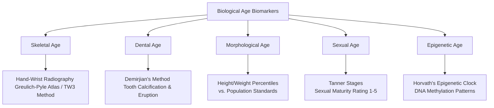
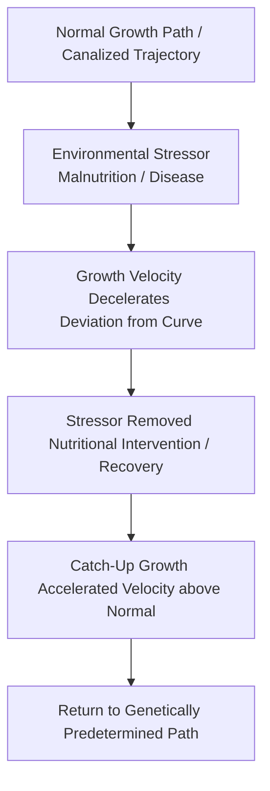

# VALUE ADD: Unit 11.1 - Human Growth, Development and Fertility
**Date:** June 09, 2026 | **Target:** Human Growth, Development and Fertility
**Syllabus Mapping:** Unit 11.1

# UPSC Anthropology Paper I — Unit 11.1: Human Growth, Development, and Ageing

---

## 1. Foundational Thinkers & Conceptual Matrix

To secure high marks in UPSC, linking core concepts to the physical anthropologists who defined them is essential.

```
┌─────────────────────────────────────────────────────────────────────────┐
│                           FOUNDATIONAL THINKERS                         │
├───────────────────┬──────────────────────────┬──────────────────────────┤
│ Thinker           │ Key Contribution         │ Anthropological Utility  │
├───────────────────┼──────────────────────────┼──────────────────────────┤
│ Franz Boas        │ Immigrant Studies (1912) │ Demonstrated plasticity  │
│                   │                          │ of human growth (head    │
│                   │                          │ shape/stature) vs.       │
│                   │                          │ genetic determinism.     │
├───────────────────┼──────────────────────────┼──────────────────────────┤
│ J.M. Tanner       │ Harpenden Growth Study;  │ Standardized assessment  │
│                   │ Tanner Stages (SMR)      │ of somatic and sexual    │
│                   │                          │ maturation.              │
├───────────────────┼──────────────────────────┼──────────────────────────┤
│ C.H. Waddington   │ Canalization Theory      │ Explained genetic        │
│                   │                          │ buffering of growth      │
│                   │                          │ against environmental    │
│                   │                          │ perturbations.           │
├───────────────────┼──────────────────────────┼──────────────────────────┤
│ Phyllis B.        │ Worldwide Variation in   │ Documented geographic    │
│ Eveleth           │ Human Growth (IBP)       │ and ethnic variations    │
│                   │                          │ in growth patterns.      │
└───────────────────┴──────────────────────────┴──────────────────────────┘
```

---

## 2. Deep-Dive: Methods of Studying Growth

Anthropologists use three primary research designs to study human growth. Each has distinct mathematical, logistical, and analytical trade-offs.

```
                  ┌────────────────────────────────────────┐
                  │       METHODS OF STUDYING GROWTH       │
                  └───────────────────┬────────────────────┘
                                      │
         ┌────────────────────────────┼────────────────────────────┐
         ▼                            ▼                            ▼
┌─────────────────┐          ┌─────────────────┐          ┌─────────────────┐
│  Longitudinal   │          │ Cross-Sectional │          │Mixed-Longitudinal│
│   (Diachronic)  │          │  (Synchronic)   │          │   (Sequential)  │
└─────────────────┘          └─────────────────┘          └─────────────────┘
```

### A. Longitudinal Method (Diachronic Approach)
* **Protocol:** The same cohort of children is followed and measured repeatedly at scheduled intervals from birth to maturity (e.g., Tanner’s *Harpenden Growth Study*, 1948–1971).
* **Mathematical Value:** It is the **only** method that accurately calculates individual growth velocity ($\text{cm/year}$) and identifies the exact timing of developmental milestones like Peak Height Velocity (PHV) and menarche.
* **Limitations:** 
  * High attrition rates (sample drop-out).
  * "Hawthorne Effect" (subjects modify behavior because they are being studied).
  * High cost and long duration.
  * *Cohort Effect:* Results may only reflect the environmental conditions of that specific generation.

### B. Cross-Sectional Method (Synchronic Approach)
* **Protocol:** Different cohorts of children of varying ages are measured at a single point in time (e.g., measuring groups of 5, 6, 7, and 8-year-olds in the year 2026).
* **Mathematical Value:** Excellent for establishing population norms, growth standards, and percentiles (e.g., WHO Growth Reference Charts).
* **Limitations:** 
  * It cannot calculate individual growth velocity.
  * It artificially "smooths out" the adolescent growth spurt because early and late maturers are averaged together, masking individual variation.

### C. Mixed-Longitudinal Method (Linked-Sequential Approach)
* **Protocol:** Combines both designs. Multiple partially overlapping age cohorts are followed longitudinally for a shorter duration (e.g., Cohort A followed from ages 0–6, Cohort B from ages 5–11, and Cohort C from ages 10–16 over a 6-year study period).
* **Mathematical Value:** Reconstructs a full 16-year growth curve in just 6 years, minimizing attrition while still providing reliable velocity data.

---

## 3. Biological vs. Chronological Age: Biomarkers of Maturity

While **Chronological Age** measures time elapsed since birth, **Biological Age** measures physiological maturity. This distinction is crucial for understanding human variation, clinical diagnostics, and forensic anthropology.



### Key Maturity Biomarkers
1. **Skeletal Age (The Gold Standard):** Assessed via hand-wrist radiographs. The progression of ossification in the carpal bones, metacarpals, and phalanges, followed by epiphyseal fusion, provides a highly reliable record of biological maturity.
2. **Dental Age:** Measured using tooth eruption sequences and crown/root calcification stages (Demirjian’s Method). Dental development is highly canalized and less affected by nutritional stress than skeletal development, making it a reliable marker in forensic age estimation.
3. **Sexual Age (SMR):** Tanner’s Sexual Maturity Rating (SMR scale 1–5) classifies the development of secondary sexual characteristics (pubic hair, breast development, and male external genitalia).
4. **Epigenetic Age (Modern Value-Add):** Analyzes DNA methylation levels at specific CpG sites (Horvath’s Clock). A higher epigenetic age relative to chronological age indicates accelerated biological ageing due to environmental stressors.

---

## 4. Advanced Theories of Ageing (Senescence)

Senescence is the progressive, irreversible decline in physiological function. Anthropologists categorize these theories into evolutionary, cellular, and systemic frameworks.

```
                           THEORIES OF AGEING
                                   │
         ┌─────────────────────────┼─────────────────────────┐
         ▼                         ▼                         ▼
┌─────────────────┐       ┌─────────────────┐       ┌─────────────────┐
│  Evolutionary   │       │    Cellular     │       │    Systemic     │
└────────┬────────┘       └────────┬────────┘       └────────┬────────┘
         │                         │                         │
         ├─ Mutation               ├─ Telomere               ├─ Neuroendocrine
         │  Accumulation           │  Shortening             │  Decline
         │                         │                         │
         ├─ Antagonistic           ├─ Free Radical           └─ Immunological
         │  Pleiotropy             │  Damage                    (Inflammaging)
         │                         │
         └─ Disposable             └─ Error
            Soma                      Catastrophe
```

### A. Evolutionary Theories (Why we evolved to age)
* **Mutation Accumulation Theory (Peter Medawar, 1952):** Natural selection operates most strongly during reproductive years. Deleterious mutations that express themselves late in life escape selective pressure and accumulate over generations, leading to senescence.
* **Antagonistic Pleiotropy Theory (George Williams, 1957):** Certain genes offer selective advantages in early life (e.g., high calcium deposition for bone strength) but have harmful effects in later life (e.g., arterial calcification). Because early survival drives reproductive success, natural selection favors these genes.
* **Disposable Soma Theory (Thomas Kirkwood, 1977):** Organisms have a finite energy budget. Metabolic resources must be partitioned between reproduction and somatic maintenance. Evolution prioritizes reproduction, leaving the body ("soma") with insufficient maintenance resources, leading to gradual decay.

### B. Cellular & Intracellular Theories (How cells age)
* **Telomere Shortening / Hayflick Limit (Leonard Hayflick, 1961):** Human somatic cells have a finite replicative capacity (typically 40–60 divisions). With each division, telomeres (protective TTAGGG chromosome caps) shorten. When they reach a critical threshold, the cell enters permanent arrest (senescence) or apoptosis.
* **Free Radical / Oxidative Stress Theory (Denham Harman, 1956):** Reactive Oxygen Species (ROS), produced as natural byproducts of mitochondrial respiration, cause cumulative oxidative damage to lipids, proteins, and mitochondrial DNA (mtDNA), leading to cellular dysfunction.
* **Error Catastrophe Theory (Leslie Orgel, 1963):** Random transcription and translation errors during protein synthesis accumulate over time. This creates a feedback loop of faulty cellular machinery, culminating in a lethal "error catastrophe."

### C. Systemic Theories (How organ systems fail)
* **Immunological Theory (Roy Walford):** Ageing is driven by the involution of the thymus gland, which reduces T-cell diversity. This leads to **"inflammaging"**—a state of chronic, low-grade systemic inflammation—and an increased susceptibility to pathogens and autoimmune disorders.
* **Neuroendocrine Theory:** The hypothalamic-pituitary-adrenal (HPA) axis loses its homeostatic sensitivity over time. Chronic exposure to stress hormones (like cortisol) accelerates tissue degeneration and metabolic decline.

---

## 5. Case Studies & Indian Context (UPSC Value-Add)

To maximize marks in Paper I, integrate these contemporary Indian case studies and biological datasets:

### Case Study 1: Socioeconomic Gradients and Secular Trends in India
* **Context:** The secular trend toward taller stature and earlier menarche is a key indicator of improved public health.
* **Data (NFHS-5 vs. Historical Data):** National Family Health Survey (NFHS-5) data reveals a clear socioeconomic gradient in the age at menarche among Indian girls. 
* **Findings:** In affluent urban cohorts, the mean age at menarche has declined to **$12.4 \pm 0.8$ years**, matching Western standards. In contrast, rural and socioeconomically marginalized communities (e.g., Scheduled Castes and Scheduled Tribes) exhibit a delayed mean age of **$13.8 \pm 1.1$ years**. This disparity highlights how environmental factors like nutrition, sanitation, and disease burden influence genetic potential.

### Case Study 2: Growth Plasticity and Nutritional Stress in PVTGs
* **Context:** Studies on Particularly Vulnerable Tribal Groups (PVTGs) demonstrate the limits of growth canalization under chronic environmental stress.
* **Anthropological Study:** Research on the **Birhor** and **Chenchu** tribes reveals high rates of stunting (low height-for-age) and wasting (low weight-for-height). 
* **Analysis:** Due to chronic caloric and micronutrient deficiencies, these populations do not experience the typical adolescent growth spurt. Instead, they exhibit a prolonged, flatter growth curve. This adaptation prioritizes survival over growth, demonstrating the high plasticity of human development.

### Case Study 3: The ICMR vs. WHO Growth Standards Debate
* **Context:** The debate over whether to use international or population-specific growth standards.
* **The Issue:** The Indian Council of Medical Research (ICMR) notes that the WHO Child Growth Standards (based on breastfed infants from six countries, including India) may overdiagnose undernutrition in Indian children.
* **Anthropological Perspective:** Anthropologists argue that genetic variation in body proportions (such as sitting height to stature ratio) means a single international standard may not fit all populations. This highlights the need for population-specific growth references that account for local genetic and environmental realities.

---

## 6. High-Yield Schematics

### A. Catch-Up Growth & Canalization (Waddington's Model)
This flowchart illustrates how growth returns to its genetically predetermined path after a temporary environmental disruption.



### B. Scammon's Curves of Tissue Growth
This diagram shows how different tissue types grow at varying rates throughout development.

```
% of Adult Size (20 Years)
120% |                                      _..---.._  (Lymphoid: Peaks at ~12 years,
     |                                   .-'         '-. then declines)
100% |                             _..-'                 '-._
     |                         _.-'                           '-.
 80% |                     _.-'                                  '-. (Neural: Rapid early
     |                  .-'                                          growth, ~95% by age 7)
 60% |                .-'
     |               /
 40% |             .'     (General: Sigmoid curve; overall body size)
     |            /
 20% |          .'        (Reproductive: Latent in childhood, rapid at puberty)
     |       _.-'
  0% └──────┴───────────┴───────────┴───────────┴───────────┴───────────
     0      2         6           10          14          18      20 Years
```

### C. Distance vs. Velocity Curves of Growth
* **Distance Curve (Cumulative):** An S-shaped (sigmoid) curve showing total height achieved over time.
* **Velocity Curve (Rate):** Shows the rate of growth per year, highlighting the rapid decline after infancy and the sharp peak during the adolescent growth spurt.

```
      DISTANCE CURVE (Height in cm)                 VELOCITY CURVE (cm/year Growth Rate)
Height                                        Rate
(cm)                                        (cm/yr)
180 |                             _..-        20 |  \
160 |                         _.-'            16 |   \  (Infancy Deceleration)
140 |                     _.-'                12 |    \
120 |                  .-'                     8 |     \        /\  (Adolescent Spurt / PHV)
100 |                .-'                       4 |      \______/  \
 80 |             .-'                          0 |                 \______
    └─────────────────────────────────           └─────────────────────────────────
    0   4   8   12  16  20 Years                 0   4   8   12  16  20 Years
```