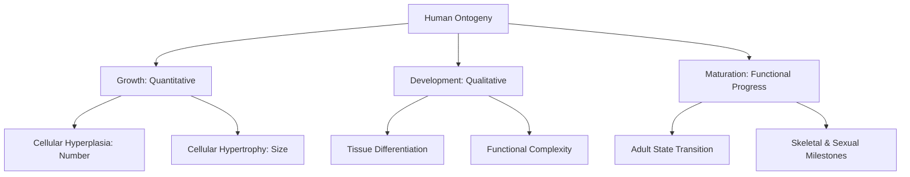
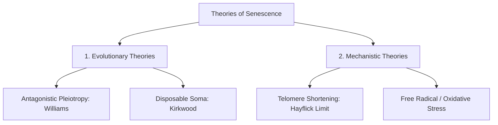
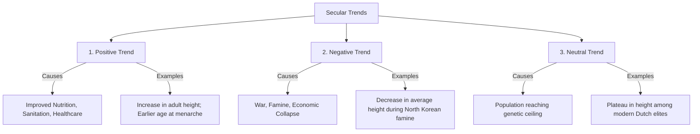

# VALUE ADD: Unit 10 - UNIT 1.4 & 1.5: PHYSICAL ANTHROPOLOGY & EVOLUTION
**Date:** June 09, 2026 | **Target:** PAPER I — UNIT 1.4 & 1.5: PHYSICAL ANTHROPOLOGY & EVOLUTION
**Syllabus Mapping:** Unit 10

# UPSC CSE ANTHROPOLOGY MAINS — HIGH-YIELD VALUE ADDITION
## PAPER I — UNIT 10: CONCEPT OF HUMAN GROWTH AND DEVELOPMENT

---

## SECTION 1: CONCEPTUAL CLARIFICATION & THINKER FRAMEWORKS

Understanding human growth and development requires a precise distinction between three closely related biological phenomena: **Growth**, **Development**, and **Maturation**.



### 1. The Tripartite Biological Paradigm
*   **Growth:** A purely **quantitative** increase in body size, mass, or physical dimensions. It is driven by two cellular mechanisms:
    *   *Hyperplasia:* Increase in cell number through mitotic division.
    *   *Hypertrophy:* Increase in cell size through macromolecular synthesis.
*   **Development:** A **qualitative** evolution of functional capacity, structural organization, and tissue differentiation (e.g., transition from cognitive egocentrism to abstract reasoning).
*   **Maturation:** The tempo and timing of progress toward the fully mature biological state. It is measured against standardized developmental milestones (e.g., skeletal ossification, dental eruption, menarche).

---

### 2. Scammon’s Curves of Systemic Growth
In 1930, anatomist **Richard Scammon** demonstrated that different tissue groups follow distinct, non-linear growth trajectories from birth to age 20. This is a foundational concept for explaining why human growth is mosaic and prolonged.

```mermaid
gantt
    title Scammon's Growth Trajectories (Relative % of Adult Size)
    dateFormat  X
    axisFormat %s
    
    section Neural (Brain/Skull)
    Rapid Early Growth (90% by age 6) :active, 0, 6
    Plateau to Maturity (100% by age 20) : 6, 20
    
    section Lymphoid (Thymus/Nodes)
    Hyper-growth (200% at age 12) :active, 0, 12
    Involution to Adult Level (100% by age 20) : 12, 20
    
    section General (Skeletal/Muscle)
    Infantile Spurt :active, 0, 4
    Childhood Plateau : 4, 12
    Adolescent Spurt to 100% : 12, 20
    
    section Genital (Testes/Ovaries)
    Latency (Minimal growth) :active, 0, 12
    Pubertal Surge to 100% : 12, 20
```



*   **Neural Curve:** Brain, spinal cord, and skull dimensions reach nearly $90\%$ of adult size by age 6. This reflects the evolutionary prioritization of encephalization and cognitive development in early childhood.
*   **Lymphoid Curve:** Thymus, lymph nodes, and tonsils undergo rapid hyper-growth, peaking at nearly $200\%$ of adult size around age 12, followed by hormonal involution (shrinking) during puberty. This provides young children with enhanced immunological defense during their most vulnerable foraging/exploratory years.
*   **General (Somatic) Curve:** Skeletal, muscular, and visceral growth follows a **S-shaped (sigmoid)** curve: rapid growth in infancy, a slow childhood plateau, a sharp adolescent growth spurt, and final deceleration.
*   **Genital Curve:** Primary and secondary sexual organs remain latent ($<10\%$ of adult size) throughout childhood, undergoing a rapid, hormone-driven surge to $100\%$ only during puberty.

---

### 3. Key Anthropological Thinkers & Pioneers

*   **Franz Boas (1858–1942):** The father of American Anthropology. His landmark **1912 Immigrant Study** (*Changes in Bodily Form of Descendants of Immigrants*) proved that the **Cephalic Index** (head shape), previously considered a fixed racial marker, changed significantly within one generation of European immigrants living in New York. This established the concept of **environmental plasticity** in human growth.
*   **J.M. Tanner (1920–2010):** A British pediatrician who established modern auxology (the study of human growth). He directed the **Harpenden Growth Study (1948–1971)**, which tracked children in a British orphanage to establish the standard **Tanner Stages** of sexual maturity and the classic distance/velocity curves.
*   **Phyllis B. Eveleth:** Co-authored *Worldwide Variation in Human Growth* with Tanner, documenting how geographic, genetic, and nutritional factors interact to shape growth patterns across global populations.

---

## SECTION 2: DEEP-DIVE INTO STAGES OF GROWTH & SENESCENCE THEORIES

Human life history is unique among primates due to its highly extended childhood and the inclusion of a distinct adolescent growth spurt.

```
[Prenatal] ──> [Birth] ──> [Infancy] ──> [Childhood] ──> [Adolescence] ──> [Senescence]
 (Ovum/Embryo/Fetus)      (Deciduous teeth) (Brain growth)  (Pubertal Spurt)   (Biological Aging)
```

---

### 1. Comprehensive Breakdown of Growth Stages

#### A. Prenatal Stage (Conception to Birth)
*   **Period of the Ovum (0–2 weeks):** Rapid cell division (cleavage) forming the blastocyst, ending with implantation in the uterine wall.
*   **Embryonic Period (2–8 weeks):** Organogenesis (formation of major organ systems). This is the highly sensitive **teratogenic window** where environmental toxins or maternal stress cause severe structural birth defects.
*   **Fetal Period (9 weeks to Birth):** Rapid growth in body length and mass, tissue differentiation, and functional development of organ systems.

> [!NOTE]
> **UPSC Value-Addition: The Barker Hypothesis (Fetal Origins of Adult Disease)**
> Formulated by epidemiologist David Barker, this hypothesis states that intrauterine nutritional deprivation during the fetal period forces the fetus to make permanent physiological adaptations to survive. This results in a **"thrifty phenotype"** (insulin resistance, reduced nephron count, altered lipid metabolism). If this individual enters a nutrient-rich postnatal environment, these prenatal adaptations lead to high rates of obesity, Type-2 diabetes, and cardiovascular disease in adulthood.

#### B. Postnatal Stages
*   **Infancy (Birth to 3 years):** Characterized by rapid somatic growth, eruption of deciduous dentition, rapid myelination of the central nervous system, and the transition to bipedal locomotion.
*   **Childhood (3 to 10 years):** A period of slow, steady growth. The brain completes its growth in weight, and the child remains dependent on adults for high-quality food due to an immature digestive tract.
*   **Adolescence (10 to 20 years):** Initiated by the activation of the hypothalamic-pituitary-gonadal (HPG) axis. Characterized by:
    *   The **Adolescent Growth Spurt (AGS)**.
    *   Development of secondary sexual characteristics (Tanner Stages).
    *   Fusion of epiphyseal plates in long bones, marking the cessation of linear growth.
*   **Senescence (Aging):** The progressive, post-reproductive decline in physiological function and cellular repair mechanisms, reducing an organism's viability.

---

### 2. Senescence vs. Senility: The Critical Distinction
*   **Senescence:** The normal, universal, and progressive **biological process** of cellular and physiological decline over time (e.g., arterial stiffening, loss of skin elasticity, decline in glomerular filtration rate).
*   **Senility:** The **pathological state** of cognitive and physical deterioration often associated with advanced age, but not a normal part of aging (e.g., senile dementia, Alzheimer’s disease, severe pathological frailty).

---

### 3. Evolutionary & Biological Theories of Aging

Why does natural selection allow organisms to age and die? Anthropologists and evolutionary biologists explain this through three primary theories:



#### A. Antagonistic Pleiotropy Theory (George C. Williams, 1957)
*   **The Logic:** Natural selection favors genes that enhance early-life reproductive success, even if those same genes cause severe physiological decline later in life.
*   **Example:** High testosterone levels in youth promote muscle mass and reproductive drive (favored by selection), but cause prostate cancer and cardiovascular disease in old age (ignored by selection, as reproduction is already complete).

#### B. Disposable Soma Theory (Thomas Kirkwood, 1977)
*   **The Logic:** An organism has a finite energy budget. It must allocate this energy between **Reproduction** and **Somatic Maintenance** (cellular repair).
*   **The Trade-off:** To maximize evolutionary fitness, organisms allocate more energy to early reproduction, leaving insufficient energy for permanent somatic repair. Over time, this unrepaired cellular damage accumulates, manifesting as senescence.

#### C. Telomere Shortening & The Hayflick Limit (Mechanistic Theory)
*   **The Logic:** Human somatic cells have a limited replicative capacity (typically $50-70$ divisions, known as the **Hayflick Limit**).
*   **The Mechanism:** With each mitotic division, the protective caps at the ends of chromosomes (**telomeres**) shorten. When telomeres reach a critically short length, the cell enters permanent growth arrest (cellular senescence) or undergoes apoptosis, leading to tissue degeneration.

---

## SECTION 3: ADVANCED METHODOLOGY OF GROWTH STUDIES

To map human growth patterns, physical anthropologists utilize three primary research designs, each with distinct advantages and limitations.

```
1. Cross-Sectional:      [Cohort A (Age 5)]   [Cohort B (Age 10)]   [Cohort C (Age 15)]  <-- Measured ONCE (2026)
2. Longitudinal:         [Cohort A (Age 5)] ──> (Wait 5 Years) ──> [Cohort A (Age 10)]  <-- Same cohort over time
3. Mixed Longitudinal:   [Cohort A (Age 5 ──> 10)]  overlapping with  [Cohort B (Age 10 ──> 15)]
```

---

### 1. Comparative Methodology Matrix

| Feature / Parameter | Cross-Sectional Method | Longitudinal Method | Mixed Longitudinal Method |
| :--- | :--- | :--- | :--- |
| **Research Design** | Different age cohorts are measured **once** at a single point in time. | The **same** cohort of individuals is measured repeatedly over many years. | Overlapping age cohorts are studied simultaneously over a shorter duration. |
| **Primary Output** | Establishes **Distance Curves** (cumulative height/weight standards for a population). | Establishes **Velocity Curves** (rate of growth, tracking individual growth spurts). | Reconstructs long-term growth curves by combining overlapping short-term data. |
| **Time & Cost** | Fast, highly economical, completed in a single field season. | Extremely slow (takes 15–20 years), highly expensive. | Moderately fast, balanced cost-efficiency. |
| **Sample Attrition** | Zero attrition (no subjects lost to follow-up). | High attrition due to migration, death, or loss of interest. | Low to moderate attrition. |
| **Major Limitation** | Cannot calculate individual growth velocity; masks individual variation. | High risk of **Hawthorne/Observer effect**; equipment calibration drift over decades. | Requires complex statistical smoothing to merge overlapping cohort data. |

---

### 2. Mathematical Representation: Distance vs. Velocity Curves

To score high marks, draw these two curves side-by-side in your exam. They represent the growth of the same individual but display different mathematical properties:

```
      DISTANCE CURVE (Cumulative Height)               VELOCITY CURVE (Rate of Growth)
Height                                            Growth
 (cm)                                            Velocity
 180 |                  /                         (cm/yr)
     |                 /                              12 |  \
 140 |                /                                  |   \
     |               /                                 8 |    \        /\ (Adolescent Spurt)
 100 |       _______/                                    |     \______/  \
     |      /                                          4 |     /          \
  60 |_____/                                             |____/____________\____
     +-------------------->                              +-------------------->
     0     5    10   15   20                             0    5    10   15   20
          Age (Years)                                         Age (Years)
```

*   **Distance Curve ($y = f(t)$):** Plots cumulative height achieved against age. It is a sigmoid curve showing continuous upward progress, flattening out as the individual reaches adult height.
*   **Velocity Curve ($y = \frac{dy}{dt}$):** Plots the rate of growth (cm/year) against age. It shows:
    1.  A rapid decline from birth through infancy.
    2.  A stable, low rate during childhood.
    3.  A sharp peak during adolescence (the **Peak Height Velocity - PHV**), which occurs around age 12 in girls and age 14 in boys.
    4.  A rapid drop to zero when epiphyseal fusion is complete.

---

## SECTION 4: MULTIFACTORIAL DETERMINANTS OF GROWTH & SECULAR TRENDS

Human growth is a highly plastic, polygenic trait shaped by a continuous interaction between genetic potential and environmental constraints.

```
   GENETIC POTENTIAL (Polygenic Inheritance)
                 │
                 ▼
   [ ENDOCRINE REGULATION (Hormonal Axis) ]
                 │
                 ▼
   ENVIRONMENTAL MODULATORS (Nutrition, Disease, Socio-economic Status)
                 │
                 ▼
   PHENOTYPIC OUTCOME (Adult Height, Body Composition)
```

---

### 1. The Four Pillars of Growth Regulation

#### A. Genetic Factors
*   **Heritability:** Twin studies show that approximately $80\%$ of variation in adult height is genetically determined (highly polygenic, involving over 180 loci).
*   **Epigenetics:** Environmental stressors (e.g., maternal stress, famine) can chemically modify DNA (methylation) without changing the genetic sequence, altering the growth trajectory of offspring.

#### B. Endocrine (Hormonal) Factors
*   **Growth Hormone (GH) - IGF-1 Axis:** Secreted by the anterior pituitary, GH stimulates the liver to produce **Insulin-like Growth Factor 1 (IGF-1)**, which drives chondrocyte proliferation in the epiphyseal plates of long bones.
*   **Thyroid Hormones ($T_3, T_4$):** Essential for early brain development and skeletal ossification. Deficiency causes congenital hypothyroidism (cretinism).
*   **Sex Steroids (Estrogen & Testosterone):** Drive the adolescent growth spurt. Estrogen is also the primary hormone responsible for epiphyseal plate closure in both males and females.

#### C. Nutritional & Socio-Economic Factors
*   **Protein-Energy Malnutrition (PEM):** Leads to **Stunting** (low height-for-age, indicating chronic malnutrition) or **Wasting** (low weight-for-height, indicating acute nutritional crisis).
*   **Socio-Economic Gradient:** Children from higher-income families consistently exhibit taller average statures and earlier maturation due to better sanitation, healthcare, and nutrition.

#### D. Climate & Altitude
*   **Hypoxia Stress:** High-altitude populations (e.g., Andean Quechua) exhibit slower linear growth but larger chest dimensions (barrel chests) due to developmental adaptation to low oxygen pressure.

---

### 2. Secular Trends in Growth
A **Secular Trend** is a systematic, long-term shift in a physical trait (such as height, weight, or age at menarche) over successive generations living in the same geographic area.



*   **Positive Secular Trend:** An increase in average adult height and a decrease in the age of menarche over time.
    *   *Global Case Study:* The **Dutch Population**. In the mid-19th century, the Dutch were relatively short. Due to systematic improvements in public health, nutrition, and social equality, they underwent a massive positive secular trend, becoming the tallest population in the world today (average male height $\approx 183\text{ cm}$).
    *   *Age at Menarche:* In Western Europe, the average age of menarche dropped from $\approx 17\text{ years}$ in 1840 to $\approx 12.5\text{ years}$ in 1960, reflecting improved childhood nutrition and reduced disease burden.
*   **Negative Secular Trend:** A decrease in average adult height or an increase in the age of menarche, typically caused by war, economic collapse, or famine.
    *   *Case Study:* A significant decline in average height was documented in North Korean children compared to South Korean children following the famines of the 1990s, demonstrating how political and nutritional disruption can reverse positive growth trends.
*   **Neutral Trend (Plateau):** Occurs when a population has optimized its environmental conditions, allowing individuals to fully realize their genetic potential. At this point, growth trends stabilize.

---

## SECTION 5: UPSC HIGH-YIELD REVISION SHEET & MODEL ANSWER BLUEPRINTS

---

### 1. Quick-Recall Mnemonics

*   **Scammon's Four Curves:** **L.N.G.G.**
    *   **L**ymphoid (Double-adult peak at puberty)
    *   **N**eural (Early brain growth)
    *   **G**eneral (Somatic S-curve)
    *   **G**enital (Latent until puberty)
*   **Evolutionary Theories of Aging:** **A.D.T.**
    *   **A**ntagonistic Pleiotropy (Early gain, late pain)
    *   **D**isposable Soma (Reproduction vs. Repair trade-off)
    *   **T**elomere Shortening (The mitotic countdown)

---

### 2. Key Anthropological Case Studies for Value-Addition

*   **The ICMR Growth Standards (Indian Context):** The Indian Council of Medical Research (ICMR) publishes national growth standards for Indian children. Anthropologists use these standards to show that tribal populations (e.g., PVTGs like the Birhor or Chenchu) often exhibit high rates of stunting and wasting compared to the national average. This highlights how socio-economic marginalization prevents these groups from reaching their genetic growth potential.
*   **The NFHS-5 Data (National Family Health Survey):** Use this current data to support answers on environmental factors affecting growth. NFHS-5 reports that while stunting in Indian children under 5 has declined from $38.4\%$ (NFHS-4) to $35.5\%$, it remains a significant public health challenge, reflecting persistent chronic nutritional deprivation.

---

### 3. Model Answer Blueprint: "Critically examine the factors affecting human growth and development." [20 Marks]

#### A. Introduction (Approx. 50 words)
*   Define human growth and development as a multifactorial, highly plastic biological process.
*   State that while genetics establishes the potential boundaries of growth, environmental, endocrine, and socio-economic factors determine the actual phenotypic outcome.

#### B. Body Paragraph 1: Genetic & Epigenetic Architecture (Approx. 100 words)
*   Discuss polygenic inheritance (height as a continuous trait).
*   Introduce **epigenetics** and developmental plasticity, citing **Franz Boas' 1912 Immigrant Study** to show how head shape and stature change in response to new environments.

#### C. Body Paragraph 2: Endocrine Regulation (Approx. 100 words)
*   Detail the hormonal axes: GH-IGF-1 axis for linear bone growth, Thyroid hormones for skeletal and neural maturation, and Sex Steroids (estrogen/testosterone) for the adolescent growth spurt and eventual epiphyseal fusion.
*   *Visual Aid:* Draw a simple flowchart showing the Hypothalamic-Pituitary-Somatic axis.

#### D. Body Paragraph 3: Environmental & Nutritional Modulators (Approx. 150 words)
*   Discuss the impact of Protein-Energy Malnutrition (PEM), distinguishing between stunting (chronic) and wasting (acute).
*   Incorporate the **Barker Hypothesis** to explain how prenatal nutritional stress programs adult metabolic diseases (thrifty phenotype).
*   Cite **NFHS-5 data** on stunting and wasting in India to ground the answer in the Indian context.

#### E. Body Paragraph 4: Socio-Economic Status & Secular Trends (Approx. 100 words)
*   Explain how income, sanitation, and healthcare access create a growth gradient.
*   Define **Secular Trends** and provide a comparative example: the positive secular trend in the **Dutch population** versus the negative secular trend in North Korean cohorts.

#### F. Conclusion (Approx. 50 words)
*   Summarize that human growth is a sensitive bio-indicator of a population's ecological and socio-economic well-being.
*   Conclude that physical anthropologists must study growth using a biocultural approach to help design effective public health and nutritional interventions.