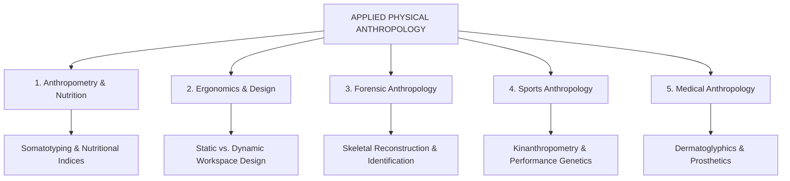
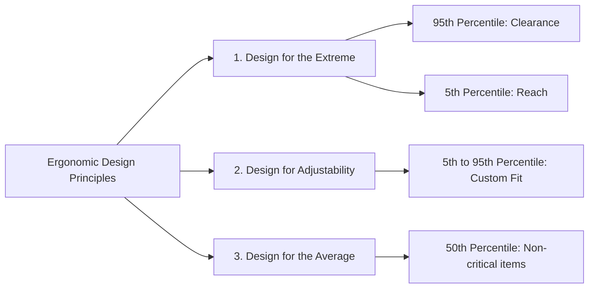
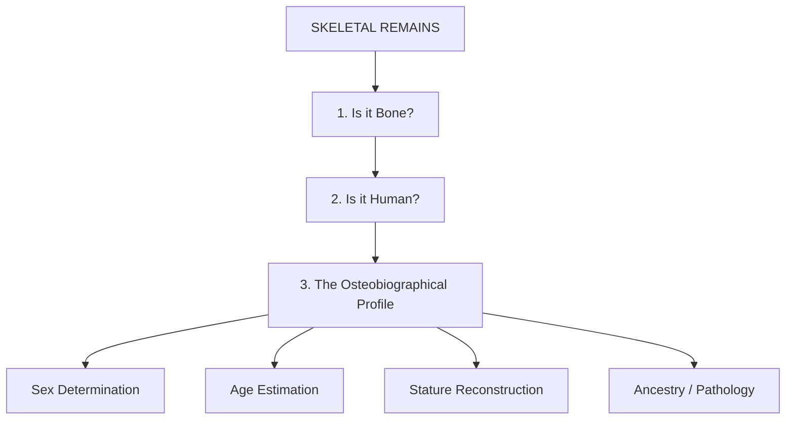
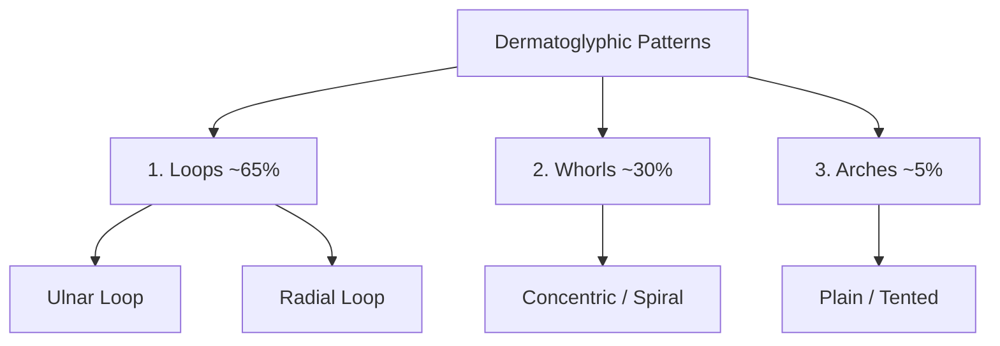
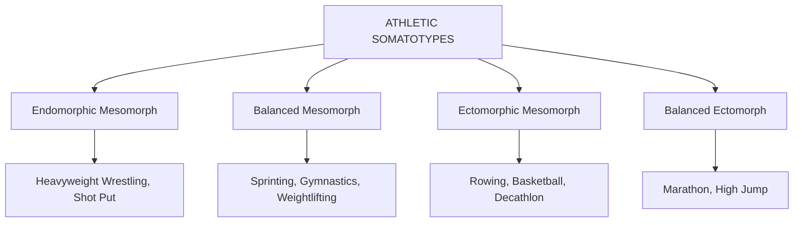
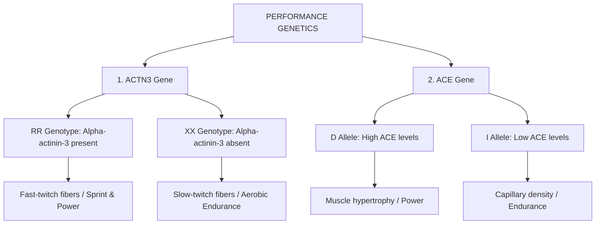
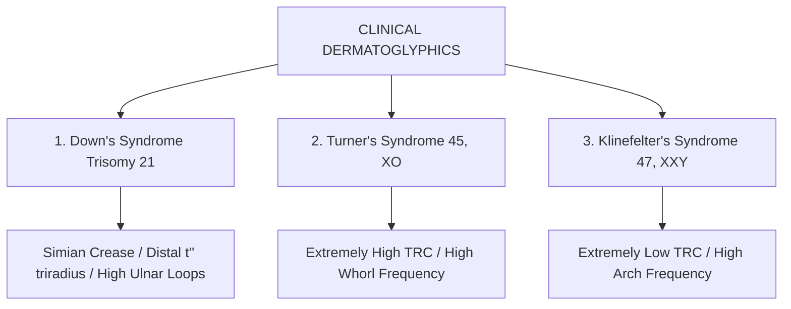
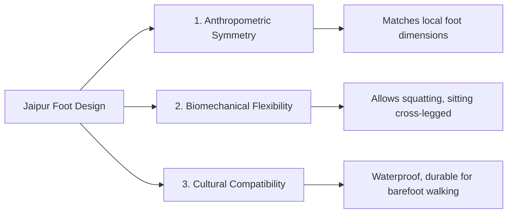

# VALUE ADD: Unit 12 - UNIT 1.4 & 1.5: PHYSICAL ANTHROPOLOGY & EVOLUTION
**Date:** June 10, 2026 | **Target:** PAPER I — UNIT 1.4 & 1.5: PHYSICAL ANTHROPOLOGY & EVOLUTION
**Syllabus Mapping:** Unit 12

# PAPER I — UNIT 12: APPLIED PHYSICAL ANTHROPOLOGY

---

## UNIT 12 SYLLABUS DECONSTRUCTION & THINKERS' MAP

Unit 12 represents the pragmatic, translational dimension of Physical Anthropology. It bridges the gap between evolutionary biology, skeletal anatomy, genetics, and real-world human applications.

### Core Thinkers & Epistemological Contributions

| Thinker | Landmark Contribution / Book | Core Concept |
| :--- | :--- | :--- |
| **Alphonse Bertillon** (1879) | *Bertillon System (Bertillonage)* | The first scientific system of criminal identification using physical measurements of the head, limbs, and scars. |
| **William H. Sheldon** (1940) | *Atlas of Men* | Formulated the photoscopic somatotyping method (Endomorph, Mesomorph, Ectomorph) linked to temperament. |
| **Barbara Heath & J.E. Lindsay Carter** (1967) | *Heath-Carter Somatotyping Method* | Transformed somatotyping into an objective, non-photographic, anthropometric rating scale. |
| **Bill Ross** (1972) | *Kinanthropometry* | Coined the term; defined it as the application of measurement to human movement, performance, and nutrition. |
| **Mildred Trotter & Goldine C. Gleser** (1952) | *Estimation of Stature from Long Bones* | Developed the foundational mathematical regression equations for forensic stature estimation. |
| **Harold Cummins** (1926) | *Dermatoglyphics* | Coined the term "Dermatoglyphics"; established the standards for epidermal ridge analysis in genetics and medicine. |

---

## SUB-TOPIC 1: ANTHROPOMETRY & NUTRITIONAL ASSESSMENT

Anthropometry is the standardized technique of measuring the physical dimensions of the human body. In nutritional anthropology, it serves as a non-invasive, low-cost, and highly reliable tool to evaluate nutritional status, growth patterns, and body composition.

### 1. Somatotyping: Sheldon vs. Heath-Carter

* **Sheldon's Method (Photoscopic):**
  * *Mechanism:* Relied on subjective visual ratings of three standardized photographs (front, side, rear) on a 1-to-7 scale.
  * *Limitations:* Highly subjective, prone to observer bias, and assumed that a person's somatotype is genetically fixed and unalterable by diet or training.
* **Heath-Carter Method (Anthropometric):**
  * *Mechanism:* Uses ten objective anthropometric measurements:
    * *Endomorphy (Relative Fatness):* Triceps, subscapular, and supraspinal skinfolds.
    * *Mesomorphy (Musculoskeletal Robustness):* Height, humerus and femur diameters, flexed biceps and calf circumferences (corrected for skinfolds).
    * *Ectomorphy (Linearity):* Height divided by the cube root of weight (Ponderal Index).
  * *Advantages:* Objective, highly reproducible, and recognizes that somatotypes are dynamic phenotypes that change with age, nutrition, and physical training.

### 2. Anthropometric Indices of Nutritional Status

$$\text{Body Mass Index (BMI)} = \frac{\text{Weight (kg)}}{\text{Height (m)}^2}$$

$$\text{Ponderal Index (PI)} = \frac{\text{Height (cm)}}{\sqrt[3]{\text{Weight (kg)}}}$$

$$\text{Waist-to-Hip Ratio (WHR)} = \frac{\text{Waist Circumference (cm)}}{\text{Hip Circumference (cm)}} \quad \left[ \text{Android (Apple) vs. Gynoid (Pear) obesity} \right]$$

$$\text{Mid-Upper Arm Circumference (MUAC)} \quad \left[ \text{Critical screening tool for severe acute malnutrition (SAM) in children} \right]$$

> [!NOTE]
> **UPSC Value-Addition: Indian Tribal Nutritional Crisis (NFHS-5 Data)**
> Anthropometric surveys of Particularly Vulnerable Tribal Groups (PVTGs) in India reveal chronic undernutrition:
> * **The Birhor & Chenchu Tribes:** Exhibit extremely high rates of adult chronic energy deficiency ($\text{BMI} < 18.5 \text{ kg/m}^2$), exceeding $45\%$.
> * **Stunting & Wasting:** NFHS-5 data indicates that tribal children under five suffer from disproportionately higher rates of stunting ($40.9\%$) and wasting ($23.2\%$) compared to the national average, highlighting the critical role of applied anthropometry in designing targeted food security interventions (e.g., POSHAN Abhiyaan).

---

## SUB-TOPIC 2: ERGONOMICS & INDUSTRIAL DESIGN

Ergonomics is the application of human biological and anthropometric data to the design of tools, machines, workspaces, and consumer products to maximize safety, efficiency, and comfort.

### 1. Static vs. Dynamic Anthropometry
* **Static (Structural) Anthropometry:** Measurements taken while the body is in a fixed, standardized, non-moving posture (e.g., stature, sitting eye height, biacromial breadth). Used for designing static clearances (e.g., door heights, helmet sizes).
* **Dynamic (Functional) Anthropometry:** Measurements taken while the body is engaged in physical activity or work-related movements (e.g., functional arm reach, rotational limits of joints). Used for designing active workspaces (e.g., vehicle cockpits, assembly lines).

### 2. The Three Principles of Ergonomic Design

1. **Design for the Extreme:**
   * **The 95th Percentile (Clearance):** Used to ensure that large individuals are accommodated. If a 95th percentile male can fit through a submarine escape hatch, clear a doorway, or have enough legroom in an aircraft seat, then $95\%$ of the population will also fit.
   * **The 5th Percentile (Reach/Access):** Used to ensure that small individuals can access controls. If a 5th percentile female can reach a vehicle emergency brake, a cockpit control switch, or a machine safety lever, then $95\%$ of the population can also reach it.
2. **Design for Adjustability (5th to 95th Percentile):** Used for products where a single fixed size is highly inefficient. Examples include office chairs, car driver seats, and military helmets, which allow users to customize the fit within the middle $90\%$ of the human biological spectrum.
3. **Design for the Average (50th Percentile):** Used only for non-critical, short-duration items where adjustability is too expensive or structurally impossible (e.g., public park benches, checkout counters).

> [!IMPORTANT]
> **UPSC Case Study: DRDO & DIPAS Military Anthropometry**
> The **Defence Institute of Physiology and Allied Sciences (DIPAS)**, a wing of **DRDO**, conducted a massive 3D anthropometric survey of Indian soldiers. 
> * **The Problem:** Historically, Indian military equipment was designed using Western anthropometric databases. This led to poor fit, high fatigue, and operational inefficiencies because Western populations are, on average, taller and have different limb-to-torso ratios than Indian populations.
> * **The Application:** The Indian database was used to design the **INSAS rifle** (optimized trigger-to-butt length), the **LCA Tejas cockpit** (optimized reach envelopes for Indian pilots), and customized **bulletproof jackets (Bhanu)** that distribute weight evenly across the pelvic girdle of Indian soldiers, reducing spinal strain.

---

## SUB-TOPIC 3: FORENSIC ANTHROPOLOGY & PERSONAL IDENTIFICATION

Forensic Anthropology is the application of skeletal biology and physical anthropology techniques to legal investigations, primarily for the identification of decomposed, burned, or skeletalized human remains.

### 1. Sex Determination from Skeletal Remains
Sex determination is the most critical step in skeletal analysis, as age and stature estimation formulas are highly sex-specific. The **pelvis** is the most reliable indicator ($95\%$ accuracy), followed by the **skull** ($80-85\%$ accuracy).

| Skeletal Element | Male Phenotype | Female Phenotype |
| :--- | :--- | :--- |
| **Pelvis: Sub-pubic Angle** | Narrow, acute ($< 70^\circ$) | Wide, obtuse ($> 90^\circ$) |
| **Pelvis: Greater Sciatic Notch** | Narrow, deep | Wide, shallow |
| **Pelvis: Pelvic Inlet** | Heart-shaped | Oval, spacious |
| **Pelvis: Sacrum** | Long, narrow, curved inward | Short, wide, flat |
| **Skull: Supraorbital Ridge** | Prominent, heavy brow ridges | Smooth, minimal brow ridges |
| **Skull: Mastoid Process** | Large, robust (muscle attachment) | Small, gracile |
| **Skull: Mental Protuberance (Chin)** | Square, prominent | Rounded, pointed |
| **Skull: Nuchal Crest** | Rough, prominent | Smooth, gracile |

---

### 2. Age Estimation Methods

#### A. Sub-Adults (Infants to Adolescents)
* **Dentition:** Dental eruption sequences are highly conserved and serve as the most accurate age indicator in children (e.g., eruption of first deciduous incisor at $\sim 6$ months; first permanent molar at $\sim 6$ years; third molar at $\sim 18-21$ years).
* **Epiphyseal Fusion:** The timing of the fusion of long bone epiphyses (ends) to their diaphyses (shafts). For example, the elbow joint fuses early ($\sim 14-16$ years), while the medial clavicle is the last to fuse ($\sim 25-28$ years).

#### B. Adults
* **Cranial Suture Obliteration:** The gradual fusion and disappearance of sutures on the skull vault (e.g., sagittal, coronal, lambdoid sutures) starting from the inside out, beginning in the mid-20s.
* **Pubic Symphysis Degeneration (Suchey-Brooks Method):** The symphyseal face of the pubic bone transitions from a highly ridged, billowed surface in young adults to a smooth, rimmed, and eventually pitted surface in older individuals.
* **Gustafson's Dental Method (For Adult Teeth):** Evaluates six age-associated histological changes in a single ground section of a tooth:

$$\text{Age Score} = A (\text{Attrition}) + P (\text{Periodontitis}) + S (\text{Secondary Dentin}) + C (\text{Cementum Apposition}) + R (\text{Root Resorption}) + T (\text{Root Transparency})$$

---

### 3. Stature Reconstruction
Stature is estimated using mathematical regression equations calculated from the maximum length of complete long bones (femur, tibia, fibula, humerus, radius, ulna).

* **The Trotter-Gleser Formulae:** These are population-specific and sex-specific formulas. For example, the formula for estimating the stature of a Mongoloid male using the femur ($F$) is:

$$\text{Stature (cm)} = 2.15 \times F + 72.57 \pm 3.80\text{ cm}$$

---

### 4. Personal Identification: Dermatoglyphics & DNA Profiling

* **Dermatoglyphics:** The study of the epidermal ridge patterns on fingertips, palms, and soles. Formed during the 12th to 19th week of gestation, these patterns remain **permanent and immutable** throughout life (except in size). Even monozygotic twins have unique ridge configurations, making them a gold standard for forensic identification.
* **DNA Profiling:** Uses **Short Tandem Repeats (STRs)** from skeletal remains (often extracted from dense petrous bone or teeth). Comparing 13 to 20 core STR loci provides a statistical probability of identity of over 1 in a billion.

---

## SUB-TOPIC 4: SPORTS ANTHROPOLOGY & PERFORMANCE GENETICS

Sports Anthropology (Kinanthropometry) utilizes biological profiling to optimize talent identification, design training regimens, and understand the genetic architecture of physical performance.

### 1. Somatotype-Sport Correlation Matrix

* **Endomorphic Mesomorph (High muscle, moderate fat):** High absolute strength and low center of gravity. Ideal for heavyweight wrestling, shot put, and rugby prop forwards.
* **Balanced Mesomorph (High muscle, minimal fat):** High power-to-weight ratio and explosive velocity. Ideal for 100m sprinting, artistic gymnastics, and weightlifting.
* **Ectomorphic Mesomorph (Muscular but tall/lean):** High reach, leverage, and aerobic capacity. Ideal for rowing, basketball, and decathlon.
* **Balanced Ectomorph (Linear, minimal muscle/fat):** High heat dissipation and low energy cost of transport. Ideal for marathon running and high jump.

---

### 2. Molecular Genetics of Athletic Performance

Elite athletic performance is a complex, polygenic trait. Two of the most heavily researched genetic markers are the **ACTN3** and **ACE** genes.

#### A. The ACTN3 Gene (The "Gene for Speed")
Located on chromosome 11, it encodes **alpha-actinin-3**, a structural protein found exclusively in fast-twitch (Type II) muscle fibers responsible for rapid, explosive, anaerobic contractions.
* **RR Genotype (Homozygous Functional):** Produces high levels of alpha-actinin-3. This stabilizes the muscle sarcomere during high-force contractions, protecting against muscle damage. It is highly overrepresented in elite sprinters, jumpers, and weightlifters.
* **XX Genotype (Homozygous Null):** A nonsense mutation (R577X) results in zero production of alpha-actinin-3. The body compensates by utilizing alpha-actinin-2, shifting muscle metabolism toward highly efficient oxidative (aerobic) pathways. This genotype is highly overrepresented in elite marathon runners and ultra-endurance cyclists.

#### B. The ACE Gene (Angiotensin-Converting Enzyme)
Located on chromosome 17, it regulates blood pressure and vascular remodeling through the renin-angiotensin system. It exhibits an **Insertion (I) / Deletion (D)** polymorphism.
* **DD Genotype (Deletion Homozygote):** Associated with higher circulating ACE levels, leading to increased angiotensin II. This promotes skeletal muscle hypertrophy, high anaerobic power, and strength. It is common in powerlifters and short-distance swimmers.
* **II Genotype (Insertion Homozygote):** Associated with lower ACE levels, leading to increased local nitric oxide levels. This enhances capillary density, skeletal muscle oxygenation, and metabolic efficiency. It is highly prevalent in high-altitude mountaineers and long-distance runners.

---

## SUB-TOPIC 5: MEDICAL ANTHROPOLOGY & CLINICAL APPLICATIONS

Applied physical anthropology plays a critical role in clinical medicine, ranging from diagnostic screening to the design of rehabilitative technologies.

### 1. Dermatoglyphics in Clinical Diagnosis
Because epidermal ridges develop during the same embryonic window as the central nervous system and major organ systems, chromosomal aberrations and prenatal stresses leave permanent, diagnostic signatures in dermatoglyphic patterns.

* **Down's Syndrome (Trisomy 21):**
  * *Simian Crease:* A single, continuous transverse palmar crease.
  * *Distal Axial Triradius ($t''$):* The axial triradius is displaced high up in the center of the palm (atd angle $> 57^\circ$).
  * *High frequency of ulnar loops* on all ten fingers, alongside a single flexion crease on the fifth digit.
* **Turner's Syndrome (45, XO):**
  * Characterized by an **extremely high Total Ridge Count (TRC)** and a high frequency of whorl patterns, reflecting accelerated early embryonic tissue growth.
* **Klinefelter's Syndrome (47, XXY):**
  * Characterized by an **extremely low TRC** and a high frequency of arch patterns, reflecting delayed early embryonic development.

---

### 2. Design of Prosthetics & Orthotics: The Jaipur Foot Case Study

Applied anthropometry and biomechanics are essential for designing functional, comfortable prosthetics. A classic example of this is the **Jaipur Foot**.

* **The Problem:** Western prosthetic feet (like the SACH foot) are rigid, designed to be worn with shoes, and do not allow for the multi-axial ankle movements required for squatting, sitting cross-legged, or walking on uneven, unpaved terrain.
* **The Applied Anthropological Solution:** Developed by orthopaedic surgeon Dr. P.K. Sethi and master craftsman Ram Chandra Sharma, the Jaipur Foot is a highly successful, low-cost prosthetic.
  * *Anthropometric Symmetry:* Molded using local anthropometric databases to match the exact shape, size, and skin tone of the Indian population.
  * *Biomechanical Flexibility:* Made of vulcanized rubber, wood, and polyurethane, it features a unique multi-axial joint design. This allows for dorsiflexion, inversion, and eversion, enabling users to squat, sit cross-legged, and walk barefoot on agricultural fields.
  * *Cultural Compatibility:* Unlike Western prosthetics, it is completely waterproof and durable, making it highly compatible with the barefoot lifestyle and agricultural labor of rural India.

---

## UPSC EXAM BLUEPRINTS: HIGH-YIELD QUESTIONS

---

### PYQ 1: Discuss the applications of physical anthropology in sports science and talent identification. [2022, 15 Marks]

* **Introduction (Approx. 40 words):** Sports anthropology, or **Kinanthropometry** (coined by Bill Ross), is the application of anthropometric measurements, body composition analysis, and molecular genetics to understand human physical performance, optimize training, and identify athletic talent.
* **Body Skeleton:**
  * *Talent Identification via Somatotyping:*
    * Explain the **Heath-Carter Somatotyping Method** (Endomorphy, Mesomorphy, Ectomorphy).
    * Detail how specific somatotypes correlate with success in different sports (e.g., high mesomorphy for sprinters/gymnasts; high ectomorphy for marathoners; endomorphic mesomorphy for shot-putters).
  * *Kinanthropometric Profiling:*
    * Discuss how specific skeletal proportions confer mechanical advantages. For example, a high **crural index** (tibia/femur ratio) provides greater leverage for sprinting, while a long arm span relative to height (ape index) is ideal for swimming and basketball.
  * *Performance Genetics (The Molecular Edge):*
    * **ACTN3 Gene:** Detail the **RR genotype** (fast-twitch fibers, explosive power) vs. the **XX genotype** (slow-twitch fibers, aerobic endurance).
    * **ACE Gene:** Detail the **DD genotype** (muscle hypertrophy, strength) vs. the **II genotype** (capillary density, oxygenation, endurance).
  * *Indian Context:* Mention how organizations like the **Sports Authority of India (SAI)** use anthropometric screening to identify and nurture young athletic talent in rural and tribal areas.
* **Conclusion (Approx. 40 words):** By combining morphological profiling with genetic markers, sports anthropology has shifted talent identification from subjective observation to an objective, predictive science, helping athletes reach their full genetic potential.

---

### PYQ 2: Explain the role of forensic anthropology in personal identification from skeletal remains. [2021, 20 Marks]

* **Introduction (Approx. 40 words):** Forensic anthropology is the application of skeletal biology, osteology, and physical anthropology techniques to legal contexts. It focuses on reconstructing the **osteobiographical profile** (sex, age, stature, and ancestry) from decomposed, burned, or skeletalized remains.
* **Body Skeleton:**
  * *Step 1: Establishing Forensic Context:*
    * Determine if the remains are bone (using histological analysis).
    * Determine if the bones are human (using osteological comparison).
  * *Step 2: Sex Determination (The Pelvis & Skull):*
    * Pelvis ($95\%$ accuracy): Detail the sub-pubic angle ($>90^\circ$ in females, $<70^\circ$ in males), greater sciatic notch, and pelvic inlet shape.
    * Skull ($80\%$ accuracy): Detail the supraorbital ridge, mastoid process, and mental protuberance.
  * *Step 3: Age Estimation:*
    * Sub-adults: Dental eruption sequences and epiphyseal fusion of long bones.
    * Adults: Cranial suture obliteration, pubic symphysis degeneration (Suchey-Brooks method), and **Gustafson's dental method** (attrition, secondary dentin, transparency).
  * *Step 4: Stature Reconstruction:*
    * Explain the use of **Trotter-Gleser regression equations** on long bones (femur, tibia, humerus).
  * *Step 5: Personal Identification:*
    * Discuss the role of **dermatoglyphics** (fingerprint permanence) and **DNA profiling** (STR analysis from bone/teeth).
* **Conclusion (Approx. 40 words):** In summary, forensic anthropology provides a vital scientific framework for the justice system. It translates the silent testimony of skeletal remains into a detailed biological profile, helping identify victims of crime, mass disasters, and historical events.