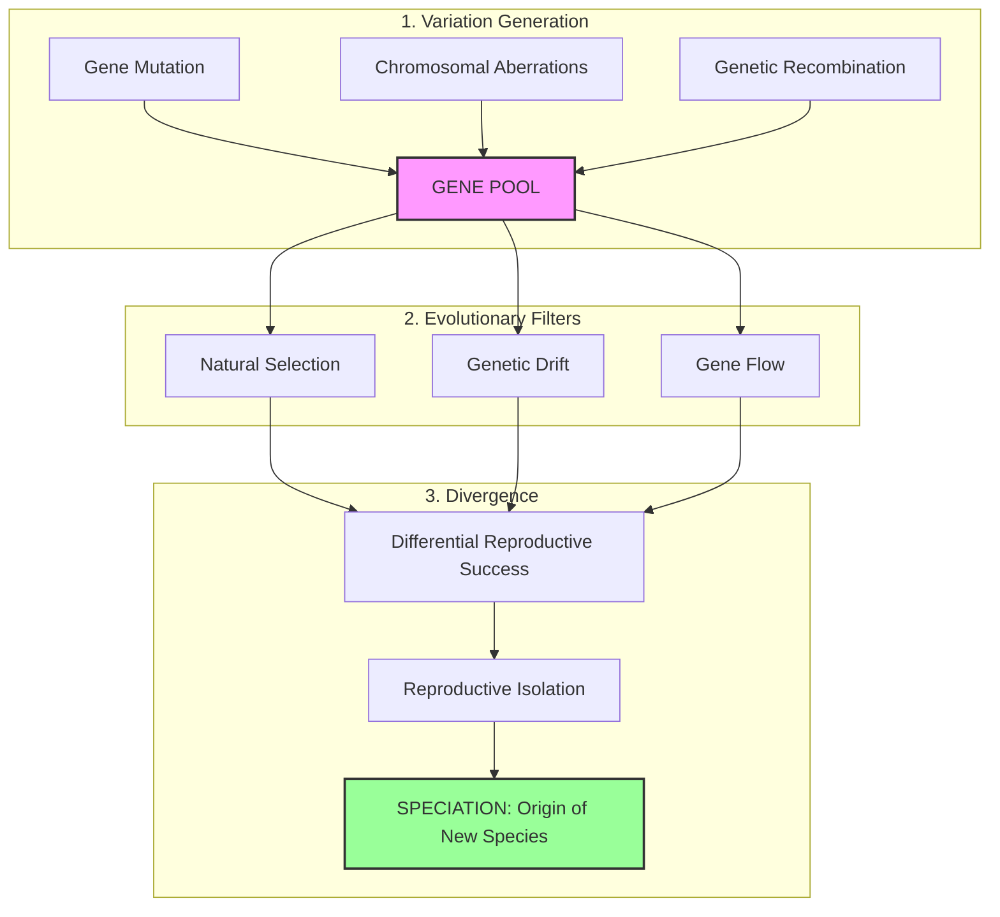

# VALUE ADD: Unit 1.4 - UNIT 1.4 & 1.5: PHYSICAL ANTHROPOLOGY & EVOLUTION
**Date:** May 31, 2026 | **Target:** PAPER I — UNIT 1.4 & 1.5: PHYSICAL ANTHROPOLOGY & EVOLUTION
**Syllabus Mapping:** Unit 1.4

# UPSC ANTHROPOLOGY PAPER I — UNIT 1.4: THEORIES OF ORGANIC EVOLUTION
## HIGH-YIELD VALUE-ADDITION STUDY MATERIAL & REVISION SHEET

---

## I. QUICK-REFERENCE THINKER & LITERATURE MATRIX

To secure top marks in UPSC, always anchor your answers with precise academic citations. Use this matrix to memorize key thinkers, their landmark publications, and their core conceptual contributions to Unit 1.4.

| Thinker | Landmark Publication / Year | Core Conceptual Contribution | UPSC Answer-Writing Utility |
| :--- | :--- | :--- | :--- |
| **Jean-Baptiste Lamarck** | *Philosophie Zoologique* (1809) | Formulated the first systematic theory of organic evolution; proposed *Besoin* (inner need) and inheritance of acquired traits. | Use to introduce Lamarckism; contrast his active organismic adaptation with Darwin's passive selection. |
| **Charles Darwin** | *On the Origin of Species* (1859) | Introduced Natural Selection acting on random variations; proposed "Survival of the Fittest" (coined by Herbert Spencer). | Use to introduce Darwinism; highlight the shift from teleological (purpose-driven) to mechanistic evolution. |
| **August Weismann** | *Das Keimplasma* (1892) | Germplasm Theory; experimentally disproved the inheritance of somatic modifications. | The ultimate critical tool against Lamarckism. Cite the historical 5-generation/901-mice experiment. |
| **Hugo de Vries** | *The Mutation Theory* (1901) | Proposed that evolution is discontinuous and driven by sudden, large heritable changes (*saltation*), not gradual variations. | Bridges the gap between Darwinism and the Modern Synthesis; explains the "arrival" of the fittest. |
| **Theodosius Dobzhansky** | *Genetics and the Origin of Species* (1937) | Defined evolution as "a change in the allele frequency within a gene pool"; synthesized genetics with natural selection. | The foundational text of the Synthetic Theory. Essential for defining Neo-Darwinism. |
| **Ernst Mayr** | *Systematics and the Origin of Species* (1942) | Formulated the **Biological Species Concept**; emphasized the role of geographic and reproductive isolation in speciation. | Use to explain the "Reproductive Isolation" pillar of the Synthetic Theory. |
| **George Gaylord Simpson** | *Tempo and Mode in Evolution* (1944) | Integrated paleontology into the Synthetic Theory; proved fossil records are consistent with genetic mechanisms. | Use to explain macroevolutionary dynamics within the Synthetic framework. |

---

## II. THE EVOLUTIONARY TRIAD: COMPARATIVE ANALYTICAL MATRIX

This matrix provides a direct, multi-dimensional comparison of the three core theories of Unit 1.4. Use this structure to write high-scoring comparative answers.

```
+--------------------------------------------------------------------------------------------------+
|                                  THE EVOLUTIONARY TRIAD                                          |
+--------------------------------------------------------------------------------------------------+
|  LAMARCKISM (1809)               |  DARWINISM (1859)               |  SYNTHETIC THEORY (1940s)   |
|  - Organism-driven               |  - Environment-driven           |  - Population-driven        |
|  - Active adaptation             |  - Passive selection            |  - Genetic & dynamic        |
|  - Somatic transmission          |  - Blending inheritance         |  - Allelic shift            |
+--------------------------------------------------------------------------------------------------+
```

| Comparative Dimension | Lamarckism (Inheritance of Acquired Characters) | Darwinism (Theory of Natural Selection) | Synthetic Theory of Evolution (Neo-Darwinism) |
| :--- | :--- | :--- | :--- |
| **Core Unit of Evolution** | The **Individual** organism. | The **Individual** organism. | The **Population** (Gene Pool). |
| **Nature of Variation** | Directed, purposeful, and adaptive (*teleological*), arising from environmental needs (*Besoin*). | Random, continuous, and undirected. Darwin could not explain its origin. | Random, arising from **Mutation, Recombination, and Chromosomal Aberrations**. |
| **Mechanism of Transmission** | Direct transmission of somatic modifications from parent to offspring. | **Pangenesis Theory** (flawed "gemmules" shed by body cells into gametes). | **Mendelian Genetics**; transmission of alleles via germ cells. No blending. |
| **Role of Environment** | Acts as a **direct stimulus** that forces the organism to change its habits and anatomy. | Acts as a **passive sieve** (selective agent) that eliminates unfit individuals. | Acts as a **dynamic filter** determining differential reproductive success of genotypes. |
| **Speciation Process** | Gradual, linear transformation of an entire lineage (*Anagenesis*) without branching. | Gradual branching (*Cladogenesis*) driven by the accumulation of favorable variations. | Branching (*Cladogenesis*) driven by the interaction of genetic variation, selection, and **Reproductive Isolation**. |
| **Major Scientific Flaw** | Violates the **Central Dogma of Molecular Biology** (information cannot flow from Protein $\rightarrow$ DNA). | Inability to explain the *origin* of variations or distinguish between heritable and non-heritable traits. | Highly complex; mathematical models of population genetics can be difficult to apply to fossil lineages. |

---

## III. CONCEPTUAL DIAGRAMS & FLOWCHARTS

### 1. The Giraffe Neck: Three Theories, One Trait
Use this comparative diagram in your exam to illustrate how each theory explains the same evolutionary phenomenon.

```
==================================================================================================
1. LAMARCKIAN MECHANISM (Active, Somatic Adaptation)
==================================================================================================
[Short-necked ancestor] ──> [Stretches neck for high leaves] ──> [Neck elongates during lifetime]
                                                                             │
[Longer neck inherited by offspring] <───────────────────────────────────────┘

==================================================================================================
2. DARWINIAN MECHANISM (Passive, Selective Elimination)
==================================================================================================
[Population with natural variation] ──> [Famine: Low leaves exhausted] ──> [Short-necked individuals starve]
(Short, Medium, & Long necks)                                                        │
                                                                                     ▼
[Long-necked individuals survive & reproduce] ──> [Over generations, average neck length increases]

==================================================================================================
3. SYNTHETIC MECHANISM (Genetic Shift in Gene Pool)
==================================================================================================
[Gene Pool: Alleles 'L' (long) & 's' (short)] ──> [Mutation/Recombination creates new 'L' combinations]
                                                                             │
[Natural Selection favors 'LL' & 'Ls' genotypes] <───────────────────────────┘
                      │
                      ▼
[Differential Reproduction: 'L' allele frequency rises from 0.10 to 0.95] ──> [Speciation occurs]
```

### 2. The Modern Synthesis Feedback Loop
This flowchart illustrates how the raw materials of evolution are processed by directional forces to result in speciation.



---

## IV. PREMIUM VALUE-ADD CASE STUDIES & MODERN TWISTS

To stand out from the average candidate, integrate these modern scientific validations and case studies into your answers.

### 1. Neo-Lamarckism & The Epigenetic Resurgence
While Weismann's Germplasm theory successfully disproved the inheritance of *structural* somatic changes (like cutting off tails), modern **Epigenetics** has revealed a molecular mechanism that partially validates Lamarck's core intuition: **environmental stress can leave heritable chemical marks on DNA without altering the underlying genetic sequence.**

```
+--------------------------------------------------------------------------------------------------+
|                                 THE EPIGENETIC BRIDGE                                            |
+--------------------------------------------------------------------------------------------------+
|  Environmental Stress (Famine/Toxins) ──> Chemical Tags (Methylation) ──> Transgenerational      |
|                                                                           Inheritance            |
+--------------------------------------------------------------------------------------------------+
```

*   **The Dutch Hunger Winter (1944–1945):**
    *   *The Context:* During WWII, the German blockade of the Netherlands subjected over 4.5 million people to severe famine.
    *   *The Finding:* Pregnant women exposed to famine gave birth to children who had higher rates of obesity, diabetes, and schizophrenia in adulthood. Remarkably, these health issues were **passed down to the grandchildren** (the F2 generation).
    *   *The Mechanism:* Molecular analysis revealed that prenatal starvation altered the **DNA methylation patterns** of the **IGF2 (Insulin-like Growth Factor II) gene**. These chemical tags bypassed the normal epigenetic reprogramming during fertilization, directly demonstrating **transgenerational epigenetic inheritance**—a modern, molecular form of Neo-Lamarckism.
*   **The Agouti Mouse Experiment (Waterland & Jirtle, 2003):**
    *   *The Context:* Genetically identical mice carrying the *Agouti* gene are yellow, obese, and highly prone to cancer.
    *   *The Finding:* Feeding pregnant yellow mice a diet rich in methyl donors (folic acid, vitamin B12) caused them to give birth to brown, slender, healthy offspring.
    *   *The Mechanism:* The maternal diet did not mutate the DNA sequence, but it chemically silenced the *Agouti* gene via methylation. This silenced state was inherited by the offspring, proving that maternal environmental exposure directly shapes offspring phenotype.

### 2. Darwinism & Synthetic Theory: Industrial Melanism
The classic textbook example of natural selection in action, updated with modern genetic insights.

*   **The Peppered Moth (*Biston betularia*):**
    *   *Pre-Industrial Era:* The light-colored (*typica*) form was dominant because it blended perfectly with lichen-covered tree trunks. The dark (*carbonaria*) form was rare and easily spotted by predators.
    *   *Post-Industrial Era:* Coal soot killed the lichens and blackened the tree trunks. Within decades, the frequency of the dark *carbonaria* form rose to over 98% in industrial areas like Manchester.
    *   *The Genetic Discovery (2016):* Researchers at the University of Liverpool identified that the *carbonaria* mutation was caused by a **transposable element (jumping gene) insertion** in the *Cortex* gene, which occurred around 1818. This case study perfectly illustrates the Synthetic Theory: a random mutation (variation) was acted upon by selective predation (natural selection), leading to a rapid shift in allele frequencies within the population's gene pool.

---

## V. HIGH-YIELD REVISION MNEMONICS

Use these mnemonics to quickly recall the core postulates and forces of Unit 1.4 during the high-pressure environment of the exam.

### 1. Lamarck's Postulates: **E-N-U-I** (Ennui)
*   **E** - **E**nvironmental Influence (initiates the evolutionary process).
*   **N** - **N**ew Needs (*Besoin* - drives behavioral shifts).
*   **U** - **U**se and Disuse of Organs (strengthens or atrophies structures).
*   **I** - **I**nheritance of Acquired Characters (transmits somatic changes to offspring).

### 2. Darwin's Postulates: **O-S-V-S-O** (Oh, So Very Smart Organisms!)
*   **O** - **O**verproduction (rapid multiplication of offspring).
*   **S** - **S**truggle for Existence (intraspecific, interspecific, environmental).
*   **V** - **V**ariations (universal presence of natural differences).
*   **S** - **S**urvival of the Fittest (natural selection of favorable traits).
*   **O** - **O**rigin of Species (gradual accumulation of traits over generations).

### 3. The 7 Forces of the Synthetic Theory: **MR. C. N. D. F. R.**
*(Mnemonic: **Mr.** **C**. **N**ever **D**rives **F**ast, **R**ight?)*
*   **M** - **M**utation (the ultimate source of new alleles).
*   **R** - **R**ecombination (shuffling of alleles during meiosis).
*   **C** - **C**hromosomal Aberrations (structural and numerical changes).
*   **N** - **N**atural Selection (differential reproductive success).
*   **D** - **D**rift (Genetic Drift / Sewall Wright Effect in small populations).
*   **F** - **F**low (Gene Flow / Migration between populations).
*   **R** - **R**eproductive Isolation (the final barrier that drives speciation).