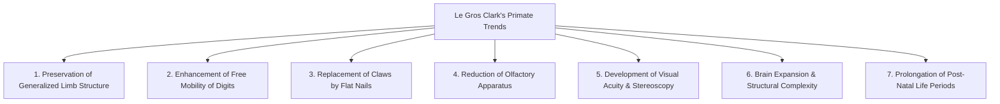
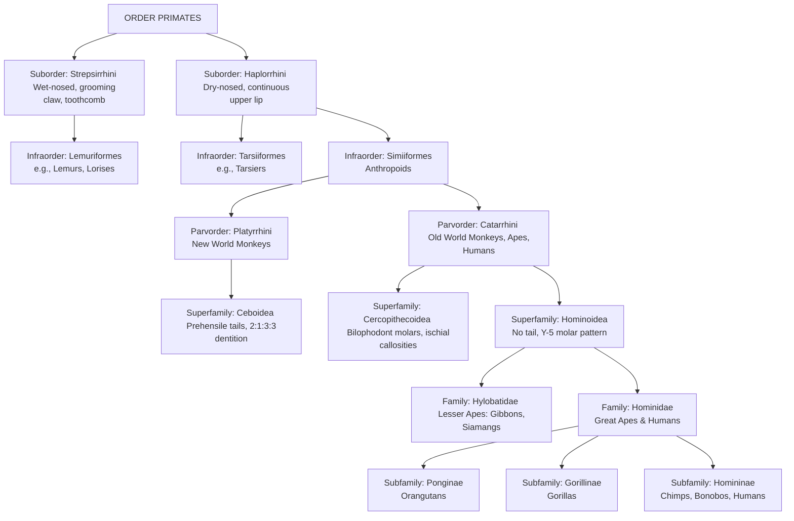
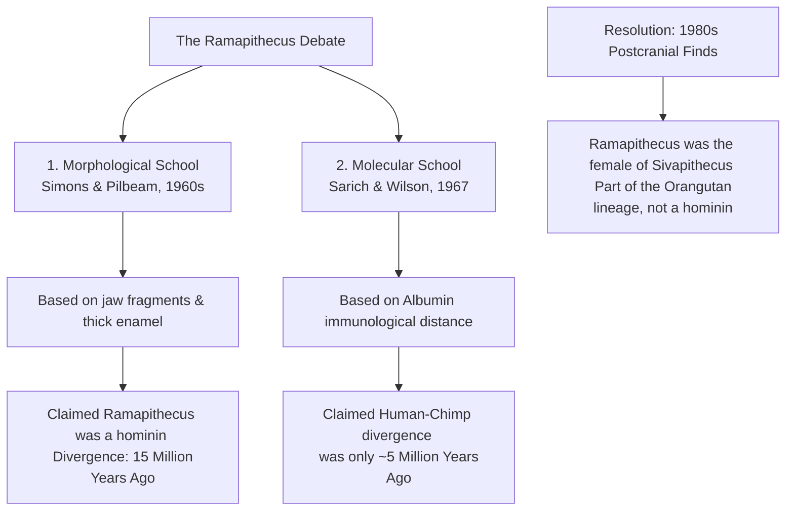
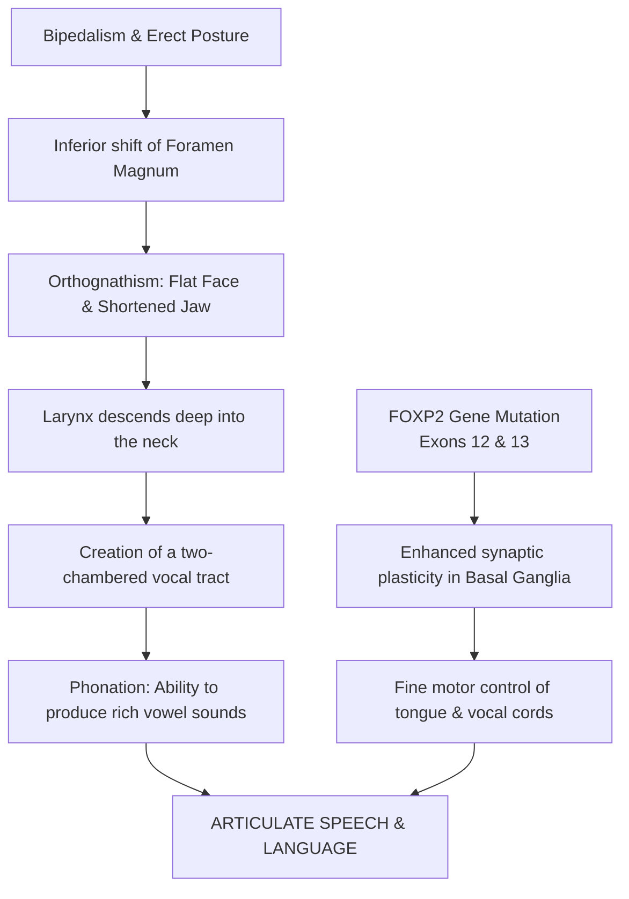

# VALUE ADD: Unit 1.5 - UNIT 1.4 & 1.5: PHYSICAL ANTHROPOLOGY & EVOLUTION
**Date:** May 31, 2026 | **Target:** PAPER I — UNIT 1.4 & 1.5: PHYSICAL ANTHROPOLOGY & EVOLUTION
**Syllabus Mapping:** Unit 1.5

# HIGH-YIELD REVISION & VALUE-ADDITION SHEET: UNIT 1.5

---

## SECTION 1: PRIMATE CHARACTERISTICS & TAXONOMY MASTERCLASS

### I. Le Gros Clark’s Evolutionary Trends (1959)
Sir Wilfrid Le Gros Clark established that primates cannot be defined by a single diagnostic feature, but rather by a suite of **progressive evolutionary trends** associated with an initial adaptation to **arboreal life**:



---

### II. Primate Taxonomy Tree



---

### III. High-Density Taxonomic Distinctions

#### 1. Suborder Strepsirrhini vs. Suborder Haplorrhini
* **Rhinarium (Nose):** Strepsirrhines possess a wet, naked rhinarium (split lip attached to gum); Haplorrhines have a dry, hairy rhinarium (continuous, free upper lip allowing diverse facial expressions).
* **Dental Specialization:** Strepsirrhines possess a **toothcomb** (procumbent lower incisors and canines used for grooming and scraping gum) and a **grooming claw** on the second digit of the foot. Haplorrhines lack both.
* **Orbits (Eye Sockets):** Strepsirrhines have a **post-orbital bar** (open back); Haplorrhines have complete **post-orbital closure** (bony cup protecting the eye).
* **Tapetum Lucidum:** Present in Strepsirrhines (reflective layer behind the retina for nocturnal vision); absent in Haplorrhines (except some nocturnal monkeys, which evolved alternative adaptations).

#### 2. Parvorder Platyrrhini (New World) vs. Parvorder Catarrhini (Old World)

```
      PLATYRRHINI (New World)                 CATARRHINI (Old World)
      
          [ \   / ]  <-- Nostrils point           ( O   O ) <-- Nostrils point
         /         \     outward/sideways        /         \    downward/close
        |  O     O  |                           |  O     O  |
        
      - Dental Formula: 2:1:3:3                 - Dental Formula: 2:1:2:3
      - Prehensile Tail: Present (some)         - Prehensile Tail: Absent (Ischial callosities)
      - Ectotympanic Bone: Ring-like            - Ectotympanic Bone: Bony tube
      - Habitat: Strictly Arboreal              - Habitat: Arboreal & Terrestrial
```

---

## SECTION 2: PRIMATE BEHAVIOUR & SOCIO-ECOLOGY

### I. The Trimates (Pioneering Field Researchers)
Under the mentorship of paleoanthropologist **Louis Leakey**, three female researchers (the "Trimates") revolutionized our understanding of wild hominoids:

```
+------------------+-------------------------+---------------------------------------------------------+
| Researcher       | Study Species & Site    | Key Behavioral Discoveries                              |
+------------------+-------------------------+---------------------------------------------------------+
| Jane Goodall     | Chimpanzees (Pan        | - First to document tool manufacture (termite fishing). |
|                  | troglodytes)            | - Observed hunting, meat-eating, and warfare.           |
|                  | Gombe, Tanzania         | - Shattered "Man the Toolmaker" paradigm.               |
+------------------+-------------------------+---------------------------------------------------------+
| Dian Fossey      | Mountain Gorillas       | - Documented female transfer between groups.            |
|                  | (Gorilla beringei)      | - Demystified aggressive "King Kong" stereotype.        |
|                  | Virunga, Rwanda         | - Highlighted vocalizations and close maternal bonds.   |
+------------------+-------------------------+---------------------------------------------------------+
| Birutė Galdikas  | Orangutans (Pongo       | - Mapped solitary social structure of frugivores.       |
|                  | pygmaeus)               | - Documented 8-year birth intervals (longest in         |
|                  | Tanjung Puting, Borneo  |   mammals) and extensive canopy tool use.               |
+------------------+-------------------------+---------------------------------------------------------+
```

---

### II. Key Behavioral Concepts & Case Studies

#### 1. Tool Use and Culture
* **Chimpanzees (Gombe & Bossou):** Use stone hammers and anvils to crack open oil palm nuts. This requires years of observational learning, demonstrating **cultural transmission** (non-genetic behavioral inheritance).
* **Orangutans (Suaq Balimbing):** Use specialized sticks to extract seeds from *Neesia* fruits, avoiding the stinging hairs of the fruit pod.

#### 2. Communication and Language Experiments
* **Washoe (Chimpanzee):** Taught American Sign Language (ASL) by Allen and Beatrix Gardner. Acquired over 130 signs and demonstrated **productivity** by combining signs to create new meanings (e.g., signing "water bird" upon seeing a swan).
* **Kanzi (Bonobo):** Studied by Sue Savage-Rumbaugh. Learned to communicate using a keyboard of geometric symbols (**lexigrams**) without formal training, demonstrating high-level receptive language comprehension.
* **Koko (Gorilla):** Trained by Penny Patterson. Learned over 1,000 ASL signs and demonstrated **displacement** (the ability to communicate about things not present in space or time, such as expressing grief over a deceased pet kitten).

#### 3. Socio-Ecological Model (Wrangham & van Schaik)
Primate social structures are driven by the distribution of resources and predator pressure:
* **Clumped, High-Quality Resources (e.g., Fruit):** Leads to **contest competition**, female philopatry, and strong, stable dominance hierarchies with coalitions (e.g., Macaques, Baboons).
* **Dispersed, Low-Quality Resources (e.g., Leaves):** Leads to **scramble competition**, female dispersal, and weak or absent dominance hierarchies (e.g., Colobines, Gorillas).

---

## SECTION 3: TERTIARY & QUATERNARY FOSSIL PRIMATES

### I. Chronological Evolutionary Sequence

```
  EPOCH          FOSSIL GENUS                KEY EVOLUTIONARY SIGNIFICANCE
  
  Oligocene      Aegyptopithecus ----------> Basal catarrhine; dental formula 2:1:2:3;
  (34-23 Ma)                                 bridge between prosimians and anthropoids.
  
  Miocene        Proconsul ----------------> Early hominoid; "dental ape" (Y-5 molar pattern
  (23-5.3 Ma)                                but lacked suspensory shoulder adaptations).
                 
                 Dryopithecus -------------> European ape; thin enamel; suspensory locomotion;
                                             possible ancestor of African great apes.
                 
                 Sivapithecus -------------> Asian ape; thick enamel; narrow interorbital distance;
                                             ancestral to modern Orangutans (Pongo).
                                             
  Pliocene       Australopithecus ---------> Definitive hominin; obligate bipedalism;
  (5.3-2.6 Ma)                               retained arboreal traits (curved phalanges).
  
  Pleistocene    Homo erectus -------------> First hominin to leave Africa; modern body proportions;
  (2.6-0.01 Ma)                              systematic tool manufacture (Acheulean).
```

---

### II. The Ramapithecus-Sivapithecus Debate: A Case Study in Evolutionary Theory



* **The Lesson:** This debate demonstrated that dental traits (like thick enamel) can evolve independently via **convergent evolution** due to dietary shifts (eating hard seeds/nuts), proving that molecular data is essential to calibrate morphological phylogenies.

---

## SECTION 4: COMPARATIVE ANATOMY & SKELETAL CHANGES OF ERECT POSTURE

### I. High-Density Comparative Matrix: Man vs. Ape

```
                  APE (Quadruped/Knuckle-walker)               MAN (Biped)
                  
  Skull           - Posterior foramen magnum                  - Inferior/centered foramen magnum
                  - Pronounced supraorbital torus             - Absent/reduced supraorbital torus
                  - Simian shelf (no chin)                    - True mental eminence (chin present)
                  
  Dentition       - U-shaped/parallel dental arcade           - Parabolic dental arcade
                  - Large canines with diastema               - Small, non-projecting canines
                  - Sectorial P3 (honing complex)             - Non-sectorial bicuspid P3
                  
  Spine           - Single C-shaped curve                     - Double S-shaped curve (lordosis)
                  
  Pelvis          - Long, narrow, flat ilium                  - Short, broad, bowl-shaped ilium
                  - Gluteus medius/minimus act as extensors   - Gluteus medius/minimus act as stabilizers
                  
  Femur           - Straight shaft (no valgus angle)          - Angled shaft (valgus/carrying angle)
                  - Weak/absent linea aspera                  - Highly developed, prominent linea aspera
                  
  Foot            - Divergent, opposable hallux (big toe)     - Adducted, parallel hallux
                  - Flat-footed (no arches)                   - Double arches (longitudinal & transverse)
```

---

### II. Biomechanical Implications of Erect Posture

#### 1. The Center of Gravity (CoG) Shift
In quadrupedal apes, the CoG lies anterior to the hip joint, requiring constant muscular effort from the limbs and back to prevent falling forward. In humans, the double S-shaped vertebral column and the valgus angle of the femur align the CoG directly along a vertical line passing through the head, hips, knees, and feet, minimizing muscular energy expenditure during standing and walking.

```
       APE (C-Curve, CoG Forward)              MAN (S-Curve, CoG Aligned)
       
                 O (Head)                                O (Head)
                /                                        |
               /   <-- C-Curve                           S <-- S-Curve
              /                                          |
            (CoG)                                      (CoG)
            /   \                                        |
           /     \                                     /   \
          /       \                                   /     \
```

#### 2. The Linea Aspera
The **linea aspera** is a prominent, rough longitudinal ridge on the posterior surface of the human femur. It serves as the insertion point for the powerful adductor and extensor muscles of the thigh (such as the *gluteus maximus* and *biceps femoris*). 
* **Evolutionary Significance:** Its high development in *Homo sapiens* is a direct response to the mechanical stresses of bipedal running and walking, providing the leverage necessary to stabilize the pelvis over the weight-bearing leg. In apes, this ridge is virtually non-existent because the femur does not bear weight vertically.

#### 3. The Obstetrical Dilemma vs. Energetics-of-Gestation (EGI) Hypothesis
* **The Classical Obstetrical Dilemma (Washburn, 1960):** Bipedalism requires a narrow pelvis to maintain mechanical efficiency, while encephalization (brain expansion) requires a wide birth canal. This conflict is resolved by **altriciality** (human babies are born neurologically immature).
* **The Modern Challenge — EGI Hypothesis (Dunsworth et al., 2012):** Recent metabolic research suggests that human gestation is limited by the mother's metabolic capacity to support the fetus's rapid brain growth, rather than pelvic constraints alone. The timing of birth occurs when fetal energy demands exceed the maximum metabolic rate the mother can sustain.

---

### III. The Vocal Tract & FOXP2 Gene Co-Evolution



---

## SECTION 5: THINKER REFERENCE DIRECTORY & MNEMONIC CHEAT SHEET

### I. Thinker Reference Directory

Use these names to ground your arguments in established academic research:

```
+---------------------+-----------------------------------+---------------------------------------------------------+
| Thinker             | Core Concept / Theory             | How to use in UPSC Answers                              |
+---------------------+-----------------------------------+---------------------------------------------------------+
| Sir Wilfrid Le Gros | Arboreal Adaptation Theory        | Cite when discussing the diagnostic characteristics of  |
| Clark               | (1959)                            | the primate order.                                      |
+---------------------+-----------------------------------+---------------------------------------------------------+
| Sherwood Washburn   | "New Physical Anthropology"       | Use to transition from descriptive anatomy to functional|
|                     | & Behavioral Primatology          | and evolutionary biomechanics.                          |
+---------------------+-----------------------------------+---------------------------------------------------------+
| Adolph Schultz      | Primate Ontogeny & Growth         | Cite when discussing the prolongation of life periods   |
|                     | Stages                            | in primates compared to other mammals.                  |
+---------------------+-----------------------------------+---------------------------------------------------------+
| Elwyn Simons &      | Ramapithecus Hominin Hypothesis   | Cite when discussing the history of Miocene fossil      |
| David Pilbeam       | (1960s)                           | discoveries and taxonomic revisions.                    |
+---------------------+-----------------------------------+---------------------------------------------------------+
| Vincent Sarich &    | Molecular Clock & Late            | Use to contrast the morphological school with genetic   |
| Allan Wilson        | Divergence Hypothesis (1967)      | evidence in hominoid evolution.                         |
+---------------------+-----------------------------------+---------------------------------------------------------+
| Richard Wrangham    | Socio-ecological Model of         | Cite to explain how food distribution shapes primate    |
|                     | Female Bonding (1980)             | social groups and dominance hierarchies.                |
+---------------------+-----------------------------------+---------------------------------------------------------+
```

---

### II. Mnemonic Cheat Sheet

* **Primate Evolutionary Trends (Le Gros Clark):** **L.I.M.B.S.**
  * **L**ocomotor adaptation (generalized limbs)
  * **I**ntellectual expansion (encephalization)
  * **M**anipulative hands (nails, opposability)
  * **B**inocular vision (stereoscopy)
  * **S**mell reduction (reduced rhinarium)
* **Skeletal Remodeling for Bipedalism:** **F.S.P.F.F.**
  * **F**oramen magnum (inferior position)
  * **S**pine (S-shaped curve)
  * **P**elvis (short, broad bowl)
  * **F**emur (valgus carrying angle)
  * **F**oot (double arches, non-opposable big toe)
* **Primate Social Structures:** **S.M.P.P.M.F.**
  * **S**olitary (Orangutan)
  * **M**onogamous (Gibbon)
  * **P**olyandrous (Tamarins)
  * **P**olygynous (Gorilla)
  * **M**ulti-male/Multi-female (Baboons)
  * **F**ission-Fusion (Chimpanzee)