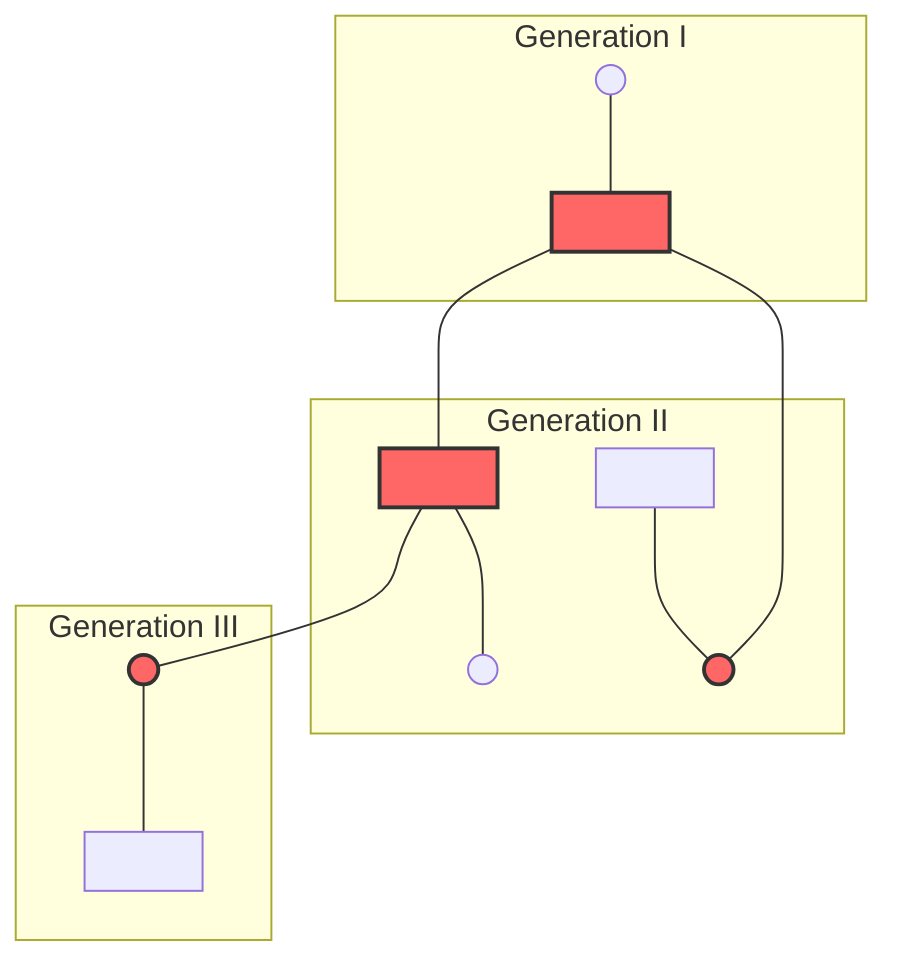
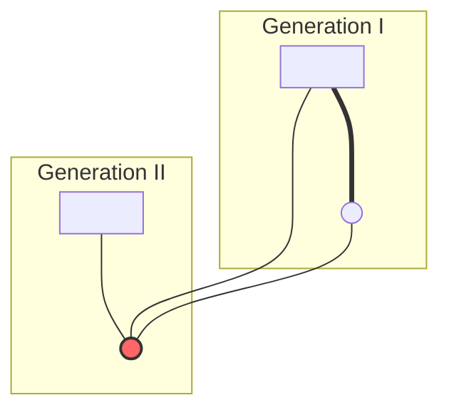
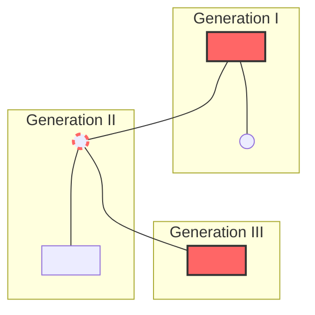

# VALUE ADD: Unit 9.1 - UNIT 1.4 & 1.5: PHYSICAL ANTHROPOLOGY & EVOLUTION
**Date:** June 03, 2026 | **Target:** PAPER I — UNIT 1.4 & 1.5: PHYSICAL ANTHROPOLOGY & EVOLUTION
**Syllabus Mapping:** Unit 9.1

# UNIT 9.1: HUMAN GENETICS — MENDELIAN GENETICS IN MAN

---

## I. FOUNDATIONAL FRAMEWORK & KEY THINKERS

Human genetics does not allow for experimental breeding. Instead, anthropologists and geneticists rely on observational data, pedigree analysis, and molecular sequencing to trace the inheritance of traits. 

```
[Mendel's Laws (1866)] ──(Rediscovery 1900)──> [Bateson & Garrod (1902)] ──> [Modern Clinical Genetics]
  - Segregation                                  - Coined "Genetics"           - Gene mapping
  - Independent Assortment                       - Alkaptonuria (AR)           - Targeted therapeutics
```

### Key Thinkers and Historical Milestones
* **Gregor Mendel (1866):** Formulated the laws of inheritance (Segregation and Independent Assortment) using *Pisum sativum*. He established that inheritance is **particulate** (controlled by discrete, non-blending "factors").
* **William Bateson (1902):** Coined the term **"Genetics"** and championed Mendelian principles in the animal kingdom.
* **Sir Archibald Garrod (1902):** Known as the **"Father of Chemical Genetics."** He published the first documented case of Mendelian inheritance in humans: **Alkaptonuria** (black urine disease). He coined the term **"Inborn Errors of Metabolism"** and proved it was inherited as an autosomal recessive trait.

---

## II. CORE MENDELIAN LAWS APPLIED TO HUMANS

### 1. Law of Segregation (First Law)
* **Definition:** Alleles segregate (separate) during gamete formation (meiosis) so that each gamete carries only one allele for each gene.
* **Human Application:** In a heterozygous carrier of Albinism ($Aa$), the gametes produced will be $50\%$ dominant ($A$) and $50\%$ recessive ($a$). Fertilization restores the diploid state.

```
          Parent 1: Carrier (Aa)  ×  Parent 2: Carrier (Aa)
                                  │
                         ┌────────┴────────┐
                         ▼                 ▼
                   Gametes: A, a     Gametes: A, a
                                  │
         ┌────────────────────────┼────────────────────────┐
         ▼                        ▼                        ▼
   Normal (AA) [25%]       Carrier (Aa) [50%]      Affected (aa) [25%]
```

### 2. Law of Independent Assortment (Second Law)
* **Definition:** Genes for different traits segregate independently of one another during the formation of gametes, provided they are located on different chromosomes (or far apart on the same chromosome).
* **Human Application:** The inheritance of the **ABO Blood Group** (on Chromosome 9) is completely independent of the inheritance of **Attached Earlobes** (on Chromosome 22).

---

## III. COMPREHENSIVE MATRIX OF MENDELIAN INHERITANCE MODES

| Mode of Inheritance | Genetic Mechanism | Pedigree Signature | Classic Human Examples | UPSC Value-Add / Indian Case Study |
| :--- | :--- | :--- | :--- | :--- |
| **Autosomal Dominant (AD)** | Expressed in both homozygotes ($AA$) and heterozygotes ($Aa$). Only one copy of the mutant allele is needed. | • **Vertical transmission** (no skipping of generations).<br>• Affected individuals have at least one affected parent.<br>• Males and females affected equally. | • Huntington’s Disease<br>• Achondroplasia<br>• Brachydactyly | **Huntington's in India:** Epidemiological studies show a high clustering of Huntington's Disease in certain endogamous populations in Karnataka and Maharashtra, traced back to historical founder mutations. |
| **Autosomal Recessive (AR)** | Expressed only in homozygotes ($aa$). Heterozygotes ($Aa$) are unaffected carriers. | • **Horizontal transmission** (skips generations).<br>• Affected individuals often born to unaffected carrier parents.<br>• Significantly elevated in **consanguineous marriages**. | • Albinism<br>• Cystic Fibrosis<br>• Sickle-Cell Anemia<br>• Alkaptonuria | **Consanguinity in South India:** High rates of uncle-niece and first-cousin marriages in states like Tamil Nadu and Andhra Pradesh lead to elevated frequencies of AR disorders like **Spinal Muscular Atrophy (SMA)** and **Beta-Thalassemia**. |
| **X-Linked Recessive (XR)** | Gene located on the X chromosome. Expressed in all hemizygous males ($X^a Y$) and only homozygous recessive females ($X^a X^a$). | • **Criss-cross inheritance** (affected grandfather $\rightarrow$ carrier daughter $\rightarrow$ affected grandson).<br>• No father-to-son transmission.<br>• Males affected far more than females. | • Hemophilia A & B<br>• Red-Green Color Blindness<br>• G6PD Deficiency | **G6PD Deficiency in Indian Tribes:** High prevalence ($>10\%$) of G6PD deficiency in malaria-endemic tribal populations (e.g., **Toda**, **Irula**, and **Kurumba** of the Nilgiris) acts as a protective mechanism against *Plasmodium falciparum* malaria. |
| **X-Linked Dominant (XD)** | Gene on the X chromosome. Expressed in both males ($X^A Y$) and females ($X^A X^a$ / $X^A X^A$). | • Affected fathers pass the trait to **all of their daughters** and **none of their sons**.<br>• Affected heterozygous mothers pass the trait to $50\%$ of offspring (both sexes). | • Vitamin D-Resistant Rickets<br>• Rett Syndrome (often lethal in males) | **Clinical Genetics:** XD rickets is often misdiagnosed as nutritional rickets in developing rural areas, highlighting the need for genetic screening in public health programs. |
| **Y-Linked (Holandric)** | Gene located strictly on the non-homologous region of the Y chromosome. | • **Strict patrilineal transmission** (father to **all** sons, **no** daughters). | • SRY Gene (Testis-determining factor)<br>• Hypertrichosis pinnae (Hairy ears) | **Evolutionary Marker:** Y-chromosome haplogroups (e.g., Haplogroup R1a1) are widely used by Indian physical anthropologists to trace the migration and demographic history of caste and tribal lineages. |

---

## IV. PEDIGREE SIGNATURES & TRANSMISSION PATHWAYS

### 1. Autosomal Dominant (AD) Pedigree
* **Key Feature:** Every affected individual has an affected parent. The trait appears in every generation.


*(Legend: Square = Male, Circle = Female, Red/Filled = Affected)*

### 2. Autosomal Recessive (AR) Pedigree
* **Key Feature:** Trait skips generations. Unaffected parents (carriers) can have affected children. Often associated with consanguineous marriages (indicated by a double line).



### 3. X-Linked Recessive (XR) Pedigree
* **Key Feature:** Affected males ($X^a Y$) inherit the allele from their unaffected carrier mothers ($X^A X^a$). No male-to-male transmission occurs because fathers pass their Y chromosome to their sons.


*(Legend: Dashed Circle = Carrier Female; Filled Square = Affected Male)*

---

## V. DEVIATIONS & COMPLEXITIES IN HUMAN MENDELIAN GENETICS

While basic Mendelian genetics assumes a simple one-to-one relationship between genotype and phenotype, human traits often exhibit complex variations:

```
               ┌── Codominance & Multiple Alleles (e.g., ABO Blood Group)
               ├── Pleiotropy (Single gene, multiple phenotypic effects)
DEVIATIONS ────┼── Penetrance (Percentage of individuals expressing the genotype)
               └── Expressivity (Severity or range of the phenotypic expression)
```

### 1. Codominance & Multiple Alleles (ABO Blood Group)
* **Mechanism:** A single gene locus has more than two alleles in a population. In the ABO system, the $I^A$, $I^B$, and $i$ alleles on Chromosome 9 control the expression of red blood cell antigens.
* **Codominance:** $I^A$ and $I^B$ are fully expressed together in the heterozygous state ($I^A I^B$), resulting in Blood Group AB. Both alleles are dominant over the recessive $i$ allele.

### 2. Pleiotropy
* **Mechanism:** A single gene mutation influences multiple, seemingly unrelated phenotypic traits.
* **Example:** **Sickle-Cell Anemia ($HbS$)**. A single nucleotide substitution (glutamic acid to valine in the $\beta$-globin chain) causes:
  1. Sickling of red blood cells (anemia and physical fatigue).
  2. Spleen damage and impaired immunity.
  3. Resistance to falciparum malaria (selective advantage in heterozygotes).

### 3. Penetrance vs. Expressivity
* **Penetrance:** The percentage of individuals with a specific genotype who actually display the associated phenotype.
  * *Incomplete Penetrance:* In **Polydactyly** (extra fingers/toes), some individuals carry the dominant mutant allele but have a normal number of digits.
* **Expressivity:** The degree or intensity with which a physical trait is expressed in an individual.
  * *Variable Expressivity:* One person with polydactyly might have a fully functional extra thumb, while another might only have a small, non-functional skin tag.

---

## VI. HIGH-YIELD REVISION CHEAT SHEET

### 1. Quick Diagnostic Guide for Pedigree Questions
* **Are there affected children of unaffected parents?**
  * **Yes:** The trait is **Recessive**.
  * **No:** The trait is **Dominant**.
* **Do affected males have affected fathers?**
  * **Yes:** The trait is **Autosomal** (or Y-linked if only males are affected).
  * **No (and mostly males are affected):** The trait is **X-Linked Recessive**.
* **Do affected fathers pass the trait to all of their daughters?**
  * **Yes (and none of their sons):** The trait is **X-Linked Dominant**.

### 2. Essential Vocabulary for High Marks
* **Hemizygous:** Having only a single copy of a gene instead of the customary two. Human males are hemizygous for genes on the X and Y chromosomes.
* **Consanguinity:** Mating between close biological relatives. It increases homozygosities, bringing rare, deleterious autosomal recessive alleles together in offspring.
* **Inborn Error of Metabolism:** Congenital biochemical disorders where enzyme deficiencies disrupt metabolic pathways (e.g., Phenylketonuria, Alkaptonuria).
* **Carrier:** A healthy individual who carries one copy of a recessive disease-causing allele and can pass it on to their offspring.

---

## VII. MODEL ANSWER BLUEPRINT

### Question: Discuss the patterns of inheritance of autosomal and sex-linked traits in humans with suitable examples. [20 Marks, 250 Words]

#### 1. Introduction (Approx. 40 words)
* Define Mendelian inheritance in humans as the transmission of monogenic traits governed by the laws of segregation and independent assortment. 
* Mention that these traits are classified into autosomal and sex-linked based on the chromosomal location of the gene.

#### 2. Autosomal Inheritance (Approx. 100 words)
* **Autosomal Dominant (AD):**
  * *Mechanism:* Expressed in heterozygotes ($Aa$). Vertical transmission pattern.
  * *Example:* Huntington's Disease (neurodegeneration) or Achondroplasia.
* **Autosomal Recessive (AR):**
  * *Mechanism:* Expressed only in homozygotes ($aa$). Horizontal transmission pattern; skips generations.
  * *Example:* Albinism or Sickle-Cell Anemia.
  * *Value-Add:* Highlight how consanguinity in endogamous Indian communities increases the risk of AR disorders.

#### 3. Sex-Linked Inheritance (Approx. 100 words)
* **X-Linked Recessive (XR):**
  * *Mechanism:* Expressed in hemizygous males ($X^a Y$) and homozygous females ($X^a X^a$). Characterized by criss-cross inheritance.
  * *Example:* Hemophilia or G6PD Deficiency.
  * *Value-Add:* Cite the high frequency of G6PD deficiency in Nilgiri tribes as an evolutionary adaptation to malaria.
* **X-Linked Dominant (XD):**
  * *Mechanism:* Affected males pass the trait to all daughters but no sons.
  * *Example:* Vitamin D-Resistant Rickets.
* **Y-Linked (Holandric):**
  * *Mechanism:* Strict father-to-son transmission.
  * *Example:* SRY gene or Hypertrichosis pinnae.

#### 4. Conclusion (Approx. 30 words)
* Summarize that understanding these inheritance patterns is essential for clinical genetic counseling, medical anthropology, and public health planning, particularly in highly endogamous populations.