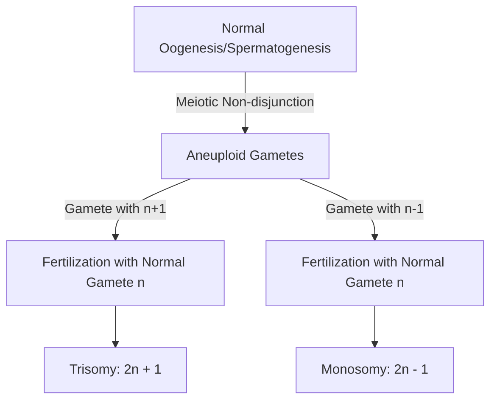
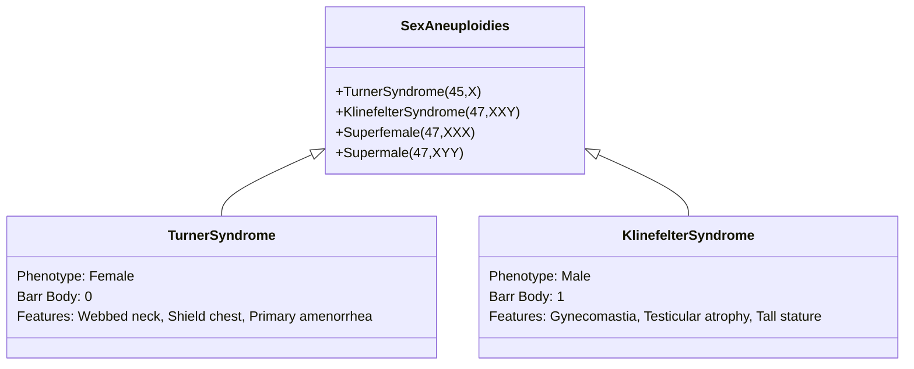
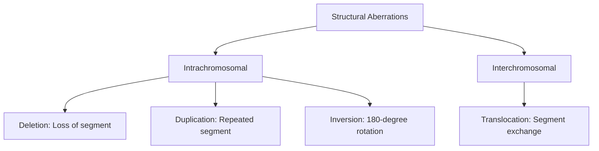
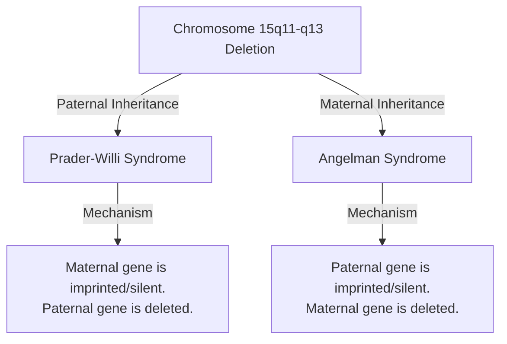

# VALUE ADD: Unit 9.2 - UNIT 1.4 & 1.5: PHYSICAL ANTHROPOLOGY & EVOLUTION
**Date:** June 04, 2026 | **Target:** PAPER I — UNIT 1.4 & 1.5: PHYSICAL ANTHROPOLOGY & EVOLUTION
**Syllabus Mapping:** Unit 9.2

# PAPER I — UNIT 9.2: CHROMOSOMES & CHROMOSOMAL ABERRATIONS IN MAN; GENETIC IMPRINTING

---

## I. THE HUMAN KARYOTYPE & CHROMOSOME ARCHITECTURE

### 1. Historical Milestone
In **1956**, **Joe Hin Tjio** and **Albert Levan** revolutionized cytogenetics by establishing that the normal human somatic chromosome complement is **$2n = 46$** (previously miscalculated as 48). 

### 2. Structural Classification of Chromosomes
Chromosomes are classified based on the position of the **centromere** (primary constriction) during mitotic metaphase, which divides the chromosome into a short arm (**p** for *petit*) and a long arm (**q**):

```mermaid
gantt
    title Chromosome Morphological Types
    dateFormat  X
    axisFormat %s
    
    section Metacentric
    Centromere in Middle (p ≈ q) :active, 0, 10
    
    section Submetacentric
    Sub-median Centromere (p < q) :active, 0, 10
    
    section Acrocentric
    Near-terminal Centromere (p is tiny/satellite) :active, 0, 10
    
    section Telocentric
    Terminal Centromere (No p arm - Not in humans) :active, 0, 10
```



* **Metacentric:** Centromere is median; arms are approximately equal (e.g., Chromosomes 1, 3, 19, 20).
* **Submetacentric:** Centromere is sub-median; one arm is distinctly shorter than the other (e.g., Chromosomes 2, 4–12, X).
* **Acrocentric:** Centromere is nearly terminal; the short arm (p) is extremely small, often terminating in non-coding **satellites** containing ribosomal RNA genes (e.g., Chromosomes 13, 14, 15, 21, 22, Y).
* **Telocentric:** Centromere is at the absolute tip. *Note: Telocentric chromosomes do not occur naturally in the normal human karyotype.*

---

### 3. The Denver Classification System (1960)
To standardize human cytogenetics, the Denver Conference classified the 22 pairs of autosomes and 1 pair of sex chromosomes into **seven groups (A to G)** based on size and centromeric index:

| Group | Chromosomes | Morphological Description |
| :--- | :--- | :--- |
| **Group A** | 1, 2, 3 | Very large; Metacentric (1, 3) and Submetacentric (2). |
| **Group B** | 4, 5 | Large; Submetacentric. |
| **Group C** | 6–12, X | Medium-sized; Submetacentric. |
| **Group D** | 13, 14, 15 | Medium-sized; Acrocentric with satellites. |
| **Group E** | 16, 17, 18 | Relatively short; Metacentric (16) and Submetacentric (17, 18). |
| **Group F** | 19, 20 | Short; Metacentric. |
| **Group G** | 21, 22, Y | Very short; Acrocentric. (21 and 22 have satellites; Y does not). |

---

## II. NUMERICAL CHROMOSOMAL ABERRATIONS (ANEUPLOIDY)

Numerical aberrations arise primarily due to **Meiotic Non-disjunction**—the failure of homologous chromosomes (Meiosis I) or sister chromatids (Meiosis II) to separate cleanly during gametogenesis.



---

### 1. Autosomal Aneuploidies (High-Yield Clinical Profiles)

#### A. Down Syndrome (Trisomy 21)
* **Karyotype:** $47,XX,+21$ or $47,XY,+21$ (95% due to maternal meiotic non-disjunction, strongly correlated with advanced maternal age).
* **Phenotypic Markers:** 
  * Prominent **epicanthic folds** (slanted eyes).
  * Flat facial profile and depressed nasal bridge.
  * **Simian crease** (a single transverse palmar crease).
  * Clinodactyly (inward curving of the 5th digit).
  * Moderate to severe intellectual disability.
  * Congenital heart defects (e.g., Atrioventricular septal defects).

#### B. Edwards Syndrome (Trisomy 18)
* **Karyotype:** $47,XX,+18$ or $47,XY,+18$.
* **Phenotypic Markers:** Micrognathia (receding jaw), low-set malformed ears, **clenched fists with overlapping fingers**, rocker-bottom feet, and severe developmental delays. High infant mortality rate within the first year.

#### C. Patau Syndrome (Trisomy 13)
* **Karyotype:** $47,XX,+13$ or $47,XY,+13$.
* **Phenotypic Markers:** **Cleft lip and palate**, microphthalmia (small eyes), **polydactyly** (extra digits), holoprosencephaly (failure of brain hemispheres to divide), and cardiac anomalies. Survival beyond infancy is rare.

---

### 2. Sex Chromosomal Aneuploidies

Unlike autosomal trisomies, sex chromosome aneuploidies are better tolerated due to **X-inactivation (Lyonization)** and the low gene density of the Y chromosome.



#### A. Klinefelter Syndrome
* **Karyotype:** $47,XXY$ (Possesses **1 Barr Body**).
* **Phenotype:** Male.
* **Clinical Features:** Tall stature, elongated limbs, **gynecomastia** (breast development), testicular atrophy, azoospermia (infertility), and reduced secondary male sexual characteristics due to low testosterone.

#### B. Turner Syndrome
* **Karyotype:** $45,X$ or $45,X0$ (Possesses **0 Barr Bodies**).
* **Phenotype:** Female.
* **Clinical Features:** Short stature, **webbed neck** (pterygium colli), **shield-like chest** with widely spaced nipples, streak ovaries (gonadal dysgenesis) leading to primary amenorrhea and infertility, and coarctation of the aorta.

#### C. Multi-X Females ("Superfemales") & Double-Y Males ("Supermales")
* **Triple X Syndrome ($47,XXX$):** Female phenotype, usually fertile, mild learning disabilities, possesses **2 Barr Bodies**.
* **Jacob's Syndrome ($47,XYY$):** Male phenotype, tall stature, severe acne during adolescence, normal fertility, and cognitive profiles within normal limits.

---

## III. STRUCTURAL CHROMOSOMAL ABERRATIONS

Structural aberrations occur when chromosomes break and undergo abnormal rearrangement during crossing over or due to environmental mutagens (radiation, chemicals).



---

### 1. Deletions (Deficiencies)
The loss of a chromosomal segment. Can be terminal (at the end) or interstitial (within the arm).
* **Cri-du-Chat (Cat-Cry) Syndrome:**
  * **Mechanism:** Terminal deletion of the short arm of chromosome 5 (**$5p-$**).
  * **Phenotype:** High-pitched, cat-like mewing cry in infants (due to abnormal larynx development), microcephaly, severe intellectual disability, and low-set ears.

---

### 2. Inversions
A $180^\circ$ rotation of a chromosomal segment. Inversions do not alter gene dosage but change gene order, which can disrupt linkage groups and cause meiotic complications.
* **Paracentric Inversion:** The inverted segment **does not** include the centromere.
* **Pericentric Inversion:** The inverted segment **includes** the centromere, altering the arm ratio (can convert a metacentric chromosome into a submetacentric one).

---

### 3. Translocations
The transfer of a chromosomal segment to a non-homologous chromosome.

```mermaid
graph LR
    subgraph Reciprocal ["Reciprocal Translocation"]
        A[Chr 4] <--> B[Chr 20]
        Note1[No genetic material lost]
    end
    subgraph Robertsonian ["Robertsonian Translocation"]
        C[Chr 14 Acrocentric] + D[Chr 21 Acrocentric] --> E[Chr 14/21 Hybrid]
        Note2[Loss of short p-arms]
    end
```

* **Reciprocal Translocation:** Two non-homologous chromosomes exchange segments. It is a balanced rearrangement; no genetic material is lost or gained.
* **Robertsonian Translocation:** Occurs exclusively between **acrocentric chromosomes** (Groups D and G: 13, 14, 15, 21, 22).
  * **Mechanism:** The long arms (q) of two acrocentric chromosomes fuse at the centromere to form a single, large metacentric chromosome. The tiny short arms (p) containing redundant ribosomal RNA genes are lost.
  * **Clinical Significance:** A Robertsonian translocation between chromosomes 14 and 21 ($der(14;21)$) is a major cause of **Familial Down Syndrome**, which is independent of maternal age and can be passed down by clinically normal carrier parents (who have 45 chromosomes but a complete genetic complement).

---

## IV. GENOMIC IMPRINTING (THE EPIGENETIC FRONTIER)

### 1. Definition
Genomic Imprinting is an epigenetic phenomenon in which **genes are expressed in a parent-of-origin-specific manner**. Unlike classical Mendelian inheritance where both maternal and paternal alleles are active, imprinted genes are biochemically silenced in one of the parental gametes.

### 2. Molecular Mechanism
* Silencing is achieved via **DNA methylation** (adding methyl groups to cytosine bases in CpG islands) and **histone modification** (deacetylation).
* This molecular "imprint" is established during gametogenesis, maintained throughout mitosis in somatic cells, and erased and reset during meiosis in the individual's own germline.

---

### 3. Classic Anthropological Case Study: Chromosome 15q11-q13
The clinical consequences of genomic imprinting are demonstrated by two distinct neurodevelopmental disorders caused by the exact same genetic deletion on **Chromosome 15 (region 15q11-q13)**, depending entirely on which parent transmits the deletion:



#### A. Prader-Willi Syndrome (PWS)
* **Etiology:** The active paternal copy of the *SNRPN* and *NDN* genes in the 15q11-q13 region is deleted or lost (often due to **Maternal Uniparental Disomy**—where the child inherits two silenced maternal copies of chromosome 15).
* **Clinical Phenotype:** Infantile hypotonia (floppiness), hyperphagia (insatiable appetite) leading to **morbid obesity** in early childhood, hypogonadism, short stature, and mild cognitive impairment.

#### B. Angelman Syndrome (AS) ("Happy Puppet Syndrome")
* **Etiology:** The active maternal copy of the *UBE3A* gene (ubiquitin protein ligase E3A) in the 15q11-q13 region is deleted or lost (often due to **Paternal Uniparental Disomy**—where the child inherits two silenced paternal copies).
* **Clinical Phenotype:** Severe intellectual disability, speech impairment (often completely non-verbal), **ataxic gait (jerky, puppet-like movements)**, microcephaly, and a uniquely cheerful disposition characterized by **frequent, unprovoked laughter**.

---

## V. ANTHROPOLOGICAL & EVOLUTIONARY SIGNIFICANCE

Cytogenetics and chromosomal studies provide deep insights into human evolutionary history and population dynamics:

1. **The Human-Chimpanzee Divergence (Chromosome 2 Fusion):**
   * Great apes (Chimpanzees, Gorillas, Orangutans) possess **$2n = 48$** chromosomes, while humans have **$2n = 46$**.
   * Cytogenetic sequencing revealed that **Human Chromosome 2 is the product of a head-to-head telomeric fusion of two ancestral ape chromosomes** (ancestral chromosomes 2a and 2b).
   * This is proven by the presence of a **second, deactivated centromere** and **internal, vestigial telomeric sequences** in the middle of human chromosome 2.
2. **Chromosomal Polymorphisms as Population Markers:**
   * Variations in the heterochromatic regions of chromosomes (e.g., the long arm of the Y chromosome, $Yq$, or pericentric inversions of Chromosome 9) vary in frequency across different ethnic and geographical populations. These serve as valuable markers in **Physical Anthropology** to trace migration patterns and genetic drift.
3. **Consanguinity and Chromosomal Health:**
   * Inbreeding increases the expression of recessive structural chromosomal anomalies and microdeletions, which is a key focus of study in **Demographic and Medical Anthropology**.

---

## VI. QUICK-RECALL REVISION MATRIX

| Disorder | Chromosomal Formula | Primary Genetic Mechanism | Key Diagnostic Phenotypes |
| :--- | :--- | :--- | :--- |
| **Down Syndrome** | $47,XX/XY,+21$ | Meiotic Non-disjunction (95%) | Epicanthic folds, Simian crease, intellectual disability. |
| **Edwards Syndrome** | $47,XX/XY,+18$ | Meiotic Non-disjunction | Clenched fists, overlapping fingers, rocker-bottom feet. |
| **Patau Syndrome** | $47,XX/XY,+13$ | Meiotic Non-disjunction | Cleft lip/palate, polydactyly, microphthalmia. |
| **Klinefelter Syndrome** | $47,XXY$ | Sex chromosome non-disjunction | Tall male, gynecomastia, sterile, 1 Barr body. |
| **Turner Syndrome** | $45,X$ | Sex chromosome non-disjunction | Short female, webbed neck, streak ovaries, 0 Barr bodies. |
| **Cri-du-Chat** | $45,XX/XY,5p-$ | Terminal deletion of $5p$ | Cat-like cry, microcephaly, laryngeal hypoplasia. |
| **Prader-Willi** | $45,XX/XY,del(15q11-13)$ | Paternal deletion / Maternal UPD | Hyperphagia, obesity, hypotonia, hypogonadism. |
| **Angelman** | $45,XX/XY,del(15q11-13)$ | Maternal deletion / Paternal UPD | Ataxic gait, unprovoked laughter, non-verbal. |

---

## VII. KEY THINKERS DIRECTORY

* **Tjio & Levan (1956):** Established the correct human chromosome count of $2n = 46$.
* **Jerome Lejeune (1959):** Discovered that Down Syndrome is caused by an extra chromosome 21 (Trisomy 21), establishing the link between chromosomal aberrations and clinical syndromes.
* **Mary Lyon (1961):** Formulated the **Lyon Hypothesis** of X-inactivation, explaining why females with $XX$ do not overproduce X-linked gene products and why sex chromosome aneuploidies (like $XXY$ and $X0$) are clinically survivable.
* **Denver Conference (1960):** Standardized the human karyotype classification system, grouping chromosomes by size and centromere location.