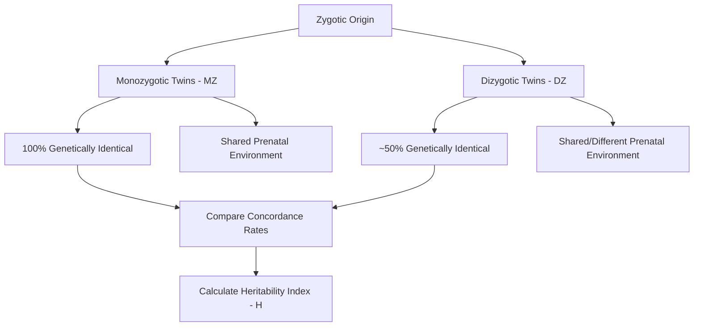
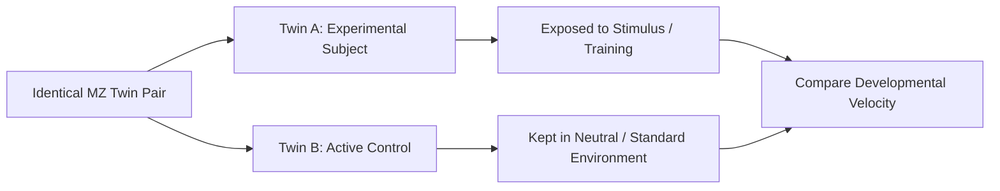
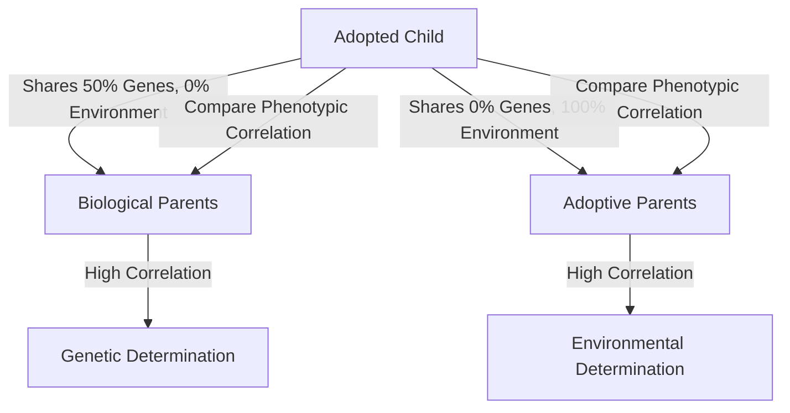
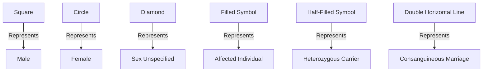
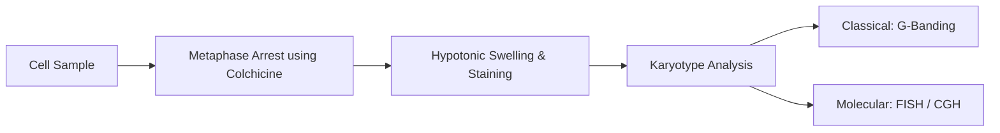

# VALUE ADD: Unit 9.5 - UNIT 1.4 & 1.5: PHYSICAL ANTHROPOLOGY & EVOLUTION
**Date:** June 06, 2026 | **Target:** PAPER I — UNIT 1.4 & 1.5: PHYSICAL ANTHROPOLOGY & EVOLUTION
**Syllabus Mapping:** Unit 9.5

# UNIT 9.5: METHODS FOR STUDYING GENETIC PRINCIPLES IN MAN

---

## I. QUICK-REFERENCE THINKER & METHODOLOGY MAP

To secure high marks in the UPSC exam, you must explicitly link genetic methodologies to the pioneering thinkers who formulated them and the landmark studies that validated them.

| Methodology | Key Thinkers / Pioneers | Landmark Study / Classic Reference | Core Anthropological Utility |
| :--- | :--- | :--- | :--- |
| **Twin Study Method** | **Francis Galton** (1875) | *Inquiries into Human Faculty and Its Development* (1883) | Quantifying the relative contributions of heredity (Nature) vs. Environment (Nurture). |
| **Co-Twin Control Method** | **Arnold Gesell** (1929) | Gesell & Thompson’s early motor training studies in identical twins | Isolating specific environmental/educational interventions while keeping genetics constant. |
| **Foster Child / Adoption Study** | **Thomas Bouchard Jr.** | **MISTRA** (Minnesota Study of Twins Reared Apart, 1979–1990) | Eliminating the "shared environment" variable to isolate pure genetic heritability. |
| **Pedigree Analysis** | **Wilhelm Weinberg** & **Sir John Landon Down** | Tracing Hemophilia in European Royal Families (Queen Victoria’s pedigree) | Determining modes of inheritance (dominant/recessive, autosomal/sex-linked) in human families. |
| **Cytogenetic Method** | **Tjio and Levan** (1956), **Caspersson** (1970) | Discovery of the correct human chromosome count ($2n = 46$) | Visualizing chromosomal morphology, mapping structural aberrations, and tracing primate phylogenies. |

---

## II. THE TWIN STUDY METHOD (NATURE VS. NURTURE)

Because experimental breeding is ethically impossible in humans, twins serve as a vital "natural experiment."



### 1. Mathematical Foundations of Twin Studies
To determine the genetic basis of a trait, anthropologists compare the **Concordance Rate** (the percentage of twin pairs in which both individuals express the trait) between Monozygotic (MZ) and Dizygotic (DZ) twins.

#### Holzinger’s Heritability Index ($H$)
The relative influence of genetic factors is calculated using **Holzinger’s Formula**:

$$H = \frac{C_{MZ} - C_{DZ}}{100 - C_{DZ}}$$

Where:
* $C_{MZ}$ = Concordance rate in Monozygotic twins (%).
* $C_{DZ}$ = Concordance rate in Dizygotic twins (%).

##### Interpretation Matrix:
* If $H \to 1.0$ (or $100\%$): The trait is **highly heritable** (e.g., eye color, fingerprint ridge count).
* If $H \to 0.0$: The trait is **purely environmental** (e.g., language spoken, specific cultural beliefs).

#### Falconer’s Formula (For Continuous/Quantitative Traits)
For continuous traits like stature or IQ, correlation coefficients ($r$) are used:

$$h^2 = 2(r_{MZ} - r_{DZ})$$

Where $h^2$ is the narrow-sense heritability.

### 2. Methodological Limitations & Modern Epigenetic Corrections
While highly elegant, the classical twin method suffers from several systemic biases:

* **The Equal Environments Assumption (EEA) Fallacy:** It assumes that MZ and DZ twins reared in the same home experience identical environmental pressures. In reality, MZ twins are often treated more similarly, dressed alike, and share closer social circles, which artificially inflates the calculated heritability ($H$).
* **Post-Zygotic Somatic Mutations:** MZ twins are not always 100% genetically identical. Copy Number Variations (CNVs) and point mutations can occur after the blastocyst splits.
* **Epigenetic Divergence (The Fraga Landmark Study, 2005):** **Mario Fraga et al.** demonstrated that while young MZ twins are epigenetically indistinguishable, older MZ twins exhibit dramatic differences in **DNA methylation** and **histone acetylation** patterns due to divergent lifestyles and environmental exposures. This explains why one identical twin may develop an autoimmune disease or schizophrenia while the other remains healthy.

---

## III. THE CO-TWIN CONTROL METHOD

This specialized variation of the twin study isolates the direct impact of environmental training or physical therapy.

### 1. The Research Design


* **The Setup:** Because MZ twins share 100% of their genetic material, they act as the perfect control for one another. 
* **The Protocol:** Twin A is exposed to a specific stimulus, training regimen, drug, or diet (e.g., intensive early language training). Twin B is kept in a standard, neutral environment.
* **The Conclusion:** Any statistically significant developmental acceleration or physiological change in Twin A can be attributed entirely to the environmental intervention, completely free of genetic confounding variables.

### 2. Classic Anthropological Application
* **Gesell’s Stair-Climbing Experiment:** Arnold Gesell trained one twin in stair-climbing from early infancy. The untrained co-twin, when introduced to stairs later, rapidly caught up with minimal effort once biologically mature. This proved that **neurological maturation** is genetically predetermined and sets limits on environmental training.

---

## IV. FOSTER CHILD / ADOPTION STUDIES

This method breaks the confounding link between genetic inheritance and environmental upbringing by studying children separated from their biological families at birth.



### 1. The Analytical Framework
* **Genetic Influence:** If an adopted child’s phenotype (e.g., IQ, body mass index, susceptibility to schizophrenia) correlates strongly with their **biological parents**, it indicates a powerful **genetic determination**.
* **Environmental Influence:** If the child's phenotype correlates more closely with their **adoptive parents**, it points to **environmental determination**.

### 2. Methodological Pitfalls & Biases
* **Selective Placement Bias:** Adoption agencies often place children in homes that match the socioeconomic, racial, or cultural background of their biological parents. This artificial alignment of environments can lead to an overestimation of genetic heritability.
* **Prenatal Maternal Effects:** The biological mother provides the prenatal environment (nutrition, stress hormones, maternal smoking/alcohol use). Traits attributed to genetics may actually stem from these early uterine influences.
* **Virtual Twins (Nancy Segal):** To counter these biases, modern researchers study "virtual twins"—same-age, unrelated children adopted into the same family simultaneously. This isolates the "pure environment" variable.

---

## V. PEDIGREE ANALYSIS & FAMILY STUDIES

Pedigree analysis uses standardized symbols to map a family tree across multiple generations, allowing researchers to trace the transmission of a single gene.

### 1. Standardized Pedigree Symbols (For Exam Diagrams)



### 2. Diagnostic Rules for Inheritance Patterns

To solve pedigree problems or describe them in your answers, use these diagnostic criteria:

```
1. Autosomal Dominant (AD)
   [Affected Child] ---> Must have at least one [Affected Parent]
   * No generation skipping.
   * Equal male/female distribution.

2. Autosomal Recessive (AR)
   [Affected Child] ---> Can have [Unaffected Carrier Parents]
   * Often skips generations.
   * High incidence in consanguineous marriages.

3. X-Linked Recessive (XR)
   [Affected Father] ---> [Carrier Daughter] ---> [Affected Grandson]
   * Never passed from father to son.
   * Predominantly affects males.

4. X-Linked Dominant (XD)
   [Affected Father] ---> Passes trait to 100% of [Daughters] (0% of Sons)
   * Does not skip generations.

5. Y-Linked (Holandric)
   [Affected Father] ---> Passes trait to 100% of [Sons] (0% of Daughters)
   * Only males are affected.
```

---

## VI. CYTOGENETIC METHODS

Cytogenetics bridges cellular biology and physical anthropology, allowing researchers to directly visualize chromosomes to diagnose genetic disorders and trace evolutionary relationships.



### 1. Classical Cytogenetics: Karyotyping & Banding
* **Karyotyping:** Cells (usually lymphocytes) are cultured and arrested in **metaphase** using **colchicine** (which disrupts spindle fibers). The chromosomes are stained, photographed, and arranged systematically by size, centromere position, and banding patterns.
* **G-Banding (Giemsa Staining):** Treatment with trypsin followed by Giemsa stain produces alternating light and dark bands:
  * **Dark Bands (G-positive):** AT-rich, gene-poor, late-replicating DNA.
  * **Light Bands (G-negative):** GC-rich, gene-dense, early-replicating transcriptionally active DNA.
* **Anthropological Utility:** Diagnosing numerical chromosomal aberrations (e.g., Down Syndrome $47,XX,+21$; Turner Syndrome $45,X$) and structural changes (translocations, inversions).

### 2. Molecular Cytogenetics: The Modern Frontier
* **Fluorescence In Situ Hybridization (FISH):** Uses fluorescently labeled single-stranded DNA probes to bind to complementary target sequences on chromosomes.
  * *Utility:* Detects microdeletions, microduplications, and gene mapping too small to see with standard G-banding.
* **Comparative Genomic Hybridization (CGH):** Compares test DNA (e.g., from a patient or a fossil hominin) with normal reference DNA using different fluorescent dyes to detect copy number variations (CNVs) across the entire genome.

### 3. Evolutionary Cytogenetics (Comparative Primatology)
Cytogenetic methods are highly valuable for tracing human evolution:
* **The Human-Chimpanzee Chromosome Fusion:** Comparative G-banding reveals that **Human Chromosome 2** is the result of a head-to-head fusion of two ancestral ape chromosomes (2p and 2q) that remain separate in chimpanzees, gorillas, and orangutans ($2n=48$ in apes vs. $2n=46$ in humans). This fusion site is marked by a deactivated centromere and vestigial internal telomeres on human Chromosome 2.

```
Ancestral Ape Chromosomes:   [Chr 2a]  +  [Chr 2b]   (Separate in Chimpanzees)
                                 \          /
                                  \        /
Fusion Event:                      \      /
                                    v    v
Modern Human Chromosome:     [--- Centromere 1 --- Vestigial Telomere --- Deactivated Centromere 2 ---]
```

---

## VII. HIGH-YIELD VALUE-ADD CASE STUDIES & INDIAN CONTEXT

Integrating Indian context and specific case studies into your answers for Unit 9.5 will demonstrate a deep, nuanced understanding of the material.

### 1. Consanguinity and Pedigree Studies in South India
* **The Context:** South India (particularly parts of Andhra Pradesh, Karnataka, and Tamil Nadu) has historically high rates of consanguineous marriages (uncle-niece, first-cousin), sometimes exceeding $30\%$ in certain communities.
* **Anthropological Application:** Pedigree studies in these populations have been vital in mapping rare autosomal recessive disorders. 
* **The Case Study:** Anthropological surveys among endogamous caste groups (e.g., the **Vysya** community) have used pedigree analysis to trace the high prevalence of **Pseudocholinesterase Deficiency**, a genetic condition that causes life-threatening muscle paralysis when patients are given standard anesthetic drugs (succinylcholine).

### 2. The Great Andamanese Population Bottleneck (Cytogenetic & Pedigree Studies)
* **The Context:** The isolated tribal populations of the Andaman Islands (e.g., Onge, Jarawa, Great Andamanese) have faced severe population declines.
* **Anthropological Application:** Combining pedigree reconstruction with cytogenetic screening has helped researchers document high rates of infant mortality and infertility. These studies revealed that the population decline was driven by a loss of genetic diversity (founder effect) rather than chromosomal abnormalities, guiding targeted public health and conservation efforts.

---

## VIII. MODEL PYQ ANSWERS & STRUCTURAL BLUEPRINTS

### PYQ: "Discuss the twin study method in human genetics. What are its limitations?" [2022, 15 Marks]

#### Structural Blueprint:

```
1. Introduction (Approx. 40 words)
   * Define the Twin Study Method (pioneered by Francis Galton).
   * State its core purpose: separating genetic (Nature) and environmental (Nurture) influences.

2. Core Methodology & Mathematical Formulas (Approx. 120 words)
   * Explain the biological difference between MZ (100% genes shared) and DZ (50% genes shared) twins.
   * Present Holzinger's Heritability Index formula: H = (C_MZ - C_DZ) / (100 - C_DZ).
   * Provide a brief interpretation of H values (H -> 1 vs H -> 0).

3. Schematic Diagram (Approx. 30 words)
   * Draw a clear flowchart showing the comparison of MZ and DZ concordance rates.

4. Critical Limitations (Approx. 150 words)
   * Discuss the Equal Environments Assumption (EEA) Fallacy.
   * Explain somatic mutations in MZ twins.
   * Highlight epigenetic divergence, citing the Fraga et al. (2005) landmark study.

5. Conclusion (Approx. 40 words)
   * Summarize how modern twin studies, corrected for epigenetic variations, remain a cornerstone of behavioral genetics and medical anthropology.
```

---

### PYQ: "Explain the cytogenetic method and its applications in physical anthropology." [2019, 15 Marks]

#### Structural Blueprint:

```
1. Introduction (Approx. 40 words)
   * Define the Cytogenetic Method as the study of chromosome structure, function, and abnormalities during cell division.
   * Mention key pioneers (Tjio and Levan, 1956).

2. Core Techniques (Approx. 120 words)
   * Explain Karyotyping (metaphase arrest using colchicine).
   * Describe G-Banding (Giemsa staining) and what light/dark bands represent.
   * Introduce molecular cytogenetics: FISH (Fluorescence In Situ Hybridization).

3. Schematic Diagram (Approx. 30 words)
   * Draw a simple flowchart of the karyotyping process from cell sample to visual chromosome map.

4. Applications in Physical Anthropology (Approx. 150 words)
   * Clinical/Medical Anthropology: Diagnosing numerical (Down, Turner syndromes) and structural chromosomal aberrations.
   * Evolutionary Anthropology: Comparative karyotyping across primates (e.g., the fusion of ancestral chromosomes to form Human Chromosome 2).
   * Population Genetics: Mapping chromosomal polymorphisms across different human populations.

5. Conclusion (Approx. 40 words)
   * Conclude by highlighting how the shift from classical G-banding to molecular cytogenetics (FISH/CGH) has refined our understanding of human evolution and genetic health.
```