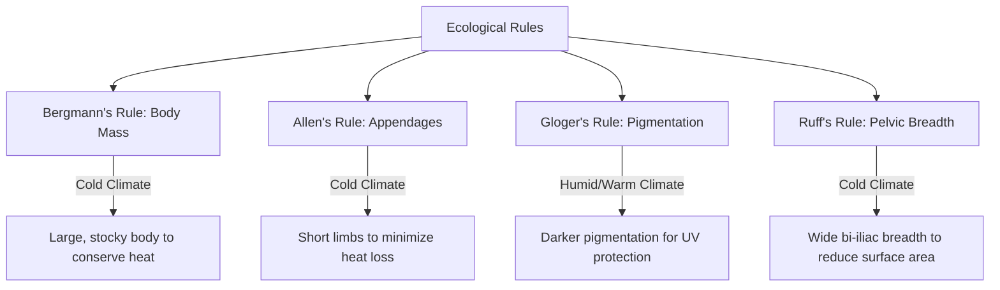
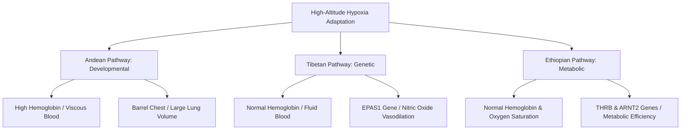
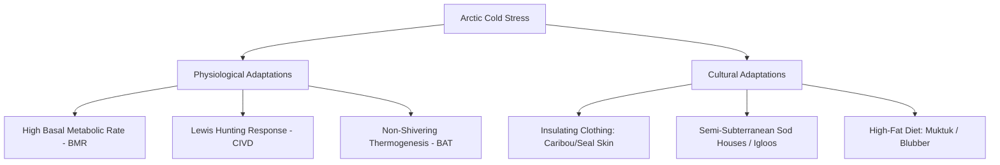
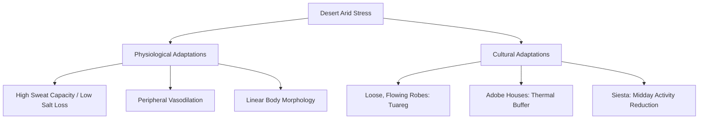

# VALUE ADD: Unit 9.6 - UNIT 1.4 & 1.5: PHYSICAL ANTHROPOLOGY & EVOLUTION
**Date:** June 07, 2026 | **Target:** PAPER I — UNIT 1.4 & 1.5: PHYSICAL ANTHROPOLOGY & EVOLUTION
**Syllabus Mapping:** Unit 9.6

# UNIT 9.6: ECOLOGICAL ANTHROPOLOGY

---

## I. THEORETICAL FOUNDATIONS OF ECOLOGICAL ANTHROPOLOGY

Ecological Anthropology studies the relations between hominin populations and their physical environments. To score high marks, you must ground your physical/physiological answers in these core anthropological frameworks:

### 1. Key Theoretical Paradigms
* **Environmental Determinism (Early 20th Cent.):** Proposed that the physical environment mechanically dictates human culture and physical form (now largely discredited).
* **Environmental Possibilism (Franz Boas, Alfred Kroeber):** Argued that the environment sets limits or possibilities, but culture decides which path is taken.
* **Cultural Ecology (Julian Steward, 1955):** Introduced the concept of the **"Cultural Core"**—the constellation of features most closely related to subsistence activities and economic arrangements. The environment and technology interact to shape social organization.
* **The Ecosystems Approach (Roy Rappaport, Andrew P. Vayda, 1960s):** Treated human populations as self-regulating components of larger ecosystems. 
  * *Classic Study:* Roy Rappaport’s *Pigs for the Ancestors (1968)* demonstrated how the ritual cycle of the Tsembaga Maring of New Guinea acts as a homeostatic mechanism regulating the population of both humans and pigs, preventing environmental degradation.
* **Processual Ecological Anthropology (Emilio Moran):** Focuses on active, individual-level physiological and behavioral responses to environmental change over short temporal scales.

---

## II. THE FOUR ECOLOGICAL RULES OF HUMAN MORPHOLOGY

These rules describe how natural selection shapes the body size, shape, and pigmentation of warm-blooded species (including humans) in response to climatic gradients.

### 1. Bergmann’s Rule (Body Mass & Surface Area)
* **The Rule:** Within a widely distributed taxonomic group, populations living in colder environments exhibit larger body sizes and masses than those in warmer zones.
* **Biophysical Principle:** 
  $$\text{Heat Loss} \propto \text{Surface Area}$$
  $$\text{Heat Production} \propto \text{Body Volume (Mass)}$$
  As an object increases in size, its volume ($r^3$) increases much faster than its surface area ($r^2$). Therefore, a large, stocky body has a **lower surface-area-to-volume ratio**, which minimizes heat dissipation in cold climates.
* **Human Example:** The stocky, short-statured Inuit of the Arctic vs. the tall, slender Dinka (Nilotes) of the hot Sudanese savanna.

### 2. Allen’s Rule (Appendage Length)
* **The Rule:** Endothermic populations from colder climates possess shorter limbs, ears, and other appendages than those from warmer regions.
* **Biophysical Principle:** Long, thin appendages increase the exposed surface area of the body, facilitating rapid heat dissipation. Shorter, thicker appendages minimize surface area, conserving core metabolic heat.
* **Human Example:** The short limbs and fingers of Arctic populations vs. the elongated distal limb segments (tibia and radius) of East African pastoralists.

### 3. Gloger’s Rule (Pigmentation)
* **The Rule:** Populations of endothermic species living in warm, humid environments (near the equator) exhibit darker pigmentation (higher melanin concentration) than those living in cold, dry environments.
* **Biophysical Principle:** High melanin protects against intense ultraviolet (UV) radiation, preventing photolysis of folate (essential for embryonic development and spermatogenesis) and skin cancer. In high-latitude, low-UV regions, lighter skin evolved to facilitate the synthesis of Vitamin D, which is crucial for calcium absorption and bone health.

### 4. Ruff’s Rule (Pelvic Breadth / Stature Ratio)
* **The Rule:** Formulated by Christopher Ruff (1994), it states that bi-iliac (pelvic) breadth is determined primarily by latitude and temperature, whereas stature can vary independently.
* **Biophysical Principle:** To maintain a constant surface-area-to-body-mass ratio in cold climates, the human body must widen its core. A wide pelvis creates a wider, more cylindrical torso, reducing the overall surface-area-to-mass ratio.
* **Human Example:** High-latitude populations (e.g., Siberians, Patagonians) consistently exhibit wider pelves relative to their height than equatorial populations.

---

## III. HIGH-ALTITUDE HYPOXIA ADAPTATION: THE TRI-CONTINENTAL CONTRAST

Hypoxia (low partial pressure of oxygen, $pO_2$) is an severe environmental stressor because it cannot be mitigated by cultural technologies like clothing or shelter. Humans have evolved three distinct biological pathways to survive at high altitudes ($>2,500\text{ meters}$).

### 1. The Andean Pathway (Quechua & Aymara)
* **Primary Mechanism:** **Developmental Plasticity (Ontogenetic Acclimatization)**. These traits are acquired during growth and development at high altitudes and are not fully encoded in the genome of sea-level populations.
* **Physiological Profile:**
  * **Erythrocytic Response:** Severe **polycythemia** (hyper-elevated red blood cell count). Hemoglobin levels often exceed $20\text{ g/dL}$ (compared to $14\text{–}16\text{ g/dL}$ at sea level).
  * **Morphology:** "Barrel-shaped" chest with increased lung volume and alveolar surface area, developed during childhood.
  * **Cardiovascular:** Right ventricular hypertrophy (enlargement of the right side of the heart) to pump thick, viscous blood through the lungs.
* **Key Genes:** *EGLN1* and *SENP1* (associated with erythropoiesis regulation).
* **Pathological Cost:** High susceptibility to **Chronic Mountain Sickness (Monge's Disease)**, characterized by extreme blood viscosity, headaches, and cardiovascular failure.

### 2. The Tibetan Pathway (Sherpas & Tibetans)
* **Primary Mechanism:** **Genetic Adaptation via Adaptive Introgression**.
* **The Denisovan Legacy:** Molecular anthropologists (Rasmus Nielsen et al., 2014) discovered that Tibetans carry a unique haplotype of the **EPAS1 (Endothelial PAS Domain Protein 1)** gene. This gene was introduced into the *Homo sapiens* gene pool via interbreeding with archaic **Denisovans** approximately 50,000 years ago and was rapidly selected for on the Tibetan Plateau.
* **Physiological Profile:**
  * **Erythrocytic Response:** **Normal hemoglobin levels** (similar to sea-level populations), preventing the pathological blood viscosity seen in Andeans.
  * **Vasodilation:** Double the concentration of **Nitric Oxide (NO)** in the blood compared to sea-level populations. Nitric oxide is a potent vasodilator that widens blood vessels, dramatically increasing blood flow and oxygen delivery to tissues despite low oxygen saturation.
  * **Respiration:** High resting ventilation rate (rapid breathing).
* **Evolutionary Significance:** This is the fastest documented case of natural selection in human history, with the *EPAS1* allele frequency rising from $<1\%$ to $>80\%$ in less than 4,000 years.

### 3. The Ethiopian Pathway (Amhara & Oromo)
* **Primary Mechanism:** **Metabolic/Genomic Adaptation** (least understood but highly distinct).
* **Physiological Profile:**
  * **Oxygen Saturation:** Unlike Tibetans and Andeans, Ethiopian highlanders (living in the Simien Mountains at $3,000\text{m}$) maintain **normal sea-level oxygen saturation levels** and normal hemoglobin levels. Their bodies do not experience systemic hypoxia at high altitudes.
  * **Mitochondrial Efficiency:** Adaptation occurs at the cellular level, where mitochondria utilize oxygen more efficiently to synthesize ATP.
* **Key Genes:** *THRB* (Thyroid Hormone Receptor Beta) and *ARNT2* (Aryl Hydrocarbon Receptor Nuclear Translocator 2), which regulate metabolic and endocrine pathways rather than erythropoietin production.

### Tri-Continental High-Altitude Comparison Matrix

| Adaptive Dimension | Andean Highlanders (Quechua) | Himalayan Tibetans (Sherpas) | Ethiopian Highlanders (Amhara) |
| :--- | :--- | :--- | :--- |
| **Primary Adaptive Mode** | Developmental Plasticity | Genetic Selection (Introgression) | Genetic Selection (Metabolic) |
| **Hemoglobin Levels** | **Extremely High** ($>20\text{ g/dL}$) | **Normal** ($14\text{–}16\text{ g/dL}$) | **Normal** ($14\text{–}16\text{ g/dL}$) |
| **Oxygen Saturation** | Low | Low | **High/Normal** (Sea-level equivalent) |
| **Key Genetic Loci** | *EGLN1*, *SENP1* | *EPAS1* (Denisovan origin) | *THRB*, *ARNT2* |
| **Vascular Mechanism** | Pulmonary Hypertension | **Nitric Oxide** Vasodilation | Enhanced Mitochondrial Efficiency |
| **Clinical Vulnerability** | High risk of Monge's Disease | Protected from Monge's Disease | Protected from Monge's Disease |

---

## IV. COLD CLIMATE ADAPTATION (ARCTIC STRESS)

Populations living in Arctic and sub-Arctic regions (e.g., Inuit, Nenets, Chukchi) face extreme cold stress, wind chill, and seasonal food scarcity.

### 1. Physiological Adaptations
* **Elevated Basal Metabolic Rate (BMR):** Arctic populations exhibit a BMR $15\text{–}40\%$ higher than sea-level temperate populations. This is regulated by thyroid hormones (T3 and T4) and generates high levels of internal metabolic heat.
* **The Lewis Hunting Response (Cold-Induced Vasodilation - CIVD):**
  * When exposed to extreme cold, peripheral blood vessels initially undergo **vasoconstriction** to protect core organs.
  * To prevent frostbite in the extremities, the body periodically triggers brief, alternating cycles of **vasodilation** (sending warm blood to the fingers and toes) and vasoconstriction.
  * In Arctic populations, these CIVD cycles occur more rapidly and at higher temperatures than in non-adapted populations.
* **Non-Shivering Thermogenesis (Brown Adipose Tissue - BAT):** Utilization of highly vascularized Brown Fat, which contains a high density of mitochondria. Instead of producing ATP, BAT uses uncoupling protein 1 (UCP1) to convert chemical energy directly into heat.

### 2. Cultural Adaptations
* **Clothing Technology:** Double-layered tailored clothing made of caribou or seal skin. The fur faces inward on the inner layer (to trap a layer of warm, dead air against the skin) and outward on the outer layer (to shed snow and wind).
* **Shelter Design:** Domed igloos or semi-subterranean sod houses. The domed shape minimizes the surface-area-to-volume ratio of the dwelling, while raised sleeping platforms utilize rising warm air.
* **Dietary Strategy:** Consumption of **Muktuk** (whale skin and blubber) and seal meat. This diet is extremely rich in protein and omega-3 fatty acids, providing the high caloric intake ($4,000\text{–}5,000\text{ kcal/day}$) required to fuel an elevated BMR.

---

## V. HOT DESERT CLIMATE ADAPTATION (ARID STRESS)

Desert environments present a dual challenge: extreme daytime heat and solar radiation, coupled with rapid nighttime cooling and severe water scarcity.

### 1. Physiological Adaptations
* **Linear Body Morphology:** Long, slender limbs and narrow trunks (conforming to Bergmann's and Allen's rules, e.g., the Dinka of Sudan). This maximizes the surface area available for sweat evaporation relative to body mass.
* **Sweating Efficiency:**
  * Adapted individuals can sweat at rates exceeding $1.5\text{ liters/hour}$.
  * **Electrolyte Conservation:** Natural selection has optimized aldosterone secretion in desert populations, allowing them to excrete highly dilute sweat, conserving vital sodium and chloride ions.
* **Peripheral Vasodilation:** Dilation of superficial blood vessels, allowing core body heat to be carried by blood to the skin, where it can be radiated into the environment.

### 2. Cultural Adaptations
* **Clothing Technology (The Tuareg "Blue Men" of the Sahara):**
  * They wear loose, dark, flowing robes (indigo-dyed). 
  * *The Physics:* Dark colors absorb solar heat, but if the robe is loose, it creates a **chimney effect**. The heated air inside the robe rises and escapes through the neck, drawing cooler air up from the bottom, which accelerates sweat evaporation and cools the skin.
* **Shelter Design (Adobe/Mud Brick Houses):** Thick mud walls act as a **thermal buffer**. They absorb intense solar radiation during the day, preventing it from reaching the interior. The absorbed heat slowly radiates inward during the cold desert night, maintaining a stable indoor temperature.
* **Behavioral Patterns:** Restricting physical labor to early morning and late evening, with a complete cessation of activity during peak solar hours (the midday *siesta*).

---

## VI. KEY THINKERS & CASE STUDY REFERENCE MATRIX

Use these academic references to elevate your answers from basic biology to high-scoring anthropological arguments:

| Anthropologist / Geneticist | Key Concept / Discovery | Classic Case Study |
| :--- | :--- | :--- |
| **Julian Steward (1955)** | Cultural Ecology & "Cultural Core" | Shoshone Native Americans: how sparse desert resources dictated highly fragmented, family-level social structures. |
| **Roy Rappaport (1968)** | Ecosystems Model & Ritual Homeostasis | Tsembaga Maring: *Kaiko* ritual cycle regulates pig populations and prevents ecological degradation. |
| **Cynthia Beall (2000s)** | Tri-Continental High-Altitude Variation | Comparative physiological studies of Tibetan, Andean, and Ethiopian populations, proving divergent evolutionary pathways. |
| **Rasmus Nielsen (2014)** | Adaptive Introgression | Genetic sequencing of the *EPAS1* gene, proving Tibetans inherited high-altitude tolerance from Denisovans. |
| **Christopher Ruff (1994)** | Ruff's Rule of Pelvic Breadth | Global skeletal analysis proving bi-iliac breadth is strictly constrained by latitude-driven thermoregulation. |
| **Emilio Moran (2007)** | Processual Human Adaptability | Detailed studies of how Amazonian populations adapt to acid-soil environments through complex agro-forestry. |

---

## VII. UPSC ANSWER WRITING BLUEPRINT

### PYQ: "Discuss human physiological and cultural adaptation to high-altitude stress." [20 Marks]

#### 1. Introduction (Approx. 50 words)
* Define high-altitude stress (altitudes $>2,500\text{m}$ characterized by hypobaric hypoxia, cold, and high UV radiation). 
* State that because hypoxia cannot be mitigated by technology alone, it has driven some of the most distinct biological and cultural adaptations in human history.
* Introduce the theoretical framework: **Emilio Moran’s Human Adaptability paradigm**, which views adaptation as a multi-layered response (genetic, developmental, and cultural).

#### 2. Body Paragraph 1: The Nature of the Stressor (Approx. 50 words)
* Explain the biophysics of hypoxia: The percentage of oxygen in the air remains constant ($21\%$), but the barometric pressure decreases with altitude, reducing the partial pressure of oxygen ($pO_2$). This reduces the pressure gradient between the lungs and blood, leading to systemic oxygen deprivation.

#### 3. Body Paragraph 2: Biological Adaptations — The Tri-Continental Contrast (Approx. 250 words)
* *Subheading:* **The Tibetan Genetic Pathway (Sherpas):**
  * Discuss the **EPAS1 gene** and its origin via **adaptive introgression from Denisovans**.
  * Explain the physiological mechanism: Normal hemoglobin levels (preventing viscous blood) combined with high **Nitric Oxide** levels for vasodilation.
* *Subheading:* **The Andean Developmental Pathway (Quechua):**
  * Discuss **ontogenetic plasticity**.
  * Explain the physiological mechanism: Hyper-erythropoiesis (high hemoglobin), barrel-shaped chests, and right ventricular hypertrophy. Mention the risk of **Monge's Disease**.
* *Subheading:* **The Ethiopian Metabolic Pathway (Amhara):**
  * Explain how they maintain normal sea-level oxygen saturation and hemoglobin levels. Mention the *THRB* and *ARNT2* genes.
* *Include the Tri-Continental High-Altitude Comparison Matrix here to present high-density data clearly.*

#### 4. Body Paragraph 3: Cultural Adaptations to High Altitude (Approx. 100 words)
* **Subsistence & Pastoralism:** Domestication of cold- and hypoxia-resistant animals (Yaks in Tibet, Llamas/Alpacas in the Andes) to transport goods and provide high-fat nutrition.
* **Dietary Strategies:** High-carbohydrate diets. Carbohydrates require less oxygen to metabolize and produce more carbon dioxide per molecule of oxygen consumed than fats, which helps stimulate respiration.
* **Activity Patterns:** Slow, rhythmic pacing of physical labor to prevent lactic acid accumulation.

#### 5. Conclusion (Approx. 50 words)
* Conclude by stating that high-altitude adaptation is a classic example of **biocultural evolution**. 
* While cultural adaptations facilitate survival, the intense pressure of hypoxia has forced human populations to evolve distinct, localized genetic and physiological pathways, demonstrating the ongoing nature of natural selection in *Homo sapiens*.