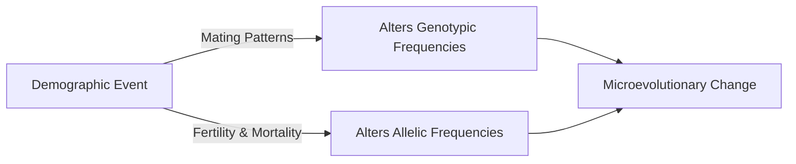
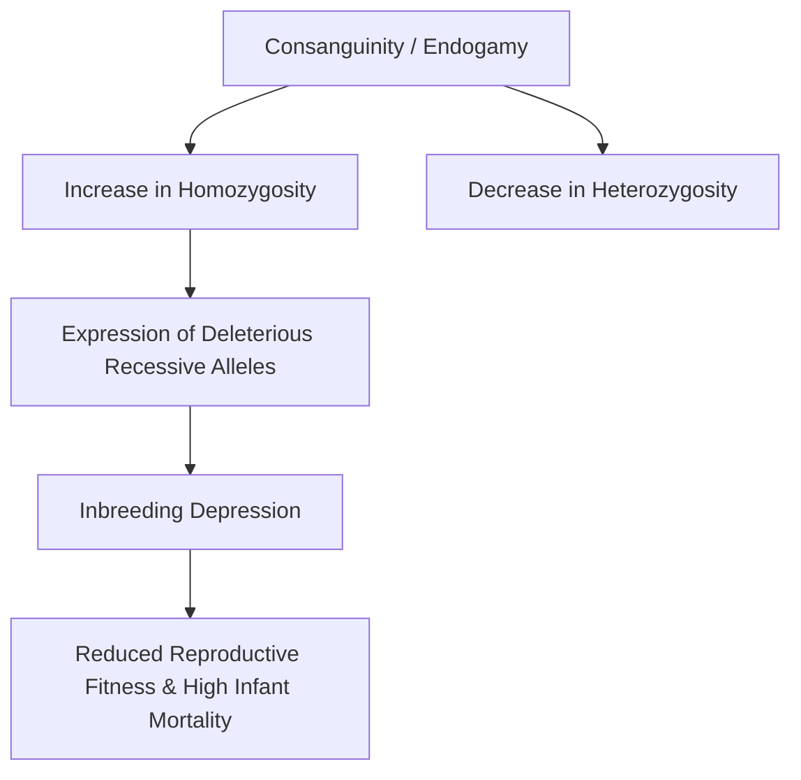
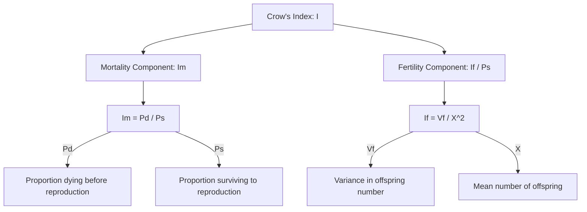

# VALUE ADD: Unit 9.7 - UNIT 1.4 & 1.5: PHYSICAL ANTHROPOLOGY & EVOLUTION
**Date:** June 07, 2026 | **Target:** PAPER I — UNIT 1.4 & 1.5: PHYSICAL ANTHROPOLOGY & EVOLUTION
**Syllabus Mapping:** Unit 9.7

# UNIT 9.7: BIOLOGICAL & GENETIC DETERMINANTS OF DEMOGRAPHIC FACTORS

---

> [!NOTE]
> **Syllabus Mapping:**
> * **Paper I, Unit 9.7:** Biological/genetic determinants of demographic factors: Mating patterns, fertility, mortality, morbidity, life expectancy, fecundity.
> * **Core Theme:** Anthropological Demography. This unit bridges the gap between social demography and population genetics, demonstrating how demographic events (births, marriages, illnesses, and deaths) act as biological filters that alter the genetic structure (allele frequencies) of human populations, driving microevolution.

---

## I. THE INTERFACE OF DEMOGRAPHY AND GENETICS

In physical anthropology, demographic factors are not merely statistical measures of a population; they are the primary mechanisms through which **Natural Selection**, **Genetic Drift**, and **Gene Flow** operate. 



---

## II. MATING PATTERNS (GENETIC DETERMINANTS & CONSEQUENCES)

Mating patterns dictate how gametes are paired in a population. Anthropologists classify mating into **Random Mating (Panmixia)** and **Non-Random Mating**.

### 1. Non-Random Mating Types
* **Consanguineous Mating (Inbreeding):** Mating between individuals who are biologically related (sharing at least one common ancestor).
* **Assortative Mating:**
  * *Positive Assortative Mating:* "Like marries like" based on phenotypic traits (e.g., stature, skin color, intelligence) or socio-cultural factors (caste endogamy).
  * *Negative Assortative Mating (Disassortative):* Mating between phenotypically dissimilar individuals (e.g., major histocompatibility complex [MHC/HLA] locus diversity in mate selection to maximize offspring immunity).

### 2. Genetic Consequences of Inbreeding & Endogamy



* **The Inbreeding Coefficient ($F$):** Formulated by **Sewall Wright**, $F$ measures the probability that two alleles at a locus in an individual are identical by descent (IBD) from a common ancestor.
  * For self-fertilization: $F = 0.5$
  * For Uncle-Niece marriage: $F = 0.125\ (1/8)$
  * For First-Cousin marriage: $F = 0.0625\ (1/16)$
* **Inbreeding Depression:** The decline in biological fitness (survival and fertility) resulting from the expression of deleterious, homozygous recessive mutations.

> [!TIP]
> **UPSC Value-Addition: Indian Case Studies on Consanguinity**
> * **L.D. Sanghvi's Southern Indian Studies:** Sanghvi documented some of the highest global rates of consanguinity in Andhra Pradesh, Tamil Nadu, and Karnataka (often exceeding $30\%$ of marriages, dominated by uncle-niece and maternal cross-cousin unions). He observed that while it elevates the **genetic load** (accumulation of deleterious genes), long-term historical inbreeding has partially "purged" highly lethal recessive genes from the gene pool through continuous natural selection.
> * **The Vysya Community:** Strict endogamy practiced over 100 generations has led to a high prevalence of **butyrylcholinesterase deficiency**, making members highly susceptible to prolonged, life-threatening paralysis when administered standard muscle relaxants (succinylcholine) during anesthesia.

---

## III. FECUNDITY AND FERTILITY

While often used interchangeably in colloquial language, physical anthropologists maintain a strict biological distinction between these two parameters:

$$\text{Fecundity (Biological Potential)} \xrightarrow{\text{Socio-Cultural & Environmental Filters}} \text{Fertility (Actual Output)}$$

### 1. Biological & Genetic Determinants of Fecundity
* **Chromosomal Aberrations:** Numerical anomalies like **Turner Syndrome ($45, X$)** and **Klinefelter Syndrome ($47, XXY$)** lead to gonadal dysgenesis and absolute sterility. Balanced structural translocations can cause recurrent spontaneous abortions (miscarriages).
* **Single-Gene Mutations:** Mutations in the **FSHR (Follicle-Stimulating Hormone Receptor)** gene or **BMP15** gene impair ovarian development, causing premature ovarian failure (POF).
* **Immunological Factors (Maternal-Fetal Incompatibility):**
  * *Rh Incompatibility:* An $Rh^-$ mother carrying an $Rh^+$ fetus develops antibodies that destroy fetal red blood cells (**Erythroblastosis Fetalis**), reducing viable reproductive output.
  * *ABO Incompatibility:* Maternal-fetal incompatibility at the ABO locus acts as a selective filter, causing early embryonic loss.

### 2. Biological & Genetic Determinants of Fertility
* **Age at Menarche and Menopause:** Strongly governed by genetic factors. Genome-wide association studies (GWAS) have identified loci near the **LIN28B** gene that regulate the onset of puberty.
* **Lactational Amenorrhea:** Breastfeeding triggers prolactin release, which suppresses ovulation. The duration of this biological contraceptive window varies genetically and culturally across populations.

---

## IV. MORBIDITY AND MORTALITY

Morbidity (disease state) and Mortality (death rate) act as the ultimate arbiters of **Natural Selection** by removing less-adapted genotypes from the breeding pool before they can reproduce.

### 1. Genetic Determinants of Morbidity
* **Monogenic Disorders:** High-morbidity diseases like **Cystic Fibrosis**, **Thalassemia**, and **Hemophilia** impose severe physiological costs.
* **Complex Polygenic Susceptibility:** Genetic variations in human leukocyte antigen (HLA) classes determine susceptibility to infectious diseases (e.g., tuberculosis, malaria, leprosy).

### 2. Genetic Determinants of Mortality
* **Lethal Genes:** Genes that cause the death of the organism carrying them. They can be dominant (e.g., **Huntington's Chorea**, which evades natural selection by manifesting post-reproduction) or recessive (e.g., **Tay-Sachs disease**, causing early childhood mortality).
* **Balanced Polymorphism (The Malaria Hypothesis):**
  * In malaria-endemic zones (e.g., Mediterranean, Sub-Saharan Africa, tribal belts of Central India), the homozygous recessive state ($HbS\ HbS$) causes fatal sickle-cell anemia (high mortality).
  * The homozygous dominant state ($HbA\ HbA$) leaves individuals vulnerable to fatal falciparum malaria (high mortality).
  * The heterozygote ($HbA\ HbS$) is protected against malaria and does not suffer from severe anemia, resulting in **heterozygote advantage** and maintaining the deleterious $HbS$ allele in the population.

```mermaid
grid-layout
    [HbA HbA: Vulnerable to Malaria]
    [HbA HbS: Heterozygote Advantage - Survives]
    [HbS HbS: Severe Sickle-Cell Anemia - Dies]
```

---

## V. LIFE EXPECTANCY AND SENESCENCE

* **Life Expectancy:** The average number of years an individual is expected to live, heavily influenced by environmental, nutritional, and public health factors.
* **Senescence (Biological Aging):** The progressive, generalized decline in physiological function and cellular repair mechanisms over time.

### 1. Genetic Theories of Senescence

| Theory | Proponent | Core Genetic Mechanism |
| :--- | :--- | :--- |
| **1. Telomere Shortening Theory** | **Alexey Olovnikov** | Chromosomes lose repetitive DNA sequences (telomeres) at each cell division. When telomeres reach a critical minimum length (the **Hayflick Limit**), the cell enters permanent senescence. |
| **2. Mutation Accumulation Theory** | **Peter Medawar** | Natural selection weakens with age. Deleterious mutations that manifest only late in life (post-reproduction) escape selective pressure and accumulate in the gene pool over generations. |
| **3. Antagonistic Pleiotropy Theory** | **George Williams** | Natural selection favors genes that confer high reproductive fitness in youth, even if those same genes cause severe physiological decline and disease in old age (e.g., high calcium deposition for bone strength in youth leading to arterial calcification in old age). |
| **4. Disposable Soma Theory** | **Thomas Kirkwood** | Organisms must allocate limited metabolic energy between reproduction (germline) and maintenance (soma). Evolution prioritizes the germline, leaving the soma to gradually decay. |

### 2. Genetic Determinants of Longevity
* **APOE Gene Polymorphism:** The **APOE ε4** allele is strongly associated with late-onset Alzheimer's disease and cardiovascular disease, reducing life expectancy. Conversely, the **APOE ε2** allele is overrepresented in centenarians, acting as a longevity-promoting factor.
* **Sirtuin Genes (SIRT1):** Regulate epigenetic gene silencing, DNA repair, and mitochondrial efficiency, directly influencing the rate of biological aging.

---

## VI. THE OPPORTUNITY FOR NATURAL SELECTION: CROW'S INDEX

To quantify the cumulative impact of fertility and mortality on microevolution, geneticist **James F. Crow (1958)** formulated the **Index of Opportunity for Selection ($I$)**. This index measures the maximum potential rate of evolutionary change in a population based on its demographic profile.

### 1. The Mathematical Formula

$$I = I_m + \frac{I_f}{P_s}$$

Where:
* $I$ = Total Index of Opportunity for Selection
* $I_m$ = Index of Selection due to Mortality (Death before reproductive age)
* $I_f$ = Index of Selection due to Fertility (Differential reproduction among survivors)
* $P_s$ = Proportion of individuals surviving to reproductive age



### 2. Anthropological Significance of Crow's Index
* **In Pre-Industrial/Tribal Populations:** $I_m$ is highly dominant due to high infant mortality rates. Natural selection operates primarily through **survival (selective mortality)**.
* **In Modern/Industrialized Populations:** With advanced healthcare, $I_m$ drops close to zero ($P_s \approx 1$). However, $I_f$ remains high due to voluntary family planning and varying reproductive choices. Natural selection in modern humans operates almost exclusively through **differential fertility**.

---

## VII. KEY THINKERS REFERENCE SHEET

| Thinker | Key Contribution | Anthropological Application |
| :--- | :--- | :--- |
| **Sewall Wright** | Inbreeding Coefficient ($F$) | Quantified the genetic impact of consanguineous marriages and genetic drift in small populations. |
| **James F. Crow** | Index of Opportunity for Selection ($I$) | Provided a mathematical tool to calculate how demographic shifts alter the intensity of natural selection. |
| **L.D. Sanghvi** | Consanguinity Studies in India | Proved that long-term inbreeding in South Indian castes purged lethal recessive alleles, reducing genetic load. |
| **George Williams** | Antagonistic Pleiotropy Theory | Explained the evolutionary paradox of why genes causing senescence and aging are not eliminated by natural selection. |
| **Peter Medawar** | Mutation Accumulation Theory | Established that the force of natural selection declines exponentially after the age of reproductive maturity. |

---

## VIII. UPSC MAINS ANSWER BLUEPRINT

### PYQ: "Discuss the biological and genetic determinants of fertility and mortality in human populations." [2022, 20 Marks]

#### 1. Introduction (Approx. 50 words)
* Define **Anthropological Demography**. State that fertility (births) and mortality (deaths) are not merely demographic statistics but are the primary biological filters of the gene pool. They determine the rate and direction of microevolution by altering allele frequencies over generations.

#### 2. Section A: Biological & Genetic Determinants of Fertility (Approx. 175 words)
* **Distinction:** Briefly define Fecundity (potential) vs. Fertility (realized).
* **Genetic Factors:** 
  * *Chromosomal:* Turner ($45, X$) and Klinefelter ($47, XXY$) syndromes cause absolute sterility.
  * *Single-Gene:* Mutations in the *FSHR* gene cause premature ovarian failure.
* **Immunological Factors:** Rh factor incompatibility ($Rh^-$ mother, $Rh^+$ fetus) causing Erythroblastosis Fetalis; ABO incompatibility leading to early embryonic loss.
* **Physiological Markers:** Genetic regulation of age at menarche/menopause (e.g., *LIN28B* gene locus).

#### 3. Section B: Biological & Genetic Determinants of Mortality (Approx. 175 words)
* **Lethal & Sub-Lethal Genes:** Dominant lethal genes (Huntington's Chorea, escaping selection due to late-onset) and recessive lethal genes (Tay-Sachs, causing early childhood death).
* **Infectious Disease & Balanced Polymorphism:** Detail the **Malaria Hypothesis**. Explain how the sickle-cell allele ($HbS$), G6PD deficiency, and Thalassemia alleles are maintained in malaria-endemic zones due to heterozygote advantage, balancing selective mortality.
* **Genetic Susceptibility:** HLA class variations determining survival rates against pandemics (e.g., tuberculosis, plague).

#### 4. Section C: The Synthesis — Crow's Index (Approx. 100 words)
* Introduce **James F. Crow's Index of Opportunity for Selection ($I = I_m + I_f/P_s$)**.
* Draw the component flowchart (refer to Section VI).
* Explain how the transition from tribal to modern societies shifts the primary driver of human evolution from **selective mortality ($I_m$)** to **differential fertility ($I_f$)**.

#### 5. Conclusion (Approx. 50 words)
* Conclude by stating that human fertility and mortality are governed by a continuous feedback loop between biology and culture. While modern medicine has reduced genetic mortality, it has shifted evolutionary pressures onto differential fertility, proving that human populations remain subject to active microevolutionary forces.