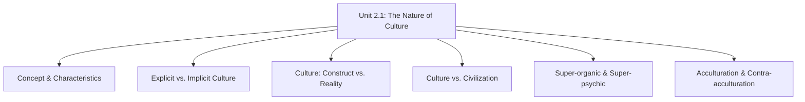
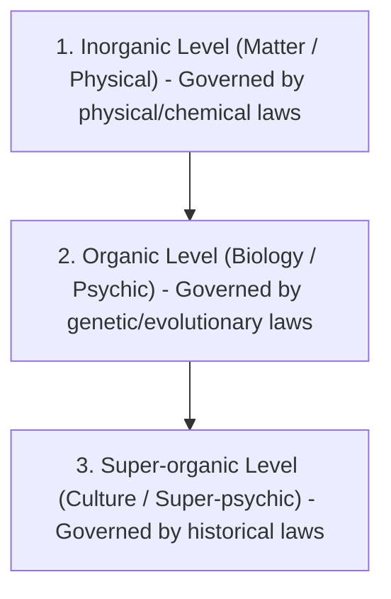
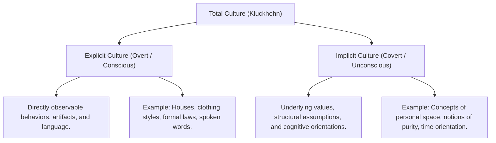
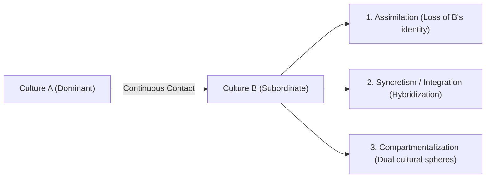
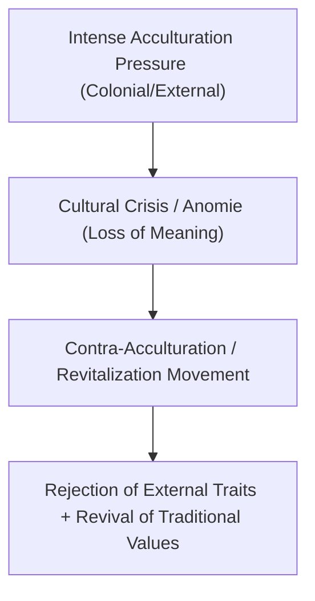

# VALUE ADD: Unit 2.1 - UNITS 2, 3, 4 & 5: SOCIO-CULTURAL ANTHROPOLOGY
**Date:** May 31, 2026 | **Target:** PAPER I — UNITS 2, 3, 4 & 5: SOCIO-CULTURAL ANTHROPOLOGY
**Syllabus Mapping:** Unit 2.1

# UPSC MAINS HIGH-YIELD REVISION SHEET

## PAPER I — UNIT 2.1: THE NATURE OF CULTURE

---

## I. UNIT 2.1 SYLLABUS BLUEPRINT & CORE CONCEPTS



---

## II. THE CONCEPT & CHARACTERISTICS OF CULTURE

### 1. Deconstructing E.B. Tylor's Classic Definition (1871)
In his seminal work *Primitive Culture*, **Edward Burnett Tylor** defined culture as:
> *"that complex whole which includes knowledge, belief, art, morals, law, custom, and any other capabilities and habits acquired by man as a member of society."*

#### Critical Analytical Breakdown for Mains Answers:
* **"Complex Whole":** Culture is not a random collection of traits; it is an integrated, systemic configuration where a change in one part (e.g., technology) triggers changes in other parts (e.g., social norms).
* **"Acquired":** Rejects biological determinism. Culture is transmitted socially, not genetically.
* **"As a member of society":** Establishes that culture is a collective, shared phenomenon. An isolated individual cannot possess or create culture in a vacuum.

### 2. Key Characteristics of Culture (Advanced Anthropological Dimensions)

```mermaid
grid-layout
    col-span-1
    row-span-1
    "**1. Super-organic (A.L. Kroeber)**
    Transcends human biology. While dependent on human brains for its origin, it operates on its own autonomous level of historical accumulation."
    "**2. Shared & Patterned**
    Not individual behavior. It is a shared cognitive map. Behaviors are patterned into predictable, socially acceptable configurations."
    col-span-1
    row-span-1
    "**3. Adaptive & Maladaptive**
    Primary non-somatic mechanism of human survival. However, it can be maladaptive (e.g., industrial pollution, nuclear proliferation)."
    "**4. Learned (Enculturation)**
    Acquired through conscious and unconscious learning. Differs from *socialization* (which is general social training; enculturation is specific cultural transmission)."
```

### 3. Deep Dive: The "Super-organic" and "Super-psychic" (A.L. Kroeber)
In his landmark 1917 essay *The Superorganic*, **Alfred Louis Kroeber** conceptualized culture as existing on a distinct level of reality:



* **The Argument:** Just as the organic level (life) emerged from the inorganic (matter) but cannot be fully explained by physics and chemistry alone, the **super-organic level (culture)** emerged from the organic (human biology) but cannot be explained by biology or psychology alone.
* **Super-psychic:** Culture exists beyond the individual mind. An individual is born into, shaped by, and dies within a pre-existing cultural matrix that continues to exist after their death.

---

## III. EXPLICIT VS. IMPLICIT CULTURE (CLYDE KLUCKHOHN)

In *Mirror for Man* (1949), **Clyde Kluckhohn** distinguished between the observable and unobservable dimensions of culture:



### High-Yield Case Study: Proxemics (Edward T. Hall)
* **Concept:** The implicit cultural use of space.
* **Observation:** Members of Middle Eastern cultures stand much closer to interlocutors than members of Northern European cultures. 
* **Anthropological Value:** This behavior is rarely taught explicitly; it is an **implicit cultural rule** absorbed unconsciously during enculturation.

---

## IV. CULTURE: CONSTRUCT VS. REALITY DEBATE

This epistemological debate centers on whether "culture" is an actual, concrete entity or merely an analytical tool created by anthropologists.

```
┌────────────────────────────────────────────────────────────────────────┐
│                      THE EPISTEMOLOGICAL SPECTRUM                      │
├───────────────────────────────────┬────────────────────────────────────┤
│     CULTURE AS A REALITY          │       CULTURE AS A CONSTRUCT       │
│     (Reified / Realist View)      │      (Nominalist / Abstract View)  │
├───────────────────────────────────┼────────────────────────────────────┤
│ • E.B. Tylor, A.L. Kroeber,       │ • Ralph Linton, Raymond Firth,     │
│   Leslie White                    │   A.R. Radcliffe-Brown             │
│ • Culture is an objective,        │ • Culture is an abstraction        │
│   observable, sui generis entity  │   synthesized by the researcher    │
│   that can be studied directly.   │   from observed human behavior.    │
│ • Leslie White's "Culturology":   │ • Behavior is the reality; culture │
│   Culture can only be explained   │   is the conceptual model          │
│   in terms of culture.            │   (construct) to explain it.       │
└───────────────────────────────────┴────────────────────────────────────┘
```

* **Radcliffe-Brown's Critique:** He famously argued that one cannot observe "culture"; one can only observe *social structure*—the concrete, actually existing social relations between individuals. Culture is merely an analytical abstraction of those relations.

---

## V. CULTURE VS. CIVILIZATION

While early evolutionists used these terms synonymously, modern anthropology maintains a clear distinction, pioneered by **R.M. MacIver**, **A.L. Kroeber**, and **Robert Redfield**:

| Dimension | Culture | Civilization |
| :--- | :--- | :--- |
| **Core Definition** | The internal, subjective, and non-material aspect of human life. | The external, objective, and material/technological aspect of human life. |
| **MacIver's Dictum** | **"What we are"** (beliefs, values, art, morals). | **"What we use"** (tools, technology, infrastructure). |
| **Measurement** | Non-cumulative. A modern painting is not "better" than a Paleolithic cave painting. | Cumulative and progressive. A smartphone is objectively superior to a stone tool. |
| **Transferability** | Difficult to transfer without deep enculturation (e.g., religious beliefs). | Easily borrowed and transferred across boundaries (e.g., firearms, computers). |
| **Scale** | Can exist in small-scale, egalitarian, non-literate bands. | Represents a highly specialized, urbanized, literate, and stratified manifestation of culture. |

---

## VI. ACCULTURATION AND CONTRA-ACCULTURATION

### 1. Acculturation
Defined by **Redfield, Linton, and Herskovits (1936)** as:
> *"those phenomena which result when groups of individuals having different cultures come into continuous first-hand contact, with subsequent changes in the original culture patterns of either or both groups."*

#### Key Dynamics of Acculturation:
* **Asymmetrical vs. Symmetrical:** It can be forced (unidirectional assimilation under colonial dominance) or democratic (bidirectional borrowing/syncretism).
* **Sanskritization as Acculturation (M.N. Srinivas):** Lower castes/tribes adopting the customs, rituals, and lifestyle of the twice-born (*Dwija*) castes.



### 2. Contra-Acculturation
A defensive, reactive, and nativistic movement by a dominated group resisting the pressures of acculturation, aiming to revive, preserve, or reconstruct their traditional cultural identity.



### 3. High-Yield Tribal Case Studies (UPSC Mains Value-Addition)

#### Case Study 1: The Birsa Munda Movement (Ulgulan, 1899-1900)
* **Context:** The Munda tribe of Chotanagpur faced severe acculturation pressures from British colonial administrators, Christian missionaries, and Hindu landlords (*Dikus*), which disrupted their traditional land system (*Khuntkatti*).
* **Contra-Acculturation Manifestation:** Birsa Munda led a revitalization movement (*Ulgulan*) that rejected Christian and Hindu influences, called for a return to the worship of a single traditional deity (*Singbonga*), and sought to establish an independent Munda Raj.

#### Case Study 2: The Tana Bhagat Movement (1914)
* **Context:** Occurred among the Oraon tribe of Chotanagpur.
* **Contra-Acculturation Manifestation:** Led by Jatra Bhagat, this movement rejected the exploitative socio-economic practices of non-tribals and British rulers. It sought to purify Oraon culture by banning animal sacrifices, liquor consumption, and traditional exorcism, advocating instead for a return to the pristine, monotheistic worship of *Dharmesh*.

---

## VII. UPSC VALUE-ADDITION & THINKER REFERENCE MATRIX

Use this matrix to anchor your answers with authoritative academic citations:

| Thinker | Key Work | Core Concept | UPSC Answer Application |
| :--- | :--- | :--- | :--- |
| **E.B. Tylor** | *Primitive Culture* (1871) | Holistic definition of culture | Use in the introduction of any answer on the nature of culture. |
| **A.L. Kroeber** | *The Superorganic* (1917) | Super-organic & Super-psychic | Use to explain the autonomy of culture from biology and psychology. |
| **Clyde Kluckhohn** | *Mirror for Man* (1949) | Explicit vs. Implicit Culture | Use to analyze covert cultural values and overt behaviors. |
| **Leslie White** | *The Science of Culture* (1949) | Culturology / Culture as a Reality | Use to argue the "Culture as Reality" side of the epistemological debate. |
| **Ralph Linton** | *The Study of Man* (1936) | Culture as an Abstraction/Construct | Use to argue the "Culture as a Construct" side of the debate. |
| **R.M. MacIver** | *Society: An Introductory Analysis* (1937) | "What we are" vs. "What we use" | Use to clearly differentiate Culture from Civilization. |
| **Redfield, Linton, & Herskovits** | *Memorandum on the Study of Acculturation* (1936) | Systematic definition of Acculturation | Use to define and structure answers on cultural contact and change. |
| **Anthony F.C. Wallace** | *Revitalization Movements* (1956) | Cognitive model of Contra-acculturation | Use to explain the psychological and social stages of tribal resistance movements. |

---

## VIII. ELEGANT SCHEMATICS FOR MAINS ANSWER WRITING

### 1. The Cultural Iceberg Model (Kluckhohn's Explicit vs. Implicit Culture)
*Draw this simple diagram to secure an extra 1–1.5 marks in 10-marker questions:*

```
                       ▲
                      / \  <- Water Line
                     /   \
                    /     \
  EXPLICIT CULTURE /=======\==================================
  (Overt/Observable)       |  • Material Artifacts (Tools, Dress)
                           |  • Spoken Language & Technology
                           |  • Public Rituals & Laws
  -------------------------+----------------------------------
  IMPLICIT CULTURE         |  • Notions of Modesty & Purity
  (Covert/Unconscious)     |  • Concepts of Time & Personal Space
                           |  • Deep-seated Aesthetic Values
                           |  • Kinship Obligations
                           \
                            \
                             ▼
```

### 2. The Acculturation-Assimilation-Integration Continuum
*Use this schematic to illustrate the outcomes of cultural contact:*

```
[Culture A] + [Culture B] (Continuous Contact)
       │
       ├─► 1. ASSIMILATION ──────► [Culture A absorbs B] (Identity B lost)
       │
       ├─► 2. SYNCRETISM ────────► [Culture A + B = Culture C] (New hybrid form)
       │
       └─► 3. CONTRA-ACCULTURATION ► [Culture B rejects A] (Nativistic revival)
```