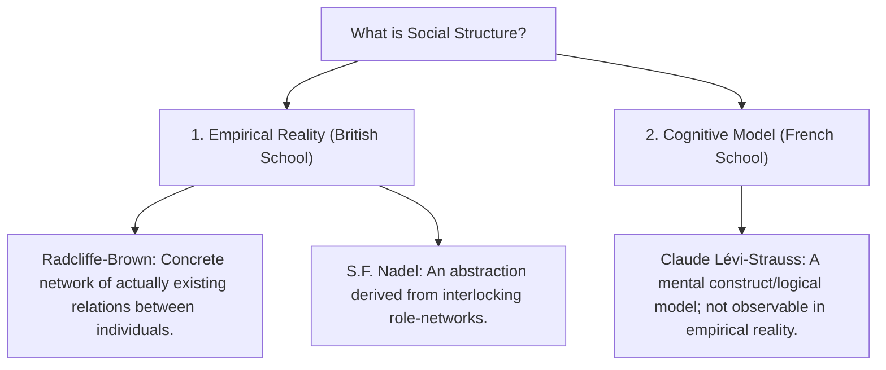

# VALUE ADD: Unit 2.2 - UNITS 2, 3, 4 & 5: SOCIO-CULTURAL ANTHROPOLOGY
**Date:** June 01, 2026 | **Target:** PAPER I — UNITS 2, 3, 4 & 5: SOCIO-CULTURAL ANTHROPOLOGY
**Syllabus Mapping:** Unit 2.2

# UNIT 2.2: THE NATURE OF SOCIETY

---

## I. MASTER REVISION SHEET (UNIT 2.2)

This revision sheet provides a high-yield, rapid-reference summary of the core concepts, definitions, and theoretical debates within **Unit 2.2**.

```
                           ┌───────────────────────────┐
                           │          SOCIETY          │
                           │  (Network of Relations)   │
                           └─────────────┬─────────────┘
                                         │
                  ┌──────────────────────┴──────────────────────┐
                  ▼                                             ▼
       [STRUCTURAL DIMENSION]                        [OPERATIONAL DIMENSION]
        • Social Structure                            • Social Organization
          (The Anatomy / Rules)                         (The Physiology / Action)
          - Radcliffe-Brown: Concrete relations         - Raymond Firth: Choice & decision
          - S.F. Nadel: Role-networks                   - Dynamic adjustments to change
          - Lévi-Strauss: Mental models
                  │                                             │
                  └──────────────────────┬──────────────────────┘
                                         ▼
                             [REGULATORY DIMENSION]
                              • Social Institutions
                                (The Standardized Norms)
                                - Malinowski: Functional units
                                - Durkheim: Social facts
```

### 1. Quick-Glance Conceptual Matrix

| Concept | Core Anthropological Definition | Key Thinker | High-Yield Catchphrase |
| :--- | :--- | :--- | :--- |
| **Society** | A self-perpetuating, organized group of individuals occupying a territory, interacting through a structured network of social relations. | **Émile Durkheim** | *"Sui Generis reality"* (greater than the sum of its parts). |
| **Society vs. Culture** | **Society** is the structural network of actors; **Culture** is the shared system of meanings, symbols, and behaviors that guides them. | **Kroeber & Parsons** | *"Society is the stage and actors; culture is the script they perform."* |
| **Social Structure** | The enduring, ordered arrangement of parts (roles, statuses, groups) in a society. | **A.R. Radcliffe-Brown** | *"The concrete, observable network of actually existing relations."* |
| **Social Organization** | The dynamic, operational aspect of structure; how individuals make choices and execute actions within structural limits. | **Raymond Firth** | *"The systematic ordering of social relations through free individual choice."* |
| **Social Institution** | A standardized, culturally sanctioned system of norms, roles, and behaviors designed to satisfy fundamental societal needs. | **Bronislaw Malinowski** | *"The concrete units of human activity organized around a vital task."* |
| **Social Stratification** | The hierarchical categorization of society into layers based on unequal access to wealth, power, and prestige. | **Max Weber / André Béteille** | *"The institutionalized inequality of social positions."* |

---

## II. CONCEPTUAL CLARIFICATIONS & THINKER MATRIX

### 1. Society vs. Culture: The Analytical Split
While early anthropologists used these terms loosely, **A.L. Kroeber** and **Talcott Parsons** (1958) published a landmark joint synthesis to formally distinguish the two:
* **Society (The Relational System):** Represents the concrete, interactive dimension. It is the network of social relations, statuses, and roles. It answers **who** is interacting with whom.
* **Culture (The Symbolic System):** Represents the ideational, symbolic, and value-laden dimension. It is the blueprint for living, containing the values, beliefs, and technologies. It answers **how** and **why** they interact.

> [!TIP]
> **Melville Herskovits** summarized this distinction elegantly: 
> *"A society is an organized aggregate of individuals who follow a given way of life; in simple terms, a society is composed of people; the way they behave is their culture."*

---

### 2. The Great Debate: What is "Social Structure"?
The definition of "Social Structure" is one of the most contested domains in socio-cultural anthropology. UPSC frequently tests the contrast between the British empirical view and the French structuralist view.



#### A. A.R. Radcliffe-Brown (Empirical Structural-Functionalism)
* **Source Text:** *Structure and Function in Primitive Society (1952)*
* **Core View:** Social structure is a concrete, observable reality. It is the network of actually existing social relations between individuals (e.g., the observable relationship between a specific chief and his subjects).
* **Key Analogy:** He compared society to a biological organism. Just as an organism is made of physical cells arranged in a structure, society is made of individual human beings arranged in a social structure.

#### B. S.F. Nadel (Role-Network Abstraction)
* **Source Text:** *The Theory of Social Structure (1957)*
* **Core View:** Social structure cannot be directly observed; it must be *abstracted*. 
* **Mechanism:** We observe individuals playing **roles** (e.g., teacher, student, father). By analyzing how these roles interlock and repeat, we abstract the "social structure." Thus, structure is the *patterned matrix of role-networks*.

#### C. Claude Lévi-Strauss (Cognitive Structuralism)
* **Source Text:** *Structural Anthropology (1958)*
* **Core View:** Social structure has **nothing to do with empirical reality**. Empirical relations are merely the raw data. 
* **Mechanism:** Structure is a **logical, mental model** built by the anthropologist to understand the underlying, unconscious grammar of the human mind that generates those empirical relations.

---

### 3. Social Structure vs. Social Organization (Raymond Firth)
In *Elements of Social Organization (1951)*, **Raymond Firth** resolved the rigidity of structural-functionalism by introducing "Social Organization" to explain social change:

* **Social Structure (The Anatomy):** The ideal, stable framework of society. It consists of the expectations, rules, and social positions that limit human behavior (e.g., the structural rule of monogamy).
* **Social Organization (The Physiology):** The dynamic, real-world choices, decisions, and actions that individuals make *within* those structural limits. It represents the operational reality where individuals negotiate, adapt, and sometimes alter the structure (e.g., how a couple manages their household budget and division of labor).

```
Structure (The Road Rules) ──► Limits & Guides ──► Organization (The Driver's Choices)
```

---

### 4. Social Institution vs. Association
Anthropologists and sociologists (**MacIver and Page**) draw a sharp line between these two concepts:
* **Social Institution:** The organized, standardized system of procedures, norms, and values. It represents the *rules of the game* (e.g., Marriage, Education, Religion).
* **Association:** The concrete, organized group of individuals formed to pursue specific interests. It represents the *players of the game* (e.g., a family, a school, a church).

> [!NOTE]
> **MacIver and Page's Rule:** *"We belong to associations, but not to institutions. We belong to a family (association), which functions through the institution of marriage."*

---

## III. HIGH-YIELD CASE STUDIES & CONTEMPORARY VALUE-ADDITIONS

### 1. André Béteille’s Sripuram Study: The Decoupling of Stratification
* **Context:** In his classic work *Caste, Class, and Power (1965)*, Béteille conducted an intensive ethnography of Sripuram village in Tanjore, Tamil Nadu.
* **Traditional Structure (Closed):** Historically, Sripuram exhibited a perfect overlap of caste, class, and power. The Brahmins (High Caste) owned the land (High Class) and controlled the village panchayat (High Power). This was a rigid, closed stratification system.
* **Modern Shift (Open/Fluid):** Béteille observed that land reforms, modern education, and adult franchise decoupled these three axes. Non-Brahmins acquired political power through regional parties, and some Brahmins became landless and economically poor. 
* **Anthropological Value-Add:** This study demonstrates the **"classization" of caste**—the transition of a closed, ascribed stratification system into an open, achieved system.

```
Traditional Sripuram (Overlapping / Closed)      Modern Sripuram (Decoupled / Open)
      ┌─────────────────────────┐                     ┌─────────────────────────┐
      │  Caste = Class = Power  │                     │  Caste ─── Class ─── Power │
      └─────────────────────────┘                     └─────────────────────────┘
```

---

### 2. The Tallensi of Ghana (Meyer Fortes): Structural Continuity
* **Context:** In *The Dynamics of Clanship among the Tallensi (1945)*, Meyer Fortes demonstrated how social structure maintains social order in an **acephalous** (stateless) society.
* **Mechanism:** The Tallensi lacked centralized political offices, police, or courts. Instead, their social structure was built on a highly organized **segmentary lineage system**. 
* **Value-Add:** Fortes showed that the structural alignment of patrilineal descent groups automatically regulated conflict. If a dispute arose between two individuals, their respective lineages mobilized at equivalent structural levels to balance power, ensuring the continuity of the entire society without formal state institutions.

---

### 3. Digital Social Structures & Virtual Stratification
* **Context:** Modern digital anthropology (**Daniel Miller**, *Why We Post* project) explores how social structure and stratification manifest in virtual spaces.
* **Mechanism:** Online platforms (e.g., Reddit, Twitter, Discord) are not chaotic; they possess distinct **social structures** (moderators, users, bots) and **social institutions** (community guidelines, karma systems, algorithmic verification).
* **Virtual Stratification:** Stratification occurs through digital capital (followers, blue ticks, karma points), creating new hierarchies of prestige and power that bypass traditional physical markers of caste, class, or gender.

---

## IV. ELEGANT DIAGRAMS & CONCEPTUAL SCHEMATICS

### 1. Malinowski’s Institutional Framework
Every social institution, according to Bronislaw Malinowski (*A Scientific Theory of Culture, 1944*), must possess these six interconnected components to satisfy a basic biological or psychological need:

```mermaid
flowchain
    code
    Charter["1. CHARTER<br>(The official purpose/values)"] --> Personnel["2. PERSONNEL<br>(The organized group/actors)"]
    Personnel --> Norms["3. NORMS<br>(The rules and customs)"]
    Norms --> Apparatus["4. MATERIAL APPARATUS<br>(The physical tools/space)"]
    Apparatus --> Activities["5. ACTIVITIES<br>(The actual behaviors)"]
    Activities --> Function["6. FUNCTION<br>(The satisfied human need)"]
```

---

### 2. Closed vs. Open Stratification Systems
This schematic contrasts the structural mobility pathways in Caste (Closed) and Class (Open) systems:

```
=================================================================================
CLOSED SYSTEM (CASTE)                           OPEN SYSTEM (CLASS)
=================================================================================
  
  [Layer A]  (e.g., Brahmin)                      [Layer A]  (Upper Class)
  ─────────────────────────  ◄─── Endogamy ───►   ▲   │
  [Layer B]  (e.g., Kshatriya)   (No vertical     │   ▼  (Vertical Mobility
  ─────────────────────────       mobility)       │   │   permitted via merit)
  [Layer C]  (e.g., Shudra)                       [Layer B]  (Lower Class)
  
  * Status: Ascribed (Birth)                      * Status: Achieved (Effort)
  * Boundaries: Rigid, Ritual Purity              * Boundaries: Fluid, Economic
=================================================================================
```

---

## V. UPSC MAINS ANSWER WRITING BLUEPRINTS

### 1. Question: "Distinguish between Social Structure and Social Organization." [10 Marks, 150 Words]

#### Model Answer Structure:

* **Introduction:**
  * Define both terms briefly. State that while both concepts explain how societies maintain order, they represent different analytical dimensions of social life, as formulated by British anthropologist **Raymond Firth**.

* **Core Differences (Use a structured table for maximum impact):**

| Dimension | Social Structure | Social Organization |
| :--- | :--- | :--- |
| **Primary Focus** | The stable, enduring framework of social relations, statuses, and roles. | The dynamic, operational process of decision-making and action. |
| **Key Thinker** | **A.R. Radcliffe-Brown** (*Structure and Function in Primitive Society*). | **Raymond Firth** (*Elements of Social Organization*). |
| **Nature** | Static, ideal, and regulatory (the "anatomy" of society). | Dynamic, real-world, and adaptive (the "physiology" of society). |
| **Agency** | Emphasizes structural constraints and rules over individual agency. | Emphasizes individual choice, strategy, and adaptation within rules. |
| **Example** | The structural rule of **clan exogamy** in a tribal society. | The actual negotiations and choices made to arrange a specific marriage. |

* **The Relationship (Synthesis):**
  * Explain that they are not mutually exclusive. Social structure provides the limits and possibilities, while social organization represents the actual choices made within those limits. Over time, repeated patterns of social organization can modify the social structure (social change).

* **Conclusion:**
  * Conclude with a high-yield quote or synthesis: *"If social structure is the blueprint of a building, social organization is the actual pattern of daily life lived by its inhabitants."*

---

### 2. Question: "Critically examine the concept of Social Stratification. How is the Indian caste system transitioning in the modern era?" [20 Marks, 400 Words]

#### Model Answer Structure:

```
                            ┌───────────────────────────┐
                            │    SOCIAL STRATIFICATION  │
                            │  (Hierarchical Inequality)│
                            └─────────────┬─────────────┘
                                          │
                  ┌───────────────────────┴───────────────────────┐
                  ▼                                               ▼
         [THEORETICAL VIEWS]                             [INDIAN TRANSITION]
    • Functionalist (Davis & Moore):               • Traditional (Dumont):
      Inequality is necessary for efficiency.        Ritual purity, closed hierarchy.
    • Conflict (Marx/Weber):                       • Modern (Béteille/Srinivas):
      Exploitation and unequal power.                "Classization", political mobilization.
```

* **Introduction (Approx. 40 words):**
  * Define social stratification as the institutionalized, hierarchical arrangement of individuals or groups in a society based on unequal access to wealth, power, and prestige. Mention that it can be broadly categorized into **closed systems** (e.g., Caste) and **open systems** (e.g., Class).

* **Part 1: Critical Examination of Social Stratification Theories (Approx. 150 words):**
  * **Functionalist Perspective:** **Davis and Moore** (*Some Principles of Stratification*) argue that stratification is universally necessary. It ensures that the most qualified individuals fill the most functionally important positions by offering higher rewards (prestige/wealth).
  * **Conflict Perspective:** **Karl Marx** views stratification as an exploitative system based on ownership of the means of production (Bourgeoisie vs. Proletariat). **Max Weber** expands this into a multi-dimensional model: Class (Economic), Status (Prestige), and Party (Power).
  * **Anthropological Critique:** Anthropologists argue that functionalist views ignore how stratification limits opportunities for marginalized groups, perpetuating structural inequality rather than meritocracy.

* **Part 2: Transition of the Indian Caste System in the Modern Era (Approx. 160 words):**
  * **The Traditional Model:** Characterized by **Louis Dumont** (*Homo Hierarchicus*) as a rigid, closed system governed by the religious ideology of ritual purity and pollution, strict endogamy, and hereditary occupation (*Jajmani* system).
  * **Modern Transitions (Incorporate Key Anthropological Concepts):**
    * **Decoupling of Caste, Class, and Power:** Cite **André Béteille’s** Sripuram study. The traditional overlap has broken down; caste status no longer strictly determines economic class or political power.
    * **Sanskritization:** **M.N. Srinivas** showed how lower castes adopt the rituals and lifestyle of upper castes to claim higher social status within the hierarchy.
    * **"Classization" of Caste:** Castes are increasingly functioning as interest groups or pressure groups to secure economic and political benefits (e.g., reservation demands by Patidars, Marathas, Jats), transforming ritual identities into secular, class-like political alliances.
    * **Weakening of Ritual Purity:** Urbanization, industrialization, and modern workplaces have eroded daily practices of untouchability and commensality (eating together), though endogamy remains highly resilient.

* **Conclusion (Approx. 50 words):**
  * Conclude by stating that the Indian caste system is not simply disappearing; rather, it is transitioning from a **ritual hierarchy** to a **secularized system of political and economic competition**, demonstrating the highly adaptive nature of social stratification.