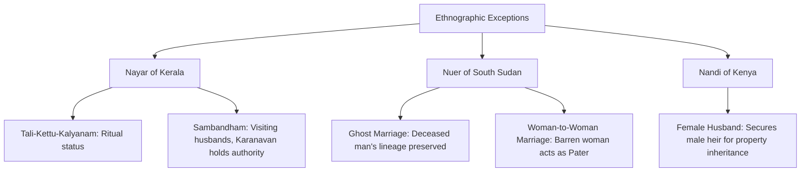

# VALUE ADD: Unit 2.3 - UNITS 2, 3, 4 & 5: SOCIO-CULTURAL ANTHROPOLOGY
**Date:** June 01, 2026 | **Target:** PAPER I — UNITS 2, 3, 4 & 5: SOCIO-CULTURAL ANTHROPOLOGY
**Syllabus Mapping:** Unit 2.3

# UNIT 2.3: MARRIAGE
## PREMIUM HIGH-YIELD REVISION & VALUE-ADDITION SHEET

---

## I. THE DEFINITIONAL DILEMMA & UNIVERSALITY CHALLENGES

The anthropological study of marriage begins with a fundamental problem: **How do we define marriage in a way that is cross-culturally valid?** Early definitions failed because they projected Western, Judaeo-Christian models of monogamous, heterosexual, co-residential, and reproductive unions onto the rest of the world.

```
[Western Classical Model] ──❌──> Failed to explain:
(Heterosexual + Cohabiting +      • Nayar Sambandham (No cohabitation/economic bond)
 Reproductive + Monogamous)       • Nuer Ghost Marriage (Deceased groom)
                                  • Nandi Female Husbands (Same-sex social fatherhood)
```

### 1. The Evolution of the Definition

#### A. Edward Westermarck (*The History of Human Marriage*, 1891)
* **Definition:** *"A relation of one or more men to one or more women which is recognized by custom or law and involves certain rights and duties both in the case of the parties entering the union and in the case of the children born of it."*
* **Limitation:** Assumes heterosexuality and cohabitation as universal baselines.

#### B. Kathleen Gough (*The Nayars and the Definition of Marriage*, 1959)
Following her ethnography of the matrilineal **Nayar of Kerala**, Gough redefined marriage to focus on **legitimacy of offspring** rather than the relationship between spouses:
* **Definition:** *"Marriage is a relationship established between a woman and one or more other persons, which provides that a child born to the woman under circumstances not forbidden by the rules of the relationship, is accorded full birth-status rights common to normal members of his society or social stratum."*
* **Key Insight:** Marriage is primarily an institution to secure **social parenthood (pater)** and legitimacy for children, even if the biological father (*genitor*) is absent or irrelevant.

#### C. Edmund Leach (*Rethinking Anthropology*, 1955)
Leach argued that no single definition of marriage exists. Instead, marriage is a **"bundle of rights"** that varies across societies. Marriage may allocate some or all of the following rights:

```
                  ┌── Legal fatherhood (Pater) & Legal motherhood (Mater)
                  ├── Monopoly over spouse's sexual services
                  ├── Rights to spouse's domestic & economic labor
MARRIAGE RIGHTS  ──┼── Rights over joint/individual property
 (Edmund Leach)   ├── Establishment of a joint fund for offspring
                  └── Creation of a socially significant "alliance" (Affinity)
```

---

### 2. Classic Ethnographic Exceptions (The "Universality" Challengers)

To score high in UPSC, you must cite these cases not just as "examples," but as structural solutions to specific socio-economic needs:



#### A. The Nayar of Kerala (Kathleen Gough)
* **The Structure:** Matrilineal, matrilocal joint family (*Taravad*).
* **Ritual 1: *Tali-Kettu-Kalyanam* (Tali-tying):** Before puberty, a girl is ritually tied with a *tali* by a man of an allied lineage. This grants her ritual womanhood. The "husband" has no further sexual, economic, or co-residential claims.
* **Ritual 2: *Sambandham* (Visiting Union):** A woman enters informal sexual relationships with men of equal or higher caste (*Nambudiri Brahmins* or *Nayars*). The visiting husbands (*Gunas*) visit at night and leave by morning. They have no economic obligation to the child.
* **The Legal Solution:** The mother's eldest brother (*Karanavan*) holds economic and disciplinary authority over the children. The biological father (*genitor*) only needs to pay a small ritual fee to the midwife to acknowledge paternity, but has no social role (*pater*).

#### B. The Nuer of South Sudan (E.E. Evans-Pritchard)
* **Ghost Marriage:** If a man dies without male heirs, his lineage is threatened. His brother or cousin marries a woman using the deceased man's cattle (bridewealth). The living man cohabits with the woman, but any children born are legally designated as the offspring of the *dead man* (the "ghost"). The deceased man is the *pater*; the living brother is the *genitor*.
* **Woman-to-Woman Marriage:** A wealthy, barren woman can pay bridewealth to "marry" a younger woman. The older woman acts as the **"Female Husband"** (social father/*pater*). She hires a male laborer (*genitor*) to impregnate the young wife. The children belong to the older woman's patrilineage, securing her inheritance rights.

#### C. The Nandi of Kenya (Regina Oboler)
* **Female Husbands:** Similar to the Nuer, a woman who has no sons can marry a younger woman to secure a male heir. The older woman assumes the social role of a man, inherits her husband's property, and is addressed as "father" by her wife's children.

---

## II. MARRIAGE REGULATIONS

Every society regulates who may marry whom. These rules are divided into **prohibitions** (negative rules) and **prescriptions** (positive rules).

```
                            MARRIAGE REGULATIONS
                                     │
            ┌────────────────────────┴────────────────────────┐
            ▼                                                 ▼
    NEGATIVE RULES (Prohibitions)                     POSITIVE RULES (Prescriptions)
     ├── Incest Taboo (Universal)                      ├── Endogamy (In-group marriage)
     ├── Exogamy (Out-group marriage)                  ├── Preferential Cross-Cousin (MBD/FSD)
     └── Hypergamy/Hypogamy (Status-based)             └── Parallel-Cousin (FBD - Arab/Bedouin)
```

### 1. Incest Taboo: Theoretical Explanations

The incest taboo is the universal prohibition of sexual relations between close consanguineous kin (typically parent-child and sibling-sibling).

| Theory | Key Proponent | Core Mechanism | Ethnographic Evidence / Critique |
| :--- | :--- | :--- | :--- |
| **Biological Inbreeding** | **Lewis Henry Morgan**, **E.B. Tylor** | Mating between close relatives leads to the expression of harmful recessive genes, causing genetic decline. | *Critique:* Primitive societies did not understand modern genetics; yet the taboo existed. |
| **Westermarck Effect (Childhood Familiarity)** | **Edward Westermarck** | Psychological aversion to sexual relations develops naturally among individuals raised together in early childhood. | *Evidence:* **Arthur Wolf's** study of Taiwan *Sim-pua* marriages; **Joseph Shepher's** study of Israeli Kibbutzim. |
| **Psychoanalytic / Alliance Suppression** | **Sigmund Freud** | Humans possess an innate, unconscious desire for incest (*Oedipus Complex*). The taboo is a cultural construct imposed to suppress this destructive urge. | *Critique:* Methodologically untestable; assumes universal psychic structures. |
| **Family Disruption** | **Bronislaw Malinowski** | Sexual competition within the nuclear family would create rivalries, destroy authority structures, and prevent enculturation. | *Mechanism:* The taboo preserves the functional integrity of the domestic group. |
| **Alliance / Cooperation Theory** | **Claude Lévi-Strauss** (*The Elementary Structures of Kinship*) | The taboo is not a biological rule, but a **social imperative**. Banning marriage within forces groups to exchange women, creating alliances. | *Mnemonic:* **"Marry out or die out"** (Tylor). The transition from Nature to Culture. |

---

### 2. Endogamy vs. Exogamy

* **Endogamy:** The rule requiring an individual to marry *within* a specific social, ethnic, or ritual group.
  * *Example:* **Caste (Jati) Endogamy** in India; **Yezidi** religious endogamy.
* **Exogamy:** The rule requiring an individual to marry *outside* their specific kinship, local, or descent group.
  * *Example:* **Gotra Exogamy** among Hindus; **Clan Exogamy** among the **Santhals** (who punish violations with social ostracism, *Bitlaha*).

---

### 3. Hypergamy (Anuloma) & Hypogamy (Pratiloma)

These rules govern marriage across different social strata (class or caste hierarchies):

```
HYPERGAMY (Anuloma)                      HYPOGAMY (Pratiloma)
  High Status                              High Status
   ┌─────────┐                              ┌─────────┐
   │  Groom  │                              │  Bride  │
   └────┬────┘                              └────┬────┘
        │ (Marries Down)                         │ (Marries Down)
        ▼                                        ▼
   ┌─────────┐                              ┌─────────┐
   │  Bride  │                              │  Groom  │
   └─────────┘                              └─────────┘
  Low Status                               Low Status
```

* **Hypergamy (*Anuloma*):** A woman marries a man of a higher social or ritual status.
  * *Socio-economic consequence:* Leads to high dowry payments (as lower-status families compete for high-status grooms) and historically contributed to female infanticide among upper-caste groups (e.g., Rajputs) due to the difficulty of finding even higher-status grooms.
* **Hypogamy (*Pratiloma*):** A woman marries a man of a lower social or ritual status.
  * *Socio-economic consequence:* Strongly condemned in traditional Hindu law (*Manusmriti*) as it threatens the purity of the lineage.

---

## III. PREFERENTIAL AND PRESCRIPTIVE MARRIAGES

Some societies do not just forbid certain unions; they actively prescribe or prefer specific relatives as mates.

### 1. Cross-Cousin vs. Parallel-Cousin Marriage

```
                  ┌─────────────── Parent's Siblings ───────────────┐
                  ▼                                                 ▼
         Opposite-Sex Sibling                              Same-Sex Sibling
      (Father's Sister / Mother's Brother)              (Father's Brother / Mother's Sister)
                  │                                                 │
                  ▼                                                 ▼
         CROSS-COUSINS                                     PARALLEL-COUSINS
  (FSD: Father's Sister's Daughter)                 (FBD: Father's Brother's Daughter)
  (MBD: Mother's Brother's Daughter)                 (MZD: Mother's Sister's Daughter)
                  │                                                 │
                  ▼                                                 ▼
  • Promotes Alliance between different lineages.    • Keeps property & solidarity within
  • Symmetric (FSD/MBD) or Asymmetric (MBD only).     the same patrilineage (e.g., Bedouins).
```

#### A. Cross-Cousin Marriage (Preferential)
Marriage with the child of one's parent's opposite-sex sibling (i.e., Mother's Brother's Daughter [MBD] or Father's Sister's Daughter [FSD]).
* **Matrilateral Cross-Cousin Marriage (MBD):** Ego marries Mother's Brother's Daughter.
  * *Lévi-Strauss's Analysis:* This creates **"Generalized Exchange"** (asymmetrical). Lineage A gives women to B, B gives to C, and C gives to A. This creates a circular, organic solidarity across the entire society.
* **Patrilateral Cross-Cousin Marriage (FSD):** Ego marries Father's Sister's Daughter.
  * *Lévi-Strauss's Analysis:* This creates **"Restricted Exchange"** (symmetrical). Lineage A and Lineage B exchange women directly back and forth every generation.

#### B. Parallel-Cousin Marriage (Prescriptive)
Marriage with the child of one's parent's same-sex sibling (i.e., Father's Brother's Daughter [FBD] or Mother's Sister's Daughter [MZD]).
* **The Bedouin/Arab Case Study:** FBD marriage is highly prescribed in Islamic Middle Eastern pastoralist societies.
* **Structural Function:** It prevents the fragmentation of family property (especially herds and land) under Islamic inheritance laws, which grant daughters a share of the estate. By marrying FBD, the property remains within the patrilineage.

---

### 2. Levirate and Sororate

These practices maintain alliances between lineages even after the death of a spouse:

```
LEVIRATE:  [Deceased Husband] ──> Wife marries his Brother (Preserves lineage & children)
SORORATE:  [Deceased Wife]    ──> Husband marries her Sister (Preserves alliance & dowry)
```

* **Levirate:** A widow marries the brother of her deceased husband.
  * *Junior Levirate:* Marrying the younger brother (common).
  * *Senior Levirate:* Marrying the older brother.
  * *Function:* Ensures that the widow and her children remain supported within the deceased husband's patrilineage, and prevents the return of bridewealth.
* **Sororate:** A widower marries the sister of his deceased wife.
  * *Function:* Preserves the alliance between the two families and ensures the children are cared for by a maternal aunt rather than a stepmother.

---

## IV. WAYS OF ACQUIRING A MATE IN TRIBAL SOCIETIES

Tribal societies have institutionalized diverse methods for selecting spouses, reflecting their ecological, economic, and social realities.

| Method | Local/Tribal Term | Mechanism | Classic Tribal Example | Anthropological Authority / Value-Add |
| :--- | :--- | :--- | :--- | :--- |
| **1. Capture** | *Oportipi* (Ho) / *Paunadi* (Kharia) | Physical or symbolic abduction of the bride. Often staged to bypass high bride price. | **Ho** of Jharkhand, **Kharia** of Odisha, **Gonds**. | **D.N. Majumdar** noted that modern "captures" are often pre-arranged mock dramas to save face and expenses. |
| **2. Service** | *Lamanai* (Gond) / *Ghar-jawai* | The groom works for the bride's father for a set period to pay off the bride price. | **Gonds** and **Baigas** of Madhya Pradesh. | Common in subsistence economies where the groom lacks liquid wealth (cattle/cash). |
| **3. Purchase** | *Bapla* (Santhal) | The groom's family pays a mutually agreed **bride price** to the bride's family. | **Santhals**, **Oraons**, **Nagas**. | Compensates the bride's family for the loss of her agricultural and reproductive labor. |
| **4. Trial** | *Gol Gadhedo* | The groom must prove his physical courage and agility in a public contest. | **Bhils** of Rajasthan/Gujarat. | During the Holi festival, women guard a coconut atop a greased pole; the man who climbs it despite their blows wins the right to choose any girl as his bride. |
| **5. Elopement** | *Rajikhusi* | The couple runs away due to parental opposition or high bride price, returning after the anger cools. | **Hos**, **Garos**, **Birhors**. | Acts as a safety valve against rigid social and economic rules. |
| **6. Intrusion** | *Anadar* (Ho) / *Bolo-bapla* (Santhal) | A woman forces her way into the groom's house, enduring insults and labor until she is accepted. | **Birhor**, **Ho**, **Santhal**. | Used when a man backtracks on a promise of marriage. |
| **7. Probation** | - | The groom lives with the bride in her house for a trial period to test compatibility. | **Kuki** of Manipur. | If incompatible, the groom pays compensation to the bride's family and leaves. |
| **8. Exchange** | *Golat* | Lineage A exchanges a daughter for a daughter of Lineage B. | **Birhor** of Jharkhand. | Eliminates the need for bride price payments on both sides. |

---

## V. MARRIAGE PAYMENTS (ECONOMIC TRANSACTIONS)

Marriage is rarely just a social contract; it is also an economic transaction. **Jack Goody and Stanley Tambiah** (*Bridewealth and Dowry*, 1973) analyzed these payments as structural adaptations to agricultural and social systems.

```
                           MARRIAGE PAYMENTS
                                   │
         ┌─────────────────────────┴─────────────────────────┐
         ▼                                                   ▼
    BRIDEWEALTH (Bride Price)                             DOWRY
     ├── Paid by Groom's kin to Bride's kin              ├── Paid by Bride's kin to Couple/Groom
     ├── Common in Horticultural/Pastoral societies      ├── Common in Intensive Agricultural societies
     ├── Women are primary economic producers            ├── Women's direct economic contribution is low
     └── "Compensation" for loss of labor/fertility      └── "Pre-mortem inheritance" (Jack Goody)
```

### 1. Bridewealth (Bride Price)
* **Definition:** A transfer of cash, goods, or livestock from the groom’s family to the bride’s family.
* **Socio-Economic Context:** Found in **75% of tribal societies**. It is common in horticultural and pastoral societies (e.g., East African cattle-herders) where women are primary food producers.
* **The Nuer Case Study:** The Nuer transfer **40 head of cattle** as bridewealth. This payment is not a "purchase" of a woman, but a legal transaction that transfers the rights over her children to the husband's patrilineage. If no cattle are exchanged, the children belong to the mother's natal family.

### 2. Dowry
* **Definition:** A transfer of goods, money, or property from the bride’s family to the groom, the groom’s family, or the newly established household.
* **Socio-Economic Context:** Common in highly stratified, intensive agricultural societies (using plow agriculture) where women's direct contribution to field labor is low.
* **Jack Goody's Concept of "Diverging Devolution":** Goody argued that dowry is a form of **pre-mortem inheritance** given to the daughter to secure her economic status in her new home, ensuring that property remains within the same social class.

---

## VI. DIVORCE AND STABILITY OF MARRIAGE

The ease and frequency of divorce vary significantly between simple (tribal) and complex (industrial/stratified) societies.

### 1. The Gluckman Hypothesis (Max Gluckman, 1950)
Gluckman established a direct correlation between **descent systems, bridewealth size, and divorce rates**:

```
STRONG PATRILINEAL DESCENT (e.g., Zulu)
 └── High Bridewealth ──> Wife fully incorporated into Husband's lineage ──> LOW DIVORCE

MATRILINEAL DESCENT (e.g., Bemba)
 └── Low/No Bridewealth ──> Wife remains anchored in her natal lineage ──> HIGH DIVORCE
```

* **In Strong Patrilineal Societies (e.g., Zulu of South Africa):**
  * Bridewealth is high and difficult to return.
  * The wife is fully incorporated into her husband's lineage.
  * **Result:** Marriage is highly stable; divorce is extremely rare.
* **In Matrilineal Societies (e.g., Bemba of Zambia):**
  * Bridewealth is low or absent.
  * The wife remains a member of her natal lineage, and children belong to her family.
  * **Result:** Marriage is unstable; divorce is frequent and easy to obtain.

### 2. The Fallers Hypothesis (Lloyd Fallers, 1957)
Fallers modified Gluckman's theory, arguing that the key to marriage stability is not just patrilineality, but the **presence of corporate lineages** that extract absolute loyalty. In bilateral or symmetrical systems where lineages are weak, divorce rates are intermediate and depend on personal compatibility rather than structural rules.

---

## VII. UNIT 2.3 QUICK RECALL CHEAT SHEET

Use this table for rapid revision of thinkers, concepts, and case studies during the final days before the exam:

| Thinker | Concept / Theory | Tribe / Society Studied | Key Book / Year | High-Yield Value-Add Quote / Fact |
| :--- | :--- | :--- | :--- | :--- |
| **Edward Westermarck** | Focus on heterosexuality & cohabitation | Global comparative | *The History of Human Marriage* (1891) | Defined marriage as a relationship between "one or more men to one or more women." |
| **Kathleen Gough** | Focus on legitimacy of offspring | **Nayar** of Kerala | *The Nayars and the Definition of Marriage* (1959) | Redefined marriage to accommodate the *Sambandham* and *Tali-tying* rituals. |
| **Edmund Leach** | Marriage as a "bundle of rights" | Kachin of Burma | *Rethinking Anthropology* (1955) | Argued that no single universal definition of marriage can exist. |
| **E.E. Evans-Pritchard** | Ghost Marriage & Female Husbands | **Nuer** of South Sudan | *Kinship and Marriage Among the Nuer* (1951) | Proved that *pater* (social father) is more structurally significant than *genitor* (biological father). |
| **Claude Lévi-Strauss** | Alliance Theory & Exchange of Women | Global comparative | *The Elementary Structures of Kinship* (1949) | Incest taboo is the "positive rule of exogamy" that forces social alliances. |
| **Arthur Wolf** | Westermarck Effect validation | **Taiwanese** *Sim-pua* | *Association and Aversion* (1995) | Girls adopted as infants into their future husbands' homes had 3x higher divorce rates. |
| **Jack Goody** | Diverging Devolution (Dowry) | Eurasian vs. African societies | *Bridewealth and Dowry* (1973) | Linked dowry to intensive plow agriculture and class preservation. |
| **Max Gluckman** | Gluckman Hypothesis on Divorce | **Zulu** & **Bemba** | *Kinship and Marriage in East Africa* (1950) | High patrilineal bridewealth = high marriage stability. |