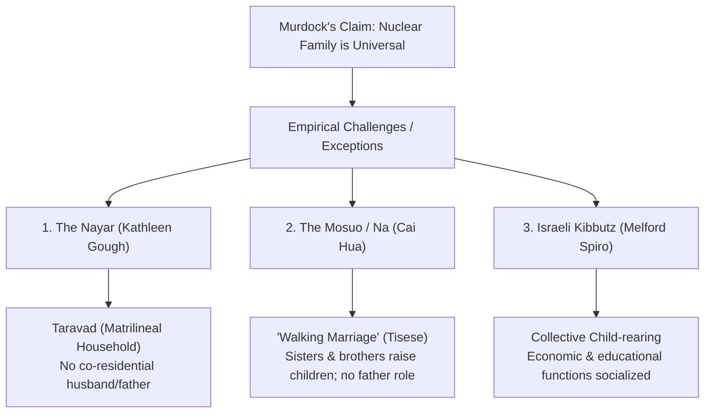
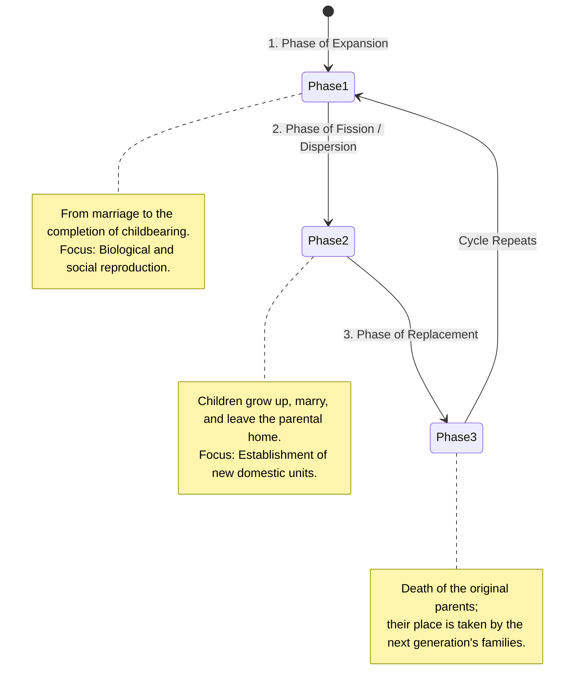

# VALUE ADD: Unit 2.4 - UNITS 2, 3, 4 & 5: SOCIO-CULTURAL ANTHROPOLOGY
**Date:** June 01, 2026 | **Target:** PAPER I — UNITS 2, 3, 4 & 5: SOCIO-CULTURAL ANTHROPOLOGY
**Syllabus Mapping:** Unit 2.4

# UNIT 2.4: FAMILY

---

## I. CORE CONCEPTUAL FOUNDATIONS OF FAMILY

The family is traditionally conceptualized as the primary, foundational social institution in human society. However, its definition, boundaries, and universality have been subjects of intense anthropological debate.

### 1. Key Anthropological Definitions
* **George Peter Murdock (1949):** In his seminal work *Social Structure*, Murdock defined the family as:
  > *"A social group characterized by common residence, economic cooperation, and reproduction. It includes adults of both sexes, at least two of whom maintain a socially approved sexual relationship, and one or more children, own or adopted, of the sexually cohabiting adults."*
* **Claude Lévi-Strauss (1956):** Defined the family as a group finding its origin in marriage, consisting of a husband, a wife, and children born of their union, bound together by legal, economic, and religious rights and obligations, as well as psychological bonds.

### 2. Family vs. Household: The Conceptual Distinction
Historically, anthropologists conflated "family" and "household." Modern anthropology, however, maintains a strict analytical distinction between the two, pioneered by scholars like **Donald Bender (1967)** and **A.M. Shah**.

```
+-------------------------------------------------------------------------+
|                                HOUSEHOLD                                |
|  (A Co-residential, Economic Unit: "People who share a hearth/roof")    |
|                                                                         |
|         +-----------------------------------------------------+         |
|         |                       FAMILY                        |         |
|         |  (A Kinship-based Social Unit: "People bound by     |         |
|         |             blood, marriage, or adoption")          |         |
|         |                                                     |         |
|         +-----------------------------------------------------+         |
|                                                                         |
|  *Note: A household can contain non-family members (e.g., domestic    |
|   helpers, lodgers) or a family can be spread across multiple           |
|   households (e.g., transnational families).                          |
+-------------------------------------------------------------------------+
```

#### Key Differences:
* **Family** is defined by **kinship, descent, and marriage**. It is a social and emotional construct.
* **Household** is defined by **co-residence and shared domestic activities** (production, consumption, and maintenance). It is a spatial and economic construct.
* **Donald Bender (1967):** Argued that co-residence (household) and kinship (family) are distinct social phenomena. One can have family functions without co-residence, and co-residence without kinship ties.
* **A.M. Shah (*The Household Dimension of the Family in India*, 1973):** Pointed out that in India, the "joint family" is often confused with the "joint household." While a joint household requires living under one roof and eating from one hearth, a joint family can exist as a set of separate households that maintain ritual, emotional, and financial ties.

---

## II. THE UNIVERSALITY DEBATE: CHALLENGES & EXCEPTIONS

**G.P. Murdock** asserted that the **nuclear family is universal** because it performs four essential, irreplaceable functions:
1. **Sexual:** Regulates and stabilizes sexual relations.
2. **Reproductive:** Ensures the biological continuity of society.
3. **Economic:** Organizes the division of labor and survival.
4. **Educational (Socialization):** Transmits culture to the next generation.

However, several classic ethnographic studies have challenged Murdock's claim of universality, proving that the nuclear family is not the inevitable building block of all human societies.



### 1. The Nayar of Kerala (Kathleen Gough)
* **Structure:** The traditional Nayar lived in a **Taravad**—a large, matrilineal, co-residential household consisting of a woman, her children, her sisters and brothers, and her sisters' children.
* **The Challenge:** The biological father had no residential, economic, or legal obligations to the child. The mother's eldest brother (*Karanavan*) held authority and managed the household. This proved that a stable, co-residential nuclear family of husband, wife, and children is not necessary for societal survival.

### 2. The Mosuo (Na) of Yunnan, China (Cai Hua)
* **Structure:** The Mosuo practice **Tisese** ("Walking Marriage" or visiting relationship). Men visit women's bedrooms at night but return to their own maternal households in the morning.
* **The Challenge:** Children are raised entirely by the mother's matrilineal household (the mother, her sisters, and her brothers). The biological father has no social, economic, or legal role in his children's lives. The concept of a co-residential husband-wife-child unit is completely absent.

### 3. The Israeli Kibbutz (Melford Spiro)
* **Structure:** In early Kibbutzim (agricultural communes), children were raised collectively in communal children's houses (*Beit Yeladim*) by professional caregivers (*Metaplot*), rather than by their biological parents.
* **The Challenge:** The economic and educational functions of Murdock's nuclear family were transferred to the community. Parents interacted with children primarily during leisure hours, challenging the idea that the nuclear family must be the primary economic and socialization unit.

---

## III. THE DOMESTIC GROUP & ITS DEVELOPMENTAL CYCLE

Rather than viewing the family as a static structure, British structural-functionalists introduced the concept of the **domestic group** to capture its dynamic, fluid nature.

### 1. Meyer Fortes: The Developmental Cycle of the Domestic Group (1958)
In his introduction to *The Developmental Cycle in Domestic Groups*, Fortes argued that the domestic group has a life cycle, transitioning through three distinct phases:



* **Significance:** This model explains why a household might appear "nuclear" at one point in time and "extended" or "single-person" at another. It is not a different *type* of family, but merely a different *phase* of the same developmental cycle.

---

## IV. CONTEMPORARY TRANSFORMATIONS OF THE FAMILY

The forces of **Urbanization, Globalization, Feminism, and Technology** have radically restructured the family globally and in India.

### 1. Impact of Urbanization & Industrialization
* **Structural Fission:** The physical separation of joint families into nuclear households due to spatial constraints in urban centers.
* **Talcott Parsons' "Isolated Nuclear Family":** Parsons argued that industrial society requires a geographically mobile and socially mobile labor force. The isolated nuclear family, stripped of wider kinship obligations, is perfectly adapted to this requirement.
* **The Indian Reality (A.M. Shah & Milton Singer):**
  * **Milton Singer (*When a Great Tradition Modernizes*):** Found that industrialization did not destroy the joint family among Madras industrialists. Instead, they maintained a "jointness in spirit"—sharing business assets, celebrating rituals together, and operating as a joint family despite living in separate nuclear households.
  * **Modified Extended Family:** Modern urban families maintain strong functional, financial, and emotional ties across households via digital communication (the "virtual joint family").

### 2. Impact of Feminism
* **Deconstruction of the Patriarchal Family:** Feminism challenged the traditional, unequal division of labor (male breadwinner / female homemaker) within the family.
* **Symmetrical Families (Young & Willmott):** Rise of dual-career households where domestic chores and decision-making are shared more equitably.
* **Matrifocal / Female-Headed Households:** Increase in households headed by single mothers, driven by economic independence, divorce, or choice, normalizing non-traditional family structures.

### 3. Impact of Globalization
* **Transnational Families:** Due to global labor migration, family members live across different nation-states (e.g., Indian tech workers in the US supporting elderly parents in India).
* **Global Care Chains (Arlie Hochschild):** The extraction of care work from developing nations to developed nations (e.g., women from the Philippines migrating to act as nannies in the West, leaving their own children to be cared for by female relatives at home).
* **Stretched Households:** Households that are physically dispersed but remain economically and emotionally integrated through remittances and digital communication.

### 4. Impact of New Reproductive Technologies (NRTs) & Queer Kinship
* **Detaching Biology from Kinship:** Technologies like IVF, gestational surrogacy, and egg/sperm donation have fragmented the concept of parenthood into:
  1. *Genetic Parent* (provides DNA)
  2. *Gestational Parent* (carries the pregnancy)
  3. *Social Parent* (raises the child)
* **Queer Kinship (Kath Weston - *Families We Choose*):** Weston's ethnography of LGBTQ+ families in San Francisco demonstrated how kinship can be constructed through choice and shared commitment rather than biological descent or legal marriage, redefining the boundaries of the family.

---

## V. HIGH-YIELD VALUE-ADDITION CASE STUDIES (UPSC MAINS)

To secure high marks in the UPSC Mains, integrate these contemporary, ethnographically rich case studies into your answers:

### Case Study 1: The "Virtual Joint Family" in Urban India
* **Scholar:** Dr. Puja Sharma (2018)
* **Context:** Ethnographic study of IT professionals in Bangalore.
* **Findings:** While physical joint households are declining due to high real estate costs, families use WhatsApp groups, Zoom, and digital banking to make collective decisions regarding property, marriages, and eldercare. This demonstrates that **structural nuclearization does not equal functional disintegration**.

### Case Study 2: Transnational Motherhood among Filipina Domestic Workers
* **Scholar:** Rhacel Salazar Parreñas (*Servants of Globalization*, 2001)
* **Context:** Study of Filipina migrant domestic workers in Rome and Los Angeles.
* **Findings:** These mothers perform "distance parenting" via video calls and remittances, redefining the traditional, co-residential definition of the maternal role and creating "stretched" transnational families.

### Case Study 3: Surrogacy and Kinship in India
* **Scholar:** Amrita Pande (*Wombs in Labor*, 2014)
* **Context:** Ethnography of a surrogacy clinic in Anand, Gujarat.
* **Findings:** Explores how commercial surrogacy challenges traditional definitions of motherhood. Intended mothers and surrogate mothers often negotiate a complex, temporary kinship relationship ("sisterhood"), showing how technology redefines the boundaries of family and bodily labor.

---

## VI. THINKERS & CASE STUDIES QUICK-REFERENCE MATRIX

Use this matrix for rapid revision and active recall:

| Thinker / Scholar | Core Concept | Key Case Study / Tribe | UPSC Application / Value Addition |
| :--- | :--- | :--- | :--- |
| **G.P. Murdock** | Universality of Nuclear Family | 250 diverse societies | Use to introduce the traditional baseline definition of family and its functions. |
| **Kathleen Gough** | Challenge to Universality | Nayars of Kerala (*Taravad*) | Use to critique Murdock's definition of family and co-residential marriage. |
| **Cai Hua** | "Walking Marriage" (*Tisese*) | Mosuo (Na) of China | Excellent cross-cultural exception to the universal necessity of the father role. |
| **Melford Spiro** | Collective Child-rearing | Israeli Kibbutz | Use to show how the educational and economic functions of the family can be socialized. |
| **Meyer Fortes** | Developmental Cycle | Domestic Groups | Use to explain that family structures are dynamic and change over time, not static types. |
| **A.M. Shah** | Household vs. Family | Rural/Urban Gujarat | Crucial for distinguishing between "joint family" (kinship) and "joint household" (residence). |
| **Milton Singer** | Jointness in Spirit | Madras Industrialists | Use to argue that industrialization/urbanization does not automatically destroy the joint family in India. |
| **Kath Weston** | "Families We Choose" | LGBTQ+ families in San Francisco | Use to discuss the impact of modern social movements and choice-based kinship on the family. |
| **Amrita Pande** | Fragmented Motherhood | Surrogacy in Anand, Gujarat | Use to illustrate the impact of New Reproductive Technologies (NRTs) on contemporary family structures. |