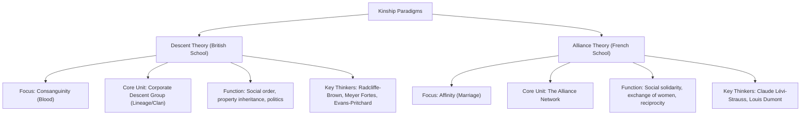

# VALUE ADD: Unit 2.5 - UNITS 2, 3, 4 & 5: SOCIO-CULTURAL ANTHROPOLOGY
**Date:** June 01, 2026 | **Target:** PAPER I — UNITS 2, 3, 4 & 5: SOCIO-CULTURAL ANTHROPOLOGY
**Syllabus Mapping:** Unit 2.5

# UPSC MAINS HIGH-YIELD REVISION SHEET
## PAPER I — UNIT 2.5: KINSHIP

---

## I. THEORETICAL BATTLEGROUND: DESCENT VS. ALLIANCE

The study of kinship in anthropology is dominated by two contrasting theoretical paradigms. To score high marks, you must contrast their structural assumptions, key thinkers, and classic ethnographies.



### 1. Deep-Dive Comparison

| Dimension | Descent Theory (British School) | Alliance Theory (French School) |
| :--- | :--- | :--- |
| **Primary Bond** | **Consanguineal** (blood ties). | **Affinal** (marital ties). |
| **Philosophical Root** | Structural-Functionalism (Durkheimian solidarity via institutions). | Structuralism (Mental structures, binary oppositions, reciprocity). |
| **Core Mechanism** | **Unilineal Descent Groups** acting as "corporate bodies" to regulate inheritance, land, and political-jural rights. | **Incest Taboo** acting as a negative rule that forces the positive exchange of women between groups. |
| **Social Domain** | **Jural-Political domain** (how society maintains order without a formal state). | **Symbolic-Communicative domain** (women as the ultimate "message" exchanged to build alliances). |
| **Classic Ethnography** | *The Nuer* (Evans-Pritchard) & *The Web of Kinship among the Tallensi* (Meyer Fortes). | *The Elementary Structures of Kinship* (Claude Lévi-Strauss). |
| **Indian Context** | Applied to North Indian kinship (lineage-focused, gotra-exogamous). | Applied to South Indian/Dravidian kinship (Louis Dumont's repetitive cross-cousin marriage alliances). |

---

## II. STRUCTURAL TYPOLOGY OF DESCENT GROUPS & RULES

Descent rules define how individuals trace their ancestry and align themselves with corporate groups.

```
                  [DESCENT RULES]
                         |
        +----------------+----------------+
        |                                 |
  [Unilineal]                       [Non-Unilineal]
        |                                 |
  +-----+-----+                     +-----+-----+
  |           |                     |           |
[Patrilineal] [Matrilineal]   [Double/Bilineal] [Ambilineal] [Bilateral/Kindred]
```

### 1. Unilineal Descent Groups
* **Lineage:** A corporate group tracing descent from a **known, common ancestor** through a single line (patrilineal or matrilineal). Typically spans 5 to 7 generations. It is a highly localized, jural-political unit.
* **Clan (Sib):** A larger, non-corporate descent group whose members claim descent from a **mythical, legendary, or totemic ancestor** (e.g., animal, plant, or spirit). Genealogies are not traceable. Clans are typically exogamous.
* **Phratry:** A grouping of two or more supposedly related clans. While clans retain their individual identities, they recognize a higher-level, loose brotherhood.
* **Moiety:** The structural division of a society into **exactly two halves** based on descent. Moieties are strictly exogamous and complementary (e.g., **Tlingit of Alaska** divided into *Raven* and *Eagle* moieties).

### 2. Non-Unilineal Descent Systems
* **Double (Bilineal) Descent:** An individual belongs to both the father's patrilineal group and the mother's matrilineal group simultaneously, but for **different, non-overlapping purposes**.
  * *High-Yield Case Study:* **The Yako of Nigeria (Daryll Forde)**.
    * *Patrilineal Lineage (Kepun):* Governs the inheritance of immovable property (land, compound houses) and local political rights.
    * *Matrilineal Lineage (Yejima):* Governs the inheritance of movable property (livestock, currency, debts) and ritual/mystical obligations.
* **Ambilineal Descent:** An individual has the choice to affiliate with either the father's or the mother's descent group. This is common in resource-scarce island environments (e.g., **Polynesia**) where land pressure requires flexible group membership.
* **Bilateral Kindred:** An **ego-centered** network of bilateral relatives (spreading out on both maternal and paternal sides). Unlike unilineal groups, a kindred is **not corporate**, has no permanent existence beyond Ego's lifetime, and no two individuals (except siblings) share the exact same kindred.

---

## III. KINSHIP TERMINOLOGY: THE COGNITIVE ARCHITECTURE

Kinship terms are not mere labels; they reflect social roles, rights, and obligations. **A.L. Kroeber** (1909) revolutionized this field by identifying 8 structural principles that shape how terminologies are constructed.

### 1. Kroeber's 8 Principles of Kinship Classification

```
1. Generation ───► Distinguishes Father (Gen +1) from Son (Gen -1)
2. Lineal vs. Collateral ───► Distinguishes Father (Lineal) from Uncle (Collateral)
3. Age within Generation ───► Distinguishes Elder Brother from Younger Brother
4. Gender of Relative ───► Distinguishes Brother (Male) from Sister (Female)
5. Gender of Speaker ───► Term changes depending on whether a Male or Female is speaking
6. Gender of Connecting Relative ───► Distinguishes Mother's Brother from Father's Brother
7. Decidence (Status of Link) ───► Terms change if the connecting relative is alive or deceased
8. Affinity ───► Distinguishes blood relatives from marriage relations (e.g., Father vs. Father-in-law)
```

### 2. Morgan's Six Classic Kinship Systems
Lewis Henry Morgan classified terminologies into **Classificatory** (merging lineal and collateral kin) and **Descriptive** (separating lineal from collateral kin). Anthropologists identify six classic systems based on how they classify parental generations and cousins.

```
[KEY FOR DIAGRAMS BELOW: F = Father, M = Mother, FB = Father's Brother, FZ = Father's Sister, MB = Mother's Brother, MZ = Mother's Sister]
```

#### A. Hawaiian System (Most Classificatory)
* **Rule:** Merges all relatives of the same generation and gender under a single term.
* **Parental Generation:** $F = FB = MB$ (all called "Father"); $M = MZ = FZ$ (all called "Mother").
* **Cousin Generation:** All cousins (parallel and cross) are called "Brother" or "Sister."
* **Social Context:** Strongly associated with ambilineal descent and undivided corporate property.

#### B. Eskimo System (Bilateral/Nuclear Focus)
* **Rule:** Separates the nuclear family from all collateral relatives, but lumps all collateral relatives together.
* **Parental Generation:** $F$ and $M$ are unique terms. $FB = MB$ (all called "Uncle"); $FZ = MZ$ (all called "Aunt").
* **Cousin Generation:** All cousins are lumped under a single term ("Cousin"), distinct from "Brother" and "Sister."
* **Social Context:** Found in bilateral, highly mobile societies (e.g., Inuit, modern Western societies) where the nuclear family is the primary economic unit.

#### C. Iroquois System (Bifurcate Merging)
* **Rule:** Merges same-sex siblings of parents, but distinguishes opposite-sex siblings.
* **Parental Generation:** $F = FB$ ("Father"), but $MB$ is distinct ("Uncle"). $M = MZ$ ("Mother"), but $FZ$ is distinct ("Aunt").
* **Cousin Generation:** Parallel cousins ($FB$ children and $MZ$ children) are merged with siblings ("Brother/Sister"). Cross-cousins ($FZ$ children and $MB$ children) are distinguished and are highly preferred marriage partners.
* **Social Context:** Strongly associated with unilineal descent groups and preferential cross-cousin marriage.

#### D. Crow System (Matrilineal Generational Skewing)
* **Rule:** A matrilineal system that **skews generations** on the paternal side to emphasize lineage solidarity over generation.
* **Parental Generation:** Bifurcate merging (similar to Iroquois).
* **Paternal Side Skewing:** All male members of Ego's father's matrilineage, regardless of generation, are called "Father's Brother" or "Father." All female members of the father's matrilineage are called "Father's Sister" (Aunt).
* **Social Context:** Strong matrilineal descent where paternal kin are viewed as a single, undifferentiated corporate block.

#### E. Omaha System (Patrilineal Generational Skewing)
* **Rule:** The patrilineal mirror image of the Crow system. It **skews generations** on the maternal side.
* **Parental Generation:** Bifurcate merging.
* **Maternal Side Skewing:** All male members of Ego's mother's patrilineage, regardless of generation, are called "Mother's Brother" (Uncle). All female members are called "Mother" or "Mother's Sister."
* **Social Context:** Strong patrilineal descent where maternal kin are treated as a single corporate group.

#### F. Sudanese System (Most Descriptive)
* **Rule:** Every single relative has a unique, highly descriptive term. No two relationships are merged.
* **Parental Generation:** $F$, $M$, $FB$, $FZ$, $MB$, $MZ$ all have completely distinct terms.
* **Cousin Generation:** Separate terms for Ego's siblings, father's brother's children, father's sister's children, mother's brother's children, and mother's sister's children.
* **Social Context:** Highly stratified societies with complex inheritance, class divisions, and political alliances (e.g., ancient Rome, traditional Arab societies).

---

## IV. KINSHIP BEHAVIORS & RITUALIZED RELATIONSHIPS

Kinship is not just cognitive; it is performative. Societies prescribe specific behavioral patterns to manage structural tensions, maintain social distance, or reinforce authority.

```
                  [KINSHIP BEHAVIORS]
                           |
        +------------------+------------------+
        |                                     |
  [Tension Management]               [Authority & Alliance]
        |                                     |
  +-----+-----+                         +-----+-----+
  |           |                         |           |
[Avoidance] [Joking]                [Avunculate] [Amitate]
                                    [Couvade]    [Technonymy]
```

### 1. Avoidance Relationships
* **Definition:** Socially enforced physical and verbal distance between specific categories of kin.
* **Function:** Prevents incestuous opportunities, minimizes structural friction, and maintains respect hierarchies.
* **Classic Dyads:** Mother-in-law and Son-in-law (e.g., **Navajo**); Father-in-law and Daughter-in-law (common in traditional North India).

### 2. Joking Relationships
* **Definition:** Permitted, often mandatory, familiarity, teasing, and sexual banter between specific kin.
* **Function (Radcliffe-Brown):** Acts as a safety valve to release structural tension in relationships that involve both attachment and potential conflict.
* **Classic Dyads:** Brother-in-law and Sister-in-law (e.g., **Gonds** of Central India); Grandparent and Grandchild.

### 3. Avunculate
* **Definition:** A structural relationship in **matrilineal societies** where the maternal uncle ($MB$) holds primary authority, disciplinary power, and jural responsibility over his sister's children.
* **Function:** Resolves the "matrilineal puzzle" by ensuring male authority over the lineage while tracing descent through females.
* **Classic Case Study:** **Trobriand Islanders (Bronislaw Malinowski)**. The biological father is an affectionate, non-authoritarian figure, while the maternal uncle is the strict disciplinarian who passes down property, magic, and status to his nephew.

### 4. Amitate
* **Definition:** A structural relationship in **patrilineal societies** where the father's sister ($FZ$) holds high authority, ceremonial importance, and decision-making power over her brother's children.
* **Classic Case Study:** **Toda of Nilgiri Hills**. The father's sister plays a central role in naming ceremonies, ear-piercing rituals, and must give formal consent for marriages.

### 5. Couvade
* **Definition:** A custom where a husband mimics the pregnancy taboos, dietary restrictions, and labor pains of his wife during and immediately after childbirth.
* **Theories:**
  * *Psychological:* Establishes and asserts the husband's social fatherhood in matrilineal societies.
  * *Cosmological Value-Add:* Among the **Barasana of the Amazon**, the father undergoes strict postpartum isolation and rubs his sweat on the newborn. They believe this transfers his spiritual life force (*spiritual umbilicus*) to the child, securing its soul.

### 6. Technonymy
* **Definition:** The practice of addressing a person not by their personal name, but by their relationship to a child (e.g., "Mother of Amit").
* **Function:** Edward Tylor argued it marks the transition of a spouse into a fully integrated member of the household after childbirth. It also serves as a mechanism of respect and avoidance.

---

## V. THINKERS & ETHNOGRAPHIES CHEAT SHEET

Use these precise references in your answers to secure high marks:

| Anthropologist | Key Work | Field Site / Tribe | Core Contribution to Unit 2.5 |
| :--- | :--- | :--- | :--- |
| **Lewis Henry Morgan** | *Systems of Consanguinity and Affinity* (1871) | Iroquois (North America) | Invented the study of kinship; distinguished Classificatory vs. Descriptive terminologies. |
| **A.R. Radcliffe-Brown** | *Structure and Function in Primitive Society* (1952) | Andaman Islanders, BaThonga | Developed Descent Theory; explained Joking Relations as structural tension-management. |
| **Meyer Fortes** | *The Web of Kinship among the Tallensi* (1949) | Tallensi (West Africa) | Demonstrated how unilineal descent groups function as corporate, political-jural entities. |
| **E.E. Evans-Pritchard** | *The Nuer* (1940) | Nuer (South Sudan) | Formulated the **Segmentary Lineage System**, showing how lineages segment and coalesce for political defense. |
| **Claude Lévi-Strauss** | *The Elementary Structures of Kinship* (1949) | Nambikwara (Brazil) | Founded Alliance Theory; introduced the concept of restricted and generalized exchange of women. |
| **Louis Dumont** | *Hierarchy and Marriage Alliance* (1957) | Pramalai Kallar (South India) | Applied Alliance Theory to India; proved Dravidian kinship is based on structural marriage alliances, not descent. |
| **Iravati Karve** | *Kinship Organisation in India* (1953) | Pan-India | Classified Indian kinship into four geographical zones (North, South, East, West), mapping linguistic and structural differences. |

---

## VI. UPSC MAINS ANSWER EDGE: CONTEMPORARY KINSHIP DYNAMICS

To score high marks in 15-20 mark questions, you must show how kinship is adapting to modern technological and social shifts.

### 1. Assisted Reproductive Technologies (ART) & Kinship
* **The Shift:** The rise of IVF, gestational surrogacy, and sperm/egg donation has decoupled the biological components of kinship.
* **Theoretical Value-Add:** **Marilyn Strathern** (*Reproducing the Future*, 1992) argues that ART has "denaturalized" kinship. Kinship is no longer a passive reflection of biology; it is now a conscious choice.
* **Structural Fragmentation:** A child can now have up to five distinct parents:
  1. Genetic Father (Sperm Donor)
  2. Genetic Mother (Egg Donor)
  3. Gestational Mother (Surrogate)
  4. Social Father (Intended Parent)
  5. Social Mother (Intended Parent)
* This challenges both Descent Theory (who is the true corporate ancestor?) and Alliance Theory (how are marital exchanges negotiated when biology is fragmented?).

### 2. Same-Sex Kinship & "Families of Choice"
* **The Shift:** The legal and social recognition of LGBTQ+ families.
* **Theoretical Value-Add:** **Kath Weston** (*Families We Choose: Lesbians, Gays, Kinship*, 1991) demonstrated that same-sex couples actively construct kinship networks based on love, care, and shared commitment, rather than biological descent. This shifts the definition of kinship from **ascribed status** (biology) to **achieved status** (performance and choice).

### 3. Digital Kinship & Transnational Families
* **The Shift:** Globalization and labor migration have physically fragmented traditional lineages.
* **The Adaptation:** Anthropologists now study "transnational kinship," where families maintain emotional, economic, and ritual ties across borders using digital platforms (WhatsApp, FaceTime). Physical co-residence is no longer a prerequisite for active kinship participation.

---

## VII. UPSC MAINS MODEL QUESTION & ANSWER BLUEPRINT

### Question: Critically examine the Segmentary Lineage System as a mechanism of social control in stateless societies. [15 Marks]

#### 1. Introduction (Approx. 40 words)
* Define the Segmentary Lineage System as a structural variation of unilineal descent where lineages split and coalesce at different levels of segmentation.
* Note that it was famously documented by **E.E. Evans-Pritchard** in his classic ethnography *The Nuer* (1940) to explain how social order is maintained in stateless, acephalous societies.

#### 2. Structural Mechanics (Diagram & Explanation)
* Explain how the system operates on the principle of **complementary opposition**: "Me against my brother; my brother and I against our cousin; our cousins, my brother, and I against the stranger."

```
                  [Maximal Clan]
                        |
            +-----------+-----------+
            |                       |
     [Major Lineage A]       [Major Lineage B]
            |                       |
      +-----+-----+           +-----+-----+
      |           |           |           |
   [Minor]     [Minor]     [Minor]     [Minor]
     A1          A2          B1          B2
```

* If a member of Minor Lineage $A1$ fights a member of Minor Lineage $A2$, the conflict remains localized.
* However, if a member of Minor Lineage $A1$ conflicts with a member of Minor Lineage $B1$, then $A1$ and $A2$ coalesce to form Major Lineage $A$ to oppose Major Lineage $B$ (which has coalesced from $B1$ and $B2$).

#### 3. Social Control Functions
* **Balanced Opposition:** The structural equivalence of segments prevents any single group from dominating, maintaining a balance of power.
* **Conflict Resolution without State:** The threat of large-scale mobilization forces disputants to seek mediation (e.g., through the **Leopard-Skin Chief** among the Nuer, who acts as a ritual mediator to negotiate blood wealth in cattle).
* **Territorial Expansion:** Segmentary lineages allow rapid mobilization of large forces to expand into territories of neighboring groups (e.g., Nuer expansion into Dinka territory).

#### 4. Critical Evaluation
* **Max Gluckman's Critique:** Argued that Evans-Pritchard overemphasized structural balance. In reality, cross-cutting ties (such as marriage alliances, maternal kin, and friendships across lineages) play an equally important role in dampening conflict.
* **Ecological Limitation:** Marshall Sahlins noted that segmentary systems are highly specialized adaptations to competitive, expanding frontiers and do not exist in stable, resource-abundant environments.

#### 5. Conclusion (Approx. 30 words)
* Conclude that the segmentary lineage system demonstrates how kinship can serve as a highly organized political framework, proving that "stateless" does not mean "lawless" or "disorganized."