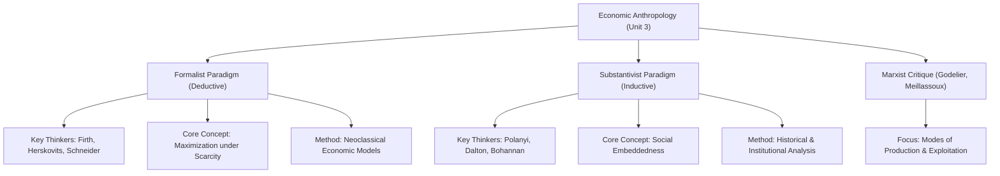
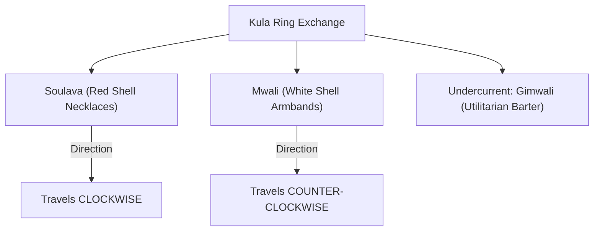

# VALUE ADD: Unit 3 - UNITS 2, 3, 4 & 5: SOCIO-CULTURAL ANTHROPOLOGY
**Date:** June 01, 2026 | **Target:** PAPER I — UNITS 2, 3, 4 & 5: SOCIO-CULTURAL ANTHROPOLOGY
**Syllabus Mapping:** Unit 3

# UNIT 3: ECONOMIC ORGANIZATION (MASTER REVISION & VALUE-ADDITION SHEET)

---

## I. EPISTEMOLOGICAL FOUNDATIONS & THE DEBATE

Economic anthropology does not merely study "transactions"; it investigates how livelihoods are structured, given meaning, and integrated within diverse cultural systems. The central epistemological fissure of this sub-discipline is the **Formalist vs. Substantivist Debate**.



### 1. Deep-Dive: Formalist vs. Substantivist Paradigms

| Dimension | Formalist School | Substantivist School |
| :--- | :--- | :--- |
| **Etymology & Meaning** | Derived from the **"formal"** logical properties of decision-making (rational choice, calculation). | Derived from the **"substantive"** reality of human survival and interaction with nature. |
| **Core Premise** | Human wants are unlimited, while resources are scarce. Therefore, all humans are inherently rational utility-maximizers. | Economy is an **"embedded"** process. Economic behavior is a sub-system of kinship, religion, and political structures. |
| **Applicability of Western Theory** | **Universal.** Neoclassical economic tools (supply-demand, price theory, opportunity cost) apply to both Wall Street and tribal barter. | **Historically Specific.** Neoclassical models only apply to modern, price-making market economies. |
| **Definition of "Rationality"** | Maximizing personal utility, prestige, or material gain with minimal effort/cost. | Fulfilling social obligations, maintaining status, and ensuring collective survival. |
| **Key Ethnographic Proof** | **Raymond Firth (*Primitive Polynesian Economy*, 1939):** Tikopia chiefs make rational choices allocating yams, balancing immediate consumption against future political capital. | **Karl Polanyi (*The Great Transformation*, 1944):** In non-market societies, the economy is integrated via reciprocity and redistribution, not price-mechanisms. |

### 2. The Marxist Intervention (The "Third" Way)
To secure top marks, acknowledge the **Neo-Marxist Critique** of this debate led by French anthropologists **Maurice Godelier** and **Claude Meillassoux**:
* Both Formalists and Substantivists focus heavily on *exchange* and *distribution*.
* Marxist anthropologists argue that the true focus should be on the **Modes of Production** (the forces and social relations of production).
* *Value-Add:* Meillassoux’s study of the **Guro of Ivory Coast** (*Maidens, Meal and Money*) demonstrated how elders control the labor of youth not through market forces, but by controlling access to prestige goods required for bride-price (kinship-based exploitation).

> [!TIP]
> **UPSC Answer Writing Edge:**
> When writing an answer on the Formalist-Substantivist debate, conclude with a **Synthesis**. Modern economic anthropology uses a **Biocultural/Ecological framework**—acknowledging that while cognitive rational decision-making is universal (Formalism), the institutional pathways and values that define "utility" are entirely culturally constructed (Substantivism).

---

## II. PRINCIPLES OF PRODUCTION, DISTRIBUTION & EXCHANGE

### 1. Production in Simple Societies
Unlike industrial economies where production is fragmented and alienated, production in simple societies is characterized by:
* **Communal Land Tenure:** Land is rarely private property. It is held collectively by the lineage, clan, or band. Individual families hold *usufruct rights* (rights of use), not ownership.
  * *Example:* Among the **Birhor** of Jharkhand, forest territories are recognized as collective band properties (*Tanda*).
* **Organic Division of Labor:** Division is based strictly on age and gender (simple division), rather than hyper-specialization.
* **Non-Alienated Labor:** The producer owns the tools of production and controls the entire workflow, embedding labor with ritual and social meaning.

### 2. Sahlins' Spectrum of Reciprocity
**Marshall Sahlins** (*Stone Age Economics*, 1972) established that reciprocity is not a singular phenomenon but a spectrum defined by **social distance**:

```
[Close Kin/Band] -------------------- [Inter-Tribal/Village] -------------------- [Strangers/Enemies]
  Generalized Reciprocity              Balanced Reciprocity                 Negative Reciprocity
  (No expectation of return)          (Equal value, time-bound)             (Maximization at other's cost)
```

* **Generalized Reciprocity:**
  * *Social Distance:* Minimal (nuclear family, lineage, close band members).
  * *Mechanism:* High trust. Goods are given without any calculation of value or expectation of immediate/future return.
  * *Case Study:* **Ju/'hoansi (!Kung San)** of the Kalahari. Large game meat is distributed to all band members. To prevent pride, they practice *"insulting the meat"*—downplaying the hunter's achievement to maintain egalitarianism.
* **Balanced Reciprocity:**
  * *Social Distance:* Intermediate (different lineages, friendly neighboring villages).
  * *Mechanism:* Moderate trust. Expectation of an equivalent return within a culturally specified timeframe.
  * *Case Study:* The **Was exchange** between coastal and inland Trobriand Islanders. Coastal villages trade fish for inland yams at a fixed, traditional exchange rate.
* **Negative Reciprocity:**
  * *Social Distance:* Maximum (strangers, hostile groups, outsiders).
  * *Mechanism:* Zero trust. The goal is to obtain something for nothing or maximize personal gain at the expense of the other party.
  * *Case Studies:*
    * **Silent Trade (Dumb Barter):** Practiced historically between the **Mbuti Pygmies** (forest-dwellers) and **Bantu farmers** (agriculturalists). Goods are left at a boundary line without face-to-face contact to avoid conflict.
    * **Cattle Raiding:** Practiced by the **Nuer of South Sudan** against the Dinka.

### 3. Systems of Redistribution
Redistribution requires a **political center** to aggregate goods and subsequently disperse them.

#### A. The Kula Ring (Trobriand Islanders — Bronislaw Malinowski)
In *Argonauts of the Western Pacific* (1922), Malinowski detailed this highly complex, inter-island ceremonial exchange system:



* **The Mechanism:**
  * **Soulava** (red shell necklaces) travel *clockwise* around the ring of islands.
  * **Mwali** (white shell armbands) travel *counter-clockwise*.
  * These items are highly valued, named historical treasures (*Vaygu'a*). They cannot be kept permanently; they must be passed on after a period.
* **The Substantivist/Functionalist Insight:**
  * While the overt focus is the ceremonial exchange of prestige items, the Kula Ring facilitates **Gimwali** (the secondary, highly rational barter of essential utilitarian goods like clay pots, yams, and canoe timber) between islands with different ecological niches.
  * It establishes lifelong partnerships, maintains inter-island peace, and acts as a social safety net.

#### B. The Potlatch (Kwakiutl of the Pacific Northwest — Franz Boas / Marcel Mauss)
* **The Mechanism:**
  * Hosted by a chief to mark major life events (birth, marriage, death).
  * The host chief gives away or publicly destroys vast amounts of wealth (blankets, copper plates, fish oil, canoes) in front of rival chiefs.
* **Theoretical Interpretations:**
  * **Ruth Benedict (Psychological):** Viewed it as a manifestation of the "megalomaniac" Kwakiutl personality, driven by status competition.
  * **Marcel Mauss (*The Gift*, 1925):** Analyzed it as a system of **"total prestation"** where the three obligations—*to give, to receive, and to reciprocate*—bind societies together.
  * **Wayne Suttles / Stuart Piddocke (Cultural Ecology):** Provided a materialist explanation. The Potlatch served an ecological function. Due to localized fluctuations in salmon runs, a village with a surplus in a given year would host a Potlatch, distributing food to starving rival villages in exchange for high prestige. In lean years, they would attend rivals' Potlatches to receive food, converting prestige back into survival calories.

---

## III. SUBSISTENCE PROFILES & TECHNO-ENVIRONMENTAL ADAPTATIONS

Simple societies are classified by their primary mode of resource extraction. Each profile represents a specific adaptation to environmental constraints.

| Subsistence Profile | Primary Technology | Social Organization | Key Global Case Study | Key Indian Case Study | High-Yield Anthropological Insight |
| :--- | :--- | :--- | :--- | :--- | :--- |
| **1. Hunting & Gathering (Foraging)** | Bows, arrows, digging sticks, spears. No food storage. | Nomadic, small bands (20-50); highly egalitarian; bilateral descent. | **Ju/'hoansi (!Kung)** of Kalahari Desert (Richard Lee). | **Birhor** (Jharkhand), **Chenchu** (Andhra Pradesh). | **"The Original Affluent Society" (Sahlins):** Foragers work only 3-4 hours a day to meet all caloric needs, leaving ample leisure time. |
| **2. Fishing** | Specialized nets, harpoons, traps, seaworthy canoes. | Semi-sedentary; ranked lineages; high resource surplus. | **Tlingit / Haida** of the Northwest Coast. | **Majhi** (riverine fishermen of Bihar/Bengal). | High resource predictability allows for social stratification and permanent villages without agriculture. |
| **3. Swiddening (Shifting Cultivation)** | Axes, digging sticks, fire. Slash-and-burn of forest plots. | Semi-nomadic; communal land ownership; tribal councils. | **Yanomami** of the Amazon Basin (Napoleon Chagnon). | **Maria Gonds** (*Penda*), **Khonds** (*Podu*), **Hill Korwas** (*Bewar*). | **Ecological Balance:** Highly sustainable under low population density; mimics forest ecology by maintaining soil biodiversity. |
| **4. Pastoralism** | Herding dogs, specialized lassos, veterinary knowledge. | Nomadic/Transhumant; patrilineal; strong warrior ethos. | **Nuer** of South Sudan (E.E. Evans-Pritchard). | **Toda** of Nilgiri Hills (M.B. Emeneau, Anthony Walker). | **The Cattle Complex (Herskovits):** Animals are not just food; they are social, ritual, and linguistic centers of life. |
| **5. Horticulture** | Hand tools (hoes, digging sticks). No plows, draft animals, or irrigation. | Sedentary; matrilineal or patrilineal clans; village-level politics. | **Orokaiva** of Papua New Guinea (Erik Schwimmer). | **Garos & Khasis** of Meghalaya. | **The Kogi Case (Colombia):** Refuse to terrace hillsides despite land scarcity because they believe mountains are the "Mother's body"—economy is embedded in cosmology. |
| **6. Intensive Agriculture** | Plows, draft animals, irrigation canals, terracing, fertilizers. | Fully sedentary; highly stratified; state-level politics; private property. | **Balinese Wet-Rice Cultivators** (J. Stephen Lansing). | **Santhals** (Jharkhand), **Bhils** (Rajasthan). | **Hydraulic Hypothesis (Karl Wittfogel):** Management of complex irrigation systems leads to centralized, autocratic state control. |

---

## IV. PREMIUM VALUE-ADD CASE STUDIES (FOR 15/20 MARKERS)

### 1. Paul Bohannan’s "Spheres of Exchange" among the Tiv of Nigeria
This is the premier case study to demonstrate how colonial money disrupts traditional, non-market economies.

```mermaid
graph TD
    subgraph Spheres of Exchange (Tiv)
    A["Sphere 3: Rights in Women & Children (Highest)"]
    B["Sphere 2: Prestige Goods (Brass rods, Tugudu cloth, Slaves)"]
    C["Sphere 1: Subsistence Goods (Yams, Grain, Chickens) (Lowest)"]
    end
    
    A -.->|Barrier| B
    B -.->|Barrier| C
    
    D["Colonial All-Purpose Money"] -->|Collapses Barriers| E["Moral & Social Disruption"]
```

* **The Traditional System (Multi-Centric Economy):**
  The Tiv economy was divided into three distinct, non-communicating spheres of exchange:
  1. **Subsistence Sphere (*Yiagh*):** Yams, grain, chickens, and household utensils. Exchanged via barter.
  2. **Prestige Sphere (*Shagba*):** Brass rods, *tugudu* cloth, slaves, and titles.
  3. **Supreme Sphere:** Rights in women and children (marriage wardship).
* **The Rules of Exchange:**
  * **Conveyance:** Exchanging goods *within* a sphere (normal).
  * **Conversion:** Exchanging goods *between* spheres (highly difficult, bringing immense prestige if one converted subsistence goods up to prestige goods).
* **The Disruption:**
  The British colonial administration introduced **all-purpose money** (coinage). This collapsed the barriers between the spheres. Suddenly, yams could buy brass rods, and money could buy rights in women. This commercialization of traditional values led to the breakdown of Tiv social solidarity and moral order.

### 2. Lansing’s "Subaks" of Bali: Economy Embedded in Religion
* **The Context:**
  The wet-rice agricultural system of Bali requires precise coordination of water distribution to prevent pests and ensure equal water access.
* **The Mechanism:**
  This coordination is managed not by state bureaucrats, but by **Subaks**—cooperative associations of farmers centered around **Water Temples** dedicated to the goddess *Dewi Danu*. Priest-led rituals dictate exactly when irrigation gates are opened and closed.
* **The Value-Add:**
  When the Green Revolution introduced modern chemical farming and bureaucratic scheduling in the 1970s, the Subak system was bypassed. The result was a catastrophic ecological collapse, including pest outbreaks and water shortages. The Indonesian government subsequently reinstated the temple-controlled Subak system, proving that traditional, religiously-embedded economic systems can be ecologically superior to secular, top-down models.

---

## V. QUICK-RECALL THINKER & ETHNOGRAPHY DIRECTORY

Use this directory to memorize precise academic citations for your answers.

| Thinker | Key Book / Ethnography | Core Concept | High-Yield Quote / Insight |
| :--- | :--- | :--- | :--- |
| **Karl Polanyi** | *The Great Transformation* (1944) | **Embeddedness** | *"The human economy, then, is embedded and enmeshed in institutions, economic and non-economic."* |
| **Marshall Sahlins** | *Stone Age Economics* (1972) | **Original Affluent Society** | Foragers are affluent because they limit their desires rather than maximizing their production. |
| **Bronislaw Malinowski** | *Argonauts of the Western Pacific* (1922) | **Kula Ring** | Ceremonial exchange binds distant islands into a cohesive social and economic network. |
| **Marcel Mauss** | *The Gift* (1925) | **Total Prestation** | Gifts are never free; they carry the spirit of the giver (*Hau*) and demand reciprocation. |
| **Raymond Firth** | *Primitive Polynesian Economy* (1939) | **Formalist Choice** | Tribal chiefs make rational, calculated choices to maximize social and material utility. |
| **Paul Bohannan** | *Justice and Judgment among the Tiv* (1957) | **Spheres of Exchange** | Multi-centric economies protect social values by separating subsistence from prestige. |
| **J. Stephen Lansing** | *Priests and Programmers* (1991) | **Religious Embeddedness** | Balinese water temples are highly efficient, decentralized ecological management systems. |
| **Claude Meillassoux** | *Maidens, Meal and Money* (1981) | **Domestic Mode of Production** | Elders exploit youth by controlling access to the prestige goods required for marriage. |