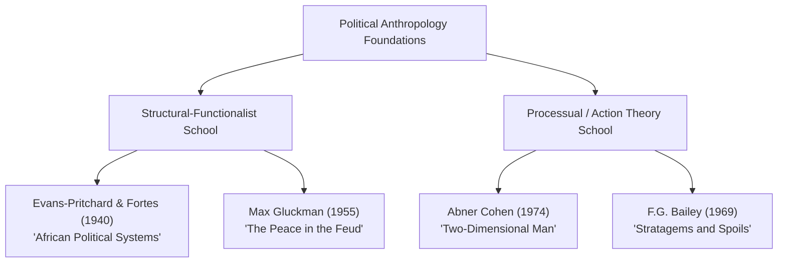

# VALUE ADD: Unit 4 - UNITS 2, 3, 4 & 5: SOCIO-CULTURAL ANTHROPOLOGY
**Date:** June 01, 2026 | **Target:** PAPER I — UNITS 2, 3, 4 & 5: SOCIO-CULTURAL ANTHROPOLOGY
**Syllabus Mapping:** Unit 4

# UNIT 4: POLITICAL ORGANIZATION & SOCIAL CONTROL
## HIGH-YIELD VALUE-ADDITION STUDY MATERIAL

---

## I. QUICK-REFERENCE REVISION MATRIX & CONCEPTUAL ANCHORS

To score highly in UPSC Anthropology, you must move beyond basic definitions. Use this matrix to compare political systems using precise anthropological terminology.

### 1. Typology of Political Systems (Service vs. Fried)

While **Elman Service** classified societies by *sociopolitical integration* (Band, Tribe, Chiefdom, State), **Morton Fried** (1967) classified them by *social stratification* (Egalitarian, Ranked, Stratified, State). Combining both in your answers demonstrates superior theoretical depth.

```
                  [ POLITICAL EVOLUTION SPECTRUM ]
                  
  Egalitarian          Ranked            Stratified            State
  (No wealth/power    (Prestige status   (Unequal access     (Institutionalized
   disparities)        but no wealth)     to resources)       coercive power)
       │                  │                  │                  │
  ┌────┴────┐        ┌────┴────┐        ┌────┴────┐        ┌────┴────┐
  │  BAND   │ ──────>│  TRIBE  │ ──────>│CHIEFDOM │ ──────>│  STATE  │
  └─────────┘        └─────────┘        └─────────┘        └─────────┘
  Informal           Big Man /          Hereditary         Bureaucracy /
  Leadership         Segmentary         Chief              Monopoly of Force
```

| Sociopolitical Type (Service) | Stratification Type (Fried) | Source of Authority | Conflict Resolution Mechanism | Key Ethnographic Example |
| :--- | :--- | :--- | :--- | :--- |
| **Band** | **Egalitarian** | Personal charisma, hunting skill, age wisdom. No coercive power. | Song duels, gossip, temporary fissioning, ostracism. | **Inuit** (Arctic), **!Kung San** (Kalahari), **Andamanese** (India). |
| **Tribe** | **Egalitarian / Ranked** | Kinship networks, sodalities, "Big Man" (*Tonowi*) reciprocity. | Oaths, ordeals, mediation by ritual specialists. | **Nuer** (South Sudan), **Kapauku** (New Guinea), **Nagas** (India). |
| **Chiefdom** | **Ranked** | Hereditary lineage seniority, divine right, redistributive control. | Chief's fiat, customary councils, formal mediation. | **Trobriand Islanders** (Malinowski), **Polynesian Chiefdoms**. |
| **State** | **Stratified** | Rational-legal bureaucracy, codified law, monopoly of physical force. | Formal judiciary, police, prisons, military enforcement. | **Ancient Kingdoms** (Egypt, Inca), **Modern Nation-States**. |

---

### 2. The Conceptual Triad: Power, Authority, and Legitimacy

Do not use these terms interchangeably. Use these precise definitions:

*   **Power:** The empirical ability of an individual or group to impose their will upon others, even in the face of resistance (**Max Weber**). It is often coercive and relies on physical or economic sanctions.
*   **Authority:** The socially recognized, institutionalized right to exercise power. It is power that has been moralized and accepted by the community.
*   **Legitimacy:** The collective belief that the person holding authority has the moral right to do so. It is the psychological foundation of authority.

$$\text{Power} + \text{Legitimacy} = \text{Authority}$$

---

## II. THINKER & THEORY MAPPING (THE INTELLECTUAL ARSENAL)

Incorporate these key political anthropologists and their classic works to elevate your answers:



| Anthropologist | Classic Work | Core Concept / Contribution | How to Use in UPSC Answers |
| :--- | :--- | :--- | :--- |
| **M. Fortes & E.E. Evans-Pritchard** | *African Political Systems* (1940) | Distinguished between **Group A** (societies with centralized authority, administrative machinery, and judicial institutions—e.g., Bemba, Zulu) and **Group B** (stateless, segmentary societies—e.g., Nuer, Tallensi). | Use as the foundational starting point for any question on the evolution of political systems. |
| **E. Adamson Hoebel** | *The Law of Primitive Man* (1954) | Defined law in simple societies: *"A social norm is legal if its neglect or infraction is regularly met, in threat or in fact, by the application of physical force by an individual or group possessing the socially recognized privilege of so acting."* | Cite this when defining "Law" vs. "Custom" in simple societies. |
| **Max Gluckman** | *The Peace in the Feud* (1955) | **"Cross-cutting alliances"**: Conflicts in one sphere (e.g., lineage) are mitigated by ties in another (e.g., marriage, ritual sodalities), preventing total societal collapse. | Use when explaining how stateless societies maintain stability without formal police. |
| **Paul Bohannan** | *Justice and Judgment among the Tiv* (1957) | **"Double Institutionalization"**: Law is a custom that has been selected and restated by a political institution to make it binding and enforceable. | Use to explain the transition from custom to formal law. |
| **F.G. Bailey** | *Stratagems and Spoils* (1969) | **Political Game Theory**: Politics is a competitive game with "normative rules" (publicly agreed-upon values) and "pragmatic rules" (under-the-table tactics used to win). | Excellent value-addition for questions on political processes and leadership dynamics in tribal councils. |
| **Abner Cohen** | *Two-Dimensional Man* (1974) | **Symbolic Action**: Political power requires symbolic reinforcement (rituals, myths, regalia) to maintain legitimacy. | Use to link Unit 4 (Political Organization) with Unit 5 (Religion/Rituals). |

---

## III. DEEP-DIVE CASE STUDIES & ETHNOGRAPHIC EVIDENCE

These highly specific case studies provide the "X-Factor" needed to secure top marks in the UPSC Mains.

### 1. Segmentary Lineage System & "Ordered Anarchy"
*   **Group:** The Nuer of South Sudan.
*   **Ethnographer:** E.E. Evans-Pritchard (*The Nuer*, 1940).
*   **Mechanism:** The Nuer are a stateless, egalitarian society with no centralized political office. Yet, they maintain social order through a segmentary lineage system based on structural distance.
*   **How it works:** Lineages are nested like Russian dolls (Minimal $\rightarrow$ Minor $\rightarrow$ Major $\rightarrow$ Maximal). If a member of Minimal Lineage $A1$ fights a member of $A2$, the conflict remains local. However, if a member of $A1$ fights a member of Lineage $B$, then $A1$ and $A2$ unite as Lineage $A$ to fight Lineage $B$.
*   **UPSC Value-Add Quote:** Evans-Pritchard described this as **"ordered anarchy"**—a state of balanced opposition where conflict is structurally limited because the size of the opposing groups scales dynamically with the conflict.

```
                     [ Maximal Lineage X ]
                              │
              ┌───────────────┴───────────────┐
      [ Major Lineage A ]             [ Major Lineage B ]
              │                               │
       ┌──────┴──────┐                 ┌──────┴──────┐
  [Minor A1]    [Minor A2]        [Minor B1]    [Minor B2]
  
  *Rule of Structural Opposition:* If Minor B1 attacks Minor A1, 
   Minor A2 immediately allies with A1. They unite as Major Lineage A 
   to confront Major Lineage B.
```

---

### 2. The Leopard-Skin Chief: Ritual Mediation without Coercive Power
*   **Group:** The Nuer of South Sudan.
*   **Mechanism:** When a homicide occurs, a blood feud (*ter*) threatens to tear the segmentary society apart. The killer flees to the house of the **Leopard-Skin Chief** (*Gat Ter*), which is a sacred sanctuary.
*   **The Process:** The Leopard-Skin Chief has no military or judicial power to enforce a verdict. Instead, he acts as a ritual mediator. He negotiates with the victim's family to accept blood wealth (usually paid in cattle, *kut*) instead of seeking a retaliatory killing.
*   **The Leverage:** If the victim's family refuses to compromise, the Chief threatens to curse them. The fear of this supernatural sanction forces them to accept the settlement.
*   **Key Takeaway:** This demonstrates how **ritual authority** substitutes for **coercive power** in stateless societies to prevent endless cycles of violence.

---

### 3. The Kapauku "Tonowi" (Big Man): Achieved Political Leadership
*   **Group:** Kapauku Papuans of West New Guinea.
*   **Ethnographer:** Leopold Pospisil (*Anthropology of Law*, 1971).
*   **Mechanism:** The Kapauku are egalitarian but recognize a leader called the **Tonowi** ("Big Man").
*   **How status is achieved:** Unlike a hereditary chief, a Tonowi must earn his position through:
    1.  *Wealth:* Accumulating pigs and cowrie shell money.
    2.  *Generosity:* Lending pigs to young men to help them pay bride prices.
    3.  *Eloquence & Physical Prowess:* The ability to persuade others during disputes and lead in battle.
*   **Social Control:** If a Tonowi becomes greedy or dictatorial, the community withdraws its support, refuses to pay back loans, or may even execute him.
*   **Key Takeaway:** This is a classic example of **achieved status** and **non-institutionalized authority** where power is continuously negotiated through reciprocity.

---

### 4. Inuit Song Duels: Non-Violent Conflict Resolution
*   **Group:** The Central Inuit (Arctic).
*   **Mechanism:** In a harsh environment where physical violence could threaten the survival of the entire band, disputes (often over women or theft) are resolved through **Song Duels** (*nith-songs*).
*   **The Process:** The disputants meet in a public gathering. They take turns singing humorous, insulting, and satirical songs about each other, accompanied by a frame drum. The accused must stand quietly while the opponent sings.
*   **The Verdict:** The audience's laughter and applause determine the winner. Once the duel ends, the dispute is considered settled, and no further grudges are permitted.
*   **Key Takeaway:** This highlights how **public opinion** and **ridicule** serve as powerful, non-lethal mechanisms of social control.

---

### 5. The Cheyenne "Trouble-Cases" and Customary Law
*   **Group:** Cheyenne Native Americans.
*   **Ethnographers:** Karl Llewellyn & E. Adamson Hoebel (*The Cheyenne Way*, 1941).
*   **Mechanism:** The authors pioneered the **"trouble-case method"** in legal anthropology. Instead of asking informants about abstract rules, they studied actual disputes (trouble-cases) to see how norms were applied and modified in practice.
*   **Example:** When a Cheyenne warrior stole another's wife, the military sodalities (soldier societies) intervened not to punish, but to restore tribal harmony by negotiating a gift exchange to compensate the aggrieved husband.
*   **Key Takeaway:** Customary law is not static; it is dynamically created, negotiated, and adapted through the resolution of concrete social conflicts.

---

## IV. ELEGANT DIAGRAMS & STRUCTURAL SCHEMATICS

Use these visual models to make your answers stand out.

### 1. The Spectrum of Social Control

This diagram illustrates how mechanisms of social control shift from informal/internalized to formal/coercive as societies grow in scale and complexity.

```
[ INCREASING SOCIOPOLITICAL COMPLEXITY ] ───────────────────────────────>

  BAND                     TRIBE                    CHIEFDOM & STATE
  ┌──────────────────────┐ ┌──────────────────────┐ ┌──────────────────────┐
  │ INTERNALIZED CONTROL │ │ DIFFUSE CONTROL      │ │ COERCIVE CONTROL     │
  ├──────────────────────┤ ├──────────────────────┤ ├──────────────────────┤
  │ * Belief in Taboos   │ │ * Gossip & Ridicule  │ │ * Codified Law       │
  │ * Ancestral Fear     │ │ * Oaths & Ordeals    │ │ * Police & Military  │
  │ * Guilt / Conscience │ │ * Mediator Mediation │ │ * Prisons / Courts   │
  └──────────────────────┘ └──────────────────────┘ └──────────────────────┘
  
<─────────────────────────────── [ DEGREE OF KINSHIP INTEGRATION ]
```

---

### 2. The Triad of Conflict Resolution

This model shows the three pathways of dispute resolution in human societies, categorized by the involvement of third parties.

```
                  [ DISPUTE RESOLUTION ]
                            │
         ┌──────────────────┼──────────────────┐
         ▼                  ▼                  ▼
   [ DYADIC ]          [ TRIADIC ]        [ COERCIVE ]
   Negotiation         Mediation          Adjudication
         │                  │                  │
   Two parties         Neutral third      Third party 
   resolve dispute     party facilitates  imposes a binding,
   directly (e.g.,     compromise (e.g.,  enforceable decision
   Inuit Song Duel).   Leopard-Skin).     (e.g., State Court).
```

---

## V. UPSC MAINS EDGE: CONTEMPORARY RELEVANCE & POLICY APPLICATIONS

To secure maximum marks in Paper I, Unit 4, you must connect these classical anthropological concepts to contemporary issues, particularly in the Indian context.

### 1. PESA Act (1996) and Traditional Political Authority
*   **The Concept:** The **Provisions of the Panchayats (Extension to the Scheduled Areas) Act, 1996** is a direct legislative application of political anthropology.
*   **Anthropological Link:** PESA recognizes the traditional **Gram Sabha** (village assembly) as the legitimate authority to safeguard and preserve the traditions, customs, and cultural identity of tribal communities.
*   **Value-Add:** It shifts tribal governance from a top-down, rational-legal state model to a decentralized, consensus-based model that aligns with traditional tribal political structures (e.g., the *Manki-Munda* system of the Hos or the *Parha Panchayat* of the Oraons).

---

### 2. Article 371 and the Protection of Customary Law
*   **The Concept:** The Indian Constitution recognizes that imposing a uniform, state-codified legal system on simple societies can cause social disruption.
*   **Anthropological Link:** **Articles 371A (Nagaland)** and **371G (Mizoram)** state that no Act of Parliament regarding tribal customary laws, social practices, or administration of civil and criminal justice shall apply to these states unless their Legislative Assemblies so decide.
*   **Value-Add:** This is a constitutional acknowledgment of **legal pluralism**—the co-existence of multiple legal systems (customary and state) within a single political framework.

---

### 3. Restorative Justice vs. Retributive Justice
*   **The Concept:** Modern judicial systems are primarily **retributive** (focusing on punishing the offender to uphold state law). In contrast, simple societies practice **restorative justice** (focusing on repairing the social rupture and compensating the victim to restore community harmony).
*   **Anthropological Link:** The use of tribal councils (*Panchayats*) to resolve disputes through consensus, compensation (e.g., fines paid to the victim's family), and ritual reconciliation feasts.
*   **Policy Application:** Modern alternative dispute resolution (ADR) mechanisms, Lok Adalats, and family courts in India are increasingly adopting these restorative, mediation-based principles from traditional societies to reduce the backlog of cases in formal courts.

---

## VI. KEYWORDS FOR RAPID REVISION

Sprinkle these terms throughout your answers to demonstrate a strong command of the subject:

*   **Ordered Anarchy:** Stateless society maintained in equilibrium through balanced opposition (Evans-Pritchard).
*   **Segmentary Opposition:** The state of structural tension where related lineages unite against more distant lineages, then split back into autonomous units when the threat passes.
*   **Double Institutionalization:** The process by which a social custom is selected and restated by a political body to become a formal law (Bohannan).
*   **Legal Pluralism:** The simultaneous existence of two or more legal systems (e.g., state law and tribal customary law) within the same social space.
*   **Sodality:** A non-kinship-based association (e.g., age-grades, warrior societies, secret societies) that links different clans together, serving a political function in tribal societies.
*   **Total Prestation:** A system of exchange that is not merely economic, but also political, religious, and social, binding groups together (Marcel Mauss).
*   **Trouble-Case Method:** An anthropological approach that studies actual disputes and their resolutions to understand how customary law functions in practice (Llewellyn & Hoebel).