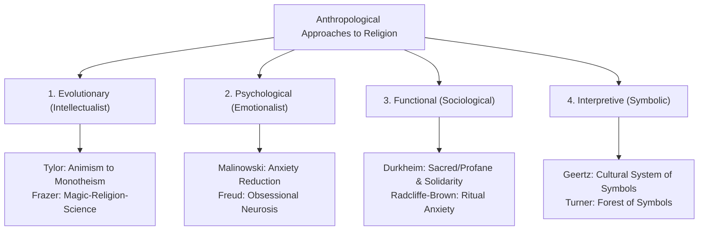
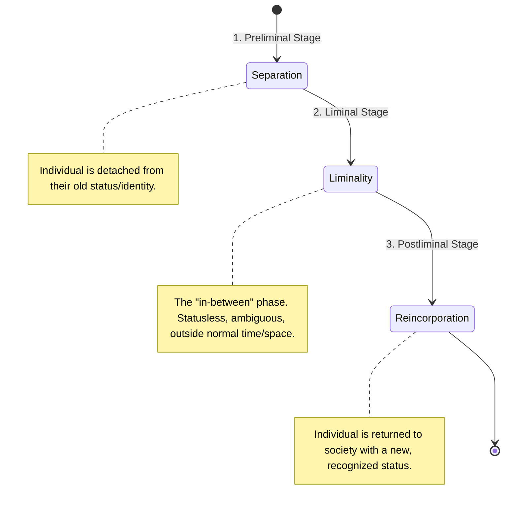
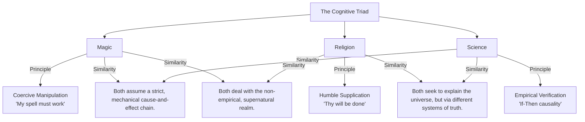

# VALUE ADD: Unit 5 - UNITS 2, 3, 4 & 5: SOCIO-CULTURAL ANTHROPOLOGY
**Date:** June 04, 2026 | **Target:** PAPER I — UNITS 2, 3, 4 & 5: SOCIO-CULTURAL ANTHROPOLOGY
**Syllabus Mapping:** Unit 5

# UNIT 5: ANTHROPOLOGY OF RELIGION

---

## I. SYLLABUS MAPPING & QUICK-REFERENCE MATRIX

```
Paper I, Unit 5: Religion — Anthropological approaches to the study of religion (evolutionary, psychological and functional); monotheism and polytheism; sacred and profane; myths and rituals; forms of religion in tribal and peasant societies (animism, animatism, fetishism, naturism and totemism); religion, magic and science distinguished; magico-religious functionaries (priest, shaman, medicine man, sorcerer and witch).
```

| Syllabus Sub-Topic | Key Thinkers | Core Concepts & Models | High-Yield Keywords |
| :--- | :--- | :--- | :--- |
| **Approaches to Religion** | E.B. Tylor, R.R. Marett, É. Durkheim, B. Malinowski, C. Geertz | Intellectualist, Functionalist, Psychological, Interpretive | Collective Effervescence, System of Symbols, Anxiety-Reduction, Anima, Mana |
| **Sacred & Profane, Myths & Rituals** | É. Durkheim, V. Turner, C. Lévi-Strauss, E. Leach | Binary opposition, Liminality, Communitas, Structural analysis of myth | Multivocality, Anti-structure, Mythemes, Rites of Passage |
| **Forms of Tribal Religion** | E.B. Tylor, R.R. Marett, Max Müller, É. Durkheim | Animism, Animatism, Naturism, Totemism, Fetishism | Bongaism, Manaism, Totemic Emblem, Personification of Nature |
| **Magic, Religion & Science** | J.G. Frazer, B. Malinowski, E.E. Evans-Pritchard, S. Tambiah | Sympathetic Magic, Trobriand Lagoon vs. Open Sea, Azande Granary | Imitative vs. Contagious Magic, Pseudo-science, Secondary Rationalization |
| **Magico-Religious Functionaries** | E.E. Evans-Pritchard, I.M. Lewis, Victor Turner | Shamanic Trance, Innate vs. Acquired power, Institutional vs. Charismatic | Altered States of Consciousness (ASC), Psychopomp, Mangu, Sorcery |

---

## II. EPISTEMOLOGICAL APPROACHES TO THE STUDY OF RELIGION



### 1. The Evolutionary (Intellectualist) Approach
This approach views religion as an early cognitive or intellectual attempt by primitive humans to make sense of inexplicable physical phenomena (dreams, death, shadows, echoes).

* **Edward Burnett Tylor (*Primitive Culture*, 1871):**
  * **Core Thesis:** The basic element of religion is **Animism**—the belief in spiritual beings.
  * **Cognitive Origin:** Primitive humans observed two sets of biological phenomena: the difference between a living body and a dead corpse, and the experiences of dreams and visions. To explain these, they postulated the existence of a dual entity: the **soul** (*anima*).
  * **Evolutionary Trajectory:** Animism (souls in all things) $\rightarrow$ Polytheism (pantheon of specialized nature deities) $\rightarrow$ Monotheism (one supreme, omnipotent God).
* **Robert Ranulph Marett (*The Threshold of Religion*, 1909):**
  * **Core Thesis:** Tylor’s animism was too intellectualized. Before humans conceptualized distinct, personalized souls, they experienced a vague, emotional feeling of awe, fear, and wonder toward an impersonal, supernatural power.
  * **Pre-Animistic Stage:** **Animatism** (or *Manaism*).
* **James George Frazer (*The Golden Bough*, 1890):**
  * **Core Thesis:** Human cognitive evolution progressed through three distinct stages: **Magic** (coercive, flawed cause-and-effect) $\rightarrow$ **Religion** (supplication to superior, conscious deities) $\rightarrow$ **Science** (empirical, verifiable cause-and-effect).
* **Critical Evaluation:**
  * *Merit:* Established religion as a legitimate subject of scientific, evolutionary inquiry.
  * *Demerit:* Highly speculative, ethnocentric, and armchair-based. It assumed a unilinear progress of human intellect and failed to explain why highly rational, modern humans continue to practice religion.

### 2. The Psychological (Emotionalist) Approach
This approach shifts the focus from cognitive explanation to emotional coping mechanisms, arguing that religion exists to reduce anxiety, provide comfort, and manage psychological crises.

* **Bronislaw Malinowski (*Magic, Science and Religion*, 1925):**
  * **Core Thesis:** Religion and magic are functional responses to psychological stress and existential anxiety.
  * **The Trobriand Case Study:** Malinowski observed that when Trobriand Islanders fished in the safe, predictable inner lagoon, they relied solely on empirical knowledge (science). However, when venturing into the hazardous, unpredictable open sea, they performed elaborate magical rituals.
  * **Functional Distinction:** Magic provides individuals with a sense of control over unpredictable outcomes, reducing acute anxiety. Religion, on the other hand, addresses major life crises (especially death) by offering comforting dogmas of immortality, preventing social disruption.
* **Sigmund Freud (*The Future of an Illusion*, 1927):**
  * **Core Thesis:** Religion is a collective "obsessional neurosis" arising from the unresolved Oedipus complex. God is a psychological projection of the protective yet feared biological father, created to cope with feelings of helplessness in the face of nature.
* **Critical Evaluation:**
  * *Merit:* Grounded in empirical fieldwork (Malinowski) and clinical observation (Freud).
  * *Demerit:* Reduces complex, multi-dimensional social institutions to mere individual psychological states.

### 3. The Functional (Sociological) Approach
This approach argues that religion is not about individual minds or emotions, but about social cohesion, structural continuity, and the preservation of the collective order.

* **Émile Durkheim (*The Elementary Forms of Religious Life*, 1912):**
  * **Core Thesis:** *"Religion is a unified system of beliefs and practices relative to sacred things... which unite into one single moral community called a Church, all those who adhere to them."*
  * **The Arunta Totemism Study:** Studying Australian Aborigines, Durkheim argued that when the clan worships its totem, it is symbolically worshiping itself. The totem represents the **Collective Conscience**—the shared values and moral force of society.
  * **Mechanism:** Rituals generate **Collective Effervescence**—a high-energy, emotional state where individual identities merge into the group, reinforcing social solidarity and moral obligations.
* **Alfred Reginald Radcliffe-Brown (*The Andaman Islanders*, 1922):**
  * **Core Thesis:** Structural-functionalist view. Rituals function to maintain the structural continuity of society by instilling and reinforcing "social value" and collective sentiments in individual minds.
  * **Radcliffe-Brown vs. Malinowski Debate:** While Malinowski argued that anxiety triggers rituals, Radcliffe-Brown countered that *rituals themselves often create anxiety* (e.g., initiation taboos) to make individuals realize their dependence on the social group.
* **Critical Evaluation:**
  * *Merit:* Explains how religion functions as a powerful mechanism of social control and integration.
  * *Demerit:* Overly consensual; it ignores the dysfunctional, divisive, and destructive aspects of religion (e.g., communal conflicts, religious wars).

### 4. The Interpretive (Symbolic) Approach
This approach views religion as a system of meaning through which humans interpret their lives and guide their actions.

* **Clifford Geertz (*The Interpretation of Cultures*, 1973):**
  * **Core Thesis:** Religion is:
    > *"(1) a system of symbols which acts to (2) establish powerful, pervasive, and long-lasting moods and motivations in men by (3) formulating conceptions of a general order of existence and (4) clothing these conceptions with such an aura of factuality that (5) the moods and motivations seem uniquely realistic."*
  * **Mechanism:** Religion provides both a **"model of"** reality (explaining how the world is structured) and a **"model for"** reality (guiding how humans should act within that structure), bridging the gap between metaphysical ideas and ethical behavior.

---

## III. SACRED & PROFANE, MYTHS & RITUALS

### 1. The Sacred and the Profane (Durkheim's Binary)
Durkheim argued that all religious beliefs divide the universe into two radically opposed, mutually exclusive domains:

```
                  THE UNIVERSE OF HUMAN EXPERIENCE
                                 │
         ┌───────────────────────┴───────────────────────┐
         ▼                                               ▼
   THE SACRED                                      THE PROFANE
   - Extraordinary, powerful, forbidden.           - Ordinary, mundane, practical.
   - Demands reverence, awe, and ritual.           - Involves daily work and utility.
   - Protected by strict taboos.                   - Free from ritual restrictions.
   - Represents the Collective/Society.            - Represents the Individual.
```

* **Dynamic of Separation:** The sacred and profane must never come into direct, unregulated contact. **Rituals** act as the formal, regulated bridges or barriers that allow humans to transition safely from the profane to the sacred world (and back) without causing spiritual danger.

### 2. Myths: Structural and Functional Perspectives
Myths are sacred narratives that explain the origin of the world, humanity, and social institutions.

* **Malinowski's Functionalist View (Myth as a "Social Charter"):**
  * Myths are not idle stories or primitive science. They function as a **pragmatic charter** for social institutions, justifying and validating existing social hierarchies, land rights, marriage rules, and moral codes.
  * *Example:* The origin myths of clans justify why certain clans hold political leadership or priestly offices.
* **Claude Lévi-Strauss's Structuralist View (Myth as a Cognitive Tool):**
  * Myths are structured like language. The mind works through **binary oppositions** (e.g., Life/Death, Culture/Nature, Raw/Cooked).
  * Myths function to resolve or mediate these deep, irreconcilable logical contradictions.
  * **Mythemes:** The minimal structural units of a myth, which gain meaning only when arranged in relation to one another.

### 3. Rituals: The Dynamics of Passage and Liminality
Rituals are highly structured, repetitive, symbolic actions performed in sacred contexts.

* **Arnold van Gennep (*The Rites of Passage*, 1909):**
  * Identified a universal three-stage structure in rituals that transition individuals from one social status to another (e.g., birth, puberty, marriage, death):



* **Victor Turner (*The Ritual Process*, 1969):**
  * Deepened the analysis of the **Liminal Phase** ("betwixt and between").
  * **Communitas:** During the liminal phase, normal social hierarchies, ranks, and roles are temporarily suspended. Initiates experience an intense, egalitarian feeling of absolute social bonding, oneness, and comradeship.
  * **Multivocality of Symbols:** Ritual symbols are "multivocal"—they pack multiple, complex meanings into a single physical object or act (e.g., the *Mudyi* tree among the Ndembu of Zambia represents mother's milk, matrilineal descent, and tribal learning).

---

## IV. FORMS OF RELIGION IN TRIBAL & PEASANT SOCIETIES

### 1. Animism
* **Definition:** The belief in spiritual beings, souls, or ghosts (*anima*) that inhabit both animate and inanimate entities.
* **Key Thinker:** E.B. Tylor.
* **Mechanism:** The soul is conceived as a thin, unsubstantial image, capable of leaving the body during dreams, illness, or trance, and permanently departing at death.
* **Ethnographic Case Study:** The **Yanomami** of the Amazon believe in *hekura*—tiny, personal nature spirits that inhabit rocks and trees. Shamans ingest hallucinogenic *yopo* snuff to communicate with and control these spirits for healing or warfare.

### 2. Animatism
* **Definition:** The belief in a generalized, impersonal, non-anthropomorphic supernatural force that pervades the universe, lacking a distinct personality or physical form.
* **Key Thinker:** R.R. Marett.
* **Key Concepts:**
  * ***Mana* (Polynesia):** An invisible, active force that can reside in people, animals, or objects, bringing success, strength, or danger. A successful chief has high *mana*; a failed crop indicates a loss of *mana*.
  * ***Bonga* (Santhal & Ho of India):** A similar impersonal, mysterious power that animates the forest, hills, and rivers, requiring ritual pacification.
* **Mana vs. Animism:** Animism involves distinct, personal spirits with wills of their own; Animatism involves a fluid, impersonal force akin to electricity.

### 3. Totemism
* **Definition:** A system of belief and ritual practice based on a sacred, mystical relationship between a social group (clan) and a specific natural species (animal, plant, or natural phenomenon).
* **Key Thinkers:** Émile Durkheim, Claude Lévi-Strauss.
* **Key Features:**
  * **Totemic Emblem:** The species is represented on clan property (e.g., totem poles).
  * **Exogamy:** Members of the same totem are considered siblings; marriage between them is strictly forbidden.
  * **Taboo:** Members are prohibited from killing, eating, or harming their totemic animal, except during highly regulated, collective ritual feasts.
* **Lévi-Strauss's Reinterpretation (*Totemism*, 1962):** Totemism is not a primitive stage of religion, but a cognitive classification system. Natural species are chosen as totems not because they are "good to eat," but because they are **"good to think"**—providing a logical framework to conceptualize social differences.

### 4. Fetishism
* **Definition:** The worship of, or belief in, specific man-made or natural physical objects (fetishes, charms, amulets) that are believed to possess inherent, active supernatural powers to protect, heal, or bring luck.
* **Origin:** Derived from the Portuguese word *feitiço* (meaning "charm" or "sorcery"), used by early explorers to describe West African religious objects.
* **Mechanism:** Unlike a totem (which represents a whole group), a fetish is typically owned by an individual and acts as a direct, instrumental tool of power.
* **Ethnographic Case Study:** The **Zuni of New Mexico** carve small stone fetishes of predatory animals (bears, mountain lions) to gain hunting power and protection.

### 5. Naturism
* **Definition:** The direct worship of personified natural forces, celestial bodies, and meteorological phenomena (the Sun, Moon, Wind, Rain, Thunder) as active, conscious deities.
* **Key Thinker:** Max Müller (Philological approach).
* **Mechanism:** Early humans, overwhelmed by the power and beauty of nature, used metaphorical language to describe these forces, eventually mistaking the metaphors for real, personified deities (a "disease of language").
* **Peasant Society Example:** The worship of **Surya** (Sun God), **Indra** (Rain/Thunder God), and **Dharti Mata** (Mother Earth) in rural Indian agricultural communities.

---

## V. THE MAGIC-RELIGION-SCIENCE TRIAD

The boundaries and structural relationships between Magic, Religion, and Science form a classic debate in anthropological theory.



### 1. Detailed Comparative Analysis

| Feature | Magic | Religion | Science |
| :--- | :--- | :--- | :--- |
| **Core Principle** | **Coercive Control:** Direct manipulation of supernatural forces using precise formulas. | **Appeasement:** Humble supplication, prayer, and sacrifice to conscious deities. | **Natural Laws:** Empirical observation, experimentation, and logical deduction. |
| **Human Attitude** | Dominant, commanding, and instrumental. | Submissive, worshipful, and moral. | Objective, analytical, and value-neutral. |
| **Causality Model** | Mechanical: If the spell is cast correctly, the result *must* follow. | Personal: Deities have free will and can choose to grant or deny requests. | Natural: Verifiable physical laws govern cause and effect. |
| **Social Context** | Often individual, private, and utilitarian. | Collective, public, and congregational. | Public, collaborative, and universally verifiable. |
| **Key Thinker** | James Frazer (*"Pseudo-science"*). | Émile Durkheim (*"Collective Conscience"*). | Karl Popper (*"Falsifiability"*). |

### 2. Frazer's Classification of Magic (Sympathetic Magic)
Frazer argued that magic is based on the **Law of Sympathy**—the assumption that things act on one another at a distance through a secret, invisible connection. He divided this into two types:

```
                               SYMPATHETIC MAGIC
                                       │
         ┌─────────────────────────────┴─────────────────────────────┐
         ▼                                                           ▼
  HOMEOPATHIC / IMITATIVE MAGIC                              CONTAGIOUS MAGIC
  - Principle: "Like produces like."                         - Principle: "Once in contact, always in contact."
  - Mechanism: An action performed on an image               - Mechanism: An action performed on a severed part 
    or model mimics the desired real-world effect.             of a person (hair, nails, clothing) affects them.
  - Example: Sticking pins into a voodoo doll;               - Example: Burning an enemy's hair clippings to 
    pouring water through a sieve to induce rain.              cause them to fall ill.
```

### 3. Evans-Pritchard's Contribution: The Logic of Magic
In his classic ethnography, *Witchcraft, Oracles and Magic among the Azande* (1937), E.E. Evans-Pritchard revolutionized the study of magic by demonstrating that it is a highly logical, rational system of thought when analyzed within its own cultural context.

* **The Collapsing Granary Case Study:**
  * The Azande knew that termites eat away at the wooden supports of granaries, causing them to collapse. They also knew that people sit under granaries to escape the heat.
  * However, when a specific granary collapsed on a specific person at a specific moment, the Azande asked: *Why did this granary collapse on this particular person at this exact time?*
  * **The Explanation:** Science (termite damage) explains *how* the granary collapsed. Magic/Witchcraft explains *why* the two independent chains of events (the termite damage and the person sitting underneath) intersected at that precise moment.
  * **Conclusion:** Magic does not contradict empirical knowledge; it fills the explanatory gaps that science cannot address, providing a moral and logical explanation for misfortune.

---

## VI. MAGICO-RELIGIOUS FUNCTIONARIES

Magico-religious functionaries are the specialized intermediaries who bridge the gap between the human world and the supernatural realm.

```mermaid
grid-layout
  [Priest]
  - Full-time, institutional office.
  - Formal training & hierarchy.
  - Performs collective, scheduled rituals.
  - Represents the community to the gods.
  
  [Shaman]
  - Part-time, charismatic calling.
  - Personal crisis/trance (ASC).
  - Performs individual, crisis-driven healing.
  - Journeys to the spirit world directly.
  
  [Medicine Man]
  - Part-time, herbal & magical healer.
  - Uses physical remedies + spells.
  - Focuses on physical/spiritual health.
  - Acquired through apprenticeship.
  
  [Sorcerer vs. Witch]
  - Sorcerer: Acquired skill, uses physical tools/spells, conscious harm.
  - Witch: Innate psychic power, no tools/spells needed, unconscious/innate harm.
```

### 1. Structural Comparison of Functionaries

| Dimension | Priest | Shaman | Medicine Man | Sorcerer | Witch |
| :--- | :--- | :--- | :--- | :--- | :--- |
| **Source of Power** | **Institutional:** Derived from a formal office, sacred texts, and tradition. | **Charismatic:** Derived from direct, personal contact with spirits. | **Empirical & Magical:** Derived from knowledge of herbs and spells. | **Acquired:** Derived from learned formulas, spells, and physical ingredients. | **Innate:** Derived from an internal, physical, or psychic substance. |
| **Training** | Long, formal apprenticeship and ordination. | Intense personal crisis, illness, and spiritual initiation. | Apprenticeship in ethnobotany and ritual. | Learned through study or purchased secrets. | None; inherited or born with the capacity. |
| **Ritual Context** | Scheduled, collective, and congregational. | Non-scheduled, individual, and crisis-oriented. | Crisis-oriented, individual healing. | Secret, private, and instrumental. | Unconscious, involuntary, and psychic. |
| **Social Status** | Highly respected, high-status, integrated into the state/chiefdom. | Respected yet feared; occupies a marginal or liminal status. | Respected community healer. | Feared, socially condemned, and marginalized. | Deeply feared, hated, and subject to execution/ostracism. |

### 2. Deep Dive: Shamanism and Altered States of Consciousness (ASC)
* **Etymology:** The term *shaman* originates from the Evenki (Tungus) word *šamán* of Siberia, meaning "one who knows."
* **The Shamanic Journey:** The defining characteristic of a shaman is the ability to enter an **Altered State of Consciousness (ASC)**—often referred to as a trance—induced by rhythmic drumming, chanting, fasting, sensory deprivation, or hallucinogenic substances (e.g., Ayahuasca in the Amazon).
* **Psychopomp:** In this trance state, the shaman's soul is believed to leave the body and travel to the upper or lower spirit worlds to negotiate with spirits, retrieve lost souls, or diagnose illnesses.

### 3. Evans-Pritchard on Sorcery vs. Witchcraft (The Azande Model)
Evans-Pritchard established a crucial analytical distinction between sorcery and witchcraft, which is now standard in anthropology:

* **Witchcraft (*Mangu*):**
  * The Azande believe witchcraft is an **innate, physical substance** located inside the body (often near the liver).
  * A witch does not use spells, perform rituals, or burn magic powder. They simply wish harm upon someone, and the *mangu* soul leaves their body at night to consume the spiritual essence of the victim's organs.
  * It can be unconscious; a person might not even know they are a witch until identified by an oracle.
* **Sorcery:**
  * Sorcery is a **learned, conscious skill**.
  * A sorcerer must actively acquire magical knowledge, use physical ingredients (hair, nails, graveyard dirt), and perform specific destructive rituals to harm their target.

---

## VII. PREMIUM UPSC VALUE-ADDITION & CASE STUDY BANK

### 1. Indian Tribal Case Studies: Magico-Religious Systems

#### A. Bongaism among the Santhals and Hos (Jharkhand/Odisha)
* **Concept:** The Santhals and Hos believe in an all-pervading, impersonal supernatural power called **Bonga**.
* **Mechanism:** *Bonga* is not a single deity, but a mysterious force that animates the entire natural environment. If a tree is cut down without proper ritual pacification, the *Bonga* of that tree is angered, leading to illness, crop failure, or tiger attacks.
* **Functionary:** The **Naike** (Santhal priest) performs collective sacrifices in the sacred grove (**Jaherthan**) to keep the *Bonga* forces balanced and benevolent.

#### B. The Toda Dairy Cult (Nilgiri Hills, Tamil Nadu)
* **Concept:** The Toda of the Nilgiris practice a highly specialized form of pastoral religion centered entirely on their sacred water buffaloes.
* **Mechanism:** The Toda dairy temple is a sacred space where the processing of milk is treated as a high-level religious ritual. The milkman is not a mere laborer, but a consecrated **priest (Palol)** who must follow strict purity and avoidance taboos.
* **Significance:** This is a classic example of how a group's primary economic subsistence strategy (pastoralism) is completely sacralized and embedded within its religious structure.

### 2. Contemporary Issues: Witch-Hunting in India (A Sociological Analysis)
* **The Phenomenon:** Despite modern laws, witch-hunting (targeting women as *Daayans* or *Tonahis*) persists in tribal pockets of Jharkhand, Odisha, Chhattisgarh, and Assam.
* **Anthropological Analysis (Govind Kelkar & Dev Nathan):**
  * Witch-hunting is rarely about pure religious belief. It is an **instrumental, economic, and patriarchal tool** disguised as supernatural fear.
  * **Target Profile:** Victims are predominantly poor, low-caste, widowed, or single women who have inherited land or property.
  * **The Mechanism:** When a crop fails or a child falls ill, local male elites or magico-religious functionaries (like the *Ojha* or *Bhagat*) identify these vulnerable women as "witches." This allows the community to seize their land, banish them, or execute them, thereby preserving patriarchal control over resources.
* **Legislative Action:** State laws like the *Jharkhand Anti-Witchcraft Act (2001)* and the *Chhattisgarh Tonahi Pratadna Nivaran Act (2005)* attempt to criminalize this practice, but anthropologists emphasize that legal measures must be accompanied by land-rights protection and scientific education.

### 3. Sacred Groves (Sarnas/Jaherthans) as Traditional Ecological Knowledge (TEK)
* **Concept:** Tribal communities across India preserve patches of pristine forest as **Sacred Groves** (known as *Sarna* in Jharkhand, *Devrai* in Maharashtra, and *Kavu* in Kerala).
* **Mechanism:** These groves are believed to be the dwelling places of ancestral spirits and nature deities. Cutting down trees, hunting animals, or gathering wood within the grove is strictly taboo.
* **Value Addition:** Anthropologists highlight these groves as highly effective, indigenous systems of biodiversity conservation. They protect rare flora and fauna, preserve local water tables, and serve as living proof that tribal religion is deeply integrated with ecological sustainability.

---

## VIII. THINKER REFERENCE DIRECTORY

Use this directory to quickly reference key thinkers, their classic texts, and their core contributions to Unit 5 in your exam answers.

| Thinker | Key Text | Core Contribution | High-Yield Quote / Concept |
| :--- | :--- | :--- | :--- |
| **Edward Burnett Tylor** | *Primitive Culture* (1871) | Formulated the first anthropological definition of religion; proposed Animism as the earliest stage. | *"Religion is the belief in Spiritual Beings."* |
| **Robert Ranulph Marett** | *The Threshold of Religion* (1909) | Critiqued Tylor's intellectualism; proposed Animatism (Manaism) as a pre-animistic stage. | *Pre-animistic religion is felt, not thought; it is a response to the awe-inspiring.* |
| **James George Frazer** | *The Golden Bough* (1890) | Classified magic into Homeopathic and Contagious; proposed the Magic-Religion-Science evolutionary triad. | *Magic is the "bastard sister of science" (a pseudo-science).* |
| **Émile Durkheim** | *The Elementary Forms of Religious Life* (1912) | Defined the Sacred and Profane; analyzed Australian Totemism as the worship of society itself. | *“If religion has given birth to all that is essential in society, it is because the idea of society is the soul of religion.”* |
| **Bronislaw Malinowski** | *Magic, Science and Religion* (1925) | Demonstrated the psychological function of magic and religion in reducing anxiety during high-risk activities. | *Magic step in where science and empirical knowledge fail.* |
| **E.E. Evans-Pritchard** | *Witchcraft, Oracles and Magic among the Azande* (1937) | Proved the internal logic of magic; distinguished between innate witchcraft (*mangu*) and acquired sorcery. | *Witchcraft explains the "coincidence of two independent chains of events."* |
| **Victor Turner** | *The Ritual Process* (1969) | Developed the concepts of Liminality, Communitas, and the multivocality of ritual symbols. | *Liminality is the "betwixt and between" phase of social transition.* |
| **Clifford Geertz** | *The Interpretation of Cultures* (1973) | Formulated the symbolic/interpretive approach, viewing religion as a cultural system of meaning. | *Religion provides both a "model of" and a "model for" reality.* |