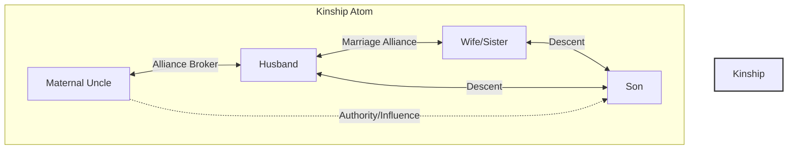
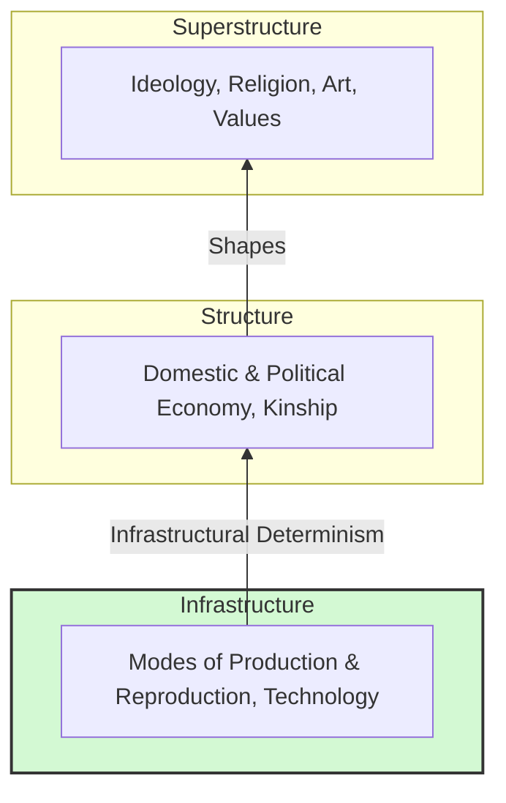
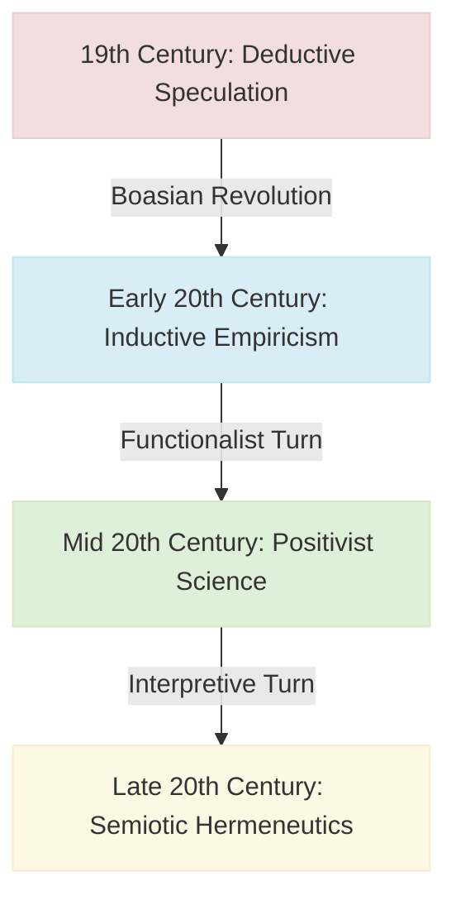

# VALUE ADD: Unit 6 - UNIT 6: ANTHROPOLOGICAL THEORIES
**Date:** June 01, 2026 | **Target:** PAPER I — UNIT 6: ANTHROPOLOGICAL THEORIES
**Syllabus Mapping:** Unit 6

# PAPER I — UNIT 6: ANTHROPOLOGICAL THEORIES
## HIGH-YIELD REVISION & VALUE-ADDITION SHEET

---

## SECTION 1: THE MASTER THINKER-LITERATURE DIRECTORY

This directory serves as a high-density reference for answer writing. Memorizing these exact years, titles, and core concepts allows you to write authoritative introductions and arguments.

| Theoretical School | Key Thinker | Landmark Literature | Year | Core Conceptual Contribution |
| :--- | :--- | :--- | :--- | :--- |
| **Classical Evolutionism** | E.B. Tylor | *Primitive Culture* | 1871 | Definition of Culture; Animism; Method of Survivals. |
| | L.H. Morgan | *Ancient Society* | 1877 | Unilinear technological stages; Classificatory vs. Descriptive kinship; *Societas* to *Civitas*. |
| | J.G. Frazer | *The Golden Bough* | 1890 | Intellectual triad: Magic $\rightarrow$ Religion $\rightarrow$ Science; Sympathetic Magic. |
| **Diffusionism** | G. Elliot Smith | *The Migrations of Early Culture* | 1915 | Pan-Egyptian Heliocentric Diffusionism. |
| | Fritz Graebner | *Method of Ethnology* | 1911 | *Kulturkreise* (Culture Circles); Criteria of Form & Quantity. |
| | Clark Wissler | *The American Indian* | 1917 | Culture Area; Age-Area Hypothesis (Spatial-Temporal mapping). |
| **Historical Particularism**| Franz Boas | *The Mind of Primitive Man* | 1911 | Idiographic history; Inductive method; Cultural Relativism. |
| **Functionalism** | B. Malinowski | *Argonauts of the Western Pacific* | 1922 | Participant Observation; Psycho-biological hierarchy of needs. |
| **Structural-Functionalism**| A.R. Radcliffe-Brown| *Structure and Function in Primitive Society*| 1952 | Social Structure; Function as structural maintenance; Joking/Avoidance. |
| | Ralph Linton | *The Study of Man* | 1936 | Status-Role Paradigm (Ascribed vs. Achieved status). |
| **Structuralism** | C. Lévi-Strauss | *The Elementary Structures of Kinship* | 1949 | Alliance Theory; Incest Taboo; Binary Oppositions; Kinship Atom. |
| | Edmund Leach | *Political Systems of Highland Burma* | 1954 | Dynamic structuralism; Oscillating systems (*Gumlao* $\leftrightarrow$ *Gumsa*). |
| **Culture & Personality** | Ruth Benedict | *Patterns of Culture* | 1934 | Configurationist Approach (Apollonian vs. Dionysian). |
| | Margaret Mead | *Coming of Age in Samoa* | 1928 | Cultural Determinism; Plasticity of gender and adolescence. |
| | Abram Kardiner | *The Psychological Frontiers of Society*| 1945 | Basic Personality Structure (Primary vs. Secondary Institutions). |
| | Cora Du Bois | *The People of Alor* | 1944 | Modal Personality (Statistical psychological distribution). |
| **Neo-Evolutionism** | Leslie White | *The Science of Culture* | 1949 | Universal Evolution; Thermodynamic Law ($C = E \times T$). |
| | Julian Steward | *Theory of Culture Change* | 1955 | Multilinear Evolution; Cultural Ecology; Cultural Core. |
| | V. Gordon Childe | *What Happened in History* | 1942 | Archaeological transitions (Neolithic & Urban Revolutions). |
| **Cultural Materialism** | Marvin Harris | *The Rise of Anthropological Theory* | 1968 | Infrastructural Determinism; Emic vs. Etic; Sacred Cow analysis. |
| **Symbolic & Interpretive** | Clifford Geertz | *The Interpretation of Cultures* | 1973 | Semiotic concept of culture; Thick Description; Deep Play. |
| | Victor Turner | *The Ritual Process* | 1969 | Liminality; Communitas; Sensory vs. Ideological poles of symbols. |
| **Cognitive Anthropology** | Stephen Tyler | *Cognitive Anthropology* | 1969 | Culture as a mental map; Componential Analysis; Ethnoscience. |
| **Post-Modernism** | James Clifford | *Writing Culture* | 1986 | Crisis of Representation; Polyphony; Reflexivity in ethnography. |
| | Jacques Derrida | *Of Grammatology* | 1967 | Deconstruction; Critique of Logocentrism; *Différance*. |

---

## SECTION 2: HIGH-YIELD CASE STUDY VAULT

These structured case studies provide concrete ethnographic evidence to support theoretical arguments.

### Case Study 1: The Kula Ring (Functionalism — Malinowski)
*   **Context:** Trobriand Islanders of Papua New Guinea.
*   **The Phenomenon:** A highly ritualized, inter-island exchange network. Red shell necklaces (*Soulava*) circulate clockwise; white shell armbands (*Mwali*) circulate counter-clockwise.
*   **The Functional Analysis:**
    *   **Emic View:** Trobriand partners exchange these items for prestige, history, and aesthetic value.
    *   **Etic/Functionalist View:** The Kula ring satisfies **derived and integrative needs**. It establishes lifelong socio-political alliances, maintains inter-island peace, coordinates large-scale sailing expeditions, and facilitates actual, utilitarian trade (*Gimwali*) under the guise of ritual exchange.
*   **UPSC Value-Addition:** Use this to illustrate how seemingly "irrational" primitive customs serve highly rational, integrative functions that maintain social equilibrium.

```
       [Soulava (Red Shell Necklaces)] ---> Circulating Clockwise
     (Island A) <===================================> (Island B)
       <--- [Mwali (White Shell Armbands)] Circulating Counter-Clockwise
```

---

### Case Study 2: The Kachin of Burma (Dynamic Structuralism — Edmund Leach)
*   **Context:** Highland Burma (Myanmar).
*   **The Phenomenon:** An oscillating political system that challenges the static "equilibrium" models of Radcliffe-Brown.
*   **The Structural Analysis:** Leach identified three political systems in dynamic tension:
    1.  **Shan:** Feudal, highly stratified Buddhist states (lowland).
    2.  **Kachin Gumsa:** An aristocratic, ranked chieftainship that mimics the Shan model.
    3.  **Kachin Gumlao:** An egalitarian, democratic, and acephalous (leaderless) system.
*   **The Dynamic Process:**
    $$\text{Gumlao (Egalitarian)} \xrightarrow{\text{Ambition of leaders}} \text{Gumsa (Hierarchical)} \xrightarrow{\text{Rebellion against tyranny}} \text{Gumlao}$$
*   **UPSC Value-Addition:** Use this case study to critique static structural-functionalism. It proves that social structures are not fixed realities, but competing mental models that actors manipulate for political advantage.

---

### Case Study 3: The Sacred Cow in India (Cultural Materialism — Marvin Harris)
*   **Context:** Rural Agrarian India.
*   **The Phenomenon:** The religious taboo against slaughtering and eating cows.
*   **The Materialist Analysis:**
    *   **Emic View:** Cows are sacred mothers (*Gau Mata*) and must be protected for spiritual reasons.
    *   **Etic Materialist View:** The taboo is an adaptive response to ecological and agricultural constraints:
        *   **Traction Power:** Oxen are essential for plowing fields. Eating the cow during a drought would destroy the farmer's future agricultural capacity.
        *   **Fuel & Fertilizer:** Cow dung provides cooking fuel (dung cakes) and organic fertilizer.
        *   **Caloric Efficiency:** Cows feed on agricultural waste (chaff, weeds) that humans cannot digest, converting it into milk and labor.
*   **UPSC Value-Addition:** This demonstrates **Infrastructural Determinism**—how a religious belief (Superstructure) is selected to protect an indispensable agricultural asset (Infrastructure).

---

### Case Study 4: Balinese Cockfight (Interpretive Anthropology — Clifford Geertz)
*   **Context:** Bali, Indonesia.
*   **The Phenomenon:** Illegal, high-stakes cockfighting (*Sabungan*).
*   **The Interpretive Analysis:**
    *   **Rejection of Materialism:** The cockfight is economically irrational; men lose fortunes, and the cocks are killed.
    *   **Culture as a Text:** Geertz "reads" the cockfight as a text about Balinese social structure.
    *   **Deep Play:** A game where the stakes are so high that it is irrational to play from a purely financial perspective. In Bali, the true stakes are **status, honor, and prestige**. The cock is a surrogate self. The fight is an aesthetic rendering of kinship rivalries and status hierarchies.
*   **UPSC Value-Addition:** Use this to illustrate **Thick Description**—moving beyond the physical action (birds fighting) to decode the social meaning (status negotiation).

---

### Case Study 5: Alorese Childrearing (Culture & Personality — Cora Du Bois)
*   **Context:** Island of Alor, Indonesia.
*   **The Phenomenon:** The statistical determination of **Modal Personality** using projective tests (Rorschach, TAT).
*   **The Psychological Analysis:**
    *   **Primary Institution (Division of Labor):** Alorese women are the primary agriculturalists. They return to the fields two weeks after giving birth, leaving infants with fathers or older siblings.
    *   **Childhood Trauma:** Infants experience inconsistent feeding, oral frustration, and emotional neglect.
    *   **Modal Personality:** The statistical majority of Alorese adults developed a personality characterized by suspicion, anxiety, emotional instability, and low focus.
*   **UPSC Value-Addition:** This case study refined Kardiner's rigid "Basic Personality" model by introducing a statistical distribution (**Modal Personality**) that accounts for individual variation.

---

### Case Study 6: Hanunoo Color Categories (Cognitive Anthropology — Harold Conklin)
*   **Context:** Hanunoo tribe, Philippines.
*   **The Phenomenon:** A non-Western color classification system.
*   **The Cognitive Analysis:** Conklin proved that the Hanunoo do not classify colors by light wavelengths (hue). Instead, they use four primary categories based on moisture, texture, and light:
    1.  **Labi:** Lightness, brightness, high reflection.
    2.  **Lalu:** Darkness, shadow, depth.
    3.  **Latuy:** Wetness, freshness, succulence (associated with green, living plants).
    4.  **Lara:** Dryness, redness, aridity (associated with dry, dead vegetation).
*   **UPSC Value-Addition:** This is a classic example of **Ethnoscience**. It proves that sensory perception is cognitively structured by culture, challenging the universality of Western scientific categories.

---

### Case Study 7: Indian Value-Addition — Sanskritization as Diffusion (M.N. Srinivas)
*   **Context:** Indian Caste System.
*   **The Phenomenon:** Lower castes adopting the customs, rituals, and lifestyle of twice-born (*Dvija*) castes to claim higher social status.
*   **The Theoretical Link:** Sanskritization can be analyzed as a specialized form of **internal, upward cultural diffusion**.
    *   Instead of borrowing across geographical borders (as classical diffusionists argued), borrowing occurs across social boundaries within the same civilization.
    *   It operates on the **Criterion of Quality/Form**: lower castes adopt specific vegetarian diets, sacred threads, and ritual forms that have no direct functional utility, purely for their symbolic status value.
*   **UPSC Value-Addition:** Linking Indian sociology (Paper II) with anthropological theories (Paper I) demonstrates a holistic understanding of the syllabus.

---

## SECTION 3: ELEGANT MERMAID DIAGRAMS

These diagrams can be reproduced in your answers to visually summarize complex theoretical models.

### Diagram 1: Lévi-Strauss's Alliance Theory (The Kinship Atom)
This diagram illustrates the baseline structural unit of kinship, showing how the incest taboo forces the exchange of women, creating alliances mediated by the maternal uncle.



---

### Diagram 2: Victor Turner's Ritual Process
This diagram shows the transition from structure to anti-structure and back, highlighting the liminal phase where *communitas* is experienced.


---

### Diagram 3: Marvin Harris's Tripartite Model
This diagram illustrates the flow of **Infrastructural Determinism**, where the material base ultimately shapes the social and ideological layers.



---

### Diagram 4: Epistemological Shifts in Anthropology
This diagram maps the historical evolution of anthropological methodology, showing how the discipline moved from deductive speculation to interpretive meaning.



---

## SECTION 4: QUICK-FIRE COMPARATIVE MATRICES

These matrices provide a concise way to compare and contrast competing theories.

### Matrix 1: Descent Theory vs. Alliance Theory

| Dimension | Descent Theory (Radcliffe-Brown, Evans-Pritchard) | Alliance Theory (Claude Lévi-Strauss) |
| :--- | :--- | :--- |
| **Primary Focus** | Corporate groups (lineages, clans) and solidarity. | Exchange relations and inter-group networks. |
| **Core Mechanism** | Unilineal descent rules that define group membership. | The Incest Taboo, which forces exogamy and exchange. |
| **View of Marriage** | A mechanism to recruit new members to the lineage. | A system of transaction and alliance-building. |
| **Key Kinship Unit** | The lineage segment. | The Kinship Atom (including the maternal uncle). |
| **Philosophical Root** | Durkheimian sociology (social solidarity). | Maussian exchange theory & structural linguistics. |

---

### Matrix 2: Emic vs. Etic Research Paradigms

| Dimension | Emic Perspective (Insider's View) | Etic Perspective (Observer's View) |
| :--- | :--- | :--- |
| **Definition** | Descriptions of behavior in terms meaningful to the actor. | Descriptions of behavior using external, scientific categories. |
| **Goal** | To understand the native's subjective reality and mental map. | To discover objective, cross-cultural laws of behavior. |
| **Primary Method** | Cognitive mapping, ethnoscience, open-ended interviews. | Direct observation, material measurements, ecological mapping. |
| **Key Proponent** | Kenneth Pike, Ward Goodenough, Stephen Tyler. | Marvin Harris, Julian Steward. |
| **Risk** | Subjectivity; inability to make cross-cultural comparisons. | Ethnocentrism; ignoring the native's lived experience. |

---

### Matrix 3: Nomothetic vs. Idiographic Approaches

| Dimension | Nomothetic Approach (Law-Seeking) | Idiographic Approach (Particular-Seeking) |
| :--- | :--- | :--- |
| **Objective** | To discover universal, generalizable laws of human behavior. | To document the unique, specific history of a culture. |
| **View of History** | Unilinear or multilinear stages of progress. | Particular, non-repeating historical trajectories. |
| **Key Schools** | Classical Evolutionism, Neo-Evolutionism, Materialism. | Historical Particularism, Post-Modernism. |
| **Data Collection** | Comparative method, statistical cross-cultural surveys. | Intensive, localized, long-term ethnographic fieldwork. |

---

## SECTION 5: UPSC ANSWER-WRITING EDGE (KEYWORDS & PHRASES)

Using sophisticated, precise vocabulary can elevate the quality of your answers. Incorporate these terms where appropriate:

*   **Idiographic History:** The study of history focused on unique, specific events and particular trajectories, rather than general laws (associated with Franz Boas).
*   **Nomothetic Laws:** Universal, generalized scientific laws that explain human behavior and cultural evolution (associated with Leslie White and Marvin Harris).
*   **Conjectural History:** Speculative, unproven historical reconstructions used by evolutionists and diffusionists, heavily criticized by Radcliffe-Brown.
*   **Extra-Somatic Tool of Adaptation:** Leslie White's definition of culture as a non-biological, technological means through which humans adapt to their environment.
*   **Hydraulic Bureaucracy:** Karl Wittfogel's concept (utilized by Julian Steward) showing how large-scale irrigation systems in ancient civilizations led to centralized, authoritarian state structures.
*   **Exegetical, Operational, and Positional Meaning:** Victor Turner's three levels of symbolic analysis:
    *   *Exegetical:* What the native says the symbol means.
    *   *Operational:* How the symbol is used in practice.
    *   *Positional:* How the symbol relates to other symbols in the system.
*   **Epistemic Violence:** The erasure and marginalization of indigenous ways of knowing by dominant Western scientific paradigms (highly relevant for Post-Modern and Decolonial anthropology).
*   **Polyphony (Multi-vocality):** The post-modern practice of presenting multiple, unedited native voices in an ethnographic text, reducing the absolute authority of the anthropologist.
*   **Reflexivity:** The practice of critically analyzing one's own biases, social position, and impact on the research process during fieldwork and writing.
*   **Logocentrism:** The Western philosophical bias that privileges speech over writing and searches for a fixed, absolute center of truth (critiqued by Jacques Derrida).
*   **Différance:** Jacques Derrida's term illustrating that meaning is never fixed or fully present; it is always deferred and defined by its difference from other terms.