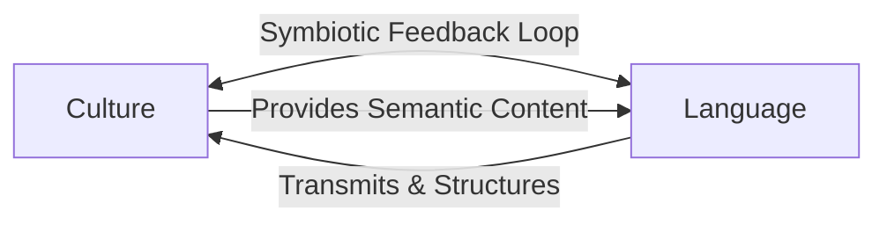
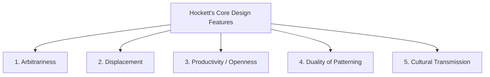
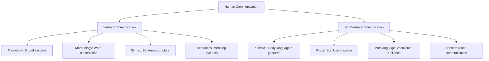
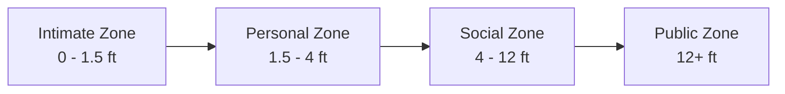
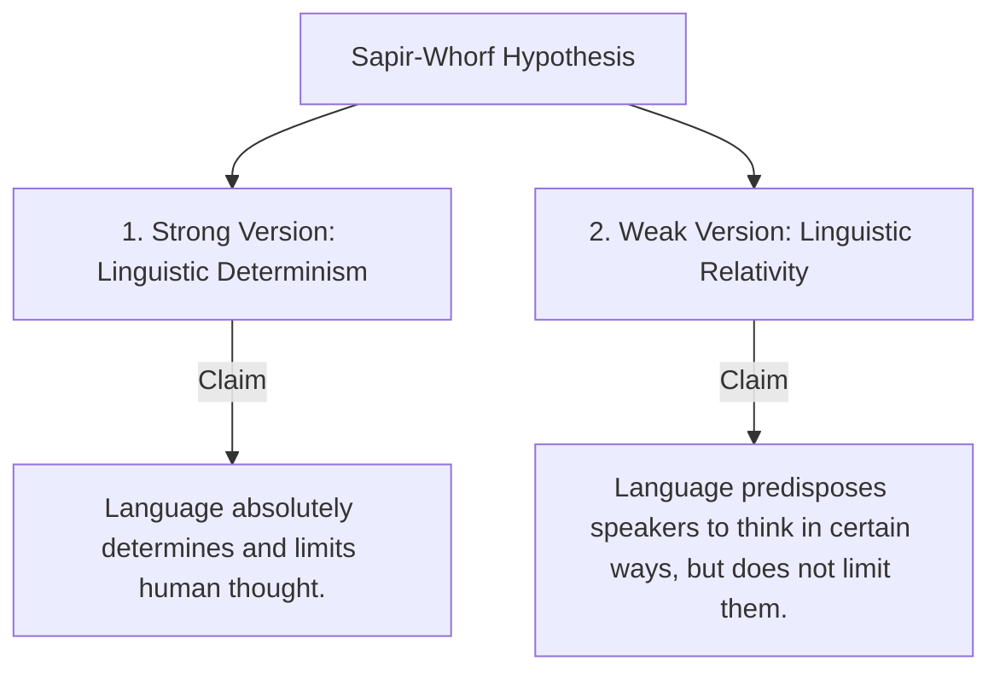
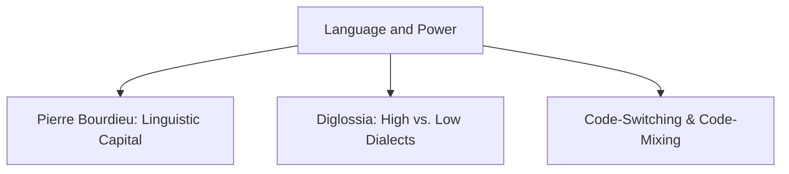
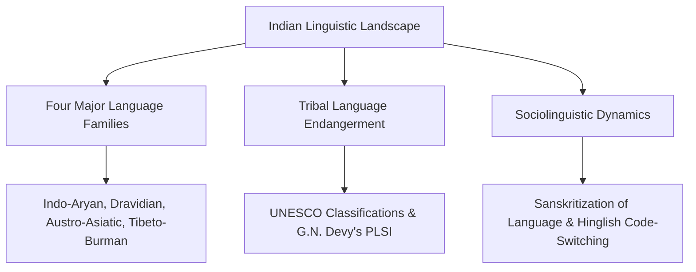

# VALUE ADD: Unit 7 - UNIT 6: ANTHROPOLOGICAL THEORIES
**Date:** June 05, 2026 | **Target:** PAPER I — UNIT 6: ANTHROPOLOGICAL THEORIES
**Syllabus Mapping:** Unit 7

# PAPER I — UNIT 7: CULTURE, LANGUAGE AND COMMUNICATION

---

> [!NOTE]
> **Syllabus Mapping:** 
> * Paper I, Unit 7: Culture, Language and Communication — Nature, origin and characteristics of language; verbal and non-verbal communication; social-context of language use.
> * Connects with: Unit 2.1 (Concept of Culture), Unit 6 (Cognitive Anthropology/Ethnoscience), and Unit 8 (Research Methods — Linguistic techniques).

---

## I. NATURE, ORIGIN, AND CHARACTERISTICS OF LANGUAGE

Language is the primary vehicle of culture. While culture is a socially transmitted blueprint for living, language is the symbolic system through which this blueprint is formulated, stored, shared, and passed across generations.

---

### 1. The Nature of Language: Human vs. Animal Communication
To understand the nature of human language, anthropologists contrast it with animal communication systems (call systems). **Charles Hockett** formulated the **Design Features of Language** to identify what makes human language unique:

*   **Arbitrariness:** There is no natural or physical connection between a linguistic sign (sound/word) and its real-world referent. 
    *   *Example:* The word "dog" (English), "chien" (French), and "kutta" (Hindi) all refer to the same animal. The connection is purely a matter of social convention.
*   **Displacement:** Human language can refer to events, objects, and concepts that are removed in time (past/future) or space (distant/imaginary). Animal call systems are strictly bound to the immediate present (e.g., a gibbon's alarm call only occurs when a predator is physically visible *now*).
*   **Productivity (Openness):** Humans can create and understand infinitely new, never-before-heard sentences. We can combine a limited set of words to express completely novel thoughts. Animal call systems are closed and fixed; they cannot combine calls to create new meanings.
*   **Duality of Patterning:** Human language operates on two levels:
    1.  *Level 1:* A limited set of meaningless sounds (**Phonemes**, e.g., /b/, /a/, /t/).
    2.  *Level 2:* These sounds are combined to form an infinite number of meaningful units (**Morphemes** and words, e.g., "bat", "tab").
*   **Cultural Transmission:** While the biological capacity for language is genetically hardwired, the specific language a person speaks is learned and acquired through social interaction within a cultural group.

---

### 2. The Origin of Language: Biological and Evolutionary Foundations
The origin of language is a complex evolutionary puzzle involving anatomical, genetic, and cognitive shifts:

#### A. Anatomical Evolution
*   **The Vocal Tract:** The descent of the **larynx** (voice box) and the rounding of the tongue in *Homo sapiens* created a dual-chamber vocal tract. This allows for the precise modulation of air to produce a wide range of distinct vowel and consonant sounds.
*   **The Hyoid Bone:** Archaeological discoveries of Neanderthal hyoid bones (e.g., the Kebara 2 hyoid) suggest that the anatomical capacity for speech began to stabilize well before modern *Homo sapiens* emerged.

#### B. Genetic Evolution (The FOXP2 Gene)
*   Often labeled the "language gene," mutations in the **FOXP2 gene** are directly linked to severe speech and language disorders. Evolutionary geneticists estimate that the modern human variant of FOXP2 swept through the hominin population approximately 200,000 years ago, coinciding with the emergence of anatomically modern humans.

#### C. Cognitive and Gestural Origins
*   **Gestural Theory:** Proponents (e.g., Michael Corballis) argue that human language evolved from a gestural communication system used by early bipedal hominins. As hands became occupied with tool-making and carrying, communication shifted from gestures to vocalizations, freeing the hands for manual tasks.

---

## II. VERBAL AND NON-VERBAL COMMUNICATION

Human communication is a multi-modal system. It relies on both structured verbal codes and highly nuanced non-verbal channels.

---

### 1. Verbal Communication: The Structural Layers of Language
Linguists and linguistic anthropologists divide verbal language into four structural subsystems:

| Subsystem | Definition | Anthropological Significance |
| :--- | :--- | :--- |
| **Phonology** | The study of the speech sounds (phonemes) used in a language. | Different cultures select different subsets of sounds from the universal human vocal capacity. |
| **Morphology** | The study of how sounds combine to form meaningful units (morphemes/words). | Reveals how cultures package meaning (e.g., agglutinative languages that build massive words out of multiple prefixes/suffixes). |
| **Syntax** | The rules governing how words are arranged to form grammatically correct sentences. | Dictates the logical flow of thought (e.g., Subject-Verb-Object vs. Subject-Object-Verb structures). |
| **Semantics** | The study of meaning systems, words, and their cultural referents. | Directly maps onto a culture's cognitive categories and environmental classifications (Ethnoscience). |

---

### 2. Non-Verbal Communication: The Silent Language of Culture
Non-verbal communication is highly structured and culturally relative. What is polite in one culture can be deeply offensive in another.

#### A. Kinesics (Body Language and Gestures)
Pioneered by **Ray Birdwhistell**, kinesics is the study of communication through body movements, postures, facial expressions, and gestures.
*   **Emblems:** Non-verbal gestures that have direct verbal translations within a culture (e.g., the "thumbs up" gesture).
*   **Cultural Relativity:** In Bulgaria, shaking the head sideways means "yes," while nodding up and down means "no." This demonstrates that body language is not biologically determined, but culturally constructed.

#### B. Proxemics (The Use of Space)
Pioneered by **Edward T. Hall** in his classic work *The Hidden Dimension (1966)*, proxemics is the study of how humans use, structure, and perceive physical space in social interactions. Hall identified four distinct distance zones used by middle-class Americans:

*   **Cultural Variation:** Hall distinguished between:
    *   *Contact Cultures:* (e.g., Mediterranean, Latin American, Middle Eastern) where people stand closer, touch frequently, and maintain direct eye contact.
    *   *Non-Contact Cultures:* (e.g., Northern European, East Asian) where personal space boundaries are larger, and physical touch is minimized in public.

#### C. Paralanguage
Paralanguage refers to the non-verbal vocal cues that accompany speech, such as pitch, volume, tempo, intonation, laughter, and even **silence**.
*   *Example:* In Western cultures, silence in a conversation is often perceived as awkward or tense. In Apache culture (as studied by Keith Basso), silence is a strategic, respectful response used in ambiguous social situations (e.g., when meeting strangers or when a child returns home from boarding school).

---

## III. THE SOCIAL CONTEXT OF LANGUAGE USE

Sociolinguistics and ethnolinguistics study how language operates in real-world social settings, reflecting and reinforcing social structures, power dynamics, and cultural worldviews.

---

### 1. The Sapir-Whorf Hypothesis (Linguistic Relativity)
Formulated by **Edward Sapir** and his student **Benjamin Lee Whorf**, this hypothesis posits that the structure of a language shapes and influences how its speakers perceive and conceptualize the world around them.

#### Classic Case Studies:
*   **Whorf's Hopi Study:** Whorf argued that the Hopi language has no grammatical tenses (past, present, future) like English. Instead, Hopi divides reality into "manifested" (what is physically present now) and "manifesting" (what is mental, future, or spiritual). He concluded that Hopi speakers perceive time as a continuous process rather than a series of discrete, countable units (like hours or days).
*   **Inuit Snow Terms:** The classic (though often exaggerated) example of the Inuit having multiple distinct words for different types of snow (falling snow, slushy snow, hard-packed snow) shows how language adapts to highlight ecologically vital distinctions.

> [!TIP]
> **UPSC Value Addition (Indian Context):** The Sanskrit language has multiple distinct words for "knowledge" (e.g., *Jnana* - intellectual knowledge, *Vijnana* - experiential/scientific knowledge, *Vidya* - spiritual wisdom). This linguistic richness reflects the deep philosophical categorization of consciousness in classical Indian culture.

---

### 2. Language and Social Class: Sociolinguistics
Language is a powerful marker of social stratification. Speakers of prestigious dialects gain access to social and economic opportunities, while speakers of non-standard dialects face systemic discrimination.

#### A. William Labov's Department Store Study (1966)
*   **The Study:** Labov studied the pronunciation of the post-vocalic /r/ (as in "fourth floor") across three New York City department stores catering to different social classes: Saks Fifth Avenue (high-status), Macy's (middle-status), and S. Klein (low-status).
*   **The Finding:** The use of the prestigious /r/ sound was highest in the high-status store and lowest in the low-status store. 
*   **Conclusion:** Pronunciation is not a random linguistic variation; it is a systematic social marker directly tied to socioeconomic class.

#### B. Basil Bernstein's Codes (1971)
Bernstein argued that social classes use different linguistic codes:
*   **Restricted Code:** Used primarily by the working class. It is highly context-dependent, relies on shared background assumptions, and uses short, condensed sentences.
*   **Elaborated Code:** Used primarily by the middle and upper classes. It is context-independent, highly explicit, and uses complex grammatical structures to convey abstract ideas.
*   *Anthropological Critique:* Anthropologists (like William Labov) strongly critique Bernstein, arguing that the "restricted code" is not cognitively deficient or simple; it is merely a different, highly sophisticated style of communication suited for close-knit social groups.

---

### 3. Language and Gender
Linguistic anthropologists study how gender identities are constructed, performed, and maintained through speech patterns.

#### A. Robin Lakoff's "Language and Woman's Place" (1975)
Lakoff identified specific features of "Women's Language" in American English that she argued reinforce a subordinate social status:
*   **Tag Questions:** (e.g., "It's a nice day, *isn't it?*") which project uncertainty.
*   **Hedges:** (e.g., "I *sort of* think...", "It's *kind of*...") which soften statements.
*   **Hyper-correct Grammar and Super-polite Forms.**

#### B. Deborah Tannen's Difference Framework (1990)
Tannen moved away from the "dominance" model to a "difference" model, arguing that men and women grow up in different linguistic subcultures:
*   **Men engage in "Report Talk":** Using language to preserve independence, exhibit skill, and maintain status in a hierarchical social order.
*   **Women engage in "Rapport Talk":** Using language to establish connections, build relationships, and maintain social intimacy.

---

### 4. Language, Power, and Politics
Language is not just a tool for communication; it is an instrument of political power and social control.

*   **Pierre Bourdieu's Linguistic Capital:** Bourdieu argued that the prestigious dialect of a nation (often the dialect of the ruling elite) is institutionalized as the "standard language." Mastery of this standard language acts as **linguistic capital**, which can be converted into economic and social capital (jobs, status, power). Those who speak non-standard dialects are marginalized through "symbolic violence."
*   **Diglossia:** A situation where two distinct varieties of the same language exist side-by-side in a single community, each used for different social functions:
    *   *High (H) Variety:* Used in formal settings (government, education, religious sermons, literature).
    *   *Low (L) Variety:* Used in informal, everyday conversations (home, marketplace).
    *   *Example:* Classical Arabic (H) vs. Egyptian Colloquial Arabic (L).
*   **Code-Switching:** The practice of alternating between two or more languages or dialects within a single conversation or social interaction. It is a highly sophisticated cognitive and social strategy used to signal identity, establish solidarity, or navigate power dynamics.

---

## IV. HIGH-YIELD VALUE ADDITIONS & INDIAN CONTEXT

India is a linguistic goldmine, characterized by extreme diversity, historical depth, and complex sociolinguistic hierarchies.

---

### 1. The Indian Linguistic Landscape
India is home to four major language families:
1.  **Indo-Aryan:** (78% of the population) e.g., Hindi, Bengali, Punjabi, Marathi.
2.  **Dravidian:** (20% of the population) e.g., Tamil, Telugu, Kannada, Malayalam.
3.  **Austro-Asiatic:** (Spoken primarily by tribal groups like Santhals, Mundas, and Hos).
4.  **Tibeto-Burman:** (Spoken by tribal groups in the Northeast).

---

### 2. Tribal Language Endangerment and Preservation
According to the **People's Linguistic Survey of India (PLSI)**, directed by linguist **G.N. Devy**, India has lost over **250 languages** in the last 50 years. 

> [!IMPORTANT]
> **Key Case Study: The PLSI and Language Loss**
> *   **The Issue:** The Indian Census does not officially record languages spoken by fewer than 10,000 people. This policy renders hundreds of tribal and nomadic languages invisible, accelerating their extinction.
> *   **The Impact:** When a tribal language dies, a unique ecological worldview, oral history, and traditional botanical knowledge system (ethnoscience) are lost forever.
> *   **UNESCO Classification:** UNESCO classifies languages into categories ranging from "Vulnerable" to "Extinct." In India, languages like **Great Andamanese** and **Toda** are critically endangered.
> *   **Preservation Efforts:** The PLSI is a massive, citizen-led effort to document India's living languages, advocating for the inclusion of tribal mother tongues in primary education (as mandated by the National Education Policy 2020).

---

### 3. Sanskritization of Language
Mirroring M.N. Srinivas's concept of Sanskritization, lower castes and tribal groups in India historically abandoned their local dialects or tribal languages in favor of Sanskritized Hindi or regional dominant languages to claim higher social status. This linguistic assimilation has contributed to the decline of indigenous dialects.

---

### 4. "Hinglish" as a Modern Code-Switching Phenomenon
In contemporary urban India, the rise of **Hinglish** (a blend of Hindi and English) is a classic example of code-mixing. It is no longer viewed as a linguistic error, but as a prestigious, modern identity marker used by the urban middle class, widely adopted in advertising, Bollywood, and social media.

---

## V. COMPARATIVE MATRIX OF KEY CONCEPTS

| Concept | Key Proponent | Core Premise | Anthropological Example |
| :--- | :--- | :--- | :--- |
| **Design Features of Language** | Charles Hockett | Identifies the unique biological and structural traits of human language vs. animal calls. | Displacement (talking about the past/future). |
| **Proxemics** | Edward T. Hall | The cultural structuring and use of personal and social space. | Contact vs. Non-contact cultures. |
| **Linguistic Relativity** | Sapir & Whorf | Language structures and predisposes our cognitive perception of reality. | Hopi concept of time; Hanunoo color categories. |
| **Linguistic Capital** | Pierre Bourdieu | Standard language acts as a resource that yields social and economic power. | Systemic preference for English/Standard Hindi in Indian job markets. |
| **Kinesics** | Ray Birdwhistell | Body language, gestures, and posture are structured, culturally learned codes. | Shaking the head for "yes" vs. "no" across cultures. |

---

## VI. UPSC PREVIOUS YEAR QUESTIONS (PYQs) & MODEL ANSWER BLUEPRINTS

---

### PYQ 1: What is the Sapir-Whorf hypothesis? Critically evaluate its validity with suitable examples. [2022, 15 Marks]

#### Model Answer Blueprint:

*   **Introduction (Approx. 40 words):** Define the Sapir-Whorf hypothesis (Linguistic Relativity) as a foundational concept in linguistic anthropology, formulated by Edward Sapir and Benjamin Lee Whorf. It posits that the structure of a language shapes and influences how its speakers perceive, categorize, and experience the physical and social world.
*   **Body Skeleton:**
    *   *The Two Versions:*
        1.  *Strong Version (Linguistic Determinism):* Language *determines* thought. (Widely rejected by modern linguists as too rigid).
        2.  *Weak Version (Linguistic Relativity):* Language *influences* and predisposes thought. (Highly accepted).
    *   *Supporting Case Studies:*
        *   **Whorf's Hopi Study:** Hopi grammatical structure lacks linear time tenses, predisposing them to view time as a continuous process rather than discrete, countable units.
        *   **Color Perception (Conklin's Hanunoo Study):** The Hanunoo categorize colors based on moisture and dryness rather than light wavelengths, showing how language structures sensory perception.
    *   *Critical Evaluation (The Counter-Arguments):*
        *   *Universalism (Noam Chomsky):* Argues for a universal grammar hardwired into the human brain; languages differ only on the surface.
        *   *Translatability:* If language strictly determined thought, translation between radically different languages would be impossible.
        *   *Cognitive Flexibility:* Humans can learn new concepts even if their language lacks a specific word for them (e.g., introducing technology terms to tribal groups).
*   **Conclusion (Approx. 40 words):** While the strong version of linguistic determinism is scientifically untenable, the weak version remains a powerful tool in cognitive anthropology, demonstrating that language is not a passive mirror of reality, but an active lens through which humans interpret their existence.

---

### PYQ 2: Discuss the differences between human language and animal communication systems. [2020, 15 Marks]

#### Model Answer Blueprint:

*   **Introduction (Approx. 40 words):** Define human language as a highly complex, symbolic, and culturally transmitted system of communication. Contrast it with animal communication (call systems), which are biologically determined, closed systems.
*   **Body Skeleton:**
    *   *Utilize Charles Hockett's Design Features to structure the comparison:*
        1.  **Displacement:** Humans can talk about past, future, and imaginary events (e.g., myths, space). Animals can only communicate about the immediate present (e.g., a warning call for an active predator).
        2.  **Productivity / Openness:** Humans can generate infinite new sentences to express novel thoughts. Animal call systems are closed and fixed (e.g., a bee's dance can only convey distance and direction of food, nothing else).
        3.  **Arbitrariness:** No natural link between the human word and its referent. Animal calls are often indexical or iconic (e.g., growling to show anger).
        4.  **Duality of Patterning:** Human language combines meaningless sounds (phonemes) into meaningful units (morphemes). Animal calls are single, holistic units.
        5.  **Cultural Transmission:** Humans learn their specific language socially. Animal call systems are genetically hardwired and instinctual.
    *   *Use a Comparative Table:* Include a clear, 5-point comparative table summarizing these differences for high visual impact.
*   **Conclusion (Approx. 40 words):** While animals possess highly sophisticated communication systems suited for their ecological niches, human language is qualitatively distinct, serving as the unique cognitive foundation upon which complex human culture, abstract thought, and symbolic worlds are built.

---

### PYQ 3: Write a short note on Non-Verbal Communication. [2019, 10 Marks]

#### Model Answer Blueprint:

*   **Introduction (Approx. 30 words):** Non-verbal communication refers to the transmission of messages, meanings, and emotions through channels other than spoken words. It is a highly structured, culturally relative "silent language" that accompanies and modifies verbal speech.
*   **Body Skeleton:**
    *   *Identify the Core Subsystems of Non-Verbal Communication:*
        1.  **Kinesics (Ray Birdwhistell):** Body language, facial expressions, and gestures. Highlight that gestures are culturally learned (e.g., head nodding variations).
        2.  **Proxemics (Edward T. Hall):** The social use of space. Explain Hall's four distance zones (Intimate, Personal, Social, Public) and contrast *Contact* vs. *Non-Contact* cultures.
        3.  **Paralanguage:** Vocal cues (pitch, volume, tempo) and the strategic use of **silence** (e.g., Keith Basso's study of silence among the Western Apache).
        4.  **Haptics:** The cultural rules governing physical touch in social interactions.
    *   *Anthropological Significance:* Non-verbal communication maintains social hierarchies, signals group identity, and prevents social friction.
*   **Conclusion (Approx. 30 words):** Mastery of a culture's non-verbal codes is essential for successful ethnographic fieldwork, as these silent cues often convey deeper social truths, power dynamics, and emotional realities than spoken words alone.