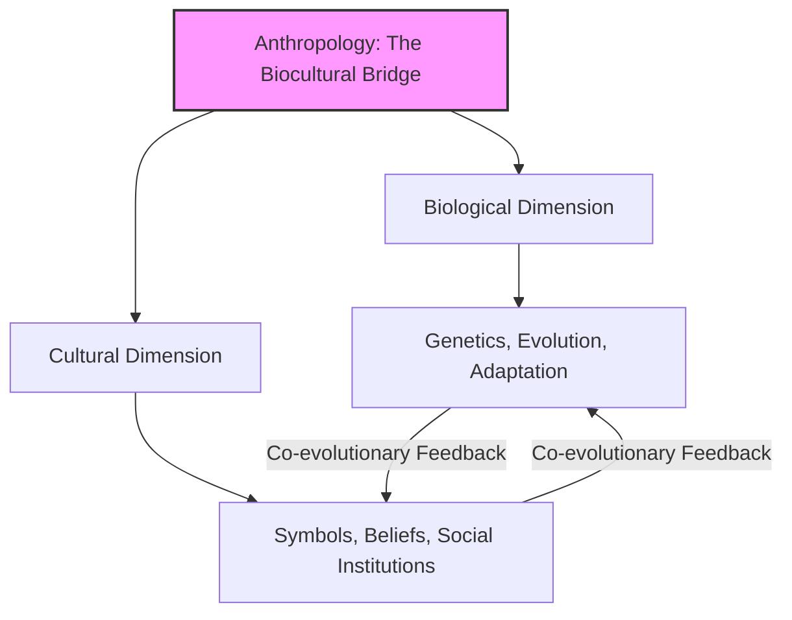
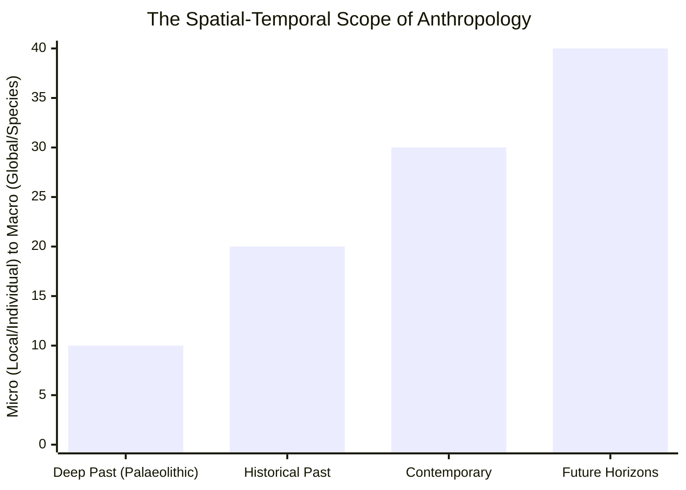
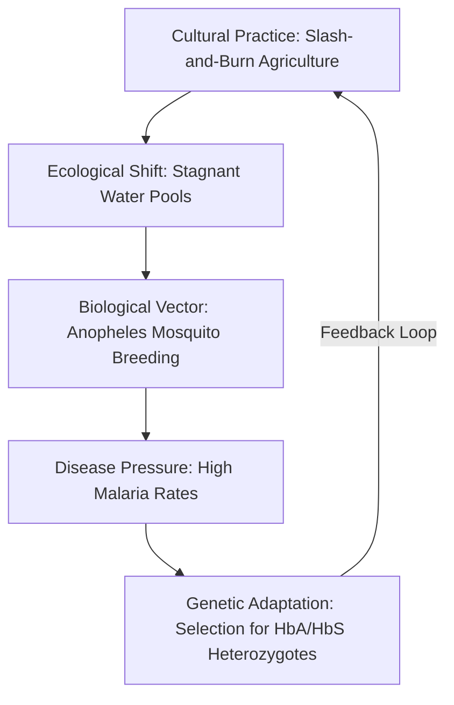

# VALUE ADD: Unit 1.1 - UNITS 1.1-1.3, 8 & 12: RESEARCH METHODS & APPLIED ANTHROPOLOGY
**Date:** May 30, 2026 | **Target:** PAPER I — UNITS 1.1-1.3, 8 & 12: RESEARCH METHODS & APPLIED ANTHROPOLOGY
**Syllabus Mapping:** Unit 1.1

# UPSC CSE ANTHROPOLOGY PAPER I — UNIT 1.1
## Meaning, Scope, and Development of Anthropology

---

## I. CONCEPTUAL CORE: MEANING & EPISTEMOLOGICAL PILLARS

Anthropology (derived from Greek *Anthropos* = "human" and *Logos* = "study") is the **holistic, comparative, bio-cultural, and evolutionary study of humankind** across all space and time. 

### The Four Epistemological Pillars of Unit 1.1

1. **Holism:** The methodological commitment to view the human condition as an integrated whole. It asserts that biology, language, society, and history cannot be understood in isolation (e.g., how the biological capacity for speech co-evolved with cultural tool-making).
2. **The Comparative Method:** Rejects any single-culture model of human nature. It cross-culturally tests generalizations about human behavior, institutions, and biology across diverse geographical spaces and historical epochs.
3. **Cultural Relativism:** The methodological rule that a society's customs and ideas must be described objectively and understood within the context of that society's problems and opportunities, neutralizing ethnocentric bias.
4. **The Bio-Cultural Framework:** The unique recognition that human biology and culture are not mutually exclusive but are dynamically intertwined through **co-evolutionary feedback loops**.

---

## II. THE SCOPE OF ANTHROPOLOGY: TEMPORAL & SPATIAL DIMENSIONS

The scope of anthropology is defined by its **limitless boundaries** in studying humanity. It is often mapped across two axes:

### 1. The Temporal Axis (Time)
* **Deep Past:** Investigates human origins, hominin evolution (e.g., *Australopithecus* to *Homo sapiens*), and extinct cultures via material remains.
* **Present:** Documents living cultures, linguistic variations, and contemporary human biological adaptations.
* **Future:** Explores human adaptation to space colonization, artificial intelligence, and climate change (Anthropocene studies).

### 2. The Spatial Axis (Space)
* **Micro-level:** Intensive, localized studies of small-scale tribal communities, bands, or urban neighborhoods.
* **Macro-level:** Global networks, transnational migrations, diaspora, and globalized economic systems.

### 3. The Four-Field Integration (The Boas Legacy)
In the United States, Franz Boas institutionalized the **Four-Field Approach** to define the comprehensive scope of the discipline:
* **Biological/Physical:** Human evolution, genetics, and plasticity.
* **Socio-Cultural:** Social structures, kinship, economics, and belief systems.
* **Archaeological:** Reconstructing past lifeways through material culture.
* **Linguistic:** Language as a cognitive tool and social practice.

---

## III. CHRONOLOGICAL DEVELOPMENT OF ANTHROPOLOGY

The development of anthropology can be divided into five distinct historical phases:

| Phase & Era | Key Characteristics | Dominant Paradigms & Thinkers | Institutional Milestones |
| :--- | :--- | :--- | :--- |
| **1. Formative Period** *(Pre-1840s)* | Speculative, philosophical, and antiquarian. Driven by colonial expansion, voyages of discovery, and curiosity about the "Other." | • **Herodotus:** "Father of History" (detailed ethnographies of Scythians). • **Ibn Khaldun:** *Muqaddimah* (asabiyyah/social cohesion). • **Montesquieu:** Environmental determinism. | • Founding of the *Société des Observateurs de l'Homme* (Paris, 1799). |
| **2. Convergent / Evolutionary Period** *(1840s–1890s)* | Attempted to establish anthropology as a rigorous natural science. Dominated by **Unilinear Cultural Evolutionism** and Darwinian analogies. | • **E.B. Tylor:** Animism to Monotheism; first academic definition of culture (1871). • **L.H. Morgan:** Savagery $\rightarrow$ Barbarism $\rightarrow$ Civilization. • **Herbert Spencer:** Social Darwinism. | • Anthropological Society of London (1863). • First University Chair in Anthropology (E.B. Tylor at Oxford, 1896). |
| **3. Constructive Period** *(1890s–1935)* | Rejection of armchair speculation. Institutionalization of **empirical fieldwork** and professionalization of the discipline. | • **Franz Boas:** Historical Particularism, Cultural Relativism. • **B. Malinowski:** Functionalism, Participant Observation. • **A.R. Radcliffe-Brown:** Structural-Functionalism. | • Torres Straits Expedition (1898). • Publication of *Argonauts of the Western Pacific* (1922). |
| **4. Critical / Analytical Period** *(1935–1990)* | Proliferation of diverse theoretical frameworks. Shift from "how cultures evolved" to "how cultures function, mean, and are structured." | • **Claude Lévi-Strauss:** Structuralism. • **Julian Steward:** Cultural Ecology. • **Clifford Geertz:** Interpretive/Symbolic Anthropology. | • Rapid expansion of university departments globally post-WWII. |
| **5. Contemporary / Post-Modern Period** *(1990s–Present)* | Deconstruction of ethnographic authority. Focus on globalization, reflexivity, power dynamics, and marginalized voices. | • **James Clifford & George Marcus:** *Writing Culture* (1986). • **Arturo Escobar:** Post-development anthropology. • **Donna Haraway:** Multispecies ethnography. | • Rise of Digital Anthropology, Applied Anthropology, and Decolonizing methodologies. |

---

## IV. THINKER REFERENCE MATRIX (UNIT 1.1)

Use these precise quotes and references to elevate your answers in 10, 15, and 20-markers:

| Thinker | Seminal Work | High-Yield Concept / Quote | Application in Answers |
| :--- | :--- | :--- | :--- |
| **Clyde Kluckhohn** | *Mirror for Man* (1949) | *"Anthropology holds up a great mirror to man and lets him look at himself in his infinite variety."* | Use in the **Introduction** of any question on the meaning and relevance of anthropology. |
| **Alfred Kroeber** | *Anthropology* (1948) | *"Anthropology is the most humanistic of the sciences and the most scientific of the humanities."* | Use to explain the **unique position** of anthropology bridging natural sciences and humanities. |
| **Franz Boas** | *The Mind of Primitive Man* (1911) | **Historical Particularism:** Each culture has its own unique history and cannot be judged by universal evolutionary scales. | Use to critique Unilinear Evolutionism and explain the **development** of empirical anthropology. |
| **T.K. Penniman** | *A Hundred Years of Anthropology* (1935) | Classified the history of anthropology into four distinct periods (Formative, Convergent, Constructive, Critical). | Use to structure answers specifically asking about the **historical development** of the discipline. |
| **Claude Lévi-Strauss** | *Structural Anthropology* (1958) | *"Anthropology aims at global knowledge of man, embracing the subject in all its historical and geographical extension."* | Use to define the **holistic scope** of the discipline. |

---

## V. PREMIUM VALUE-ADD CASE STUDIES

### Case Study 1: The Biocultural Synthesis of Sickle Cell Anemia
* **Anthropologist:** Frank B. Livingstone (1958)
* **Context:** Demonstrating the absolute necessity of a **biocultural approach** (Meaning & Scope of Unit 1.1).
* **The Link:** Livingstone demonstrated that the biological mutation for Sickle Cell Hemoglobin ($Hb^S$) was maintained in high frequencies in West Africa due to a cultural practice: **slash-and-burn agriculture**. 
  * *Cultural Action:* Clearing forests for agriculture created stagnant pools of water.
  * *Ecological Consequence:* Stagnant water led to an explosion of *Anopheles* mosquito populations (malaria vectors).
  * *Biological Selection:* Individuals heterozygous for the sickle cell trait ($Hb^A Hb^S$) had a selective advantage against malaria.
* **Significance for Unit 1.1:** This case study proves that human biology cannot be understood without analyzing cultural practices, validating the **holistic, biocultural scope** of anthropology.

### Case Study 2: Anthropocene and Multispecies Ethnography
* **Anthropologist:** Anna Tsing (2015)
* **Work:** *The Mushroom at the End of the World*
* **Context:** Illustrating the **contemporary scope** of anthropology in the 21st century.
* **The Study:** Tsing tracks the global commodity chain of the Matsutake mushroom, which grows in human-disturbed, ruined industrial forests. She examines the relations between humans, fungi, pine trees, and global capitalist markets.
* **Significance for Unit 1.1:** Demonstrates how the scope of modern anthropology has expanded beyond "human-centric" studies to **multispecies assemblages**, showing how humans co-exist with non-human species in the ruins of the Anthropocene.

---

## VI. UPSC CSE MAINS: HIGH-YIELD ANSWER BLUEPRINTS

### Question: "Elucidate the development of Anthropology as an academic discipline during the 19th century." [15 Marks, 250 Words]

#### 1. Introduction
* **Definition & Context:** Define anthropology using Clyde Kluckhohn’s *"mirror for man"* concept. State that the 19th century was the **"Convergent Period"** (T.K. Penniman), where disparate accounts of travelers, colonial administrators, and natural sciences converged into a formal academic discipline.

#### 2. Key Drivers of 19th-Century Development
* **The Colonial Encounter:** Colonial expansion created an administrative need to understand "native" laws, land tenure, and social systems to facilitate indirect rule.
* **The Darwinian Revolution (1859):** Charles Darwin’s *On the Origin of Species* provided a scientific framework for evolution, which 19th-century anthropologists quickly applied to human societies (Social Darwinism).
* **The Industrial Revolution:** Rapid urbanization in Europe created a contrast between "modern" industrial societies and "primitive" colonized societies, sparking interest in human progress.

#### 3. Dominant Theoretical Paradigm: Unilinear Cultural Evolution (UCE)
* Explain how early thinkers attempted to classify all human cultures into a single, progressive evolutionary ladder:
  $$\text{Savagery} \longrightarrow \text{Barbarism} \longrightarrow \text{Civilization}$$
* **E.B. Tylor (UK):** Traced the evolution of religion from *Animism $\rightarrow$ Polytheism $\rightarrow$ Monotheism*. Established the first academic definition of culture in *Primitive Culture* (1871).
* **L.H. Morgan (USA):** In *Ancient Society* (1877), he mapped technological progress to social institutions (e.g., communal property to private property).

#### 4. Methodological Limitations of the 19th-Century Phase
* **Armchair Anthropology:** Thinkers like Tylor and Frazer relied on secondary, highly biased reports from missionaries and merchants rather than conducting direct fieldwork.
* **Ethnocentrism:** Victorian England was placed at the pinnacle of "Civilization," viewing tribal societies as "living fossils" or "primitive" ancestors.

#### 5. Conclusion
* Conclude by stating that while 19th-century anthropology was limited by speculative theories and ethnocentric biases, it succeeded in **institutionalizing the discipline** in universities and museums, setting the stage for the empirical "fieldwork revolution" of the early 20th century under Franz Boas and Bronislaw Malinowski.