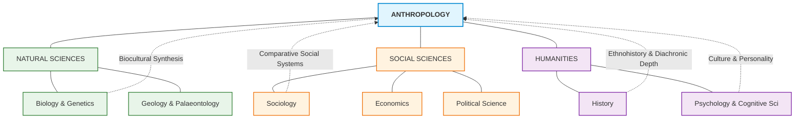

# VALUE ADD: Unit 1.2 - UNITS 1.1-1.3, 8 & 12: RESEARCH METHODS & APPLIED ANTHROPOLOGY
**Date:** May 30, 2026 | **Target:** PAPER I — UNITS 1.1-1.3, 8 & 12: RESEARCH METHODS & APPLIED ANTHROPOLOGY
**Syllabus Mapping:** Unit 1.2

# UNIT 1.2: RELATIONSHIPS WITH OTHER DISCIPLINES

---

## I. THE INTERDISCIPLINARY NEXUS OF ANTHROPOLOGY

Anthropology occupies a unique epistemological position. It is not merely a social science; it is a **bridge discipline** that spans the Natural Sciences, Social Sciences, and Humanities. 



---

## II. DEEP-DIVE COMPARATIVE MATRICES & EPISTEMOLOGICAL DIALOGUES

---

### 1. ANTHROPOLOGY VS. SOCIOLOGY

While historically separated by geography and subject matter, the two disciplines are increasingly converging. **M.N. Srinivas** famously advocated for a "Sociological Anthropology" or "Social Sociology" in the Indian context, arguing that the distinction is artificial.

```
+-----------------------------------------------------------------------------+
|                            HISTORICAL DIVERGENCE                            |
|                                                                             |
|      [SOCIOLOGY]                                      [ANTHROPOLOGY]        |
|  - Born in Industrial Europe                     - Born in Colonial Encounters|
|  - Focus: "Self" (Western Modernity)             - Focus: "Other" (Tribal/Non-Western)|
|  - Unit: Macro-structures (Classes, States)      - Unit: Micro-communities (Band, Tribe)|
+-----------------------------------------------------------------------------+
                                      |
                                      v
+-----------------------------------------------------------------------------+
|                            CONTEMPORARY CONVERGENCE                         |
|                                                                             |
|  - Urban Anthropology (Studying slums, corporate structures, subcultures)    |
|  - "Glocal" Focus (Analyzing how global forces impact local communities)    |
|  - Mixed Methods (Combining quantitative surveys with deep ethnography)     |
+-----------------------------------------------------------------------------+
```

| Comparative Dimension | Social-Cultural Anthropology | Sociology |
| :--- | :--- | :--- |
| **Epistemological Origin** | Rooted in the **colonial encounter** and the desire to document fast-disappearing non-Western cultures (Salvage Ethnography). | Born out of the **Industrial and French Revolutions** to address social disorder, urbanization, and class conflict in Western societies. |
| **Methodological Focus** | **Emic Perspective:** Capturing the native's point of view through long-term, intensive **Participant Observation** (fieldwork). | **Etic Perspective:** Analyzing social phenomena from an external, structural standpoint using surveys, statistical models, and questionnaires. |
| **Analytical Scope** | **Holistic & Micro-level:** Studies small-scale, face-to-face communities (e.g., villages, bands) as integrated wholes. | **Specialized & Macro-level:** Isolates specific social institutions (e.g., family, education, crime) within large-scale, complex societies. |
| **Theoretical Orientation** | **Cultural Relativism:** Rejects ethnocentrism; views cultures as unique historical configurations. | **Structural-Functionalism / Conflict Theory:** Often seeks universal laws of social development and structural transformation. |
| **Modern Convergence** | **Urban Anthropology:** Anthropologists now study corporate boardrooms, scientific laboratories, and modern urban subcultures. | **Qualitative Sociology:** Sociologists increasingly adopt ethnographic methods to study marginalized urban communities. |

---

### 2. ANTHROPOLOGY VS. HISTORY

The relationship between History and Anthropology has evolved from mutual suspicion to deep integration. **E.E. Evans-Pritchard** famously declared: *"Anthropology must choose between being history or being nothing."*

```
                  [DIFFERENCE IN TEMPORAL APPROACH]
                  
      HISTORY                                   ANTHROPOLOGY
  (Diachronic Focus)                         (Synchronic Focus)
  Studies change over time                   Studies systems at a specific point
  through documentary archives.              in time through living communities.
                  \                                 /
                   \                               /
                    v                             v
               [CONVERGENCE: ETHNOHISTORY & HISTORICAL ANTHROPOLOGY]
               - Uses oral traditions to reconstruct unwritten histories.
               - Analyzes archives as cultural artifacts (Bernard Cohn).
```

* **Idiographic vs. Nomothetic:**
  * **History** is traditionally **idiographic**—it seeks to document unique, specific events, personalities, and chronological sequences (e.g., the causes of the French Revolution).
  * **Anthropology** is traditionally **nomothetic**—it seeks to identify general patterns, structures, and cross-cultural laws of human behavior and social organization.
* **The Methodological Divide:**
  * History relies on **documentary archives**, written records, and secondary sources. It is a study of the *past* through dead texts.
  * Anthropology relies on **living informants**, oral histories, and direct observation. It is a study of the *present* through active human interaction.
* **The Synthesis (Ethnohistory & Historical Anthropology):**
  * **Ethnohistory** combines anthropological concepts with historical methods to reconstruct the history of non-literate societies that left no written records (e.g., Native American tribes).
  * **Bernard Cohn's** work on colonial India demonstrated that colonial archives are not objective historical records but cultural artifacts of colonial power dynamics that must be analyzed anthropologically.

---

### 3. ANTHROPOLOGY VS. PSYCHOLOGY

The intersection of these disciplines gave rise to **Psychological Anthropology** (historically known as the **Culture and Personality School**), which explores how cultural environments shape individual cognitive and emotional development.

```
  [PSYCHOLOGY]                                      [ANTHROPOLOGY]
  Focuses on the universal human mind               Focuses on the culturally constructed mind
  (e.g., Oedipus Complex as a biological law).      (e.g., Oedipus Complex is culturally contingent).
         \                                                 /
          \                                               /
           +------------> [SYNTHESIS] <------------------+
             Psychological Anthropology / Culture & Personality
             (Margaret Mead, Ruth Benedict, Abram Kardiner)
```

* **Universalism vs. Cultural Particularism:**
  * **Psychology** (especially early psychoanalysis and cognitive psychology) assumes a **universal human psyche**. It seeks to establish general laws of mental processes, perception, and emotional development.
  * **Anthropology** argues that the human mind is **enculturated**. Cognitive processes, emotional expressions, and mental health are deeply shaped by cultural contexts.
* **The Oedipus Complex Debate:**
  * **Sigmund Freud** posited the Oedipus Complex (unconscious sexual desire for the mother and hostility toward the father) as a universal human psychological stage.
  * **Bronislaw Malinowski** challenged this in *Sex and Repression in Savage Society (1927)*. Studying the matrilineal **Trobriand Islanders**, he found that authority lay with the maternal uncle, not the father. The tension was directed at the uncle, proving that psychological complexes are culturally contingent, not biologically universal.
* **National Character Studies:**
  * During WWII, anthropologists like **Ruth Benedict** and **Margaret Mead** used psychological concepts to analyze the "national character" of Japanese and German societies, demonstrating how child-rearing practices shape adult personality structures.

---

### 4. ANTHROPOLOGY VS. ECONOMICS

The relationship between these disciplines is defined by the famous **Formalist-Substantivist Debate**, which questions whether Western economic models can be applied to non-Western, non-market societies.

```
                      [THE ECONOMIC DEBATE]
                      
       FORMALIST SCHOOL                         SUBSTANTIVIST SCHOOL
    (Rooted in Classical Economics)           (Rooted in Economic Anthropology)
    - Human behavior is always rational.      - Economic behavior is embedded
    - Focus: Scarcity & Maximization.         in social institutions (kinship, religion).
    - Universal application.                  - Focus: Livelihood & Reciprocity.
```

* **The Formalist Position (Robbins Burling, Melville Herskovits):**
  * Argues that classical economic principles (scarcity, choice, utility maximization, and rational calculation) are **universally applicable** to all human societies, whether they use money or not. A tribal hunter maximizes his arrows just as a capitalist maximizes profit.
* **The Substantivist Position (Karl Polanyi, Marshall Sahlins):**
  * Argues that classical economics is "market-biased." In non-industrial societies, the economy is **"embedded"** in social, religious, and kinship institutions. 
  * Economic transactions are governed not by market forces but by **Reciprocity** (gift exchange) and **Redistribution** (tribute systems).
* **The Classic Case Study:**
  * **Malinowski's study of the Kula Ring** among the Trobriand Islanders showed that the exchange of shell valuables (*Soulava* and *Mwali*) was not driven by material profit or utility maximization, but by the creation of lifelong social alliances, prestige, and political stability.

---

### 5. ANTHROPOLOGY VS. POLITICAL SCIENCE

While Political Science focuses on the formal machinery of the state, Political Anthropology uncovers how power, authority, and social control operate in societies without formal governments.

```
  [POLITICAL SCIENCE]                               [POLITICAL ANTHROPOLOGY]
  - Focus: Formal State Institutions                - Focus: Informal Power & Social Control
  - Unit: Governments, Elections, Laws              - Unit: Bands, Tribes, Rituals of Rebellion
  - Perspective: Top-Down                           - Perspective: Bottom-Up (Emic)
```

* **State-Centric vs. Stateless Societies:**
  * **Political Science** historically focused on the **State**, formal constitutions, electoral systems, political parties, and international relations.
  * **Political Anthropology** emerged to study **"acephalous" (stateless) societies**. It examines how order, justice, and social control are maintained through kinship, lineage systems, and religious sanctions without formal courts or police.
* **The Segmentary Lineage System:**
  * In *African Political Systems (1940)*, **M. Fortes and E.E. Evans-Pritchard** classified political systems into state-based societies and stateless societies. They demonstrated how the **Nuer of South Sudan** maintained political order through a "segmentary lineage system," where balanced opposition between kin groups prevented anarchy without a centralized ruler.
* **Rituals of Rebellion:**
  * **Max Gluckman** showed that political power is not just about physical coercion but is maintained and contested through cultural rituals. His concept of "rituals of rebellion" demonstrated how institutionalized protest actually strengthens the political status quo by releasing social tension.

---

### 6. ANTHROPOLOGY VS. MEDICAL SCIENCES

The bridge between these fields is **Medical Anthropology**, which critiques the purely biological focus of Western medicine by introducing the cultural dimensions of health, illness, and healing.

```
  [BIOMEDICINE (Medical Science)]                   [ETHNOMEDICINE (Anthropology)]
  - Focus: Disease (Biological pathogen)            - Focus: Illness (Cultural experience)
  - Treatment: Pharmaceutical/Surgical              - Treatment: Holistic/Ritualistic/Social
```

* **Disease vs. Illness:**
  * **Medical Science (Biomedicine)** views health through a clinical lens, focusing on **Disease**—the objective, biological malfunction of the body caused by pathogens, genetics, or trauma.
  * **Medical Anthropology** focuses on **Illness**—the subjective, cultural experience of being unwell, including how the patient, family, and community interpret symptoms and cope with suffering.
* **Arthur Kleinman's Explanatory Models:**
  * Kleinman demonstrated that clinical encounters are often clashes between the doctor's biomedical explanatory model and the patient's cultural explanatory model. Effective healthcare requires understanding the patient's cultural narrative of sickness.
* **Culture-Bound Syndromes:**
  * Anthropologists document psychiatric conditions that only exist within specific cultural contexts (e.g., *Latah* in Southeast Asia, *Koro* in China, or *Anorexia Nervosa* in Western societies), proving that mental and physical health cannot be divorced from cultural frameworks.

---

## III. THINKERS, CONCEPTS & EPISTEMOLOGICAL QUOTES

Use this table to memorize high-yield references for your answers:

| Thinker | Key Concept / Book | Core Argument / Epistemological Quote |
| :--- | :--- | :--- |
| **E.E. Evans-Pritchard** | *Social Anthropology (1951)* | *"Anthropology must choose between being history or being nothing."* Argued that anthropology, like history, studies translation of cultures and must reject positivist search for natural laws. |
| **F.W. Maitland** | *Collected Papers* | *"By and by anthropology will have the choice between being history and being nothing."* (An early precursor to Evans-Pritchard's view). |
| **Bronislaw Malinowski** | *Sex and Repression in Savage Society (1927)* | Challenged Freud's universal Oedipus Complex using matrilineal Trobriand data, establishing the relationship between Anthropology and Psychoanalysis. |
| **Karl Polanyi** | *The Great Transformation (1944)* | Formulated the **Substantivist** critique of economics, arguing that pre-industrial economies are embedded in social institutions. |
| **Bernard Cohn** | *An Anthropologist among the Historians (1987)* | Pioneered historical anthropology in India, showing how colonial knowledge and census operations created modern caste identities. |
| **Arthur Kleinman** | *Patients and Healers in the Context of Culture (1980)* | Established the distinction between **Disease** (biological) and **Illness** (cultural), bridging medicine and anthropology. |
| **M.N. Srinivas** | *Caste in Modern India and Other Essays* | Advocated for the integration of Sociology and Social Anthropology in India through the "field-view" (ethnography) over the "book-view" (textual study). |

---

## IV. HIGH-YIELD CASE STUDIES & VALUE-ADD EXAMPLES

### Case Study 1: The Matrilineal Challenge to Psychoanalysis (Malinowski vs. Freud)
* **The Context:** Sigmund Freud's psychoanalytic theory posited that the Oedipus Complex was a universal biological stage of human psychological development.
* **The Anthropological Intervention:** Bronislaw Malinowski conducted fieldwork in the **Trobriand Islands** (Melanesia), a matrilineal society where descent and property pass through the female line.
* **The Finding:** Malinowski observed that the biological father in the Trobriands was a loving, nurturing figure with no disciplinary authority. Discipline and social control were exercised by the **maternal uncle** (*Kadala*). Consequently, the psychological tension, dreams of rebellion, and unconscious hostility of young boys were directed toward the maternal uncle, not the father.
* **Syllabus Value-Add:** Use this to illustrate the relationship between **Anthropology and Psychology**. It proves that psychological complexes are not hardwired biological universals but are **molded by the social structure** of the family.

```
[FREUDIAN UNIVERSAL MODEL]
Father = Disciplinary Authority + Mother's Sexual Partner ---> Oedipal Tension directed at Father

[TROBRIAND MATRILINEAL MODEL]
Father = Nurturing Companion (No Authority)
Maternal Uncle = Disciplinary Authority (Social Control) ---> Tension shifted to Maternal Uncle
```

### Case Study 2: The Cultural Construction of Depression (Arthur Kleinman in China)
* **The Context:** Western psychiatry classifies depression primarily as an affective (emotional) disorder characterized by sadness, guilt, and low mood.
* **The Anthropological Intervention:** Harvard medical anthropologist Arthur Kleinman studied patients diagnosed with "neurasthenia" (chronic exhaustion) in post-Cultural Revolution China.
* **The Finding:** Kleinman discovered that Chinese patients rarely complained of "sadness" or "depression" (which was socially stigmatized and politically suspect during the Cultural Revolution). Instead, they expressed their psychological distress through **somatization**—physical symptoms like headaches, insomnia, and body pain. 
* **Syllabus Value-Add:** Use this to illustrate the relationship between **Anthropology and Medical Sciences**. It demonstrates that the mind-body split (Cartesian dualism) of Western medicine is not universal; different cultures experience and express psychological pain through different bodily idioms.

---

## V. UPSC MAINS ANSWER WRITING FRAMEWORKS

### PYQ: "Elucidate the relationship between Anthropology and Sociology. How do they differ in their methodological approaches?" [2022, 15 Marks]

#### 1. Introduction
* Define both disciplines as sister sciences studying human society, but highlight their distinct historical trajectories.
* Quote **A.L. Kroeber**, who described Sociology and Anthropology as *"twin sisters."*

#### 2. Body Paragraph 1: Areas of Convergence
* **Theoretical Overlap:** Both share foundational theorists (Durkheim, Weber, Marx).
* **Modern Convergence:** Discuss how the rise of **Urban Anthropology** and **Qualitative Sociology** has blurred the boundaries. Mention **M.N. Srinivas's** insistence on combining the "field-view" (anthropology) with the "book-view" (sociology) in India.

#### 3. Body Paragraph 2: Methodological Divergence (The Core of the Question)
* Use a comparative table to contrast their methodologies:

| Methodological Dimension | Anthropology | Sociology |
| :--- | :--- | :--- |
| **Primary Tool** | Intensive **Participant Observation** (Malinowski's "pitching tent"). | Surveys, questionnaires, and statistical analysis. |
| **Sample Size** | Small, micro-level, intensive (single village or tribe). | Large, macro-level, extensive (national census, urban demographics). |
| **Data Type** | Qualitative, narrative, "Thick Description" (Clifford Geertz). | Quantitative, statistical, demographic. |
| **Perspective** | **Emic** (insider's perspective). | **Etic** (outsider's structural perspective). |

#### 4. Body Paragraph 3: Epistemological Differences
* Discuss how Anthropology's commitment to **Cultural Relativism** contrasts with Sociology's historical focus on social reform, policy-making, and addressing urban pathologies in Western nations.

#### 5. Conclusion
* Conclude by stating that in a globalized world, the distinction is increasingly obsolete. The modern researcher must adopt a **hybrid approach**—using sociological quantitative breadth to identify macro-trends, and anthropological qualitative depth to understand the micro-realities of human lives.

---

### PYQ: "Discuss the substantivist critique of formal economics. How does economic anthropology enrich our understanding of non-market economies?" [2020, 15 Marks]

#### 1. Introduction
* Define Economic Anthropology as the subfield that studies human livelihood and resource allocation across diverse cultural systems.
* Introduce the **Formalist-Substantivist Debate** as the central intellectual conflict in this relationship.

#### 2. Body Paragraph 1: The Formalist Position (The Economic View)
* Explain the formalist view (Burling, Herskovits) that classical economic laws of scarcity, choice, and utility maximization are universal.
* Diagrammatic representation of the rational actor model.

#### 3. Body Paragraph 2: The Substantivist Critique (The Anthropological View)
* Detail **Karl Polanyi's** critique from *The Great Transformation*. Explain that in non-market economies, economic life is **"embedded"** in social, kinship, and religious institutions.
* Explain Polanyi's three modes of exchange:
  1. **Reciprocity:** Gift exchange based on social relationships (e.g., Malinowski's Kula Ring, Mauss's *The Gift*).
  2. **Redistribution:** Movement of goods to a central authority and then back to the community (e.g., Pacific Northwest **Potlatch**).
  3. **Market Exchange:** Price-making mechanism based on supply and demand (dominant only in modern industrial societies).

#### 4. Body Paragraph 3: Value-Add Case Study
* Use **Marshall Sahlins'** concept of the **"Original Affluent Society"** (studying the !Kung San bushmen). Sahlins showed that hunter-gatherers are affluent not because they produce much, but because they desire little—directly challenging the classical economic assumption of infinite human wants facing scarce resources.

#### 5. Conclusion
* Conclude by stating that economic anthropology prevents "economic imperialism" (the uncritical application of Western capitalist models to non-Western contexts), providing development planners with the cultural insights necessary to design sustainable, localized economic interventions.