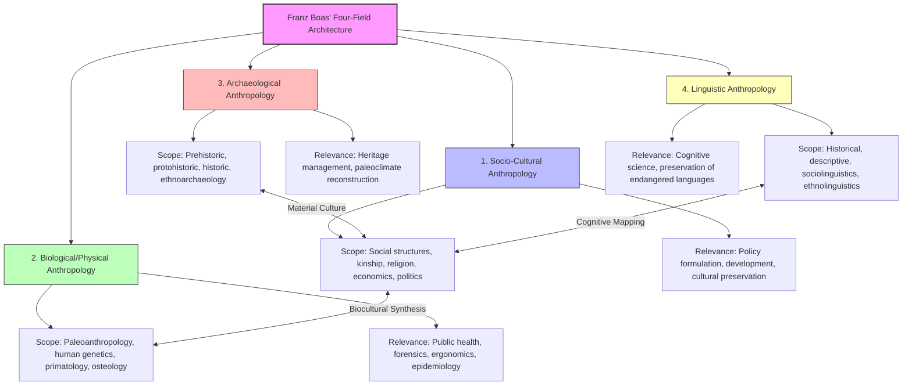
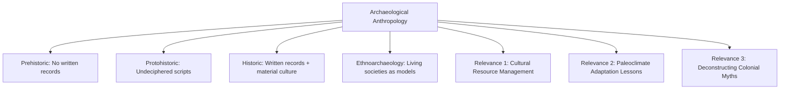

# VALUE ADD: Unit 1.3 - UNITS 1.1-1.3, 8 & 12: RESEARCH METHODS & APPLIED ANTHROPOLOGY
**Date:** May 31, 2026 | **Target:** PAPER I — UNITS 1.1-1.3, 8 & 12: RESEARCH METHODS & APPLIED ANTHROPOLOGY
**Syllabus Mapping:** Unit 1.3

# UNIT 1.3: MAIN BRANCHES OF ANTHROPOLOGY, THEIR SCOPE AND RELEVANCE

---

## I. THE FOUR-FIELD ARCHITECTURE: HIGH-YIELD REVISION MATRIX

The four-field approach, institutionalized by **Franz Boas** ("the Father of American Anthropology"), conceptualizes anthropology as an integrated science. Below is a high-yield mapping of the four main branches, their sub-disciplines, scope, and contemporary relevance.



| Branch | Core Scope & Sub-disciplines | Key Thinkers | Contemporary Relevance & Applied Frontiers |
| :--- | :--- | :--- | :--- |
| **1. Socio-Cultural Anthropology** | • **Scope:** Study of social institutions, kinship, political systems, economic behavior, and belief systems.<br>• **Sub-disciplines:** Economic, Political, Medical, Ecological, and Psychological Anthropology. | • **Franz Boas**<br>• **Bronislaw Malinowski**<br>• **Clifford Geertz** | • **Policy Formulation:** Designing culturally sensitive development programs.<br>• **Corporate Anthropology:** User-experience (UX) research (e.g., Intel, Microsoft).<br>• **Conflict Resolution:** Navigating ethnic and tribal disputes. |
| **2. Biological / Physical Anthropology** | • **Scope:** Human evolution, biological variation, genetic adaptations, and non-human primate behavior.<br>• **Sub-disciplines:** Paleoanthropology, Primatology, Human Genetics, Forensic Anthropology, and Somatometry. | • **Sherwood Washburn** (pioneered "New Physical Anthropology")<br>• **Rebecca Cann** (Mitochondrial Eve) | • **Public Health:** Epidemiological studies (e.g., genetic predisposition to diseases).<br>• **Ergonomics:** Designing defense equipment, cockpits, and workspaces.<br>• **Forensics:** Crime scene investigation and disaster victim identification. |
| **3. Archaeological Anthropology** | • **Scope:** Reconstruction of past lifeways, technologies, and social structures through material remains.<br>• **Sub-disciplines:** Prehistoric, Protohistoric, Historic, Marine, and Ethnoarchaeology. | • **Lewis Binford** (Processual Archaeology)<br>• **Ian Hodder** (Post-Processual Archaeology) | • **Cultural Resource Management (CRM):** Preserving heritage sites during urban development.<br>• **Paleoclimatology:** Understanding how past civilizations adapted to or collapsed under climate change. |
| **4. Linguistic Anthropology** | • **Scope:** Study of language as a cultural resource and tool, shaping social life and cognitive worldviews.<br>• **Sub-disciplines:** Descriptive, Historical, Ethnolinguistics, and Sociolinguistics. | • **Edward Sapir**<br>• **Benjamin Lee Whorf**<br>• **Dell Hymes** | • **Language Revitalization:** Documenting and preserving endangered indigenous languages.<br>• **Cognitive Science:** Understanding how language structures human thought and AI natural language processing. |

---

## II. THE BIOCULTURAL SYNTHESIS: BRIDGING THE BRANCHES

The ultimate strength of Anthropology lies in its **biocultural perspective**—the mutual, interactive evolution of human biology and culture. Biology does not exist in a cultural vacuum, nor does culture exist independently of biological constraints.


### High-Yield Biocultural Case Studies

#### 1. Sickle Cell Anemia and Yam Agriculture (West Africa)
* **The Cultural Practice:** Agricultural expansion (specifically slash-and-burn cultivation of yams) by West African populations created standing pools of water.
* **The Biological Consequence:** These pools became breeding grounds for *Anopheles* mosquitoes, the vector for malaria.
* **The Genetic Adaptation:** Individuals carrying the heterozygous sickle-cell trait ($HbA/HbS$) possessed a biological resistance to malaria. This genetic mutation was selected for and maintained in the gene pool due to the cultural shift in subsistence strategies.
* **Thinker Link:** **Frank Livingstone (1958)**, who famously stated, *"Natural selection operates on genes, but it is culture that sets the stage."*

#### 2. Lactase Persistence and Pastoralism
* **The Cultural Practice:** The domestication of dairy animals (pastoralism) in Northern Europe and parts of East Africa.
* **The Biological Consequence:** In most mammals, the gene that produces the enzyme lactase (which breaks down lactose in milk) switches off after weaning. However, in pastoralist societies, a genetic mutation arose and spread rapidly that kept the lactase gene active into adulthood (**lactase persistence**).
* **The Synthesis:** This is a classic example of **gene-culture coevolution**, where a cultural innovation (dairying) directly drove a biological genetic adaptation.

---

## III. VALUE-ADD CASE STUDIES BY BRANCH

To score high in Paper I, answers must move beyond theoretical definitions and incorporate empirical, real-world case studies.

### 1. Socio-Cultural Anthropology: The "Anti-Politics Machine"
* **Researcher:** James Ferguson (1990)
* **Context:** A study of the Canadian-funded Thaba-Tseka development project in Lesotho.
* **Findings:** Ferguson demonstrated that international development agencies viewed Lesotho through a generic, apolitical lens, ignoring local land tenure systems and political realities. The project failed because it treated a political-economic problem as a mere technical one.
* **Syllabus Relevance:** Illustrates the **relevance of socio-cultural anthropology** in exposing the flaws of top-down, ethnocentric development models.

### 2. Biological Anthropology: Epigenetics and Historical Trauma
* **Researcher:** Amy Non (2016) / Clarence Gravlee (2009)
* **Context:** Studies on the health disparities (e.g., hypertension, low birth weight) among African Americans.
* **Findings:** Gravlee showed that "race" is not a valid biological category, but racism has real biological consequences. Systemic discrimination and socioeconomic stressors alter gene expression (epigenetics), leading to chronic health issues.
* **Syllabus Relevance:** Demonstrates how **biological anthropology** uses genetic and physiological data to dismantle scientific racism and address public health crises.

### 3. Archaeological Anthropology: The Garbology Project
* **Researcher:** William Rathje (University of Arizona, 1970s–2000s)
* **Context:** Analyzing modern household waste (landfills) using archaeological excavation methods.
* **Findings:** Rathje discovered a massive discrepancy between what people *reported* consuming in surveys (e.g., eating healthy, drinking less alcohol) and what their actual garbage revealed (**the "lean-cuisine" vs. "beer-can" paradox**). It also revealed that paper and plastic biodegrade much slower in landfills than previously assumed.
* **Syllabus Relevance:** Demonstrates the **scope of archaeological methods** applied to contemporary societies to understand modern consumption, waste management, and environmental degradation.

### 4. Linguistic Anthropology: "Wisdom Sits in Places"
* **Researcher:** Keith Basso (1996)
* **Context:** Ethnographic study of the Western Apache of Cibecue, Arizona.
* **Findings:** Basso explored how the Apache use place-names to encode moral lessons, historical narratives, and cultural values. Speaking place-names is a way of "doing" moral philosophy and maintaining mental health within the community.
* **Syllabus Relevance:** Highlights the **relevance of linguistic anthropology** in showing how language, landscape, and cultural identity are inextricably linked.

---

## IV. THINKER & CONCEPT REFERENCE SHEET

Use these precise associations to elevate the academic tone of your answers:

```
[Franz Boas] ──► Formulated the Four-Field Approach to combat unilinear evolutionary bias.
[Sherwood Washburn] ──► Shifted Physical Anthropology from static measurement (craniometry) to dynamic evolutionary processes (genetics, behavior).
[Lewis Binford] ──► Introduced "Processual Archaeology" (New Archaeology) to make the discipline an objective, explanatory science.
[Dell Hymes] ──► Developed the concept of "Communicative Competence," arguing that language must be studied in its social context, not just its grammatical structure.
```

---

## V. HIGH-SCORING ANSWER BLUEPRINTS (UNIT 1.3)

---

### Blueprint 1: "Discuss the biocultural nature of anthropology." [15 Marks / 250 Words]

* **Introduction:** Define anthropology's unique position at the intersection of the natural sciences and the humanities. Introduce the **biocultural approach**—the perspective that recognizes the deep, dialectical relationship between human biology and culture.
* **The Biocultural Framework:**
  * Explain that biology provides the physical architecture (e.g., bipedalism, large brain, vocal tract) that makes culture possible.
  * Explain that culture, in turn, acts as a primary non-biological adaptation strategy, which alters the environment and creates new selective pressures on human biology.
* **Empirical Evidence (The Core Body):**
  * *Case Study 1 (Genetic Adaptation):* Frank Livingstone’s study on **Sickle Cell Anemia and Yam Agriculture** in West Africa. Detail how cultural slash-and-burn agriculture led to genetic selection for the heterozygous $HbA/HbS$ trait.
  * *Case Study 2 (Physiological Adaptation):* **Lactase Persistence** in pastoralist populations of Northern Europe and East Africa (gene-culture coevolution).
  * *Case Study 3 (Modern Epigenetics):* Clarence Gravlee’s work on how the cultural construct of **racism** translates into biological pathologies (hypertension, cardiovascular disease) in marginalized populations.
* **Methodological Significance:** Discuss how this synthesis prevents the traps of **biological determinism** (e.g., scientific racism) and **cultural reductionism**. It requires physical and socio-cultural anthropologists to collaborate.
* **Conclusion:** Conclude with a strong synthesis statement: Human beings are not purely biological organisms, nor are they purely cultural actors; we are **biocultural syntheses**. Anthropology is the only discipline equipped with the holistic toolkit to study this dual nature.

---

### Blueprint 2: "Examine the scope and relevance of Archaeological Anthropology in reconstructing past human behavior." [15 Marks / 250 Words]



* **Introduction:** Define Archaeological Anthropology as the branch that reconstructs, describes, and interprets past human behavior, technologies, and cultural patterns through the systematic analysis of material remains (artifacts, ecofacts, features).
* **The Expanding Scope:**
  * *Temporal Dimension:* Spans from the earliest stone tools (Oldowan, ~3.3 million years ago) to modern industrial waste (Garbology).
  * *Sub-disciplinary Scope:*
    * **Prehistoric Archaeology:** Reconstructing lifeways of societies without written records.
    * **Protohistoric & Historic Archaeology:** Complementing written texts with material evidence (e.g., Indus Valley Civilization).
    * **Ethnoarchaeology:** Studying living societies to draw analogies for past material remains (e.g., studying modern hunter-gatherer tool-use to understand Paleolithic sites).
* **Methodological Evolution:** Mention the shift from descriptive antiquarianism to **Processual Archaeology (Lewis Binford)**, which sought to explain cultural processes using the scientific method, and later **Post-Processual Archaeology (Ian Hodder)**, which emphasized subjective meaning and agency.
* **Modern Relevance:**
  * *1. Climate Change Adaptation:* Studying how past civilizations (e.g., Maya, Harappans) responded to ecological shifts, offering lessons for modern climate crises.
  * *2. Cultural Resource Management (CRM):* Preserving heritage sites against rapid urbanization and industrialization.
  * *3. Deconstructing Colonial Myths:* Providing material evidence of advanced pre-colonial societies, restoring historical agency to indigenous populations.
* **Conclusion:** Archaeological anthropology is not merely about excavating the dead; it is a vital science that uses the material past to understand the human present and navigate the ecological future.