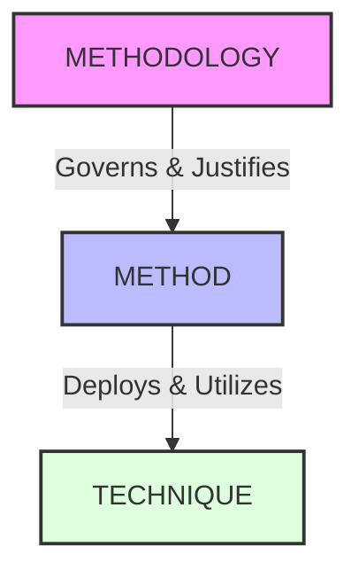
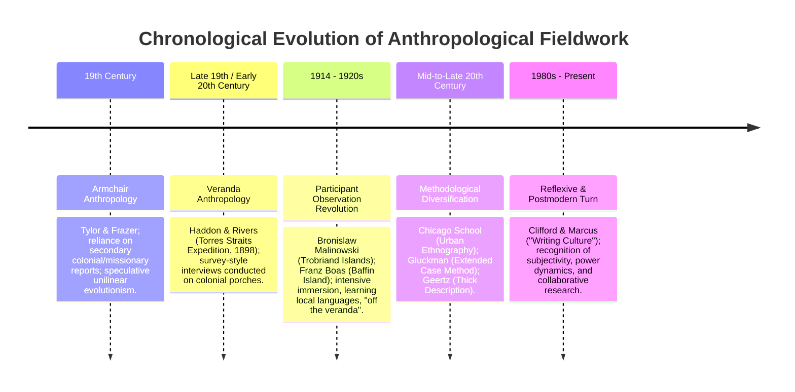
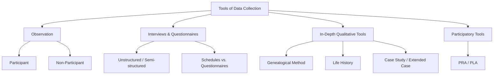

# VALUE ADD: Unit 8 - UNITS 1.1-1.3, 8 & 12: RESEARCH METHODS & APPLIED ANTHROPOLOGY
**Date:** June 02, 2026 | **Target:** PAPER I — UNITS 1.1-1.3, 8 & 12: RESEARCH METHODS & APPLIED ANTHROPOLOGY
**Syllabus Mapping:** Unit 8

# UNIT 8: RESEARCH METHODS IN ANTHROPOLOGY

---

## I. EPISTEMOLOGICAL FOUNDATIONS & DISTINCTIONS

Anthropological research design is anchored in three distinct levels of inquiry: **Technique**, **Method**, and **Methodology**. Confusing these terms is a common error; maintaining a clear distinction is vital for methodological rigor.



### 1. Conceptual Triad: Technique, Method, and Methodology

| Dimension | Technique | Method | Methodology |
| :--- | :--- | :--- | :--- |
| **Definition** | The specific, physical tools and behavioral procedures used to gather raw data. | The systematic, logical plan or mode of inquiry used to conduct research. | The overarching theoretical, philosophical, and epistemological framework that guides the research design. |
| **Nature** | Operational and mechanical. | Tactical and procedural. | Strategic and philosophical. |
| **Examples** | Taking physical measurements with anthropometric calipers; recording an interview on a digital device; drawing a kinship chart on paper. | The Genealogical Method; the Case Study Method; the Extended Case Method; Participant Observation. | Positivism; Interpretivism/Phenomenology; Historical Materialism; Postmodernism/Reflexive Anthropology. |
| **Key Question** | *How* is the specific data point captured? | *What* systematic pathway is followed to collect and organize the data? | *Why* is this pathway valid, and what constitutes "truth" or "knowledge" in this study? |

### 2. Epistemological Paradigms Shaping Anthropological Research

The choice of **Methodology** dictates the **Methods** and **Techniques** employed:

* **Positivism (Quantitative/Empirical):** Assumes an objective, external reality that can be measured, quantified, and generalized. 
  * *Methods:* Structured surveys, anthropometry, statistical modeling.
  * *Techniques:* Closed-ended questionnaires, sliding scales, physical calipers.
* **Interpretivism (Qualitative/Hermeneutic):** Assumes reality is socially constructed and subjective. Pioneered by **Clifford Geertz**, it seeks to understand the "insider's point of view" (*emic*) through the interpretation of symbols and meanings.
  * *Methods:* Participant observation, deep unstructured interviews, life histories.
  * *Techniques:* Open-ended field notes, audio recordings of narratives.
* **Critical & Postmodernist Methodology:** Questions the power dynamics inherent in research. It rejects the notion of a value-free, objective researcher, advocating instead for **reflexivity** and **polyvocality** (multiple native voices).
  * *Methods:* Collaborative ethnography, experimental writing, participatory action research.
  * *Techniques:* Shared diary writing, community-led video documentation.

---

## II. THE EVOLUTION OF FIELDWORK TRADITION

The fieldwork tradition is the defining hallmark of anthropology. It evolved from speculative, secondary accounts to immersive, reflexive, and collaborative engagements.



### 1. Armchair Anthropology (Late 19th Century)
* **Key Figures:** Edward Burnett Tylor, James George Frazer.
* **Characteristics:** Researchers did not travel. They analyzed secondary data (memoirs, colonial administrative records, missionary letters) to construct grand, speculative, universal evolutionary schemes (e.g., Tylor's evolution of religion: Animism $\rightarrow$ Polytheism $\rightarrow$ Monotheism).
* **Limitations:** Extreme ethnocentrism, unreliable data, and a lack of contextual understanding.

### 2. Veranda Anthropology (Transition Phase)
* **Key Figures:** W.H.R. Rivers, Alfred Cort Haddon (Torres Straits Expedition, 1898).
* **Characteristics:** Anthropologists traveled to the field but remained physically and socially segregated from the community. They lived in colonial bungalows or mission stations and summoned native informants to their verandas for structured interviews.
* **Limitations:** Artificial interview settings, reliance on bilingual translators, and an inability to observe natural, daily social interactions.

### 3. The Participant Observation Revolution (Early 20th Century)
* **Key Figures:** Bronislaw Malinowski (*Argonauts of the Western Pacific*, 1922), Franz Boas (Baffin Island, Kwakiutl research).
* **Malinowski's Three Foundations of Fieldwork:**
  1. **Anatomy of Culture:** Charting the organization of the tribe and the anatomy of its culture through systematic, concrete documentation.
  2. **Imponderabilia of Actual Life:** Recording the subtle, routine behaviors of daily life (e.g., cooking, working, conversing) through close, continuous observation.
  3. **Corpus Inscriptionum:** Collecting native utterances, texts, folklore, and magical formulae in the local language to capture the native's subjective worldview (*the emic perspective*).
* **Methodological Shift:** The anthropologist must "pitch their tent" in the village, learn the native language, and live as a participant-observer for an extended period (1–2 years).

### 4. The Reflexive & Postmodern Turn (1980s–Present)
* **Key Figures:** James Clifford, George Marcus (*Writing Culture*, 1986), Paul Rabinow (*Reflections on Fieldwork in Morocco*, 1977).
* **Characteristics:** Rejects the positivist claim that an ethnographer can write an objective, value-free account of another culture. It emphasizes **reflexivity**—the explicit self-examination of how the researcher's gender, race, class, and presence shape the data collected.
* **Key Concepts:**
  * **Intersubjectivity:** Anthropological knowledge is not "discovered" lying around; it is co-produced through the social interactions between the researcher and the informant.
  * **Polyvocality:** Including multiple, unedited native voices directly in the ethnographic text, rather than filtering everything through the authoritative voice of the anthropologist.

---

## III. DEEP-DIVE: TOOLS OF DATA COLLECTION

Anthropologists utilize a diverse toolkit of data collection techniques, selecting and combining them based on the research question (**triangulation**).



---

### 1. Observation: Participant vs. Non-Participant

Observation is the systematic viewing and recording of events, behaviors, and artifacts in their natural social setting.

```
+-------------------------------------------------------------------------+
|                          OBSERVATION SPECTRUM                           |
|                                                                         |
|  [Complete Participant] <---> [Participant-Observer] <---> [Observer]   |
|  (High empathy/rapport;       (Standard anthropological    (Objective;  |
|   risk of "going native")      balance: Emic + Etic)        detached)   |
+-------------------------------------------------------------------------+
```

* **Participant Observation:**
  * *Mechanism:* The researcher actively participates in the daily life, rituals, and economic activities of the community while maintaining a systematic mental and written record of observations.
  * *Merits:* High internal validity; bridges the gap between what people *say* they do and what they *actually* do; builds deep rapport.
  * *Demerits:* Highly subjective; prone to the **Hawthorne Effect** (informants altering behavior due to being observed); risk of **"Going Native"** (losing scientific objectivity by over-identifying with the host community); difficult to replicate.
* **Non-Participant Observation:**
  * *Mechanism:* The researcher remains a detached, passive observer of social phenomena (e.g., sitting at the back of a village council meeting without speaking).
  * *Merits:* Minimizes the researcher's direct influence on the event; allows for more structured, systematic recording.
  * *Demerits:* Lacks the empathetic depth of participant observation; misses the subjective meanings behind observed actions.

---

### 2. Interview: Structured, Semi-Structured, and Unstructured
An interview is a directed conversation aimed at gathering specific information.

* **Structured Interview:** Uses a rigid, predetermined set of questions asked in a fixed order.
  * *Best for:* Gathering standardized, comparable demographic or economic data.
* **Semi-Structured Interview:** Guided by an "interview guide" containing key themes, but allows the researcher the flexibility to probe deeper based on the respondent's answers.
  * *Best for:* Balancing thematic focus with qualitative depth.
* **Unstructured Interview:** A free-flowing, open-ended conversation guided by the informant's narrative flow, with minimal intervention from the researcher.
  * *Best for:* Exploratory research and understanding complex personal worldviews.

---

### 3. Schedules vs. Questionnaires
These two tools are often confused, but they differ fundamentally in their administration and suitability.

| Feature | Schedule | Questionnaire |
| :--- | :--- | :--- |
| **Administration** | Filled out by the **researcher** during a face-to-face interview with the respondent. | Filled out independently by the **respondent** (self-administered). |
| **Literacy Requirement** | Can be administered to non-literate populations (ideal for traditional tribal/rural fieldwork). | Requires the respondent to be literate. |
| **Response Rate** | Very high (since the researcher is present to guide the process). | Often low (relies on the respondent's motivation to complete and return it). |
| **Clarification** | The researcher can clarify ambiguous questions, reducing misunderstandings. | No opportunity for real-time clarification; can lead to misinterpretation. |
| **Cost & Reach** | Time-consuming and expensive; limits the sample size. | Cost-effective; can be distributed widely (via mail or digital platforms). |

---

### 4. The Case Study & The Extended Case Method

* **The Case Study Method:**
  * *Definition:* An in-depth, holistic investigation of a single social unit (an individual, a family, an institution, or a single event) to understand the complex interplay of variables.
  * *Merits:* Provides rich, contextualized, and detailed qualitative data.
  * *Demerits:* Findings cannot be statistically generalized to a larger population.
* **The Extended Case Method (Manchester School):**
  * *Pioneered by:* **Max Gluckman** and developed by **Jaap van Velsen**.
  * *Mechanism:* Instead of looking at a static snapshot of a culture, this method traces a specific social conflict, dispute, or "social drama" over a prolonged period.
  * *Significance:* It analyzes how individuals manipulate social rules during conflicts, revealing the dynamic, changing nature of social structures rather than presenting them as static systems.

---

### 5. The Genealogical Method
* **Pioneered by:** **W.H.R. Rivers** (1900, Torres Straits Expedition).
* **Definition:** A systematic technique for recording and mapping kinship, descent, marriage alliances, and demographic data across multiple generations (typically at least 3–4) using standardized symbols.

```
      STANDARD GENEALOGICAL SYMBOLS
      
         [Triangle] = Male         [Circle] = Female
         
         [Triangle] === [Circle]   (Marriage / Alliance)
                     |
             +-------+-------+
             |               |
        [Triangle]       [Circle]  (Offspring / Descent)
```

* **Anthropological Utility:**
  * *Social Structure:* Maps the core organizing principles of simple, non-state societies where kinship dictates political alliances, economic inheritance, and ritual obligations.
  * *Demographic Tracking:* Tracks migration patterns, fertility rates, and mortality rates within a lineage.
  * *Physical Anthropology:* Essential for tracing the inheritance of genetic disorders, blood groups, and dermatoglyphic patterns across generations.

---

### 6. Life History
* **Definition:** A qualitative method that records the detailed, biographical narrative of an individual's life, either in whole or in part, to understand how macro-historical and cultural shifts are experienced at the micro-level.
* **Key Examples:**
  * **Leo Simmons'** *Sun Chief* (1942): The life history of a Hopi Indian, illustrating the psychological and cultural conflicts of living between Native American and white American worlds.
  * **Oscar Lewis'** *The Children of Sánchez* (1961): Used multiple life histories within a single family to illustrate the "culture of poverty" in urban Mexico.
* **Utility:** Humanizes ethnographic data, reveals individual agency within structural constraints, and provides a diachronic (historical) perspective on cultural change.

---

### 7. Participatory Rural Appraisal (PRA) & Participatory Learning and Action (PLA)
* **Pioneered by:** **Robert Chambers** (1980s/1990s).
* **Definition:** An approach that shifts the researcher's role from an "extractive expert" to a "facilitator." It empowers local, often non-literate communities to map, analyze, and prioritize their own resources, challenges, and solutions.

```
   TRADITIONAL RESEARCH (Extractive)       PARTICIPATORY RESEARCH (PRA/PLA)
   
     Researcher ---> Extracts Data             Facilitator <---> Community
     (Surveys, Questionnaires)                 (Co-creates maps, analyzes)
```

* **Key Visual Techniques:**
  * **Social Mapping:** Community members draw maps of their village on the ground using local materials (seeds, stones, colored powder) to identify households, water sources, and social boundaries.
  * **Transect Walks:** A collaborative walk through the community's territory with local guides to observe and map ecological zones, land use, and resource distribution.
  * **Seasonal Calendars:** Using charts drawn on the ground to map seasonal variations in rainfall, labor demand, disease outbreaks, and food security.
  * **Matrix Ranking:** Using stones or seeds to rank priorities, such as comparing different crop varieties or identifying the most pressing development needs.
* **Significance:** Demystifies the research process, ensures high community ownership of development projects, and bypasses literacy barriers.

---

## IV. QUALITATIVE VS. QUANTITATIVE ANALYSIS & CAQDAS

Modern anthropology integrates both qualitative and quantitative data to build a comprehensive, holistic understanding of human societies.

### 1. Comparative Matrix: Qualitative vs. Quantitative Analysis

| Dimension | Qualitative Analysis | Quantitative Analysis |
| :--- | :--- | :--- |
| **Epistemological Basis** | Interpretivism, Hermeneutics, Phenomenology. | Positivism, Empiricism. |
| **Data Type** | Unstructured text, field notes, audio, video, images. | Numerical data, measurements, counts, statistics. |
| **Sampling Strategy** | Purposive, small-scale, non-probability sampling. | Random, representative, large-scale probability sampling. |
| **Analytical Focus** | Identifying themes, meanings, symbols, and context. | Identifying statistical correlations, patterns, and causal relationships. |
| **Objective** | Deep, contextual understanding (*Thick Description*). | Generalizability, replicability, and predictive power. |
| **Key Methods** | Thematic analysis, narrative analysis, discourse analysis. | Descriptive statistics, regression analysis, hypothesis testing. |

---

### 2. Computer-Assisted Qualitative Data Analysis Software (CAQDAS)

As qualitative datasets (field notes, interview transcripts, audio recordings) grow larger, anthropologists rely on CAQDAS to organize, code, and analyze their data systematically.

```
         THE CAQDAS WORKFLOW
         
   [ Raw Field Data ] (Transcripts, Audio, Images)
          |
          v
   [ Data Import & Organization ] (Into NVivo / ATLAS.ti)
          |
          v
   [ Coding Process ] 
     ├── Open Coding (Identifying initial concepts)
     └── Axial Coding (Relating codes to categories)
          |
          v
   [ Thematic & Network Analysis ] (Visualizing relationships)
          |
          v
   [ Interpretation & Theory Generation ]
```

#### Key CAQDAS Platforms & Anthropological Utility:
* **NVivo:**
  * *Strengths:* Highly structured, database-driven, and excellent for managing massive datasets.
  * *Utility:* Allows researchers to run complex queries (e.g., matrix coding queries comparing themes across different demographic groups) and track coding density.
* **ATLAS.ti:**
  * *Strengths:* Highly visual and intuitive interface.
  * *Utility:* Excellent for mapping conceptual networks. It allows researchers to visually link codes, quotes, and memos on a digital canvas, making it ideal for grounded theory approaches.
* **MAXQDA:**
  * *Strengths:* Strong mixed-methods integration.
  * *Utility:* Seamlessly links qualitative codes with quantitative demographic variables, facilitating mixed-methods research designs.

> [!WARNING]
> **The CAQDAS Misconception:** CAQDAS software *does not* analyze data or generate theories on its own. It serves as an advanced organizational tool; the interpretive work of coding, identifying themes, and generating cultural insights remains entirely with the anthropologist.

---

## V. THINKERS, MONOGRAPHS, AND CASE STUDIES DIRECTORY

Use this directory to ground your exam answers in classic and contemporary anthropological scholarship.

| Thinker | Monograph / Study | Tool / Method Highlighted | Key Contribution / Value-Add |
| :--- | :--- | :--- | :--- |
| **Bronislaw Malinowski** | *Argonauts of the Western Pacific* (1922) | Participant Observation | Established the modern fieldwork tradition; emphasized learning the local language and capturing the "native's point of view." |
| **W.H.R. Rivers** | *The Todas* (1906) | Genealogical Method | Demonstrated how kinship charts can map social structures, inheritance, and ritual obligations in non-literate societies. |
| **Margaret Mead** | *Coming of Age in Samoa* (1928) | Comparative Method & Unstructured Interviews | Used qualitative fieldwork to challenge Western assumptions about the universality of adolescent stress, sparking debates on cultural determinism. |
| **Clifford Geertz** | *The Interpretation of Cultures* (1973) | Thick Description (Interpretive Method) | Argued that ethnography is an interpretive endeavor akin to reading a manuscript; analyzed the Balinese cockfight as a complex cultural text. |
| **Max Gluckman** | *Analysis of a Social Situation in Modern Zululand* (1940) | Extended Case Method / Social Drama | Shifted focus from static structural-functionalism to the study of conflict, social change, and individual agency. |
| **Robert Chambers** | *Whose Reality Counts? Putting the First Last* (1997) | PRA / PLA | Revolutionized development anthropology by introducing participatory visual tools that empower local communities. |
| **Nancy Scheper-Hughes** | *Death Without Weeping* (1992) | Militant Anthropology / Reflexive Fieldwork | Challenged traditional notions of value-free objectivity, arguing that anthropologists must act as ethical and political witnesses in the communities they study. |
| **Paul Rabinow** | *Reflections on Fieldwork in Morocco* (1977) | Reflexive Ethnography | Demystified the fieldwork process by critically analyzing the power dynamics, negotiations, and subjective relationships between the researcher and their informants. |

---

## VI. MODEL ANSWER BLUEPRINTS & HIGH-SCORING DIAGRAMS

---

### PYQ 1: Distinguish between technique, method, and methodology. How does this distinction shape anthropological research design? [2023, 15 Marks]

#### 1. Introduction
* Define the three terms briefly using an architectural or scientific analogy.
* State that the distinction is not merely semantic but epistemological, as it determines how research questions are framed, how data is gathered, and how knowledge is validated.

#### 2. The Conceptual Distinctions (The Core Triad)
* Present a comparative table detailing **Technique**, **Method**, and **Methodology** across key dimensions (Definition, Nature, Examples, and Key Questions).
* Draw a hierarchical diagram showing how Methodology governs Methods, which in turn deploy Techniques.

#### 3. How the Distinction Shapes Research Design
* **Epistemological Alignment:** A researcher's chosen methodology (e.g., Positivism vs. Interpretivism) dictates their methods and techniques.
  * *Example:* If the methodology is **Interpretivism** (Geertz), the method must be **Participant Observation**, and the technique will be **open-ended field notes**. It would be methodologically inconsistent to use a highly structured, quantitative survey to capture deep, symbolic meanings.
* **Ensuring Validity and Reliability:** Understanding these distinctions prevents "methodological opportunism." It ensures that the tools used (techniques) are logically suited to the overall research strategy (method) and theoretical framework (methodology).
* **Triangulation:** A robust research design uses multiple methods and techniques under a single methodology to cross-verify findings, enhancing the validity of the study.

```
                   METHODOLOGICAL ALIGNMENT MATRIX
                   
   Epistemology (Methodology) ---> Strategy (Method) ---> Tool (Technique)
   
   [Positivism] ------------> [Survey Method] ---------> [Structured Questionnaire]
   [Interpretivism] --------> [Ethnography] -----------> [Participant Observation]
```

#### 4. Conclusion
* Summarize that a clear understanding of this triad elevates anthropology from mere travel writing to a rigorous, systematic science. It ensures that the empirical data collected in the field is theoretically grounded and epistemologically sound.

---

### PYQ 2: Discuss the evolution of the fieldwork tradition in anthropology. How did it transform the discipline? [2022, 20 Marks]

#### 1. Introduction
* Define fieldwork as the hallmark methodology of anthropology.
* State that the evolution of fieldwork represents a shift from ethnocentric, speculative theories to immersive, reflexive, and collaborative engagements with human diversity.

#### 2. Chronological Stages of Evolution
* **Armchair Anthropology (Late 19th Century):** Discuss Tylor and Frazer. Highlight their reliance on secondary, biased sources and their speculative, unilinear evolutionary frameworks.
* **Veranda Anthropology (Transition Phase):** Discuss the Torres Straits Expedition (1898) and W.H.R. Rivers. Explain the limitations of interviewing informants on colonial porches, detached from their daily lives.
* **The Participant Observation Revolution (1920s):** Detail Bronislaw Malinowski's breakthrough in the Trobriand Islands. Explain his three methodological pillars: the anatomy of culture, the imponderabilia of actual life, and the corpus inscriptionum. Mention Franz Boas's historical particularism and his insistence on linguistic competence in the field.
* **The Reflexive and Postmodern Turn (1980s–Present):** Discuss the critique of ethnographic authority (*Writing Culture*). Explain how reflexivity, intersubjectivity, and polyvocality transformed the researcher's role from an objective observer to a collaborative partner.

#### 3. How Fieldwork Transformed the Discipline
* **From Speculation to Empiricism:** Fieldwork grounded anthropology in rigorous, empirical data, dismantling speculative theories of racial and cultural hierarchies.
* **The Rise of Cultural Relativism:** Immersive fieldwork forced anthropologists to understand customs from the insider's perspective (*emic*), establishing cultural relativism as a core ethical and theoretical principle of the discipline.
* **Methodological Rigor:** It established participant observation, the genealogical method, and deep qualitative interviewing as standard scientific practices, distinguishing anthropology from sociology and history.
* **Ethical Awakening:** Modern reflexive fieldwork highlighted the power dynamics of research, leading to strict ethical guidelines regarding informed consent, informant anonymity, and collaborative authorship.

#### 4. Conclusion
* Conclude by stating that the evolution of fieldwork reflects the maturation of anthropology. By continuously questioning its own methods and power dynamics, the discipline has transformed from a tool of colonial administration into an empathetic, self-reflexive science of humanity.

---

### PYQ 3: Evaluate the utility of Participatory Rural Appraisal (PRA) and Participatory Learning and Action (PLA) in developmental anthropology. [2020, 15 Marks]

#### 1. Introduction
* Define PRA and PLA as participatory methodologies developed by Robert Chambers in the 1980s and 1990s.
* State that they represent a paradigm shift in developmental anthropology, moving from top-down, extractive research to bottom-up, community-led action.

#### 2. Core Principles of PRA/PLA
* **"Handing over the stick":** The researcher steps back to act as a facilitator, empowering community members to lead the analysis.
* **Visual over Verbal:** Uses visual mediums (maps, diagrams, matrices) drawn on the ground, bypassing literacy barriers and allowing all community members to participate.
* **Triangulation:** Combining multiple participatory techniques (social mapping, transect walks, seasonal calendars) to cross-verify findings.

#### 3. Key Techniques and Their Developmental Utility
* **Social Mapping:**
  * *Utility:* Identifies the spatial distribution of households, resources, and social boundaries. Helps planners locate public services (e.g., wells, schools, clinics) where they are most needed and accessible.
* **Transect Walks:**
  * *Utility:* Provides a collaborative ecological assessment of the community's land, identifying soil erosion, water management issues, and agricultural opportunities.
* **Seasonal Calendars:**
  * *Utility:* Maps seasonal patterns of labor, illness, debt, and food scarcity. This allows development agencies to time interventions effectively (e.g., scheduling health camps during high-risk disease seasons or employment programs during agricultural off-seasons).
* **Matrix Ranking:**
  * *Utility:* Empowers communities to prioritize their own needs or evaluate local resources (e.g., ranking different seed varieties or identifying the most urgent infrastructure projects), ensuring high community ownership.

```
                     PRA/PLA UTILITY CYCLE
                     
   [Community Mapping] ---> [Identify Challenges] ---> [Matrix Ranking]
            ^                                                |
            |                                                v
   [Local Ownership] <--- [Community-Led Action] <--- [Joint Planning]
```

#### 4. Limitations of PRA/PLA
* **Elite Capture:** Local elites may dominate the participatory exercises, silencing marginalized groups (e.g., women, lower castes, or minorities).
* **Superficial Application:** Can be reduced to a quick, superficial checklist by development agencies, ignoring the deep, long-term social dynamics of the community.
* **Lack of Generalizability:** The highly localized, contextual data generated cannot easily be scaled up or generalized for macro-level national planning.

#### 5. Conclusion
* Conclude that despite these limitations, PRA and PLA are indispensable tools in developmental anthropology. They bridge the gap between academic research and practical, ethical development, ensuring that interventions are culturally appropriate, sustainable, and empowering for the host community.