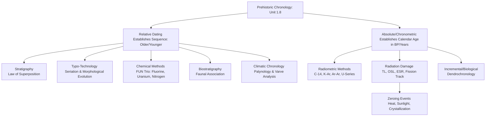

# VALUE ADD: Unit 1.8 - UNITS 1.8 & 9: MISCELLANEOUS PHYSICAL & ARCHAEOLOGICAL TOPICS
**Date:** May 31, 2026 | **Target:** PAPER I — UNITS 1.8 & 9: MISCELLANEOUS PHYSICAL & ARCHAEOLOGICAL TOPICS
**Syllabus Mapping:** Unit 1.8

# UPSC ANTHROPOLOGY PAPER I — UNIT 1.8
## HIGH-YIELD REVISION & VALUE-ADDITION SHEET: PREHISTORIC CHRONOLOGY

---

## I. THE ARCHAEOLOGICAL CHRONOLOGY LANDSCAPE

Prehistoric archaeology relies on reconstructing timeline sequences without written records. Chronology building is divided into **Relative** (ordinal/sequential) and **Absolute** (interval/calendar) methods.



---

## II. ADVANCED RELATIVE DATING METHODS: DEEP-DIVE

### 1. The FUN Trio (Fluorine, Uranium, Nitrogen Dating)
*   **The Principle:** Chemical changes occurring in bone post-burial.
    *   **Fluorine & Uranium:** Absorbed from groundwater into bone apatite over time (increases with age).
    *   **Nitrogen:** Organic collagen content in bone decays over time (decreases with age).
*   **The Utility:** It is a **local relative method**. It cannot compare bones from different geographical regions (due to varying soil chemistry), but it is highly effective for detecting intrusive burials or mixed strata at a single site.

> [!IMPORTANT]
> **Classic Case Study: The Piltdown Man Hoax (1953)**
> *   **The Claim:** Found in Sussex, England (1912), presented as the "missing link" between apes and humans (Eoanthropus dawsoni).
> *   **The Exposure:** Kenneth Oakley applied **Fluorine dating**. The human cranium and orangutan jaw had completely different fluorine concentrations. The jaw was modern, artificially stained, and filed down to mimic ancient wear.

### 2. Palynology (Pollen Analysis)
*   **Pioneered by:** Lennart von Post (1916).
*   **Mechanism:** Pollen grains have a highly resistant outer shell (exine) that preserves well in acidic, anaerobic environments (like peat bogs). By reconstructing past vegetation profiles (pollen zones), archaeologists can correlate archaeological layers with known regional climatic phases (e.g., Holocene warming).

### 3. Varve Analysis (Glacial Clay Varves)
*   **Pioneered by:** Gerard de Geer.
*   **Mechanism:** Measures annual sedimentary deposits in glacial lakes. Coarse, light-colored sediment deposits in summer (high meltwater); fine, dark sediment deposits in winter. One pair of light/dark bands = 1 year (Varve).
*   **Application:** Provides a highly precise regional relative sequence for Northern Europe's deglaciation.

---

## III. ADVANCED ABSOLUTE DATING METHODS: THE "ZEROING EVENT" CONCEPT

For any absolute dating method to work, there must be a **"Zeroing Event"**—a physical or chemical process that resets the atomic clock to zero.

```
+------------------+-------------------------+-----------------------------------------+
|      Method      |      Zeroing Event      |          What is Actually Dated         |
+------------------+-------------------------+-----------------------------------------+
| Radiocarbon      | Death of the organism   | Time elapsed since metabolic intake of  |
| (C-14)           |                         | Carbon ceased.                          |
+------------------+-------------------------+-----------------------------------------+
| Potassium-Argon  | Volcanic eruption       | Time elapsed since lava cooled, trapping |
| (K-Ar)           | (heating & degassing)   | radiogenic Argon gas in crystals.       |
+------------------+-------------------------+-----------------------------------------+
| Thermolumine-    | Firing/Heating          | Time elapsed since a ceramic pot or     |
| scence (TL)      | (> 500°C)               | flint was last heated in a fire.        |
+------------------+-------------------------+-----------------------------------------+
| Optically        | Exposure to sunlight    | Time elapsed since quartz/feldspar      |
| Stimulated (OSL) | (bleaching)             | sediment was last exposed to daylight.  |
+------------------+-------------------------+-----------------------------------------+
```

### 1. Radiocarbon (C-14) Calibration & AMS
*   **The Problem:** The atmospheric concentration of $C^{14}$ has not been constant over time due to fluctuations in Earth's magnetic field and solar activity. Raw radiocarbon years do not equal calendar years.
*   **The Solution (Calibration):** Radiocarbon dates are calibrated using **Dendrochronology** curves (IntCal curves) to yield calibrated dates (cal BC/AD).
*   **AMS (Accelerator Mass Spectrometry):**
    *   *Advantage over conventional C-14:* Instead of measuring beta-particle decay (which requires large samples), AMS directly counts the atoms of $C^{14}$ relative to $C^{12}$ using a particle accelerator.
    *   *Sample size:* Requires micro-samples (milligrams instead of grams), allowing precious artifacts (e.g., the Shroud of Turin, ancient textiles, or tiny charred seeds) to be dated without destruction.

### 2. Argon-Argon ($^{40}Ar/^{39}Ar$) Dating: The K-Ar Upgrade
*   **Why it is superior to K-Ar:** Conventional K-Ar dating requires splitting the sample into two halves to measure Potassium and Argon separately, which can introduce errors if the sample is heterogeneous.
*   **The Mechanism:** $^{40}Ar/^{39}Ar$ dating irradiates the sample in a nuclear reactor, converting stable $^{39}K$ into $^{39}Ar$. Both isotopes are then measured from a single sample using a mass spectrometer.
*   **Application:** Crucial for dating single crystals of volcanic ash associated with early hominin fossils (e.g., dating the *Ardipithecus ramidus* tuffs in Ethiopia).

### 3. Optically Stimulated Luminescence (OSL)
*   **The Principle:** Similar to TL, but the "zeroing event" is **sunlight exposure** (bleaching) rather than heat. Windblown or water-transported sand grains are bleached by the sun, resetting their luminescence clock to zero. Once buried, they accumulate trapped electrons from ambient soil radiation.
*   **Anthropological Value:** Allows the dating of sandy layers where no organic material or pottery is present (e.g., desert dunes, river terraces containing Acheulian handaxes).

### 4. Uranium-Series (U-Th) & Electron Spin Resonance (ESR)
*   **U-Series (Uranium-Thorium):** Dates calcium carbonate deposits (speleothems/stalagmites in caves, shells, coral). It is highly effective for dating cave art by dating the thin calcite flowstone layer overlying the paintings.
*   **ESR:** Measures trapped electrons in tooth enamel. It is non-destructive to the enamel and covers the critical gap in human evolution between 100,000 and 500,000 years ago (dating Neanderthal and early *Homo sapiens* remains).

---

## IV. COMPREHENSIVE METHODOLOGICAL COMPARISON MATRIX

| Method | Material Dated | Effective Range | Limitations / Sources of Error | Key Indian / Global Site Application |
| :--- | :--- | :--- | :--- | :--- |
| **Radiocarbon (C-14 / AMS)** | Organic (Charcoal, bone, shell, wood) | Up to ~50,000 years | • Suess Effect (fossil fuel dilution)<br>• Reservoir effect (marine samples)<br>• Contamination by modern carbon | **Bhimbetka (MP):** Late Mesolithic layers dated using charcoal.<br>**Mehrgarh (Pakistan):** Early Neolithic levels. |
| **Potassium-Argon (K-Ar / Ar-Ar)** | Volcanic rock, tuffs, mica | 100,000 to 4.5 billion years | • Only dates volcanic layers, not the fossils themselves<br>• Argon loss due to weathering | **Olduvai Gorge (Tanzania):** Dated Bed I (*Paranthropus boisei*) to 1.75 Ma.<br>**Jwalapuram (AP):** Toba ash layers. |
| **Thermoluminescence (TL)** | Burnt clay, pottery, burnt flint | 100 to 500,000 years | • Anomalous fading<br>• Difficulty in measuring background soil radiation | **Sanghol (Punjab):** Dating of Harappan and PGW ceramics.<br>**Qafzeh Cave (Israel):** Dated early *H. sapiens* burials to ~92,000 BP. |
| **Optically Stimulated Luminescence (OSL)** | Quartz/Feldspar sediment grains | 100 to 350,000 years | • Incomplete bleaching during transport<br>• Sample must be collected in complete darkness | **Didwana (Rajasthan):** Dated the Middle Paleolithic dune profiles.<br>**Attirampakkam (TN):** Dated post-Acheulian layers. |
| **Uranium-Series (U-Th)** | Calcite flowstone, stalagmites, bone | 1,000 to 500,000 years | • Open-system behavior (uranium leaching in bone) | **Hathnora (Narmada Valley):** Calcite crusts associated with the Narmada hominin skull.<br>**El Castillo Cave (Spain):** Dated cave art to >40,800 BP. |
| **Cosmogenic Nuclide Burial Dating ($^{26}Al/^{10}Be$)** | Quartz-rich stone tools buried in sediment | 100,000 to 5 million years | • Complex mathematical modeling<br>• High cost | **Attirampakkam (TN):** Dated the basal Acheulian layer to **1.51 Million Years Ago**, rewriting South Asian prehistory. |

---

## V. HIGH-YIELD INDIAN CASE STUDIES (UPSC VALUE ADDITION)

To score high in Paper I, Unit 1.8, always ground your theoretical answers in Indian archaeological contexts:

### Case Study 1: Attirampakkam, Tamil Nadu (Shanti Pappu et al.)
*   **The Chronological Challenge:** The site contains a rich Acheulian (Lower Paleolithic) assemblage, but the lack of volcanic ash layers ruled out Potassium-Argon dating.
*   **The Solution:** Researchers applied **Cosmogenic Nuclide Burial Dating** ($^{26}Al/^{10}Be$ in quartz tools) and **post-infrared stimulated luminescence (pIRIR)**.
*   **The Result:** Dated the Acheulian layer to **1.51 ± 0.22 Ma**. This proved that the Acheulian culture in India was contemporaneous with that of Africa and Southern Europe, debunking the "Movius Line" hypothesis which suggested South Asia was culturally retarded.

### Case Study 2: Jwalapuram, Andhra Pradesh (Michael Petraglia et al.)
*   **The Chronological Challenge:** Investigating whether the Youngest Toba Tuff (YTT) volcanic eruption (~74,000 years ago) wiped out hominin populations in India.
*   **The Solution:** **Argon-Argon ($^{40}Ar/^{39}Ar$)** was used to date the volcanic ash layer, while **OSL** was used to date the sand grains immediately below and above the ash layer containing Middle Paleolithic stone tools.
*   **The Result:** The OSL dates proved that hominins survived the super-eruption, as stone tool technologies remained virtually unchanged across the pre- and post-eruption layers.

---

## VI. KEY THINKERS & METHODOLOGICAL TERMINOLOGY

### 1. Pioneer Thinkers

```
+----------------------------+---------------------------------------------------------+
|          Thinker           |                      Contribution                       |
+----------------------------+---------------------------------------------------------+
| Nicholas Steno (1638-1686) | Formulated the Law of Superposition (the foundation of  |
|                            | stratigraphy).                                          |
+----------------------------+---------------------------------------------------------+
| Willard Libby (1908-1980)  | Developed Radiocarbon (C-14) dating (awarded the Nobel  |
|                            | Prize in Chemistry in 1960).                            |
+----------------------------+---------------------------------------------------------+
| Martin Aitken (1922-2017)  | Pioneered the development of Thermoluminescence (TL)    |
|                            | and OSL dating for archaeological materials.            |
+----------------------------+---------------------------------------------------------+
| H.D. Sankalia              | Pioneered the systematic application of stratigraphic   |
|                            | and absolute dating methods to Indian prehistory        |
|                            | (e.g., Nevasa, Maheshwar).                              |
+----------------------------+---------------------------------------------------------+
```

### 2. High-Scoring Terminology
*   **Chronometric Hygiene:** The systematic filtering and rejection of absolute dates that have high margins of error, poor stratigraphic association, or potential sample contamination.
*   **Palimpsest:** An archaeological site where multiple occupational layers have been mixed or compressed into a single stratigraphic unit due to erosion or bioturbation, making relative dating difficult.
*   **Association (Law of Association):** The principle that an artifact is contemporary with the stratigraphic layer and other objects with which it is found, provided the context is undisturbed.
*   **Suess Effect:** The dilution of atmospheric $C^{14}$ concentration caused by the burning of fossil fuels (which contain no $C^{14}$) since the Industrial Revolution. This is a critical factor in radiocarbon calibration.

---

## VII. UPSC MAINS PRACTICE QUESTIONS & MODEL FRAMEWORKS

### PYQ: "Critically evaluate the role of absolute dating methods in reconstructing human evolutionary history." [15 Marks]

#### Model Framework:
1.  **Introduction:**
    *   Define absolute (chronometric) dating.
    *   State its core premise: providing a calendar age in years BP, independent of cultural typologies.
2.  **Body Paragraph 1: The Evolutionary Milestones & Corresponding Methods:**
    *   *Early Hominin Speciation (7 Ma to 1 Ma):* Discuss **K-Ar and Ar-Ar** dating of volcanic tuffs in the East African Rift Valley (e.g., Lucy, Ardi).
    *   *Middle Pleistocene Transition (500 kya to 100 kya):* Discuss **ESR and U-Series** dating of tooth enamel and cave deposits, bridging the gap where C-14 is inapplicable (e.g., dating Neanderthals and Denisovans).
    *   *Modern Human Emergence & Upper Paleolithic (50 kya to present):* Discuss **C-14 and AMS** dating of organic materials, tracking the dispersal of *Homo sapiens* out of Africa.
3.  **Body Paragraph 2: Methodological Limitations & Critical Challenges:**
    *   *Contextual Disconnect:* Dating a volcanic layer or a sediment grain is not the same as dating the fossil itself (the problem of stratigraphic association).
    *   *The "Radiocarbon Barrier":* The 50,000-year limit of C-14 creates a "blind spot" for late Neanderthal-modern human interactions, now resolved by ultrafiltration and AMS.
    *   *Requirement of Chronometric Hygiene:* The necessity of cross-validating absolute dates with relative stratigraphy to avoid anomalies.
4.  **Conclusion:**
    *   Conclude with the concept of **"Biocultural Chronology"**—how absolute dating transformed physical anthropology from a descriptive science of skulls to a dynamic, rate-of-evolution science. Mention the Indian context (e.g., Attirampakkam) to show how absolute dating reshaped global models of hominin migration.