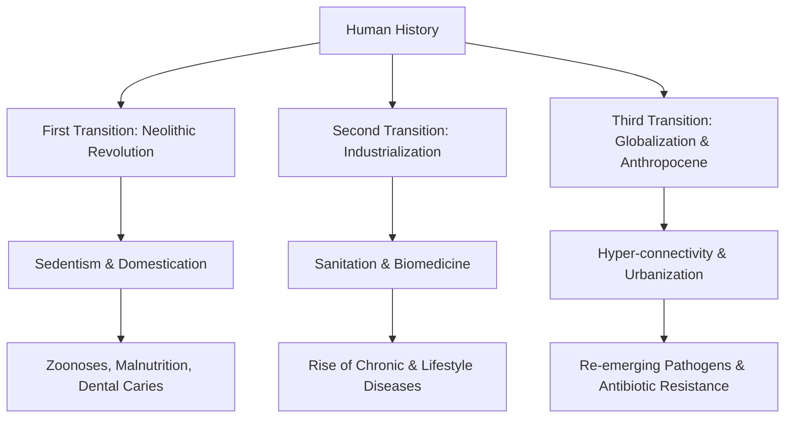

# VALUE ADD: Unit 9.8 - UNITS 1.8 & 9: MISCELLANEOUS PHYSICAL & ARCHAEOLOGICAL TOPICS
**Date:** June 08, 2026 | **Target:** PAPER I — UNITS 1.8 & 9: MISCELLANEOUS PHYSICAL & ARCHAEOLOGICAL TOPICS
**Syllabus Mapping:** Unit 9.8

# UNIT 9.8: EPIDEMIOLOGICAL ANTHROPOLOGY

---

## I. FOUNDATIONS OF EPIDEMIOLOGICAL ANTHROPOLOGY

Epidemiological anthropology is a specialized subfield of biological and medical anthropology. It investigates how cultural practices, ecological settings, socioeconomic structures, and evolutionary histories interact to shape the distribution, experience, and outcomes of health and disease in human populations.

```
                  ┌──────────────────────────┐
                  │   ECOLOGICAL SETTING     │
                  │ (Climate, Vector Niches) │
                  └────────────┬─────────────┘
                               │
                               ▼
  ┌──────────────────┐    Biocultural   ┌──────────────────┐
  │ BIOLOGY & GENES  ├──────────────────┤ CULTURE & SOCIETY│
  │ (Immunity, HbAS) │   Interaction    │ (Diet, Taboos)   │
  └──────────────────┘                  └──────────────────┘
                               ▲
                               │
                  ┌────────────┴─────────────┐
                  │   POLITICAL ECONOMY      │
                  │ (Poverty, Healthcare)    │
                  └──────────────────────────┘
```

### 1. The Triad of Health: Disease, Illness, and Sickness
To analyze health patterns, anthropologists reject a purely biomedical definition of pathology. **Arthur Kleinman (1980)** formulated a critical tripartite distinction:

*   **Disease (The Etic Perspective):** The objective, biological malfunctioning of cells, tissues, or physiological systems. It is diagnosed by clinical signs, laboratory markers, and biomedical criteria (e.g., infection by *Mycobacterium tuberculosis*).
*   **Illness (The Emic Perspective):** The subjective, personal experience of ill-health. It is shaped by cultural interpretations, personal narratives, and psychological responses to symptoms (e.g., feeling weak, socially isolated, or spiritually cursed).
*   **Sickness (The Macro-Social Perspective):** The social identity and role assigned to an individual by their community. It dictates how society expects the sick person to behave and how others should interact with them (e.g., being exempted from work or facing social stigma).

### 2. The Biocultural Approach
Championed by **George Armelagos** and **Ronald Barrett**, the biocultural approach asserts that human disease cannot be understood solely through biological pathogens. Instead, physical health is the product of biological vulnerability modified by cultural behaviors, political-economic structures, and environmental pressures.

---

## II. THE EPIDEMIOLOGICAL TRANSITION THEORY

Originally proposed by demographer **Abdel Omran (1971)**, the Epidemiological Transition Theory describes the shifting patterns of mortality, life expectancy, and disease profiles as human societies transition from pre-industrial to modern industrial states. 

Anthropologists have expanded Omran’s model into **Three Distinct Transitions** that trace human cultural evolution:



### 1. The First Transition: The Neolithic Revolution ($\sim 10,000$ BP)
The shift from mobile foraging (hunting and gathering) to sedentary agriculture and animal domestication fundamentally altered human disease ecology.

*   **Zoonotic Spillover:** Domestication brought humans into constant, close contact with animals, allowing pathogens to jump species barriers.
    *   *Measles and Smallpox* evolved from bovine pathogens (rinderpest/cowpox).
    *   *Influenza* emerged from domestic fowl and swine.
*   **Sedentism and Sanitation:** Permanent settlements led to the accumulation of human waste and stagnant water, creating breeding grounds for waterborne pathogens (cholera, dysentery) and vectors (malaria-carrying mosquitoes).
*   **Nutritional Decline:** The transition from a diverse hunter-gatherer diet to high-carbohydrate monoculture (wheat, rice, maize) caused severe micronutrient deficiencies. Skeletal remains from this era show high rates of:
    *   *Porotic hyperostosis* and *cribra orbitalia* (indicators of iron-deficiency anemia).
    *   *Enamel hypoplasia* (arrested tooth development due to childhood infection or starvation).
    *   *Dental caries* (cavities caused by starchy diets).

### 2. The Second Transition: The Industrial Era to Late 20th Century
Characterized by the rise of public sanitation, clean water infrastructure, immunization, and antibiotics in developed nations.

*   **The Shift:** Mortality from infectious diseases plummeted, and life expectancy rose.
*   **The Consequence:** As populations aged and lifestyles became increasingly sedentary, the primary cause of death shifted to **Non-Communicable Diseases (NCDs)** and chronic, degenerative conditions (cardiovascular diseases, type 2 diabetes, cancers).

### 3. The Third Transition: The Modern Era (Late 20th Century–Present)
Driven by rapid globalization, hyper-urbanization, deforestation, and the overuse of antimicrobial drugs.

*   **Re-emerging and Novel Infectious Diseases:** Pathogens travel globally within hours (e.g., SARS, COVID-19, Ebola, Zika).
*   **Antimicrobial Resistance (AMR):** The evolution of "superbugs" (e.g., Multi-Drug Resistant Tuberculosis - MDR-TB) due to the misuse of antibiotics in medicine and agriculture.

> [!IMPORTANT]
> **UPSC Value Addition: The "Double Burden of Disease" in India**
> While Omran's model assumes a linear progression, developing countries like India experience a **protracted, polarized transition**. India faces a **Double Burden**:
> 1.  **The Unfinished Agenda:** High rates of infectious diseases (TB, Malaria, Dengue) and maternal/child undernutrition, particularly in rural and tribal areas.
> 2.  **The Emerging Crisis:** A skyrocketing incidence of lifestyle diseases (Type 2 Diabetes, Hypertension, Cardiovascular diseases) in urban and semi-urban populations.

---

## III. INFECTIOUS DISEASES: BIOCULTURAL PERSPECTIVES

Infectious diseases are caused by pathogenic microorganisms (viruses, bacteria, fungi, parasites). Anthropologists study how human cultural practices create ecological niches that facilitate or suppress these infections.

### 1. Classic Anthropological Case Studies

#### Case Study A: Kuru and Funerary Endocannibalism
*   **Population:** The Fore people of the Eastern Highlands of Papua New Guinea.
*   **The Disease:** Kuru, a fatal neurodegenerative prion disease (transmissible spongiform encephalopathy) causing loss of motor control and dementia.
*   **The Biocultural Mechanism:** 
    *   **Cultural Practice:** The Fore practiced ritual endocannibalism as a way to honor deceased relatives, consuming their bodies.
    *   **Gendered Distribution:** Women and young children of both sexes were disproportionately affected by Kuru. This occurred because men primarily consumed muscle tissue, while women and children consumed the brain and peripheral nervous tissue, where the infectious prions were highly concentrated.
    *   **Resolution:** When Australian administrators and missionaries banned cannibalism in the late 1950s, the transmission of Kuru ceased.
*   **Key Thinker:** **Carleton Gajdusek** (awarded the Nobel Prize in 1976 for identifying the infectious nature of Kuru).

#### Case Study B: Malaria and Agricultural Deforestation
*   **Population:** West African agricultural communities.
*   **The Disease:** Falciparum Malaria, transmitted by the *Anopheles gambiae* mosquito.
*   **The Biocultural Mechanism:**
    *   **Cultural Practice:** The transition to slash-and-burn agriculture required clearing dense tropical rainforests.
    *   **Ecological Alteration:** Deforestation removed the forest canopy, allowing sunlight to heat the ground and creating stagnant pools of water. This created the ideal breeding habitat for *Anopheles gambiae*.
    *   **Evolutionary Feedback:** The resulting intense malarial pressure selected for the **Sickle Cell Trait ($HbAS$)** as a balanced polymorphism, where heterozygotes gained resistance to malaria without suffering from sickle cell anemia.
*   **Key Thinker:** **Frank B. Livingstone (1958)**, who demonstrated that cultural shifts (agriculture) directly drove biological evolution (sickle cell allele frequency).

```
  ┌──────────────────────────┐
  │ Slash-and-Burn Agriculture│
  └────────────┬─────────────┘
               │
               ▼
  ┌──────────────────────────┐
  │ Forest Canopy Cleared    │
  └────────────┬─────────────┘
               │
               ▼
  ┌──────────────────────────┐
  │ Stagnant, Sunlit Pools   │
  └────────────┬─────────────┘
               │
               ▼
  ┌──────────────────────────┐
  │ Anopheles Vector Explodes│
  └────────────┬─────────────┘
               │
               ▼
  ┌──────────────────────────┐
  │ High Malaria Prevalence  │
  └────────────┬─────────────┘
               │
               ▼
  ┌──────────────────────────┐
  │ Selection for HbAS Gene  │
  └──────────────────────────┘
```

### 2. Infectious Diseases in Indian Tribal Populations
Indian Scheduled Tribes (STs) suffer disproportionately from infectious diseases due to geographical isolation, poor healthcare access, and structural marginalization:
*   **Tuberculosis (TB):** Highly endemic among the **Sahariya** (Particularly Vulnerable Tribal Group - PVTG) of Madhya Pradesh. Factors include high rates of silicosis (from stone quarrying), extreme poverty, and chronic undernutrition, which compromise immune function.
*   **Malaria:** Tribal areas account for over 30% of malaria cases in India, despite representing only 8.6% of the population. The **Gond** and **Bhil** communities living in forested terrains face high exposure to vector breeding sites.

---

## IV. NON-INFECTIOUS & LIFESTYLE DISEASES

Non-infectious diseases (NCDs) are chronic conditions that do not spread from person to person. They are driven by a combination of genetic predisposition, environmental factors, and modern lifestyle behaviors.

### 1. Evolutionary Hypotheses for Lifestyle Diseases

#### A. The Thrifty Genotype Hypothesis (James Neel, 1962)
*   **The Premise:** During human evolutionary history, ancestral hunter-gatherers experienced frequent cycles of feast and famine.
*   **The Mechanism:** Natural selection favored individuals with "thrifty genes" that allowed them to process food exceptionally efficiently and store excess calories as fat during times of abundance.
*   **The Modern Mismatch:** In modern environments characterized by physical inactivity and a constant surplus of high-calorie, processed foods, these once-advantageous genes cause chronic fat accumulation, leading to obesity, metabolic syndrome, and Type 2 Diabetes.

```
  [ Ancestral Environment ]              [ Modern Environment ]
   Feast-and-Famine Cycles               Constant Food Surplus
              │                                    │
              ▼                                    ▼
     Selection for Genes                  "Thrifty" Genes Cause
   Optimizing Fat Storage                 Obesity & Type 2 Diabetes
```

*   **Classic Case Study: The Pima Indians of Arizona vs. Mexico**
    *   *Arizona Pima (USA):* Adopted a sedentary Western lifestyle and a diet high in refined carbohydrates. They have some of the highest rates of obesity and Type 2 Diabetes in the world ($\sim 50\%$ of adults).
    *   *Sierra Madre Pima (Mexico):* Share the same genetic ancestry but maintain a traditional, physically demanding farming lifestyle and a diet rich in complex carbohydrates. They exhibit very low rates of obesity and diabetes, proving that genetic predisposition requires environmental triggers to manifest as disease.

#### B. The Thrifty Phenotype Hypothesis (Hales & Barker, 1992)
*   **The Premise:** Also known as the **Barker Hypothesis** or the developmental origins of health and disease (DOHaD). It focuses on developmental plasticity rather than genetic selection.
*   **The Mechanism:** If a pregnant mother is malnourished, the fetus receives chemical signals indicating a nutrient-poor external world. The fetus adapts by permanently altering its physiology (e.g., reducing pancreatic beta-cell mass and nephron numbers) to prioritize brain development at the expense of metabolic organs.
*   **The Modern Mismatch:** If this child is born into or transitions to an environment with abundant food, their "thrifty" organs cannot handle the nutrient load. This mismatch leads to a high risk of Type 2 Diabetes, hypertension, and cardiovascular disease in adulthood.

---

## V. NUTRITIONAL DEFICIENCY RELATED DISEASES

Nutritional anthropology examines how food distribution, cultural dietary taboos, gender dynamics, and poverty shape nutritional health.

### 1. Protein-Energy Malnutrition (PEM)
PEM is a severe form of undernutrition resulting from a lack of dietary protein and calories, primarily affecting infants and young children in developing nations.

```
                         ┌──────────────────────────┐
                         │PROTEIN-ENERGY MALNUTRITION│
                         └────────────┬─────────────┘
                                      │
             ┌────────────────────────┴────────────────────────┐
             ▼                                                 ▼
┌──────────────────────────┐                      ┌──────────────────────────┐
│       KWASHIORKOR        │                      │         MARASMUS         │
├──────────────────────────┤                      ├──────────────────────────┤
│ • Pure Protein Deficit   │                      │ • Total Calorie Deficit  │
│ • Edema (Swollen Belly)  │                      │ • Extreme Wasting        │
│ • Moon Face              │                      │ • "Old Man" Appearance   │
│ • Flag Sign in Hair      │                      │ • Loose Skin Folds       │
└──────────────────────────┘                      └──────────────────────────┘
```

#### A. Kwashiorkor (Protein Deficiency)
*   **Etiology:** Derived from a Ga language word (Ghana) meaning "the sickness the baby gets when the new baby comes." It occurs when a child is abruptly weaned from protein-rich breast milk to a starchy, low-protein diet (e.g., cassava or maize pap) because a younger sibling has been born.
*   **Clinical Features:**
    *   Severe **edema** (fluid retention), particularly a swollen, distended abdomen and swollen feet, caused by low levels of serum albumin.
    *   "Moon face" (round, puffy face).
    *   Enlarged, fatty liver.
    *   Skin lesions and depigmentation of hair (the "flag sign," where bands of light and dark hair reflect periods of poor and adequate nutrition).

#### B. Marasmus (Overall Calorie and Protein Deficiency)
*   **Etiology:** Severe starvation due to an absolute deficit of both energy (calories) and protein.
*   **Clinical Features:**
    *   Extreme muscle wasting and loss of subcutaneous fat.
    *   An emaciated, "skin and bones" appearance.
    *   An "old man" or senile facial expression due to the loss of facial fat pads.
    *   No edema; the abdomen is flat or sunken.

---

### 2. Micronutrient Deficiencies ("Hidden Hunger")

| Nutrient | Deficiency Disease | Anthropological & Biocultural Context |
| :--- | :--- | :--- |
| **Iron** | **Anemia** | Highly prevalent in Indian women of reproductive age ($>50\%$ according to NFHS-5). Driven by gendered food distribution (women eating last and least), high parasitic loads (hookworm), and frequent, closely spaced pregnancies. |
| **Iodine** | **Goiter & Cretinism** | Common in the **Himalayan Goiter Belt** due to soil leaching from heavy rainfall, which depletes iodine in local crops. Historically mitigated by the introduction of iodized salt. |
| **Vitamin A** | **Xerophthalmia & Night Blindness** | Affects children in impoverished rural and tribal communities. Often linked to a lack of dietary diversity and cultural taboos against feeding green leafy vegetables to infants. |
| **Vitamin D** | **Rickets (Children) & Osteomalacia (Adults)** | Historically seen in industrializing cities with heavy air pollution. In modern contexts, it is observed in populations with limited sun exposure due to indoor lifestyles or cultural practices of extreme body covering. |
| **Vitamin C** | **Scurvy** | Historically affected sailors on long voyages. In contemporary settings, it occurs in refugee camps or famine-stricken areas lacking access to fresh fruits and vegetables. |

---

### 3. Biocultural Drivers of Malnutrition

*   **Gender Bias and Intra-Household Food Distribution:** In many patriarchal societies, adult men and male children are served first and given the most nutrient-dense foods (milk, meat, eggs). Women and girls eat last, consuming the remaining starchy portions, which leads to chronic maternal anemia and low birth-weight infants.
*   **Food Taboos:** Cultural beliefs often restrict pregnant or lactating women from eating highly nutritious foods. For example, in some rural Indian communities, papaya, eggs, and citrus fruits are avoided during pregnancy due to fears of causing miscarriage or making the baby "too hot" or "too cold."
*   **Structural Violence (Paul Farmer):** Malnutrition is rarely just an individual choice or a cultural quirk; it is often driven by structural violence. This refers to systemic social, political, and economic inequalities (such as land dispossession, lack of clean water, and absent healthcare) that prevent marginalized groups, like Scheduled Tribes, from obtaining adequate nutrition.

---

## VI. REVISION MATRIX & KEY THINKERS

| Thinker | Core Concept / Contribution | Key Case Study / Application |
| :--- | :--- | :--- |
| **Abdel Omran (1971)** | Epidemiological Transition Theory | Shift from infectious to chronic diseases with industrialization. |
| **Arthur Kleinman** | Disease vs. Illness vs. Sickness | Explanatory Models of Health; understanding patient narratives. |
| **Frank B. Livingstone** | Biocultural evolution of disease | Slash-and-burn agriculture driving malaria and the sickle cell trait. |
| **Carleton Gajdusek** | Prion transmission via cultural practices | Kuru among the Fore of Papua New Guinea due to endocannibalism. |
| **James Neel (1962)** | Thrifty Genotype Hypothesis | Evolutionary basis of Type 2 Diabetes and obesity (Pima Indians). |
| **Hales & Barker (1992)** | Thrifty Phenotype Hypothesis | Fetal programming and adult metabolic syndrome. |
| **Paul Farmer** | Structural Violence in Health | How poverty and inequality dictate disease vulnerability (e.g., TB, HIV). |

---

## VII. INDIAN POLICY & PUBLIC HEALTH APPLICATIONS

Applying epidemiological anthropology is essential for designing effective public health interventions in India.

```
                   ┌──────────────────────────┐
                   │    NATIONAL POLICIES     │
                   └────────────┬─────────────┘
                                │
         ┌──────────────────────┼──────────────────────┐
         ▼                      ▼                      ▼
┌──────────────────┐   ┌──────────────────┐   ┌──────────────────┐
│ POSHAN ABHIYAAN  │   │ANEMIA MUKT BHARAT│   │ SICKLE CELL MIS. │
├──────────────────┤   ├──────────────────┤   ├──────────────────┤
│ • Targets PEM    │   │ • Weekly Iron-   │   │ • Targets Tribal │
│ • Community-led  │   │   Folic Acid     │   │   Populations    │
│ • Local Diets    │   │ • Focuses on     │   │ • Genetic        │
│   (Millets)      │   │   Women & Girls  │   │   Counseling     │
└──────────────────┘   └──────────────────┘   └──────────────────┘
```

1.  **POSHAN Abhiyaan (National Nutrition Mission):**
    *   *Anthropological Link:* Addresses Protein-Energy Malnutrition (PEM) by moving away from top-down food distribution. It focuses on community-led behavioral change (*Jan Andolan*), respecting local dietary habits, and promoting indigenous foods like millets to combat "hidden hunger."
2.  **Anemia Mukt Bharat (AMB):**
    *   *Anthropological Link:* Targets the high rates of iron-deficiency anemia among women and children. It uses a life-cycle approach that combines weekly iron-folic acid supplementation with deworming, while addressing social determinants like early marriage and gender-biased food distribution.
3.  **National Sickle Cell Anaemia Elimination Mission (by 2047):**
    *   *Anthropological Link:* Focuses on screening, genetic counseling, and prenatal diagnosis in the tribal belts of central, western, and southern India, where the sickle cell gene is highly prevalent due to historical malarial selection.

---

## VIII. PRACTICE QUESTIONS WITH ANSWER BLUEPRINTS

### Question 1: Critically examine the biocultural dynamics of the Epidemiological Transition. [15 Marks, 2023]

*   **Introduction:** Define the Epidemiological Transition Theory (Abdel Omran) and explain the biocultural approach, which views health as an interaction between human biology, culture, and ecology.
*   **Body:**
    *   *The First Transition (Neolithic):* Detail how the cultural shift to agriculture and sedentism led to zoonoses (measles, smallpox) and nutritional decline (porotic hyperostosis, dental caries).
    *   *The Second Transition (Industrial):* Explain how public sanitation and biomedicine reduced infectious diseases but led to a rise in chronic, lifestyle diseases (cardiovascular disease, Type 2 Diabetes).
    *   *The Third Transition (Globalized Modernity):* Discuss the re-emergence of infectious diseases (COVID-19, Ebola) and antibiotic resistance (MDR-TB) driven by global connectivity.
    *   *Critical Evaluation:* Highlight the **Double Burden of Disease** in developing nations like India, where populations face both undernutrition/infectious diseases and urban lifestyle disorders simultaneously.
*   **Conclusion:** Conclude that the transition is not a simple linear progression. Public health policies must use a biocultural lens to address the unique social and ecological realities of different communities.

---

### Question 2: Discuss the evolutionary hypotheses that explain the global rise in lifestyle diseases like Type 2 Diabetes. [15 Marks, 2022]

*   **Introduction:** Define lifestyle diseases (NCDs) and state that their rapid rise cannot be explained by genetic mutations alone, as these take thousands of years to spread. Instead, evolutionary anthropologists use "mismatch" hypotheses to explain this trend.
*   **Body:**
    *   *Thrifty Genotype Hypothesis (James Neel):*
        *   Explain the mechanism: Ancestral feast-and-famine cycles selected for genes that efficiently store fat.
        *   Discuss the modern mismatch: Constant food abundance and sedentary lifestyles turn this survival mechanism into a cause of obesity and diabetes.
        *   Provide a case study: Compare the Arizona Pima Indians (high diabetes rates due to a Western lifestyle) with the Mexican Pima Indians (low diabetes rates due to a traditional lifestyle).
    *   *Thrifty Phenotype Hypothesis (Hales & Barker):*
        *   Explain the mechanism: Fetal undernutrition programs the fetus to expect a nutrient-poor environment, altering organ development.
        *   Discuss the modern mismatch: If the postnatal environment is actually nutrient-rich, these adaptations lead to metabolic syndrome in adulthood.
    *   *Anthropological Perspective:* Emphasize that these diseases are not just individual failures but are driven by rapid cultural and economic changes that outpace biological evolution.
*   **Conclusion:** Conclude that addressing lifestyle diseases requires changing our modern environments and food systems to better match our evolved physiology, rather than relying solely on medical treatments.