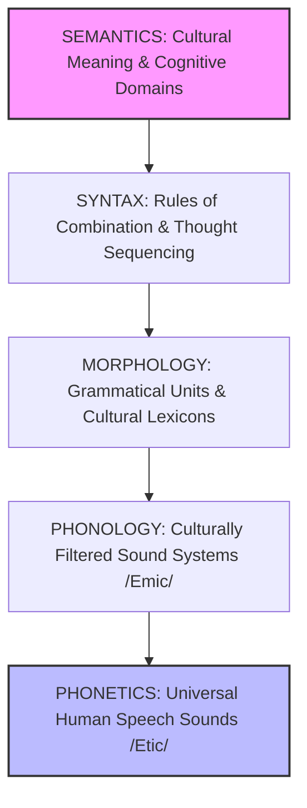
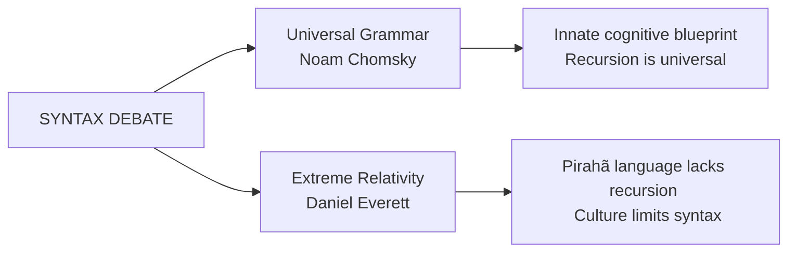

# VALUE ADD: Unit 2 - UNIT 7: LINGUISTIC ANTHROPOLOGY
**Date:** May 31, 2026 | **Target:** PAPER I — UNIT 7: LINGUISTIC ANTHROPOLOGY
**Syllabus Mapping:** Unit 2

# UPSC CSE ANTHROPOLOGY MAINS — HIGH-YIELD VALUE-ADDITION SHEET
## PAPER I — UNIT 7: TOPIC 2 (STRUCTURE OF LANGUAGE)

---

## I. THE STRUCTURAL ARCHITECTURE OF LANGUAGE

In linguistic anthropology, the structure of language is not analyzed in a cultural vacuum. Instead, each structural level—from raw sound to complex meaning—is viewed as a cognitive and cultural map used by a community to categorize and navigate reality.



### Comparative Matrix of the Five Structural Pillars

| Structural Level | Linguistic Definition | Anthropological Significance | Key Thinker / Concept |
| :--- | :--- | :--- | :--- |
| **Phonetics** | Study of physical speech sounds (production, transmission, reception). | Represents the **Etic** domain: the objective, universal biological capacity of humans to produce sounds. | **International Phonetic Alphabet (IPA)** |
| **Phonology** | Study of how sounds are organized into distinctive, contrastive units (phonemes) in a specific language. | Represents the **Emic** domain: how a specific culture filters raw sound to create meaningful contrasts. | **Kenneth Pike** (Emic/Etic distinction) |
| **Morphology** | Study of word formation and the smallest units of meaning (morphemes). | Reveals how cultures package concepts. High morphological complexity often reflects ecological/cultural needs. | **Edward Sapir** (Typology of languages) |
| **Syntax** | Rules governing sentence construction and word order. | Reflects how the human mind organizes actions, actors, and time. | **Noam Chomsky** (Universal Grammar & Recursion) |
| **Semantics** | Study of meaning systems, words, and sentences. | Maps the cognitive classifications, kinship structures, and taxonomies of a society. | **Ward Goodenough** (Componential Analysis) |

---

## II. DEEP-DIVE & METHODOLOGICAL VALUE-ADDS

### 1. Phonetics vs. Phonology: The Birth of Anthropological Methodology
The distinction between **Phonetics** (universal, objective) and **Phonology** (particular, subjective) is the direct ancestor of anthropology's most famous methodological paradigm: **Etic vs. Emic**, coined by missionary-linguist **Kenneth Pike** (1967).

```mermaid
grid-diagram
  | [PHONETICS] | [PHONOLOGY] |
  | Objective, universal acoustic data | Subjective, culture-specific sound systems |
  | "Etic" Perspective (The Anthropologist) | "Emic" Perspective (The Native Speaker) |
  | Example: Measuring the exact frequency of a vocalized click sound. | Example: Understanding that a "click" changes a word's meaning in Xhosa. |
```

*   **Allophones vs. Phonemes:** An *allophone* is a phonetic variation of a phoneme that does not change the meaning of a word (e.g., the aspirated $[p^h]$ in "pin" vs. the unaspirated $[p]$ in "spin"). 
*   **Anthropological Insight:** Cultures train their members to ignore phonetic differences (allophones) while remaining hyper-sensitive to phonemic differences. This is the exact mechanism of **cultural conditioning**—learning to ignore objective physical differences to maintain shared cultural categories.

### 2. Morphology: Cultural Packaging of Concepts
Morphology studies how **morphemes** (free and bound) combine. Anthropologists categorize languages morphologically to understand cognitive styles:

*   **Isolating Languages (e.g., Mandarin):** Each word typically consists of a single free morpheme.
*   **Polysynthetic Languages (e.g., Inuktitut, Navajo):** Highly complex words are formed by fusing numerous bound morphemes. A single word can function as an entire sentence.
    *   *Value-Add Example:* In **Inuktitut**, the word *tusaatsiarunnanngittualuujunga* translates to "I can't hear very well." This morphological synthesis shows how action, actor, and capability are cognitively integrated into a single holistic concept rather than fragmented into separate syntactic units.
*   **Allomorphy in Culture:** Just as allophones are sound variants, **allomorphs** are structural variants of a morpheme (e.g., the plural morpheme in English can sound like $/s/$ in "cats", $/z/$ in "dogs", or $/iz/$ in "buses"). This demonstrates how language maintains structural harmony (phonotactics) through subconscious rules.

### 3. Syntax: The Universalist vs. Relativist Debate
The study of syntax is the battleground between cognitive universalism and linguistic relativity.



*   **Noam Chomsky’s Generative Grammar:** Argues that all human brains possess an innate **Language Acquisition Device (LAD)** containing a **Universal Grammar (UG)**. The core of this universal grammar is **recursion** (the ability to embed phrases within phrases infinitely, e.g., "He said that she thought that I knew...").
*   **The Pirahã Challenge (Daniel Everett):** Everett’s ethnography of the Amazonian **Pirahã** tribe revealed a language that completely lacks recursion, numbers, or color terms. Everett argues that Pirahã culture values the **"Immediate Experience Principle" (IEP)**, which culturally restricts their syntax. This directly challenges Chomsky's theory of an innate, universal syntactic blueprint.

### 4. Semantics: Mapping the Cognitive Mind
To study native meaning systems, linguistic anthropologists use **Componential Analysis** (pioneered by **Ward Goodenough** and **Floyd Lounsbury**). This method deconstructs a semantic domain (such as kinship or plant names) into its basic, contrastive components.

#### Componential Analysis of English Kinship Terms (Example)
To map the semantic domain of "Kinship," we use binary features:
*   $\pm$ Male (Gender)
*   $\pm$ Lineal (Direct ancestors/descendants vs. collateral relatives like uncles/cousins)
*   $\pm$ Generation (Older, same, or younger)

| Term | Male | Lineal | Generation |
| :--- | :---: | :---: | :---: |
| **Father** | $+$ | $+$ | $+1$ |
| **Mother** | $-$ | $+$ | $+1$ |
| **Uncle** | $+$ | $-$ | $+1$ |
| **Brother** | $+$ | $+$ | $0$ |

*   **Anthropological Value:** By mapping these components, anthropologists can compare how different cultures classify their social world. For example, in **Dravidian kinship systems**, the semantic distinction between *cross-cousins* (marriageable) and *parallel-cousins* (taboo, viewed as siblings) is structurally encoded in the semantics of the language, directing actual social and marital behavior.

---

## III. PREMIUM CASE STUDIES FOR VALUE-ADDITION

### Case Study 1: The Pirahã Syntax and Cultural Constraint
*   **Ethnographer:** Daniel Everett
*   **Location:** Amazon Basin, Brazil
*   **Key Finding:** The Pirahã language lacks recursive syntax, relative clauses, and numbers.
*   **Anthropological Application:** Proves that **culture can override and constrain grammar**. The Pirahã value living strictly in the present; their grammar reflects this by only allowing sentences that describe direct, immediate experiences. This serves as a powerful critique of Chomsky's biological determinism in language.

### Case Study 2: Hanunóo Color Taxonomies (Semantics)
*   **Ethnographer:** Harold Conklin
*   **Location:** Mindoro Island, Philippines
*   **Key Finding:** The Hanunóo classify colors using a four-fold semantic system based on ecological utility rather than light wavelengths:
    1.  *Lalag* (dryness/undried)
    2.  *Latuy* (wetness/greenness/freshness)
    3.  *Biru* (darkness/blackness)
    4.  *Bara* (lightness/whiteness)
*   **Anthropological Application:** Demonstrates that semantic domains are organized around **ecological adaptation**. A wet, green bamboo stalk and a dry, brown leaf are classified not just by visual hue, but by their structural utility and moisture content.

### Case Study 3: Navajo Verb Categories (Syntax & Morphology)
*   **Linguist/Anthropologist:** Harry Hoijer (analyzing Edward Sapir's data)
*   **Key Finding:** In the Navajo language, verbs of motion require different prefixes depending on the physical shape of the object being moved (e.g., round objects, long thin flexible objects, plural objects).
*   **Anthropological Application:** The morphological structure of the verb forces Navajo speakers to constantly pay attention to the physical shape and material properties of their physical environment, illustrating a tight loop between grammar and environmental awareness.

---

## IV. UPSC REVISION CHEAT-SHEET

```
                       [STRUCTURE OF LANGUAGE]
                                  |
         +------------------------+------------------------+
         |                                                 |
   [SOUND SYSTEMS]                                  [MEANING SYSTEMS]
         |                                                 |
   Phonetics (Etic)                                 Morphology (Morphemes)
   - Universal sounds                               - Isolating vs. Polysynthetic
   - IPA acoustic data                              - Allomorphs (structural harmony)
         |                                                 |
   Phonology (Emic)                                 Syntax (Sentence rules)
   - Culturally filtered                            - Chomsky: Innate Recursion
   - Phonemes (meaningful)                          - Everett: Cultural constraints
         |                                                 |
         +-------------------------------------------------+
                                  |
                          Semantics (Meaning)
                          - Componential Analysis
                          - Cognitive Taxonomies (Conklin)
```

### Quick Recall Mnemonics
*   **P**ike's **P**honology is **P**articular (**Emic**).
*   **P**honetics is **P**hysical and **P**an-human (**Etic**).
*   **C**homsky = **C**ognitive **C**onstancy (Universal Grammar).
*   **E**verett = **E**mpirical **E**xperience (Culture limits syntax).

### High-Yield Answer Writing Blueprint
If a question on **"Structure of Language"** is asked (10/15/20 Marks):
1.  **Introduction:** Define language structure as a hierarchical system of levels (Phonetics $\rightarrow$ Semantics) that acts as a cognitive blueprint for culture.
2.  **Body Paragraph 1 (Sounds):** Contrast Phonetics (Etic) and Phonology (Emic). Cite **Kenneth Pike**. Explain how this distinction created the methodological backbone of cognitive anthropology.
3.  **Body Paragraph 2 (Words):** Discuss Morphology. Explain free/bound morphemes and allomorphs. Use the **Inuktitut** polysynthesis example to show how morphological complexity matches ecological needs.
4.  **Body Paragraph 3 (Sentences):** Discuss Syntax. Contrast **Chomsky's Universal Grammar** (Recursion) with **Daniel Everett's Pirahã case study** (Cultural constraint on grammar).
5.  **Body Paragraph 4 (Meaning):** Discuss Semantics. Explain **Componential Analysis** (Goodenough) using a quick kinship matrix (Father/Mother/Uncle) and cite **Harold Conklin's Hanunóo color study**.
6.  **Conclusion:** Conclude that the structure of language is not merely a set of formal rules, but a dynamic, culturally-embedded cognitive tool that shapes how humans perceive, organize, and interact with their world.