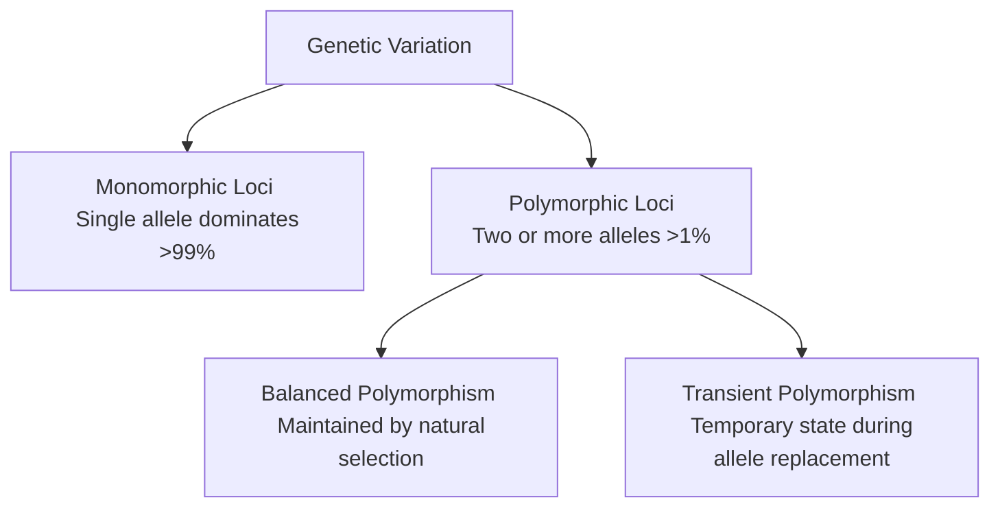
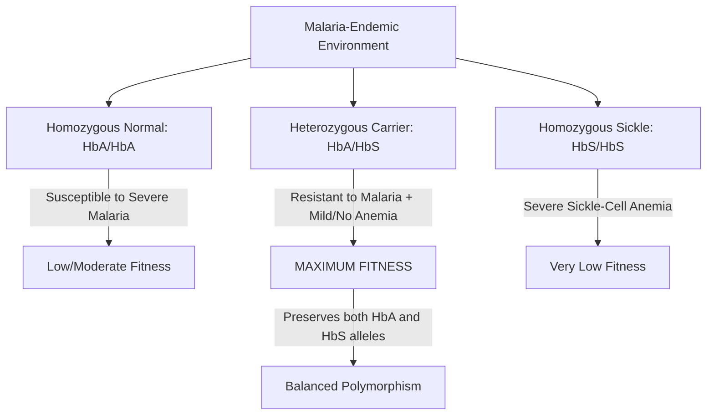
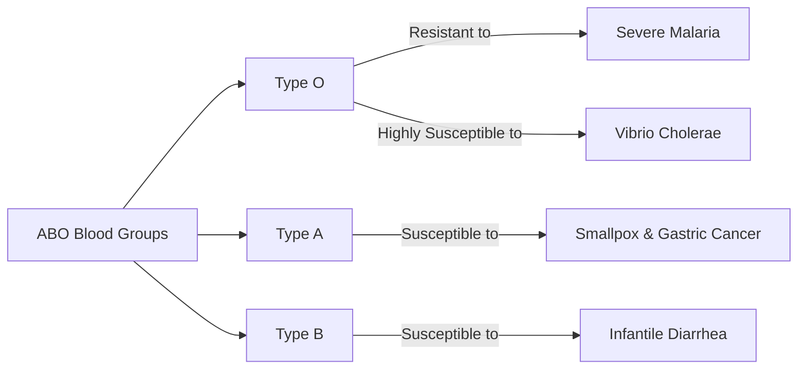
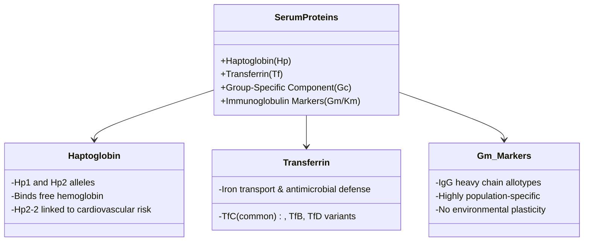

# VALUE ADD: Unit 9.3 - UNIT 9.5: RACE AND RACISM
**Date:** June 05, 2026 | **Target:** PAPER I — UNIT 9.5: RACE AND RACISM
**Syllabus Mapping:** Unit 9.3

# PAPER I — UNIT 9.3: GENETIC POLYMORPHISM

---

## TOPIC 1: THE CONCEPT OF GENETIC POLYMORPHISM

### I. DEFINITION & CORE CRITERIA

In biological anthropology, **Genetic Polymorphism** is the key mechanism used to understand genetic variation, adaptation, and microevolutionary dynamics within and between human populations.



* **The Classical Definition (E.B. Ford, 1940):** 
  > *"Genetic polymorphism is the occurrence together in the same locality of two or more discontinuous forms of a species in such proportions that the rarest of them cannot be maintained merely by recurrent mutation."*
* **The Quantitative Threshold:** For a genetic locus to be considered polymorphic, the frequency of the most common allele must be **less than 99%**, meaning the variant allele(s) must have a frequency of **at least 1%** in the population. If the variant is present at $<1\%$, it is classified as a rare mutation rather than a polymorphism.
* **Anthropological Significance:** Polymorphisms serve as neutral or adaptive genetic markers. They allow physical anthropologists to trace human migrations, reconstruct phylogenetic relationships, and study how natural selection operates in different ecological niches.

---

## TOPIC 2: BALANCED VS. TRANSIENT POLYMORPHISM

The evolutionary trajectory of polymorphic alleles is governed by natural selection, genetic drift, and gene flow. Anthropologists classify polymorphisms into two primary functional categories:

| Feature | Balanced Polymorphism | Transient Polymorphism |
| :--- | :--- | :--- |
| **Definition** | A state where two or more alleles are actively maintained in a population's gene pool at stable frequencies over many generations. | A temporary evolutionary state where one allele is progressively replacing another due to a shift in selection pressure. |
| **Primary Mechanism** | **Heterozygote Advantage (Overdominance)**: The heterozygote ($Aa$) has higher Darwinian fitness than either homozygote ($AA$ or $aa$). | **Directional Selection**: One homozygote has a distinct survival advantage over all other genotypes. |
| **Allele Frequency** | Remains stable and in equilibrium over time. | Constantly shifting; the favored allele moves toward fixation ($1.0$), while the unfavored allele moves toward elimination ($0.0$). |
| **Mathematical Model** | $$W_{Aa} > W_{AA} \quad \text{and} \quad W_{Aa} > W_{aa}$$ *(where $W$ represents relative fitness)* | $$W_{AA} > W_{Aa} > W_{aa}$$ *(assuming $A$ is the favored dominant allele)* |
| **Classic Human Example** | Sickle-Cell Trait ($HbA/HbS$) in malaria-endemic regions. | Color blindness in industrializing societies (due to relaxation of selection pressure). |

---

### I. BALANCED POLYMORPHISM: THE MECHANISM OF HETEROZYGOTE ADVANTAGE

Balanced polymorphism occurs when natural selection actively works to preserve genetic diversity. It prevents any single allele from achieving fixation because the homozygous states are selected against, while the heterozygous state is favored.



#### The Haldane Malaria Hypothesis (1949)
British geneticist **J.B.S. Haldane** was the first to suggest that red blood cell polymorphisms (like Thalassemia and Sickle-cell) were maintained in human populations because they provided protection against severe malaria (*Plasmodium falciparum*). This hypothesis remains the cornerstone of human evolutionary genetics.

---

### II. TRANSIENT POLYMORPHISM: THE MECHANISM OF DIRECTIONAL SELECTION

Transient polymorphism represents an evolutionary transition state. It occurs when an environmental change alters selection pressures, making a previously neutral or disadvantageous allele highly advantageous.

* **The Process:**
  1. A population is in equilibrium.
  2. Environmental change occurs (e.g., urbanization, dietary shifts, new pathogens).
  3. A rare allele ($A_2$) becomes highly favored over the wild-type allele ($A_1$).
  4. The frequency of $A_2$ rises steadily from $<1\%$ toward $100\%$.
  5. During this transitional phase, the locus is polymorphic. Once $A_2$ reaches fixation, the locus becomes monomorphic again.

---

## TOPIC 3: HIGH-YIELD HUMAN EXAMPLES OF POLYMORPHISM

---

### I. HEMOGLOBINOPATHIES (BALANCED POLYMORPHISMS)

#### 1. Sickle-Cell Anemia ($HbS$)
* **Molecular Basis:** A single-point mutation (missense mutation) in the $\beta$-globin gene on chromosome 11. The codon **GAG** (coding for Glutamic Acid) is mutated to **GTG** (coding for Valine) at the 6th position of the $\beta$-polypeptide chain.
* **Phenotypic Expression:**
  * **$HbA/HbA$ (Normal):** Normal oxygen transport, but highly susceptible to *Plasmodium falciparum* malaria.
  * **$HbS/HbS$ (Sickle-Cell Disease):** Red blood cells sickle under low oxygen tension, causing vaso-occlusive crises, severe anemia, and early mortality.
  * **$HbA/HbS$ (Sickle-Cell Trait/Heterozygote):** Red blood cells sickle only under extreme hypoxia. These individuals have normal lifespans and are highly resistant to malaria.
* **The Protective Mechanism:** *Plasmodium* parasites infect red blood cells and consume hemoglobin. In $HbA/HbS$ individuals, the presence of the parasite causes the cell to sickle prematurely. The spleen recognizes these damaged, sickled cells and destroys them, killing the parasite before it can complete its life cycle.
* **Key Anthropological Study:** **Anthony Allison (1954)** mapped the distribution of the $HbS$ allele in East Africa. He demonstrated a direct, statistically significant correlation between high $HbS$ allele frequencies (up to 20%) and areas with high malaria endemicity.

```
[Normal Red Blood Cell]  ---> Infected by Plasmodium ---> Parasite reproduces ---> Severe Malaria (HbA/HbA)
[Sickle-Carrier Cell]    ---> Infected by Plasmodium ---> Cell sickles & ruptures ---> Parasite dies (HbA/HbS)
```

#### 2. Thalassemia ($\alpha$ and $\beta$)
* **Molecular Basis:** Quantitative mutations (deletions or point mutations) that reduce or completely halt the synthesis of $\alpha$ or $\beta$-globin polypeptide chains. This leads to an imbalance in globin chains, causing ineffective erythropoiesis and microcytic anemia.
* **Balanced Polymorphism:**
  * Homozygotes ($\beta$-Thalassemia Major) suffer from life-threatening anemia requiring lifelong blood transfusions.
  * Heterozygotes ($\beta$-Thalassemia Minor) exhibit mild, asymptomatic anemia but possess significant resistance to coronary heart disease and *Plasmodium falciparum* malaria.
* **Geographic Distribution:** Highly prevalent in the Mediterranean basin, Middle East, India, and Southeast Asia (the historical "malaria belt").

---

### II. ENZYMOPATHIES

#### 1. Glucose-6-Phosphate Dehydrogenase (G6PD) Deficiency
* **Molecular Basis:** An X-linked recessive hereditary polymorphism caused by mutations in the *G6PD* gene. G6PD is a critical housekeeping enzyme that protects red blood cells from oxidative damage via the pentose phosphate pathway.
* **Phenotypic Expression:**
  * Affected males (hemizygous, $X^dY$) and homozygous females ($X^dX^d$) experience acute hemolytic anemia when exposed to oxidative stressors. These stressors include fava beans (**Favism**) or antimalarial drugs like primaquine.
  * Heterozygous females ($X^DX^d$) exhibit mosaicism due to random X-chromosome inactivation (Lyonization). This provides them with a balanced, protective advantage against malaria without severe hemolytic risk.
* **The Protective Mechanism:** G6PD-deficient red blood cells have high levels of oxidative stress. This environment inhibits the growth and maturation of *Plasmodium falciparum* parasites, which require host cell enzymes to replicate.

---

### III. SENSORY POLYMORPHISMS (TRANSIENT/SELECTION RELAXATION)

#### 1. Color Blindness (Red-Green)
* **Genetic Basis:** X-linked recessive mutations affecting the photopigment genes (opsins) on the long arm of the X chromosome ($Xq28$).
* **Anthropological Theory (Post-Neel Hypothesis):**
  * **The Hypothesis:** Formulated by **Richard Post (1962)** and **James V. Neel**. They argued that in primitive hunter-gatherer societies, natural selection operated stringently against color blindness. Individuals with impaired color vision could not easily spot predators, track game, or identify ripe fruits, keeping allele frequencies extremely low ($<1\%$).
  * **Relaxation of Selection:** With the transition to agriculture, pastoralism, and industrialization, the survival necessity for acute color vision was relaxed. Consequently, mutations accumulated, and the allele frequency rose to polymorphic levels (5–10% in European males) via **transient polymorphism** driven by mutation-selection balance relaxation.

---

### IV. SEROLOGICAL & IMMUNOLOGICAL POLYMORPHISMS

#### 1. The ABO Blood Group System
* **Genetic Basis:** Codominant tri-allelic system ($I^A$, $I^B$, $I^O$) located on chromosome 9.
* **Balanced Polymorphism via Disease Association:** The ABO polymorphism is maintained because different blood groups provide varying susceptibility and resistance to historical infectious diseases:



* **The Evolutionary Balance:** No single blood group is universally superior. Type O individuals survive malaria epidemics but are highly vulnerable to cholera outbreaks. This shifting landscape of infectious diseases maintains all three alleles in the global gene pool.

#### 2. The Rh Blood Group System (D Antigen)
* **Genetic Basis:** Determined by two highly homologous genes, *RHD* and *RHCE*, on chromosome 1. The presence of the D antigen denotes Rh-positive ($Rh+$), while its absence denotes Rh-negative ($Rh-$).
* **Maternal-Fetal Incompatibility (Selection Against Heterozygotes):**
  * When an $Rh-$ mother carries an $Rh+$ fetus, fetal red blood cells can enter the maternal circulation during childbirth. This triggers the production of maternal anti-D IgG antibodies.
  * In subsequent pregnancies, these antibodies cross the placenta, causing **Erythroblastosis Fetalis** (Hemolytic Disease of the Newborn), which can be fatal to the heterozygous fetus.
* **The Evolutionary Paradox:** Because selection acts directly against the heterozygote ($Dd$), this system should theoretically drive the rarer allele ($d$) to extinction. The persistence of the $Rh-$ polymorphism in European populations (up to 15-16%) is an active area of study. It is likely maintained by gene flow, historical founder effects, or unrecognized compensating selective advantages.

---

### V. BIOCHEMICAL/SERUM PROTEIN POLYMORPHISMS

These serum proteins are highly valuable in physical anthropology. Because they are less influenced by immediate environmental pressures than morphological traits, they serve as reliable markers for population genetics.



#### 1. Haptoglobin (Hp)
* **Function:** An acute-phase plasma glycoprotein synthesized by the liver. Its primary role is to bind free hemoglobin released from ruptured red blood cells, preventing iron loss and kidney damage.
* **Polymorphic Alleles:** Controlled by two autosomal co-dominant alleles, $Hp^1$ and $Hp^2$, yielding three common genotypes: $Hp\text{ 1-1}$, $Hp\text{ 2-1}$, and $Hp\text{ 2-2}$.
* **Anthropological Applications:**
  * **$Hp^1$ Allele:** Prevalent in African populations. It is a highly efficient binder of hemoglobin, offering superior protection against oxidative stress during hemolytic events like malaria.
  * **$Hp^2$ Allele:** Highly prevalent in India and East Asia. The $Hp\text{ 2-2}$ phenotype is a weaker antioxidant and is clinically associated with an increased risk of cardiovascular disease and diabetic nephropathy.

#### 2. Transferrin (Tf)
* **Function:** A beta-globulin glycoprotein that binds and transports iron through the blood plasma to the bone marrow and tissue cells. It also plays a role in innate immunity by withholding iron from circulating bacteria.
* **Polymorphic Alleles:** The locus on chromosome 3 displays extensive polymorphism. The most common allele globally is $Tf^C$ (with sub-variants $Tf^{C1}$, $Tf^{C2}$, $Tf^{C3}$). The rarer variants are classified as $Tf^B$ (fast-migrating electrophoretically) and $Tf^D$ (slow-migrating).
* **Anthropological Applications:**
  * The $Tf^{D_{Chi}}$ variant is a highly specific genetic marker for Mongoloid populations.
  * The $Tf^{D1}$ variant is highly characteristic of indigenous Australian Aborigines and African populations, making transferrin a key tool for reconstructing ancestral migration routes.

#### 3. Gm and Km Markers (Immunoglobulins)
* **Function:** Genetic markers located on the heavy chains of Immunoglobulin G (Gm markers) and the kappa light chains of immunoglobulins (Km markers).
* **Anthropological Value:** These markers are highly polymorphic and codominantly inherited. Unlike morphological traits, they are completely unaffected by climate, diet, or lifestyle. This lack of environmental plasticity makes them exceptionally reliable for:
  * Calculating admixture proportions in hybrid populations (e.g., mapping European-Native American gene flow).
  * Tracing the precise migration waves of early humans across continents.

---

## TOPIC 4: THINKERS, ANTHROPOLOGISTS, AND KEY STUDIES

To secure high marks in the CSE Mains, answers must be anchored in the work of key physical anthropologists and geneticists:

| Thinker / Scholar | Key Contribution | Anthropological Significance |
| :--- | :--- | :--- |
| **E.B. Ford (1940)** | Formulated the classic definition of genetic polymorphism. | Established the mathematical and ecological framework for studying genetic variation in wild populations. |
| **J.B.S. Haldane (1949)** | Proposed the **Malaria Hypothesis**. | First to link human genetic diseases (Thalassemia) to an evolutionary survival advantage against infectious pathogens. |
| **Anthony Allison (1954)** | Conducted empirical field studies on the Sickle-Cell trait in East Africa. | Provided the first concrete, empirical proof of natural selection maintaining a balanced polymorphism in human populations. |
| **Richard Post (1962)** | Developed the **Relaxation of Selection Hypothesis** for color blindness. | Explained how cultural transitions (hunter-gatherer to agricultural/industrial) directly alter genetic selection pressures. |
| **Richard Lewontin (1972)** | Used gel electrophoresis to study protein polymorphisms. | Demonstrated that **85% of human genetic variation occurs within populations**, proving that traditional racial categories are biologically invalid. |

---

## TOPIC 5: INDIAN CONTEXT & VALUE-ADD CASE STUDIES

Integrating Indian case studies is essential for demonstrating a strong grasp of Paper I concepts applied to Indian populations (Paper II connection).

```mermaid
map -- Regional Distribution of Polymorphisms in India --> North
map --> Central_Deccan
map --> South

North[Parsis & Mediterranean Descendants] -->|High Frequency| G6PD[G6PD Deficiency]
Central_Deccan[Gond, Bhil, Santhal, Toda Tribes] -->|Up to 35% Carrier Rate| HbS[Sickle-Cell Allele HbS]
South[Nilgiri Tribes e.g., Soligas] -->|Co-existence| HbS_Thal[HbS and Beta-Thalassemia]
```

### I. THE SICKLE-CELL ANEMIA BELT IN TRIBAL INDIA
* **The Scenario:** The $HbS$ allele is highly prevalent across the "Sickle-Cell Belt" of Central, Western, and Southern India. This belt overlaps with historically malaria-endemic forest regions.
* **Key Populations:** High carrier frequencies (up to 35%) are documented among the **Gonds, Bhils, Santhals, Irulas, and Soligas**.
* **Policy Connection (Value Addition):** The Government of India launched the **National Sickle Cell Anemia Elimination Mission 2047** in 2023. This program aims to screen 70 million tribal and vulnerable individuals, utilizing genetic counseling to reduce the homozygous ($HbS/HbS$) disease burden while managing this evolutionary polymorphism.

### II. G6PD DEFICIENCY IN THE PARSI POPULATION
* **The Scenario:** The Parsi community in India exhibits one of the highest frequencies of G6PD deficiency in the country (up to 12-15%).
* **Anthropological Explanation:** This high frequency is a product of historical founder effects, strict community endogamy, and ancestral geographic origins in the Mediterranean/Middle East, where the mutation originally provided protection against malaria.

### III. THE ORAON AND MUNDA TRIBES (HAPTOGLOBIN VARIATION)
* **The Scenario:** Genetic surveys among the Chota Nagpur tribes (Oraon, Munda, Birhor) reveal an exceptionally high frequency of the **$Hp^2$ allele** ($>80\%$).
* **Significance:** This high frequency aligns with broader South Asian trends. It serves as a genetic signature that distinguishes these populations from African groups (where $Hp^1$ dominates), helping anthropologists map early migration waves along the Southern Coastal Route.

---

## TOPIC 6: UPSC PRACTICE QUESTIONS (HIGH-YIELD)

1. **"Define genetic polymorphism. Critically analyze how balanced polymorphism is maintained in human populations with suitable examples."** (20 Marks)
2. **"What is transient polymorphism? Discuss the 'relaxation of selection' hypothesis with reference to color blindness."** (15 Marks)
3. **"Write short notes on:"**
   * (a) Haldane's Malaria Hypothesis (10 Marks)
   * (b) Biochemical polymorphisms as markers of population migration (10 Marks)
   * (c) Erythroblastosis Fetalis and selection against the heterozygote (10 Marks)
4. **"Illustrate the anthropological significance of G6PD deficiency and Thalassemia in reconstructing human microevolutionary history."** (15 Marks)