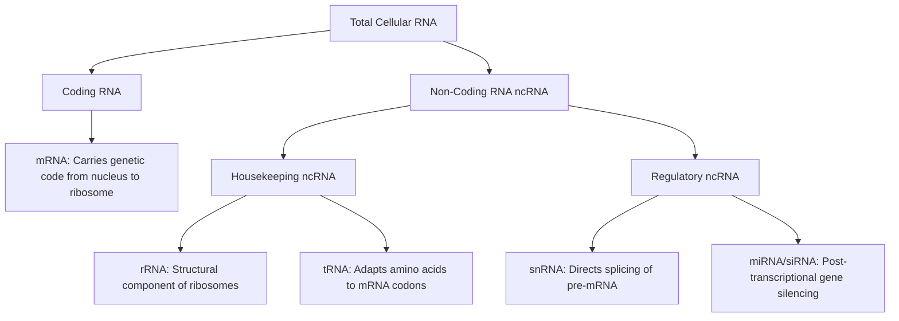

# VALUE ADD: Unit 1.7 - Chromosomes, DNA, and Chromosomal Aberrations
**Date:** May 31, 2026 | **Target:** Chromosomes, DNA, and Chromosomal Aberrations
**Syllabus Mapping:** Unit 1.7

# UPSC Anthropology Paper I — Unit 1.7: The Biological Basis of Life
## High-Yield Revision & Value-Addition Study Material

---

## 1. Advanced DNA Structure & Variations

While the standard Watson-Crick model (B-DNA) is the most common, physical anthropologists and geneticists analyze alternative structural forms and non-nuclear DNA to study human evolution, gene regulation, and adaptation.

### A. Structural Polymorphism of DNA
DNA is dynamic and can exist in three major conformational states:

| Feature | B-DNA | A-DNA | Z-DNA |
| :--- | :--- | :--- | :--- |
| **Helix Handedness** | Right-handed | Right-handed | **Left-handed** |
| **Base Pairs per Turn** | 10.5 | 11 | 12 |
| **Structure** | Standard, hydrated form found in physiological conditions. | Dehydrated, wider, and shorter form. | Zig-zag backbone; occurs in GC-rich regions; linked to active gene transcription regulation. |

### B. Nuclear DNA (nDNA) vs. Mitochondrial DNA (mtDNA)
In evolutionary anthropology, comparing nDNA and mtDNA is vital for reconstructing human phylogenies and migration routes.

```
       Nuclear DNA (nDNA)                     Mitochondrial DNA (mtDNA)
     ┌──────────────────────┐                 ┌────────────────────────┐
     │  - Linear            │                 │  - Circular            │
     │  - 3.2 Billion bp    │                 │  - 16,569 bp           │
     │  - Bi-parental       │                 │  - Maternal only       │
     │  - Low mutation rate │                 │  - High mutation rate  │
     │  - Recombines        │                 │  - No recombination    │
     └──────────────────────┘                 └────────────────────────┘
```

* **The Anthropological Utility of mtDNA:**
  * **No Recombination:** mtDNA is inherited as a single, intact unit (haplogroup) from the mother, allowing clean lineage tracing without the shuffling effects of meiosis.
  * **High Mutation Rate (10x higher than nDNA):** Acts as a highly sensitive **molecular clock** to date recent evolutionary events (e.g., the emergence of anatomically modern humans).
  * **High Copy Number:** Each cell contains thousands of mitochondria, making mtDNA much easier to extract from ancient skeletal remains (fossils) than single-copy nuclear DNA.

---

## 2. DNA Replication: Molecular Machinery & The End-Replication Problem

DNA replication must occur with extreme fidelity to prevent catastrophic mutational loads in human populations.

### A. The Replication Fork Machinery
During the S-phase of the cell cycle, replication proceeds semi-conservatively through a coordinated enzymatic complex:

```
                  5' ─────────────────────────── Leading Strand (Continuous)
                    \  <-- [DNA Polymerase III]
                     \
5' ──[Helicase]───────\───────────────────────── 3' Template Strand
     (Unwinds DNA)     \
                        \
3' ──────────────────────\─── [Okazaki Fragment] ── [RNA Primer] ── 5' Lagging Strand
                              <-- [DNA Polymerase III] (Discontinuous)
```

1. **Helicase:** Unwinds the double helix, breaking hydrogen bonds.
2. **Single-Stranded Binding Proteins (SSBs):** Stabilize the unwound single strands to prevent premature re-annealing.
3. **Topoisomerase (Gyrase):** Relieves torsional strain ahead of the replication fork.
4. **Primase:** Lays down a short RNA primer (providing the essential 3'-OH group).
5. **DNA Polymerase III:** Synthesizes the new strand by adding complementary nucleotides in the $5' \to 3'$ direction.
   * **Leading Strand:** Synthesized continuously toward the replication fork.
   * **Lagging Strand:** Synthesized discontinuously away from the fork, creating **Okazaki fragments**.
6. **DNA Polymerase I:** Removes RNA primers and replaces them with DNA nucleotides.
7. **DNA Ligase:** Seals the nicks in the sugar-phosphate backbone, joining Okazaki fragments.

### B. The End-Replication Problem & Evolutionary Aging
Because DNA Polymerase requires an existing primer to initiate synthesis, it cannot replicate the very $3'$ end of the lagging strand template once the terminal RNA primer is removed.
* **The Consequence:** Chromosomes shorten with each round of replication.
* **The Solution:** **Telomeres** (repetitive, non-coding $TTAGGG$ sequences) act as protective caps. 
* **Anthropological Relevance:** Telomere attrition rates vary among human populations and are used as biomarkers for biological aging, chronic environmental stress, and life-history trade-offs.

---

## 3. RNA Diversity & The Transcription-Translation Apparatus

Protein synthesis is the mechanism by which the genotype is expressed as the phenotype. This process relies on diverse RNA species.

### A. Functional Classification of RNA



### B. Transcription: From Gene to pre-mRNA
Occurs in the nucleus. RNA Polymerase II binds to the **promoter region** (e.g., the TATA box) and synthesizes single-stranded pre-mRNA.

#### Post-Transcriptional Modifications (Eukaryotes only):
Before leaving the nucleus, the pre-mRNA must be processed to protect it from cytoplasmic degradation and to remove non-coding regions:
1. **5' Capping:** A modified guanine nucleotide ($7$-methylguanosine) is added to the $5'$ end.
2. **3' Polyadenylation:** A tail of 100–250 adenine residues (Poly-A tail) is added to the $3'$ end.
3. **Splicing:** **Spliceosomes** (composed of snRNPs) excise non-coding **introns** and ligate coding **exons** together.

> [!KEY-CONCEPT]
> **Alternative Splicing:** A single pre-mRNA can be spliced in multiple ways, allowing one gene to code for several distinct proteins. This explains how the human genome, with only ~20,000 protein-coding genes, can produce over 100,000 unique proteins. This protein diversity drives complex physiological adaptations.

### C. Translation: Decoding the Message
Occurs in the cytoplasm on ribosomes.

```
       tRNA Cloverleaf Structure (Functional Domains)
       
                 Acceptor Stem (3' End)
                     │  - Holds Amino Acid (e.g., Methionine)
                     ▼
                   [ACC]
                     │
                 ┌───┴───┐
                 │       │
        D-Loop  ◄│       │► TΨC Loop
                 │       │
                 └───┬───┘
                     │
                     ▼
                 [Anticodon]  <-- Pairs with mRNA Codon (e.g., AUG)
```

1. **Initiation:** The small ribosomal subunit binds to the $5'$ cap of the mRNA, scans for the start codon (**AUG**), and recruits the initiator tRNA carrying Methionine.
2. **Elongation:** The ribosome has three sites: **A (Aminoacyl)**, **P (Peptidyl)**, and **E (Exit)**.
   * The incoming tRNA enters the **A site**.
   * A peptide bond is formed between the amino acid in the **A site** and the growing chain in the **P site**.
   * The ribosome translocates, moving the empty tRNA to the **E site** for release.
3. **Termination:** When a stop codon (**UAA, UAG, UGA**) enters the A site, release factors bind, causing the completed polypeptide chain to dissociate.

> [!TIP]
> **The Wobble Hypothesis (Francis Crick, 1966):** The pairing between the $3'$ base of the mRNA codon and the $5'$ base of the tRNA anticodon is loose (non-standard). This allows a single tRNA anticodon to recognize multiple codons, explaining why 61 codons require only ~31 distinct tRNAs.

---

## 4. Anthropological & Evolutionary Value-Add Case Studies

### Case Study 1: Paleogenomics & Svante Pääbo’s Nobel-Winning Methodology
* **Context:** Extracting and sequencing ancient DNA (aDNA) from hominin fossils (e.g., Neanderthals, Denisovans) revolutionized physical anthropology.
* **The Biological Challenge:** Upon death, cellular DNA replication machinery stops. Endogenous nucleases and environmental factors degrade DNA into short fragments (often $<50$ base pairs). 
* **The Chemical Challenge (Deamination):** Over time, cytosine bases lose their amine group to become uracil ($C \to U$ transition). During subsequent PCR amplification (which mimics DNA replication), DNA polymerase reads Uracil ($U$) as Thymine ($T$), leading to artificial $C \to T$ mutations at the ends of ancient DNA fragments.
* **Anthropological Application:** Svante Pääbo developed biochemical protocols to enzymatically repair these deaminated ends before sequencing. This allowed the reconstruction of the Neanderthal genome, proving that modern non-African populations carry 1–2% Neanderthal DNA due to ancient hybridization.

### Case Study 2: Mitochondrial Eve & The Out-of-Africa Model
* **Context:** Tracing the maternal lineage of modern humans.
* **The Biological Principle:** Because mtDNA does not undergo recombination, mutations accumulate sequentially along maternal lineages. By comparing the mtDNA of diverse global populations, researchers can construct a maternal phylogenetic tree.
* **The Discovery:** In 1987, Allan Wilson, Rebecca Cann, and Mark Stoneking analyzed mtDNA from diverse human populations. They traced the maternal ancestry of all living humans back to a single female ancestor—**"Mitochondrial Eve"**—who lived in Sub-Saharan Africa approximately 150,000 to 200,000 years ago.
* **Anthropological Significance:** This provided robust molecular support for the **"Recent Single Origin" (Out-of-Africa)** model of human evolution, refuting the extreme multiregional hypothesis.

### Case Study 3: Epigenetics as the Molecular Bridge for Phenotypic Plasticity
* **Context:** How human populations adapt to environmental stressors without changing their underlying DNA sequence.
* **The Biological Principle:** Epigenetic modifications alter gene expression without changing the nucleotide sequence.
  * **DNA Methylation:** Adding methyl groups to cytosine bases (typically at CpG islands) generally silences gene transcription.
  * **Histone Acetylation:** Adding acetyl groups to histone tails relaxes chromatin structure, promoting transcription.
* **The Case Study (The Dutch Hunger Winter, 1944–1945):** Children conceived during this severe famine had reduced DNA methylation of the *IGF2* (Insulin-like Growth Factor 2) gene. This epigenetic change persisted for decades, predisposing them to obesity, cardiovascular disease, and metabolic disorders in adulthood.
* **Anthropological Significance:** This demonstrates **phenotypic plasticity** at the molecular level. It shows how environmental stressors experienced by one generation can be biologically registered and transmitted to the next, providing a molecular mechanism for Franz Boas's classic observations on environmental influences on bodily form.

---

## 5. Thinkers, Researchers, and Key Publications Reference Table

When writing answers on Unit 1.7, citing the original researchers and their publications elevates the academic quality of your response.

| Thinker / Researcher | Landmark Discovery / Concept | Key Publication / Year | Anthropological Application |
| :--- | :--- | :--- | :--- |
| **James Watson & Francis Crick** | Double Helix structure of B-DNA. | *Nature* (1953) | Established the physical basis of heredity and molecular biology. |
| **Rosalind Franklin & Maurice Wilkins** | X-ray diffraction images of DNA (Photo 51). | *Nature* (1953) | Provided the critical structural data showing the helical nature of DNA. |
| **Matthew Meselson & Franklin Stahl** | Semi-conservative replication of DNA. | *PNAS* (1958) | Proved that each daughter DNA molecule contains one parental and one newly synthesized strand. |
| **Francis Crick** | The Central Dogma of Molecular Biology. | *Symposia of the Society for Experimental Biology* (1958) | Defined the unidirectional flow of genetic information ($DNA \to RNA \to \text{Protein}$). |
| **Allan Wilson, Rebecca Cann, & Mark Stoneking** | "Mitochondrial Eve" and African origin of modern humans. | *Nature* (1987) | Used mtDNA polymorphisms to map the maternal lineage and migration of modern *Homo sapiens*. |
| **Svante Pääbo** | Neanderthal genome sequencing and paleogenomics. | *Science* (2010) | Proved archaic hominin gene flow into modern human populations, establishing the field of paleogenomics. |

---

## 6. Quick-Reference Comparison: Transcription vs. Translation

| Feature | Transcription | Translation |
| :--- | :--- | :--- |
| **Location in Cell** | Nucleus (Eukaryotes) | Cytoplasm (on Ribosomes) |
| **Template** | Antisense DNA strand ($3' \to 5'$) | mRNA ($5' \to 3'$) |
| **Synthesized Product** | single-stranded RNA (mRNA, tRNA, or rRNA) | Polypeptide chain (Protein) |
| **Primary Enzyme / Machinery** | RNA Polymerase | Ribosome (rRNA + ribosomal proteins) and tRNA |
| **Monomers Used** | Ribonucleoside triphosphates (ATP, UTP, GTP, CTP) | Amino Acids |
| **Base Pairing Rule** | $A \to U$, $T \to A$, $C \to G$, $G \to C$ | Codon (mRNA) to Anticodon (tRNA) pairing |